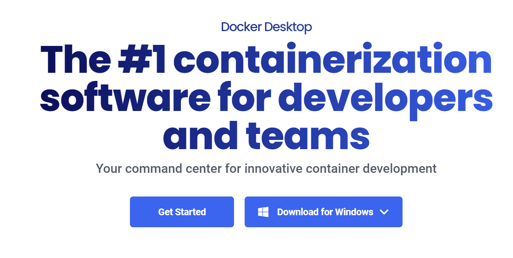
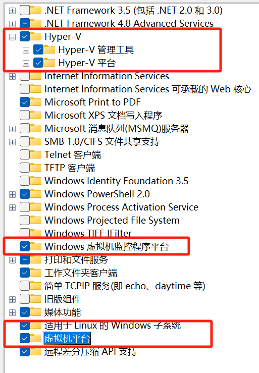
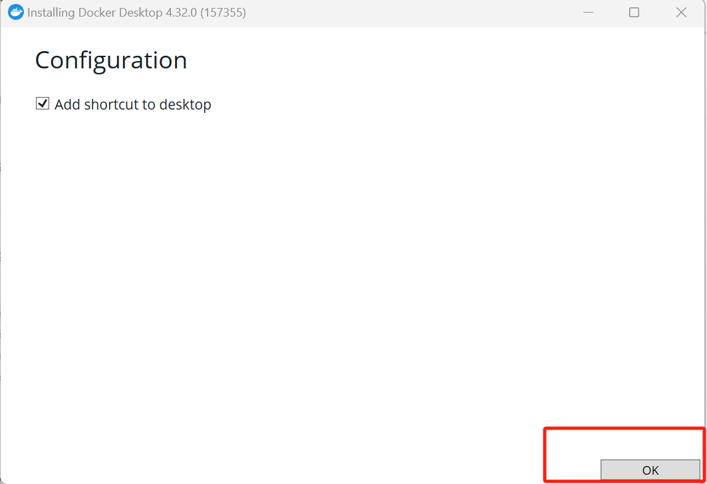
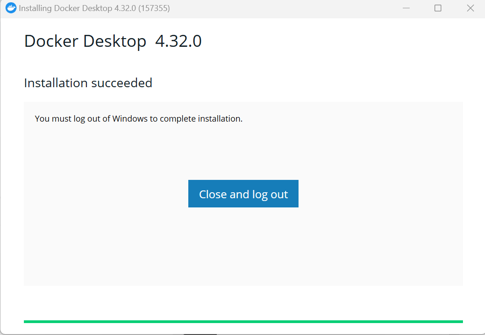
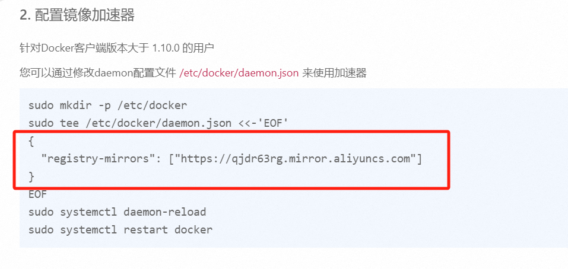
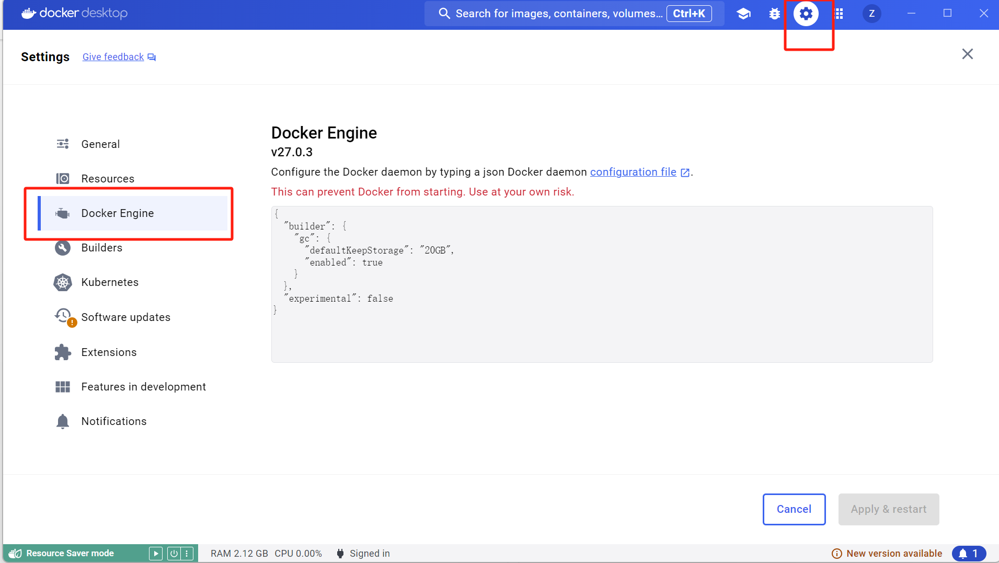
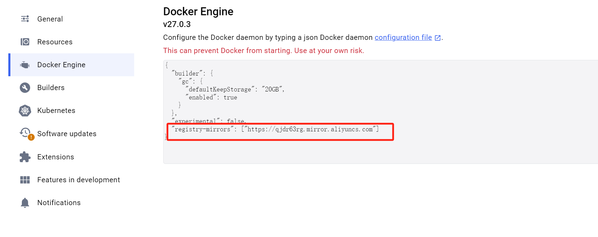

# Win11下Docker的安装

## Reference

- https://docker.easydoc.net/doc/81170005/cCewZWoN/lTKfePfP

- https://blog.csdn.net/joeyoj/article/details/136427362

## 1 Docker 是什么
Docker 是一个应用打包、分发、部署的工具. 

打包：就是把你软件运行所需的依赖、第三方库、软件打包到一起，变成一个安装包.

分发：你可以把你打包好的“安装包”上传到一个镜像仓库，其他人可以非常方便的获取和安装.

部署：拿着“安装包”就可以一个命令运行起来你的应用，自动模拟出一摸一样的运行环境，不管是在 Windows/Mac/Linux.

## 2 Docker 部署的优势

常规应用开发部署方式：自己在 Windows 上开发、测试 --> 到 Linux 服务器配置运行环境部署.

问题：我机器上跑都没问题，怎么到服务器就各种问题了.

用 Docker 开发部署流程：自己在 Windows 上开发、测试 --> 打包为 Docker 镜像（可以理解为软件安装包） --> 各种服务器上只需要一个命令部署好.

优点：确保了不同机器上跑都是一致的运行环境，不会出现我机器上跑正常，你机器跑就有问题的情况.

## 3 重要概念：镜像、容器

镜像：可以理解为软件安装包，可以方便的进行传播和安装.

容器：软件安装后的状态，每个软件运行环境都是独立的、隔离的，称之为容器.

## 4 Win下docker-desktop安装

1. 下载[docker-desktop](https://www.docker.com/products/docker-desktop/)

    <div style="text-align: center;">
    </div>

2. 安装`Microsoft Hyper-V`

    参考：https://blog.csdn.net/lihuiyun184291/article/details/123224733

    由于我的电脑系统是家庭版本，所以需要先安装`Microsoft Hyper-V`

    1. 将如下代码添加到记事本中，并另存为Hyper-V.cmd文件。代码如下：

        ```bash
        pushd "%~dp0"
        dir /b %SystemRoot%\servicing\Packages\*Hyper-V*.mum >hyper-v.txt
        for /f %%i in ('findstr /i . hyper-v.txt 2^>nul') do dism /online /norestart /add-package:"%SystemRoot%\servicing\Packages\%%i"
        del hyper-v.txt
        Dism /online /enable-feature /featurename:Microsoft-Hyper-V-All /LimitAccess /ALL
        ```

    2. 右键点击【Hyper-V.cmd】文件图标，在右键菜单中点击：以管理员身份运行.

    3. 程序跑好后，输入`Y`，电脑自动重启，进行配置更新.

        <div style="text-align: center;">
        </div>
    
    <br>

3. 启动`Microsoft Hyper-V`

    在电脑上打开“控制面板”->“程序”-> “启动或关闭Windows功能”，勾选以下内容

    <div style="text-align: center;">
    </div>

4. 安装docker

    1. 双击`Docker Desktop Installer.exe`

    2. 点击`OK`

        <div style="text-align: center;">
        </div>

    3. 点击`Close and log out`

        <div style="text-align: center;">
        </div>

    4. 点击`Accept`

        <div style="text-align: center;">
        </div>

    5. 默认勾选，点击`Finish`

        <div style="text-align: center;">
        </div>

## 5 配置镜像加速器

1. 进入[网址](https://cr.console.aliyun.com/cn-hangzhou/instances/mirrors)

2. 复制以下代码
    ```json
    "registry-mirrors": ["https://qjdr63rg.mirror.aliyuncs.com"]
    ```

    <div style="text-align: center;">
    </div>

3. 打开docker设置   

    <div style="text-align: center;">
    </div>

4. 修改如下
    <div style="text-align: center;">
    </div>

5. 点击`apply & restart`

