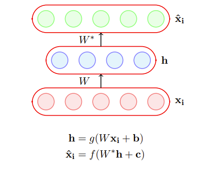
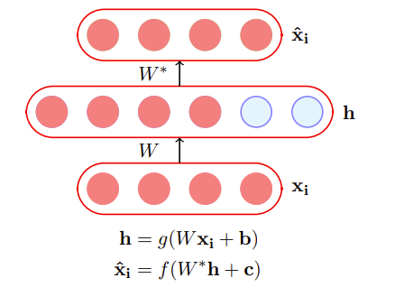
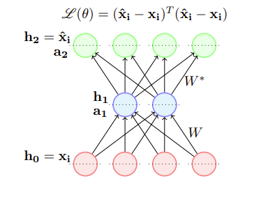
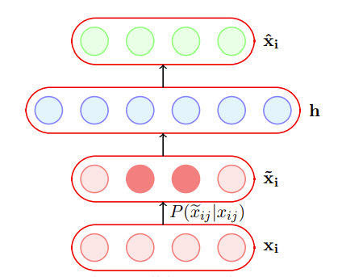
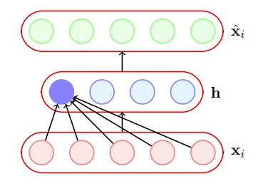
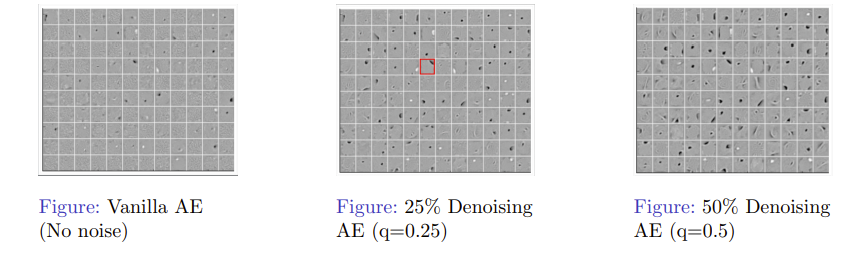

# 自编码器

## Reference

- https://www.cse.iitm.ac.in/~miteshk/CS7015/Slides/Handout/Lecture7.pdf

## 1 自编码器简介

自编码器是一种特殊类型的前馈神经网络，它执行以下操作：
1. 将输入 $x_{i}$ 编码为隐藏表示 $h$ . 
2. 从这个隐藏表示中再次解码输入. 

该模型通过训练来最小化某个损失函数，这将确保 $\hat{x}_{i}$ 接近 $x_{i}$（我们很快就会看到一些这样的损失函数）. 

让我们考虑 $dim(h)<dim(x_{i})$ 的情况. 如果我们仍然能够从 $h$ 完美地重建 $\hat{x}_{i}$，那么这对 $h$ 意味着什么呢？
- $h$ 是 $x_{i}$ 的无损编码. 它捕获了 $x_{i}$ 的所有重要特征. 

你能看出它与主成分分析（PCA）的相似之处吗？

当 $dim(h)<dim(x_{i})$ 时，这种自编码器被称为欠完备自编码器. 

当 $dim(h)\geq dim(x_{i})$ 时，这种自编码器被称为过完备自编码器. 

让我们考虑 $dim(h)\geq dim(x_{i})$ 的情况. 在这种情况下，自编码器可能会学习一种简单的编码方式，即简单地将 $x_{i}$ 复制到 $h$ 中，然后再将 $h$ 复制到 $\hat{x}_{i}$ 中. 在实践中，这种恒等编码是无用的，因为它并没有真正告诉我们关于数据重要特征的任何信息. 

### 后续方向
1. $f(x_{i})$ 和 $g(x_{i})$ 的选择. 
2. 损失函数的选择. 

假设我们所有的输入都是二进制的（每个 $x_{ij} \in \{0,1\}$），$g$通常被选为sigmoid函数. 对于解码器，以下哪个函数最合适？

1. $\hat{x}_{i}=\tanh (W^{*}h + c)$
2. $\hat{x}_{i}=W^{*}h + c$
3. $\hat{x}_{i}=\text{logistic}(W^{*}h + c)$

答案是logistic函数，因为它自然地将所有输出限制在0到1之间. 

假设我们所有的输入都是实数（每个$x_{ij} \in \mathbb{R}$），$g$通常也被选为sigmoid函数. 对于解码器，以下哪个函数最合适？

1. $\hat{x}_{i}=\tanh (W^{*}h + c)$
2. $\hat{x}_{i}=W^{*}h + c$
3. $\hat{x}_{i}=\text{logistic}(W^{*}h + c)$

logistic和tanh函数会将重建的 $\hat{x}_{i}$ 限制在 $[0,1]$ 或 $[-1,1]$ 之间，而我们希望 $\hat{x}_{i} \in \mathbb{R}^{n}$. 

考虑输入为实值的情况. 自编码器的目标是将 $\hat{x}_{i}$ 重建得尽可能接近$x_{i}$. 这可以通过以下目标函数来形式化：

$$ 
\min_{W, W^{*}, c, b} \frac{1}{m} \sum_{i = 1}^{m} \sum_{j = 1}^{n} (\hat{x}_{ij} - x_{ij})^{2} 
$$

即

$$ 
\min_{W, W^{*}, c, b} \frac{1}{m} \sum_{i = 1}^{m} (\hat{x}_{i} - x_{i})^{T} (\hat{x}_{i} - x_{i}) 
$$

然后我们可以像训练普通前馈网络一样，使用反向传播来训练自编码器. 我们只需要 $\frac{\partial \mathscr{L}(\theta)}{\partial W^{*}}$ 和 $\frac{\partial \mathscr{L}(\theta)}{\partial W}$ 的公式，我们现在就来看看. 

$$ 
\mathscr{L}(\theta) = (\hat{x}_{i} - x_{i})^{T} (\hat{x}_{i} - x_{i}) 
$$

$$
- \frac{\partial \mathscr{L}(\theta)}{\partial W^{*}} = \frac{\partial \mathscr{L}(\theta)}{\partial h_{2}} \frac{\partial h_{2}}{\partial a_{2}} \frac{\partial a_{2}}{\partial W^{*}} 
$$

$$ - \frac{\partial \mathscr{L}(\theta)}{\partial W} = \frac{\partial \mathscr{L}(\theta)}{\partial h_{2}} \frac{\partial h_{2}}{\partial a_{2}} \frac{\partial a_{2}}{\partial h_{1}} \frac{\partial h_{1}}{\partial a_{1}} \frac{\partial a_{1}}{\partial W} $$

当我们学习反向传播时，我们已经看到了如何计算框中的表达式. 注意，这里的损失函数只展示了一个训练示例的情况. 

$$ 
\begin{aligned} \frac{\partial \mathscr{L}(\theta)}{\partial h_{2}} & = \frac{\partial \mathscr{L}(\theta)}{\partial \hat{x}_{i}} \\ & = \nabla_{\hat{x}_{i}}\{(\hat{x}_{i} - x_{i})^{T} (\hat{x}_{i} - x_{i})\} \\ & = 2(\hat{x}_{i} - x_{i}) \end{aligned} 
$$

当输入为二进制时，$\hat{x}_{ij}$取什么值会最小化这个函数呢？
- 如果 $x_{ij}=1$ 呢？
- 如果 $x_{ij}=0$ 呢？

实际上，当$\hat{x}_{ij}=x_{ij}$时，上述函数将达到最小！

考虑输入为二进制的情况. 我们使用sigmoid解码器，它的输出在0到1之间，可以被解释为概率. 对于单个 $n$ 维的第 $i$ 个输入，我们可以使用以下损失函数：

$$ 
\min \left\{ - \sum_{j = 1}^{n} (x_{ij} \log \hat{x}_{ij} + (1 - x_{ij}) \log (1 - \hat{x}_{ij})) \right\} 
$$

同样，我们需要 $\frac{\partial \mathscr{L}(\theta)}{\partial W^{*}}$ 和 $\frac{\partial \mathscr{L}(\theta)}{\partial W}$ 的公式来使用反向传播. 

$$
\mathscr{L}(\theta) = - \sum_{j = 1}^{n} (x_{ij} \log \hat{x}_{ij} + (1 - x_{ij}) \log (1 - \hat{x}_{ij})) 
$$

$$ 
- \frac{\partial \mathscr{L}(\theta)}{\partial W^{*}} = \frac{\partial \mathscr{L}(\theta)}{\partial h_{2}} \frac{\partial h_{2}}{\partial a_{2}} \frac{\partial a_{2}}{\partial W^{*}} 
$$

$$ 
- \frac{\partial \mathscr{L}(\theta)}{\partial W} = \frac{\partial \mathscr{L}(\theta)}{\partial h_{2}} \frac{\partial h_{2}}{\partial a_{2}} \frac{\partial a_{2}}{\partial h_{1}} \frac{\partial h_{1}}{\partial a_{1}} \frac{\partial a_{1}}{\partial W} $$

当我们学习反向传播（BP）时，我们已经看到了如何计算方括号中的表达式. 等式右边的前两项可以这样计算：

$$ 
\frac{\partial \mathscr{L}(\theta)}{\partial h_{2j}} = - \frac{x_{ij}}{\hat{x}_{ij}} + \frac{1 - x_{ij}}{1 - \hat{x}_{ij}} $$
$$ \frac{\partial h_{2j}}{\partial a_{2j}} = \sigma(a_{2j})(1 - \sigma(a_{2j})) 
$$

## 2 主成分分析与自编码器之间的联系

我们现在将看到，如果我们满足以下条件，自编码器的编码器部分就等同于主成分分析：

1. 使用线性编码器. 
2. 使用线性解码器. 
3. 使用均方误差损失函数. 
4. 将输入归一化到 $\hat{x}_{ij}=\frac{1}{\sqrt{m}}(x_{ij}-\frac{1}{m}\sum_{k = 1}^{m}x_{kj})$  . 

首先，让我们考虑将输入归一化到 $\hat{x}_{ij}=\frac{1}{\sqrt{m}}(x_{ij}-\frac{1}{m}\sum_{k = 1}^{m}x_{kj})$  的影响. 括号中的操作确保了数据在每个维度$j$上的均值为0（我们减去了均值）. 设$X'$是这个零均值数据矩阵，那么上述归一化得到的是$X=\frac{1}{\sqrt{m}}X'$. 现在， $(X)^{T}X=\frac{1}{m}(X')^{T}X'$ 是协方差矩阵（回想一下，协方差矩阵在主成分分析中起着重要作用）. 

首先，我们将证明，如果我们使用线性解码器和均方误差损失函数，那么以下目标函数：

$$ 
\frac{1}{m} \sum_{i = 1}^{m} \sum_{j = 1}^{n} (x_{ij} - \hat{x}_{ij})^{2} 
$$

的最优解是在使用线性编码器时得到的. 

$$ 
\begin{equation}
\min_{\theta} \sum_{i = 1}^{m} \sum_{j = 1}^{n} (x_{ij} - \hat{x}_{ij})^{2} 
\label{eq:encoder}
\end{equation}
$$

这等价于

$$ 
\min_{W^{*}H} (\left\| X - HW^{*} \right\|_{F})^{2} \quad \left\| A \right\|_{F} = \sqrt{\sum_{i = 1}^{m} \sum_{j = 1}^{n} a_{ij}^{2}} 
$$

（只是将表达式 $\eqref{eq:encoder}$ 写成矩阵形式，并使用 $\left\| A \right\|_{F}$ 的定义，这里我们忽略了偏差）. 

根据奇异值分解（SVD），我们知道上述问题的最优解由下式给出：

$$ 
HW^{*} = U_{., \leq k} \sum_{k, k} V_{., \leq k}^{T} 
$$

通过匹配变量，一种可能的解是：

$$ 
H = U_{., \leq k} \sum_{k, k} 
$$

$$ 
W^{*} = V_{., \leq k}^{T} 
$$

我们现在将证明 $H$ 是一种线性编码，并找到编码器权重 $W$ 的表达式. 

$$ 
\begin{array}{rlrl} H & = U_{., \leq k} \sum_{k, k} \\ & = (XX^{T})(XX^{T})^{-1}U_{, \leq K} \sum_{k, k} & & (预乘(XX^{T})(XX^{T})^{-1}=I) \\ & = (XV \sum^{T} U^{T})(U \sum V^{T} V \sum^{T} U^{T} U^{T})^{-1}U_{., \leq k} \sum_{k, k} & & (使用X = U \sum V^{T}) \\ & = XV \sum^{T} U^{T}(U \sum \sum^{T} U^{T})^{-1}U_{, \leq k} \sum_{k, k} & & ((ABC)^{-1}=C^{-1}B^{-1}A^{-1}) \\ & = XV \sum^{T}(\sum \sum^{T})^{-1}U^{T}U_{., \leq k} \sum_{k, k} & & (U^{T}U = I) \\ & = XV \sum^{T} \sum^{-1} U^{T}U_{., \leq k} \sum_{k, k} & & ((AB)^{-1}=B^{-1}A^{-1}) \\ & = XV \end{array} 
$$

$$ 
H = XV_{., \leq k} 
$$

因此，$H$是$X$的线性变换，并且$W = V_{., \leq k}$. 

我们得到编码器$W = V_{., \leq k}$. 从奇异值分解可知，$V$是$X^{T}X$的特征向量矩阵. 从主成分分析可知，$P$是协方差矩阵的特征向量矩阵. 我们前面看到，如果$X$的元素通过 $\hat{x}_{ij}=\frac{1}{\sqrt{m}}(x_{ij}-\frac{1}{m}\sum_{k = 1}^{m}x_{kj})$  进行归一化，那么$X^{T}X$实际上就是协方差矩阵. 因此，线性自编码器的编码器矩阵（$W$）和主成分分析的投影矩阵（$P$）确实可以是相同的. 证明完毕. 

记住：如果满足以下条件，线性自编码器的编码器就等同于主成分分析：
1. 使用线性编码器. 
2. 使用线性解码器. 
3. 使用均方误差损失函数. 
4. 将输入归一化到 $\hat{x}_{ij}=\frac{1}{\sqrt{m}}(x_{ij}-\frac{1}{m}\sum_{k = 1}^{m}x_{kj})$  . 

## 3 自编码器中的正则化（动机）

虽然欠完备自编码器也可能出现泛化能力差的问题，但对于过完备自编码器来说，这是一个更严重的问题. 在这里（如前所述），模型可以简单地学习将 $x_{i}$ 复制到 $h$，然后再将 $h$ 复制到 $\hat{x}_{i}$. 为了避免泛化能力差的问题，我们需要引入正则化. 

最简单的解决方案是在目标函数中添加一个L2正则化项：

$$ 
\min_{\theta, w, w^{*}, b, c} \frac{1}{m} \sum_{i = 1}^{m} \sum_{j = 1}^{n} (\hat{x}_{ij} - x_{ij})^{2} + \lambda \left\| \theta \right\|^{2} 
$$

这很容易实现，只需要在梯度 $\frac{\partial \mathscr{L}(\theta)}{\partial W}$ （以及其他参数的梯度）中添加一项 $\lambda W$ . 

另一个技巧是将编码器和解码器的权重绑定，即$W^{*}=W^{T}$. 这有效地降低了自编码器的容量，起到了正则化的作用. 

## 4 去噪自编码器

去噪自编码器在将输入数据输入网络之前，会使用一个概率过程（$P(\tilde{x}_{ij} | x_{ij})$）对其进行损坏. 在实践中，一种简单的$P(\tilde{x}_{ij} | x_{ij})$是：
$$ P(\tilde{x}_{ij} = 0 | x_{ij}) = q $$
$$ P(\tilde{x}_{ij} = x_{ij} | x_{ij}) = 1 - q $$

换句话说，输入有概率$q$被翻转到0，有概率$(1 - q)$保持不变. 

这有什么帮助呢？这是有帮助的，因为目标仍然是重建原始的（未损坏的）$x_{i}$：

$$ 
\underset{\theta}{\arg\min} \frac{1}{m} \sum_{i = 1}^{m} \sum_{j = 1}^{n} (\hat{x}_{ij} - x_{ij})^{2} 
$$

对于模型来说，将损坏的 $\tilde{x_{i}}$ 复制到 $h(\tilde{x}_{i})$，然后再复制到 $\hat{x}_{i}$ 不再有意义（这样做不会使目标函数最小化）. 相反，模型现在必须正确地捕获数据的特征. 例如，它必须学会通过依赖与 $x_{i}$ 中其他元素的交互来正确重建损坏的 $x_{ij}$. 

我们现在将看到一种可视化自编码器的方法，并使用这种可视化来比较不同的自编码器. 

我们可以将每个神经元看作一个滤波器，对于特定的输入配置$x_{i}$，它会触发（或最大程度地激活）. 例如，$h_{1}=\sigma(W_{1}^{T}x_{i})$（这里忽略偏差$b$），其中$W_{1}$是连接输入到第一个隐藏神经元的训练权重向量. $x_{i}$取什么值会使$h_{1}$最大（或最大程度地激活）呢？

假设我们的输入是归一化的，即$\left\| x_{i} \right\| = 1$ . 

$$ \max_{x_{i}}\{W_{1}^{T}x_{i}\} $$
$$ \text{s.t. } \left\| x_{i} \right\|^{2} = x_{i}^{T}x_{i} = 1 $$
$$ \text{解：} x_{i} = \frac{W_{1}}{\sqrt{W_{1}^{T}W_{1}}} $$

因此，输入
$$ x_{i} = \frac{W_{1}}{\sqrt{W_{1}^{T}W_{1}}}, \frac{W_{2}}{\sqrt{W_{2}^{T}W_{2}}}, \cdots, \frac{W_{n}}{\sqrt{W_{n}^{T}W_{n}}} $$
将分别使隐藏神经元1到$n$最大程度地触发. 

让我们绘制这些图像（$x_{i}$），这些图像会使普通自编码器和不同去噪自编码器学习到的隐藏表示的前$k$个神经元最大程度地激活. 这些$x_{i}$是使用各自自编码器学习到的权重（$W_{1}, W_{2}, \cdots, W_{k}$）通过上述公式计算得到的. 

普通自编码器没有学习到很多有意义的模式. 去噪自编码器的隐藏神经元似乎像笔画检测器（例如，在突出显示的神经元中，黑色区域是你可能在“0”“2”“3”“8”或“9”中看到的笔画）. 随着噪声增加，滤波器变得更宽泛，因为神经元必须依赖更多相邻像素才能对笔画有把握. 

我们看到了一种 $P(\tilde{x}_{ij}|x_{ij})$ 的形式，它将一部分比例为 $q$ 的输入翻转成零. 另一种损坏输入的方式是给输入添加高斯噪声：$\tilde{x}_{ij}=x_{ij}+\mathcal{N}(0,1)$. 我们现在将在不同的数据集上使用这样的去噪自编码器，并观察它们的性能. 

隐藏神经元本质上表现得像边缘检测器. 主成分分析不会产生这样的边缘检测器. 

## 5 稀疏自编码器

具有sigmoid激活函数的隐藏神经元，其值会在0到1之间. 当神经元的输出接近1时，我们说它被激活；当输出接近0时，它未被激活. 稀疏自编码器试图确保神经元在大多数时候处于未激活状态. 

神经元 $l$ 的平均激活值由下式给出：$\hat{\rho}_{l}=\frac{1}{m}\sum_{i = 1}^{m}h(x_{i})_{l}$. 如果神经元 $l$ 是稀疏的（即大多处于未激活状态），那么 $\hat{\rho}_{l}\to0$. 

稀疏自编码器使用一个稀疏性参数$\rho$（通常非常接近0，比如0.005），并试图强制满足约束$\hat{\rho}_{l}=\rho$ . 一种确保这一点的方法是在目标函数中添加以下项：$\Omega(\theta)=\sum_{l = 1}^{k}\rho\log\frac{\rho}{\hat{\rho}_{l}}+(1 - \rho)\log\frac{1 - \rho}{1 - \hat{\rho}_{l}}$. 这个项什么时候达到最小值，最小值是多少呢？让我们绘制它并检查一下. 

当$\hat{\rho}_{l}=\rho$时，该函数将达到其最小值. 

$\Omega(\theta)$可以改写为：$\Omega(\theta)=\sum_{l = 1}^{k}\rho\log\rho-\rho\log\hat{\rho}_{l}+(1 - \rho)\log(1 - \rho)-(1 - \rho)\log(1 - \hat{\rho}_{l})$. 

根据链式法则：$\frac{\partial\Omega(\theta)}{\partial W}=\frac{\partial\Omega(\theta)}{\partial\hat{\rho}}\cdot\frac{\partial\hat{\rho}}{\partial W}$，$\frac{\partial\Omega(\theta)}{\partial\hat{\rho}}=\left[\frac{\partial\Omega(\theta)}{\partial\hat{\rho}_{1}},\frac{\partial\Omega(\theta)}{\partial\hat{\rho}_{2}},\cdots,\frac{\partial\Omega(\theta)}{\partial\hat{\rho}_{k}}\right]^{T}$. 

对于隐藏层中的每个神经元$l\in1\cdots k$，我们有：$\frac{\partial\Omega(\theta)}{\partial\hat{\rho}_{l}}=-\frac{\rho}{\hat{\rho}_{l}}+\frac{(1 - \rho)}{1 - \hat{\rho}_{l}}$，并且$\frac{\partial\hat{\rho}_{l}}{\partial W}=x_{i}(g'(W^{T}x_{i}+b))^{T}$ . 

现在，$\hat{\mathcal{L}}(\theta)=\mathcal{L}(\theta)+\Omega(\theta)$，其中$\mathcal{L}(\theta)$是均方误差损失或交叉熵损失，$\Omega(\theta)$是稀疏性约束. 我们已经知道如何计算$\frac{\partial\mathcal{L}(\theta)}{\partial W}$，现在来看看如何计算$\frac{\partial\Omega(\theta)}{\partial W}$. 最后，$\frac{\partial\hat{\mathcal{L}}(\theta)}{\partial W}=\frac{\partial\mathcal{L}(\theta)}{\partial W}+\frac{\partial\Omega(\theta)}{\partial W}$（并且我们知道如何计算等式右边的两项）. 

## 6 收缩自编码器
收缩自编码器也试图防止过完备自编码器学习恒等函数. 它通过在损失函数中添加以下正则化项来实现：$\Omega(\theta)=\left\|J_{x}(h)\right\|_{F}^{2}$，其中$J_{x}(h)$是编码器的雅可比矩阵. 让我们看看它是什么样子的. 

如果输入有$n$维，隐藏层有$k$维，那么雅可比矩阵的$(l,j)$项捕获了第$l$个神经元的输出随第$j$个输入的微小变化而产生的变化. 

$$
J_{x}(h)=\begin{bmatrix}\frac{\partial h_{1}}{\partial x_{1}}&\cdots&\cdots&\cdots&\frac{\partial h_{1}}{\partial x_{n}}\\\frac{\partial h_{2}}{\partial x_{1}}&\cdots&\cdots&\cdots&\frac{\partial h_{2}}{\partial x_{n}}\\\vdots&&\ddots&&\vdots\\\frac{\partial h_{k}}{\partial x_{1}}&\cdots&\cdots&\cdots&\frac{\partial h_{k}}{\partial x_{n}}\end{bmatrix}
$$

$$
\left\|J_{x}(h)\right\|_{F}^{2}=\sum_{j = 1}^{n}\sum_{l = 1}^{k}\left(\frac{\partial h_{l}}{\partial x_{j}}\right)^{2}
$$

这背后的直觉是什么呢？考虑 $\frac{\partial h_{1}}{\partial x_{1}}$，如果 $\frac{\partial h_{1}}{\partial x_{1}} = 0$ 意味着什么呢？这意味着这个神经元对输入 $x_{1}$ 的变化不是很敏感. 但这难道不与我们最小化 $L(\theta)$ 的另一个目标相矛盾吗？最小化 $L(\theta)$ 要求 $h$ 捕获输入的变化. 

确实如此，这就是关键所在. 通过将这两个相互矛盾的目标相互对抗，我们确保 $h$ 只对训练数据中观察到的非常重要的变化敏感. $L(\theta)$ ——捕获数据中的重要变化；$\Omega(\theta)$ ——不捕获数据中的变化；权衡——只捕获数据中非常重要的变化. 

让我们通过一个示例来理解这一点. 考虑数据在 $u_{1}$ 和 $u_{2}$ 方向上的变化. 让神经元对 $u_{1}$ 方向的变化最大化敏感性是有意义的. 同时，抑制神经元对 $u_{2}$ 方向的变化敏感也是有意义的（因为似乎是小噪声，对重建不重要）. 通过这样做，我们可以在良好的重建和低敏感性这两个相互矛盾的目标之间取得平衡. 这让你想到了什么呢？

### 7 总结
主成分分析：$P^{T}X^{T}XP = D$，$\min_{\theta}\|X - \underbrace{HW^{*}}_{\substack{U\sum V^{T}\\(SVD)}}\|_{F}^{2}$

正则化：
 - $\Omega(\theta)=\lambda\|\theta\|^{2}$（权重衰减）
 - $\Omega(\theta)=\sum_{l = 1}^{k}\rho\log\frac{\rho}{\hat{\rho}_{l}}+(1 - \rho)\log\frac{1 - \rho}{1 - \hat{\rho}_{l}}$（稀疏性）
 - $\Omega(\theta)=\sum_{j = 1}^{n}\sum_{l = 1}^{k}\left(\frac{\partial h_{l}}{\partial x_{j}}\right)^{2}$（收缩性） 