# 卷积神经网络（CNN）

## Reference

- https://www.cse.iitm.ac.in/~miteshk/CS7015/Slides/Handout/Lecture11.pdf
- https://slds-lmu.github.io/seminar_nlp_ss20/convolutional-neural-networks-and-their-applications-in-nlp.html
- 池化层的理论基础：https://icml.cc/Conferences/2010/papers/638.pdf
- Batch Normalization：https://arxiv.org/pdf/1502.03167

## 1 Motivation

### 卷积操作

假设我们使用激光传感器在离散的时间间隔跟踪飞机的位置. 现在假设我们的传感器存在噪声. 为了获得噪声较小的估计值，我们希望对多个测量值进行平均. 由于最近的测量值更重要，所以我们希望进行加权平均. 

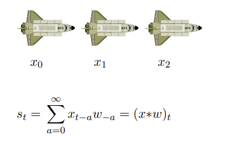

在实践中，我们通常只在一个小窗口内进行求和. 权重数组（w）被称为滤波器. 我们只需将滤波器在输入上滑动，并根据 $x_t$ 周围的窗口计算 $s_t$ 的值. 

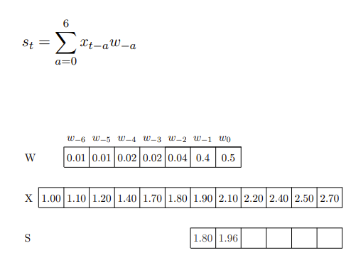

...

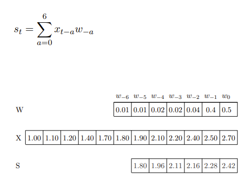

这里的输入（和内核）是一维的. 那么，我们也可以在二维输入上使用卷积操作吗？

我们可以将图像看作是二维输入. 现在我们想用一个二维滤波器（$m×n$）. 首先让我们看看二维卷积的公式是什么样子. 

$$
S_{ij} = (I * K)_{ij} = \sum_{a = 0}^{m - 1} \sum_{b = 0}^{n - 1} I_{i - a, j - b} K_{a, b} I_{i + a, j + b} K_{a, b}
$$

例子：

在接下来的讨论中，我们将使用下面这个卷积公式：

$$
S_{ij} = (I * K)_{ij} = \sum_{a=\left\lfloor -\frac{m}{2} \right\rfloor}^{\left\lfloor \frac{m}{2} \right\rfloor} \sum_{b=\left\lfloor -\frac{n}{2} \right\rfloor}^{\left\lfloor \frac{n}{2} \right\rfloor} I_{i - a, j - b} K_{\frac{m}{2}+a,\frac{n}{2}+b}
$$ 

换句话说，我们假设内核以感兴趣的像素为中心. 这样我们就会同时考虑前面和后面的相邻像素. 

- 第一个公式： $S_{ij} = (I * K)_{ij} = \sum_{a = 0}^{m - 1} \sum_{b = 0}^{n - 1} I_{i - a, j - b} K_{a, b} I_{i + a, j + b} K_{a, b}$  ，求和范围是从  $a = 0$  到  $m - 1$  、  $b = 0$  到  $n - 1$  ，它只考虑了滤波器（内核）  $K$  中从起始位置开始的元素 ，是基于一种从图像左上角开始以滤波器大小为窗口逐步滑动计算的思路 ，没有考虑滤波器元素关于中心对称等情况. 
- 第二个公式： $S_{ij} = (I * K)_{ij} = \sum_{a=\left\lfloor -\frac{m}{2} \right\rfloor}^{\left\lfloor \frac{m}{2} \right\rfloor} \sum_{b=\left\lfloor -\frac{n}{2} \right\rfloor}^{\left\lfloor \frac{n}{2} \right\rfloor} I_{i - a, j - b} K_{\frac{m}{2}+a,\frac{n}{2}+b}$  ，求和范围是以滤波器中心为基准 ，  $a$  和  $b$  的取值范围关于0对称. 这种方式假设滤波器以感兴趣的像素为中心，同时考虑了像素周围前后的相邻像素 ，更符合将滤波器中心放置在目标像素上进行卷积计算的思想. 

让我们看一些对图像应用二维卷积的例子：
- 用全为1的滤波器卷积会模糊图像. 

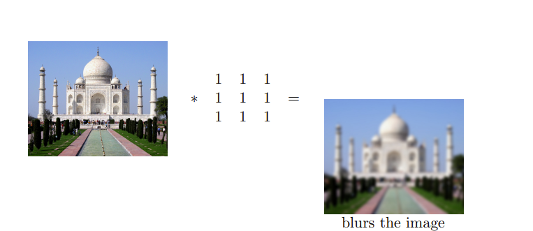

- 用 $ \begin{bmatrix}0 & -1 & 0 \\ -1 & 5 & -1 \\ 0 & -1 & 0\end{bmatrix} $ 这个滤波器卷积会锐化图像. 

- 用 $ \begin{bmatrix}1 & 1 & 1 \\ 1 & -8 & 1 \\ 1 & 1 & 1\end{bmatrix} $ 这个滤波器卷积会检测边缘. 

我们只需将内核在输入图像上滑动. 每次滑动内核，我们都会在输出中得到一个值. 得到的输出被称为特征图. 我们可以使用多个滤波器来获得多个特征图. 

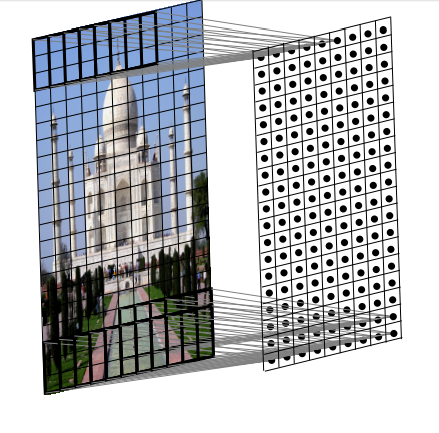

问题：在一维情况下，我们在一维输入上滑动一维滤波器；在二维情况下，我们在二维输出上滑动二维滤波器. 那么在三维情况下会发生什么呢？

三维滤波器会是什么样子？它将是三维的，我们将其称为体（volume）. 同样，我们将这个体在三维输入上滑动并计算卷积操作. 需要注意的是，在本讲中，我们假设滤波器总是延伸到图像的深度. 实际上，我们是在三维输入上进行二维卷积操作（因为滤波器沿着高度和宽度移动，但不沿着深度移动）. 因此，输出将是二维的（只有宽度和高度，没有深度）. 同样，我们可以应用多个滤波器来获得多个特征图. 

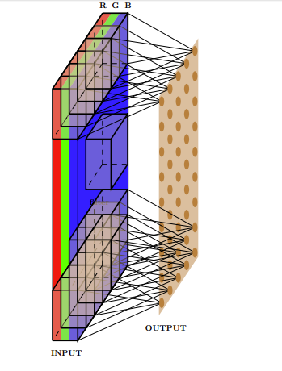

### 输入大小、输出大小和滤波器大小之间的关系

到目前为止，我们还没有明确说明输入、滤波器、输出的维度以及它们之间的关系. 我们将了解它们是如何关联的，但在此之前，我们先定义一些量：

- 原始输入的宽度（$W_1$）、高度（$H_1$）和深度（$D_1$）. 
- 步长S（我们稍后会详细介绍）. 
- 滤波器的数量K. 
- 每个滤波器的空间范围（$F$）（每个滤波器的深度与每个输入的深度相同）. 
- 输出是 $W_2×H_2×D_2$ （我们很快会看到计算 $W_2$、$H_2$ 和 $D_2$ 的公式）. 

让我们计算输出的维度（$W_2$, $H_2$）. 注意，我们不能将内核放置在角落，因为这样会超出输入边界. 对于所有阴影点都是如此（内核超出输入边界）. 这导致输出的维度比输入小. 一般来说，$W_2 = W_1 - F + 1$ ，$H_2 = H_1 - F + 1$. 我们将进一步完善这个公式. 

如果我们希望输出与输入大小相同呢？我们可以使用一种称为填充的方法. 用适当数量的0输入对输入进行填充，这样就可以在内核放置在角落时应用它. 例如，对于一个3×3的内核，我们使用填充 $P = 1$ ，这意味着我们在顶部、底部、左侧和右侧各添加一行和一列0输入. 

这样我们有，$W_2 = W_1 - F + 2P+ 1$ ，$H_2 = H_1 - F + 2P+ 1$. 我们将进一步完善这个公式. 

步长S有什么作用呢？它定义了应用滤波器的间隔（这里 $S = 2$ ）. 这里，我们实际上是每隔一个像素进行一次操作，这又会导致输出的维度变小. 

那么我们最终的公式应该是什么样的呢？$W_2=\frac{W_1 - F + 2P}{S}+1$ ，$H_2=\frac{H_1 - F + 2P}{S}+1$. 

最后，关于输出的深度. 每个滤波器给我们一个二维输出. $K$ 个滤波器将给我们 $K$ 个这样的二维输出. 我们可以将得到的输出看作是 $K×W_2×H_2$ 的体. 因此，$D_2 = K$. 

让我们做一些练习：

- 对于输入大小为227×227×3，有96个滤波器，步长为4，填充为0，计算可得 $H_2 = 55 = \frac{227 - 11}{4}+1$ ，$W_2 = 55 = \frac{227 - 11}{4}+1$ ，$D_2 = 96$. 

    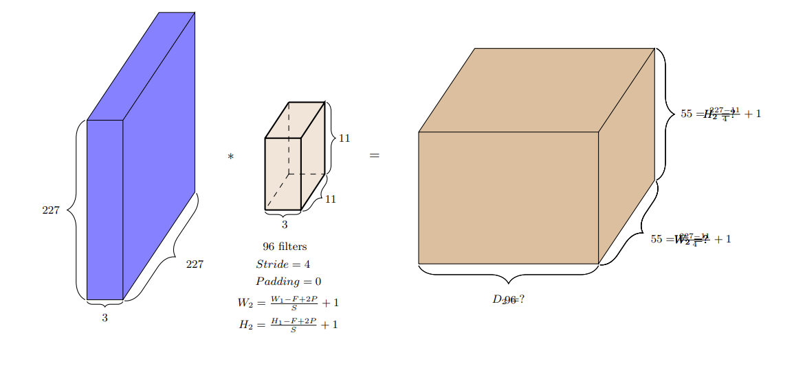

- 对于输入大小为32×32×5，有6个滤波器，步长为1，填充为0，计算可得 $H_2 = 28 = \frac{32 - 5}{1}+1$ ，$W_2 = 28 = \frac{32 - 5}{1}+1$ ，$D_2 = 6$. 

    

### 引入卷积神经网络

把这些内容联系起来看，卷积操作和神经网络之间有什么联系呢？我们通过考虑“图像分类”任务来理解这一点. 

在图像分类中，传统的方法是使用手工制作的特征，如边缘检测器、SIFT/HOG等进行静态特征提取（没有学习过程），然后学习分类器的权重. 

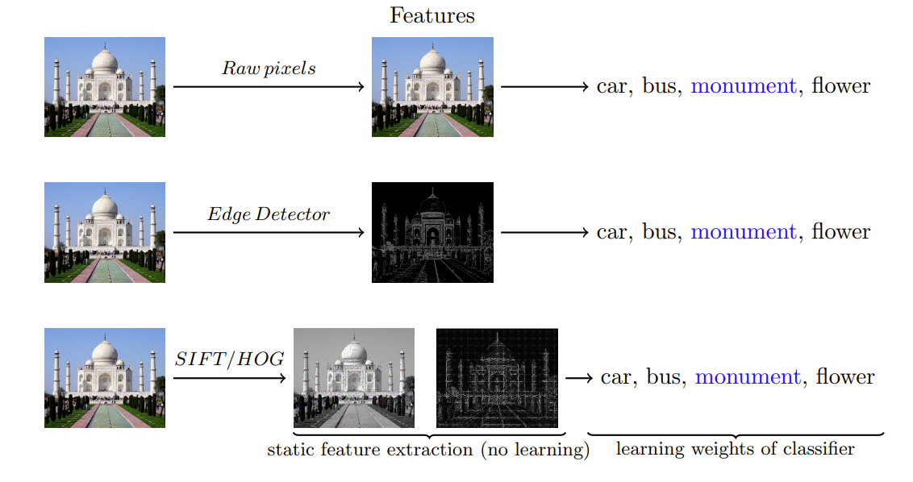

而现在我们思考，除了学习分类器的权重，能否学习有意义的内核/滤波器，而不是使用手工制作的内核（如边缘检测器）呢？甚至更进一步，能否学习多层有意义的内核/滤波器，同时学习分类器的权重呢？答案是肯定的！我们只需将这些内核视为参数，并使用反向传播与分类器的权重一起学习. 这样的网络就称为卷积神经网络. 

那么，这与常规的前馈神经网络有什么不同呢？这是一个常规前馈神经网络的样子，其中有很多密集连接. 例如，所有16个输入神经元都参与 $h_{11}$ 的计算. 

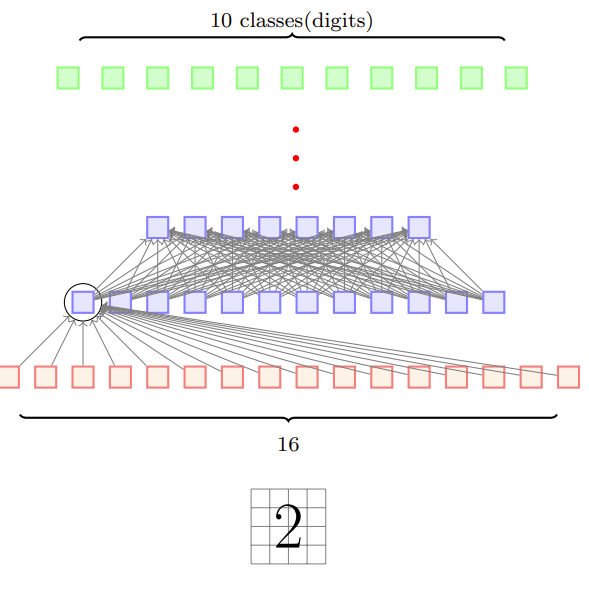

相比之下，在卷积的情况下，只有少数局部神经元参与 $h_{11}$ 的计算. 例如，只有像素1、2、5、6参与 $h_{11}$ 的计算. 连接要稀疏得多，我们利用了图像的结构（相邻像素之间的相互作用更有意义）. 这种稀疏连接减少了模型中的参数数量. 

但是稀疏连接真的是一件好事吗？我们难道不会因为失去一些输入像素之间的相互作用而丢失信息吗？实际上并非如此. 例如，在第一层中两个突出显示的神经元（$x_1$ 和 $x_5$）没有直接相互作用，但它们间接对 $g_3$ 的计算有贡献，因此存在间接相互作用. 

卷积神经网络的另一个特点是权重共享. 考虑一个网络，我们是否希望图像不同部分的内核权重不同呢？假设我们试图学习一个检测边缘的内核，难道不应该在图像的所有部分应用相同的内核吗？换句话说，橙色和粉色的内核难道不应该相同吗？是的，确实应该相同. 这会使学习更容易（而不是在不同位置反复学习相同的权重/内核）. 但这并不意味着我们只能有一个内核. 我们可以有很多这样的内核，并且这些内核会在图像的所有位置共享，这就是“权重共享”. 

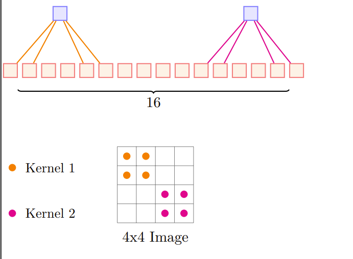

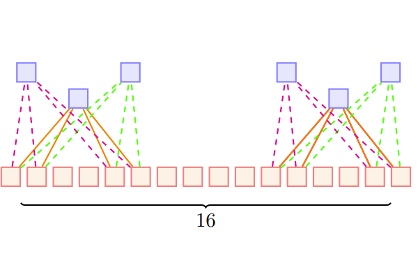

到目前为止，我们只关注了卷积操作. 让我们看看一个完整的卷积神经网络是什么样子. 

## 2 卷积神经网络

卷积神经网络依次包括输入层、多个隐藏层和输出层，输入层会因应用场景不同而有所差异。隐藏层是 CNN 架构的核心模块，由一系列卷积层、池化层组成，并最终通过全连接层输出结果。

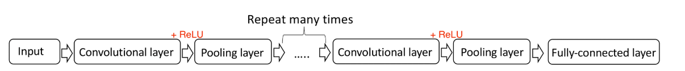

卷积层是 CNN 的核心构建块。简而言之，特定形状的输入经过卷积层后会被抽象为特征图，一组可学习的滤波器（或内核）在这一过程中起着重要作用。图 5.2 对卷积层进行了更直观的解释。

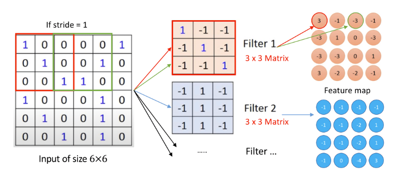

假设神经网络的输入为 6×6 矩阵，每个元素可表示为整数 0 或 1。如前所述，卷积层中有一组可学习的滤波器，每个滤波器可视为一个矩阵，类似于全连接层中的神经元。在此例中，3×3 大小的滤波器以特定步长（stride）滑过整个输入图像，矩阵或滤波器的每个元素均作为神经网络的参数（权重和偏置）。传统上，这些参数并非基于初始设置，而是通过训练数据学习得到。通常，卷积层中不止一个滤波器，每个滤波器生成相同尺寸的特征图。该卷积层的输出是多个特征图（也称为激活图），这些对应不同滤波器的特征图沿深度维度堆叠在一起。

每个卷积层之后通常会接一个非线性层（或激活层），其目的是为神经网络引入非线性，因为卷积层中的操作本质上仍是线性的（逐元素乘法和求和）。然而，卷积层主要执行线性操作，因此连续的卷积层本质上等效于单个卷积层，这会限制网络的表示能力（我们知道线性操作+非线性激活函数可以逼近任何函数）。因此，需要在卷积层之间引入激活函数以避免此类问题。

激活函数执行非线性变换，在 CNN 中决定神经元是否激活，是 CNN 的关键组成部分。卷积层之后可使用多种激活函数，如双曲函数和 sigmoid 函数等，其中 ReLU 是神经网络（尤其是 CNN）中最常用的激活函数（Krizhevsky 等人，2012）.

**饱和函数 $f$**: 设函数 $f(x)$ 在定义域 $\mathbb{R}$ 上可导，若存在常数 $a, b, L_1, L_2 \in \mathbb{R}$（$L_1 \leq L_2$），使得：

- 当 $x \to +\infty$ 时，$f(x) \to L_2$（上饱和值），即  
     
$$
\lim_{x \to +\infty} f(x) = L_2
$$

- 当 $x \to -\infty$ 时，$f(x) \to L_1$（下饱和值），即  
     
$$
\lim_{x \to -\infty} f(x) = L_1
$$

    

在饱和区域，饱和函数的导数趋近于零，即  
     
$$
\lim_{x \to +\infty} f'(x) = 0, \quad \lim_{x \to -\infty} f'(x) = 0
$$

1. **Sigmoid函数**：  

$$
f(x) = \frac{1}{1+e^{-x}}
$$  

   - 输出极限：$\lim_{x \to +\infty} f(x) = 1$, $\lim_{x \to -\infty} f(x) = 0$  
   - 导数极限：$\lim_{x \to \pm\infty} f'(x) = 0$（因 $f'(x) = f(x)(1-f(x))$，在 $x \to \pm\infty$ 时趋近于 0）。

2. **Tanh函数**： 

$$
f(x) = \frac{e^x - e^{-x}}{e^x + e^{-x}}
$$  

   - 输出极限：$\lim_{x \to +\infty} f(x) = 1$, $\lim_{x \to -\infty} f(x) = -1$  
   - 导数极限：$\lim_{x \to \pm\infty} f'(x) = 0$（因 $f'(x) = 1 - [f(x)]^2$，在饱和区趋近于 0）。

 
**非饱和函数 $f$**: 当 $x \to +\infty$ 或 $x \to -\infty$ 时，$f(x)$ 的极限为 $+\infty$ 或 $-\infty$，即  

$$
\lim_{x \to +\infty} f(x) = \pm\infty \quad \text{或} \quad \lim_{x \to -\infty} f(x) = \pm\infty
$$

且在对应区间内，导数 $f'(x)$ 不趋近于零（保持非零常数或发散）。

在定义域内，导数 $f'(x)$ 的极限不为零，即  

$$
\lim_{x \to +\infty} f'(x) \neq 0 \quad \text{或} \quad \lim_{x \to -\infty} f'(x) \neq 0
$$

1. **线性函数**：  

$$
f(x) = kx + b \quad (k \neq 0)
$$  

   - 输出极限：$\lim_{x \to +\infty} f(x) = \text{sign}(k)\cdot\infty$, $\lim_{x \to -\infty} f(x) = -\text{sign}(k)\cdot\infty$  
   - 导数极限：$\lim_{x \to \pm\infty} f'(x) = k \neq 0$（恒为常数）。

2. **ReLU函数（正区间）**：  

$$
f(x) = \max(0, x) = \begin{cases} 
x, & x \geq 0 \\
0, & x < 0 
\end{cases}
$$  

   - **正区间（非饱和部分）**：  
     当 $x \to +\infty$ 时，$\lim_{x \to +\infty} f(x) = +\infty$，且 $\lim_{x \to +\infty} f'(x) = 1 \neq 0$。  
   - **负区间（可视为饱和）**：  
     当 $x \to -\infty$ 时，$\lim_{x \to -\infty} f(x) = 0$，$\lim_{x \to -\infty} f'(x) = 0$。  
     因此，ReLU是“部分非饱和函数”（正区间非饱和，负区间饱和）。

3. **Leaky ReLU函数**： 

$$
f(x) = \begin{cases} 
x, & x \geq 0 \\
\alpha x, & x < 0 
\end{cases} \quad (\alpha > 0 \text{为常数})
$$  

   - 输出极限：  
     $\lim_{x \to +\infty} f(x) = +\infty$, $\lim_{x \to -\infty} f(x) = -\infty$（因负区间斜率 $\alpha \neq 0$）。  
   - 导数极限：  
     $\lim_{x \to +\infty} f'(x) = 1$, $\lim_{x \to -\infty} f'(x) = \alpha$，均不为零，**全局非饱和**。

| **特性**               | **饱和函数**                          | **非饱和函数**                        |
|------------------------|---------------------------------------|---------------------------------------|
| **输出极限（±∞）**     | 收敛到固定常数 $L_1, L_2$         | 发散到 $\pm\infty$ 或无界增长      |
| **导数极限（±∞）**     | 趋近于 0                              | 非零常数或发散（如 $\lim f'(x) = k \neq 0$） |
| **典型场景**           | 神经网络中的 sigmoid/tanh             | 神经网络中的 ReLU/Leaky ReLU/线性函数 |

sigmoid、tanh函数都存在一个相同的问题，称为 “梯度消失”。这两种函数的导数范围都是 (0,1)，在反向阶段，使用链式法则计算偏导数，因此，在足够大的网络中，当足够多的这些导数相乘时，梯度将呈指数级下降，这意味着训练过程中为每个层创建的权重将不准确，并会影响网络的准确性。选择ReLU函数可以有效解决梯度消失解决梯度消失：
- 恒等梯度传递：
    - 对于激活的神经元（$x>0$），ReLU 的导数为 1，梯度在反向传播中可无衰减地传递，避免了传统激活函数的指数级梯度消失。
    - 示例：假设某层输入 $x>0$，其梯度为 $\delta$，则反向传播时该层梯度为  $\delta\times 1=\delta$，与层数无关。
- 稀疏激活特性：
    - ReLU 通过将负值置零，使网络产生 “稀疏激活”—— 只有部分神经元处于激活状态。这减少了参数间的依赖关系，缓解了梯度传播中的冗余计算，并增强了网络的特征选择能力。

但使用ReLU函数会出现死亡ReLU问题
- 现象：当输入 $x\leq 0$
 时，神经元永久失活（导数为 0），导致该神经元在后续训练中无法更新权重，称为 “死亡 ReLU”。
- 原因：初始化权重不当或学习率过高，可能使大量神经元进入负区间。
- 改进变体Leaky ReLU：为负值引入小斜率（如 0.01），避免神经元完全失活：

$$
\text{Leaky ReLU}(x)=
\begin{l}
αx,
​
  

x≤0

$$

那么如何训练一个卷积神经网络呢？我们可以将卷积神经网络看作是一个具有稀疏连接的前馈神经网络，并使用反向传播来训练它. 由于使用的激活函数是ReLU函数，因此只有少数权值（用颜色表示）是激活的，其余的权值（用灰色表示）为零.

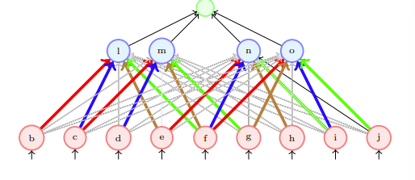

## 3 一些技巧

- 在卷积层之后进行批量归一化（Batch Normalization）. 
- 采用[He等人]提出的Xavier/2初始化方法. 
- 使用随机梯度下降（SGD）+动量（0.9）. 
- 学习率：0.1，当验证误差趋于平稳时除以10. 
- 小批量大小为256. 
- 权重衰减为 $1e - 5$. 
- 不使用随机失活（dropout）.  