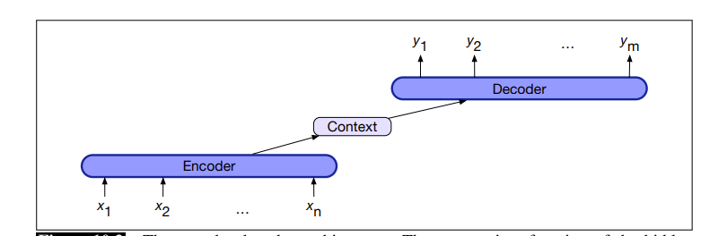

# Encoder-Decoder模型

## Reference

- https://web.stanford.edu/~jurafsky/slp3/old_dec21/10.pdf

## 1 编码器-解码器模型

编码器 - 解码器网络是一种能够生成符合上下文、长度任意的输出序列的模型。编码器 - 解码器网络已被广泛应用于众多领域，包括机器翻译、摘要生成、问答系统和对话系统等。

这些网络的核心思想：编码器（encoder）接收输入序列，并创建一个对其进行情境化表示的向量，通常称为上下文向量（context）。然后，这个表示被传递给解码器（decoder），解码器生成特定任务的输出序列。下图展示了其架构。

编码器 - 解码器网络由三个组件组成：
1. **编码器**：接受输入序列$x_{1}^{n}$ ，并生成相应的情境化表示序列 $h_{1}^{n}$ 。长短期记忆网络（LSTMs）、卷积神经网络和Transformer都可以用作编码器。 
2. **上下文向量$c$**：是 $h_{1}^{n}$ 的函数，将输入的本质信息传递给解码器。 
3. **解码器**：接受 $c$ 作为输入，并生成任意长度的隐藏状态序列 $h_{1}^{m}$ ，由此可得到相应的输出状态序列 $y_{1}^{m}$ 。与编码器一样，解码器可以由任何类型的序列架构实现。

## 2 基于循环神经网络的编码器 - 解码器

我们首先描述一个基于一对循环神经网络（RNNs）的编码器 - 解码器网络。回顾用于计算$p(y)$（序列$y=(y_1,y_,...,y_m)$的概率）的条件RNN语言模型。与任何语言模型一样，我们可以将概率分解如下：

$$
p(y) = p(y_1)p(y_2|y_1)p(y_3|y_1, y_2)\ldots p(y_m|y_1,\ldots, y_{m - 1})
$$

在特定时刻$t$，我们将长度为$t - 1$ 的标记前缀输入语言模型，通过网络进行前向传播以产生隐藏状态序列，最终得到与前缀最后一个标记相对应的隐藏状态。然后，我们使用这个最终隐藏状态作为起始点来生成下一个标记。

更形式化地说，如果$g$是激活函数（如tanh或ReLU ），$f$是词汇表中所有可能词汇项上的一个softmax函数，那么在时刻$t$ 时，输出$y_t$ 和隐藏状态$h_t$ 计算如下：

$$
h_t = g(h_{t - 1}, x_t)
$$

$$
y_t = f(h_t)
$$

我们只需做一个小改动，就能将这个语言模型转变为一个用于机器翻译的自回归生成模型，具体做法是：在源文本末尾添加一个句子分隔标记，然后简单地连接源文本和目标文本。

如果我们将源文本记为$x$ ，目标文本记为$y$ ，那么我们计算$p(y|x)$ 的方式如下：

$$
p(y|x) = p(y_1|x)p(y_2|y_1, x)p(y_3|y_1, y_2, x)\ldots p(y_m|y_1,\ldots, y_{m - 1}, x)
$$

图10.4展示了编码器 - 解码器模型的简化版本（完整模型将在下一节介绍，它需要注意力机制 ）。图10.4中，绿色的是英语源文本（“the green witch arrived”），句子分隔符标记为$<s>$ ，红色的是西班牙语目标文本（“llegó la bruja verde”）。为了翻译一个源句子，我们将其输入网络进行前向传播以生成隐藏状态，直到到达源文本末尾。然后，我们从源文本末尾开始自回归生成，使用最终隐藏层状态作为先前隐藏状态和句子标记。后续单词以最终隐藏状态为条件生成。

**图10.4** 在基于基本RNN的编码器 - 解码器机器翻译方法中，在推理（推断 ）时翻译单个源句和目标句。源文本和目标文本之间用分隔符标记连接，解码器使用编码器最后一个隐藏状态的上下文信息。

我们在图10.5中对这个模型进行形式化和一般化（必要时，我们使用上标$e$ 和$d$ 来区分编码器和解码器的隐藏状态 ）。网络左侧处理输入序列$x$ ，构成编码器。虽然简化图仅显示了编码器的单个网络层，但标准做法是堆叠架构，通常将堆叠的双向长短期记忆网络（biLSTMs）顶部层的输出状态作为最终表示。一种广泛使用的编码器设计利用堆叠的biLSTMs，其中前向和后向传递的隐藏状态按照第9章所述进行连接，为每个时间步提供情境化表示。

**图10.5** 基于基本RNN的编码器 - 解码器架构在推理时翻译句子的更正式版本。编码器RNN的最终隐藏状态$h_{n}^{e}$ 作为解码器的上下文，在解码器RNN中起$h_{0}^{d}$ 的作用。

编码器的全部目的是生成输入的情境化表示。这个表示被编码在编码器的最终隐藏状态$h_{n}^{e}$ 中，也称为上下文向量$c$ ，然后传递给解码器。

右侧的解码器网络获取这个状态，并使用它来初始化解码器的第一个隐藏状态$h_{0}^{d}$ 。也就是说，第一个解码器RNN单元将$c$ 作为其先前隐藏状态$h_{0}^{d}$ 。解码器自回归地生成输出序列，每次生成一个元素，直到生成序列结束标记。每个隐藏状态都基于先前的隐藏状态和前一步生成的输出。

**图10.6** 允许解码器的每个隐藏状态（不仅仅是第一个解码器状态）受到编码器产生的上下文$c$ 的影响。

到目前为止，这种方法的一个缺点是上下文向量$c$ 的影响会随着生成的输出序列变长而减弱。一个解决方案是使上下文向量$c$ 在每个解码时间步都可用，将其作为当前隐藏状态计算中的一个参数，使用以下公式（如图10.6所示）：

$$
h_{t}^{d} = g(\hat{y}_{t - 1}, h_{t - 1}^{d}, c) 
$$

现在我们可以给出基于基本RNN的编码器 - 解码器模型在每个解码时间步的完整公式。回想一下，$g$ 代表某种RNN的激活函数，$\hat{y}_{t - 1}$ 是从上一步softmax中采样得到的输出嵌入：

$$
c = h_{n}^{e} \\
h_{0}^{d} = c \\
h_{t}^{d} = g(\hat{y}_{t - 1}, h_{t - 1}^{d}, c)\\
z_t = f(h_{t}^{d})\\
y_t = \text{softmax}(z_t)
$$

最后，如前所述，每个时间步的输出$y$ 由对所有可能输出（在语言建模或机器翻译的情况下为词汇表 ）的softmax计算组成。我们通过对softmax输出取最大值来计算每个时间步最可能的输出标记：

$$
\hat{y}_t = \underset{w \in V}{\text{argmax}} P(w|y_1 \ldots y_{t - 1})
$$

## 3 训练编码器 - 解码器模型
编码器 - 解码器架构的训练是端到端的，与第9章的RNN语言模型目标类似。每个训练样本都是一个元组，包含一个源句、一个目标句以及一个分隔符标记，这些配对样本现在可以作为训练数据。

对于机器翻译，训练数据通常由句子及其翻译组成。这些数据可以从标准对齐的句子对数据集获取，我们将在10.7.2节讨论。与任何基于RNN的语言模型一样，训练过程从给定源文本开始，然后从分隔符标记开始，以自回归方式训练预测下一个单词，如图10.7所示。

**图10.7** 训练基于基本RNN的编码器 - 解码器机器翻译方法。注意，在解码器中，我们通常不传播模型的softmax输出$\hat{y}_t$ ，而是使用教师强制（teacher forcing ）将每个输入强制设置为训练的正确目标值。我们计算解码器中每个标记的softmax输出分布$\hat{y}_t$ ，以便计算每个标记的损失，然后将其平均以计算句子的损失。

注意训练（图10.7）和解码（图10.4）在输出方面的区别。解码过程使用自己估计的输出$\hat{y}_t$ 作为下一个时间步$x_{t + 1}$ 的输入。因此，解码器在生成更多标记时会越来越偏离真实目标句子。所以，在训练中，更常见的做法是使用教师强制。教师强制意味着我们强制系统使用目标标记作为下一个输入$x_{t + 1}$ ，而不是让它依赖（可能错误的）解码器输出$\hat{y}_t$ 。这加快了训练速度。 