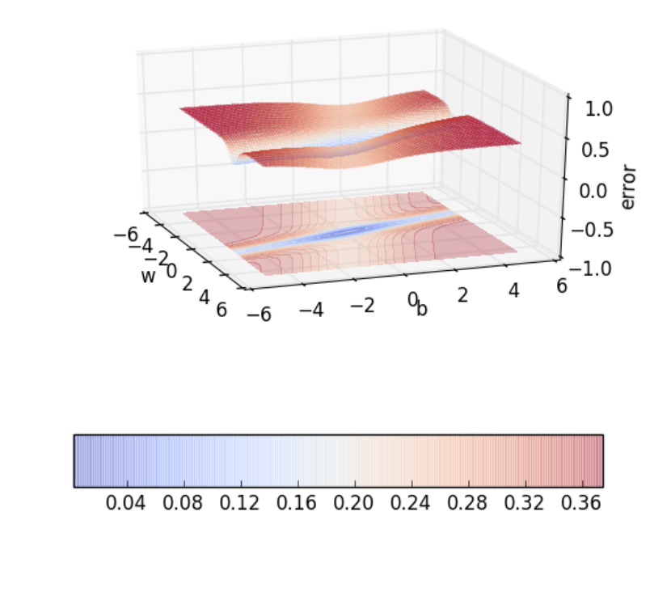
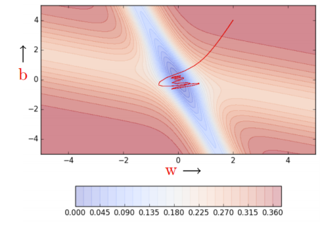
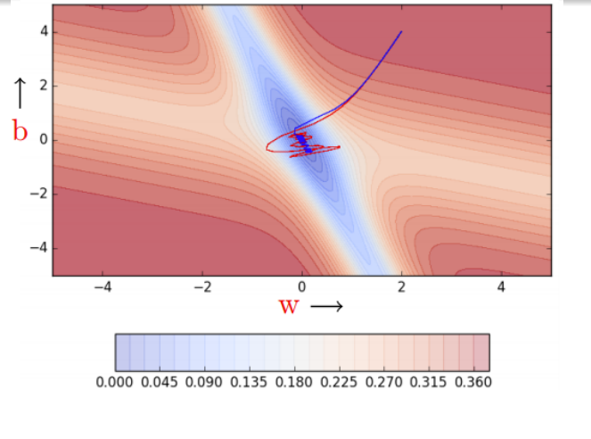
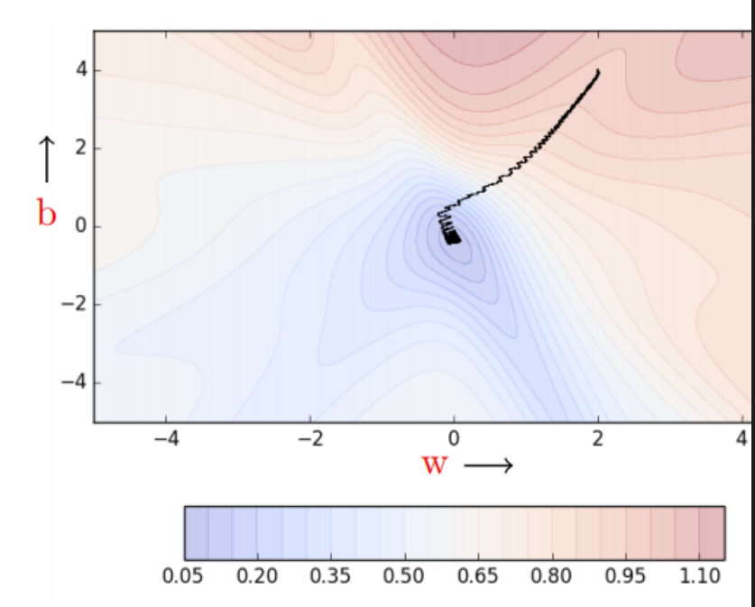
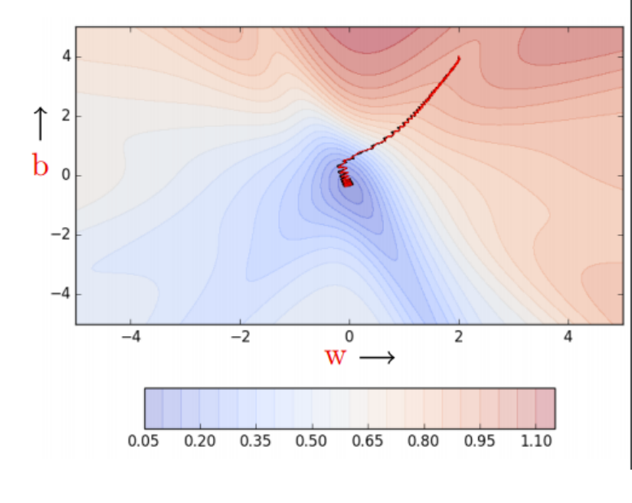
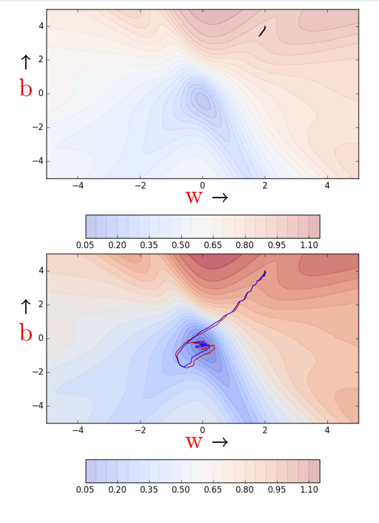
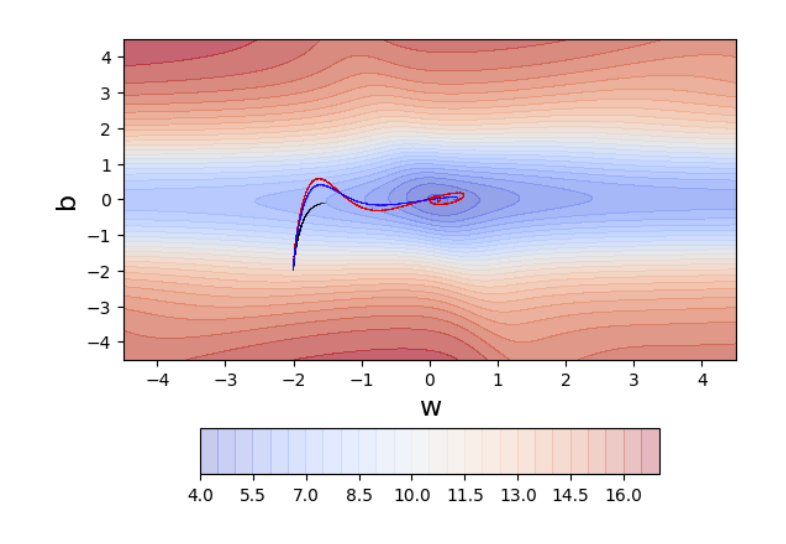
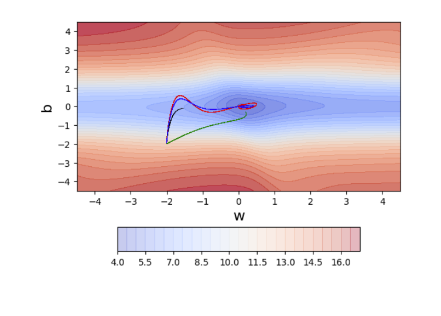
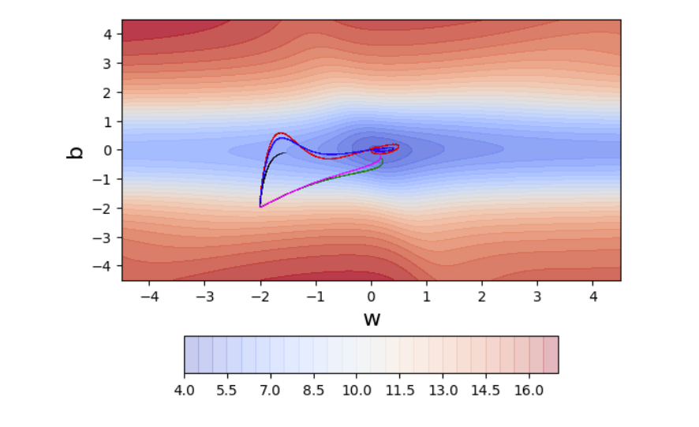

# 梯度下降变体

## Reference

- https://www.cse.iitm.ac.in/~miteshk/CS7015/Slides/Handout/Lecture5.pdf
- https://luhengshiwo.github.io/LLMForEverybody/01-%E7%AC%AC%E4%B8%80%E7%AB%A0-%E9%A2%84%E8%AE%AD%E7%BB%83/%E5%85%A8%E7%BD%91%E6%9C%80%E5%85%A8%E7%9A%84%E7%A5%9E%E7%BB%8F%E7%BD%91%E7%BB%9C%E4%BC%98%E5%8C%96%E5%99%A8optimizer%E6%80%BB%E7%BB%93.html


## 1 梯度下降

梯度下降规则是，我们要移动的方向 $u$ 应该与梯度方向成 $180^{\circ}$ ，也就是沿着与梯度相反的方向移动. 参数更新方程为 $w_{t + 1}=w_{t}-\eta \nabla w_{t}$  ， $b_{t + 1}=b_{t}-\eta \nabla b_{t}$  ，其中 $\nabla w_{t}=\frac{\partial \mathscr{L}(w, b)}{\partial w}\big|_{w = w_{t}, b = b_{t}}$  ， $\nabla b_{t}=\frac{\partial \mathscr{L}(w, b)}{\partial b}\big|_{w = w_{t}, b = b_{t}}$.

基于这个规则，我们创建如下算法：
**算法1：梯度下降**

- $t \leftarrow 0$;
- $\text{maxIterations} \leftarrow 1000$;
- $\text{while } t < \text{maxIterations } \text{do}$
    - $w_{t+1}\leftarrow w_{t}-\eta \nabla w_{t}$; 
    - $b_{t+1}\leftarrow b_{t}-\eta \nabla b_{t}$ 
    - $t \leftarrow t + 1$;
- $\text{end}$


下面是实现梯度下降的代码示例：
```python
import numpy as np

X = np.array([0.5, 2.5])
Y = np.array([0.2, 0.9])


def f(w, b, x):
    return 1.0 / (1.0 + np.exp(-(w * x + b)))


def error(w, b):
    err = 0.0
    for x, y in zip(X, Y):
        fx = f(w, b, x)
        err += 0.5 * (fx - y) ** 2
    return err


def grad_b(w, b, x, y):
    fx = f(w, b, x)
    return (fx - y) * fx * (1 - fx)


def grad_w(w, b, x, y):
    fx = f(w, b, x)
    return (fx - y) * fx * (1 - fx) * x


def do_gradient_descent():
    w, b, eta, max_epochs = -2, -2, 1.0, 100
    for i in range(max_epochs):
        dw, db = 0, 0
        for x, y in zip(X, Y):
            dw += grad_w(w, b, x, y)
            db += grad_b(w, b, x, y)
        w = w - eta * dw
        b = b - eta * db


```

当曲线陡峭时，梯度 $(\frac{\Delta y_{1}}{\Delta x_{1}})$ 较大；当曲线平缓时，梯度 $(\frac{\Delta y_{2}}{\Delta x_{2}})$ 较小. 由于权重更新与梯度成正比（ $w = w-\eta \nabla w$  ），所以在曲线平缓的区域，更新量较小；在曲线陡峭的区域，更新量较大. 

无论从哪里开始，一旦遇到斜率平缓的曲面，进展就会变慢. 

## 2 基于动量的梯度下降

关于梯度下降，我们发现它在遍历斜率平缓的区域时需要花费大量时间，因为这些区域的梯度非常小. 有没有更好的方法呢？有，我们来看看 “基于动量的梯度下降”. 其直观理解是，如果我反复被要求朝同一个方向移动，那么我可能应该更有信心，并开始在该方向上迈出更大的步伐，就像球在斜坡上滚动时获得动量一样. 

基于动量的梯度下降的更新规则为 
$update _{t}=\gamma \cdot update _{t - 1}+\eta \nabla w_{t}$ ， $w_{t + 1}=w_{t}- update _{t}$ . 
除了当前的更新，还会考虑之前的更新历史. 具体计算过程如下：

$update _{0}=0$  
$update _{1}=\gamma \cdot update _{0}+\eta \nabla w_{1}=\eta \nabla w_{1}$  
$update _{2}=\gamma \cdot update _{1}+\eta \nabla w_{2}=\gamma \cdot \eta \nabla w_{1}+\eta \nabla w_{2}$  
$\begin{aligned} update _{3} & =\gamma \cdot update _{2}+\eta \nabla w_{3}=\gamma(\gamma \cdot \eta \nabla w_{1}+\eta \nabla w_{2})+\eta \nabla w_{3} \\ & =\gamma \cdot update _{2}+\eta \nabla w_{3}=\gamma^{2} \cdot \eta \nabla w_{1}+\gamma \cdot \eta \nabla w_{2}+\eta \nabla w_{3} \end{aligned}$  
$update _{4}=\gamma \cdot update _{3}+\eta \nabla w_{4}=\gamma^{3} \cdot \eta \nabla w_{1}+\gamma^{2} \cdot \eta \nabla w_{2}+\gamma \cdot \eta \nabla w_{3}+\eta \nabla w_{4}$  
$update _{t}=\gamma \cdot update _{t - 1}+\eta \nabla w_{t}=\gamma^{t - 1} \cdot \eta \nabla w_{1}+\gamma^{t - 2} \cdot \eta \nabla w_{1}+\cdots+\eta \nabla w_{t}$  

下面是实现基于动量的梯度下降的代码示例：
```python
def do_momentum_gradient_descent():
    w, b, eta = init_w, init_b, 1.0
    prev_vw, prev_vb, gamma = 0, 0, 0.9
    for i in range(max_epochs):
        dw, db = 0, 0
        for x, y in zip(X, Y):
            dw += grad_w(w, b, x, y)
            db += grad_b(w, b, x, y)
        vw = gamma * prev_vw + eta * dw
        vb = gamma * prev_vb + eta * db
        w = w - vw
        b = b - vb
        prev_vw = vw
        prev_vb = vb


```

基于动量的梯度下降在斜率平缓的区域也能迈出较大的步伐，因为动量会带动它前进. 但移动速度快并不总是好事，是否会出现动量使我们错过目标的情况呢？我们改变输入数据，得到不同的误差曲面，看看会发生什么. 



在这种情况下，最小值山谷两侧的误差较高，动量是否会产生不利影响呢？基于动量的梯度下降会在最小值山谷内外振荡，因为动量会使它离开山谷. 在最终收敛之前，它需要进行多次折返. 尽管有这些折返，但它仍然比普通梯度下降收敛得更快. 经过100次迭代，基于动量的方法误差达到了0.00001，而普通梯度下降仍停留在0.36的误差. 



## 3 Nesterov加速梯度下降
我们能否采取措施减少这些振荡呢？可以，我们来看看Nesterov加速梯度下降. 其直观理解是 “三思而后行”. 回顾之前的更新公式 $update_{t} = \gamma \cdot update_{t - 1}+\eta \nabla w_{t}$  ，我们知道至少会移动 $\gamma update_{t - 1}$ 的距离，然后再加上 $\eta \nabla w_{t}$  . 为什么不直接在部分更新后的 $w$ 值（ $w_{look_ahead }=w_{t}-\gamma \cdot update _{t - 1}$  ）处计算梯度（ $\nabla w_{look_ahead }$  ），而不是使用当前的 $w_{t}$ 值呢？

NAG的更新规则为 $w_{look_ahead }=w_{t}-\gamma \cdot update _{t - 1}$  ， $update _{t}=\gamma \cdot update _{t - 1}+\eta \nabla w_{look_ahead }$  ， $w_{t + 1}=w_{t}- update _{t}$  ，对于 $b_{t}$ 也有类似的更新规则. 

下面是实现Nesterov加速梯度下降的代码示例：
```python
def do_nesterov_accelerated_gradient_descent():
    w, b, eta = init_w, init_b, 1.0
    prev_v_w, prev_v_b, gamma = 0, 0, 0.9
    for i in range(max_epochs):
        dw, db = 0, 0
        # 进行部分更新
        vw = gamma * prev_v_w
        vb = gamma * prev_v_b
        for x, y in zip(X, Y):
            # 在部分更新后计算梯度
            dw += grad_w(w - vw, b - vb, x, y)
            db += grad_b(w - vw, b - vb, x, y)
        # 进行完整更新
        vw = gamma * prev_v_w + eta * dw
        vb = gamma * prev_v_b + eta * db
        w = w - vw
        b = b - vb
        prev_v_w = vw
        prev_v_b = vb


```

NAG通过提前查看来更快地调整方向，因此它的振荡比基于动量的梯度下降更小，逃离最小值山谷的可能性也更小. 




## 4 随机梯度下降和小批量梯度下降


让我们稍微偏离一下主题，谈谈这些算法的随机版本……

```python
X = [0.5, 2.5]
Y = [0.2, 0.9]
def f(w, b, x):  # 带参数w、b的sigmoid函数
    return 1.0 / (1.0 + np.exp(-(w * x + b)))
def error(w, b):
    err = 0.0
    for x, y in zip(X, Y):
        fx = f(w, b, x)
        err += 0.5 * (fx - y) ** 2
    return err
def grad_b(w, b, x, y):
    fx = f(w, b, x)
    return (fx - y) * fx * (1 - fx)
def grad_w(w, b, x, y):
    fx = f(w, b, x)
    return (fx - y) * fx * (1 - fx) * x
def do_gradient_descent():
    w, b, eta, max_epochs = -2, -2, 1.0, 100
    for i in range(max_epochs):
        dw, db = 0, 0
        for x, y in zip(X, Y):
            dw += grad_w(w, b, x, y)
            db += grad_b(w, b, x, y)
        w = w - eta * dw
        b = b - eta * db
```
注意，该算法在更新参数之前会遍历整个数据集一次. 为什么呢？因为这是前面推导的损失函数的真实梯度（对应每个数据点的损失梯度之和）. 没有近似. 因此，理论上有保证（换句话说，每一步都保证损失会下降）. 

缺点是什么呢？假设训练数据中有一百万个点. 为了对 $w$ 和 $b$ 进行一次更新，算法需要进行一百万次计算. 显然非常慢！！

我们能做得更好吗？可以，让我们看看随机梯度下降. 

```python
def do_stochastic_gradient_descent():
    w, b, eta, max_epochs = -2, -2, 1.0, 1000
    for i in range(max_epochs):
        dw, db = 0, 0
        for x, y in zip(X, Y):
            dw = grad_w(w, b, x, y)
            db = grad_b(w, b, x, y)
            w = w - eta * dw
            b = b - eta * db
```
之所以称为随机，是因为我们基于单个数据点来估计总梯度. 这就好比只抛一次硬币就估计正面朝上的概率. 注意，该算法对每个数据点都更新参数. 现在，如果我们有一百万个数据点，那么在每个epoch（1个epoch = 对数据进行一次遍历；1步 = 一次参数更新）中我们将进行一百万次更新. 

缺点是什么呢？这是一个近似（实际上是随机）的梯度. 不能保证每一步都能降低损失. 让我们看看当数据点较少时这个算法的表现. 

我们看到有很多振荡. 为什么呢？因为我们在做贪心决策. 每个点都试图将参数朝着对它最有利的方向推动（而没有考虑这会对其他点产生什么影响）. 对一个点局部有利的参数更新可能会损害其他点（就好像数据点之间在相互竞争）. 实际上，我们看到不能保证每个局部贪心的移动都会降低全局误差. 



我们能通过改进随机梯度估计（目前每次只从一个数据点估计）来减少振荡吗？

```python
def do_mini_batch_gradient_descent():
    w, b, eta = -2, -2, 1.0
    mini_batch_size, num_points_seen = 2, 0
    for i in range(max_epochs):
        dw, db, num_points = 0, 0, 0
        for x, y in zip(X, Y):
            dw += grad_w(w, b, x, y)
            db += grad_b(w, b, x, y)
            num_points_seen += 1
            if num_points_seen % mini_batch_size == 0:
                # 看到一个小批量数据
                w = w - eta * dw
                b = b - eta * db
                dw, db = 0, 0  # 重置梯度
```
注意，该算法在看到小批量数据点后更新参数. 现在随机估计稍微好了一些. 
即使批量大小 $k = 2$ ，振荡也略有减少. 为什么呢？因为我们现在对梯度的估计稍微好了一些（类比：我们现在抛硬币 $k = 2$ 次来估计正面朝上的概率）. $k$ 的值越高，估计就越准确. 在实践中，$k$ 的典型值是16、32、64 . 当然，只要我们使用的是近似梯度而不是真实梯度，振荡就会一直存在. 



需要记住的一些事情……

1个epoch = 对整个数据进行一次遍历

1步 = 一次参数更新

$N$ = 数据点的数量

$B$ = 小批量大小

| 算法 | 1个epoch中的步数 |
| --- | --- |
| 普通（批量）梯度下降 | 1 |
| 随机梯度下降 | $N$ |
| 小批量梯度下降 | $B$ |


类似地，我们可以有基于动量的梯度下降和Nesterov加速梯度下降的随机版本. 

```python
def do_momentum_gradient_descent():
    w, b, eta = initw, initb, 1.0
    prev_vw, prev_vb, gamma = 0, 0, 0.9
    for i in range(max_epochs):
        dw, db = 0, 0
        for x, y in zip(X, Y):
            dw += gradw(w, b, x, y)
            db += gradb(w, b, x, y)
        vw = gamma * prev_vw + eta * dw
        vb = gamma * prev_vb + eta * db
        w = w - vw
        b = b - vb
        prev_vb = vb
        prev_vw = vw


def do_stochastic_momentum_gradient_descent():
    w, b, eta = init_w, init_b, 1.0
    prev_vw, prev_v_b, gamma = 0, 0, 0.9
    for i in range(max_epochs):
        dw, db = 0, 0
        for x, y in zip(X, Y):
            dw = grad_w(w, b, x, y)
            db = grad_b(w, b, x, y)
            vw = gamma * prev_v_w + eta * dw
            vb = gamma * prev_v_b + eta * db
            w = w - vw
            b = b - vb
            prev_vw = vw
            prev_v_b = vb
```


```python
def do_nesterov_accelerated_gradient_descent():
    w, b, eta = init_w, init_b, 1.0
    prevvw, prevvb, gamma = 0, 0, 0.9
    for i in range(max_epochs):
        dw, db = 0, 0
        # 进行部分更新
        v_b = gamma * prev_v_b
        v_w = gamma * prev_vw
        for x, y in zip(X, Y):
            # 在部分更新后计算梯度
            dw += grad_w(w - v_w, b - v_b, x, y)
            db += grad_b(w - v_w, b - v_b, x, y)
        # 进行完整更新
        v_w = gamma * prev_vw + eta * dw
        v_b = gamma * prev_v_b + eta * db
        w = w - v_w
        b = b - v_b
        prev_vw = v_w
        prev_vb = v_b


def do_nesterov_accelerated_gradient_descent():
    w, b, eta = init_w, init_b, 1.0
    prev_vw, prev_v_b, gamma = 0, 0, 0.9
    for i in range(max_epochs):
        dw, db = 0, 0
        for x, y in zip(X, Y):
            # 进行部分更新
            vw = gamma * prev_v_w
            vb = gamma * prev_v_b
            # 在部分更新后计算梯度
            dw = grad_w(w - vw, b - vb, x, y)
            db = grad_b(w - vw, b - vb, x, y)
            vw = gamma * prev_vw + eta * dw
            vb = gamma * prev_v_b + eta * db
            w = w - vw
            b = b - vb
            prev_vw = vw
            prev_v_b = vb
```


虽然动量梯度下降（红色）和NAG（蓝色）的随机版本都有振荡，但NAG相对于动量梯度下降的相对优势仍然存在（即NAG的折返相对较短）. 此外，它们都比随机梯度下降更快（60步后，随机梯度下降（黑色 - 上图）仍然有很高的误差，而NAG和动量梯度下降已接近收敛）. 




## 5 调整学习率和动量的技巧

在介绍高级优化算法之前，让我们重新审视一下梯度下降中的学习率问题. 

有人可能会说，我们可以通过设置较高的学习率来解决在平缓斜率区域的遍历问题（即通过将小梯度乘以一个较大的 $\eta$ 来放大它）. 让我们看看如果将学习率设置为10会发生什么. 在斜率陡峭的区域，原本就很大的梯度会进一步放大. 如果有一个能根据梯度进行调整的学习率就好了……我们很快就会看到一些这样的算法. 


**初始学习率的技巧**：调整学习率（在对数尺度上尝试不同的值：0.0001、0.001、0.01、0.1、1.0 ）. 用每个值运行几个epoch，找出效果最好的学习率. 现在在这个值附近进行更精细的搜索（例如，如果最佳学习率是0.1，那么现在尝试它附近的值：0.05、0.2、0.3 ）. 免责声明：这些只是启发式方法……没有绝对的最佳策略. 


**学习率退火的技巧**：
- **步长衰减**：每5个epoch将学习率减半；或者如果验证误差大于上一个epoch结束时的误差，则在一个epoch后将学习率减半. 
- **指数衰减**：$\eta=\eta_{0}^{-k t}$ ，其中 $\eta_{0}$ 和 $k$ 是超参数，$t$ 是步数. 
- **$1/t$衰减**：$\eta=\frac{\eta_{0}}{1 + k t}$ ，其中 $\eta_{0}$ 和 $k$ 是超参数，$t$ 是步数. 


**动量的技巧**：Sutskever等人在2013年提出了以下动量调度：
$$\gamma_{t}=\min \left(1 - 2^{-1-\log _{2}(\lfloor t / 250\rfloor + 1)}, \gamma_{max }\right)$$
其中，$\gamma_{max }$ 从 $\{0.999, 0.995, 0.99, 0.9, 0\}$ 中选取. 


## 6 线搜索

在继续介绍其他算法之前，还有最后一点……

在实践中，常常会进行线搜索以找到相对更优的学习率 $\eta$. 使用不同的 $\eta$ 值来更新权重 $w$，然后保留能使损失最低的 $w$ 更新值. 本质上，在每一步中，我们都试图从可选值里选取最佳的 $\eta$. 其缺点是什么呢？每一步都要进行更多的计算. 在讨论二阶优化方法时，我们还会再提及这点. 

```python
def do_Line_search_gradient_descent(): 
    w,b,etas=init_w,initb,[0.1,0.5,1.0,5.0,10.0] 
    for i in range(max_epochs):
        dw,db=0,0
        for x,y in zip(X,Y): 
            dw +=grad_w(w,b,x,y)
            db +=grad_b(w,b,x,y)
        min_error=10000 # 某个较大的值
        bestw,best_b=w,b 
        for eta in etas: 
            tmpw=w-eta*dw
            tmp_b=b-eta*db
            if error(tmp_w,tmp_b)<min_error: 
                bestw=tmp_w
                best_b=tmp_b
        w,b= best_w, best_b 
        min_error=error(tmp_w,tmp_b)
```

让我们看看线搜索的实际效果. 它比普通梯度下降收敛得更快. 我们确实看到了一些振荡，但要注意这些振荡与动量法和NAG中的振荡不同. 

### 7 自适应学习率的梯度下降

给定网络：

$$
y=f(x)=\frac{1}{1+e^{-(w \cdot x+b)}}
$$

$$
x=\left\{x^{1}, x^{2}, x^{3}, x^{4}\right\}
$$

$$
w=\left\{w^{1}, w^{2}, w^{3}, w^{4}\right\}
$$

对于单个数据点 $(x, y)$，很容易看出：

$$
- \nabla w^{1}=(f(x)-y) \cdot f(x) \cdot(1-f(x)) \cdot x^{1}
$$

$$
- \nabla w^{2}=(f(x)-y) \cdot f(x) \cdot(1-f(x)) \cdot x^{2}
$$

如果有 $n$ 个点，我们可以将所有 $n$ 个点的梯度相加得到总梯度. 

如果特征 $x^{2}$ 非常稀疏会怎样呢？（即对于大多数输入，其值为0 ）. 根据公式，$\nabla w^{2}$ 对于大多数输入将为0，因此 $w^{2}$ 得不到足够的更新. 如果 $x^{2}$ 既稀疏又很重要，我们就需要更重视对 $w^{2}$ 的更新. 能否为每个参数设置不同的学习率，以考虑特征的出现频率呢？


**直观理解**：根据参数的更新历史按比例衰减学习率（更新次数越多，衰减越多）. 
Adagrad的更新规则：

$$
v_{t}=v_{t-1}+\left(\nabla w_{t}\right)^{2}
$$

$$
w_{t+1}=w_{t}-\frac{\eta}{\sqrt{v_{t}+\epsilon}} \cdot \nabla w_{t}
$$

对于 $b_{t}$ 也有类似的一组方程. 


为了展示其效果，我们首先需要创建一些数据，使其中一个特征稀疏. 在我们的简单网络中该怎么做呢？花点时间思考一下. 我们的网络只有两个参数（$w$ 和 $b$）. 其中，与$b$对应的输入/特征始终有效（所以实际上不能使其稀疏）. 

```python
def do_adagrad(): 
    w,b,eta=initw,initb,0.1 
    vw,vb,eps=0,0,1e-8 
    for i in range(max_epochs):
        dw,db=0,0
        for x,y in zip(X,Y): 
            dw +=grad_w(w,b,x,y)
            db +=grad_b(w,b,x,y)
        vw=vw+dw**2
        vb=vb+db**2
        w=w-(eta/np.sqrt(v_w+eps))*dw
        b=b-(eta/np.sqrt(v_b+eps))*db
```

唯一的选择是使 $x$ 稀疏. 解决方案：我们创建100个随机的$(x, y)$对，然后对于大约80%的这些对，将$x$设为0，从而使与$w$对应的特征稀疏. 


普通梯度下降（黑色）、动量法（红色）和NAG（蓝色）在处理这个数据集时，这三种算法有一些有趣的表现. 你能发现吗？最初，这三种算法主要沿着垂直（$b$）轴移动，而沿水平（$w$）轴的移动非常少. 为什么呢？因为在我们的数据中，与 $w$ 对应的特征稀疏，因此 $w$ 很少更新……另一方面，$b$ 非常密集，更新频繁. 这种稀疏性在包含数千个输入特征的大型神经网络中非常常见，因此我们需要解决这个问题. 



Adagrad（绿色）通过使用特定于参数的学习率，确保即使存在稀疏性，$w$也能获得更高的学习率，从而有更大的更新. 此外，它还确保如果$b$更新频繁，由于分母不断增大，其有效学习率会降低. 在实践中，如果从分母中去掉平方根，效果就不太好（这值得思考一下）. 其缺点是什么呢？随着时间的推移，$b$的有效学习率会衰减到不再有进一步更新的程度. 我们能避免这种情况吗？



**直观理解**：Adagrad对学习率的衰减非常激进（随着分母增大）. 结果，过一段时间后，频繁更新的参数由于学习率衰减，得到的更新会非常小. 为了避免这种情况，为什么不衰减分母，防止其快速增长呢？
RMSProp的更新规则：

$$
v_{t}=\beta \cdot v_{t-1}+(1-\beta)\left(\nabla w_{t}\right)^{2}
$$

$$
w_{t+1}=w_{t}-\frac{\eta}{\sqrt{v_{t}+\epsilon}} \cdot \nabla w_{t}
$$

对于 $b_{t}$ 也有类似的一组方程. 

```python
def do_rmsprop(): 
    w,b,eta=initw,initb,0.1 
    V_w,b_updates,eps,betal=0,0,1e-8,0.9 
    for i in range(max_epochs):
        dw,db=0,0
        for x,y in zip(X,Y): 
            dw +=grad_w(w,b,x,y)
            db +=grad_b(w,b,x,y)
        Vw=betal
        w=w-(eta/np.sqrt(v_w+eps)*dw
        b=b-(eta/np.sqrt(vb+eps))*db
```

Adagrad在接近收敛时会陷入停滞（由于学习率衰减，它不再能在垂直（$b$）方向上移动）. RMSProp通过对衰减的控制不那么激进，克服了这个问题. 



**直观理解**：RMSProp解决Adagrad衰减问题的所有方法，再加上使用梯度的累积历史. 在实践中，$\beta_{1}=0.9$ ，$\beta_{2}=0.999$ . 
Adam的更新规则：

$$
m_{t}=\beta_{1} \cdot m_{t-1}+\left(1-\beta_{1}\right) \cdot \nabla w_{t}$$

$$
\hat{m}_{t}=\frac{m_{t}}{1-\beta_{1}^{t}} \hat{v}_{t}=\frac{v_{t}}{1-\beta_{2}^{t}}
$$

$$
v_{t}=\beta_{2} \cdot v_{t-1}+\left(1-\beta_{2}\right) \cdot\left(\nabla w_{t}\right)^{2}
$$

$$
w_{t+1}=w_{t}-\frac{\eta}{\sqrt{\hat{v}_{t}+\epsilon}} \cdot \hat{m}_{t}
$$

对于$b_{t}$也有类似的一组方程. 

```python
def do_adam(): 
    w_history,b_history,error_history=[(init_w,init_b,0,0)],[],[],[]
    w,b,eta,mini_batch_size,num_points_seen=init_w,initb,0.1,10,0
    mw,mb,vw,vb,mwhat,mbhat,vwhat,vbhat,eps,betal,beta2=0,0,0,0,0,0,0,1e-8,0.9,0.999
    for i in range(max_epochs): 
        dw,db=0,0
        for x,y in zip(X,Y): 
            dw +=grad_w(w,b,x,y)
            db +=grad_b(w,b,x,y)
        mw=betal*m_w+(1-betal)*dw
        mb=betal*mb+(1-betal)*db
        vw=beta2*vw+(1-beta2)*dw**2
        vb=beta2*vb+(1-beta2)*db**2
        mwhat=m_w/(1-math.pow(betal,i+1))
        mbhat=m_b/(1-math.pow(betal,i+1))
        vwhat=vw/(1-math.pow(beta2,i+1))
        vbhat=vb/(1-math.pow(beta2,i+1))
        w=w-(eta/np.sqrt(v_w_hat+eps))*mwhat
        b=b-(eta/np.sqrt(v_b_hat+eps))*mbhat
```
不出所料，使用累积历史会加快收敛速度. 


**价值百万美元的问题**：在实践中应该使用哪种算法？目前，Adam似乎或多或少是默认的选择（$\beta_{1}=0.9$ ，$\beta_{2}=0.999$ ，$\epsilon=1e - 8$ ）. 尽管它应该对初始学习率具有鲁棒性，但我们观察到对于序列生成问题，$\eta=0.001$ 、$0.0001$效果最佳. 话虽如此，许多论文报告称，带有动量的随机梯度下降（Nesterov或经典版本）以及简单的退火学习率调度在实践中也表现良好（通常，对于序列生成问题，初始学习率为$\eta=0.001$ 、$0.0001$ ）. 总体而言，Adam可能是最佳选择！！最近的一些研究表明，Adam存在问题，在某些情况下可能不会收敛. 


### Adam中需要偏差修正的原因解释

Adam的更新规则：

$$
m_{t}=\beta_{1} \cdot m_{t-1}+\left(1-\beta_{1}\right) \cdot \nabla w_{t}
$$

$$
v_{t}=\beta_{2} \cdot v_{t-1}+\left(1-\beta_{2}\right) \cdot\left(\nabla w_{t}\right)^{2}
$$

$$
\hat{m}_{t}=\frac{m_{t}}{1-\beta_{1}^{t}}
$$

$$
\hat{v}_{t}=\frac{v_{t}}{1-\beta_{2}^{t}}
$$

$$
w_{t+1}=w_{t}-\frac{\eta}{\sqrt{\hat{v}_{t}+\epsilon}} \cdot \hat{m}_{t}
$$

注意，我们将 $m_{t}$ 作为梯度的移动平均值. 这样做的原因是我们不想过于依赖当前梯度，而是依赖于梯度在多个时间步上的整体表现. 一种理解方式是，我们关注的是梯度的期望值，而不是在时间$t$计算的单个点估计值. 然而，我们计算的是$m_{t}$作为指数移动平均值，而不是计算 $E[\nabla w_{t}]$ . 理想情况下，我们希望 $E[m_{t}]$ 等于 $E[\nabla w_{t}]$ . 让我们看看是否如此. 

为了方便，我们将 $\nabla w_{t}$ 表示为 $g_{t}$ ，将 $\beta_{1}$ 表示为 $\beta$ . 

$$
m_{t}=\beta \cdot m_{t-1}+(1-\beta) \cdot g_{t}
$$

$$
m_{0}=0
$$

$$
\begin{aligned} m_{1} & =\beta m_{0}+(1-\beta) g_{1} \\ & =(1-\beta) g_{1} \end{aligned}
$$

$$
\begin{aligned} m_{2} & =\beta m_{1}+(1-\beta) g_{2} \\ & =\beta(1-\beta) g_{1}+(1-\beta) g_{2} \end{aligned}
$$

$$
\begin{aligned} m_{3} & =\beta m_{2}+(1-\beta) g_{3} \\ & =\beta\left(\beta(1-\beta) g_{1}+(1-\beta) g_{2}\right)+(1-\beta) g_{3} \\ & =\beta^{2}(1-\beta) g_{1}+\beta(1-\beta) g_{2}+(1-\beta) g_{3} \\ & =(1-\beta) \sum_{i=1}^{3} \beta^{3 - i} g_{i} \end{aligned}
$$

一般来说，

$$
m_{t}=(1-\beta) \sum_{i=1}^{t} \beta^{t - i} g_{i}
$$

因此，$m_{t}=(1-\beta) \sum_{i=1}^{t} \beta^{t - i} g_{i}$ . 对两边取期望：

$$
E\left[m_{t}\right]=E\left[(1-\beta) \sum_{i=1}^{t} \beta^{t - i} g_{i}\right]
$$

$$
E\left[m_{t}\right]=(1-\beta) E\left[\sum_{i=1}^{t} \beta^{t - i} g_{i}\right]
$$

$$
\begin{aligned} E\left[m_{t}\right] & =(1-\beta) \sum_{i=1}^{t} E\left[\beta^{t - i} g_{i}\right] \\ & =(1-\beta) \sum_{i=1}^{t} \beta^{t - i} E\left[g_{i}\right] \end{aligned}
$$

假设：所有$g_{i}$都来自相同的分布，即对于所有$i$ ，$E[g_{i}]=E[g]$ . 

$$
\begin{aligned} E\left[m_{t}\right] & =(1-\beta) \sum_{i=1}^{t}(\beta)^{t - i} E\left[g_{i}\right] \\ & =E[g](1-\beta) \sum_{i=1}^{t}(\beta)^{t - i} \\ & =E[g](1-\beta)\left(\beta^{t - 1}+\beta^{t - 2}+\cdots+\beta^{0}\right) \\ & =E[g](1-\beta) \frac{1-\beta^{t}}{1-\beta} \end{aligned}
$$

最后一个分数是公比为$\beta$的等比数列的和. 
$$
E\left[m_{t}\right]=E[g]\left(1-\beta^{t}\right)
$$

$$
E\left[\frac{m_{t}}{1-\beta^{t}}\right]=E[g]
$$

$$
E\left[\hat{m}_{t}\right]=E[g]\left(\because \frac{m_{t}}{1-\beta^{t}}=\hat{m}_{t}\right)
$$

因此，我们进行偏差修正，因为这样 $\hat{m}_{t}$ 的期望值与 $g_{t}$ 的期望值相同. 
