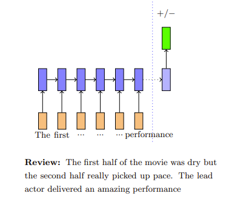
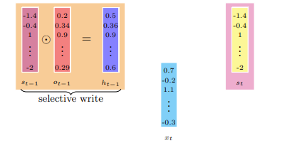
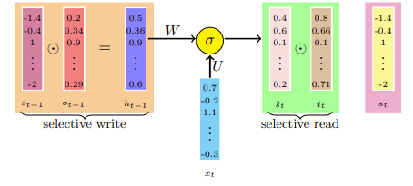
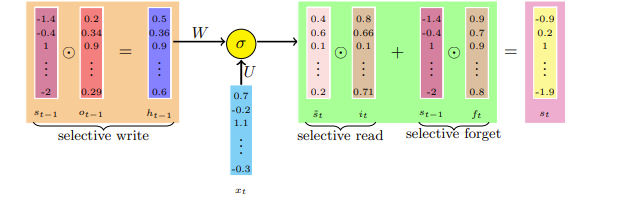
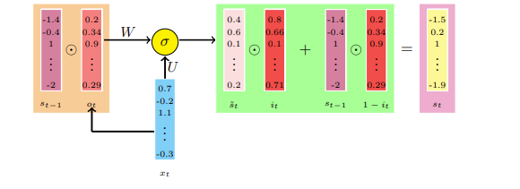
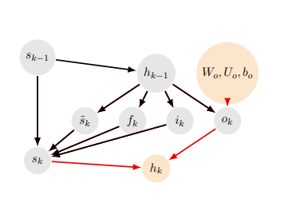

# LSTMs and GRUs

## Reference

- https://www.cse.iitm.ac.in/~miteshk/CS7015/Slides/Handout/Lecture15.pdf

## 1 选择性读取、选择性写入、选择性遗忘——白板类比

循环神经网络（RNN）的状态（$s_{i}$）记录了所有先前时间步的信息. 在每个新的时间步，旧信息会被当前输入改变. 可以想象，在$t$步之后，在时间步$t - k$（其中$k < t$）存储的信息会被完全改变，以至于无法提取在时间步$t - k$存储的原始信息. 

类似的问题也会在信息反向传播时出现. 很难将时间步$t$产生的误差归因于时间步$t - k$发生的事件. 这种归因当然是以梯度的形式呈现的，我们在讨论梯度反向传播问题时研究过这个问题. 在讨论梯度消失时，我们对此进行了正式的论证. 

让我们来看一个类比. 我们可以将状态视为一个固定大小的内存，将其与你用来记录信息的固定大小的白板进行比较. 在每个时间步（周期性间隔），我们在白板上写一些东西. 实际上，在每个时间步，我们都会改变截至该时间点记录的信息. 经过多个时间步后，就无法看出时间步$t - k$的信息是如何对时间步$t$的状态产生贡献的. 

继续我们的白板类比，假设我们想在白板上推导一个表达式. 我们在每个时间步遵循以下策略：选择性地在白板上书写、选择性地读取已经写好的内容、选择性地忘记（擦除）内容. 让我们详细看看这些操作. 

例如，计算 $ac(bd + a)+ad$，其中 $a = 1$，$b = 3$，$c = 5$，$d = 11$. 假设“白板”一次只能写3个式子. 

- 步骤1：写 $ac = 5$
- 步骤2：写 $bd = 33$
- 步骤3：写 $bd + a = 34$
- 步骤4：写 $ac(bd + a)=170$
- 步骤5：写 $ad = 11$
- 步骤6：写 $ac(bd + a)+ad = 181$

### 选择性写入

在推导过程中可能有很多步骤，但我们可能会跳过一些. 换句话说，我们选择要写的内容. 

### 选择性读取

在写下一步时，我们通常会读取之前已经写好的一些步骤，然后决定下一步写什么. 例如，在步骤3中，步骤2的信息很重要. 换句话说，我们选择要读取的内容. 

### 选择性遗忘

一旦白板写满了，我们就需要删除一些过时的信息. 但是我们如何决定删除哪些内容呢？我们通常会删除最没用的信息. 换句话说，我们选择要遗忘的内容. 

还有很多其他场景可以说明选择性写入、读取和遗忘的必要性. 例如，我们可以把大脑想象成只能存储有限数量事实的器官. 在不同的时间步，我们有选择地读取、写入和遗忘一些事实. 由于RNN也有有限的状态大小，我们需要找到一种方法，让它能够**选择性地读取、写入和遗忘**. 

## 2 长短期记忆（LSTM）和门控循环单元（GRU）

### 问题

我们能给出一个RNN也需要选择性读取、写入和遗忘的具体例子吗？我们如何将这种直觉转化为数学方程？

### 影评示例

影评：电影的前半部分很枯燥，但后半部分节奏明显加快. 主演的表演非常精彩. 

考虑预测影评情感倾向（正面/负面）的任务. RNN从左到右读取文档，每读取一个单词就更新一次状态. 当我们读到文档末尾时，从开头几个单词获得的信息就完全丢失了. 理想情况下，我们希望：忘记停用词（如“a”“the”等）添加的信息；有选择地读取之前带有情感倾向的单词（如“awesome”“amazing”等）添加的信息；有选择地将当前单词的新信息写入状态. 

请记住，蓝色向量（$s_{t}$）被称为RNN的状态. 它的大小是有限的（$s_{t} \in \mathbb{R}^{n}$），用于存储直到时间步 $t$ 的所有信息. 这个状态类似于白板，迟早会过载，初始状态的信息会被改变得面目全非. 我们期望：通过选择性写入、读取和遗忘，确保这个有限大小的状态向量得到有效利用. 

需要明确的是，我们在时间步 $t - 1$ 计算出了状态 $s_{t - 1}$，现在我们想用新信息（$x_{t}$）对其进行更新，并计算新的状态（$s_{t}$）. 在这个过程中，我们要确保使用选择性写入、读取和遗忘，以便只有重要信息保留在$s_{t}$中. 现在我们来看看如何实现这些期望的功能. 

### 选择性写入

回想一下，在RNN中，我们使用 $s_{t - 1}$ 来计算 $s_{t}$，公式为 $s_{t}=\sigma(W s_{t - 1}+U x_{t})$（忽略偏置）. 但现在，我们不想将$s_{t - 1}$原封不动地传递到$s_{t}$，而是只想将其中的一部分传递（写入）到下一个状态. 在最严格的情况下，我们的决策可能是二元的（例如，保留第1个和第3个元素，删除其余元素）. 但更合理的做法是为每个元素分配一个0到1之间的值，以确定当前状态传递到下一个状态的比例. 

我们引入一个向量 $o_{t - 1}$，它决定了 $s_{t - 1}$ 的每个元素应该传递到下一个状态的比例. $o_{t - 1}$ 的每个元素都与 $s_{t - 1}$ 的对应元素相乘. $o_{t - 1}$ 的每个元素都被限制在0到1之间. 

但是我们如何计算 $o_{t - 1}$ 呢？RNN如何知道应该传递多少比例的状态呢？

RNN必须与其他参数（$W$、$U$、$V$）一起学习 $o_{t - 1}$. 我们通过以下公式计算 $o_{t - 1}$ 和 $h_{t - 1}$：

$$
o_{t - 1}=\sigma\left(W_{o} h_{t - 2}+U_{o} x_{t - 1}+b_{o}\right)
$$

$$
h_{t - 1}=o_{t - 1} \odot \sigma\left(s_{t - 1}\right)
$$

参数 $W_{o}$、$U_{o}$、$b_{o}$ 需要与现有的参数$W$、$U$、$V$一起学习. sigmoid（逻辑）函数确保值在0到1之间. $o_{t}$被称为输出门，因为它决定了传递（写入）到下一个时间步的信息量. 

### 选择性读取

现在我们将使用 $h_{t - 1}$ 来计算下一个时间步的新状态. 我们还将使用 $x_{t}$，它是时间步 $t$ 的新输入. 

$$
\tilde{s}_{t}=\sigma\left(W h_{t - 1}+U x_{t}+b\right)
$$

注意，$W$、$U$ 和 $b$ 与我们在RNN中使用的参数类似（为简单起见，图中未显示偏置$b$）. 

$\tilde{s}_{t}$捕获了来自上一个状态（$h_{t - 1}$）和当前输入$x_{t}$的所有信息. 然而，在构建新的单元状态$s_{t}$之前，我们可能不想使用所有这些新信息，而只想有选择地从中读取. 为了实现这一点，我们引入另一个门，称为输入门. 
$$i_{t}=\sigma\left(W_{i} h_{t - 1}+U_{i} x_{t}+b_{i}\right)$$

并使用$i_{t} \odot \tilde{s_{t}}$作为有选择地读取的状态信息. 

到目前为止，我们有以下内容：

- 上一个状态：$s_{t - 1}$
- 输出门：$o_{t - 1}=\sigma\left(W_{o} h_{t - 2}+U_{o} x_{t - 1}+b_{o}\right)$
- 选择性写入：$h_{t - 1}=o_{t - 1} \odot \sigma\left(s_{t - 1}\right)$
- 当前（临时）状态：$\tilde{s_{t}}=\sigma\left(W h_{t - 1}+U x_{t}+b\right)$
- 输入门：$i_{t}=\sigma\left(W_{i} h_{t - 1}+U_{i} x_{t}+b_{i}\right)$
- 选择性读取：$i_{t} \odot \tilde{s}_{t}$

### 选择性遗忘

我们如何将 $s_{t - 1}$ 和 $\tilde{s_{t}}$ 结合起来得到新状态呢？这里有一种简单（但有效）的方法：

$$
s_{t}=s_{t - 1}+i_{t} \odot \tilde{s_{t}}
$$

但我们可能不想使用整个 $s_{t - 1}$，而是想忘记其中的一些部分. 为了实现这一点，我们引入遗忘门. 

$$
f_{t}=\sigma\left(W_{f} h_{t - 1}+U_{f} x_{t}+b_{f}\right)
$$

$$
s_{t}=f_{t} \odot s_{t - 1}+i_{t} \odot \tilde{s}_{t}
$$

现在我们得到了LSTM的完整方程组. 绿色框及其后的选择性写入操作展示了在时间步$t$发生的所有计算. 
 - 门：
 $$o_{t}=\sigma\left(W_{o} h_{t - 1}+U_{o} x_{t}+b_{o}\right)$$
 $$i_{t}=\sigma\left(W_{i} h_{t - 1}+U_{i} x_{t}+b_{i}\right)$$
 $$f_{t}=\sigma\left(W_{f} h_{t - 1}+U_{f} x_{t}+b_{f}\right)$$
 - 状态：
 $$\tilde{s_{t}}=\sigma\left(W h_{t - 1}+U x_{t}+b\right)$$
 $$s_{t}=f_{t} \odot s_{t - 1}+i_{t} \odot \tilde{s_{t}}$$
 $$h_{t}=o_{t} \odot \sigma\left(s_{t}\right) \text{ 且 } rnn_{out }=h_{t}$$

LSTM有很多变体，包括不同数量的门以及不同的门排列方式. 我们刚刚看到的是最流行的LSTM变体之一. 另一个同样流行的LSTM变体是门控循环单元（GRU），我们接下来会介绍. 

### GRU的完整方程组

 - 门：
 $$o_{t}=\sigma\left(W_{o} s_{t - 1}+U_{o} x_{t}+b_{o}\right)$$
 $$i_{t}=\sigma\left(W_{i} s_{t - 1}+U_{i} x_{t}+b_{i}\right)$$
 - 状态：
 $$\tilde{s_{t}}=\sigma\left(W\left(o_{t} \odot s_{t - 1}\right)+U x_{t}+b\right)$$
 $$s_{t}=\left(1 - i_{t}\right) \odot s_{t - 1}+i_{t} \odot \tilde{s_{t}}$$

GRU没有显式的遗忘门（遗忘门和输入门是关联的）. 门直接依赖于$s_{t - 1}$，而不像LSTM那样依赖于中间的$h_{t - 1}$. 

## 3 LSTM如何避免梯度消失问题

### 直觉

在正向传播过程中，门控制着信息的流动. 它们防止任何无关信息写入状态. 同样，在反向传播过程中，门控制着梯度的流动. 很容易看出，在反向传播过程中，梯度会与门相乘. 

如果时间步 $t - 1$ 的状态对时间步$t$的状态贡献不大（即如果 $\left\|f_{t}\right\| \to 0$ 且 $\left\|o_{t - 1}\right\| \to 0$），那么在反向传播过程中，流入 $s_{t - 1}$ 的梯度会消失. 但这种梯度消失是可以接受的（因为 $s_{t - 1}$ 对 $s_{t}$ 没有贡献，我们不想让它为 $s_{t}$ 的“错误”负责）. 与普通RNN的关键区别在于，信息和梯度的流动由门控制，这确保了梯度只在应该消失的时候消失（即当 $s_{t - 1}$ 对 $s_{t}$ 贡献不大时）. 

现在我们来看一个关于门如何控制梯度流动的说明性证明. 

回想一下，RNN中有一个乘法项会导致梯度消失. 
$$\frac{\partial \mathscr{L}_{t}(\theta)}{\partial W}=\frac{\partial \mathscr{L}_{t}(\theta)}{\partial s_{t}} \sum_{k = 1}^{t} \prod_{j = k}^{t - 1} \frac{\partial s_{j + 1}}{\partial s_{j}} \frac{\partial^{+} s_{k}}{\partial W}$$

特别是，如果$\mathscr{L}_{4}(\theta)$处的损失很高，是因为$W$不够好，无法正确计算$s_{1}$，那么这个信息不会通过梯度$\frac{\partial \mathscr{L}_{t}(\theta)}{\partial W}$传播回$W$，因为沿着这条长路径的梯度会消失. 

一般来说，当从 $\mathscr{L}_{t}(\theta)$ 到 $\theta_{i}$ 的每一条路径上的梯度都消失时，$\frac{\partial \mathscr{L}_{t}(\theta)}{\partial \theta_{i}}$ 的梯度就会消失. 另一方面，当至少有一条路径上的梯度爆炸时， $\frac{\partial \mathscr{L}_{t}(\theta)}{\partial \theta_{i}}$ 的梯度就会爆炸. 我们首先要论证，在LSTM的情况下，至少存在一条路径，梯度可以有效地流动（因此不会出现梯度消失）. 

我们从LSTM中不同变量的依赖图开始. 

从时间步$k - 1$的状态开始：

$$
o_{k}=\sigma\left(W_{o} h_{k - 1}+U_{o} x_{k}+b_{o}\right)
$$

为了简单起见，我们暂时省略参数，稍后再讨论它们. 

$$
\begin{align*}
i_{k}&=\sigma\left(W_{i} h_{k - 1}+U_{i} x_{k}+b_{i}\right)\\
f_{k}&=\sigma\left(W_{f} h_{k - 1}+U_{f} x_{k}+b_{f}\right)\\
\tilde{s_{k}}&=\sigma\left(W h_{k - 1}+U x_{k}+b\right)\\
s_{k}&=f_{k} \odot s_{k - 1}+i_{k} \odot \tilde{s_{k}}\\
h_{k}&=o_{k} \odot \sigma\left(s_{k}\right)\\
\end{align*}
$$

从$h_{k - 1}$和$s_{k - 1}$出发，我们得到了$h_{k}$和$s_{k}$. 这个递归过程将持续到最后一个时间步. 为了简单和便于说明，我们没有将参数（$W$、$W_{o}$、$W_{i}$、$W_{f}$、$U$、$U_{o}$、$U_{i}$、$U_{f}$）作为图中的单独节点，而是将它们放在了相应的边上. （我们只展示了一部分参数）

例如，我们想知道梯度是否通过 $s_{k}$ 流向 $W_{f}$. 换句话说，如果 $\mathscr{L}_{t}(\theta)$ 很高是因为 $W_{f}$ 未能为 $s_{k}$ 计算出合适的值，那么这个信息应该通过梯度反馈到 $W_{f}$. 我们也可以对其他参数（例如$W_{i}$、$W_{o}$、$W$等）提出类似的问题. LSTM是如何确保即使在任意时间步，这个梯度也不会消失的呢？让我们来看看. 

要证明这一点，只需证明 $\frac{\partial L_{t}(\theta)}{\partial s_{k}}$ 不会消失（因为如果这个不消失，我们就可以通过 $s_{k}$ 到达 $W_{f}$）. 首先，我们观察到从 $\mathscr{L}_{t}(\theta)$ 到 $s_{k}$ 有多个路径（在反向传播时，只需将箭头方向反转）. 例如，有一条路径通过 $s_{k + 1}$，另一条通过 $h_{k}$. 此外，到达 $h_{k}$ 本身也有多个路径（从 $h_{k}$ 的出边数量就可以明显看出）. 所以现在你只需相信从 $\mathscr{L}_{t}(\theta)$ 到 $s_{k}$ 有很多路径. 

考虑其中一条路径（突出显示），它会对梯度产生贡献. 我们将这条路径上的梯度表示为 $t_{0}$. 

$$
t_{0}=\frac{\partial \mathscr{L}_{t}(\theta)}{\partial h_{t}} \frac{\partial h_{t}}{\partial s_{t}} \frac{\partial s_{t}}{\partial s_{t - 1}} \cdots \frac{\partial s_{k + 1}}{\partial s_{k}}
$$

第一项 $\frac{\partial \mathscr{L}_{t}(\theta)}{\partial h_{t}}$ 没问题，不会消失（$h_{t}$直接连接到$\mathscr{L}_{t}(\theta)$，没有中间节点会导致梯度消失）. 现在我们来看其他项 $\frac{\partial h_t}{\partial s_t} \frac{\partial s_t}{\partial s_{t - 1}} \ (\forall t)$

让我们先看 $\frac{\partial h_{t}}{\partial s_{t}}$ . 回想一下， $h_{t}=o_{t} \odot \sigma\left(s_{t}\right)$ . 注意， $h_{t}$ 的第 $i$ 个元素仅依赖于 $o_{t}$ 和 $s_{t}$ 的第 $i$ 个元素，而不依赖于 $o_{t}$ 和 $s_{t}$ 的其他元素. 因此， $\frac{\partial h_{t}}{\partial s_{t}}$ 将是一个 $\in \mathbb{R}^{d×d}$ 的对角方阵，其对角线元素为 $o_{t} \odot \sigma'(s_{t})\in \mathbb{R}^{d}$ （见第14讲的第35页幻灯片）. 我们用 $D(o_{t} \odot \sigma'(s_{t}))$ 表示这个对角矩阵. 

现在考虑 $\frac{\partial s_{t}}{\partial s_{t - 1}}$ . 回想一下， $s_{t}=f_{t} \odot s_{t - 1}+i_{t} \odot \tilde{s_{t}}$ . 注意， $\tilde{s_{t}}$ 也依赖于 $s_{t - 1}$ ，所以不能将其视为常数. 同样，我们处理的是一个有序网络，因此 $\frac{\partial s_{t}}{\partial s_{t - 1}}$ 将是一个显式项和一个隐式项的和（见第14讲的第37页幻灯片）. 为简单起见，我们假设隐式项的梯度消失（我们假设这是最坏的情况 ）. 将 $\tilde{s_{t}}$ 视为常数时，显式项的梯度由 $D(f_{t})$ 给出. 

现在回到 $t_{0}$ 的完整表达式：

$$
\begin{align*}
t_{0}&=\frac{\partial \mathcal{L}_{t}(\theta)}{\partial h_{t}} \frac{\partial h_{t}}{\partial s_{t}} \frac{\partial s_{t}}{\partial s_{t - 1}} \cdots \frac{\partial s_{k + 1}}{\partial s_{k}}\\
&=\mathcal{L}_{t}'(h_{t}) \cdot \mathcal{D}(o_{t} \odot \sigma'(s_{t}))\mathcal{D}(f_{t}) \cdots \mathcal{D}(f_{k + 1})\\
&=\mathcal{L}_{t}'(h_{t}) \cdot \mathcal{D}(o_{t} \odot \sigma'(s_{t}))\mathcal{D}(f_{t} \odot \cdots \odot f_{k + 1})\\
&=\mathcal{L}_{t}'(h_{t}) \cdot \mathcal{D}(o_{t} \odot \sigma'(s_{t}))\mathcal{D}(\odot_{i = k + 1}^{t} f_{i})
\end{align*}
$$

红色项不会消失，蓝色项包含遗忘门的乘积. 因此，遗忘门根据一个状态（ $s_{t}$ ）对下一个状态 $s_{t + 1}$ 的明确贡献来调节梯度流. 

如果在正向传播中 $s_{t}$ 对 $s_{t + 1}$ 的贡献不大（因为 $f_{t} \to 0$ ），那么在反向传播中，梯度也不会到达 $s_{t}$ . 这是合理的，因为如果 $s_{t}$ 对 $s_{t + 1}$ 的贡献不大，那么在反向传播中就没有理由让它承担责任（ $f_{t}$ 在正向传播和反向传播中起到相同的调节作用，这是合理的）. 因此，存在这样一条路径，当梯度不应该消失时，它不会消失. 正如所论证的，只要梯度通过其中一条路径（ $t_{0}$ 通过 $s_{k}$ ）反馈到 $W_{f}$ ，我们就没问题！当然，梯度仅在需要时反馈，由 $f_{i}$ 进行调节（但我最后再说一次，这是合理的）. 

现在我们来看看为什么LSTM不能解决梯度爆炸的问题. 我们将展示一条梯度可能爆炸的路径. 让我们计算 $\frac{\partial L_{t}(\theta)}{\partial h_{k - 1}}$ 中对应突出显示路径的一项（比如 $t_{1}$  ）：
$$\begin{align*}
t_{1}&=\frac{\partial \mathcal{L}_{t}(\theta)}{\partial h_{t}}(\frac{\partial h_{t}}{\partial o_{t}} \frac{\partial o_{t}}{\partial h_{t - 1}})\cdots(\frac{\partial h_{k}}{\partial o_{k}} \frac{\partial o_{k}}{\partial h_{k - 1}})\\
&=\mathcal{L}_{t}'(h_{t})(\mathcal{D}(\sigma(s_{t}) \odot o_{t}') \cdot W_{o})\cdots(\mathcal{D}(\sigma(s_{k}) \odot o_{k}') \cdot W_{o})
\end{align*}
$$

 $\left\| t_{1}\right\| \leq\left\| \mathcal{L}_{t}'(h_{t})\right\| (\| K\| \left\| W_{o}\right\| )^{t - k + 1}$ 

根据矩阵 $W_{o}$ 的范数，梯度 $\frac{\partial L_{t}(\theta)}{\partial h_{k - 1}}$ 可能会爆炸. 类似地， $W_{i}$ 、 $W_{f}$ 和 $W$ 也可能导致梯度爆炸. 

那么我们如何处理梯度爆炸的问题呢？一种流行的技巧是使用梯度裁剪. 在反向传播过程中，如果梯度的范数超过某个值，就对其进行缩放，使其范数保持在可接受的阈值内. 本质上，我们保留梯度的方向，但缩小其范数. 

