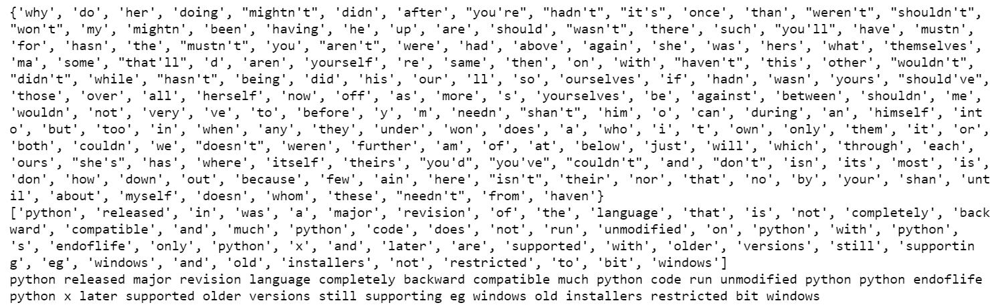

# 文本规范化

## Reference

- https://www.geeksforgeeks.org/natural-language-processing-nlp-tutorial/
- https://www.geeksforgeeks.org/write-regular-expressions/
- https://www.geeksforgeeks.org/nlp-how-tokenizing-text-sentence-words-works/
- https://www.geeksforgeeks.org/python-lemmatization-with-nltk/
- https://www.geeksforgeeks.org/introduction-to-stemming/
- https://www.geeksforgeeks.org/removing-stop-words-nltk-python/
- https://www.geeksforgeeks.org/nlp-part-of-speech-default-tagging/

文本规范化将文本转换为一致的格式，提高了质量，使其更容易在NLP任务中处理. 

## 文本规范化基本步骤

在本文中，我们将学习如何使用Python规范化文本数据. 让我们先讨论一些概念：

- 文本数据是系统收集的材料，由书面、印刷或电子出版的文字组成，通常是有意撰写或从语音转录而来. 
- 文本规范化是将文本转换为一种规范形式的过程，这种规范形式可能是文本之前并不具备的. 在存储或处理文本之前对其进行规范化，有助于分离关注点，因为在对输入数据进行操作之前，确保其一致性是很重要的. 文本规范化需要清楚了解要规范化的文本类型以及后续的处理方式；并不存在通用的规范化程序. 

### 所需步骤

在这里，我们将讨论文本规范化所需的一些基本步骤. 

1. 输入文本字符串. 
2. 将字符串中的所有字母转换为一种大小写形式（小写或大写）. 
3. 如果数字对分析很重要，就将其转换为单词，否则删除所有数字. 
4. 删除标点符号和其他语法格式. 
5. 删除空白字符. 
6. 删除停用词. 
7. 进行其他必要的计算. 

我们通过上述步骤进行文本规范化，每个步骤都有多种实现方式. 因此，我们将在整个过程中详细讨论每一个步骤. 

#### 文本字符串

```bash
# input string 
string = "       Python 3.0, released in 2008, was a major revision of the language that is not completely backward compatible and much Python 2 code does not run unmodified on Python 3. With Python 2's end-of-life, only Python 3.6.x[30] and later are supported, with older versions still supporting e.g. Windows 7 (and old installers not restricted to 64-bit Windows)."
print(string)
```

output:

```bash
”       Python 3.0, released in 2008, was a major revision of the language that is not completely backward compatible and much Python 2 code does not run unmodified on Python 3. With Python 2’s end-of-life, only Python 3.6.x[30] and later are supported, with older versions still supporting e.g. Windows 7 (and old installers not restricted to 64-bit Windows).”
```

#### 案例转换（转换为小写）

在Python中，`lower()`是一个用于字符串处理的内置方法. `lower()`方法会返回给定字符串的小写形式，它会将所有大写字符转换为小写. 如果字符串中不存在大写字符，则返回原始字符串. 

```python
# input string
string = "       Python 3.0, released in 2008, was a major revision of the language that is not completely backward compatible and much Python 2 code does not run unmodified on Python 3. With Python 2's end-of-life, only Python 3.6.x[30] and later are supported, with older versions still supporting e.g. Windows 7 (and old installers not restricted to 64-bit Windows)."
 
# convert to lower case
lower_string = string.lower()
print(lower_string)
```

输出：

```
”       python 3.0, released in 2008, was a major revision of the language that is not completely backward compatible and much python 2 code does not run unmodified on python 3. with python 2’s end-of-life, only python 3.6.x[30] and later are supported, with older versions still supporting e.g. windows 7 (and old installers not restricted to 64-bit windows).”
```

#### 删除数字

如果数字与您的分析无关，则将其删除. 通常，会使用正则表达式来删除数字. 

```python
# import regex
import re
 
# input string 
string = "       Python 3.0, released in 2008, was a major revision of the language that is not completely backward compatible and much Python 2 code does not run unmodified on Python 3. With Python 2's end-of-life, only Python 3.6.x[30] and later are supported, with older versions still supporting e.g. Windows 7 (and old installers not restricted to 64-bit Windows)."
 
# convert to lower case
lower_string = string.lower()
 
# remove numbers
no_number_string = re.sub(r'\d+','',lower_string)
print(no_number_string)
```

输出：

```
”       python ., released in , was a major revision of the language that is not completely backward compatible and much python  code does not run unmodified on python . with python ‘s end-of-life, only python ..x[] and later are supported, with older versions still supporting e.g. windows  (and old installers not restricted to -bit windows).”
```

#### 删除标点符号

删除标点符号这一步也可以使用正则表达式来完成. 

```python
# import regex
import re
 
# input string 
string = "       Python 3.0, released in 2008, was a major revision of the language that is not completely backward compatible and much Python 2 code does not run unmodified on Python 3. With Python 2's end-of-life, only Python 3.6.x[30] and later are supported, with older versions still supporting e.g. Windows 7 (and old installers not restricted to 64-bit Windows)."
 
# convert to lower case
lower_string = string.lower()
 
# remove numbers
no_number_string = re.sub(r'\d+','',lower_string)
 
# remove all punctuation except words and space
no_punc_string = re.sub(r'[^\w\s]','', no_number_string) 
print(no_punc_string)
```

输出：

```
‘       python  released in  was a major revision of the language that is not completely backward compatible and much python  code does not run unmodified on python  with python s endoflife only python x and later are supported with older versions still supporting eg windows  and old installers not restricted to bit windows’
```

#### 删除空白字符

`strip()`函数是Python编程语言中的一个内置函数，它会返回字符串的副本，并删除字符串开头和结尾的字符（根据传入的字符串参数决定删除哪些字符）. 

```python
# import regex
import re
 
# input string 
string = "       Python 3.0, released in 2008, was a major revision of the language that is not completely backward compatible and much Python 2 code does not run unmodified on Python 3. With Python 2's end-of-life, only Python 3.6.x[30] and later are supported, with older versions still supporting e.g. Windows 7 (and old installers not restricted to 64-bit Windows)."
 
# convert to lower case
lower_string = string.lower()
 
# remove numbers
no_number_string = re.sub(r'\d+','',lower_string)
 
# remove all punctuation except words and space
no_punc_string = re.sub(r'[^\w\s]','', no_number_string) 
 
# remove white spaces
no_wspace_string = no_punc_string.strip()
print(no_wspace_string)
```

输出：

```
‘python  released in  was a major revision of the language that is not completely backward compatible and much python  code does not run unmodified on python  with python s endoflife only python x and later are supported with older versions still supporting eg windows  and old installers not restricted to bit windows’
```

#### 删除停用词

“停用词”是语言中最常见的词汇，如“the”“a”“on”“is”“all”等. 这些词不携带重要意义，通常会从文本中删除. 可以使用自然语言处理工具包（NLTK）来删除停用词，NLTK是一组用于符号和统计自然语言处理的库和程序. 

```python
# download stopwords
import nltk
nltk.download('stopwords')
 
# import nltk for stopwords
from nltk.corpus import stopwords
stop_words = set(stopwords.words('english'))
print(stop_words)
 
# assign string
no_wspace_string='python  released in  was a major revision of the language that is not completely backward compatible and much python  code does not run unmodified on python  with python s endoflife only python x and later are supported with older versions still supporting eg windows  and old installers not restricted to bit windows'
 
# convert string to list of words
lst_string = [no_wspace_string][0].split()
print(lst_string)
 
# remove stopwords
no_stpwords_string=""
for i in lst_string:
    if not i in stop_words:
        no_stpwords_string += i+' '
         
# removing last space
no_stpwords_string = no_stpwords_string[:-1]
print(no_stpwords_string)
```

输出：



通过以上步骤，我们可以使用Python对文本数据进行规范化处理. 

下面介绍一下文本规范化的关键点. 

## 正则表达式（Regular Expressions）

在前面我们使用正则表达式进行数字、标点符号和空白字符的删除，现在我们来深入学一下正则表达式


正则表达式（regex）是定义搜索模式的一系列字符. 以下是编写正则表达式的方法：

1. 首先要了解正则表达式中使用的特殊字符，如`.`, `^`, `+`, `?`等. 
2. 选择支持正则表达式的编程语言或工具，如Python、Perl或grep. 
3. 使用特殊字符和字面字符编写你的模式. 
4. 使用适当的函数或方法在字符串中搜索该模式. 

### 示例

1. 要匹配一系列字面字符，只需在模式中写入这些字符即可. 
2. 要从一组可能的字符中匹配单个字符，使用方括号，例如`[0123456789]`可以匹配任意数字. 
3. 要匹配前一个表达式的零次或多次出现，使用星号（`*`）符号. 
4. 要匹配前一个表达式的一次或多次出现，使用加号（`+`）符号. 
5. 值得注意的是，正则表达式可能很复杂且难以阅读，因此建议使用正则表达式测试工具来调试和优化你的模式. 

正则表达式（有时也称为有理表达式）是定义搜索模式的一系列字符，主要用于与字符串进行模式匹配，即“查找和替换”之类的操作. 

正则表达式是一种通用的字符序列模式匹配方式，在像C++这样的各种编程语言中都有应用. 它还用于谷歌分析中的URL匹配，并且在大多数流行的编辑器（如Sublime、Notepad++、Brackets、谷歌文档和微软Word）中支持搜索和替换功能. 

### 示例：电子邮件地址的正则表达式

```bash
^([a - ZA - Z0 - 9_1 - \.]+)@([a - ZA - Z0 - 9_1 - \.]+)\.([a - zA - Z]{2,5})$
```

上述正则表达式可用于检查给定的一组字符是否为电子邮件地址. 

### 如何编写正则表达式？

编写正则表达式时会用到以下一些特定元素：

1. **重复器（`*`、`+`和`{}`）**：这些符号用作重复器，告诉计算机前一个字符要使用不止一次. 
2. **星号符号（`*`）**：它告诉计算机匹配前一个字符（或一组字符）零次或多次（最多无穷次）. 例如，正则表达式 `ab*c` 可以匹配 `ac`,`abc, `abbc`“abbbc”等. 
3. **加号符号（`+`）**：它告诉计算机重复前一个字符（或一组字符）至少一次或多次（最多无穷次）. 例如，正则表达式 `ab+c` 可以匹配 `abc`, `abbc`, `abbbc`等. 
4. **花括号`{...}`**：它告诉计算机按照花括号内的值重复前一个字符（或一组字符）. 例如，`{2}` 表示前一个字符要重复2次，`{min,}` 表示前一个字符要匹配 `min` 次或更多次，`{min, max}` 表示前一个字符至少重复 `min` 次且最多重复 `max` 次. 
5. **点号符号（`.`）**：点号可以代替任何其他符号，因此它被称为通配符. 例如，正则表达式 `.*` 会告诉计算机可以使用任意字符，且次数不限. 
6. **可选字符（`?`）**：这个符号告诉计算机前一个字符在要匹配的字符串中可能存在，也可能不存在. 例如，我们可以将文档文件格式写为 `docx?`，这里的 `?` 表示 `x` 在文件格式名称中可能出现，也可能不出现. 
7. **脱字符（`^`）符号（设置匹配位置）**：脱字符告诉计算机匹配必须从字符串或行的开头开始. 例如，`^\d{3}` 会匹配像 `901`, `901-333-` 这样的模式. 
8. **美元符号（`$`）**：它告诉计算机匹配必须出现在字符串的末尾，或者在字符串末尾的换行符（\n）之前. 例如，`-\d{3}$` 会匹配像`-333`, `901-333` 这样的模式. 
9. **字符类**：字符类用于匹配一组字符中的任意一个，可用于匹配语言中最基本的元素，如字母、数字、空格、符号等. 
    - `\s`：匹配任何空白字符，如空格和制表符. 
    - `\S`：匹配任何非空白字符. 
    - `\d`：匹配任何数字字符. 
    - `\D`：匹配任何非数字字符. 
    - `\w`：匹配任何单词字符（基本上是字母数字字符）. 
    - `[set_of_characters]`：匹配set_of_characters中的任何单个字符，默认情况下，匹配是区分大小写的. 例如，`[abc]` 会匹配任何字符串中的字符 `a`, `b`和`c`. 
10. **`[^set_of_characters]`否定**：匹配不在set_of_characters中的任何单个字符，默认情况下，匹配是区分大小写的. 例如，`[^abc]` 会匹配除 `a`,`b`, `c` 之外的任何字符. 
11. **`[first - last]`字符范围**：匹配从first到last范围内的任何单个字符. 例如，`[a - zA - Z]` 会匹配从 `a` 到 `z` 或从 `A` 到 `Z` 的任何字符. 
12. **转义符号（`\`）**：如果你想匹配实际的 `.`, `*` 等字符，在该字符前加上反斜杠（`\`）. 这会告诉计算机将后面的字符视为搜索字符，并将其纳入匹配模式中. 例如，`\d+[\+-\x*]\d+` 会在 `(2 + 2)*3*9` 中匹配像 `2 + 2` 和 `3*9` 这样的模式. 
13. **分组字符（`()`）**：可以将正则表达式中的一组不同符号组合在一起，使其作为一个单元和块来运作. 为此，你需要用括号（`()`）将正则表达式括起来. 例如，`([A - Z]\w+)` 包含了正则表达式的两个不同元素，组合在一起后，这个表达式会匹配任何包含大写字母后跟任意字符的模式. 
14. **竖线（`|`）**：匹配由竖线（`|`）字符分隔的任何一个元素. 例如，`th(el|is|at)` 会匹配单词 `the`, `this` 和`that`. 
15. **`\number`**：在同一个正则表达式中，`\number` 表示第 `n` 个括号内的组将在当前位置重复. 例如，`([a - z])\1` 会在 `Geek` 中匹配`ee`，因为匹配位置中第二个字符与第一个字符相同. 
16. **注释（`?#comment`）**：内联注释，注释在第一个右括号处结束. 例如，`\bA(?#这是一个内联注释)\w+\b`. 
17. **`#[到行尾]`**：X模式注释，注释从一个未转义的 `#` 开始，一直延续到行尾. 例如，`(?x)\bA\w+\b#` 匹配以A开头的单词. 

## 分词（Tokenization）

分词是将文本分割成较小单元（即词元）的过程。在自然语言处理的语境中，词元通常是单词或子单词。分词在许多自然语言处理任务中都至关重要。比如，在一个句子里，一个单词就是一个词元；在一个段落中，一个句子就是一个词元。

分词需要使用分词器将非结构化数据和自然语言文本分割成不同的信息块，并将它们当作不同的元素来处理。文档中的词元可以作为向量，将非结构化的文本文档转换为适合机器学习的数值数据结构。这种快速转换能让计算机立即使用这些分词后的元素来执行实际操作和做出响应。此外，它们还可以作为机器学习流程中的特征，推动更复杂的决策过程或行为。

### 分词的类型

根据文本的分割方式，分词可分为多种类型。以下是一些常见的分词类型：

#### 单词分词（Word Tokenization）

单词分词将文本分割成单个单词。许多自然语言处理任务都采用这种方法，将单词视为意义的基本单位。

- 示例：
    - 输入：“Tokenization is an important NLP task.”
    - 输出：["Tokenization", "is", "an", "important", "NLP", "task", "."]

#### 句子分词（Sentence Tokenization）

句子分词是将文本分割成句子。这在需要对单个句子进行分析或处理的任务中非常有用。
- 示例：
    - 输入：“Tokenization is an important NLP task. It helps break down text into smaller units.”
    - 输出：["Tokenization is an important NLP task.", "It helps break down text into smaller units."]

#### 子词分词（Subword Tokenization）

子词分词是把单词分解成更小的单元，在处理形态丰富的语言或罕见词时，这种方法特别有用。
- 示例：
    - 输入：“tokenization”
    - 输出：["token", "ization"]

#### 字符分词（Character Tokenization）

字符分词是将文本分割成单个字符。这在进行字符级语言建模时很有用。
- 示例：
    - 输入：“Tokenization”
    - 输出：["T", "o", "k", "e", "n", "i", "z", "a", "t", "i", "o", "n"]

### 分词的必要性

分词在文本处理和自然语言处理（NLP）中至关重要，原因如下：
1. **高效文本处理**：分词可以减小原始文本的规模，使其更易于处理和分析。
2. **特征提取**：在机器学习模型中，将词元作为特征，可以将文本数据用数字形式表示，便于算法理解。
3. **语言建模**：自然语言处理中的分词有助于创建有序的语言表示形式，这对文本生成和语言建模等任务很有帮助。
4. **信息检索**：在基于单词或短语高效存储和检索信息的系统中，分词对于索引和搜索至关重要。
5. **文本分析**：分词在许多自然语言处理任务中都有应用，包括情感分析和命名实体识别，用于确定句子中单个单词的功能和语境。
6. **词汇管理**：通过处理一组不同的词元，可以更好地管理词汇表，提高语言处理的准确性和效率。
7. **任务特定适配**：分词可以根据特定的自然语言处理任务进行定制，在诸如文本摘要和机器翻译等应用中发挥最佳效果。
8. **预处理步骤**：这一重要的预处理步骤将未处理的文本转换为适合进一步统计和计算分析的格式。

### 分词的实现

#### 使用sent_tokenize进行句子分词
下面的代码片段使用了NLTK库中的sent_tokenize函数。sent_tokenize函数用于将给定文本分割成句子列表。

```python
from nltk.tokenize import sent_tokenize
text = "Hello everyone. Welcome to GeeksforGeeks. You are studying NLP article."
sent_tokenize(text)
```

- 输出：
```bash
["Hello everyone.", "Welcome to GeeksforGeeks.", "You are studying NLP article"]
```

#### sent_tokenize的工作原理

sent_tokenize函数使用了nttk.tokenize.punkt模块中的PunktSentenceTokenizer实例。这个实例已经过训练，能够很好地识别句子的起止标点和字符。

#### 使用word_tokenize进行单词分词

下面的代码片段使用NLTK库中的word_tokenize函数将给定文本分割成单个单词。word_tokenize函数有助于将句子或文本分解为其组成单词，便于在自然语言处理任务中进行单词级别的进一步分析或处理。
```python
from nltk.tokenize import word_tokenize
text = "Hello everyone. Welcome to GeeksforGeeks."
word_tokenize(text)
```
- 输出：
```python
["Hello", "everyone", ".", "welcome", "to", "GeeksforGeeks", "."]
```

#### word_tokenize的工作原理

word_tokenize()函数是一个包装函数，它对TreebankWordTokenizer类的实例调用tokenize()方法。


我们已经讨论了使用NLTK库进行分词的方法。此外，还可以使用以下方法和库来实现分词：

- **Spacy**：Spacy是一个自然语言处理库，提供强大的分词功能。
- **BERT分词器**：BERT使用WordPiece分词器，这是一种用于对输入文本进行分词的子词分词器。
- **字节对编码（Byte - Pair Encoding，BPE）**：字节对编码是一种数据压缩算法，在自然语言处理领域也有应用，特别是用于分词。它是一种子词分词技术，通过迭代合并给定语料库中最频繁的连续字节（或字符）对来工作。
- **SentencePiece**：SentencePiece是另一种常用于自然语言处理任务的子词分词算法。它设计为与语言无关，通过迭代合并给定语料库中频繁出现的字符或子词序列来工作。

### 分词的局限性

1. **无法捕捉句子含义**：分词无法捕捉句子的含义，因此可能会导致歧义。
2. **部分语言分词困难**：在某些语言（如中文、日文、阿拉伯文）中，单词之间没有明显的空格，缺乏清晰的边界，这使得分词过程变得复杂。
3. **特殊元素分词难题**：文本中可能包含多种特殊元素，如电子邮件地址、URL和特殊符号，很难确定如何对这些元素进行分词。

## 词形还原（Lemmatization）

词形还原是将一个单词的不同屈折形式归为一组，以便作为单个项目进行分析的过程。词形还原与词干提取类似，但它为单词赋予了上下文信息，将含义相似的单词关联到同一个词。

文本预处理既包括词干提取，也包括词形还原。很多时候，人们会混淆这两个术语，有些人甚至将它们视为相同的概念。相较于词干提取，词形还原更受青睐，因为它会对单词进行形态分析。

词形还原示例：
- “rocks”变为“rock”
- “corpora”变为“corpus”
- “better”变为“good”

词形还原与词干提取的一个主要区别在于，词形还原需要一个词性参数“pos”，如果未提供该参数，默认值为“名词”。

###  词形还原技术

自然语言处理（NLP）中的词形还原技术是指将单词识别并转换为其基本或词根形式（即词元）的方法。这些方法有助于文本规范化，在各种NLP应用中，能促进更精确的语言分析和处理。词形还原技术主要有以下三种类型：

#### 基于规则的词形还原

基于规则的词形还原是应用预定义规则来推导单词的基本或词根形式。与从数据中学习的机器学习方法不同，基于规则的词形还原依赖于语言规则和模式。

下面是一个针对英语动词的简化的基于规则的词形还原示例：
- 规则：对于以“-ed”结尾的规则动词，去掉“-ed”后缀。
- 示例：
    - 单词：“walked”
    - 规则应用：去掉“ed”
    - 结果：“walk”

这种方法也适用于其他动词变位形式，为获取规则动词的词元提供了一种系统的方式。虽然基于规则的词形还原可能无法涵盖所有语言细节，但在许多情况下，它是一种透明且可解释的推导基本形式的方法。

#### 基于词典的词形还原

基于词典的词形还原依赖于预定义的词典或查找表，将单词映射到它们相应的基本形式或词元。每个单词都会与词典中的条目进行匹配，以找到其词元。这种方法对于规则明确的语言很有效。

假设我们有一个包含一些单词词形还原形式的词典：

- “running”映射为“run”
- “better”映射为“good”
- “went”映射为“go”

当我们对“ I was running to become a better athlete, and then I went home”这样的文本应用基于词典的词形还原时，得到的词形还原形式为：“I was run to become a good athlete, and then I go home”。

#### 基于机器学习的词形还原

基于机器学习的词形还原利用计算模型自动学习单词与其基本形式之间的关系。与基于规则或基于词典的方法不同，机器学习模型（如神经网络或统计模型）在大型文本数据集上进行训练，以归纳语言中的模式。

例如，一个基于机器学习的词形还原器在各种文本上进行训练。当遇到单词“went”时，模型根据学习到的模式，预测其基本形式为“go”。同样，对于“happier”，模型推断出“happy”为其词元。这种方法的优势在于模型能够适应各种语言细节并处理不规则情况，对于不同词汇的词形还原具有很强的适应性。

### 词形还原的实现

#### 使用NLTK实现词形还原
以下是使用NLTK对单词进行词形还原的代码实现：

```python
# 导入这些模块
from nltk.stem import WordNetLemmatizer
lemmatizer = WordNetLemmatizer()
print("rocks:", lemmatizer.lemmatize("rocks"))
print("corpora:", lemmatizer.lemmatize("corpora"))
# "pos"中的"a"表示形容词
print("better:", lemmatizer.lemmatize("better", pos="a"))
```

- 输出：

```bash
rocks: rock
corpora: corpus
better: good
```

#### 使用Spacy实现词形还原

```python
import spacy
# 加载spaCy的英语模型
nlp = spacy.load('en_core_web_sm')
# 定义一个示例文本
text = "The quick brown foxes are jumping over the lazy dogs."
# 使用spaCy处理文本
doc = nlp(text)
# 提取词形还原后的词元
lemmatized_tokens = [token.lemma_ for token in doc]
# 将词形还原后的词元连接成一个句子
lemmatized_text = ' '.join(lemmatized_tokens)
# 打印原始文本和词形还原后的文本
print("original Text:", text)
print("Lemmatized Text:", lemmatized_text)
```
- 输出：

```bash
Original Text: The quick brown foxes are jumping over the lazy dogs.
Lemmatized Text: the quick brown fox be jump over the lazy dog.
```

## 词干提取简介


词干提取是文本处理中的一种方法，它通过去除单词的前缀和后缀，将单词转化为其基本或词根形式。词干提取器或词干提取算法可以帮助实现这一过程。例如，“chocolates”（巧克力，复数形式）会变成“chocolate”（巧克力，单数形式），“retrieval”（检索，名词形式）会变成“retrieve”（检索，动词形式）。这在自然语言处理流程中至关重要，因为自然语言处理流程使用从文档解析的第一阶段获得的分词结果，将文档分解为单个单词。

在自然语言处理中，词干提取将单词简化为其基本或词根形式，有助于文本规范化，从而更易于处理。这项技术在文本分类、信息检索和文本摘要等任务中非常关键。虽然词干提取很有用，但它也有缺点，包括可能影响文本的可读性，以及在确定单词正确的词根形式时偶尔会出现不准确的情况 。

### 词干提取为何重要？

需要注意的是，词干提取与词形还原不同。词形还原也是将单词简化为其基本形式的过程，但与词干提取不同的是，词形还原会考虑单词的上下文，并且它生成的是一个有效的单词；而词干提取生成的词根形式可能不是一个实际存在的单词。

注意：务必了解分词的概念。

以“like”（喜欢）为词根的词干提取的更多示例包括：
- “likes”（第三人称单数形式）
- “liked”（过去式和过去分词形式）
- “likely”（副词形式，意为“可能地” ）
- “liking”（现在分词形式）

### NLTK中的词干提取器类型

Python的NLTK（自然语言工具包）包含多种词干提取算法，以下是几种主要类型：

####  1. 波特词干提取器（Porter's Stemmer）

它是1980年提出的最受欢迎的词干提取方法之一。其原理基于英语后缀是由较小、较简单的后缀组合而成。这种词干提取器以速度快和操作简单著称。波特词干提取器的主要应用领域包括数据挖掘和信息检索。不过，它仅适用于英语单词。而且，一些不同的词会被映射到相同的词干，并且输出的词干不一定是有意义的单词。该算法本质上相当冗长，是最古老的词干提取器之一。

例如：`EED->EE`规则表示“如果单词至少包含一个元音和辅音，并且以EED结尾，则将结尾改为EE”，如“agreed”（同意，过去式）会变成“agree”（同意，原形）。

#### 波特词干提取器的实现

```python
from nltk.stem import PorterStemmer
# 创建一个波特词干提取器实例
porter_stemmer = PorterStemmer()
# 用于词干提取的示例单词
words = ["running", "jumps", "happily", "running", "happily"]
# 对每个单词应用词干提取
stemmed_words = [porter_stemmer.stem(word) for word in words]
# 打印结果
print("original words:", words)
print("Stemmed words:", stemmed_words)
```

- 输出：

```bash
original words: ['running', 'jumps', 'happily', 'running', 'happily']
Stemmed words: ['run', 'jump', 'happili', 'run', 'happili']
```

- **优点**：与其他词干提取器相比，它能产生更好的输出，错误率较低。
- **局限性**：生成的词形变体并不总是实际存在的单词。

### 2. 洛文斯词干提取器（Lovins Stemmer）

它由洛文斯在1968年提出，该方法通过删除单词中最长的后缀，然后记录转换后的词干，使其成为有效的单词。
例如：“sitting”（坐，现在分词形式） -> “sitt” -> “sit”（坐，原形）

- **优点**：速度快，能够处理像“teeth”（牙齿，复数形式）和“tooth”（牙齿，单数形式）这样的不规则复数形式。
- **局限性**：耗时较长，并且经常无法从词干中生成有效的单词。

### 3. 道森词干提取器（Dawson Stemmer）

它是洛文斯词干提取器的扩展，后缀以相反的顺序存储，并按长度和最后一个字母进行索引。
- **优点**：执行速度快，涵盖的后缀更多。
- **局限性**：实现起来非常复杂。

### 4. 克罗维茨词干提取器（Krovetz Stemmer）

它由罗伯特·克罗维茨在1993年提出。其步骤如下：
1. 将单词的复数形式转换为单数形式。
2. 将单词的过去式转换为现在式，并去除后缀“ing”。
例如：“children”（孩子们，复数形式） -> “child”（孩子，单数形式）
- **优点**：占用资源少，可以作为其他词干提取器的预处理工具。
- **局限性**：在处理大型文档时效率较低。

### 5. 施乐词干提取器（Xerox Stemmer）

它能够处理大量数据集并生成有效的单词，但由于过于依赖词典，容易过度词干提取，并且具有语言依赖性。这意味着它的有效性仅限于特定语言。
例如：
- “children” -> “child”
- “understood”（理解，过去式和过去分词形式） -> “understand”（理解，原形）
- “whom”（谁，宾格形式） -> “who”（谁，主格形式）
- “best”（最好的，最高级形式） -> “good”（好的，原形）

### 6. N - 元语法词干提取器（N-Gram Stemmer）

该算法名为 $n$-元语法（通常 $n = 2$ 或 $3$），它将单词拆分成长度为n的片段，然后应用统计分析来识别模式。n - 元语法是从单词中提取的一组n个连续字符，相似的单词会有较高比例的相同n - 元语法。
例如：对于\(n = 2\)，“INTRODUCTIONS”会变成：“I, IN, NT, TR, RO, OD, DU, UC, CT, TI, IO, ON, NS, S”
- **优点**：基于字符串比较，并且具有语言依赖性。
- **局限性**：需要空间来创建和索引n - 元语法，并且时间效率不高。

### 7. 雪球词干提取器（Snowball Stemmer）
与波特词干提取器相比，雪球词干提取器具有多语言处理能力，能够处理非英语单词。它支持多种语言，基于“雪球”编程语言，该语言以高效处理小字符串而闻名。

雪球词干提取器比波特词干提取器的处理方式更激进，也被称为波特2词干提取器。由于与波特词干提取器相比增加了一些改进，雪球词干提取器的计算速度更快。

#### 雪球词干提取器的实现

```python
from nltk.stem import SnowballStemmer
# 选择一种用于词干提取的语言，例如英语
stemmer = SnowballStemmer(language='english')
# 要进行词干提取的示例单词
words_to_stem = ["running", "jumped", "happily", "quickly", "foxes"]
# 应用雪球词干提取器
stemmed_words = [stemmer.stem(word) for word in words_to_stem]
# 打印结果
print("original words:", words_to_stem)
print("Stemmed words:", stemmed_words)
```
- 输出：

```bash
original words: ['running', 'jumped', 'happily', 'quickly', 'foxes']
Stemmed words: ['run', 'jump', 'happili', 'quick', 'fox']
```

### 8. 兰卡斯特词干提取器（Lancaster Stemmer）

兰卡斯特词干提取器的处理方式更激进、更灵活。它的处理速度非常快，但在处理小单词时，算法会比较复杂。不过，它的效率不如雪球词干提取器。兰卡斯特词干提取器将规则存储在外部，主要使用迭代算法。

#### 兰卡斯特词干提取器的实现

```python
from nltk.stem import LancasterStemmer
# 创建一个兰卡斯特词干提取器实例
stemmer = LancasterStemmer()
# 要进行词干提取的示例单词
words_to_stem = ["running", "jumped", "happily", "quickly", "foxes"]
# 应用兰卡斯特词干提取器
stemmed_words = [stemmer.stem(word) for word in words_to_stem]
# 打印结果
print("original words:", words_to_stem)
print("Stemmed words:", stemmed_words)
```

- 输出：

```bash
original words: ['running', 'jumped', 'happily', 'quickly', 'foxes']
Stemmed words: ['run', 'jump', 'happy', 'quick', 'fox']
```

### 9. 正则表达式词干提取器（Regexp Stemmer）

正则表达式词干提取器（Regexp Stemmer）是一种利用正则表达式识别并去除单词后缀的词干提取算法。它允许用户通过指定匹配和去除的模式来定义自定义的词干提取规则。

这种方法为词干提取过程提供了灵活性和可控性，适用于需要基于自定义规则进行词干提取的特定应用场景。
#### 正则表达式词干提取器的实现
```python
from nltk.stem import RegexpStemmer
# 创建一个带有自定义规则的正则表达式词干提取器
custom_rule = r'ings'
regexp_stemmer = RegexpStemmer(custom_rule)
# 对一个单词应用词干提取器
word = "running"
stemmed_word = regexp_stemmer.stem(word)
print(f'original word: {word}')
print(f'stemmed Word: {stemmed_word}')
```
- 输出：

```bash
original Word: running
Stemmed Word: runn
```

### 词干提取的应用
1. 词干提取用于信息检索系统，如搜索引擎。
2. 在领域分析中，它用于确定领域词汇。
3. 通过对文档进行索引（将文档转化为数字形式）来展示搜索结果，并通过词干提取将文档映射到常见主题。
4. 情感分析用于分析不同用户对产品的评论，常用于产品分析，如在线零售商店。在进行情感分析之前，词干提取作为文本预处理的一种方式被广泛应用。
5. 文档聚类（也称为文本聚类）是一种对文本材料进行分组分析的方法。其重要应用包括主题提取、文档自动结构化和快速信息检索。

### 词干提取的缺点
词干提取主要存在两种错误：
#### 过度词干提取
在自然语言处理中，过度词干提取是指词干提取器生成不正确的词根形式或无效单词的情况。这可能会导致语义丢失和可读性下降。例如，“arguing”（争论，现在分词形式）可能会被词干提取为“argu”，从而丢失了原有的语义。为了解决这个问题，可以选择合适的词干提取器，在示例文本上进行测试，或者使用词形还原的方法。语义角色标注和情感分析等技术也可以增强词干提取过程中的上下文感知能力。
#### 词干提取不足
在自然语言处理中，词干提取不足是指词干提取器未能生成准确的词根形式，或者未能将单词简化为其基本形式的情况。这可能会导致信息丢失，阻碍文本分析。例如，将“arguing”和“argument”（争论，名词形式）都词干提取为“argu”，可能会丢失语义。为了缓解词干提取不足的问题，可以选择合适的词干提取器，在示例文本上进行测试，或者选择词形还原的方法。语义角色标注和情感分析等技术可以提高词干提取过程中的上下文感知能力。
#### 词干提取的优点
在自然语言处理中，词干提取具有诸多优点，例如文本规范化，即将单词的各种变体简化为一个共同的基本形式。它有助于信息检索、文本挖掘，并能降低机器学习中的特征维度。词干提取还可以提高计算效率，因此在各种自然语言处理应用的文本预处理阶段，它是一个非常有价值的步骤。 

## 停用词移除

## 词性标注

