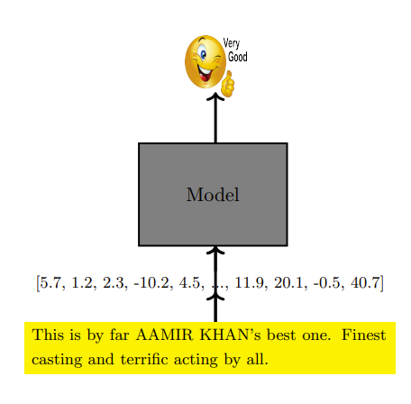
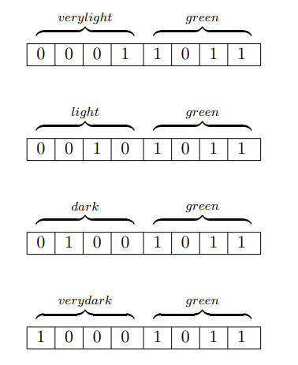
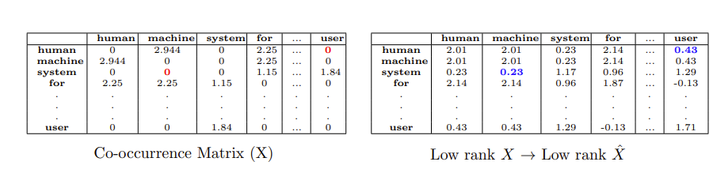

# NLP基础

## Reference

- https://www.geeksforgeeks.org/natural-language-processing-nlp-tutorial/
- https://web.stanford.edu/~jurafsky/slp3/2.pdf
- https://web.stanford.edu/~jurafsky/slp3/3.pdf
- https://web.stanford.edu/~jurafsky/slp3/6.pdf
- https://www.cse.iitm.ac.in/~miteshk/CS7015/Slides/Handout/Lecture10.pdf

## 1 单词的 one-hot 表示

假设我们有一个输入的单词流（句子、文档等），并且想要学习关于它的某种函数（例如， $\hat{y} =$  情感分析(单词)）.  

假设我们采用一种机器学习算法（某种数学模型）来学习这样一个函数（ $\hat{y} = f(x)$ ）.  首先，我们需要一种方法将输入流（或流中的每个单词）转换为向量 $x$ （一种数学量）.  

给定一个语料库（Corpus），考虑所有输入流（即所有句子或文档）中所有唯一单词的集合 $V$ ， $V$ 被称为语料库的词汇表.  我们需要为 $V$ 中的每个单词找到一种表示方式.  一种非常简单的方法是使用大小为 $\vert V \vert$ 的独热向量.  第 $i$ 个单词的表示将在第 $i$ 个位置为 $1$ ，在其余 $\vert V \vert - 1$ 个位置为 $0$ .  

| 单词 | 向量表示 |
| ---- | ---- |
| dog | 0 1 0 0 0 0 0 |
| cat | 0 0 0 0 0 1 0 |
| truck | 0 0 0 1 0 0 0 |

- 欧氏距离：
    -  $euclid\_dist (cat, dog )=\sqrt{2}$ 
    -  $euclid\_dist ( dog, truck )=\sqrt{2}$ 
- 余弦相似度：
    -  $cosine\_sim (cat, dog) =0$ 
    -  $cosine\_sim ( dog, truck )=0$ 

### 问题

- **词汇表规模大**：词汇表 $V$ 往往非常大（例如，PTB语料库有50K个单词，谷歌1T语料库有1300万个单词 ）.  
- **缺乏语义相似性**：这些表示没有捕捉到任何相似性的概念.  理想情况下，我们希望 “猫” 和 “狗”（都是家养动物）的表示比 “猫” 和 “卡车” 的表示更接近彼此.  然而，使用 one-hot 表示时，词汇表中任意两个单词之间的欧氏距离都是 $\sqrt{2}$ ，余弦相似度都是 $0$  .  

## 2 单词的分布式表示

“银行（bank）是一种金融机构，它接受公众存款并创造信贷.  ” 这里的想法是使用伴随的单词（“金融（financial）”、“存款（deposits）”、“信贷（credit）”）来表示 “银行（bank）”.  

“你应通过一个词的语境来了解它.  ”——弗斯，J.R.，1957:11

这种基于分布相似性的表示方法引出了共现矩阵（co-occurrence matrix）的概念.  

共现矩阵是一个 “词项×词项” 的矩阵，它记录了一个词项在另一个词项的语境中出现的次数.  语境被定义为围绕词项的 $k$ 个单词的窗口.  让我们为一个小型语料库构建一个 $k = 2$ 的共现矩阵，这也被称为 “词×语境” 矩阵.  你可以选择词集和语境集相同或不同.  共现矩阵的每一行（列）都给出了相应单词（语境）的向量表示.  

语料库：

- Human machine interface for computer applications
- User opinion of computer system response
time
- User interface management system
- System engineering for improved response
time

|  | human | machine | system | for | $\dots$ | user |
| --- | --- | --- | --- | --- | --- | --- |
| human | 0 | 1 | 0 | 1 | $\dots$ | 0 |
| machine | 1 | 0 | 0 | 1 | $\dots$ | 0 |
| system | 0 | 0 | 0 | 1 | $\dots$ | 2 |
| for | 1 | 1 | 1 | 0 | $\dots$ | 0 |
| $\vdots$ | $\vdots$ | $\vdots$ | $\vdots$ | $\vdots$ | $\vdots$ | $\vdots$ |
| $\vdots$ | $\vdots$ | $\vdots$ | $\vdots$ | $\vdots$ | $\vdots$ | $\vdots$ |
| user | 0 | 0 | 2 | 0 | $\dots$ | 0 | |

### 一些（可解决的）问题
停用词（如 “a”、“the”、“for” 等）出现频率很高，它们在共现矩阵中的计数会非常高.  

#### 解决方案1：忽略高频词

|  | human | machine | system |  $\dots$ | user |
| --- | --- | --- | --- | --- |  --- |
| human | 0 | 1 | 0 | $\dots$ | 0 |
| machine | 1 | 0 | 0 | $\dots$ | 0 |
| system | 0 | 0 | 0 |  $\dots$ | 2 |
| $\vdots$ | $\vdots$ | $\vdots$ | $\vdots$ | $\vdots$ | $\vdots$ | 
| $\vdots$ | $\vdots$ | $\vdots$ | $\vdots$ | $\vdots$ | $\vdots$ | 
| user | 0 | 0 | 2 |  $\dots$ | 0 | |

#### 解决方案2：使用阈值 $t$（例如，$t = 100$）

$$
X_{ij} = \min(count(w_i, c_j), t)
$$

其中 $w$ 是单词， $c$ 是语境.  

#### 解决方案3：使用点互信息（PMI）代替计数(count)

$$
PMI(w, c) = \log \frac{p(c | w)}{p(c)} = \log \frac{count(w, c) * N}{count(c) * count(w)}
$$

$N$ 是单词的总数.  

如果 $count(w, c) = 0$ ， $PMI(w, c) = -\infty$ . 实际使用时，采用以下替代公式：

$$
PMI_0(w, c) = 
\begin{cases}
PMI(w, c) & 如果 count (w, c)>0 \\
0 & 否则
\end{cases}
$$

或者

$$
PPMI(w, c) = 
\begin{cases}
PMI(w, c) & 如果 PMI(w, c)>0 \\
0 & 否则
\end{cases}
$$

|  | human | machine | system | for | $\dots$ | user |
| --- | --- | --- | --- | --- | --- | --- |
| human | 0 | 2.944 | 0 | 2.25 | 0 |
| machine | 2.944 | 0 | 0 | 2.25 | 0 |
| system | 0 | 0 | 0 | 1.15 | 1.84 |
| for | 2.25 | 2.25 | 1.15 | 0 | 0 |
| ... | ... | ... | ... | ... | ... |
| user | 0 | 0 | 1.84 | 0 | 0 |

### 一些（严重的）问题

- **维度高**：维度非常高（ $\vert V \vert$ ）.  
- **稀疏性**：矩阵非常稀疏.  
- **随词汇表增长**：规模会随着词汇表的大小而增长.  
- **解决方案**：使用降维技术（如奇异值分解SVD）.  

## 3 用于学习单词表示的奇异值分解（SVD）

$$
\begin{bmatrix}
& X & 
\end{bmatrix}_{m×n} = 
\begin{bmatrix}
\uparrow & \cdots & \uparrow \\
u_1 & \cdots & u_k \\
\downarrow & \cdots & \downarrow
\end{bmatrix}_{m×k}
\begin{bmatrix}
\sigma_1 &  & \\
 & \ddots & \\
 &  & \sigma_k
\end{bmatrix}_{k×k}
\begin{bmatrix}
\leftarrow & v_1^T & \to \\
 & \vdots & \\
\leftarrow & v_k^T & \to
\end{bmatrix}_{k×n}
$$

奇异值分解（SVD）对原始矩阵进行秩 $k$ 近似：

$$
X = X_{PPMI_{m×n}} = U_{m×k} \sum_{k×k} V_{k×n}^T
$$

这里 $X_{PPMI}$ （简化表示为 $X$ ）是具有点互信息（PPMI）值的共现矩阵.  SVD给出了原始数据 $(X)$ 的最佳秩 $k$ 近似，能够发现语料库中的潜在语义（我们通过一个例子来探讨这一点）.  

$$
\begin{bmatrix}
& X & 
\end{bmatrix}_{m×n} = 
\begin{bmatrix}
\uparrow & \cdots & \uparrow \\
u_1 & \cdots & u_k \\
\downarrow & \cdots & \downarrow
\end{bmatrix}_{m×k}
\begin{bmatrix}
\sigma_1 &  & \\
 & \ddots & \\
 &  & \sigma_k
\end{bmatrix}_{k×k}
\begin{bmatrix}
\leftarrow & v_1^T & \to \\
 & \vdots & \\
\leftarrow & v_k^T & \to
\end{bmatrix}_{k×n}
= \sigma_1 u_1 v_1^T + \sigma_2 u_2 v_2^T + \cdots + \sigma_k u_k v_k^T
$$

注意，这个乘积可以写成 $k$ 个秩为 $1$ 的矩阵之和.  每个 $\sigma_i u_i v_i^T \in \mathbb{R}^{m×n}$ ，因为它是一个 $m×1$ 向量与一个 $1×n$ 向量的乘积.  如果我们在 $\sigma_1 u_1 v_1^T$ 处截断这个和，那么我们得到 $X$ 的最佳秩 $1$ 近似（根据SVD定理！但这意味着什么呢？我们将在后面的内容中看到）.  如果我们在 $\sigma_1 u_1 v_1^T + \sigma_2 u_2 v_2^T$ 处截断这个和，那么我们得到 $X$ 的最佳秩 $2$ 近似，依此类推.  

$$
\begin{bmatrix}
& X & 
\end{bmatrix}_{m×n} = 
\begin{bmatrix}
\uparrow & \cdots & \uparrow \\
u_1 & \cdots & u_k \\
\downarrow & \cdots & \downarrow
\end{bmatrix}_{m×k}
\begin{bmatrix}
\sigma_1 &  & \\
 & \ddots & \\
 &  & \sigma_k
\end{bmatrix}_{k×k}
\begin{bmatrix}
\leftarrow & v_1^T & \to \\
 & \vdots & \\
\leftarrow & v_k^T & \to
\end{bmatrix}_{k×n}
= \sigma_1 u_1 v_1^T + \sigma_2 u_2 v_2^T + \cdots + \sigma_k u_k v_k^T
$$
这里的 “近似” 是什么意思呢？

- 注意， $X$ 有 $m×n$ 个元素.  当我们使用秩 $1$ 近似时，我们仅使用 $n + m + 1$ 个元素来重构（ $u \in \mathbb{R}^{m}$ ， $v \in \mathbb{R}^{n}$ ， $\sigma \in \mathbb{R}^{1}$  ）.  
- 但是SVD定理告诉我们， $u_1$ ， $v_1$ 和 $\sigma_1$ 存储了 $X$ 中最重要的信息（类似于 $X$ 中的主成分）.  每个后续项（ $\sigma_2 u_2 v_2^T$ ， $\sigma_3 u_3 v_3^T$ ，... ）存储的信息越来越不重要.  

举个例子，假设我们用8位来表示颜色，非常浅绿、浅绿、深绿和非常深绿的表示看起来会不同. 

 但如果要求将其压缩为4位（类似于前面的内容中将 $m×m$ 个值压缩为 $m + m + 1$ 个值），我们会保留最重要的4位，此时之前颜色之间（略微）潜在的相似性就会变得非常明显.  SVD也能保证类似的效果（保留最重要的信息，并发现单词之间的潜在相似性）.  

共现矩阵（ $X$ ）经过SVD低秩重构后，{system，machine}和{human，user}之间潜在的共现关系变得明显了.  

$X=$
|  | human | machine | system | for | $\dots$ | user |
| --- | --- | --- | --- | --- | --- | --- |
| human| 0 | 2.944 | 0 | 2.25 | $\dots$ | 0 |
| machine | 2.944 | 0 | 0 | 2.25 |$\dots$| 0 |
| system | 0 | 0 | 0 | 1.15 |$\dots$| 1.84 |
| for | 2.25 | 2.25 | 1.15 | 0 |$\dots$| 0 |
|$\vdots$|$\vdots$|$\vdots$|$\vdots$|$\vdots$|$\vdots$|$\vdots$|
| user | 0 | 0 | 1.84 | 0 | ... |$\dots$| 0 |

$X X^T=$
|  | human | machine | system | for | $\dots$ | user |
| --- | --- | --- | --- | --- | --- | --- |
| 人类 | 32.5 | 23.9 | 7.78 | 20.25 | ... | 7.01 |
| 机器 | 23.9 | 32.5 | 7.78 | 20.25 | 7.01 |
| 系统 | 7.78 | 7.78 | 0 | 17.65 | 21.84 |
| ... | ... | ... | ... | ... | ... |
| 用于 | 20.25 | 20.25 | 17.65 | 36.3 | 11.8 |
| 用户 | 7.01 | 7.01 | 21.84 | 11.8 | 28.3 |

$$cosine\_sim(人类, 用户 )=0.21$$

回想一下，最初原始矩阵 $X$ $$
\begin{align*}
\nabla_{v_{w}}&=-\left(u_{c}-\frac{\exp(u_{c} \cdot v_{w})}{\sum_{w'\in V}\exp(u_{c} \cdot v_{w'})} \cdot u_{c}\right)\\
&=-u_{c}\left(1 - \hat{y}_{w}\right)
\end{align*}
$$

更新规则为：
$$
\begin{align*}
v_{w}&=v_{w}-\eta\nabla_{v_{w}}\\
&=v_{w}+\eta u_{c}(1 - \hat{y}_{w})
\end{align*}
$$

这个更新规则有一个很好的解释：
$$v_{w}=v_{w}+\eta u_{c}(1 - \hat{y}_{w})$$

如果\(\hat{y}_{w}\to1\)，那么我们已经预测对了单词，\(v_{w}\)将不会被更新。如果\(\hat{y}_{w}\to0\)，那么\(v_{w}\)会通过加上\(u_{c}\)的一部分来更新。这会增加\(v_{w}\)和\(u_{c}\)之间的余弦相似度（为什么？参考第2讲第38页幻灯片）。训练目标是确保单词\((v_{w})\)和语境单词\((u_{c})\)之间的余弦相似度最大化。
$$P(chair|sat, he), P(man|sat, he), P(he|sat, he), P(on|sat, he)$$
$$W_{word}\in\mathbb{R}^{k×2|V|}, h\in\mathbb{R}^{k}, [W_{context}, W_{context}]\in\mathbb{R}^{k×2|V|}, x\in\mathbb{R}^{2|V|}$$
$$
\begin{array}{|c|c|}
\hline
& he\ sat\\
\hline
x&
\begin{bmatrix}
0\\1\\0\\0\\0\\1
\end{bmatrix}
\\
\hline
\end{array}
$$

在实践中，通常使用大小为\(d\)的窗口，而不是窗口大小为\(1\)。所以现在，
$$h=\sum_{i = 1}^{d - 1}u_{c_{i}}$$
\([W_{context}, W_{context}]\)表示我们将\(W_{context}\)矩阵堆叠两份。结果乘积就是对应“sat”和“he”的列的和。
$$
\begin{bmatrix}
 -1 & 0.5 & 2\\
 3 & -1 & -2\\
 -2 & 1.7 & 3
\end{bmatrix}
\begin{bmatrix}
 0\\
 1\\
 0
\end{bmatrix}+
\begin{bmatrix}
 -1 & 0.5 & 2\\
 3 & -1 & -2\\
 -2 & 1.7 & 3
\end{bmatrix}
\begin{bmatrix}
 0\\
 0\\
 1
\end{bmatrix}=
\begin{bmatrix}
 2.5\\
 -3\\
 4.7
\end{bmatrix}
$$

当然，在实践中我们不会进行这种昂贵的矩阵乘法。如果“he”是词汇表中的第\(i\)个单词，“sat”是第\(j\)个单词，那么我们将直接访问列\(W[i:]\)和\(W[j:]\)并将它们相加。
$$P(on|sat, he)=\frac{e^{(w_{word}h)[k]}}{\sum_{j}e^{(w_{word}h)[j]}}$$
其中，‘\(k\)’是单词“on”的索引，并且
$$h=\sum_{i = 1}^{d - 1}u_{c_{i}}$$

回想一下，损失函数取决于\(\{W_{word}, u_{c_{1}}, u_{c_{2}},\cdots, u_{c_{d - 1}}\}\)，并且在反向传播过程中所有这些参数都会被更新。现在尝试推导\(v_{w}\)的更新规则，看看它与我们之前推导的有何不同。
$$P(chair|sat, he), P(man|sat, he), P(he|sat, he), P(on|sat, he)$$
$$W_{word}\in\mathbb{R}^{k×2|V|}, h\in\mathbb{R}^{k}, [W_{context}, W_{context}]\in\mathbb{R}^{k×2|V|}, x\in\mathbb{R}^{2|V|}$$
$$
\begin{array}{|c|c|}
\hline
& he\ sat\\
\hline
x&
\begin{bmatrix}
0\\1\\0\\0\\0\\1
\end{bmatrix}
\\
\hline
\end{array}
$$

### 一些问题
注意，输出层的softmax函数计算成本非常高。
$$\hat{y}_{w}=\frac{\exp(u_{c} \cdot v_{w})}{\sum_{w'\in V}\exp(u_{c} \cdot v_{w'})}$$
分母需要对词汇表中的所有单词进行求和。我们很快会重新讨论这个问题。

## 模块10.5：跳字模型
我们刚刚看到的模型称为连续词袋模型（它根据一组语境单词预测一个输出单词）。现在我们将介绍跳字模型（它根据一个输入单词预测语境单词）。
$$he\ he\ sat\ sat\ chair\ chair$$
$$W_{context}\in\mathbb{R}^{k×|V|}, h\in\mathbb{R}^{k}, W_{word}\in\mathbb{R}^{k×|V|}, x\in\mathbb{R}^{|V|}$$
$$
\begin{array}{|c|c|c|c|c|c|}
\hline
& & & sat & & & \\
\hline
x&=& 0 & 0 & 1 & \cdots & 0\\
\hline
\end{array}
$$

注意，现在语境和单词的角色发生了变化。在只有一个语境单词的简单情况下，我们将得到与之前\(v_{w}\)相同的\(u_{c}\)更新规则。注意，即使我们有多个语境单词，损失函数也只是多个交叉熵误差的总和。
$$\mathscr{L}(\theta)=-\sum_{i = 1}^{d - 1}\log\hat{y}_{w_{i}}$$
通常，我们会预测给定单词两侧的语境单词。
$$he\ sat\ a\ chair$$
$$W_{context}\in\mathbb{R}^{k×|V|}, h\in\mathbb{R}^{k}, W_{word}\in\mathbb{R}^{k×|V|}, x\in\mathbb{R}^{|V|}$$
$$
\begin{array}{|c|c|c|c|c|c|}
\hline
& & & sat & & & \\
\hline
x&=& 0 & 0 & 1 & \cdots & 0\\
\hline
\end{array}
$$

### 一些问题
与词袋模型相同，输出层的softmax函数计算成本高。
- **解决方案1**：使用负采样。
- **解决方案2**：使用对比估计。
- **解决方案3**：使用层次softmax。

- 设\(D\)是语料库中所有正确的\((w, c)\)对的集合。
$$D = [(sat, on), (sat, a), (sat, chair), (on, a), (on, chair), (a, chair), (on, sat), (a, sat), (chair, sat), (a, on), (chair, on), (chair, a)]$$
- 设\(D'\)是语料库中所有不正确的\((w, r)\)对的集合。
$$D' = [(sat, oxygen), (sat, magic), (chair, sad), (chair, walking)]$$
\(D'\)可以通过随机采样一个从未与\(w\)同时出现的语境单词\(r\)并创建一个对\((w, r)\)来构建。
- 如前所述，设\(v_{w}\)是单词\(w\)的表示，\(u_{c}\)是语境单词\(c\)的表示。
$$P(z = 1|w, c)$$
$$\sigma(u_{c}^T v_{w})$$

对于给定的\((w, c)\in D\)，我们希望最大化
$$p(z = 1|w, c)$$
我们将这个概率建模为：
$$
\begin{align*}
p(z = 1|w, c)&=\sigma(u_{c}^T v_{w})\\
&=\frac{1}{1 + e^{-u_{c}^T v_{w}}}
\end{align*}
$$

考虑所有\((w, c)\in D\)，我们希望：
$$\underset{\theta}{\text{maximize}}\prod_{(w, c)\in D}p(z = 1|w, c)$$
其中\(\theta\)是我们语料库中所有单词的单词表示\((v_{w})\)和语境表示\((u_{c})\)。
$$P(z = 0|w, r)$$
$$\sigma(-u_{r}^T v_{w})$$

对于\((w, r)\in D'\)，我们希望最大化
$$p(z = 0|w, r)$$
我们再次将其建模为：
$$
\begin{align*}
p(z = 0|w, r)&=1-\sigma(u_{r}^T v_{w})\\
&=1-\frac{1}{1 + e^{-u_{r}^T v_{w}}}\\
&=\frac{1}{1 + e^{u_{r}^T v_{w}}}=\sigma(-u_{r}^T v_{w})
\end{align*}
$$

考虑所有\((w, r)\in D'\)，我们希望：
$$\underset{\theta}{\text{maximize}}\prod_{(w, r)\in D'}p(z = 0|w, r)$$

将两者结合，我们得到：
$$
\begin{align*}
&\underset{\theta}{\text{maximize}}\prod_{(w, c)\in D}p(z = 1|w, c)\prod_{(w, r)\in D'}p(z = 0|w, r)\\
=&\underset{\theta}{\text{maximize}}\prod_{(w, c)\in D}p(z = 1|w, c)\prod_{(w, r)\in D'}(1 - p(z = 1|w, r))\\
=&\underset{\theta}{\text{maximize}}\sum_{(w, c)\in D}\log p(z = 1|w, c)+\sum_{(w, r)\in D'}\log(1 - p(z = 1|w, r))\\
=&\underset{\theta}{\text{maximize}}\sum_{(w, c)\in D}\log\frac{1}{1 + e^{-u_{c}^T v_{w}}}+\sum_{(w, r)\in D'}\log\frac{1}{1 + e^{u_{r}^T v_{w}}}\\
=&\underset{\theta}{\text{maximize}}\sum_{(w, c)\in D}\sigma(u_{c}^T v_{w})+\sum_{(w, r)\in D'}\log\sigma(-u_{r}^T v_{w})
\end{align*}
$$
其中\(\sigma(x)=\frac{1}{1 + e^{-x}}\)。

在原始论文中，米科洛夫等人（Mikolov et. al.）为每个正样本\((w, c)\)对采样\(k\)个负样本\((w, r)\)对。因此，\(D'\)的大小是\(D\)的\(k\)倍。随机语境单词是从修改后的一元分布中抽取的：
$$r\sim p(r)^{\frac{3}{4}}$$
$$r\sim\frac{\text{count}(r)^{\frac{3}{4}}}{N}$$
\(N\)是语料库中单词的总数。

## 模块10.6：对比估计
$$he\ sat\ a\ chair$$
$$W_{context}\in\mathbb{R}^{k×|V|}, h\in\mathbb{R}^{k}, W_{word}\in\mathbb{R}^{k×|V|}, x\in\mathbb{R}^{|V|}$$
$$
\begin{array}{|c|c|c|c|c|c|}
\hline
& & & sat & & & \\
\hline
x&=& 0 & 0 & 1 & \cdots & 0\\
\hline
\end{array}
$$

### 一些问题
与词袋模型相同，输出层的softmax函数计算成本高。
- **解决方案1**：使用负采样。
- **解决方案2**：使用对比估计。
- **解决方案3**：使用层次softmax。

**正样本**：He sat on a chair
$$W_{out}\in\mathbb{R}^{h×|1|}, W_{h}\in\mathbb{R}^{2d×h}, v_{c}\ v_{w}$$
$$sat\ on$$

我们希望\(s\)大于\(s_{c}\)。所以，让我们尝试最大化\(s - s_{c}\)。但我们希望这个差值至少为\(m\)。

**负样本**：He sat abracadabra a chair
$$W_{out}\in\mathbb{R}^{h×|1|}, W_{h}\in\mathbb{R}^{2d×h}, v_{c}\ v_{w}$$
$$sat\ abracadabra$$

所以我们可以最大化\(s-(s_{c}+m)\)。如果\(s>s_{c}+m\)，则不做任何操作。即最大化\(\max(0, s-(s_{c}+m))\)。

## 模块10.7：层次softmax
$$he\ sat\ a\ chair$$
$$W_{context}\in\mathbb{R}^{k×|V|}, h\in\mathbb{R}^{k}, W_{word}\in\mathbb{R}^{k×|V|}, x\in\mathbb{R}^{|V|}$$
$$
\begin{array}{|c|c|c|c|c|c|}
\hline
& & & sat & & & \\
\hline
x&=& 0 & 0 & 1 & \cdots & 0\\
\hline
\end{array}
$$

### 一些问题
与词袋模型相同，输出层的softmax函数计算成本高。
- **解决方案1**：使用负采样。
- **解决方案2**：使用对比估计。
- **解决方案3**：使用层次softmax。
$$
\max\frac{e^{v_{c}^T u_{w}}}{\sum_{|V|}e^{v_{c}^T u_{w}}}
$$

构建一个二叉树，使得有\(|V|\)个叶节点，每个叶节点对应词汇表中的一个单词。
$$
\begin{array}{|c|c|c|c|c|c|}
\hline
& & & sat & & & \\
\hline
x&=& 0 & 1 & 0 & 0 & 0\\
\hline
\end{array}
$$

从根节点到叶节点存在唯一路径。设\(l(w_{1}), l(w_{2}),\cdots, l(w_{p})\)是从根节点到\(w\)的路径上的节点。设\(\pi(w)\)是一个二进制向量，使得：如果路径在节点\(l(w_{k})\)处向左分支，则\(\pi(w)_{k}=1\)；否则\(\pi(w)_{k}=0\)。最后，每个内部节点都与一个向量\(u_{i}\)相关联。所以该模块的参数是\(W_{context}\)和\(u_{1}, u_{2},\cdots, u_{V}\)（实际上，我们的参数数量与之前相同）。
$$\pi(on)_1 = 1, u_1$$
$$\pi(on)_2 = 0, u_2$$
$$\pi(on)_3 = 0, u_V$$
$$on$$
$$h = v_{c}$$
$$
\begin{array}{|c|c|c|c|c|c|}
\hline
& & & sat & & & \\
\hline
x&=& 0 & 1 & 0 & \cdots & 0\\
\hline
\end{array}
$$

对于给定的对\((w, c)\)，我们关注概率\(p(w|v_{c})\)。我们将这个概率建模为：
$$p(w|v_{c})=\prod_{k}(\pi(w_{k})|v_{c})$$

例如：
$$
\begin{align*}
P(on|v_{sat})&=P(\pi(on)_1 = 1|v_{sat})\\
&\times P(\pi(on)_2 = 0|v_{sat})\\
&\times P(\pi(on)_3 = 0|v_{sat})
\end{align*}
$$

实际上，我们是说预测一个单词的概率与预测从根节点到该单词的正确唯一路径的概率相同。
$$\pi(on)_1 = 1, u_1$$
$$\pi(on)_2 = 0, u_2$$
$$\pi(on)_3 = 0, u_V$$
$$on$$
$$h = v_{c}$$
$$
\begin{array}{|c|c|c|c|c|c|}
\hline
& & & sat & & & \\
\hline
x&