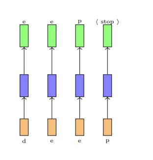
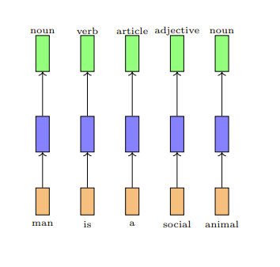
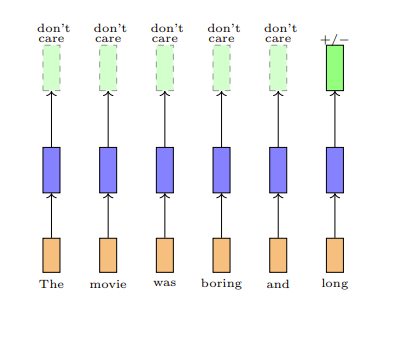
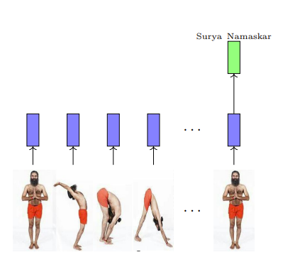
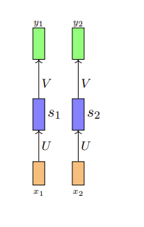
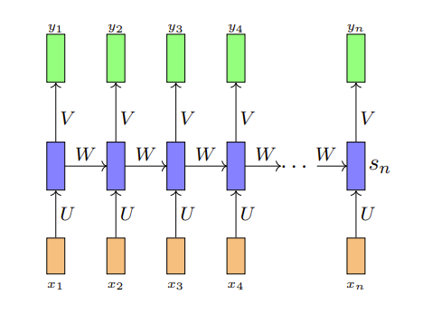
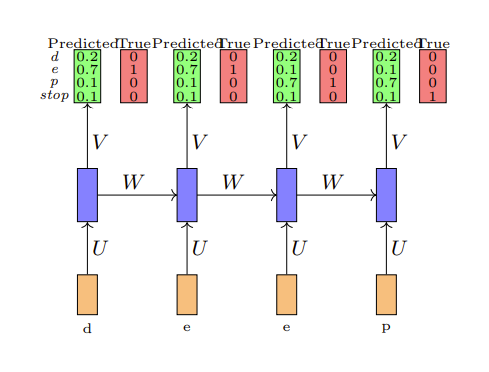
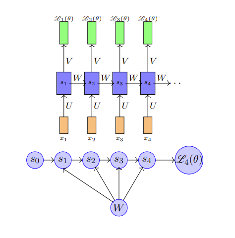

# 循环神经网络（RNN）

## Reference

- https://www.cse.iitm.ac.in/~miteshk/CS7015/Slides/Handout/Lecture14.pdf

## 1 序列学习问题

在前馈神经网络和卷积神经网络中，输入的大小始终是固定的. 例如，在图像分类任务中，我们将固定大小（32×32）的图像输入到卷积神经网络中. 同样，在word2vec中，我们将固定窗口（k）大小的单词输入到网络中. 此外，网络的每个输入都与之前或未来的输入相互独立. 例如，两张连续图像的计算、输出和决策彼此完全独立. 

在许多应用中，输入的大小并不固定，而且连续的输入之间可能也并非相互独立. 例如，考虑自动补全任务. 给定第一个字符“d”，你想要预测下一个字符“e”，依此类推. 

请注意以下几点：首先，连续的输入不再相互独立（在预测“e”时，除了当前输入，你还需要知道前一个输入是什么）；其次，输入的长度和你需要进行的预测数量并不固定（例如，“learn”“deep”“machine”的字符数量不同）；第三，每个网络（橙蓝绿结构）都在执行相同的任务（输入：字符，输出：字符）. 

这些被称为**序列学习问题**. 我们需要观察一系列（相关的）输入并生成一个或多个输出. 每个输入对应一个时间步. 让我们来看一些这类问题的更多示例. 

考虑预测句子中每个单词的词性标签（名词、副词、形容词、动词）的任务.

一旦我们看到一个形容词（如“social”），我们几乎可以确定下一个单词应该是名词（如“man”）. 因此，当前的输出（名词）既取决于当前输入，也取决于前一个输入. 此外，输入的大小并不固定（句子中的单词数量可以是任意的）. 请注意，这里我们希望在每个时间步都生成一个输出. 每个网络都在执行相同的任务（输入：单词，输出：标签）. 

有时我们可能并不关心在每个阶段都生成输出，而是在查看完整序列后再生成输出. 例如，考虑预测电影评论情感极性的任务. 

预测显然不仅取决于最后一个单词，还取决于之前出现的一些单词. 同样，我们可以认为网络在每个步骤都执行相同的任务（输入：单词，输出：正向/负向），只是我们不关心中间输出. 

序列可以由任何内容组成（不仅仅是单词）. 例如，视频可以被视为一系列图像. 我们可能希望查看整个视频序列并检测正在发生的运动. 

## 2 循环神经网络

我们如何对涉及序列的任务进行建模呢？

期望功能如下：解释输入之间的依赖关系、处理可变数量的输入、确保在每个时间步执行的功能相同. 我们将针对上述每一点来构建一个处理序列的模型. 

在每个时间步执行的函数是什么呢？

$$
\begin{align*}
s_{i}&=\sigma\left(U x_{i}+b\right)\\
y_{i}&=\mathcal{O}\left(V s_{i}+c\right)\\
i&=\text{时间步}
\end{align*}
$$

由于我们希望在每个时间步执行相同的函数，所以应该共享相同的网络（即在每个时间步使用相同的参数）. 

这种参数共享还确保了网络对输入的长度（大小）不敏感. 因为我们只是在每个时间步计算相同的函数（使用相同的参数），所以时间步的数量并不重要. 我们只需创建多个网络副本，并在每个时间步执行它们. 

我们如何解释输入之间的依赖关系呢？首先来看一种不可行的方法. 在每个时间步，我们将所有先前的输入都输入到网络中. 这样可以吗？不，这违反了我们期望功能中的其他两点. 让我们来看看为什么. 

首先，现在每个时间步计算的函数不同. 
$$
\begin{align*}
y_{1}&=f_{1}\left(x_{1}\right)\\
y_{2}&=f_{2}\left(x_{1}, x_{2}\right)\\
y_{3}&=f_{3}\left(x_{1}, x_{2}, x_{3}\right)
\end{align*}
$$

网络现在对序列的长度敏感. 例如，长度为10的序列将需要 $f_{1}, ..., f_{10}$ ，而长度为100的序列将需要 $f_{1}, ..., f_{100}$ . 

解决方案是在网络中添加循环连接. 

$$
\begin{align*}
s_{i}&=\sigma\left(U x_{i}+W s_{i-1}+b\right)\\
y_{i}&=\mathcal{O}\left(V s_{i}+c\right)
\end{align*}
$$

或者

$$
y_{i}=f\left(x_{i}, s_{i-1}, W, U, V, b, c\right)
$$

 $s_{i}$ 是网络在时间步 $i$ 的状态. 参数 $W$ 、 $U$ 、 $V$ 、 $c$ 、 $b$ 在各个时间步共享. 相同的网络（和参数）可用于计算 $y_{1}, y_{2}, ..., y_{10}$ 或 $y_{100}$ . 

这可以更简洁地表示. 

让我们重新审视之前看到的序列学习问题. 现在我们在时间步之间有了循环连接，这解释了输入之间的依赖关系. 

## 3 时间反向传播

在继续之前，让我们仔细看看参数的维度. 

$$
\begin{align*}
x_{i} &\in \mathbb{R}^{n} \quad (n维输入)\\
s_{i} &\in \mathbb{R}^{d} \quad (d维状态)\\
y_{i} &\in \mathbb{R}^{k} \quad (假设有k个类别)\\
U &\in \mathbb{R}^{n × d}\\
V &\in \mathbb{R}^{d × k}\\
W &\in \mathbb{R}^{d × d}
\end{align*}
$$

我们如何训练这个网络呢？（答案：使用反向传播）让我们通过一个具体的例子来理解. 

假设我们考虑自动补全任务（预测下一个字符）. 为简单起见，我们假设词汇表中只有4个字符（d、e、p、<stop>）. 在每个时间步，我们想要预测这4个字符中的一个. 对于这个任务，合适的输出函数是什么呢？（softmax）合适的损失函数是什么呢？（交叉熵）

假设我们随机初始化 $U$ 、 $V$ 、 $W$ ，网络预测的概率和真实概率如图所示.

我们需要回答两个问题：模型的总损失是多少？我们如何反向传播这个损失并更新网络的参数（ $\theta=\{U, V, W, b, c\}$ ）？

总损失就是所有时间步损失的总和. 
$$
\begin{align*}
\mathscr{L}(\theta)&=\sum_{t=1}^{T} \mathscr{L}_{t}(\theta)\\
\mathscr{L}_{t}(\theta)&=-log \left(y_{t c}\right)
\end{align*}
$$

 
$y_{t c}$  = 在时间步 $t$ 预测真实字符的概率， $T$  = 时间步的数量. 

对于反向传播，我们需要计算关于 $W$ 、 $U$ 、 $V$ 、 $b$ 、 $c$ 的梯度. 让我们看看如何计算. 

让我们考虑 $\frac{\partial \mathscr{L}(\theta)}{\partial V}$ （ $V$ 是一个矩阵，理想情况下我们应该写成 $\nabla_{v} \mathscr{L}(\theta)$ ）. 

$$
\frac{\partial \mathscr{L}(\theta)}{\partial V}=\sum_{t=1}^{T} \frac{\partial \mathscr{L}_{t}(\theta)}{\partial V}
$$

求和中的每一项只是损失关于输出层权重的导数. 在学习反向传播时，我们已经知道如何计算这个. 

让我们考虑导数 $\frac{\partial \mathscr{L}(\theta)}{\partial W}$ . 

$$
\frac{\partial \mathscr{L}(\theta)}{\partial W}=\sum_{t=1}^{T} \frac{\partial \mathscr{L}_{t}(\theta)}{\partial W}
$$

根据导数的链式法则，我们知道 $\frac{\partial \mathscr{L}_{t}(\theta)}{\partial W}$ 是通过从 $\mathscr{L}_{t}(\theta)$ 到 $W$ 的所有路径上的梯度求和得到的. 从 $\mathscr{L}_{t}(\theta)$ 到 $W$ 有哪些路径呢？让我们通过考虑 $\mathscr{L}_{4}(\theta)$ 来看看. 

$\mathscr{L}_{4}(\theta)$ 依赖于 $s_{4}$ ， $s_{4}$ 又依赖于 $s_{3}$ 和 $W$ ， $s_{3}$ 又依赖于 $s_{2}$ 和 $W$ ， $s_{2}$ 又依赖于 $s_{1}$ 和 $W$ ， $s_{1}$ 又依赖于 $s_{0}$ 和 $W$ ，其中 $s_{0}$ 是一个固定的起始状态. 

我们这里有一个有序网络. 在有序网络中，每个状态变量按指定顺序依次计算（首先是 $s_{1}$ ，然后是 $s_{2}$ ，依此类推）. 现在我们有：
$$\frac{\partial \mathscr{L}_{4}(\theta)}{\partial W}=\frac{\partial \mathscr{L}_{4}(\theta)}{\partial s_{4}} \frac{\partial s_{4}}{\partial W}$$

在学习反向传播时，我们已经知道如何计算 $\frac{\partial \mathscr{L}_{4}(\theta)}{\partial s_{4}}$ . 但是如何计算 $\frac{\partial s_{4}}{\partial W}$ 呢？

回想一下：

$$
s_{4}=\sigma\left(W s_{3}+b\right)
$$

在这样的有序网络中，我们不能简单地将 $s_{3}$ 视为常数来计算 $\frac{\partial s_{4}}{\partial W}$ （因为它也依赖于 $W$ ）. 在这样的网络中，总导数 $\frac{\partial s_{4}}{\partial W}$ 有两部分：显式部分： $\frac{\partial^{+} s_{4}}{\partial W}$ ，将所有其他输入视为常数；隐式部分：从 $s_{4}$ 到 $W$ 的所有间接路径的总和. 让我们看看如何计算. 

$$
\begin{align*}
\frac{\partial s_{4}}{\partial W}&=\underbrace{\frac{\partial^{+} s_{4}}{\partial W}}_{\text{explicit}}+\underbrace{\frac{\partial s_{4}}{\partial s_{3}}\frac{\partial s_{3}}{\partial W}}_{\text{implicit}}\\
&=\frac{\partial^{+} s_{4}}{\partial W}+\frac{\partial s_{4}}{\partial s_{3}}\left[\underbrace{\frac{\partial^{+} s_{3}}{\partial W}}_{\text{explicit}}+\underbrace{\frac{\partial s_{3}}{\partial s_{2}}\frac{\partial s_{2}}{\partial W}}_{\text{implicit}}\right]\\
&=\frac{\partial^{+} s_{4}}{\partial W}+\frac{\partial s_{4}}{\partial s_{3}}\frac{\partial^{+} s_{3}}{\partial W}+\frac{\partial s_{4}}{\partial s_{3}}\frac{\partial s_{3}}{\partial s_{2}}\left[\frac{\partial^{+} s_{2}}{\partial W}+\frac{\partial s_{2}}{\partial s_{1}}\frac{\partial s_{1}}{\partial W}\right]\\
&=\frac{\partial^{+} s_{4}}{\partial W}+\frac{\partial s_{4}}{\partial s_{3}}\frac{\partial^{+} s_{3}}{\partial W}+\frac{\partial s_{4}}{\partial s_{3}}\frac{\partial s_{3}}{\partial s_{2}}\frac{\partial^{+} s_{2}}{\partial W}+\frac{\partial s_{4}}{\partial s_{3}}\frac{\partial s_{3}}{\partial s_{2}}\frac{\partial s_{2}}{\partial s_{1}}\left[\frac{\partial^{+} s_{1}}{\partial W}\right]
\end{align*}
$$

为简单起见，我们将简化一些路径. 

$$
\frac{\partial s_{4}}{\partial W}=\frac{\partial s_{4}}{\partial s_{4}} \frac{\partial^{+} s_{4}}{\partial W}+\frac{\partial s_{4}}{\partial s_{3}} \frac{\partial^{+} s_{3}}{\partial W}+\frac{\partial s_{4}}{\partial s_{2}} \frac{\partial^{+} s_{2}}{\partial W}+\frac{\partial s_{4}}{\partial s_{1}} \frac{\partial^{+} s_{1}}{\partial W}=\sum_{k=1}^{4} \frac{\partial s_{4}}{\partial s_{k}} \frac{\partial^{+} s_{k}}{\partial W}
$$

最后我们有：

$$
\frac{\partial \mathscr{L}_{4}(\theta)}{\partial W}=\frac{\partial \mathscr{L}_{4}(\theta)}{\partial s_{4}} \frac{\partial s_{4}}{\partial W}
$$

$$
\frac{\partial s_{4}}{\partial W}=\sum_{k=1}^{4} \frac{\partial s_{4}}{\partial s_{k}} \frac{\partial^{+} s_{k}}{\partial W}
$$

$$
\therefore \frac{\partial \mathscr{L}_{t}(\theta)}{\partial W}=\frac{\partial \mathscr{L}_{t}(\theta)}{\partial s_{t}} \sum_{k=1}^{t} \frac{\partial s_{t}}{\partial s_{k}} \frac{\partial^{+} s_{k}}{\partial W}
$$

这个算法被称为时间反向传播（BPTT），因为我们在所有先前的时间步上进行反向传播. 

## 4 梯度消失和梯度爆炸问题

现在我们将关注 $\frac{\partial s_{t}}{\partial s_{k}}$ ，并强调使用BPTT训练循环神经网络（RNN）时的一个重要问题. 

$$
\begin{align*} 
\frac{\partial s_{t}}{\partial s_{k}} & =\frac{\partial s_{t}}{\partial s_{t-1}} \frac{\partial s_{t-1}}{\partial s_{t-2}} ... \frac{\partial s_{k+1}}{\partial s_{k}} \\ & =\prod_{j=k}^{t-1} \frac{\partial s_{j+1}}{\partial s_{j}} 
\end{align*}
$$

$$
\begin{align*} 
a_{j}&=\left[a_{j 1}, a_{j 2}, a_{j 3}, ... a_{j d},\right]\\
s_{j}&=\left[\sigma\left(a_{j 1}\right), \sigma\left(a_{j 2}\right), ... \sigma\left(a_{j d}\right)\right]\\
\end{align*}
$$

$$
\begin{aligned} \frac{\partial s_{j}}{\partial a_{j}} & =\left[\begin{array}{cccc} \frac{\partial s_{j 1}}{\partial a_{j 1}} & \frac{\partial s_{j 2}}{\partial a_{j 1}} & \frac{\partial s_{j 3}}{\partial a_{j 1}} & \cdots \\ \frac{\partial s_{j 1}}{\partial a_{j 2}} & \frac{\partial s_{j 2}}{\partial a_{j 2}} & \ddots & \\ \vdots & \vdots & \vdots & \frac{\partial s_{j d}}{\partial a_{j d}} \end{array}\right] \\ = & {\left[\begin{array}{cccc} \sigma'\left(a_{j 1}\right) & 0 & 0 & 0 \\ 0 & \sigma'\left(a_{j 2}\right) & 0 & 0 \\ 0 & 0 & \ddots & \\ 0 & 0 & \ddots & \sigma'\left(a_{j d}\right) \end{array}\right] } \\ & =diag\left(\sigma'\left(a_{j}\right)\right) \end{aligned}
$$

我们关注 $\frac{\partial s_{j}}{\partial s_{j-1}}$ . 
$$a_{j}=W s_{j}+b$$
$$s_{j}=\sigma\left(a_{j}\right)$$
$$\begin{aligned} \frac{\partial s_{j}}{\partial s_{j-1}} & =\frac{\partial s_{j}}{\partial a_{j}} \frac{\partial a_{j}}{\partial s_{j-1}} \\ & =diag\left(\sigma'\left(a_{j}\right)\right) W \end{aligned}$$

我们关注 $\frac{\partial s_{j}}{\partial s_{j-1}}$ 的大小，如果它很小（很大）， $\frac{\partial s_{t}}{\partial s_{k}}$ 以及 $\frac{\partial \mathscr{L}_{t}}{\partial W}$ 将会消失（爆炸）. 
$$\begin{aligned} \left\| \frac{\partial s_{j}}{\partial s_{j-1}}\right\| & =\left\| diag\left(\sigma'\left(a_{j}\right)\right) W\right\| \\ & \leq\| diag\left(\sigma'\left(a_{j}\right)\| \| W\| \end{aligned}$$

 $\sigma(a_{j})$ 是有界函数（如sigmoid、tanh）， $\sigma'(a_{j})$ 也是有界的. 
$$\begin{aligned} \sigma'\left(a_{j}\right) & \leq \frac{1}{4}=\gamma[如果\sigma是逻辑斯蒂函数] \\ & \leq 1=\gamma[如果\sigma是双曲正切函数] \end{aligned}$$
$$\begin{aligned} \left\| \frac{\partial s_{j}}{\partial s_{j-1}}\right\| & \leq \gamma\| W\| \\ & \leq \gamma \lambda \end{aligned}$$
$$\begin{aligned} \left\| \frac{\partial s_{t}}{\partial s_{k}}\right\| & =\left\| \prod_{j=k+1}^{t} \frac{\partial s_{j}}{\partial s_{j-

接上：
$$\begin{aligned}
\left\|\frac{\partial s_{t}}{\partial s_{k}}\right\| & = \left\|\prod_{j = k + 1}^{t}\frac{\partial s_{j}}{\partial s_{j - 1}}\right\|\\
& \leq \prod_{j = k + 1}^{t}\gamma\lambda\\
& \leq (\gamma\lambda)^{t - k}
\end{aligned}$$

· 如果 $\gamma\lambda < 1$ ，梯度将会消失. 
· 如果 $\gamma\lambda > 1$ ，梯度可能会爆炸. 
这就是所谓的梯度消失/梯度爆炸问题. 

有一种简单的方法可以避免这个问题，即使用截断反向传播，我们将乘积限制为 $\tau(< t - k)$ 项. 

## 模块14.5：一些详细细节
$$\underbrace{\frac{\partial \mathscr{L}_{t}(\theta)}{\partial W}}_{\in \mathbb{R}^{d × d}}=\underbrace{\frac{\partial \mathscr{L}_{t}(\theta)}{\partial s_{t}}}_{\in \mathbb{R}^{1 × d}} \sum_{k = 1}^{t} \underbrace{\frac{\partial s_{t}}{\partial s_{k}}}_{\in \mathbb{R}^{d × d}} \underbrace{\frac{\partial^{+} s_{k}}{\partial W}}_{\in \mathbb{R}^{d × d × d}}$$

我们知道如何使用反向传播计算 $\frac{\partial \mathscr{L}_{t}(\theta)}{\partial s_{t}}$ （ $\mathscr{L}_{t}(\theta)$ （标量）关于最后隐藏层（向量）的导数）. 我们刚刚看到了 $\frac{\partial s_{t}}{\partial s_{k}}$ 的公式，它是一个向量关于另一个向量的导数.  $\frac{\partial^{+} s_{k}}{\partial W}$ 是一个 $\in \mathbb{R}^{d × d × d}$ 的量，即一个 $\in \mathbb{R}^{d}$ 的向量关于一个 $\in \mathbb{R}^{d × d}$ 矩阵的导数. 我们如何计算 $\frac{\partial^{+} s_{k}}{\partial W}$ 呢？让我们来看看. 

我们只看这个 $\frac{\partial^{+} s_{k}}{\partial W}$ 张量的一个元素.  $\frac{\partial^{+} s_{k p}}{\partial W_{q r}}$ 是这个三维张量的 $(p, q, r)$ 元素. 
$$a_{k} = Ws_{k - 1} + b$$
$$s_{k} = \sigma(a_{k})$$
$$a_{k} = Ws_{k - 1}$$
$$s_{k p} = \sigma(a_{k p})$$

$$\left[\begin{array}{c}a_{k 1}\\a_{k 2}\\\vdots\\a_{k p}\\\vdots\\a_{k d}\end{array}\right]=\left[\begin{array}{cccc}W_{11}&W_{12}&\cdots&W_{1 d}\\\vdots&\vdots&\vdots&\vdots\\W_{p 1}&W_{p 2}&\cdots&W_{p d}\\\vdots&\vdots&\vdots&\vdots\end{array}\right]\left[\begin{array}{c}s_{k - 1,1}\\s_{k - 1,2}\\\vdots\\s_{k - 1,p}\\\vdots\\s_{k - 1,d}\end{array}\right]$$

$$a_{k p}=\sum_{i = 1}^{d}W_{p i}s_{k - 1, i}$$

$$\begin{aligned}
\frac{\partial s_{k p}}{\partial W_{q r}} &=\frac{\partial s_{k p}}{\partial a_{k p}}\frac{\partial a_{k p}}{\partial W_{q r}}\\
&=\sigma'(a_{k p})\frac{\partial a_{k p}}{\partial W_{q r}}
\end{aligned}$$

$$\begin{aligned}
\frac{\partial a_{k p}}{\partial W_{q r}} &=\frac{\partial \sum_{i = 1}^{d}W_{p i}s_{k - 1, i}}{\partial W_{q r}}\\
&= s_{k - 1, i}\text{ 如果 }p = q\text{ 且 }i = r\\
&= 0\text{ 否则}
\end{aligned}$$

$$\begin{aligned}
\frac{\partial s_{k p}}{\partial W_{q r}} &=\sigma'(a_{k p})s_{k - 1, r}\text{ 如果 }p = q\text{ 且 }i = r\\
&= 0\text{ 否则}
\end{aligned}$$ 