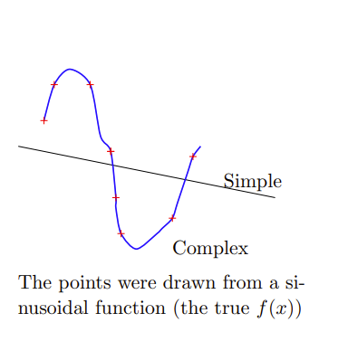
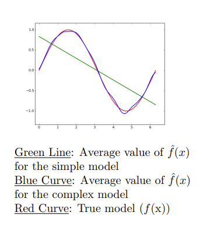
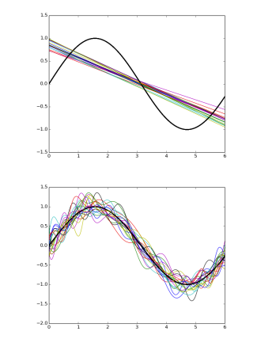
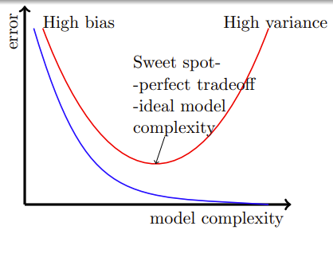

# 深度学习中的正则化手段

## Reference

- https://www.cse.iitm.ac.in/~miteshk/CS7015/Slides/Handout/Lecture8.pdf

## 1 偏差和方差

我们将快速概述偏差、方差以及它们之间的权衡关系. 

让我们考虑通过一组给定的点拟合曲线的问题. 这些点是从一个正弦函数（真实的 $f(x)$ ）中抽取的. 我们考虑两个模型：

- **简单模型（次数为1）**： $y = \hat{f}(x) = w_1x + w_0$ 
- **复杂模型（次数为25）**： $y = \hat{f}(x)=\sum_{i = 1}^{25}w_ix^i + w_0$ 

注意，在这两种情况下，我们都对 $y$ 与 $x$ 的关系做了假设. 但我们并不知道真实的关系 $f(x)$ 是什么样的. 

训练数据包含100个点. 我们从训练数据中采样25个点，并训练一个简单模型和一个复杂模型. 重复这个过程 $k$ 次，以训练多个模型（每个模型看到的训练数据样本不同）. 

设 $f(x)$ 为真实模型（在这种情况下是正弦模型）， $\hat{f}(x)$ 是我们对模型的估计（在这种情况下，是简单模型或复杂模型），那么偏差的计算公式为：

$$
Bias(\hat{f}(x)) = E[\hat{f}(x)] - f(x)
$$

其中 $E[\hat{f}(x)]$ 是模型的平均值（或期望值）. 

我们可以看到，对于简单模型，其平均值（绿线）与真实值 $f(x)$ （正弦函数）相差很远. 从数学角度讲，这意味着简单模型具有高偏差. 另一方面，复杂模型具有低偏差. 

现在，我们定义方差（来自统计学的标准定义）：

$$
Variance(\hat{f}(x)) = E[(\hat{f}(x) - E[\hat{f}(x)])^2]
$$

大致来说，它告诉我们不同的 $\hat{f}(x)$ （在不同的数据样本上训练得到）之间的差异程度. 很明显，简单模型具有低方差，而复杂模型具有高方差.

简单总结一下（非正式表述）：

- 简单模型：高偏差，低方差
- 复杂模型：低偏差，高方差

偏差和方差之间总是存在权衡关系. 偏差和方差都会导致均方误差. 下面让我们来看看具体情况. 

## 2 训练误差与测试误差

我们可以证明：

$$
E[(y - \hat{f}(x))^2] = Bias^2 + Variance + \sigma^2(不可约误差)
$$

证明可见[链接](https://www.inf.ed.ac.uk/teaching/courses/mlsc/Notes/Lecture4/BiasVariance.pdf)

考虑一个在训练过程中未见过的新点 $(x, y)$ . 如果我们使用模型 $\hat{f}(x)$ 来预测 $y$ 的值，那么均方误差由下式给出：
$$E[(y - \hat{f}(x))^2]$$
（这是对许多这样的未见过的点预测 $y$ 的平均平方误差）. 

 $\hat{f}(x)$ 的参数（所有的 $w_i$ ）是使用训练集 $\{(x_i, y_i)\}_{i = 1}^{n}$ 进行训练的. 然而，在测试时，我们感兴趣的是在一个验证集（未用于训练的数据）上评估模型. 这就产生了两个我们感兴趣的量： $train_{err}$ （例如，均方误差）和 $test_{err}$ （例如，均方误差）. 

通常，这些误差呈现出下图中所示的趋势. （$train_{err}$蓝色， $test_{err}$红色）

到目前为止形成的直观理解：假设有 $n$ 个训练点和 $m$ 个测试（验证）点. 

$$
train_{err} = \frac{1}{n}\sum_{i = 1}^{n}(y_i - \hat{f}(x_i))^2
$$

$$
test_{err} = \frac{1}{m}\sum_{i = n + 1}^{n + m}(y_i - \hat{f}(x_i))^2
$$

随着模型复杂度的增加， $train_{err}$ 会变得过于乐观，无法真实反映 $\hat{f}$ 与 $f$ 的接近程度. 而验证误差能真实反映 $\hat{f}$ 与 $f$ 的接近程度. 我们现在从数学角度将这种直观理解具体化，并最终展示如何解释训练误差中的乐观偏差. 

设 $D = \{x_i, y_i\}_{i = 1}^{m + n}$ ，那么对于任意点 $(x, y)$ ，我们有：

$$
y_i = f(x_i) + \varepsilon_i
$$

这意味着 $y_i$ 通过某个真实函数 $f$ 与 $x_i$ 相关，但在这个关系中也存在一些噪声 $\varepsilon$ . 为了简化，我们假设：

$$
\varepsilon \sim \mathcal{N}(0, \sigma^2)
$$

当然，我们并不知道 $f$ . 

此外，我们使用 $\hat{f}$ 来近似 $f$ ，并使用 $D$ 的子集 $T$ 来估计参数，使得：
$$y_i = \hat{f}(x_i)$$

我们想知道：
$$E[(\hat{f}(x_i) - f(x_i))^2]$$
但由于我们不知道 $f$ ，所以无法直接估计它. 我们将看到如何利用观察值 $y_i$ 和预测值 $\hat{y}_i$ 通过经验来估计它. 
$$E[(\hat{y}_i - y_i)^2] = E[(\hat{f}(x_i) - f(x_i) - \varepsilon_i)^2] \quad (y_i = f(x_i) + \varepsilon_i)$$
$$ = E[(\hat{f}(x_i) - f(x_i))^2 - 2\varepsilon_i(\hat{f}(x_i) - f(x_i)) + \varepsilon_i^2]$$
$$ = E[(\hat{f}(x_i) - f(x_i))^2] - 2E[\varepsilon_i(\hat{f}(x_i) - f(x_i))] + E[\varepsilon_i^2]$$
$$\therefore E[(\hat{f}(x_i) - f(x_i))^2] = E[(\hat{y}_i - y_i)^2] - E[\varepsilon_i^2] + 2E[\varepsilon_i(\hat{f}(x_i) - f(x_i))]$$

我们先绕个小弯，了解一下如何通过经验估计期望，然后再回到我们的推导. 

假设我们观察到 $k$ 场比赛中进球数 $(z)$ 分别为 $z_1 = 2$ ， $z_2 = 1$ ， $z_3 = 0$ ， $\cdots$ ， $z_k = 2$ . 现在我们可以通过经验估计 $E[z]$ ，即预期进球数：
$$E[z] = \frac{1}{k}\sum_{i = 1}^{k}z_i$$

与我们的推导类似：我们有一定数量的观察值 $y_i$ 和预测值 $\hat{y}_i$ ，利用它们我们可以估计：
$$E[(\hat{y}_i - y_i)^2] = \frac{1}{m}\sum_{i = 1}^{m}(\hat{y}_i - y_i)^2$$

回到我们的推导. 
$$E[(\hat{f}(x_i) - f(x_i))^2] = E[(\hat{y}_i - y_i)^2] - E[\varepsilon_i^2] + 2E[\varepsilon_i(\hat{f}(x_i) - f(x_i))]$$

我们可以使用训练观察值或测试观察值从经验上评估等式右边. 

### 情况1：使用测试观察值
$$ \underbrace{E[(\hat{f}(x_i) - f(x_i))^2]}_{真实误差} = \underbrace{\frac{1}{m}\sum_{i = n + 1}^{n + m}(\hat{y}_i - y_i)^2}_{误差的经验估计} - \underbrace{\frac{1}{m}\sum_{i = n + 1}^{n + m}\varepsilon_i^2}_{小常数} + 2\underbrace{E[\varepsilon_i(\hat{f}(x_i) - f(x_i))]}_{协方差(\varepsilon_i, \hat{f}(x_i) - f(x_i))}$$

因为协方差计算公式为：
$$covariance(X, Y) = E[(X - \mu_X)(Y - \mu_Y)] = E[(X)(Y - \mu_Y)] (如果\mu_X = E[X] = 0)$$
$$ = E[XY] - E[X\mu_Y] = E[XY] - \mu_YE[X] = E[XY]$$

由于测试观察值都没有参与 $\hat{f}(x)$ 的参数估计（ $\hat{f}(x)$ 的参数仅使用训练数据进行估计），所以 $\varepsilon \perp (\hat{f}(x_i) - f(x_i))$ ，即 $E[\varepsilon_i \cdot (\hat{f}(x_i) - f(x_i))] = E[\varepsilon_i] \cdot E[\hat{f}(x_i) - f(x_i)] = 0 \cdot E[\hat{f}(x_i) - f(x_i)] = 0$ . 

因此，真实误差 = 经验测试误差 + 小常数. 所以，我们应该始终使用一个独立于训练集的验证集来估计误差. 

### 情况2：使用训练观察值
$$ \underbrace{E[(\hat{f}(x_i) - f(x_i))^2]}_{真实误差} = \underbrace{\frac{1}{n}\sum_{i = 1}^{n}(\hat{y}_i - y_i)^2}_{误差的经验估计} - \underbrace{\frac{1}{n}\sum_{i = 1}^{n}\varepsilon_i^2}_{小常数} + 2\underbrace{E[\varepsilon_i(\hat{f}(x_i) - f(x_i))]}_{协方差(\varepsilon_i, \hat{f}(x_i) - f(x_i))}$$

现在， $\varepsilon$ 与 $\hat{f}(x)$ 不独立，因为 $\varepsilon$ 用于估计 $\hat{f}(x)$ 的参数，所以 $E[\varepsilon_i \cdot (\hat{f}(x_i) - f(x_i))] \neq E[\varepsilon_i] \cdot E[\hat{f}(x_i) - f(x_i)] \neq 0$ . 

因此，经验训练误差小于真实误差，无法真实反映误差情况. 但这与模型复杂度有什么关系呢？让我们接着看. 

## 模块8.3：真实误差与模型复杂度
利用斯坦引理（Stein's Lemma）（以及一些技巧），我们可以证明：
$$\frac{1}{n}\sum_{i = 1}^{n}\varepsilon_i(\hat{f}(x_i) - f(x_i)) = \frac{\sigma^2}{n}\sum_{i = 1}^{n}\frac{\partial \hat{f}(x_i)}{\partial y_i}$$

 $\frac{\partial \hat{f}(x_i)}{\partial y_i}$ 什么时候会很大呢？当观察值的一个小变化会导致估计值 $(\hat{f})$ 发生很大变化的时候. 

你能将其与模型复杂度联系起来吗？是的，复杂模型对观察值的变化更敏感，而简单模型对观察值的变化不太敏感. 

因此，我们可以说：真实误差 = 经验训练误差 + 小常数 + Ω(模型复杂度). 

让我们验证一下，复杂模型确实对数据的微小变化更敏感. 我们为给定的数据拟合了一个简单模型和一个复杂模型. 现在我们改变其中一个数据点. 与复杂模型相比，简单模型的变化不大. 

因此，在训练时，我们不应只最小化训练误差 $\mathscr{L}_{train}(\theta)$ ，而应最小化：
$$min_{w.r.t \theta} \mathscr{L}_{train}(\theta) + \Omega(\theta) = \mathscr{L}(\theta)$$
其中 $\Omega(\theta)$ 对于复杂模型会很大，对于简单模型会很小.  $\Omega(\theta)$ 可近似看作 $\frac{\sigma^2}{n}\sum_{i = 1}^{n}\frac{\partial \hat{f}(x_i)}{\partial y_i}$ . 这就是所有正则化方法的基础. 

我们可以证明， $l_1$ 正则化、 $l_2$ 正则化、提前停止和在输入中注入噪声都是这种正则化形式的具体实例. 

为什么我们要关注偏差-方差权衡和模型复杂度呢？深度神经网络是高度复杂的模型，有很多参数和非线性. 它们很容易过拟合，使训练误差降为0. 因此，我们需要某种形式的正则化. 

## 模块8.4：L2正则化
对于L2正则化，我们有：
$$\tilde{\mathscr{L}}(w) = \mathscr{L}(w) + \frac{\alpha}{2}\| w\| ^{2}$$
对于随机梯度下降（SGD）或其变体，我们关注的是：
$$\nabla \tilde{\mathscr{L}}(w) = \nabla \mathscr{L}(w) + \alpha w$$
更新规则为：
$$w_{t + 1} = w_{t} - \eta \nabla \mathscr{L}(w_{t}) - \eta \alpha w_{t}$$
这只需要对代码进行非常小的修改. 下面让我们看看它的几何解释. 

 $w^{*}$ 是 $\mathscr{L}(w)$ 的最优解（不是 $\tilde{\mathscr{L}}(w)$ 的最优解），即在没有正则化的情况下的解（ $w^{*}$ 最优意味着 $\nabla \mathscr{L}(w^{*}) = 0$ ）. 

考虑 $u = w - w^{*}$ . 使用泰勒级数展开（到二阶）：
$$\mathscr{L}(w^{*} + u) = \mathscr{L}(w^{*}) + u^{T} \nabla \mathscr{L}(w^{*}) + \frac{1}{2}u^{T} H u$$
$$ \begin{aligned} \mathscr{L}(w) & = \mathscr{L}(w^{*}) + (w - w^{*})^{T} \nabla \mathscr{L}(w^{*}) + \frac{1}{2}(w - w^{*})^{T} H (w - w^{*}) \\ & = \mathscr{L}(w^{*}) + \frac{1}{2}(w - w^{*})^{T} H (w - w^{*}) \quad (\because \nabla L(w^{*}) = 0) \end{aligned}$$
$$\nabla \mathscr{L}(w) = \nabla \mathscr{L}(w^{*}) + H (w - w^{*}) = H (w - w^{*})$$

现在，
$$\begin{aligned} \nabla \tilde{\mathscr{L}}(w) & = \nabla \mathscr{L}(w) + \alpha w \\ & = H (w - w^{*}) + \alpha w \end{aligned}$$

设 $\tilde{w}$ 是 $\tilde{L}(w)$ （即正则化损失）的最优解，因为 $\nabla \tilde{L}(\tilde{w}) = 0$ ，所以：
$$H (\tilde{w} - w^{*}) + \alpha \tilde{w} = 0$$
$$\therefore (H + \alpha \mathbb{I}) \tilde{w} = H w^{*}$$
$$\therefore \tilde{w} = (H + \alpha \mathbb{I})^{-1} H w^{*}$$

注意，如果 $\alpha \to 0$ ，那么 $\tilde{w} \to w^{*}$ （即没有正则化）. 但我们关注的是 $\alpha \neq 0$ 的情况. 

让我们分析 $\alpha \neq 0$ 的情况. 如果 $H$ 是对称半正定矩阵，那么 $H = Q \Lambda Q^{T}$ （ $Q$ 是正交矩阵， $Q Q^{T} = Q^{T} Q = \mathbb{I}$ ）. 
接上段翻译：
$$
\begin{align*}
\tilde{w}&=(H + \alpha\mathbb{I})^{-1}Hw^{*}\\
&=(Q\Lambda Q^{T} + \alpha\mathbb{I})^{-1}Q\Lambda Q^{T}w^{*}\\
&=(Q\Lambda Q^{T} + \alpha Q\mathbb{I}Q^{T})^{-1}Q\Lambda Q^{T}w^{*}\\
&=[Q(\Lambda + \alpha\mathbb{I})Q^{T}]^{-1}Q\Lambda Q^{T}w^{*}\\
&=Q^{T^{-1}}(\Lambda + \alpha\mathbb{I})^{-1}Q^{-1}Q\Lambda Q^{T}w^{*}\\
&=Q(\Lambda + \alpha\mathbb{I})^{-1}\Lambda Q^{T}w^{*}\quad(\because Q^{T^{-1}} = Q)\\
\tilde{w}&=QDQ^{T}w^{*}
\end{align*}
$$
其中 $D = (\Lambda + \alpha\mathbb{I})^{-1}\Lambda$ ， $\Lambda$ 是一个对角矩阵，我们很快会更详细地了解它. 

$$D = (\Lambda + \alpha\mathbb{I})^{-1}\Lambda$$
$$
\begin{align*}
\tilde{w}&=Q(\Lambda + \alpha\mathbb{I})^{-1}\Lambda Q^{T}w^{*}\\
&=QDQ^{T}w^{*}
\end{align*}
$$
$$(\Lambda + \alpha\mathbb{I})^{-1}=\begin{bmatrix}\frac{1}{\lambda_{1}+\alpha}& & & \\ & \frac{1}{\lambda_{2}+\alpha}& & \\ & & \ddots & \\ & & & \frac{1}{\lambda_{n}+\alpha}\end{bmatrix}$$
$$(\Lambda + \alpha\mathbb{I})^{-1}\Lambda=\begin{bmatrix}\frac{\lambda_{1}}{\lambda_{1}+\alpha}& & & \\ & \frac{\lambda_{2}}{\lambda_{2}+\alpha}& & \\ & & \ddots & \\ & & & \frac{\lambda_{n}}{\lambda_{n}+\alpha}\end{bmatrix}$$

这里发生了什么呢？ $w^{*}$ 首先通过 $Q^{T}$ 旋转得到 $Q^{T}w^{*}$ . 然而，如果 $\alpha = 0$ ，那么 $Q$ 会将 $Q^{T}w^{*}$ 旋转回 $w^{*}$ . 如果 $\alpha\neq0$ ，让我们看看 $D$ 是什么样的. 现在又发生了什么呢？

$$D = (\Lambda + \alpha\mathbb{I})^{-1}\Lambda$$
$$
\begin{align*}
\tilde{w}&=Q(\Lambda + \alpha\mathbb{I})^{-1}\Lambda Q^{T}w^{*}\\
&=QDQ^{T}w^{*}
\end{align*}
$$
$$(\Lambda + \alpha\mathbb{I})^{-1}=\begin{bmatrix}\frac{1}{\lambda_{1}+\alpha}& & & \\ & \frac{1}{\lambda_{2}+\alpha}& & \\ & & \ddots & \\ & & & \frac{1}{\lambda_{n}+\alpha}\end{bmatrix}$$
$$(\Lambda + \alpha\mathbb{I})^{-1}\Lambda=\begin{bmatrix}\frac{\lambda_{1}}{\lambda_{1}+\alpha}& & & \\ & \frac{\lambda_{2}}{\lambda_{2}+\alpha}& & \\ & & \ddots & \\ & & & \frac{\lambda_{n}}{\lambda_{n}+\alpha}\end{bmatrix}$$

在通过 $Q$ 旋转回来之前， $Q^{T}w^{*}$ 的每个元素 $i$ 都会被 $\frac{\lambda_{i}}{\lambda_{i}+\alpha}$ 缩放. 如果 $\lambda_{i}>>\alpha$ ，那么 $\frac{\lambda_{i}}{\lambda_{i}+\alpha}\approx1$ ；如果 $\lambda_{i}<<\alpha$ ，那么 $\frac{\lambda_{i}}{\lambda_{i}+\alpha}\approx0$ . 因此，只有重要的方向（较大的特征值）会被保留. 有效参数数量为 $\sum_{i = 1}^{n}\frac{\lambda_{i}}{\lambda_{i}+\alpha}<n$ . 

权重向量 $(w^{*})$ 被旋转为 $(\tilde{w})$  ，它的所有元素都在收缩，但有些元素收缩得比其他元素更多. 这确保了只有重要的特征被赋予高权重. 

## 模块8.5：数据集增强
我们利用这样一个事实，即对图像进行某些变换不会改变图像的标签. 例如给定训练数据中的一个图像，将其旋转20°、旋转65°、水平或垂直移动、模糊或改变一些像素，标签仍保持不变. 这些经过变换后得到的数据就是增强后的数据. 

通常情况下，数据越多，学习效果越好. 数据集增强在图像分类/目标识别任务中效果很好，在语音任务中也被证明是有效的. 但对于某些任务，可能不太清楚如何生成这样的数据. 

## 模块8.6：参数共享与绑定
### 参数共享
在卷积神经网络（CNNs）中使用. 相同的滤波器应用于图像的不同位置，或者相同的权重矩阵作用于不同的输入神经元. 

### 参数绑定
通常在自动编码器中使用. 编码器和解码器的权重是绑定的. 

## 模块8.7：输入添加噪声
我们在自动编码器中见过这种方法. 对于一个简单的输入输出神经网络，可以证明在输入中添加高斯噪声等同于权重衰减（ $L_{2}$ 正则化）. 这也可以看作是一种数据集增强方式. 

我们关注 $E[(\tilde{y}-y)^{2}]$ . 假设 $\varepsilon\sim\mathcal{N}(0,\sigma^{2})$ ， $\tilde{x_{i}} = x_{i}+\varepsilon_{i}$ ， $\hat{y}=\sum_{i = 1}^{n}w_{i}x_{i}$  . 
$$
\begin{align*}
E[(\tilde{y}-y)^{2}]&=E[(\hat{y}+\sum_{i = 1}^{n}w_{i}\varepsilon_{i}-y)^{2}]\\
&=E[((\hat{y}-y)+(\sum_{i = 1}^{n}w_{i}\varepsilon_{i}))^{2}]\\
&=E[(\hat{y}-y)^{2}]+E[2(\hat{y}-y)\sum_{i = 1}^{n}w_{i}\varepsilon_{i}]+E[(\sum_{i = 1}^{n}w_{i}\varepsilon_{i})^{2}]\\
&=E[(\hat{y}-y)^{2}]+0 + E[\sum_{i = 1}^{n}w_{i}^{2}\varepsilon_{i}^{2}]
\end{align*}
$$
（因为 $\varepsilon_{i}$ 与 $\varepsilon_{j}$ 相互独立，且 $\varepsilon_{i}$ 与 $(\hat{y}-y)$ 相互独立）
$$=E[(\hat{y}-y)^{2}]+\sigma^{2}\sum_{i = 1}^{n}w_{i}^{2}$$
（这是一个 $L_{2}$ 范数惩罚项）

$$
\begin{align*}
\tilde{y}&=\sum_{i = 1}^{n}w_{i}\tilde{x_{i}}\\
&=\sum_{i = 1}^{n}w_{i}x_{i}+\sum_{i = 1}^{n}w_{i}\varepsilon_{i}\\
&=\hat{y}+\sum_{i = 1}^{n}w_{i}\varepsilon_{i}
\end{align*}
$$

## 模块8.8：输出添加噪声
直观地说，不要完全信任真实标签，因为它们可能存在噪声. 相反，我们使用软标签. 

例如，在一个多分类问题中，假设真实分布 $p=\{0,0,1,0,0,0,0,0,0,0\}$ （硬标签），我们要最小化 $\sum_{i = 0}^{9}p_{i}\log q_{i}$  ，其中 $q$ 是估计分布. 而使用软标签时， $\varepsilon$ 是一个小的正常数，真实分布加上噪声后变为 $p=\{\frac{\varepsilon}{9},\frac{\varepsilon}{9},1 - \varepsilon,\frac{\varepsilon}{9},\cdots\}$  . 

## 模块8.9：提前停止
跟踪验证误差，并设置一个耐心参数 $p$ . 如果在第 $k$ 步时，验证误差在之前的 $p$ 步中没有改进，那么停止训练并返回在第 $k - p$ 步存储的模型. 基本上，就是在训练误差降为0并导致验证误差急剧上升之前提前停止训练. 

提前停止是一种非常有效且应用最广泛的正则化形式，它甚至可以与其他正则化方法（如 $l_{2}$ 正则化）一起使用. 它是如何起到正则化作用的呢？我们先从直观解释入手，然后进行数学分析. 

回忆随机梯度下降（SGD）的更新规则：
$$
\begin{align*}
w_{t + 1}&=w_{t}-\eta\nabla w_{t}\\
&=w_{0}-\eta\sum_{i = 1}^{t}\nabla w_{i}
\end{align*}
$$
设 $\tau$ 是 $\nabla w_{i}$ 的最大值，那么 $\vert w_{t + 1}-w_{0}\vert\leq\eta t\vert\tau\vert$  . 因此， $t$ 控制着 $w_{t}$ 与初始 $w_{0}$ 的距离，换句话说，它控制着探索空间. 

现在我们对其进行数学分析. 回忆 $\mathscr{L}(w)$ 的泰勒级数展开：
$$
\begin{align*}
\mathscr{L}(w)&=\mathscr{L}(w^{*})+(w - w^{*})^{T}\nabla\mathscr{L}(w^{*})+\frac{1}{2}(w - w^{*})^{T}H(w - w^{*})\\
&=\mathscr{L}(w^{*})+\frac{1}{2}(w - w^{*})^{T}H(w - w^{*})\quad[w^{*}是最优解，所以\nabla\mathscr{L}(w^{*}) = 0]\\
\nabla(\mathscr{L}(w))&=H(w - w^{*})
\end{align*}
$$
现在SGD的更新规则为：
$$
\begin{align*}
w_{t}&=w_{t - 1}-\eta\nabla\mathscr{L}(w_{t - 1})\\
&=w_{t - 1}-\eta H(w_{t - 1}-w^{*})\\
&=(I-\eta H)w_{t - 1}+\eta Hw^{*}
\end{align*}
$$
$$w_{t}=(I-\eta H)w_{t - 1}+\eta Hw^{*}$$
利用 $H$ 的特征值分解 $H = Q\Lambda Q^{T}$ ，我们得到：
$$w_{t}=(I-\eta Q\Lambda Q^{T})w_{t - 1}+\eta Q\Lambda Q^{T}w^{*}$$
如果我们从 $w_{0}=0$ 开始，可以证明（见附录）：
$$w_{t}=Q[I-(I-\varepsilon\Lambda)^{t}]Q^{T}w^{*}$$
将其与 $L_{2}$ 正则化下最优解 $\tilde{W}$ 的表达式 $\tilde{w}=Q[I-(\Lambda+\alpha I)^{-1}\alpha]Q^{T}w^{*}$ 进行比较. 我们发现，如果选择 $\varepsilon$ 、 $t$ 和 $\alpha$ 使得 $(I-\varepsilon\Lambda)^{t}=(\Lambda+\alpha I)^{-1}\alpha$  ，那么 $w_{t}=\tilde{w}$ . 

需要记住的是，提前停止只允许对参数进行 $t$ 次更新. 如果一个参数 $w$ 对应于对损失 $\mathscr{L}(\theta)$ 很重要的维度，那么 $\frac{\partial\mathscr{L}(\theta)}{\partial w}$ 会很大. 然而，如果一个参数不重要（ $\frac{\partial\mathscr{L}(\theta)}{\partial w}$ 很小），那么它的更新会很小，并且在 $t$ 步内该参数不会变得很大. 因此，提前停止会有效地收缩与不太重要方向对应的参数（与权重衰减的效果相同）. 

## 模块8.10：集成方法
将不同模型的输出组合起来以降低泛化误差. 这些模型可以是不同的分类器，也可以是同一分类器的不同实例，这些实例通过不同的超参数、不同的特征或不同的训练数据样本进行训练. 

### 装袋法（Bagging）
从给定的数据集中，通过有放回采样构建多个训练集 $(T_{1},T_{2},\cdots,T_{k})$ . 使用训练集 $T_{i}$ 训练第 $i$ 个分类器实例. 

所有模型平均预测的误差为 $\frac{1}{k}\sum_{i}\varepsilon_{i}$ ，期望平方误差为：
$$
\begin{align*}
mse&=E[(\frac{1}{k}\sum_{i}\varepsilon_{i})^{2}]\\
&=\frac{1}{k^{2}}E[\sum_{i}\sum_{i = j}\varepsilon_{i}\varepsilon_{j}+\sum_{i}\sum_{i\neq j}\varepsilon_{i}\varepsilon_{j}]\\
&=\frac{1}{k^{2}}E[\sum_{i}\varepsilon_{i}^{2}+\sum_{i}\sum_{i\neq j}E[\varepsilon_{i}\varepsilon_{j}]]\\
&=\frac{1}{k^{2}}(\sum_{i}E[\varepsilon_{i}^{2}]+\sum_{i}\sum_{i\neq j}E[\varepsilon_{i}\varepsilon_{j}])\\
&=\frac{1}{k^{2}}(kV + k(k - 1)C)\\
&=\frac{1}{k}V+\frac{k - 1}{k}C
\end{align*}
$$

装袋法在什么时候有效呢？考虑一组 $k$ 个逻辑回归（LR）模型，假设每个模型在一个测试样本上的误差为 $\varepsilon_{i}$ ，且 $\varepsilon_{i}$ 服从零均值的多元正态分布. 方差 $E[\varepsilon_{i}^{2}]=V$  ，协方差 $E[\varepsilon_{i}\varepsilon_{j}]=C$ . 

$$mse=\frac{1}{k}V+\frac{k - 1}{k}C$$
如果模型的误差完全相关，那么 $V = C$ ， $mse = V$ （装袋法没有帮助：集成模型的均方误差与单个模型一样差）. 如果模型的误差相互独立或不相关，那么 $C = 0$ ，集成模型的均方误差降至 $\frac{1}{k}V$  . 平均而言，集成模型的性能至少与它的单个成员一样好. 

## 模块8.11：随机失活（Dropout）
通常，模型平均（装袋集成）总是有帮助的. 但是训练多个大型神经网络来构建一个集成模型的成本高得令人却步. 
 - 选项1：训练几个具有不同架构的神经网络（显然成本很高）. 
 - 选项2：使用不同的训练样本训练同一网络的多个实例（同样成本高昂）. 
即使我们通过选项1或选项2完成了训练，在测试时组合多个模型在实时应用中也是不可行的. 

随机失活是一种解决这两个问题的技术. 它有效地允许在没有任何显著计算开销的情况下训练多个神经网络，同时也提供了一种高效的近似方法来组合指数数量的不同神经网络. 

随机失活指的是随机丢弃单元. 临时删除一个节点及其所有传入/传出连接，从而得到一个精简的网络. 每个节点以固定的概率保留（通常隐藏节点的保留概率 $p = 0.5$ ，可见节点的保留概率 $p = 0.8$ ）. 

假设有一个包含 $n$ 个节点的神经网络，利用随机失活的思想，每个节点都可以被保留或丢弃. 例如，在上述情况中，我们丢弃5个节点得到一个精简网络. 对于总共 $n$ 个节点，可以形成多少个精简网络呢？答案是 $2^{n}$ 个. 当然，这个数量太大了，我们不可能训练这么多网络. 

技巧如下：
 - （1）在所有网络中共享权重. 
 - （2）为每个训练实例采样一个不同的网络. 

让我们看看具体怎么做. 我们初始化网络的所有参数（权重）并开始训练. 对于第一个训练实例（或小批量数据），我们应用随机失活得到一个精简网络，计算损失并进行反向传播. 我们只更新那些处于激活状态的参数. 

对于第二个训练实例（或小批量数据），我们再次应用随机失活得到一个不同的精简网络，再次计算损失并对激活的权重进行反向传播. 如果一个权重在两个训练实例中都处于激活状态，那么它现在已经收到了两次更新；如果它只在其中一个训练实例中处于激活状态，那么它现在只收到了一次更新 . 每个精简网络很少（甚至从未）被完整训练，但参数共享确保了没有模型存在未训练或训练不佳的参数. 

在测试时会发生什么呢？聚合 $2^{n}$ 个精简网络的输出是不可能的. 相反，我们使用完整的神经网络，并将每个节点的输出按其在训练期间处于激活状态的比例进行缩放. 

随机失活本质上是对隐藏单元应用了一种掩码噪声，防止隐藏单元之间过度适应. 本质上，一个隐藏单元不能过度依赖其他单元，因为它们随时可能被丢弃. 每个隐藏单元都必须学会对这些随机丢弃更具鲁棒性. 

这里有一个例子说明随机失活如何有助于确保冗余性和鲁棒性. 假设 $h_{i}$ 通过检测到鼻子来学习检测人脸，那么丢弃 $h_{i}$ 就相当于抹去了鼻子存在的信息. 此时，模型应该学习另一个 $h_{i}$ 来冗余编码鼻子的存在，或者模型应该学会使用其他特征来检测人脸. 

### 回顾
-  $l_{2}$ 正则化
- 数据集增强
- 参数共享与绑定
- 输入添加噪声
- 输出添加噪声
- 提前停止
- 集成方法
- 随机失活（Dropout）

### 附录
证明以下两个等式等价：
$$w_{t}=(I - \eta Q\Lambda Q^{T})w_{t - 1} + \eta Q\Lambda Q^{T}w^{*}$$
$$w_{t}=Q[I - (I - \varepsilon\Lambda)^{t}]Q^{T}w^{*}$$

**归纳证明**：
- **基础情况**：当 $t = 1$ 且 $w_{0} = 0$ 时，根据第一个等式：
$$
\begin{align*}
w_{1}&=(I - \eta Q\Lambda Q^{T})w_{0} + \eta Q\Lambda Q^{T}w^{*}\\
&=\eta Q\Lambda Q^{T}w^{*}
\end{align*}
$$
根据第二个等式：
$$
\begin{align*}
w_{1}&=Q(I - (I - \eta\Lambda)^{1})Q^{T}w^{*}\\
&=\eta Q\Lambda Q^{T}w^{*}
\end{align*}
$$
- **归纳步骤**：假设在第 $t$ 步时两个等式等价，即
$$
\begin{align*}
w_{t}&=(I - \eta Q\Lambda Q^{T})w_{t - 1} + \eta Q\Lambda Q^{T}w^{*}\\
&=Q[I - (I - \varepsilon\Lambda)^{t}]Q^{T}w^{*}
\end{align*}
$$
证明在第 $(t + 1)$ 步时等式仍然成立. 
$$w_{t + 1}=(I - \eta Q\Lambda Q^{T})w_{t} + \eta Q\Lambda Q^{T}w^{*}$$
（使用 $w_{t}=Q[I - (I - \varepsilon\Lambda)^{t}]Q^{T}w^{*}$ ）
$$
\begin{align*}
w_{t + 1}&=(I - \eta Q\Lambda Q^{T})Q[I - (I - \eta\Lambda)^{t}]Q^{T}w^{*} + \eta Q\Lambda Q^{T}w^{*}\\
&=IQ[I - (I - \eta\Lambda)^{t}]Q^{T}w^{*} - \eta Q\Lambda Q^{T}Q[I - (I - \eta\Lambda)^{t}]Q^{T}w^{*} + \eta Q\Lambda Q^{T}w^{*}\\
\end{align*}
$$
（展开括号）
$$
\begin{align*}
w_{t + 1}&=Q[I - (I - \eta\Lambda)^{t}]Q^{T}w^{*} - \eta Q\Lambda[I - (I - \eta\Lambda)^{t}]Q^{T}w^{*} + \eta Q\Lambda Q^{T}w^{*}\\
&=Q\left\{\left[I - (I - \eta\Lambda)^{t}\right] - \eta\Lambda\left[I - (I - \eta\Lambda)^{t}\right] + \eta\Lambda\right\}Q^{T}w^{*}\\
\end{align*}
$$
（继续推导） 

$$
\begin{align*}
w_{t + 1}&=Q\left\{\left[I - (I - \eta\Lambda)^{t}\right] - \eta\Lambda + \eta\Lambda (I - \eta\Lambda)^{t} + \eta\Lambda\right\}Q^{T}w^{*}\\
&=Q\left\{I - (I - \eta\Lambda)^{t} + \eta\Lambda (I - \eta\Lambda)^{t}\right\}Q^{T}w^{*}\\
&=Q\left\{I - (I - \eta\Lambda)^{t + 1}\right\}Q^{T}w^{*}
\end{align*}
$$

所以，两个等式对于 $(t + 1)$ 步也相等，通过归纳法证明了这两个等式在所有步骤都等价.  