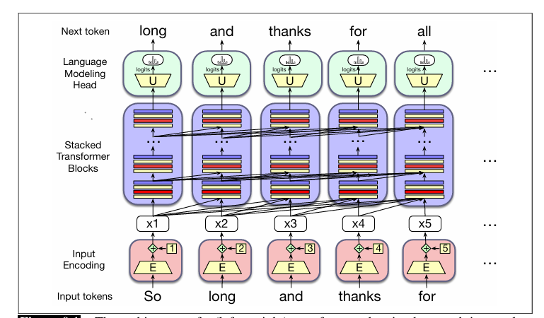

# Transformer

## Reference

- https://web.stanford.edu/~jurafsky/slp3/9.pdf
- https://krmopuri.github.io/dl24/static_files/presentations/dl-15-I.pdf
- https://arxiv.org/pdf/1508.04025
- https://arxiv.org/pdf/1706.03762

在本章中，我们将介绍 Transformer，这是构建大语言模型的标准架构. 基于 Transformer 的大语言模型彻底改变了语音和语言处理领域.  目前，我们将重点关注从左到右（有时也称为因果或自回归）的语言建模，在这种建模方式中，我们会得到一系列输入词元，然后根据前文语境逐个预测输出词元. 

Transformer 是一种具有特定结构的神经网络，其中包含一种名为自注意力（self-attention）或多头注意力（multi-head attention）的机制. 注意力可以被看作是一种通过关注并整合周围词元的信息来构建某个词元含义的上下文表示的方法，它能帮助模型学习词元在较大跨度内的相互关系. 

下图勾勒出了 Transformer 的架构. 一个 Transformer 主要有三个组成部分. 核心部分是一系列 Transformer 块（transformer blocks）. 每个块都是一个多层网络（包含一个多头注意力层、前馈网络和层归一化步骤），它将第 $i$ 列中的输入向量 $x_{i}$（对应输入词元i）映射为输出向量 $h_{i}$. 这一组 $n$ 个块将一整个输入向量上下文窗口 $(x_{1}, ..., x_{n})$ 映射为长度相同的输出向量窗口 $(h_{1}, ..., h_{n})$ . 一列中可能包含12到96个或更多堆叠的块. 

在这列 Transformer 块之前是输入编码组件（input encoding），它使用嵌入矩阵 $E$ 和一种对词元位置进行编码的机制，将输入词元（如单词“thanks”）处理为上下文向量表示. 每一列之后是一个语言建模头（language modeling head），它获取最后一个 Transformer 块的嵌入输出，将其通过一个反嵌入矩阵 $U$，并在词汇表上进行softmax操作，为该列生成单个词元. 

在接下来的部分，我们将介绍多头注意力、 Transformer 块的其他部分，以及输入编码和语言建模头组件. 

## 1 注意力机制

对于word2vec和其他静态词嵌入，一个单词含义的表示始终是同一个向量，与上下文无关：例如，单词“chicken”总是由同一个固定向量表示. 所以，单词“it”的静态向量可能会以某种方式编码它是一个用于动物和无生命物体的代词这一信息. 但在上下文中，它的含义要丰富得多. 考虑“it”在以下两个句子中的情况：
- （1）The chicken didn’t cross the road because it was too tired.（鸡没有过马路，因为它太累了. ）
- （2）The chicken didn’t cross the road because it was too wide.（鸡没有过马路，因为路太宽了. ）

在（1）中，“it”指的是鸡（即读者知道是鸡累了），而在（2）中，“it”指的是路（并且读者知道路很宽）. 也就是说，如果我们要计算这个句子的含义，我们需要让“it”的含义在第一个句子中与鸡相关联，在第二个句子中与路相关联，即对上下文敏感. 

此外，像因果语言模型那样从左到右阅读，处理到“it”这个单词时的句子为：
- （3）The chicken didn’t cross the road because it

此时我们还不知道“it”最终会指代什么！所以在这一点上，“it”的表示可能同时包含鸡和路的某些方面，因为读者正在试图猜测接下来会发生什么. 

单词与其他可能相距较远的单词之间存在丰富的语言关系，这一现象在语言中普遍存在. 再看两个例子：
- （4）The keys to the cabinet are on the table.（橱柜的钥匙在桌子上. ）
- （5）I walked along the pond, and noticed one of the trees along the bank.（我沿着池塘散步，注意到岸边的一棵树. ）

在（4）中，短语 “The keys” 是句子的主语，在英语和许多语言中，主语必须在语法数上与动词“are”一致；在这个例子中，两者都是复数形式. 在英语中，我们不能用单数动词“is”与像“keys”这样的复数主语搭配（我们将在第18章进一步讨论一致性问题）. 在（5）中，由于上下文，包括“pond”这样的单词，我们知道“bank”指的是池塘或河流的岸边，而不是金融机构. （我们将在第11章讨论更多关于词义的内容. ）

所有这些例子的要点在于，这些帮助我们在上下文中计算单词含义的上下文单词，在句子或段落中可能相距很远.  Transformer 可以通过整合这些有用的上下文单词的含义，构建单词含义的上下文表示，即上下文嵌入（contextual embeddings）. 在 Transformer 中，我们逐层构建输入词元含义的越来越丰富的上下文表示. 在每一层，我们通过将前一层中关于词元i的信息与相邻词元的信息相结合，来计算词元i的表示，从而为每个位置的每个单词生成上下文表示. 

注意力机制是 Transformer 中的一种机制，它对来自第k - 1层上下文中其他适当词元的表示进行加权和组合，以构建第k层词元的表示. 

图9.2展示了一个从 Transformer 简化而来的示意性示例（Uszkoreit，2017）. 该图描述了当前词元为“it”时的情况，我们需要在 Transformer 的第k + 1层为这个词元计算上下文表示，同时利用前一层（第k层）中每个先前词元的表示. 图中用颜色表示对上下文单词的注意力分布：词元“chicken”和“road”都具有较高的注意力权重，这意味着在计算“it”的表示时，我们将主要借鉴“chicken”和“road”的表示. 这在构建“it”的最终表示时将非常有用，因为“it”最终要么与“chicken”共指，要么与“road”共指. 

图9.2 在计算第k+1层单词“it”的表示时，自注意力权重分布α是计算的一部分. 在计算“it”的表示时，我们对第k层的各个单词有不同程度的关注，颜色越深表示自注意力值越高. 注意， Transformer 高度关注与词元“chicken”和“road”对应的列，这是合理的结果，因为在“it”出现的位置，它可能与“chicken”或“road”共指，因此我们希望“it”的表示能借鉴这些前面单词的表示. 改编自Uszkoreit (2017)

现在让我们来看看这种注意力分布是如何表示和计算的. 

### 9.1.1 更形式化的注意力机制
如前所述，注意力计算是一种在 Transformer 的特定层为某个词元计算向量表示的方法，它通过有选择地关注并整合前一层中先前词元的信息来实现. 注意力机制接收对应于位置i的输入词元的输入表示$x_{i}$，以及先前输入的上下文窗口$x_{1} ... x_{i - 1}$，并产生输出$a_{i}$. 

在因果的、从左到右的语言模型中，上下文是任何先前的单词. 也就是说，在处理$x_{i}$时，模型可以访问$x_{i}$以及上下文窗口中所有先前词元的表示（上下文窗口通常包含数千个词元），但无法访问i之后的词元. （相比之下，在第11章中，我们将推广注意力机制，使其也能向前查看未来的单词. ）

图9.3展示了整个因果自注意力层中的信息流，在这个层中，相同的注意力计算在每个词元位置i并行进行. 因此，一个自注意力层将输入序列$(x_{1}, ..., x_{n})$映射为长度相同的输出序列$(a_{1}, ..., a_{n})$. 

图9.3 因果自注意力中的信息流. 在处理每个输入$x_{i}$时，模型会关注包括$x_{i}$在内的所有先前输入

#### 简化版注意力机制
从本质上讲，注意力机制实际上就是上下文向量的加权和，只是在权重的计算方式和求和内容上增加了许多复杂因素. 为了便于教学，我们先描述一种简化的注意力机制直观理解，在这种理解中，词元位置i处的注意力输出$a_{i}$仅仅是所有$j ≤ i$的表示$x_{j}$的加权和；我们用$\alpha_{ij}$表示$x_{j}$对$a_{i}$的贡献程度. 

简化版: 

$$
a_{i}=\sum_{j \leq i} \alpha_{i j} x_{j} (9.6)
$$

每个$\alpha_{ij}$都是一个标量，用于在对输入进行求和以计算$a_{i}$时对输入$x_{j}$的值进行加权. 我们应该如何计算这个权重呢？在注意力机制中，我们根据每个先前嵌入与当前词元i的相似程度对其进行加权. 所以注意力的输出是先前词元嵌入的总和，这些嵌入由它们与当前词元嵌入的相似性进行加权. 我们通过点积计算相似性分数，点积将两个向量映射为一个从−∞到∞的标量值. 分数越大，被比较的向量就越相似. 我们将使用softmax对这些分数进行归一化，以创建权重向量$\alpha_{ij}$，其中$j ≤ i$. 
\[简化版: score\left(x_{i}, x_{j}\right)=x_{i} \cdot x_{j} (9.7)\]
\[\alpha_{i j}=softmax\left(score\left(x_{i}, x_{j}\right)\right) \forall j \leq i \quad(9.8)\]

因此，在图9.3中，我们通过计算三个分数$x_{3} \cdot x_{1}$ 、$x_{3} \cdot x_{2}$和$x_{3} \cdot x_{3}$来计算$a_{3}$，用softmax对它们进行归一化，并将得到的概率作为权重，指示它们与当前位置i的相对相关性. 当然，由于$x_{i}$与自身非常相似，点积会很高，所以softmax权重很可能对$x_{i}$最高. 但其他上下文单词也可能与i相似，softmax也会给这些单词分配一些权重. 然后，我们将这些权重作为公式9.6中的α值，计算加权和，得到$a_{3}$. 

公式9.6 - 9.8中的简化注意力机制展示了基于注意力计算$a_{i}$的方法：将$x_{i}$与先前向量进行比较，将这些分数归一化为用于对先前向量求和的概率分布. 但现在我们准备去掉这些简化. 

#### 单注意力头：使用查询、键和值矩阵
既然我们已经了解了注意力机制的简单直观理解，现在让我们介绍实际的注意力头，即 Transformer 中使用的注意力版本. （在 Transformer 中，“头”这个词通常用于指代特定的结构化层. ）注意力头使我们能够清晰地表示每个输入嵌入在注意力过程中所扮演的三个不同角色：
- 作为当前与前面输入进行比较的元素. 我们将这个角色称为查询（query）. 
- 作为前面的输入，与当前元素进行比较以确定相似性权重. 我们将这个角色称为键（key）. 
- 最后，作为前面元素的值，这个值将被加权并求和，以计算当前元素的输出. 

为了体现这三个不同的角色， Transformer 引入了权重矩阵$w^{q}$ 、$W^{K}$和$w^{v}$ . 这些权重将每个输入向量$x_{i}$投影为其作为键、查询或值的表示：
\[q_{i}=x_{i} W^{Q} ; k_{i}=x_{i} W^{K} ; v_{i}=x_{i} W^{V}\]

有了这些投影，当我们计算当前元素$x_{i}$与某个先前元素$x_{j}$的相似性时，我们将使用当前元素的查询向量$q_{i}$和前面元素的键向量$k_{j}$之间的点积. 此外，点积的结果可能是任意大（正或负）的值，对大值进行指数运算可能会导致数值问题，并在训练过程中导致梯度消失. 为了避免这种情况，我们通过除以查询和键向量的维度（$d$）的平方根，将点积按与嵌入大小相关的因子进行缩放. 因此，我们用公式9.11替换简化的公式9.7. 随后得到$\alpha_{ij}$的softmax计算保持不变，但单个注意力头$head_{i}$的输出计算现在基于对值向量$v$的加权和（公式9.13）. 

以下是从单个输入向量$x_{i}$计算单个自注意力输出向量$a_{i}$的最终一组公式. 这个版本的注意力机制通过对先前元素的值进行求和来计算$a_{i}$，每个值都由其键与当前元素查询的相似性进行加权：
\[q_{i}=x_{i} W^{Q} ; k_{j}=x_{j} W^{K} ; v_{j}=x_{j} W^{v}\]
\[score\left(x_{i}, x_{j}\right)=\frac{q_{i} \cdot k_{j}}{\sqrt{d_{k}}} \quad(9.11)\]
\[\alpha_{i j}=softmax\left(score\left(x_{i}, x_{j}\right)\right) \forall j \leq i (9.12)\]
\[head_{i}=\sum_{j \leq i} \alpha_{i j} v_{j} (9.13)\]
\[a_{i}= head _{i} W^{0} (9.14)\]

我们在图9.4中以计算序列中第三个输出$a_{3}$的值为例来说明这一点. 

图9.4 使用因果（从左到右）自注意力计算序列中第三个元素$a_{3}$的值

注意，我们还引入了另一个矩阵$w_{0}$，它与注意力头进行右乘. 这是为了重塑注意力头的输出. 注意力的输入$x_{i}$和输出$a_{i}$都具有相同的维度$[1 ×d]$. 我们通常将d称为模型维度，实际上，正如我们将在9.2节中讨论的，每个 Transformer 块的输出$h_{i}$，以及 Transformer 块内部的中间向量也都具有相同的维度$[1 ×d]$. 使所有内容具有相同的维度使 Transformer 具有很强的模块化特性. 

那么让我们来讨论一下维度形状. 我们如何从输入的$[1 ×d]$得到输出的$[1 ×d]$呢？让我们看看所有的内部维度形状. 我们将为键和查询向量设置一个维度$d_{k}$. 查询向量和键向量的维度都是$1 ×d_{k}$，所以我们可以对它们进行点积$q_{i} \cdot k_{j}$以产生一个标量. 我们将为值向量设置一个单独的维度$d_{v}$. 变换矩阵$w^{a}$的形状是$[d ×d_{k}]$，$W^{K}$是$[d ×d_{k}]$，$w v$是$[d ×d

### 多头注意力机制

公式9.11 - 9.13描述了单个注意力头的计算. 但实际上， Transformer 使用多个注意力头. 其背后的直觉是，每个头可能出于不同目的关注上下文：不同的头可能专门用于表示上下文元素与当前词元之间的不同语言关系，或者在上下文中寻找特定类型的模式. 

因此，在多头注意力机制中，我们有A个独立的注意力头，它们位于模型中相同深度的并行层中，每个头都有自己的一组参数，这使得每个头能够对输入之间的关系的不同方面进行建模. 这样，自注意力层中的每个头$i$都有自己的一组键、查询和值矩阵：$W^{Ki}$、$W^{Qi}$和$W^{Vi}$ . 这些矩阵用于将输入投影为每个头单独的键、值和查询嵌入. 

当使用多个头时，模型的输入和输出维度仍然是$d$，键和查询嵌入的维度是$d_{k}$，值嵌入的维度是$d_{v}$（同样，在原始的 Transformer 论文中，$d_{k}=d_{v}=64$，$A = 8$，$d = 512$ ）. 因此，对于每个头$i$，我们有形状为$[d×d_{k}]$的权重层$W^{Qi}$、形状为$[d×d_{k}]$的$W^{Ki}$和形状为$[d×d_{v}]$的$W^{Vi}$ . 

下面是添加了多头的注意力机制公式；图9.5展示了其原理. 
\[q_{i}^{c}=x_{i} W^{Q c} ; k_{j}^{c}=x_{j} W^{K c} ; v_{j}^{c}=x_{j} W^{V c} ; \forall c, 1 \leq c \leq A\]
\[score^{c}\left(x_{i}, x_{j}\right)=\frac{q_{i}^{c} \cdot k_{j}^{c}}{\sqrt{d_{k}}} (9.16)\]
\[\alpha_{i j}^{c}=softmax\left(score^{c}\left(x_{i}, x_{j}\right)\right) \forall j \leq i \quad(9.17)\]
\[head_{i}^{c}=\sum_{j \leq i} \alpha_{i j}^{c} v_{j}^{c} (9.18)\]
\[a_{i}=\left( head ^{1} \oplus head ^{2} ... \oplus head ^{A}\right) W^{O}(9.19)\]
\[MultiHeadAttention \left(x_{i},\left[x_{1}, \cdots, x_{N}\right]\right)=a_{i} \quad (9.20)\]

图9.5 输入$x_{i}$的多头注意力计算，产生输出$a_{i}$. 多头注意力层有A个头部，每个头部都有自己的键、查询和值权重矩阵. 每个头部的输出被连接起来，然后投影到d维，从而产生与输入大小相同的输出

每个A个头部的输出形状是$1×d_{v}$，因此具有A个头部的多头层的输出由A个形状为$1×d_{v}$的向量组成. 这些向量被连接起来，产生一个维度为$1×hd_{v}$的单个输出. 然后，我们使用另一个线性投影$W^{O} \in \mathbb{R}^{A d_{v} ×d}$对其进行重塑，从而在每个输入$i$处得到具有正确输出形状$[1×d]$的多头注意力向量$a_{i}$. 

## 9.2  Transformer 块
自注意力计算是 Transformer 块的核心. 除了自注意力层， Transformer 块还包括其他三种类型的层：（1）前馈层，（2）残差连接，以及（3）归一化层（通常称为“层归一化”）. 

图9.6展示了一个 Transformer 块，描绘了一种通常被称为残差流（residual stream）的思考 Transformer 块的方式（Elhage等人，2021）. 在残差流的视角下，我们将单个词元$i$通过 Transformer 块的处理视为词元位置$i$的d维表示的单个流. 这个残差流从原始输入向量开始， Transformer 的各个组件从残差流中读取输入，并将它们的输出添加回该流中. 

图9.6 展示残差流的 Transformer 块架构. 此图展示了prenorm版本的架构，其中层归一化发生在注意力和前馈层之前，而非之后

残差流底部的输入是一个词元的嵌入，其维度为$d$. 这个初始嵌入通过残差连接向上传递，并逐渐被 Transformer 的其他组件添加信息：我们已经介绍过的注意力层，以及我们即将介绍的前馈层. 在注意力层和前馈层之前有一个称为层归一化的计算. 

因此，初始向量先经过层归一化和注意力层，结果被添加回残差流中，在这种情况下是添加到原始输入向量$x_{i}$中. 然后，这个求和后的向量再次经过另一个层归一化和前馈层，这些层的输出被添加回残差中，我们将使用$h_{i}$来表示 Transformer 块对词元$i$的最终输出. （在早期的描述中，残差流通常被描述为一种不同的隐喻，即残差连接将组件的输入添加到其输出中，但残差流是一种更直观的可视化 Transformer 的方式. ）

我们已经介绍了注意力层，现在让我们在处理词元位置$i$处的单个输入$x_{i}$的上下文中，介绍前馈层和层归一化的计算. 

### 前馈层
前馈层是一个全连接的两层网络，即有一个隐藏层和两个权重矩阵，如第7章所介绍. 每个词元位置$i$的权重是相同的，但层与层之间的权重不同. 通常会使前馈网络隐藏层的维度$d_{ff}$大于模型维度$d$. （例如，在原始的 Transformer 模型中，$d = 512$，$d_{ff}=2048$ ）
\[FFN\left(x_{i}\right)=ReLU\left(x_{i} W_{1}+b_{1}\right) W_{2}+b_{2}\]

### 层归一化
在 Transformer 块的两个阶段，我们对向量进行归一化（Ba等人，2016）. 这个过程称为层归一化（layer normalization的缩写），是多种归一化形式之一，可用于通过将隐藏层的值保持在一个便于基于梯度的训练的范围内，来提高深度神经网络的训练性能. 

层归一化是统计学中z分数的一种变体，应用于隐藏层中的单个向量. 也就是说，“层归一化”这个术语有点容易混淆；层归一化不是应用于整个 Transformer 层，而只是应用于单个词元的嵌入向量. 因此，层归一化的输入是一个维度为$d$的单个向量，输出是归一化后的相同维度$d$的向量. 层归一化的第一步是计算要归一化的向量元素的均值$\mu$和标准差$\sigma$ . 对于维度为$d$的嵌入向量$x$，这些值的计算如下：
\[\mu=\frac{1}{d} \sum_{i=1}^{d} x_{i} (9.22)\]
\[\sigma=\sqrt{\frac{1}{d} \sum_{i=1}^{d}\left(x_{i}-\mu\right)^{2}}\]

有了这些值，向量的各个分量通过减去均值并除以标准差来进行归一化. 这个计算的结果是一个均值为零、标准差为一的新向量. 
\[\hat{x}=\frac{(x-\mu)}{\sigma} (9.24)\]

最后，在层归一化的标准实现中，引入了两个可学习的参数$\gamma$和$\beta$，分别表示增益和偏移值. 
\[LayerNorm (x)=\gamma \frac{(x-\mu)}{\sigma}+\beta \quad (9.25)\]

### 整合
 Transformer 块计算的函数可以通过为每个组件计算分别列出一个方程来表示，使用$t$（形状为$[1×d]$ ）表示 Transformer ，并使用上标来区分块内的每个计算：
\[t_{i}^{1}=LayerNorm\left(x_{i}\right) (9.26)\]
\[t_{i}^{2}= MultiHeadAttentionAttention \left(t_{i}^{1},\left[t_{1}^{1}, \cdots, t_{N}^{1}\right]\right) (9.27)\]
\[t_{i}^{3}=t_{i}^{2}+x_{i} (9.28)\]
\[t_{i}^{4}=LayerNorm\left(t_{i}^{3}\right) (9.29)\]
\[t_{i}^{5}=FFN\left(t_{i}^{4}\right) \quad (9.30)\]
\[h_{i}=t_{i}^{5}+t_{i}^{3} (9.31)\]

注意，唯一从其他词元（其他残差流）获取输入信息的组件是多头注意力，从公式9.28可以看出，它会查看上下文中的所有相邻词元. 然而，注意力的输出随后会被添加到这个词元的嵌入流中. 事实上，Elhage等人（2021）表明，我们可以将注意力头看作是将信息从相邻词元的残差流中真正地移动到当前流中. 因此，每个位置的高维嵌入空间包含了关于当前词元和相邻词元的信息，尽管这些信息存在于向量空间的不同子空间中. 图9.7展示了这种信息移动的可视化. 

图9.7 一个注意力头可以将信息从词元A的残差流移动到词元B的残差流

至关重要的是， Transformer 块的输入和输出维度是匹配的，这样它们就可以堆叠起来. 输入到块中的每个词元向量$x_{i}$的维度为$d$，输出$h_{i}$的维度也为$d$. 用于大语言模型的 Transformer 会堆叠许多这样的块，从12层（用于T5或GPT - 3小型语言模型）到96层（用于GPT - 3大型模型），对于更新的模型甚至更多. 我们稍后会再讨论堆叠的问题. 

公式9.28及之后的公式只是单个 Transformer 块的方程，但残差流的概念贯穿了所有的 Transformer 层，从第一个 Transformer 块到12层 Transformer 中的第12个块. 在早期的 Transformer 块中，残差流表示当前词元. 在最高层的 Transformer 块中，残差流通常表示下一个词元，因为在最后，它是为了预测下一个词元而进行训练的. 

一旦我们堆叠了许多块，还有一个额外的要求：在最后（最高）一个 Transformer 块的末尾，会对每个词元流的最后一个$h_{i}$运行一个单独的额外层归一化（就在我们即将定义的语言模型头层下方） . 

注意，我们使用的是目前最常见的 Transformer 架构，称为prenorm架构. 原始的 Transformer 定义（Vaswani等人，2017）使用了一种称为postnorm Transformer 的替代架构，其中层归一化发生在注意力层和前馈网络层之后；事实证明，将层归一化提前效果更好，但确实需要在最后添加这一个额外的层. 

## 9.3 使用单个矩阵X并行化计算
前面关于多头注意力和 Transformer 块其他部分的描述，都是从在单个残差流中的单个时间步$i$计算单个输出的角度出发的. 但正如我们前面指出的，为每个词元计算$a_{i}$的注意力计算与为其他词元的计算是相互独立的，并且从输入$x_{i}$计算$h_{i}$的 Transformer 块中的所有计算也是如此. 这意味着我们可以很容易地并行化整个计算，利用高效的矩阵乘法例程. 

我们通过将输入序列的$N$个词元的输入嵌入打包到一个大小为$[N×d]$的单个矩阵$X$中来实现这一点. $X$的每一行都是输入中一个词元的嵌入. 用于大语言模型的 Transformer 的输入长度$N$通常从1K到32K；通过一些架构变化，如特殊的长上下文机制（这里不讨论），甚至可以实现128K或长达数百万词元的更长上下文. 所以对于普通的 Transformer ，我们可以认为$X$有1K到32K行，每一行的维度与嵌入维度$d$（即模型维度）相同. 

### 并行化注意力计算
让我们先来看单个注意力头的情况，然后扩展到多个头，最后再加入 Transformer 块的其他组件. 对于单个头，我们将$X$与形状为$[d×d_{k}]$的键、查询和值矩阵$W^{Q}$ 、$W^{K}$和$W^{V}$相乘，得到形状分别为$[N×d_{k}]$的矩阵$Q$ 、$[N×d_{k}]$的矩阵$K$和$[N×d_{v}]$的矩阵$V$，这些矩阵包含了所有的键、查询和值向量：
\[Q=X W^{Q} ; K=X W^{K} ; V=X W^{V}\]

有了这些矩阵，我们可以通过一次矩阵乘法将$Q$和$K^{T}$相乘，同时计算所有必要的查询 - 键比较. 乘积的形状为$N×N$，如图9.8所示. 

图9.8 $N×N$的$QK^{T}$矩阵，展示了它如何在一次矩阵乘法中计算所有$q_{i}·k_{j}$的比较

一旦我们有了这个$QK^{T}$矩阵，我们可以非常高效地对这些分数进行缩放、进行softmax操作，然后将结果与$V$相乘，得到一个形状为$N×d$的矩阵：这是输入中每个词元的向量嵌入表示. 我们将一个头对长度为$N$的整个输入序列的自注意力步骤简化为以下计算：
\[head =softmax\left(mask\left(\frac{Q K^{\top}}{\sqrt{d_{k}}}\right)\right) V\]
\[A= head W^{0} (9.33)\]

### 屏蔽未来信息
你可能已经注意到，我们在上面的公式9.33中引入了一个掩码函数. 这是因为我们描述的自注意力计算存在一个问题：$QK^{T}$的计算会为每个查询值与每个键值（包括查询之后的键值）生成一个分数. 在语言建模的场景中，这是不合适的：如果你已经知道下一个单词，那么猜测它就太简单了！为了解决这个问题，矩阵上三角部分的元素被设置为$−∞$，softmax会将其转换为零，从而消除对序列中后续单词的任何了解. 在实践中，这是通过添加一个掩码矩阵$M$来实现的，其中对于$j>i$ （即上三角部分），$M_{ij}=−∞$，否则$M_{ij}=0$ . 图9.9展示了得到的掩码后的$QK^{T}$矩阵. （在第11章中，我们将看到对于需要的任务，如何利用未来的单词. ）

图9.9 $N×N$的$QK^{T}$矩阵，展示了$q_{kj}$的值，比较矩阵的上三角部分被归零（设置为$−∞$，softmax会将其转换为零）

图9.10展示了以矩阵形式并行化的单个注意力头的所有计算的示意图. 

图9.8和图9.9也清楚地表明，注意力计算在输入长度上是二次方的，因为在每一层我们都需要计算输入中每对词元之间的点积. 这使得在处理非常长的文档（如整部小说）

时计算注意力的成本很高. 尽管如此，现代大语言模型仍能处理包含数千或数万个词元的相当长的上下文. 

图9.10 单个注意力头并行计算注意力的示意图. 第一行展示了Q、K和V矩阵的计算. 第二行展示了QK的计算、掩码操作（未展示softmax计算和按维度归一化），然后是对值向量进行加权求和以得到最终的注意力向量

### 并行化多头注意力计算
在多头注意力中，与自注意力一样，输入和输出的维度为模型维度d，键和查询嵌入的维度为dk，值嵌入的维度为dv（同样，在原始的Transformer论文中，dk = dv = 64，A = 8，d = 512）. 因此，对于每个头i，我们有形状为[d×dk]的权重层WQi、形状为[d×dk]的WKi和形状为[d×dv]的WVi，这些权重层与打包在X中的输入相乘，生成形状为[N×dk]的Q、形状为[N×dk]的K和形状为[N×dv]的V. A个头部中每个头部的输出形状为N×dv，因此具有A个头部的多头层的输出由A个形状为N×dv的矩阵组成. 为了在进一步处理中使用这些矩阵，将它们连接起来，生成一个维度为N×hdv的单个输出. 最后，我们使用一个形状为[Ad v×d]的最终线性投影WO，将其重塑为每个词元的原始输出维度. 将连接后的N×hdv矩阵输出与形状为[Ad v×d]的WO相乘，得到形状为[N×d]的自注意力输出A：
\[Q^{i}=X W^{Q i} ; K^{i}=X W^{K i} ; V^{i}=X W^{V i}\]
\[head _{i}= SelfAttention\left(Q^{i}, K^{i}, V^{i}\right)=softmax\left(\frac{Q^{i} K^{i \top}}{\sqrt{d_{k}}}\right) V^{i} \quad(9.35)\]
\[MultiHeadAttention (X)=\left( head _{1} \oplus head _{2} ... \oplus head _{A}\right) W^{O}(9.36)\]

### 使用并行输入矩阵X整合所有计算
由N个Transformer块组成的整个层对N个输入词元并行计算的函数可以表示为：
\[O=X+ MultiHeadAttentionAttention(LayerNorm (X)) \quad(9.37)\]
\[H=O+FFN(LayerNorm (O)) (9.38)\]

注意，在公式9.37中，我们使用X表示层的输入，无论它来自何处. 对于第一层，正如我们将在下一节中看到的，该输入是我们一直在描述的初始单词+位置嵌入向量，用X表示. 但对于后续层k，输入是前一层Hk - 1的输出. 我们也可以分解Transformer层中执行的计算，为每个组件计算展示一个方程. 我们将使用T（形状为[N×d]）表示Transformer，并使用上标来区分块内的每个计算，同样使用X表示来自前一层或初始嵌入的块输入：
\[T^{1}=LayerNorm(X) \quad(9.39)\]
\[T^{2}= MultiHeadAttention(T^{1}) (9.40)\] 
\[T^{3}=T^{2}+X \quad(9.41)\]
\[T^{4}=LayerNorm\left(T^{3}\right) (9.42)\]
\[T^{5}=FFN\left(T^{4}\right) (9.43)\]
\[H=T^{5}+T^{3} (9.44)\]

这里，当我们使用像FFN(T3)这样的符号时，意味着相同的FFN并行应用于窗口中的N个嵌入向量中的每一个. 类似地，在LayerNorm中，N个词元中的每一个都被并行归一化. 至关重要的是，Transformer块的输入和输出维度是匹配的，因此它们可以堆叠. 由于输入到块中的每个词元xi由维度为[1×d]的嵌入表示，这意味着输入X和输出H的形状都是[N×d]. 

## 9.4 输入：词元与位置的嵌入
让我们讨论一下输入X来自何处. 给定一个长度为N的词元序列（N是词元的上下文长度），形状为[N×d]的矩阵X包含上下文中每个单词的嵌入. Transformer通过分别计算两种嵌入来实现这一点：输入词元嵌入和输入位置嵌入. 

词元嵌入在第7章和第8章中有所介绍，它是一个维度为d的向量，将作为输入词元的初始表示. （当我们在残差流中向上传递向量通过Transformer层时，这种嵌入表示会发生变化并不断丰富，根据我们构建的语言模型的类型，它会融入上下文并发挥不同的作用. ）初始嵌入集存储在嵌入矩阵E中，词汇表中每个|V|个词元在E中都有一行. 因此，每个单词是一个d维的行向量，E的形状为[|V|×d]. 

给定一个输入词元字符串，如“Thanks for all the”，我们首先将词元转换为词汇表索引（这些索引是在我们首次使用字节对编码（BPE）或SentencePiece对输入进行分词时创建的）. 因此，“thanks for all the”的表示可能是w = [5, 4000, 10532, 2224]. 接下来，我们使用索引从E中选择相应的行（第5行、第4000行、第10532行、第2224行）. 

另一种从嵌入矩阵中选择词元嵌入的思考方式是将词元表示为形状为[1×|V|]的独热向量，即词汇表中的每个单词都有一个维度. 回想一下，在独热向量中，除了一个元素外，所有元素都为0，该元素的维度是单词在词汇表中的索引，其值为1. 所以，如果单词“thanks”在词汇表中的索引是5，那么x5 = 1，对于所有i≠5，xi = 0，如下所示：[0 0 0 0 1 0 0 ... 0 0 0 0]  1 2 3 4 5 6 7 ... ... |V|

与只有一个非零元素xi = 1的独热向量相乘，只会选择出单词i的相关行向量，从而得到单词i的嵌入，如图9.11所示. 

图9.11 通过将嵌入矩阵E与索引5处为1的独热向量相乘，选择单词v5的嵌入向量

我们可以扩展这个想法，将整个词元序列表示为一个独热向量矩阵，Transformer上下文窗口中N个位置的每个位置都有一个，如图9.12所示. 

图9.12 通过将与w对应的独热矩阵与嵌入矩阵E相乘，选择输入词元ID序列W的嵌入矩阵

这些词元嵌入与位置无关. 为了表示序列中每个词元的位置，我们将这些词元嵌入与输入序列中每个位置特定的位置嵌入相结合. 

我们从哪里获得这些位置嵌入呢？最简单的方法称为绝对位置编码，即从对应于每个可能输入位置（直至某个最大长度）的随机初始化嵌入开始. 例如，就像我们有单词“fish”的嵌入一样，我们也会有位置3的嵌入. 与单词嵌入一样，这些位置嵌入在训练过程中与其他参数一起学习. 我们可以将它们存储在一个形状为[N×d]的矩阵Epos中. 

为了生成捕获位置信息的输入嵌入，我们只需将每个输入的单词嵌入与其相应的位置嵌入相加. 单个词元嵌入和位置嵌入的大小均为[1×d]，因此它们的和也是[1×d]. 这个新的嵌入将作为进一步处理的输入. 图9.13展示了这个想法. 

图9.13 一种简单的位置建模方法：将绝对位置的嵌入添加到词元嵌入中，生成相同维度的新嵌入

输入的最终表示，即矩阵X，是一个[N×d]矩阵，其中每一行是输入中第i个词元的表示，通过将E[id(i)]（在位置i出现的词元的ID的嵌入）与P[i]（位置i的位置嵌入）相加来计算. 

简单位置嵌入方法的一个潜在问题是，对于输入中的初始位置，我们会有大量的训练示例，而在输入长度限制的边缘位置，训练示例会相应较少. 后面这些位置的嵌入可能训练不足，在测试期间可能泛化性不佳. 一种替代方法是选择一个静态函数，以一种更好地处理任意长度序列的方式将整数输入映射到实值向量. 原始的Transformer工作中使用了具有不同频率的正弦和余弦函数的组合. 正弦位置嵌入也可能有助于捕获位置之间的内在关系，例如输入中位置4与位置5的关系比与位置17的关系更紧密. 

更复杂的位置嵌入方法进一步扩展了捕获关系的概念，直接表示相对位置而不是绝对位置，通常在每一层的注意力机制中实现，而不是在初始输入时只添加一次. 

## 9.5 语言建模头
我们必须介绍的Transformer的最后一个组件是语言建模头. 在这里，我们使用“头”这个词来表示当我们将预训练的Transformer模型应用于各种任务时，添加在基本Transformer架构之上的额外神经电路. 语言建模头是我们进行语言建模所需的电路. 

回想一下，从第3章的简单n - gram模型到第7章和第8章的前馈和循环神经网络语言模型，语言模型都是单词预测器. 给定一个单词上下文，它们为每个可能的下一个单词分配一个概率. 例如，如果前面的上下文是“Thanks for all the”，我们想知道下一个单词是“fish”的可能性有多大，我们会计算：
P(fish|Thanks for all the)

语言模型使我们能够为每个可能的下一个单词分配这样的条件概率，从而在整个词汇表上给出一个分布. 第3章的n - gram语言模型根据一个单词与其前n - 1个单词一起出现的次数来计算该单词的概率. 因此，上下文的大小为n - 1. 对于Transformer语言模型，上下文的大小是Transformer上下文窗口的大小，对于大型模型来说，这个窗口可能非常大，比如32K个词元（使用特殊的长上下文架构，甚至可以处理数百万单词的更大上下文）. 

语言建模头的任务是获取最后一个词元N在最后一个Transformer层的输出，并使用它来预测位置N + 1处的下一个单词. 图9.14展示了如何完成这个任务，即获取最后一层最后一个词元的输出（形状为[1×d]的d维输出嵌入），并生成一个单词概率分布（我们将从中选择一个单词进行生成）. 

图9.14 语言建模头：Transformer顶部的电路，它将最后一个Transformer层（块L）中词元N的输出嵌入（hNL）映射到词汇表V中单词的概率分布. logit权重绑定、反嵌入、logit透镜

图9.14中的第一个模块是一个线性层，其任务是将表示最后一个块L中位置N处输出词元嵌入的hNL（因此形状为[1×d]）投影到logit向量或分数向量u，该向量将为词汇表V中每个可能的|V|个单词都有一个分数. 因此，logit向量u的维度为1×|V|. 

这个线性层可以学习，但更常见的是我们将这个矩阵与嵌入矩阵E的转置绑定（权重绑定）. 回想一下，在权重绑定中，我们在模型中对两个不同的矩阵使用相同的权重. 因此，在Transformer的输入阶段，形状为[|V|×d]的嵌入矩阵用于将词汇表上的独热向量（形状为[1×|V|]）映射到嵌入（形状为[1×d]）. 然后在语言模型头中，嵌入矩阵的转置ET（形状为[d×|V|]）用于将嵌入（形状为[1×d]）映射回词汇表上的向量（形状为[1×|V|]）. 在学习过程中，E将被优化以更好地完成这两种映射. 因此，我们有时将转置ET称为反嵌入层，因为它执行这种反向映射. 

一个softmax层将logit向量u转换为词汇表上的概率y. 
\[u=h_{N}^{L} E^{T} (9.45)\]
\[y=softmax(u) (9.46)\]

我们可以使用这些概率来为给定文本分配概率等任务. 但最重要的用途是生成文本，我们通过从这些概率y中采样一个单词来实现. 我们可以采样概率最高的单词（“贪心”解码），或者使用我们将在后续章节中介绍的其他采样方法. 无论哪种情况，无论我们从概率向量y中选择哪个条目yk，我们都会生成索引为k的单词. 

图9.15展示了单个词元i的完整堆叠架构. 注意，每个Transformer层的输入$x_{i}^{\ell}$与前一层的输出$h_{i}^{\ell - 1}$相同. 

图9.15 一个Transformer语言模型（仅解码器），堆叠Transformer块，并将输入词元$w_{i}$映射到预测的下一个词元$w_{i+1}$

现在我们看到了页面上展开的所有这些Transformer层，我们可以指出反嵌入层的另一个有用特性：作为一种解释Transformer内部的工具，我们称之为logit透镜（Nostalgebraist，2020）. 我们可以从Transformer的任何一层获取一个向量，并假设它是预最终嵌入，只需将其与反嵌入层相乘得到logit向量，并计算softmax以查看该向量可能代表的单词分布. 这可以成为了解模型内部表示的有用窗口. 由于网络不是为了使内部表示以这种方式工作而训练的，logit透镜并不总是完美工作，但它仍然是一个有用的技巧. 

在结束之前，有一个术语说明：你有时会看到用于这种单向因果语言模型的Transformer被称为仅解码器模型. 这是因为这个模型大致构成了我们将在第13章中看到的用于机器翻译的Transformer编码器 - 解码器模型的一半. （令人困惑的是，Transformer最初的介绍采用了编码器 - 解码器架构，只是后来用于因果语言模型的标准范式才被定义为仅使用这个原始架构的解码器部分. ）

## 9.6 总结
本章介绍了用于语言建模任务的Transformer及其组件. 在下一章中，我们将继续讨论语言建模任务，包括训练和采样等问题. 

以下是我们涵盖的主要内容总结：
- Transformer是基于多头注意力（一种自注意力）的非循环网络. 多头注意力计算通过将来自先前词元的向量添加到输入向量$x_{i}$中，并根据它们对当前单词处理的相关性进行加权，从而将$x_{i}$映射到输出$a_{i}$. 
- 一个Transformer块由一个残差流组成，前一层的输入通过残差流传递到下一层，不同组件的输出被添加到其中. 这些组件包括一个多头注意力层，后面跟着一个前馈层，每个层前面都有层归一化. Transformer块被堆叠起来，以构建更深层次、更强大的网络. 
- Transformer的输入是通过将（使用嵌入矩阵计算的）嵌入与表示窗口中词元顺序位置的位置编码相加得到的. 
- 语言模型可以由堆叠的Transformer块构建而成，顶部有一个语言模型头，它将反嵌入

矩阵应用于顶层的输出H以生成logits，然后logits通过softmax生成单词概率. 
- 基于Transformer的语言模型具有广泛的上下文窗口（对于具有特殊机制的超大型模型，可达200K词元甚至更多），这使它们能够利用大量上下文来预测后续单词. 

## 参考文献和历史注释
Transformer（Vaswani等人，2017）的开发借鉴了之前两条研究路线：自注意力和记忆网络. 

编码器 - 解码器注意力机制，即在生成式解码器中使用对输入单词编码的软加权来提供信息（见第13章），由Graves（2013）在手写生成的背景下提出，Bahdanau等人（2015）将其应用于机器翻译. 这个想法通过去掉对单独编码和解码序列的需求得到扩展，进而发展出自注意力机制，注意力被视为一种在从较低层到较高层传递信息时对词元进行加权的方式（Ling等人，2015；Cheng等人，2016；Liu等人，2016）. 

Transformer的其他方面，包括键、查询和值的术语，来自记忆网络. 记忆网络是一种通过使用查询的嵌入来匹配表示关联记忆中内容的键，从而为网络添加外部读写记忆的机制（Sukhbaatar等人，2015；Weston等人，2015；Graves等人，2014）. 

更多历史内容将在后续版本中补充.  