# 卷积神经网络（CNN）

## Reference

- https://www.cse.iitm.ac.in/~miteshk/CS7015/Slides/Handout/Lecture11.pdf

## 1 卷积操作

假设我们使用激光传感器在离散的时间间隔跟踪飞机的位置. 现在假设我们的传感器存在噪声. 为了获得噪声较小的估计值，我们希望对多个测量值进行平均. 由于最近的测量值更重要，所以我们希望进行加权平均. 

在实践中，我们通常只在一个小窗口内进行求和. 权重数组（w）被称为滤波器. 我们只需将滤波器在输入上滑动，并根据 $x_t$ 周围的窗口计算 $s_t$ 的值. 

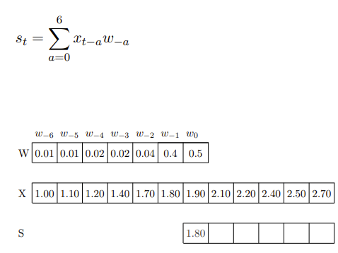

...

这里的输入（和内核）是一维的. 那么，我们也可以在二维输入上使用卷积操作吗？

我们可以将图像看作是二维输入. 现在我们想用一个二维滤波器（$m×n$）. 首先让我们看看二维卷积的公式是什么样子. 

$$
S_{ij} = (I * K)_{ij} = \sum_{a = 0}^{m - 1} \sum_{b = 0}^{n - 1} I_{i - a, j - b} K_{a, b} I_{i + a, j + b} K_{a, b}
$$

例子：

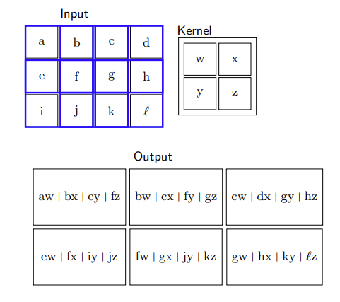

在接下来的讨论中，我们将使用下面这个卷积公式：

$$
S_{ij} = (I * K)_{ij} = \sum_{a=\left\lfloor -\frac{m}{2} \right\rfloor}^{\left\lfloor \frac{m}{2} \right\rfloor} \sum_{b=\left\lfloor -\frac{n}{2} \right\rfloor}^{\left\lfloor \frac{n}{2} \right\rfloor} I_{i - a, j - b} K_{\frac{m}{2}+a,\frac{n}{2}+b}
$$ 

换句话说，我们假设内核以感兴趣的像素为中心. 这样我们就会同时考虑前面和后面的相邻像素. 

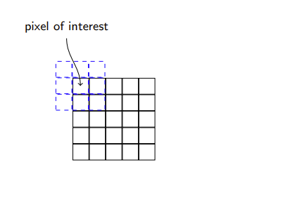

- 第一个公式： $S_{ij} = (I * K)_{ij} = \sum_{a = 0}^{m - 1} \sum_{b = 0}^{n - 1} I_{i - a, j - b} K_{a, b} I_{i + a, j + b} K_{a, b}$  ，求和范围是从  $a = 0$  到  $m - 1$  、  $b = 0$  到  $n - 1$  ，它只考虑了滤波器（内核）  $K$  中从起始位置开始的元素 ，是基于一种从图像左上角开始以滤波器大小为窗口逐步滑动计算的思路 ，没有考虑滤波器元素关于中心对称等情况. 
- 第二个公式： $S_{ij} = (I * K)_{ij} = \sum_{a=\left\lfloor -\frac{m}{2} \right\rfloor}^{\left\lfloor \frac{m}{2} \right\rfloor} \sum_{b=\left\lfloor -\frac{n}{2} \right\rfloor}^{\left\lfloor \frac{n}{2} \right\rfloor} I_{i - a, j - b} K_{\frac{m}{2}+a,\frac{n}{2}+b}$  ，求和范围是以滤波器中心为基准 ，  $a$  和  $b$  的取值范围关于0对称. 这种方式假设滤波器以感兴趣的像素为中心，同时考虑了像素周围前后的相邻像素 ，更符合将滤波器中心放置在目标像素上进行卷积计算的思想. 

让我们看一些对图像应用二维卷积的例子：
- 用全为1的滤波器卷积会模糊图像. 

- 用 $ \begin{bmatrix}0 & -1 & 0 \\ -1 & 5 & -1 \\ 0 & -1 & 0\end{bmatrix} $ 这个滤波器卷积会锐化图像. 

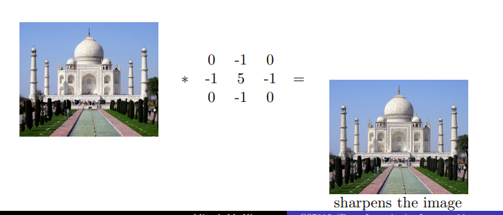

- 用 $ \begin{bmatrix}1 & 1 & 1 \\ 1 & -8 & 1 \\ 1 & 1 & 1\end{bmatrix} $ 这个滤波器卷积会检测边缘. 

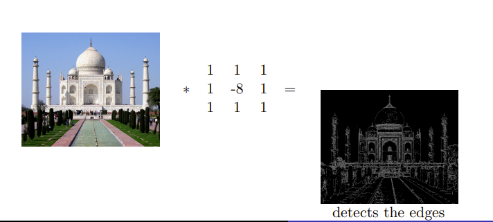

我们只需将内核在输入图像上滑动. 每次滑动内核，我们都会在输出中得到一个值. 得到的输出被称为特征图. 我们可以使用多个滤波器来获得多个特征图. 

问题：在一维情况下，我们在一维输入上滑动一维滤波器；在二维情况下，我们在二维输出上滑动二维滤波器. 那么在三维情况下会发生什么呢？

三维滤波器会是什么样子？它将是三维的，我们将其称为体（volume）. 同样，我们将这个体在三维输入上滑动并计算卷积操作. 需要注意的是，在本讲中，我们假设滤波器总是延伸到图像的深度. 实际上，我们是在三维输入上进行二维卷积操作（因为滤波器沿着高度和宽度移动，但不沿着深度移动）. 因此，输出将是二维的（只有宽度和高度，没有深度）. 同样，我们可以应用多个滤波器来获得多个特征图. 

## 2 输入大小、输出大小和滤波器大小之间的关系

到目前为止，我们还没有明确说明输入、滤波器、输出的维度以及它们之间的关系. 我们将了解它们是如何关联的，但在此之前，我们先定义一些量：

- 原始输入的宽度（$W_1$）、高度（$H_1$）和深度（$D_1$）. 
- 步长S（我们稍后会详细介绍）. 
- 滤波器的数量K. 
- 每个滤波器的空间范围（$F$）（每个滤波器的深度与每个输入的深度相同）. 
- 输出是 $W_2×H_2×D_2$ （我们很快会看到计算 $W_2$、$H_2$ 和 $D_2$ 的公式）. 

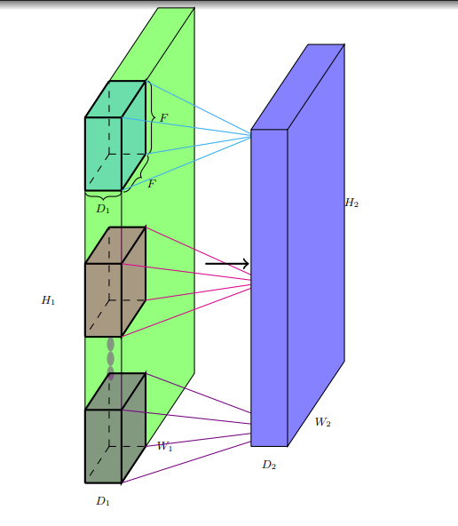

让我们计算输出的维度（$W_2$, $H_2$）. 注意，我们不能将内核放置在角落，因为这样会超出输入边界. 对于所有阴影点都是如此（内核超出输入边界）. 这导致输出的维度比输入小. 一般来说，$W_2 = W_1 - F + 1$ ，$H_2 = H_1 - F + 1$. 我们将进一步完善这个公式. 

如果我们希望输出与输入大小相同呢？我们可以使用一种称为填充的方法. 用适当数量的0输入对输入进行填充，这样就可以在内核放置在角落时应用它. 例如，对于一个3×3的内核，我们使用填充 $P = 1$ ，这意味着我们在顶部、底部、左侧和右侧各添加一行和一列0输入. 

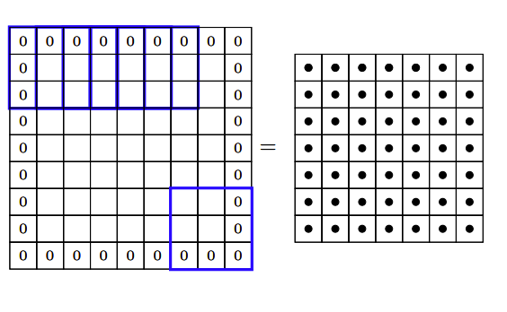

这样我们有，$W_2 = W_1 - F + 2P+ 1$ ，$H_2 = H_1 - F + 2P+ 1$. 我们将进一步完善这个公式. 

步长S有什么作用呢？它定义了应用滤波器的间隔（这里 $S = 2$ ）. 这里，我们实际上是每隔一个像素进行一次操作，这又会导致输出的维度变小. 

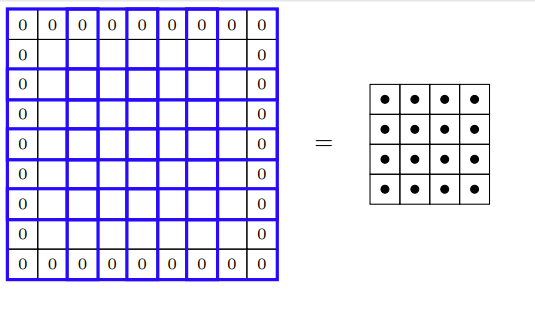

那么我们最终的公式应该是什么样的呢？$W_2=\frac{W_1 - F + 2P}{S}+1$ ，$H_2=\frac{H_1 - F + 2P}{S}+1$. 

最后，关于输出的深度. 每个滤波器给我们一个二维输出. $K$ 个滤波器将给我们 $K$ 个这样的二维输出. 我们可以将得到的输出看作是 $K×W_2×H_2$ 的体. 因此，$D_2 = K$. 

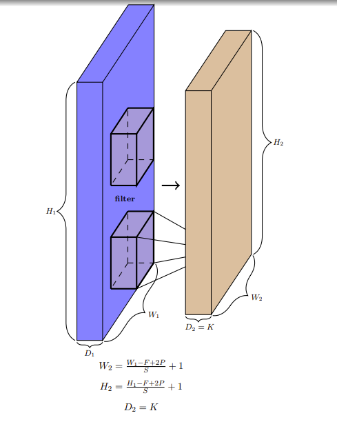

让我们做一些练习：

- 对于输入大小为227×227×3，有96个滤波器，步长为4，填充为0，计算可得 $H_2 = 55 = \frac{227 - 11}{4}+1$ ，$W_2 = 55 = \frac{227 - 11}{4}+1$ ，$D_2 = 96$. 

    

- 对于输入大小为32×32×5，有6个滤波器，步长为1，填充为0，计算可得 $H_2 = 28 = \frac{32 - 5}{1}+1$ ，$W_2 = 28 = \frac{32 - 5}{1}+1$ ，$D_2 = 6$. 

    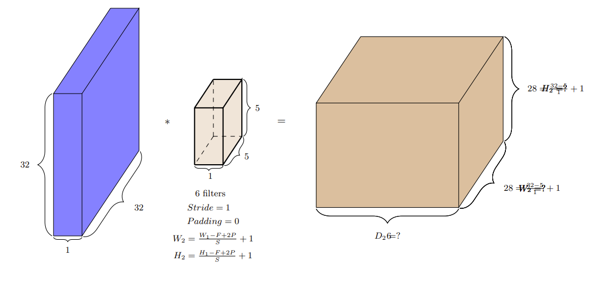

## 3 卷积神经网络

把这些内容联系起来看，卷积操作和神经网络之间有什么联系呢？我们通过考虑“图像分类”任务来理解这一点. 

在图像分类中，传统的方法是使用手工制作的特征，如边缘检测器、SIFT/HOG等进行静态特征提取（没有学习过程），然后学习分类器的权重. 

而现在我们思考，除了学习分类器的权重，能否学习有意义的内核/滤波器，而不是使用手工制作的内核（如边缘检测器）呢？甚至更进一步，能否学习多层有意义的内核/滤波器，同时学习分类器的权重呢？答案是肯定的！我们只需将这些内核视为参数，并使用反向传播与分类器的权重一起学习. 这样的网络就称为卷积神经网络. 

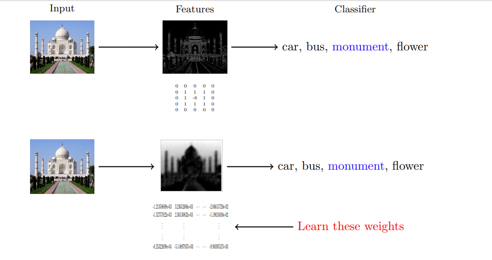

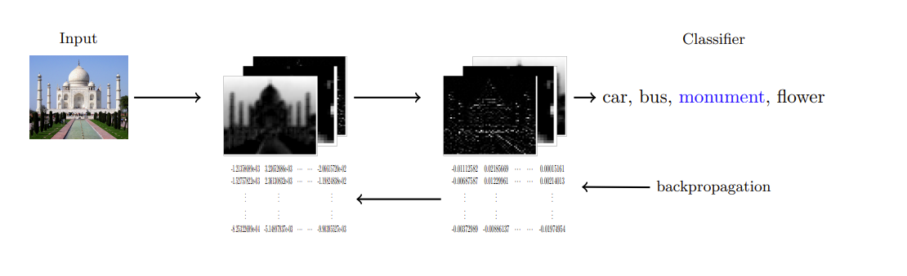

那么，这与常规的前馈神经网络有什么不同呢？这是一个常规前馈神经网络的样子，其中有很多密集连接. 例如，所有16个输入神经元都参与 $h_{11}$ 的计算. 

相比之下，在卷积的情况下，只有少数局部神经元参与 $h_{11}$ 的计算. 例如，只有像素1、2、5、6参与 $h_{11}$ 的计算. 连接要稀疏得多，我们利用了图像的结构（相邻像素之间的相互作用更有意义）. 这种稀疏连接减少了模型中的参数数量. 

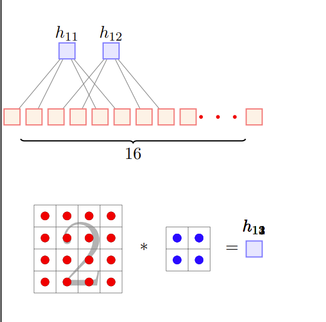

但是稀疏连接真的是一件好事吗？我们难道不会因为失去一些输入像素之间的相互作用而丢失信息吗？实际上并非如此. 例如，在第一层中两个突出显示的神经元（$x_1$ 和 $x_5$）没有直接相互作用，但它们间接对 $g_3$ 的计算有贡献，因此存在间接相互作用. 

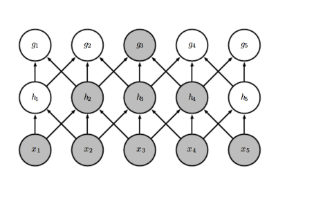

卷积神经网络的另一个特点是权重共享. 考虑一个网络，我们是否希望图像不同部分的内核权重不同呢？假设我们试图学习一个检测边缘的内核，难道不应该在图像的所有部分应用相同的内核吗？换句话说，橙色和粉色的内核难道不应该相同吗？是的，确实应该相同. 这会使学习更容易（而不是在不同位置反复学习相同的权重/内核）. 但这并不意味着我们只能有一个内核. 我们可以有很多这样的内核，并且这些内核会在图像的所有位置共享，这就是“权重共享”. 

到目前为止，我们只关注了卷积操作. 让我们看看一个完整的卷积神经网络是什么样子. 

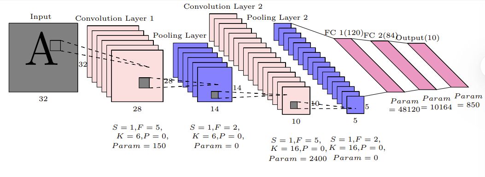

卷积神经网络有交替的卷积层和池化层. 那么池化层的作用是什么呢？

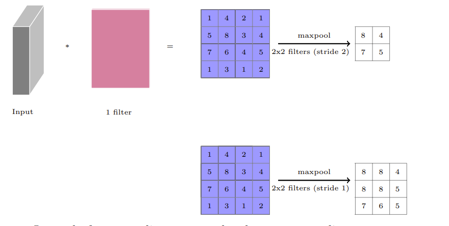

除了最大池化，我们也可以进行平均池化. 

那么如何训练一个卷积神经网络呢？我们可以将卷积神经网络看作是一个具有稀疏连接的前馈神经网络，并使用反向传播来训练它. 其中只有少数权值（用颜色表示）是激活的，其余的权值（用灰色表示）为零

## 4 卷积神经网络在ImageNet上的成功案例

ImageNet成功案例
包括AlexNet、ZFNet、VGGNet等. 

### AlexNet

总参数：2755万. 

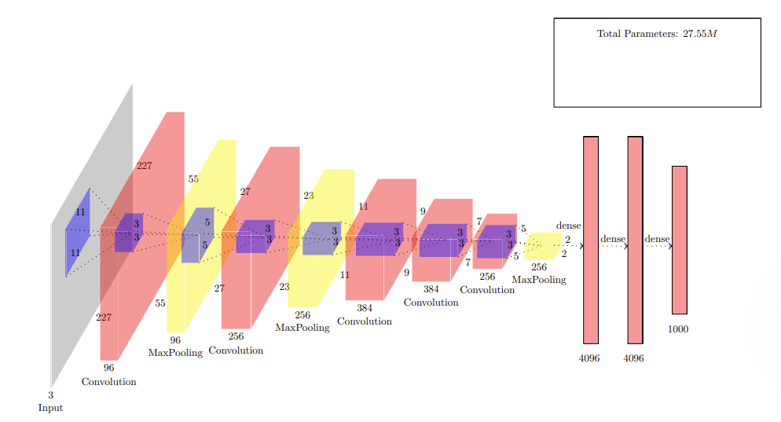

让我们更详细地看看全连接层中的连接. 我们首先将最后一个卷积层或最大池化层拉伸成一维向量. 然后这个一维向量像在常规前馈神经网络中一样与其他层密集连接.

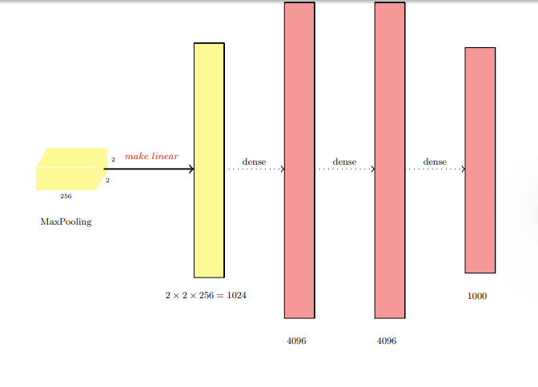

### ZFNet

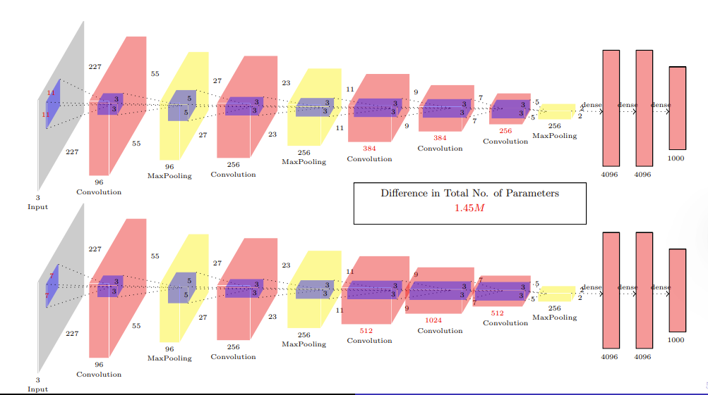

### VGGNet

内核大小始终为3×3. 非全连接层的总参数约为1600万，全连接层的总参数 $=(512×7×7×4096)+(4096×4096)+(4096×1024)\approx12.2$ 亿，大部分参数在第一个全连接层（约10.2亿）. 

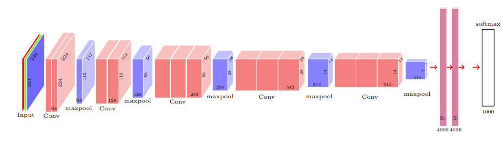

## 5 图像分类（续）（GoogLeNet和ResNet）

考虑卷积神经网络某一层的输出. 在这一层之后，我们可以应用最大池化层、1×1卷积层、3×3卷积层或5×5卷积层. 问题是，为什么要在这些选项（卷积、最大池化、滤波器大小）中选择呢？一种想法是，为什么不同时应用所有这些操作，然后连接特征图呢？

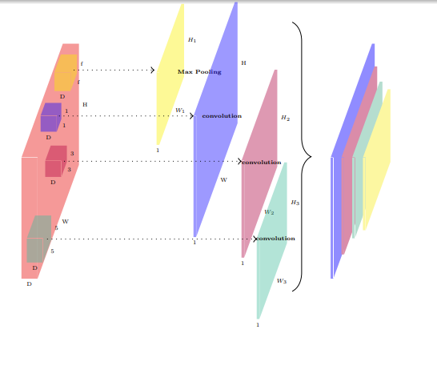

但是这个简单的想法可能会导致大量的计算. 如果 $P = 0$ 且 $S = 1$ ，用一个 $F×F×D$ 的滤波器对一个 $W×H×D$ 的输入进行卷积，会得到一个 $(W - F + 1)(H - F + 1)$ 大小的输出. 输出的每个元素需要 $O(F×F×D)$ 的计算量. 我们能减少计算量吗？

可以，通过使用1×1卷积. 1×1卷积可以沿着深度方向进行聚合. 用 $D_1$ 个1×1（$D_1 < D$）的滤波器对一个 $D×W×H$ 的输入进行卷积，会得到一个 $D_1×W×H$ 的输出（$S = 1$，$P = 0$）. 如果 $D_1 < D$ ，这实际上减少了输入的维度，从而减少了计算量. 具体来说，我们不再需要 $O(F×F×D)$ 的计算量，而是只需要 $O(F×F×D_1)$ 的计算量. 然后我们可以在这个减少维度后的输出上应用后续的3×3、5×5滤波器. 

但是我们可能希望在3×3和5×5滤波器之前使用不同的维度减少策略. 所以我们可以在3×3和5×5滤波器之前分别使用 $D_1$ 和 $D_2$ 个1×1滤波器. 然后我们添加最大池化层，接着进行维度减少，再加上一组新的1×1卷积. 最后我们连接所有这些层，这就是Inception模块. 我们现在来看包含许多这样Inception模块的GoogLeNet. 

GoogLeNet的一个重要技巧是去掉了全连接层. 注意到最后一层的输出是7×7×1024维的. 如果我们在上面添加一个有1000个节点（对应1000个类别）的全连接层，我们将有 $7×7×1024×1000 = 4900$ 万个参数. 相反，他们对1024个特征图中的每一个都使用7×7的平均池化，这会得到一个1024维的输出，显著减少了参数数量. 

假设我们已经能够很好地训练一个浅层神经网络. 现在假设我们构建一个更深的网络，增加了一些层（橙色部分）. 直观地说，如果浅层网络效果很好，那么深层网络应该也能通过在新层中学习恒等函数而表现良好. 本质上，浅层神经网络的解空间是深层神经网络解空间的一个子集. 

但在实践中发现并非如此. 注意到深层网络在测试集上有更高的错误率. 

考虑卷积神经网络中任意两个堆叠的层. 这两层本质上是在学习输入的某个函数. 如果我们让它们只学习输入的残差函数会怎么样呢？即 $H(x)=F(x)+x$ . 为什么这会有帮助呢？还记得我们之前说过，深层网络可以通过在新层中学习恒等变换来表现良好，这个从输入到输出的恒等连接允许ResNet保留输入的一个副本. 利用这个想法，他们能够训练非常深的网络. 

ResNet有152层，在所有五个主要任务中都获得了第一名：

- ImageNet分类：“超深”152层网络. 
- ImageNet检测：比第二好的系统好16%. 
- ImageNet定位：比第二好的系统好27%. 
- COCO检测：比第二好的系统好11%. 
- COCO分割：比第二好的系统好12%. 

### 一些技巧

- 在卷积层之后进行批量归一化. 
- 采用[He等人]提出的Xavier/2初始化方法. 
- 使用随机梯度下降（SGD）+动量（0.9）. 
- 学习率：0.1，当验证误差趋于平稳时除以10. 
- 小批量大小为256. 
- 权重衰减为 $1e - 5$. 
- 不使用随机失活（dropout）.  