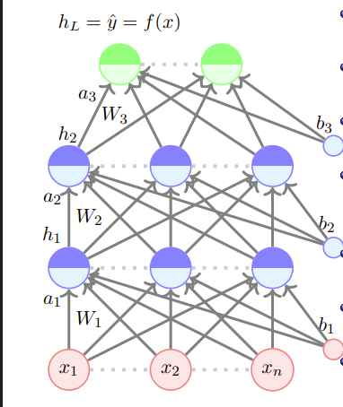
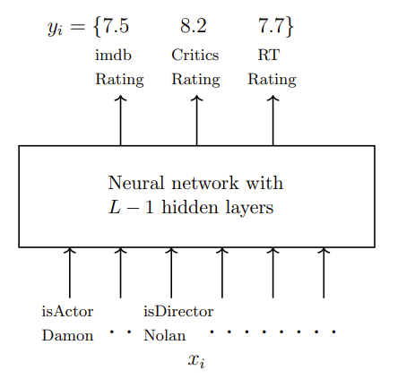
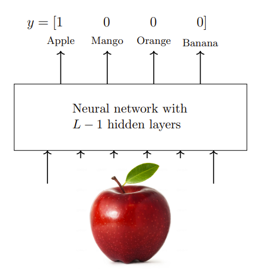
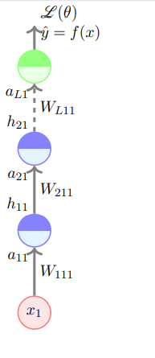

# 前馈神经网络

## Reference

- https://www.cse.iitm.ac.in/~miteshk/CS7015/Slides/Handout/Lecture4.pdf

## 1 前馈神经网络（又名神经元多层网络）

- 网络的输入是一个 $n$ 维向量. 

- 网络包含 $L - 1$ 个隐藏层（在此例中为2个），每个隐藏层有 $n$ 个神经元. 最后，有一个输出层，包含 $k$ 个神经元（比如，对应 $k$ 个类别）. 

- 隐藏层和输出层中的每个神经元都可以分为两部分：激活前和激活后（$a_{i}$ 和 $h_{i}$ 是向量）. 

- 输入层可称为第0层，输出层可称为第$L$层. 
- $W_{i} \in \mathbb{R}^{n ×n}$ 和 $b_{i} \in \mathbb{R}^{n}$ 是第 $i - 1$ 层和第 $i$ 层之间的权重和偏置（$0 < i < L$）. $W_{L} \in \mathbb{R}^{n ×k}$和 $b_{L} \in \mathbb{R}^{k}$ 是最后一个隐藏层和输出层之间的权重和偏置（在此例中$L = 3$）. 

### 前馈神经网络计算过程

第 $i$ 层的激活前值为：

$$
a_{i}(x)=b_{i}+W_{i} h_{i-1}(x)
$$

第 $i$ 层的激活值为：

$$
h_{i}(x)=g\left(a_{i}(x)\right)
$$

其中 $g$ 被称为激活函数（例如，逻辑函数、tanh函数、线性函数等）. 

输出层的激活值为：

$$
f(x)=h_{L}(x)=O\left(a_{L}(x)\right)
$$

其中 $O$ 是输出激活函数（例如，softmax函数、线性函数等）. 

为简化符号，我们将$a_{i}(x)$简记为$a_{i}$，将$h_{i}(x)$简记为$h_{i}$. 

### 前馈神经网络的模型构成

数据： $\{x_{i}, y_{i}\}_{i = 1}^{N}$ 

模型：

$$
\hat{y}_{i}=f\left(x_{i}\right)=O\left(W_{3} g\left(W_{2} g\left(W_{1} x+b_{1}\right)+b_{2}\right)+b_{3}\right)
$$

参数：

$$
\theta = W_{1}, \cdots, W_{L}, b_{1}, b_{2}, \cdots, b_{L}(L = 3)
$$

算法：带有反向传播的梯度下降法（我们很快会讲到）

目标/损失/误差函数：例如，

$$
min \frac{1}{N} \sum_{i=1}^{N} \sum_{j=1}^{k}\left(\hat{y}_{i j}-y_{i j}\right)^{2}
$$

一般来说，是 $min \mathscr{L}(\theta)$，其中 $\mathscr{L}(\theta)$ 是参数的某个函数. 

## 2 学习前馈神经网络的参数（直觉）

到目前为止，我们已经介绍了前馈神经网络. 

现在我们想找到一种学习该模型参数的算法. 
### 回顾梯度下降算法
**算法1：梯度下降**
- $t \leftarrow 0$;
- $\text{maxIterations} \leftarrow 1000$;
- $\text{while } t < \text{maxIterations } \text{do}$
    - $w_{t+1}\leftarrow w_{t}-\eta \nabla w_{t}$; 
    - $b_{t+1}\leftarrow b_{t}-\eta \nabla b_{t}$ 
    - $t \leftarrow t + 1$;
- $\text{end}$

### 前馈神经网络中的梯度下降
我们可以更简洁地将其写为：
**算法1：梯度下降**
- $t \leftarrow 0$;
- $\text{maxIterations} \leftarrow 1000$;
- $\text{Initialize } \theta_0 = [w_0, b_0]$;
- $\text{while } t < \text{maxIterations } \text{do}$
    - $\theta_{t+1}\leftarrow \theta_{t}-\eta \nabla \theta_{t}$; 
    - $t \leftarrow t + 1$;
- $\text{end}$

其中 $\nabla \theta_{t}=[\frac{\partial \mathscr{L}(\theta)}{\partial w_{t}}, \frac{\partial \mathscr{L}(\theta)}{\partial b_{t}}]^{T}$ . 

在这个前馈神经网络中，我们的 $\theta$ 不是 $[w, b]$ ，而是 $[W_{1}, W_{2}, \cdots, W_{L}, b_{1}, b_{2}, \cdots, b_{L}]$ . 

我们仍然可以使用相同的算法来学习模型的参数. 

### 前馈神经网络中梯度计算的挑战

不过，现在我们的 $\nabla \theta$ 看起来要复杂得多：
$\nabla \theta$ 由  $\nabla W_{1}, \nabla W_{2}, \cdots \nabla W_{L - 1} \in \mathbb{R}^{n × n}, \nabla W_{L} \in \mathbb{R}^{n × k}, \nabla b_{1}, \nabla b_{2}, \cdots, \nabla b_{L - 1} \in \mathbb{R}^{n}$ 和 $\nabla b_{L} \in \mathbb{R}^{k}$ 组成. 

我们需要回答两个问题：
1. 如何选择损失函数 $\mathscr{L}(\theta)$ ？
2. 如何计算由 $\nabla W_{1}, \nabla W_{2}, \cdots, \nabla W_{L - 1} \in \mathbb{R}^{n × n}, \nabla W_{L} \in \mathbb{R}^{n × k}, \nabla b_{1}, \nabla b_{2}, \cdots, \nabla b_{L - 1} \in \mathbb{R}^{n}$ 和 $\nabla b_{L} \in \mathbb{R}^{k}$ 组成的 $\nabla \theta$ ？

## 3 输出函数和损失函数

我们需要回答两个问题：
1. 如何选择损失函数 $\mathscr{L}(\theta)$ ？
2. 如何计算由 $\nabla W_{1}, \nabla W_{2}, \cdots, \nabla W_{L - 1} \in \mathbb{R}^{n × n}, \nabla W_{L} \in \mathbb{R}^{n × k}, \nabla b_{1}, \nabla b_{2}, \cdots, \nabla b_{L - 1} \in \mathbb{R}^{n}$ 和 $\nabla b_{L} \in \mathbb{R}^{k}$ 组成的 $\nabla \theta$ ？

### 损失函数的选择
损失函数的选择取决于手头的问题. 

我们通过两个例子来说明这一点. 

再次考虑电影评分预测的例子，但这次我们关注预测评分. 

这里 $y_{i} \in \mathbb{R}^{3}$ . 

损失函数应该衡量 $\hat{y}_{i}$ 与 $y_{i}$ 的偏差程度. 

如果 $y_{i} \in \mathbb{R}^{n}$ ，那么均方误差损失：

$$
\mathscr{L}(\theta)=\frac{1}{N} \sum_{i=1}^{N} \sum_{j=1}^{3}\left(\hat{y}_{i j}-y_{i j}\right)^{2}
$$

可以衡量这种偏差. 
### 输出函数的选择
一个相关的问题是：如果 $y_{i} \in \mathbb{R}$ ，输出函数“ $O$ ”应该是什么？

更具体地说，它可以是逻辑函数吗？

不可以，因为逻辑函数将 $\hat{y}_{i}$ 限制在0到1之间，而我们希望 $\hat{y}_{i} \in \mathbb{R}$ . 

所以，在这种情况下，将“ $O$ ”设为线性函数更合理：

$$
f(x)=h_{L}=O\left(a_{L}\right)=W_{O} a_{L}+b_{O}
$$

此时 $\hat{y}_{i}=f(x_{i})$ 不再局限于0到1之间. 

### 分类问题中的损失函数和输出函数
现在考虑分类问题，对于这个问题，不同的损失函数可能更合适. 

假设我们要将一张图像分类为$k$个类别之一. 

同样，我们可以使用均方误差损失来衡量偏差，但你能想到更好的函数吗？

注意到$y$是一个概率分布，因此我们也应该确保 $\hat{y}$ 是一个概率分布. 

选择什么输出激活函数“ $O$ ”能确保这一点呢？

$$
a_{L}=W_{L} h_{L - 1}+b_{L}\\
\hat{y}_{j}=O\left(a_{L}\right)_{j}=\frac{e^{a_{L, j}}}{\sum_{i = 1}^{k}e^{a_{L, i}}}
$$

$O(a_{L})_{j}$ 是 $\hat{y}$ 的第 $j$ 个元素， $a_{L, j}$ 是向量 $a_{L}$ 的第 $j$ 个元素. 这个函数被称为softmax函数. 

现在我们确保了$y$和 $\hat{y}$ 都是概率分布，能想到一个函数来衡量它们之间的差异吗？

交叉熵：

$$
\mathscr{L}(\theta)=-\sum_{c = 1}^{k}y_{c}\log\hat{y}_{c}
$$

注意到：

$$
y_{c}=
\begin{cases}
1, & \text{如果} c = \ell \text{（真实类别标签）}\\
0, & \text{否则}
\end{cases}
$$

所以 $\mathscr{L}(\theta)=-\log\hat{y}_{\ell}$ . 

### 分类问题的目标函数

对于分类问题（从$k$个类别中选择一个），我们使用以下目标函数：

$$
\underset{\theta}{\min}\  \mathscr{L}(\theta)=-\log\hat{y}_{\ell}
$$

或者

$$
\underset{\theta}{\max}\ -\mathscr{L}(\theta)=\log\hat{y}_{\ell}
$$

但是等等！ $\hat{y}_{\ell}$ 是 $\theta=[W_{1}, W_{2}, \cdots, W_{L}, b_{1}, b_{2}, \cdots, b_{L}]$ 的函数吗？

$$
\hat{y}_{\ell}=\left[O\left(W_{3} g\left(W_{2} g\left(W_{1} x+b_{1}\right)+b_{2}\right)+b_{3}\right)\right]_{\ell}
$$

是的，它确实是 $\theta$ 的函数. 

$\hat{y}_{\ell}$ 编码了什么呢？它是$x$属于第 $\ell$ 类的概率（让它尽可能接近1）. 

$\log\hat{y}_{\ell}$ 被称为数据的对数似然. 

### 不同场景下的输出激活函数和损失函数
|输出类型|实数值|概率值|
|--|--|--|
|输出激活函数|线性函数|softmax函数|
|损失函数|均方误差|交叉熵|

当然，根据具体问题可能还有其他损失函数，但我们刚刚看到的这两种损失函数非常常见. 

在本讲的剩余部分，我们将重点关注输出激活函数为softmax函数且损失函数为交叉熵的情况. 

## 4 反向传播（直觉）

现在我们来看如何计算由 $\nabla W_{1}, \nabla W_{2}, \cdots, \nabla W_{L - 1} \in \mathbb{R}^{n × n}, \nabla W_{L} \in \mathbb{R}^{n × k}, \nabla b_{1}, \nabla b_{2}, \cdots, \nabla b_{L - 1} \in \mathbb{R}^{n}$ 和 $\nabla b_{L} \in \mathbb{R}^{k}$ 组成的 $\nabla \theta$ ？

### 反向传播的直观理解
让我们关注这个权重 $(W_{111})$ . 

为了使用随机梯度下降（SGD）学习这个权重，我们需要 $\frac{\partial \mathscr{L}(\theta)}{\partial W_{111}}$ 的公式. 我们来看看如何计算它. 

首先考虑一个简单的情况，即网络很深但很窄. 在这种情况下，通过链式法则很容易找到导数：

$$
\frac{\partial \mathscr{L}(\theta)}{\partial W_{111}}=\frac{\partial \mathscr{L}(\theta)}{\partial \hat{y}} \frac{\partial \hat{y}}{\partial a_{L 11}} \frac{\partial a_{L 11}}{\partial h_{21}} \frac{\partial h_{21}}{\partial a_{21}} \frac{\partial a_{21}}{\partial h_{11}} \frac{\partial h_{11}}{\partial a_{11}} \frac{\partial a_{11}}{\partial W_{111}}
$$

也可以简写成 $\frac{\partial \mathscr{L}(\theta)}{\partial W_{111}}=\frac{\partial \mathscr{L}(\theta)}{\partial h_{11}} \frac{\partial h_{11}}{\partial W_{111}}$  . 类似地， $\frac{\partial \mathscr{L}(\theta)}{\partial W_{211}}=\frac{\partial \mathscr{L}(\theta)}{\partial h_{21}} \frac{\partial h_{21}}{\partial W_{211}}$ ， $\frac{\partial \mathscr{L}(\theta)}{\partial W_{L 11}}=\frac{\partial \mathscr{L}(\theta)}{\partial a_{L 1}} \frac{\partial a_{L 1}}{\partial W_{L 11}}$ . 

在深入研究数学细节之前，让我们先直观地解释一下反向传播. 

我们在输出端得到一定的损失，然后试图找出谁应该为这个损失负责. 

所以，我们对输出层说：“嘿！你没有产生期望的输出，最好承担起责任. ”

输出层回应：“嗯，我为我的部分负责，但请理解，我的表现取决于下面的隐藏层和权重. ”毕竟……

$$
f(x)=\hat{y}=O\left(W_{L} h_{L - 1}+b_{L}\right)
$$

于是，我们与 $W_{L}$ 、 $b_{L}$ 和 $h_{L}$ 交流，问它们：“你们怎么回事？”

$W_{L}$ 和 $b_{L}$ 承担全部责任，但 $h_{L}$ 说：“请理解，我只取决于激活前层. ”

激活前层又说，它只取决于下面的隐藏层和权重. 

我们以这种方式继续，意识到责任在于所有的权重和偏置（即模型的所有参数）. 

但与其直接与它们交流，通过隐藏层和输出层与它们交流更容易（这正是链式法则允许我们做的）. 

$$
\underbrace{\frac{\partial \mathscr{L}(\theta)}{\partial W_{111}}}_{\text{Talk to the
weight directly}}=
\underbrace{\frac{\partial \mathscr{L}(\theta)}{\partial \hat{y}} \frac{\partial \hat{y}}{\partial a_{L 11}}}_{\text{Talk to 
\\ the output layer}} \underbrace{\frac{\partial a_{L 11}}{\partial h_{21}} \frac{\partial h_{21}}{\partial a_{21}}}_{\text{Talk to the
previous hidden layer}} \underbrace{\frac{\partial a_{21}}{\partial h_{11}} \frac{\partial h_{11}}{\partial a_{11}}}_{\text{Talk to the previous hidden layer}} \underbrace{\frac{\partial a_{11}}{\partial W_{111}}}_{\text{and now talk to the weights}}
$$

### 反向传播中的关键量
我们关注的量（后续内容的路线图）：
1. 关于输出单元的梯度 $\frac{\partial \mathscr{L}(\theta)}{\partial \hat{y}} \frac{\partial \hat{y}}{\partial a_{L 11}}$
2. 关于隐藏单元的梯度 $\frac{\partial a_{L 11}}{\partial h_{21}} \frac{\partial h_{21}}{\partial a_{21}}\frac{\partial a_{21}}{\partial h_{11}} \frac{\partial h_{11}}{\partial a_{11}}$
3. 关于权重和偏置的梯度 $\frac{\partial a_{11}}{\partial W_{111}}$

我们的重点是交叉熵损失和softmax输出. 
## 5 反向传播：计算关于输出单元的梯度

### 关于输出单元的梯度计算
首先考虑关于第 $i$ 个输出的偏导数：

$$
\mathscr{L}(\theta)=-\log\hat{y}_{\ell} \quad (\ell = \text{真实类别标签})
$$

$$
\frac{\partial}{\partial \hat{y}_{i}}(\mathscr{L}(\theta))=
\begin{cases}
-\frac{1}{\hat{y}_{\ell}}, & \text{如果} i = \ell\\
0, & \text{否则}
\end{cases}
$$

更紧凑地表示为：

$$
\frac{\partial}{\partial \hat{y}_{i}}(\mathscr{L}(\theta))=-\frac{\mathbb{1}_{(i=\ell)}}{\hat{y}_{\ell}}
$$

现在我们可以讨论关于向量 $\hat{y}$ 的梯度：

$$
\nabla_{\hat{y}} \mathscr{L}(\theta)=\begin{bmatrix}\frac{\partial \mathscr{L}(\theta)}{\partial \hat{y}_{1}}\\\vdots\\\frac{\partial \mathscr{L}(\theta)}{\partial \hat{y}_{k}}\end{bmatrix}=-\frac{1}{\hat{y}_{\ell}}\begin{bmatrix}\mathbb{1}_{\ell=1}\\\mathbb{1}_{\ell=2}\\\vdots\\\mathbb{1}_{\ell=k}\end{bmatrix}=-\frac{1}{\hat{y}_{\ell}} e_{\ell}
$$

其中 $e(\ell)$ 是一个$k$维向量，其第 $\ell$ 个元素为1，其他所有元素为0. 

### 关于激活前向量$a_{L}$的梯度计算

我们真正感兴趣的是：

$$
\frac{\partial \mathscr{L}(\theta)}{\partial a_{L i}}=\frac{\partial(-\log\hat{y}_{\ell})}{\partial a_{L i}}=\frac{\partial(-\log\hat{y}_{\ell})}{\partial \hat{y}_{\ell}} \frac{\partial \hat{y}_{\ell}}{\partial a_{L i}}
$$

$\hat{y}_{\ell}$ 依赖于 $a_{L i}$ 吗？确实依赖. 

$$
\hat{y}_{\ell}=\frac{\exp (a_{L \ell})}{\sum_{i}\exp (a_{L i})}
$$

确定这一点后，