# 多层感知机

## Reference

- https://www.cse.iitm.ac.in/~miteshk/CS7015/Slides/Handout/Lecture2.pdf

## 1 生物神经元

深度学习神经网络的最基本单元被称为人工神经元. 为什么它被称为神经元呢？其灵感来自哪里？灵感来源于生物学（更具体地说，来自大脑）. 生物神经元也叫神经细胞或神经处理单元. 我们先来看看生物神经元的样子. 

树突（dendrite）：接收来自其他神经元的信号；突触（synapse）：与其他神经元的连接点；胞体（soma）：处理信息；轴突（axon）：传输该神经元的输出. 

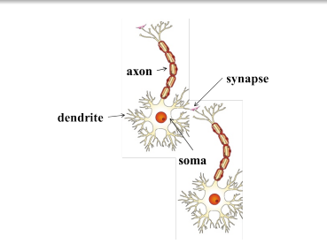

让我们看一个非常卡通化的神经元工作示意图. 我们的感觉器官与外界相互作用，它们将信息传递给神经元. 神经元可能会被激活并产生反应（在这个例子中是笑声）. 

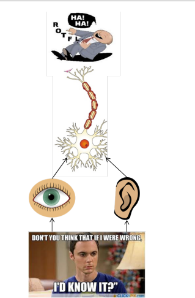

当然，在现实中，并非单个神经元完成所有这些工作. 存在一个大规模并行互联的神经元网络. 感觉器官将信息传递给最底层的神经元. 其中一些神经元可能会因这些信息而被激活（以红色显示），并依次将信息传递给与之相连的其他神经元. 这些神经元也可能被激活（同样以红色显示），这个过程持续进行，最终产生反应（在这个例子中是笑声）. 

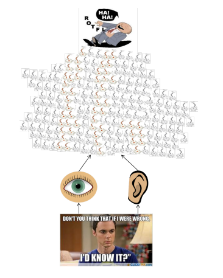

普通人脑大约有 $10^{11}$（1000亿）个神经元！这个大规模并行网络也确保了分工协作. 每个神经元可能执行特定的功能或对特定的刺激做出反应. 

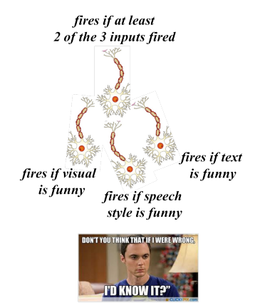

大脑中的神经元是分层排列的. 我们以处理视觉信息的视觉皮层（大脑的一部分）为例来说明这一点. 从视网膜开始，信息被传递到多个层次（沿着箭头方向）. 我们观察到，V1、V2到AIT这些层次形成了一个层级结构（从识别简单的视觉形状到高级物体）. 

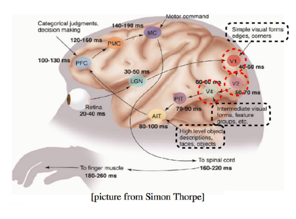

## 2 麦卡洛克 - 皮茨神经元

麦卡洛克（神经科学家）和皮茨（逻辑学家）在1943年提出了一种高度简化的神经元计算模型.

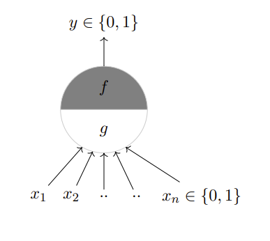

$g$ 函数对输入进行聚合，函数 $f$ 根据这种聚合做出决策. 输入可以是兴奋性的或抑制性的. 如果任何一个 $x_i$ 是抑制性的，则 $y = 0$ ，否则：

$$
g(x_1,x_2,\ldots,x_n)=g(x)=\sum_{i = 1}^{n}x_i\\
y = f(g(x)) = \begin{cases}
1, & \text{如果 } g(x) \geq \theta \\
0, & \text{如果 } g(x) < \theta
\end{cases}
$$

$\theta$ 被称为阈值参数，这被称为阈值逻辑. 

让我们使用这个麦卡洛克 - 皮茨（MP）神经元来实现一些布尔函数. 

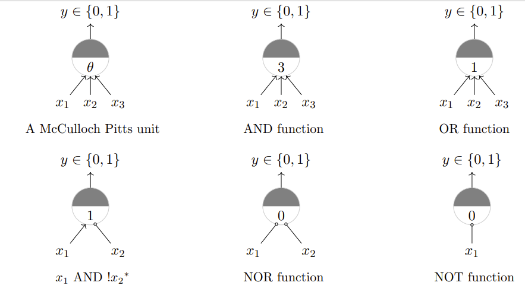

是否任何布尔函数都可以用一个麦卡洛克 - 皮茨单元来表示呢？在回答这个问题之前，让我们先看看MP单元的几何解释. 

对于一个或函数，一个单一的MP神经元将输入点分成两半：位于直线 $\sum_{i = 1}^{n}x_i - \theta = 0$ 上或上方的点，以及位于该直线下方的点. 换句话说，所有产生输出0的输入将位于直线的一侧（$\sum_{i = 1}^{n}x_i < \theta$ ），所有产生输出1的输入将位于直线的另一侧（$\sum_{i = 1}^{n}x_i \geq \theta$ ）. 

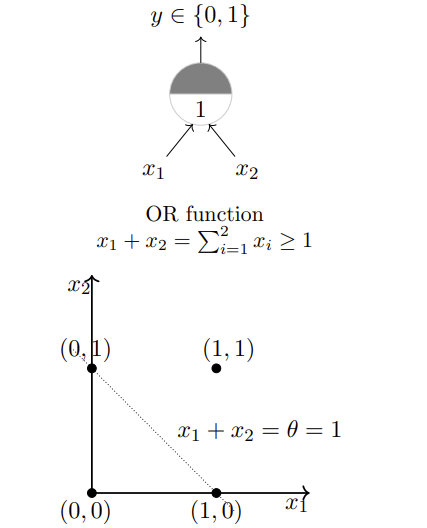

对于AND函数和Tautology函数，一个单一的MP神经元也是会将输入点分成两半：

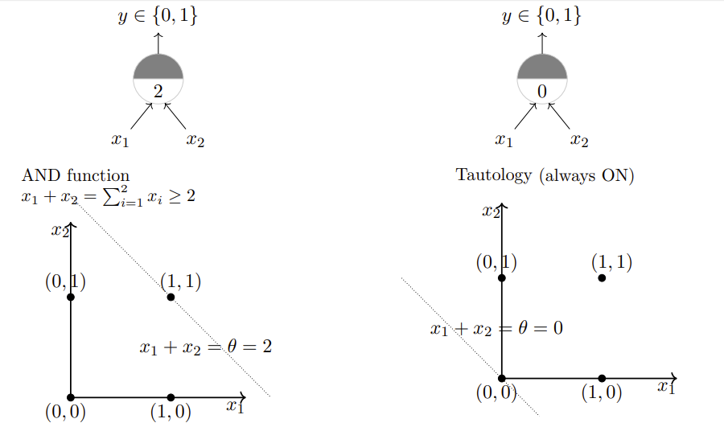

如果我们有超过2个输入会怎样呢？那么，我们面对的将不是一条线，而是一个平面. 对于或函数，我们希望有一个平面，使得点(0, 0, 0)位于一侧，其余7个点位于平面的另一侧. 

目前的结论是：一个单一的麦卡洛克 - 皮茨神经元可用于表示线性可分的布尔函数. 线性可分（对于布尔函数）：存在一条线（平面），使得所有产生1的输入位于线（平面）的一侧，所有产生0的输入位于线（平面）的另一侧. 

## 3 感知机

接下来的问题是：对于非布尔（比如实数）输入呢？我们总是需要手动编码阈值吗？所有输入都同等重要吗？如果我们想给某些输入赋予更大的权重（重要性）呢？对于非线性可分的函数又该怎么办呢？

美国心理学家弗兰克·罗森布拉特在1958年提出了经典的感知机模型. 这是一个比麦卡洛克 - 皮茨神经元更通用的计算模型. 主要区别在于：为输入引入了数值权重，并提供了学习这些权重的机制. 输入不再局限于布尔值. 明斯基和佩珀特在1969年对其进行了改进和深入分析，这里我们所说的感知机模型指的就是他们改进后的模型. 

感知机模型被广泛接受的一种表示形式为：
$$
y = \begin{cases}
1, & \text{如果 } \sum_{i = 0}^{n}w_i * x_i \geq 0 \\
0, & \text{如果 } \sum_{i = 0}^{n}w_i * x_i < 0
\end{cases}
$$
其中，$x_0 = 1$且$w_0 = -\theta$，$w_0$ 称为偏置项（bias），如果没有偏置项，感知机的决策边界将始终通过原点，这会极大限制模型的表示能力. 有了偏置，决策边界就可以是任意的超平面，能够适应更多复杂的分类情况. 
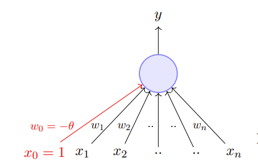
也可写为：
$$
y = \begin{cases}
1, & \text{如果 } \sum_{i = 1}^{n}w_i * x_i \geq \theta \\
0, & \text{如果 } \sum_{i = 1}^{n}w_i * x_i < \theta
\end{cases}
$$
进一步改写为：
$$
y = \begin{cases}
1, & \text{如果 } \sum_{i = 1}^{n}w_i * x_i - \theta \geq 0 \\
0, & \text{如果 } \sum_{i = 1}^{n}w_i * x_i - \theta < 0
\end{cases}
$$

单个感知机只能用于实现线性可分的函数，与感知机的区别是：感知机的权重（包括阈值）可以学习，并且输入可以是实数值.  

## 4 误差和误差曲面

让我们固定阈值（$-w_0 = 1$ ），尝试不同的$w_1$ 、$w_2$值. 比如，$w_1 = -1$ ，$w_2 = -1$ . 这条线有什么问题呢？ 让我们尝试更多的$w_1$ 、$w_2$值，并记录我们产生的错误分类数量. 

| $w_1$ | $w_2$ | 错误分类数量 |
| ---- | ---- | ---- |
| -1 | -1 | 1 |
| 1.5 | 0 | 1 |
| 0.45 | 0.45 | 3 |

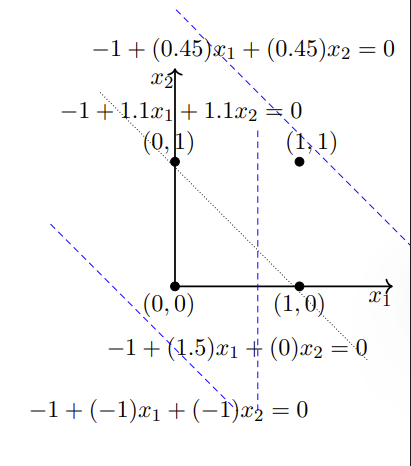

我们希望找到一种算法，能够找到使这种错误分类数量最小化的$w_1$ 、$w_2$值. 

## 5 感知机学习算法

我们现在将介绍一种更具原理性的学习这些权重和阈值的方法，但在此之前，让我们先回答这个问题……除了实现布尔函数（这看起来不是很有趣），感知机还能用于什么呢？我们感兴趣的是将感知机用作二元分类器. 让我们看看这是什么意思……

让我们重新考虑决定是否观看一部电影的问题. 假设我们得到了一份电影列表，并且每个电影都有一个标签（类别），表明用户是否喜欢这部电影，这是一个二元决策. 进一步假设我们用 $n$ 个特征（有些是布尔值，有些是实数值）来表示每部电影. 我们假设数据是线性可分的，并且希望感知机学习如何做出这个决策. 换句话说，我们希望感知机找到这个分离平面的方程（或者找到$w_0, w_1, w_2, \ldots, w_n$的值）. 

**算法1：感知机学习算法**

- $P$：标记为1的输入；
- $N$：标记为0的输入；
- 随机初始化$w$；
- 当未收敛时：
    - 从$P \cup N$中随机选择一个$x$；
    - 如果$x \in P$且$\sum_{i = 0}^{n}w_i * x_i < 0$ ，则$w = w + x$；
    - 如果$x \in N$且$\sum_{i = 0}^{n}w_i * x_i \geq 0$ ，则$w = w - x$；
- （当所有输入都被正确分类时，算法收敛）

为什么这个算法有效呢？为了理解其原理，我们需要涉及一些线性代数和几何知识. 

考虑两个向量$w$和$x$ ：
$$w = [w_0, w_1, w_2, \ldots, w_n]$$
$$x = [1, x_1, x_2, \ldots, x_n]$$
$$w \cdot x = w^T x = \sum_{i = 0}^{n}w_i * x_i$$
因此，我们可以将感知机规则重写为：
$$
y = \begin{cases}
1, & \text{如果 } w^T x \geq 0 \\
0, & \text{如果 } w^T x < 0
\end{cases}
$$

我们感兴趣的是找到将输入空间分成两半的直线 $w^T x = 0$ . 这条直线上的每个点$(x)$都满足方程 $w^T x = 0$ . 你能说出$w$与这条直线上的任何点$(x)$之间的夹角$(\alpha)$是多少吗？这个夹角是$90^{\circ}$（因为$\cos \alpha=\frac{w^T x}{\|w\|\|x\|}=0$ ）. 由于向量$w$垂直于直线上的每个点，所以它实际上垂直于这条直线本身. 

考虑位于这条直线正半空间的一些点（向量）（即 $w^T x \geq 0$ ）. 任何这样的向量与$w$之间的夹角会是多少呢？显然，小于 $90^{\circ}$. 那么位于这条直线负半空间的点（向量）（即$w^T x < 0$ ）呢？任何这样的向量与$w$之间的夹角会是多少呢？显然，大于90°. 当然，这也可以从公式$\cos \alpha=\frac{w^T x}{\|w\|\|x\|}$推导出来. 

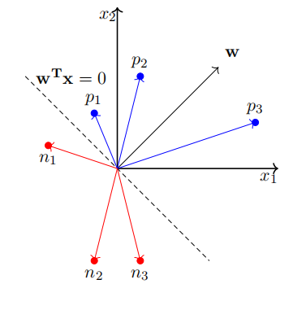

牢记这个概念，让我们重新审视这个算法. 

对于$x \in P$ ，如果$w \cdot x < 0$ ，这意味着这个$x$与当前$w$之间的夹角$(\alpha)$大于90°（但我们希望$\alpha$小于90° ）. 当$w_{new} = w + x$时，新的夹角$(\alpha_{new})$会怎样呢？

$$
\cos(\alpha_{new}) \propto w_{new}^T x \propto (w + x)^T x \propto w^T x + x^T x \propto \cos \alpha + x^T x\\
\cos(\alpha_{new}) > \cos \alpha
$$

因此，$\alpha_{new}$将小于$\alpha$ ，这正是我们想要的. 

对于$x \in N$ ，如果$w \cdot x \geq 0$ ，这意味着这个$x$与当前$w$之间的夹角$(\alpha)$小于90°（但我们希望$\alpha$大于90° ）. 当$w_{new} = w - x$时，新的夹角$(\alpha_{new})$会怎样呢？

$$
\cos(\alpha_{new}) \propto w_{new}^T x \propto (w - x)^T x \propto w^T x - x^T x \propto \cos \alpha - x^T x\\
\cos(\alpha_{new}) < \cos \alpha
$$

因此，$\alpha_{new}$将大于$\alpha$ ，这正是我们想要的. 

## 6 收敛性证明
既然我们对算法为何生效有了一些理解和直观认识，现在我们将给出一个更正式的收敛性证明.

**定义1**：在 $n$ 维空间中，两个点集 $P$ 和 $N$ 被称为绝对线性可分，当存在 $n + 1$ 个实数 $w_0, w_1, \ldots, w_n$，使得对于每个点 $(x_1, x_2, \ldots, x_n) \in P$ 都满足 $\sum_{i = 1}^{n}w_i * x_i > w_0$，并且对于每个点 $(x_1, x_2, \ldots, x_n) \in N$ 都满足 $\sum_{i = 1}^{n}w_i * x_i < w_0$. 

**命题1**：如果集合 $P$ 和 $N$ 是有限的且线性可分，那么感知机学习算法只会对权重向量 $w_t$ 进行有限次更新. 换句话说：如果对 $P$ 和 $N$ 中的向量依次进行循环测试，经过有限步 $t$ 后，就能找到一个权重向量 $w_t$，它可以将这两个集合分开. 

若$x \in N$，则$-x \in P$（因为$w^T x < 0 \Rightarrow w^T(-x) \geq 0$）. 因此，我们可以考虑一个单一集合$P' = P \cup N^-$，并确保对于$P'$中的每个元素$p$，都有$w^T p \geq 0$. 
进一步地，我们将所有$p$进行归一化处理，使得$\|p\| = 1$（注意，这不会影响结果，因为若$w^T \frac{p}{\|p\|} \geq 0$，则$w^T p \geq 0$ ）. 
设$w^*$为归一化后的解向量（由于数据是线性可分的，所以我们知道这样的向量存在）. 

算法1可以改写为：
**算法2：感知机学习算法**
- $P$：标记为1的输入；
- $N$：标记为0的输入；
- $N^-$：包含N中所有点的相反数；
- $P' = P \cup N^-$；
- 随机初始化$w$；
- 当未收敛时：
    - 从$P'$中随机选择一个$p$；
    - 将$p$归一化，即$p = \frac{p}{\|p\|}$（此时，$\|p\| = 1$）；
    - 若$w \cdot p < 0$，则$w = w + p$. 
- （当所有输入都被正确分类时，算法收敛. 注意，我们不需要另一个if条件，因为根据构造，我们希望$P'$中的所有点都位于$w \cdot p \geq 0$的正半空间）. 
 
**命题1证明**
1. 假设在时间步 $t$，我们检查点 $p_i$ 时发现 $w^T \cdot p_i \leq 0$. 
2. 我们进行修正 $w_{t + 1} = w_t + p_i$. 
3. 设$\beta$为$w^*$与$w_{t + 1}$之间的夹角，则有：
    - $\cos \beta = \frac{w^* \cdot w_{t + 1}}{\|w_{t + 1}\|}$
    - 分子部分：$w^* \cdot w_{t + 1} = w^* \cdot (w_t + p_i) = w^* \cdot w_t + w^* \cdot p_i \geq w^* \cdot w_t + \delta$（其中$\delta = \min\{w^* \cdot p_i | \forall i\}$）. 通过归纳法可得：$w^* \cdot w_t + \delta \geq w^* \cdot (w_{t - 1} + p_j) + \delta \geq w^* \cdot w_{t - 1} + w^* \cdot p_j + \delta \geq w^* \cdot w_{t - 1} + 2\delta \geq w^* \cdot w_0 + k\delta$ （$k\leq t+1$）. 
    - 分母部分：$\|w_{t + 1}\|^2 = (w_t + p_i) \cdot (w_t + p_i) = \|w_t\|^2 + 2w_t \cdot p_i + \|p_i\|^2$ . 由于$w_t \cdot p_i \leq 0$，所以$\|w_{t + 1}\|^2 \leq \|w_t\|^2 + \|p_i\|^2$ . 又因为$\|p_i\|^2 = 1$，所以$\|w_{t + 1}\|^2 \leq \|w_t\|^2 + 1 \leq (\|w_{t - 1}\|^2 + 1) + 1 \leq \|w_{t - 1}\|^2 + 2 \leq \|w_0\|^2 + k$ . 
4. 所以有：
    - $\cos \beta \geq \frac{w^* \cdot w_0 + k\delta}{\sqrt{\|w_0\|^2 + k}}$ . 
    - 因此，$\cos \beta$与$\sqrt{k}$成正比增长. 随着修正次数$k$的增加，$\cos \beta$可能会变得任意大. 但由于$\cos \beta \leq 1$，所以$k$必然有一个最大值. 
    - 因此，对$w$的修正次数$k$只能是有限的，算法将会收敛！

回到我们之前的问题……
- 对于非布尔（比如实数）输入呢？感知机允许实数值输入. 
- 我们总是需要手动设定阈值吗？不需要，我们可以学习阈值. 
- 所有输入都同等重要吗？如果我们想给某些输入赋予更大的权重（重要性）呢？感知机允许为输入分配权重. 
- 对于非线性可分的函数又该怎么办呢？单个感知机无法处理，但我们将看到如何解决这个问题……

## 7 线性可分的布尔函数
那么对于非线性可分的函数，我们该如何处理呢？我们先来看一个这样简单的布尔函数. 
| $x_1$ | $x_2$ | 异或（XOR） | $w_0+\sum_{i = 1}^{2}w_ix_i$相关条件 |
| ---- | ---- | ---- | ---- |
| 0 | 0 | 0 | $w_0+\sum_{i = 1}^{2}w_ix_i<0$ |
| 1 | 0 | 1 | $w_0+\sum_{i = 1}^{2}w_ix_i\geq0$ |
| 0 | 1 | 1 | $w_0+\sum_{i = 1}^{2}w_ix_i\geq0$ |
| 1 | 1 | 0 | $w_0+\sum_{i = 1}^{2}w_ix_i<0$ |

$w_0 + w_1 \cdot 0 + w_2 \cdot 0 < 0 \Rightarrow w_0 < 0$
$w_0 + w_1 \cdot 0 + w_2 \cdot 1 \geq 0 \Rightarrow w_2 \geq -w_0$
$w_0 + w_1 \cdot 1 + w_2 \cdot 0 \geq 0 \Rightarrow w_1 \geq -w_0$
$w_0 + w_1 \cdot 1 + w_2 \cdot 1 < 0 \Rightarrow w_1 + w_2 < -w_0$

第四个条件与第二和第三个条件相矛盾，因此这组不等式无解. 

实际上，你可以看到，不可能画出一条线将红色点和蓝色点分开. 

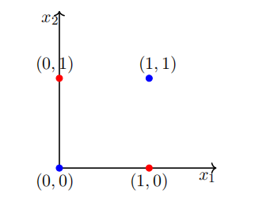

现实世界中的大多数数据都不是线性可分的，并且总是包含一些异常值. 事实上，有时可能不存在任何异常值，但数据仍然可能不是线性可分的. 我们需要能够处理这类数据的计算单元（模型）. 虽然单个感知机无法处理这类数据，但我们将展示一个感知机网络确实可以处理这类数据. 

在了解感知机网络如何处理非线性可分数据之前，我们先更详细地讨论一下布尔函数……

用2个输入可以设计出多少个布尔函数呢？我们从一些你已经知道的简单函数开始. 

| $x_1$ | $x_2$ | $f_1$ | $f_2$ | $f_3$ | $f_4$ | $f_5$ | $f_6$ | $f_7$ | $f_8$ | $f_9$ | $f_{11}$ | $f_{12}$ | $f_{13}$ | $f_{15}$ | $f_{16}$ |
| ---- | ---- | ---- | ---- | ---- | ---- | ---- | ---- | ---- | ---- | ---- | ---- | ---- | ---- | ---- | ---- |
| 0 | 0 | 0 | 0 | 0 | 0 | 0 | 0 | 0 | 0 | 1 | 1 | 1 | 1 | 1 |
| 0 | 1 | 0 | 0 | 0 | 0 | 1 | 1 | 1 | 1 | 0 | 1 | 1 | 1 | 1 |
| 1 | 0 | 0 | 0 | 1 | 1 | 0 | 0 | 1 | 1 | 0 | 1 | 1 | 1 | 1 |
| 1 | 1 | 0 | 1 | 0 | 1 | 0 | 1 | 0 | 1 | 0 | 1 | 1 | 1 | 1 |

在这些函数中，有多少是线性可分的呢？（结果是除了异或（XOR）和同或（!XOR）之外的所有函数，你可以自行验证）. 一般来说，n个输入可以有多少个布尔函数呢？有$2^{2^{n}}$个. 在这$2^{2^{n}}$个函数中，有多少个不是线性可分的呢？目前，你只需要知道至少有一些函数可能是非线性可分的就够了. 

## 8 感知机网络的表示能力
现在我们将了解如何使用感知机网络来实现任何布尔函数……

在此讨论中，我们假设True = +1，False = -1. 我们考虑2个输入和4个感知机. 每个输入都以特定权重连接到所有4个感知机. 每个感知机的偏置（$w_0$）为 -2（即每个感知机只有在其输入的加权和 $\geq 2$ 时才会激活, 激活时输出为 1，否则为 0）. 这些感知机中的每一个都通过权重（需要学习）连接到一个输出感知机. 这个感知机的输出（$y$）就是这个网络的输出. 

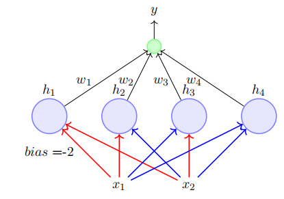

- 这个网络包含3层. 
- 包含输入（$x_1, x_2$）的层称为输入层. 
- 中间包含4个感知机的层称为隐藏层. 
- 最后包含一个输出神经元的层称为输出层. 
- 隐藏层中4个感知机的输出分别表示为$h_1, h_2, h_3, h_4$. 
- 红色和蓝色的边称为第一层权重. 
- $w_1, w_2, w_3, w_4$称为第二层权重. 

我们声称这个网络可以用来实现任何布尔函数（无论是否线性可分）！换句话说，我们可以找到$w_1, w_2, w_3, w_4$，使得任何布尔函数的真值表都可以由这个网络表示. 这听起来很惊人！但如果你理解了其中的原理，就不会这么觉得了. 

中间层的每个感知机只对特定的输入激活（并且没有两个感知机对相同的输入激活）. 第一个感知机在输入为{-1, -1}时激活，第二个感知机在输入为{-1, 1}时激活，第三个感知机在输入为{1, -1}时激活，第四个感知机在输入为{1, 1}时激活. 

设$w_0$为输出神经元的偏置（即当$\sum_{i = 1}^{4}w_ih_i \geq w_0$时，它会激活, 激活时输出为 1，否则为 0 ）. 

| $x_1$ | $x_2$ | XOR | $h_1$ | $h_2$ | $h_3$ | $h_4$ | $\sum_{i = 1}^{4}w_ih_i$（以$w_1$为例） |
| ---- | ---- | ---- | ---- | ---- | ---- | ---- | ---- |
| 0 | 0 | 0 | 1 | 0 | 0 | 0 | $w_1$ |
| 0 | 1 | 1 | 0 | 1 | 0 | 0 | $w_2$ |
| 1 | 0 | 1 | 0 | 0 | 1 | 0 | $w_3$ |
| 1 | 1 | 0 | 0 | 0 | 0 | 1 | $w_4$ |

异或（XOR）函数的真值表为：$x_1 = 0, x_2 = 0$ 时输出为0 ；$x_1 = 0, x_2 = 1$ 时输出为1 ；$x_1 = 1, x_2 = 0$ 时输出为1 ；$x_1 = 1, x_2 = 1$ 时输出为0 . 
 - 对于 $x_1 = 0, x_2 = 0$ ，要使输出神经元不激活（输出为0 ），就需要 $\sum_{i = 1}^{4}w_ih_i = w_1 < w_0$ . 
 - 对于 $x_1 = 0, x_2 = 1$ ，要使输出神经元激活（输出为1 ），就需要 $\sum_{i = 1}^{4}w_ih_i = w_2 \geq w_0$ . 
 - 对于 $x_1 = 1, x_2 = 0$ ，要使输出神经元激活（输出为1 ），就需要 $\sum_{i = 1}^{4}w_ih_i = w_3 \geq w_0$ . 
 - 对于 $x_1 = 1, x_2 = 1$ ，要使输出神经元不激活（输出为0 ），就需要 $\sum_{i = 1}^{4}w_ih_i = w_4 < w_0$ . 

通过这样设置权重 $w_1, w_2, w_3, w_4$ 与偏置 $w_0$ 的关系，就可以让这个感知机网络实现异或函数的功能. 每个权重 $w_i$ 负责一种特定输入组合下的输出情况，通过调整权重来满足异或函数不同输入对应的输出要求.   本质上，每个$w_i$现在负责4种可能输入中的一种，并且可以进行调整以获得该输入对应的期望输出. 

很明显，同样的网络也可以用来表示其余15个布尔函数. 每个布尔函数都会产生一组不同的、不矛盾的不等式，通过适当地设置$w_1, w_2, w_3, w_4$就可以满足这些不等式. 试试吧！

如果我们有超过3个输入会怎样呢？同样，8个感知机中的每一个都只会对8种输入中的一种激活. 第二层的8个权重中的每一个都负责8种输入中的一种，并且可以进行调整以产生该输入对应的期望输出. 

如果我们有n个输入呢？

**定理**: 任何n输入的布尔函数都可以由一个感知机网络精确表示，该网络包含一个具有$2^{n}$个感知机的隐藏层和一个包含1个感知机的输出层. 

证明（非正式）：我们刚刚看到了如何构建这样的网络. 

注意：具有$2^{n} + 1$个感知机的网络不是必要的，而是充分的. 例如，我们已经看到只用1个感知机就可以表示与（AND）函数. 

问题在于：随着n的增加，隐藏层中的感知机数量显然会呈指数级增长. 

同样，我们为什么要关注布尔函数呢？这对预测我们是否喜欢一部电影有什么帮助呢？让我们来看看！

我们得到了关于过去电影观影体验的数据. 对于每部电影，我们得到了用于决策的各种因素（$x_1, x_2, \ldots, x_n$）的值，并且还得到了 $y$（喜欢/不喜欢）的值. $p_i$ 是输出为1的点，$n_i$是输出为0的点. 这些数据可能是线性可分的，也可能不是. 

我们刚刚看到的证明告诉我们，可以构建一个感知机网络并学习其中的权重，使得对于任何给定的$p_i$或$n_j$，网络的输出都与$y_i$或$y_j$相同（即我们可以将正样本点和负样本点分开）. 

我们刚才看到的这种形式的网络（包含输入层、输出层和一个或多个隐藏层）被称为多层感知机（简称为MLP）. 更准确的术语应该是“多层感知机网络”，但MLP是更常用的名称. 

我们刚才看到的定理给出了具有单个隐藏层的MLP的表示能力. 具体来说，它告诉我们具有单个隐藏层的MLP可以表示任何布尔函数.  