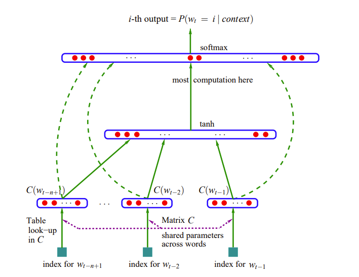

# Neural Probabilistic Language Model to Predict Next Word

## Reference

- A Neural Probabilistic Language Model：https://www.jmlr.org/papers/volume3/bengio03a/bengio03a.pdf
- https://www.cs.toronto.edu/~lczhang/321/notes/notes07.pdf

## 语言建模

我们的目标是对英语句子的分布进行建模（这一任务被称为语言建模），我们通过将其转化为序列预测任务来实现这一目标。也就是说，我们要学习在给定句子中前面单词的情况下，预测下一个单词的分布。本讲还将作为神经网络中最重要概念之一——分布式表示的示例。我们可以通过与局部表示对比来理解这一概念，在局部表示中，特定的信息仅存储在一个位置，而在分布式表示中，信息分布在整个表示中。事实证明，这非常有用，因为它使我们能够在相关实体之间共享信息——在语言建模的情况下，就是在相关单词之间共享信息。

语言建模是对自然语言文本的概率分布进行建模的问题。也就是说，我们希望能够确定一个给定句子被说出的可能性有多大。这是更一般的分布建模问题的一个实例，即学习一个试图近似某个数据集所来自的分布的模型。我们为什么要拟合这样的模型呢？最重要的应用场景之一是贝叶斯推理。

假设我们正在构建一个语音识别系统，即给定一个声学信号a，我们希望推断出可能被说出的句子s（或一组候选句子）。实现这一点的一种方法是构建一个生成模型。在这种情况下，这样的模型由两个概率分布组成：

- 观察模型，表示为 $p(a|s)$ ，它告诉我们一个句子导致给定声学信号的可能性有多大。例如，你可能会构建一个人类发声系统的模型。这方面已经有很多研究，但我们在这里不会讨论它。
- 先验，表示为 $p(s)$ ，它告诉我们在看到a之前，一个给定句子被说出的可能性有多大。这就是我们进行语言建模时试图估计的东西。

给定这两个分布，我们可以使用贝叶斯规则将它们结合起来，以推断句子的后验分布，即考虑到观察结果的句子上的概率分布。回想一下贝叶斯规则如下：

$$
p(s|a) = \frac{p(s)p(a|s)}{\sum_{s'} p(s')p(a|s')}
$$

分母只是一个归一化项，我们很少需要显式计算或处理它。因此，我们可以隐含地保留归一化，使用符号“∝”表示成比例：

$$
p(s|a) \propto p(s)p(a|s)
$$

因此，贝叶斯规则让我们能够以一种有原则且优雅的方式将我们的先验信念与观察模型结合起来。

拥有一个好的先验分布 $p(s)$ 非常有用，因为语音信号本质上是模糊的。例如，“recognize speech”听起来与“wreck a nice beach”非常相似，但前者更有可能被说出。这是我们希望我们的语言模型能够捕捉到的那种东西。

## 自回归模型

现在我们将把分布建模任务重新表述为一个序列预测任务。假设我们给定一个句子语料库 $s^{(1)}, ..., s^{(N)}$ 。我们将做一个简化的假设，即这些句子是独立的。这意味着它们的概率相乘：

$$
p(s^{(1)}, ..., s^{(N)}) = \prod_{i=1}^{N} p(s^{(i)})
$$

因此，我们可以转而讨论对句子上的分布进行建模。

我们将尝试拟合一个表示分布 $p_{\theta}(s)$ 的模型，该模型由θ参数化。最大似然准则表明，我们希望选择使似然（即观察数据的概率）最大化的 $\theta$：

$$
\max_{\theta} \prod_{i=1}^{N} p_{\theta}(s^{(i)})
$$

此时，你可能会担心任何特定句子的概率都会小得可以忽略不计。这是事实，但我们可以通过使用对数概率来解决这个问题。然后，语料库的概率方便地分解为一个和：

$$
\log \prod_{i=1}^{N} p(s^{(i)}) = \sum_{i=1}^{N} \log p(s^{(i)})
$$

一个句子是单词的序列 $w_1, w_2, ..., w_T$ 。条件概率的链式法则意味着 $p(s)$ 可以分解为各个单词的条件概率的乘积：

$$
p(s) = p(w_1, ..., w_T) = p(w_1)p(w_2|w_1)\cdots p(w_T|w_1, ..., w_{T-1}) 
$$

因此，语言建模问题等价于能够预测下一个单词！

注意，链式法则适用于任何分布，即我们在这里没有做任何假设。

我们通常会做一个马尔可夫假设，即下一个单词的分布只依赖于前面的几个单词。也就是说，如果我们使用长度为3的上下文，这意味着：

$$
p(w_t|w_1, ..., w_{t-1}) = p(w_t|w_{t-3}, w_{t-2}, w_{t-1}) 
$$

这样的模型被称为无记忆模型，因为它对句子中更早发生的事情没有记忆。当我们将分布建模问题分解为具有有限上下文长度的序列预测任务时，我们称之为自回归模型。“回归”是因为这是一个预测问题，“自”是因为这些序列既用作输入又用作目标。

统计学家使用“回归”来指代一般的监督预测问题，而不仅仅是最小二乘法。

## n元语法语言模型 (n-Gram Language Models)
最简单的马尔可夫模型是条件概率表（CPT），其中我们显式地表示给定上下文单词时下一个单词的分布。这是一个表，每一行对应每一个可能的上下文单词序列，每一列对应每一个单词，表项给出条件概率。由于每一行代表一个概率分布，表项必须是非负的，并且每一行的表项必须求和为1。否则，这些数字可以是任何值。

估计CPT的最简单方法是使用经验计数，即在训练语料库中单词序列出现的次数。例如：

$$
p(w_3 = \text{cat} | w_1 = \text{the}, w_2 = \text{fat}) = \frac{\text{count(the fat cat)}}{\text{count(the fat)}} 
$$

这需要计算所有长度为2和3的序列的出现次数。长度为 $n$ 的序列被称为 $n$ 元语法，基于计数此类序列的模型被称为n元语法模型。对于 $n=1,2,3$，这些被称为一元语法、二元语法和三元语法模型。注意，一元语法模型是完全不连贯的（因为它们从单词的边缘分布中独立地采样所有单词），但三元语法模型捕捉到了相当多的句法结构。

注意：这个例子是一个 $3$ 元语法模型，尽管它使用了长度为 $2$ 的上下文。

观察到，可能的上下文数量随 $n$ 呈指数增长。这意味着，除了非常小的 $n$ 之外，你不太可能在训练语料库中看到所有可能的 $n$ 元语法，并且许多或大多数计数将为 $0$。这个问题被称为数据稀疏性。上面描述的模型有点像稻草人，自然语言处理研究人员想出了各种巧妙的方法来处理数据稀疏性，包括添加所有单词的虚构计数，以及组合不同上下文长度的预测。

但是，$n$ 元语法方法有一个根本问题：很难在相关单词之间共享信息。如果我们看到句子 “The cat got squashed in the garden on Friday” ，我们应该估计看到句子 “The dog got flattened in the yard on Monday” 的概率更高，尽管这两个句子几乎没有共同的单词。分布式表示提供了一种很好的方法来做到这一点。

## 分布式表示

条件概率表是一种局部表示，这意味着给定的一条信息（例如，在“the fat”之后看到“cat”的概率）仅存储在一个位置。如果我们想在相关单词之间共享信息，我们可能希望使用分布式表示，其中同一条信息将分布在整个表示中。例如，假设我们构建一个单词属性表，以及这些属性对看到可能的下一个单词的概率的影响（+或−）.

“银行（bank）是一种金融机构，它接受公众存款并创造信贷.  ” 这里的想法是使用伴随的单词（“金融（financial）”、“存款（deposits）”、“信贷（credit）”）来表示 “银行（bank）”.  

“你应通过一个词的语境来了解它.  ”——弗斯，J.R.，1957:11

这种基于分布相似性的表示方法引出了共现矩阵（co-occurrence matrix）的概念.  

共现矩阵是一个 “词项×词项” 的矩阵，它记录了一个词项在另一个词项的语境中出现的次数.  语境被定义为围绕词项的 $k$ 个单词的窗口.  让我们为一个小型语料库构建一个 $k = 2$ 的共现矩阵，这也被称为 “词×语境” 矩阵.  你可以选择词集和语境集相同或不同.  共现矩阵的每一行（列）都给出了相应单词（语境）的向量表示.  

语料库：

- Human machine interface for computer applications
- User opinion of computer system response
time
- User interface management system
- System engineering for improved response
time

|  | human | machine | system | for | $\dots$ | user |
| --- | --- | --- | --- | --- | --- | --- |
| human | 0 | 1 | 0 | 1 | $\dots$ | 0 |
| machine | 1 | 0 | 0 | 1 | $\dots$ | 0 |
| system | 0 | 0 | 0 | 1 | $\dots$ | 2 |
| for | 1 | 1 | 1 | 0 | $\dots$ | 0 |
| $\vdots$ | $\vdots$ | $\vdots$ | $\vdots$ | $\vdots$ | $\vdots$ | $\vdots$ |
| $\vdots$ | $\vdots$ | $\vdots$ | $\vdots$ | $\vdots$ | $\vdots$ | $\vdots$ |
| user | 0 | 0 | 2 | 0 | $\dots$ | 0 | |

## 神经概率语言模型简述

现在我们来谈谈一个学习语言分布式表示的网络，称为神经概率语言模型，或简称神经语言模型。简而言之，所提出方法的思想可总结如下：

1. **为每个单词关联分布式特征向量**：给词汇表中的每个单词分配一个实值向量（如 $\mathbb{R}^m$ 中的向量），每个向量代表单词的不同语义/句法属性。  
2. **基于特征向量建模概率函数**：通过单词的特征向量来表示单词序列的联合概率，例如用多层神经网络将前 $n-1$ 个单词的特征向量映射到下一个单词的概率分布。  
3. **联合学习特征向量与模型参数**：在训练中同时优化单词特征向量和神经网络的权重（如隐藏层、输出层参数），最大化训练数据的对数似然（或正则化后的目标）。  

**特征向量的作用**：每个单词对应低维空间中的点（如 $m=30$ 维，远小于词汇表大小 $17,000$ ），相似单词（如“dog”和“cat”）的向量在空间中接近。如果概率函数是特征向量的**平滑函数**（比如software），即特征的微小变化仅导致概率的微小变化，从而实现语义泛化（如从“cat walking”泛化到“dog running”）。  

**泛化原理**：训练数据中一个句子（如“The cat is walking...”）的特征向量序列会“激活”其邻居（相似特征向量的句子），使模型对这些未见过的句子也分配较高概率。这是因为：  
- 相似单词的特征向量接近（语义/句法相似性）。  
- 概率函数对特征向量的变化敏感但平滑（避免离散符号的突变）。  

**正则化与初始化**：  
- 权重衰减（类似岭回归）惩罚参数的平方范数，防止过拟合。  
- 特征向量可通过语义先验（如共现统计）初始化，实验中随机初始化也有效。  

**对比n-gram**：传统n-gram因数据稀疏性只能处理短上下文（如3-gram），而分布式表示通过低维向量和神经网络，可高效处理长上下文（如10词），参数规模仅随上下文长度线性增长（而非指数）。  

## 神经概率语言模型详细

### 一、核心思想与背景
- **提出**：由Yoshua Bengio团队于2003年提出，首次将神经网络与语言建模结合，为深度学习在NLP的应用及 **词嵌入(Word Embedding)** 奠定基础。  
- **目标**：建模自然语言序列的条件概率，预测给定上下文时下一个单词的分布，解决传统n-gram模型的**维度灾难**（参数指数增长）和**语义泛化不足**（无法利用单词相似性）问题。  
- **创新**：引入**分布式表示（Distributed Representation）**，将单词映射为低维连续向量（词嵌入），使相似单词在向量空间中接近，实现语义/句法泛化。

### 二、模型架构（以经典MLP结构为例）
1. **输入层（词嵌入层）**：  
   - 将上下文单词（如前  $n-1$  个词）的独热编码映射为低维实向量（嵌入矩阵  $C$  学习得到），拼接为输入向量  $x = [C(w_{t-1}), \dots, C(w_{t-n+1})]$ ，维度为  $(n-1)m$ （ $m$  为嵌入维度）。  

2. **隐藏层（非线性变换）**：  
   - 采用双曲正切（ $\tanh$ ）激活的全连接层，捕捉上下文的复杂依赖：  

$$
h = \tanh(d + Hx)
$$ 

（ $H$  为隐藏层权重， $d$  为偏置， $h$  为隐藏层输出，维度为  $h$ ）。  

> why $\tanh$ ?

3. **输出层（概率预测）**：  
   - 通过softmax将隐藏层输出转换为词汇表上的概率分布：  

$$ 
\hat{P}(w_t | \text{上下文}) = \frac{e^{b + Wx + Uh}}{\sum_{i=1}^{|V|} e^{b_i + W_ix + U_ih}} 
$$

（ $W$  为直接连接权重， $U$  为隐藏层到输出层权重， $b$  为输出偏置， $|V|$  为词汇表大小）。  

### 三、训练与优化

- **损失函数**：最小化**负对数似然（NLL）**，等价于交叉熵损失，联合优化嵌入矩阵  $C$  和神经网络参数（ $W, U, H, b, d$ ）：

$$
\mathcal{L} = -\frac{1}{T} \sum_t \log \hat{P}(w_t | \text{上下文}) + R(\theta) 
$$

（ $R(\theta)$  为权重衰减正则化，防止过拟合）。  

- **优化算法**：使用**随机梯度上升（SGA）**，通过反向传播更新参数，同时学习词嵌入和网络权重，使相似单词的向量在训练中逐渐接近（如“cat”与“dog”因共享上下文梯度而向量距离缩小）。

在机器学习中，**最小化负对数似然（NLL）等价于最小化交叉熵损失**，这一结论源于两者在数学上的紧密联系，当真实标签为独热编码（one-hot encoding）时，二者完全等价。以下是详细推导与解释：

**负对数似然（Negative Log-Likelihood, NLL）**
- **最大似然估计（MLE）**：假设数据独立同分布，目标是找到参数 $\theta$ 使训练数据的联合概率（似然）最大化：  

$$
\max_{\theta} \prod_{t=1}^{T} P(w_t | \text{上下文}; \theta)
$$  

取对数后转化为最大化对数似然（便于数学处理）：  

$$
\max_{\theta} \sum_{t=1}^{T} \log P(w_t | \text{上下文}; \theta)
$$  

- **负对数似然（NLL）**：最大化对数似然等价于最小化其负数：  

$$
\min_{\theta} -\sum_{t=1}^{T} \log P(w_t | \text{上下文}; \theta)
$$

**交叉熵损失（Cross-Entropy Loss）**
- **交叉熵（Cross-Entropy）**：衡量两个概率分布 $p(\text{真实})$ 和 $q(\text{预测})$ 的差异，公式为：  

$$
H(p, q) = -\sum_{x} p(x) \log q(x)
$$

- **分类任务中的交叉熵损失**：若真实标签为独热向量（如单词预测中，真实单词对应位置为1，其余为0），则交叉熵简化为：  

$$
\mathcal{L}_{\text{CE}} = -\log q(x_{\text{true}})
$$  

其中 $q(x_{\text{true}})$ 是模型对真实类别 $x_{\text{true}}$ 的预测概率。

假设单个样本的真实标签为独热向量 $\mathbf{y} = [0, \dots, 1, \dots, 0]$ （仅第 $k$ 位为1），模型预测概率为 $\hat{\mathbf{p}} = [\hat{p}_1, \dots, \hat{p}_k, \dots, \hat{p}_{|V|}]$ 。  
- **交叉熵损失**：  

$$
\mathcal{L}_{\text{CE}} = -\sum_{i=1}^{|V|} y_i \log \hat{p}_i = -\log \hat{p}_k
$$  

- **负对数似然**：  
  真实分布的概率 $P_{\text{true}}(x) = 1$ （当 $x = x_{\text{true}}$ ），因此对数似然为 $\log \hat{p}_k$ ，负对数似然为：  

$$
\mathcal{L}_{\text{NLL}} = -\log \hat{p}_k
$$  

**结论**：单样本情况下， $\mathcal{L}_{\text{CE}} = \mathcal{L}_{\text{NLL}}$ 。对于 $T$ 个样本的批量数据，求和后依然等价：  

$$
\sum_{t=1}^{T} \mathcal{L}_{\text{CE}}^{(t)} = \sum_{t=1}^{T} \mathcal{L}_{\text{NLL}}^{(t)}
$$

### 四、优势与贡献
1. **突破维度灾难**：  
   - 词嵌入将单词表示为低维向量（如  $m=30$  维，远小于词汇表大小），参数规模随上下文长度线性增长（对比n-gram的指数增长），可处理更长上下文（如10词）。  

2. **语义泛化能力**：  
   - 利用向量相似性，模型可对未见过的单词组合（如“dog running”）分配合理概率（n-gram因数据稀疏性常输出零概率），例如从训练数据“The cat is walking”泛化到“A dog was running”。  

3. **奠定词嵌入基础**：  
   - 首次证明通过神经网络训练可自动学习单词的分布式表示（词嵌入），为后续Word2Vec、GloVe、BERT等模型提供理论支撑，开启“连续向量表示”的NLP研究范式。  

4. **长距离依赖建模**：  
   - 神经网络的非线性层（如 $\tanh$ ）可捕捉跨越多个单词的语义关联（如主谓一致、修饰关系），而n-gram因上下文长度限制（通常3-gram）难以处理。

### 五、局限与发展
- **局限**：  
  - 计算成本高（词汇表大时，softmax计算复杂度为  $O(|V|)$ ，可通过层次化Softmax优化）。  
  - 未引入递归结构（如RNN），对极长上下文的依赖建模能力有限（后续LSTM、Transformer等模型改进）。  
- **发展**：  
  - 后续模型（如RNN-LM、Transformer-LM）在此基础上引入递归或自注意力机制，进一步提升长上下文建模能力，成为现代大语言模型（如GPT、BERT）的核心组件。

### 总结
NPLM是神经语言模型的里程碑，通过**分布式表示+神经网络**的架构，解决了传统统计模型的维度灾难和语义泛化问题，首次实现单词向量的自动学习，为深度学习在NLP的爆发奠定了基础。其核心创新（词嵌入、连续概率建模）至今仍是NLP研究的核心要素。
