# 多层Sigmoid神经元网络

## Refernece

- https://www.cse.iitm.ac.in/~miteshk/CS7015/Slides/Handout/Lecture3.pdf

## 1 Sigmoid神经元

布尔函数讲得够多了！

对于形如 $y = f(x)$ 的任意函数，其中 $x \in \mathbb{R}^{n}$（而不是 $\{0,1\}^{n}$）且 $y \in \mathbb{R}$（而不是0或1），情况又如何呢？

我们能否构建一个网络来（近似地）表示这类函数？

在回答上述问题之前，我们得先从感知机过渡到Sigmoid神经元……

### 回顾

当感知机输入的加权和大于阈值（$-w_{0}$）时，它就会激活. 

### 阈值逻辑的局限性

感知机使用的阈值逻辑过于生硬！

例如，回到我们判断是否喜欢一部电影的问题上. 

假设我们仅基于一个输入（$x_{1}$ = 影评人评分，取值范围在0到1之间）来做决定. 

如果阈值是0.5（$w_{0} = -0.5$）且 $w_{1} = 1$，那么对于影评人评分为0.51的电影，我们的决定是什么？（喜欢）

那评分为0.49的电影呢？（不喜欢）

仅仅因为评分从0.49变为0.51，我们就从不喜欢变为喜欢，这似乎不太合理. 

这种行为并非我们所选择的特定问题，或者特定的权重和阈值所导致的. 

它是感知机函数本身的特性，感知机函数类似阶跃函数. 

当 $\sum_{i = 1}^{n}w_{i}x_{i}$ 超过阈值（$-w_{0}$）时，决策总会突然从0变为1. 

在大多数实际应用中，我们期望有一个更平滑的决策函数，能够逐渐从$0$变化到$1$. 

### 引入Sigmoid神经元

引入Sigmoid神经元，其输出函数比阶跃函数平滑得多. 

这里有一种Sigmoid函数，称为逻辑函数：
$$
y=\frac{1}{1+e^{-\left(w_{0}+\sum_{i=1}^{n} w_{i} x_{i}\right)}}
$$

在阈值 $-w_{0}$ 附近，不再有急剧的转变. 而且输出 $y$ 不再是二进制的，而是介于0和1之间的实数值，可以被解释为概率. 我们得到的不是喜欢或不喜欢的决策，而是喜欢这部电影的概率. 

### 感知机与Sigmoid神经元对比

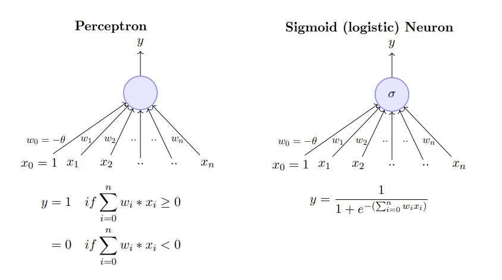

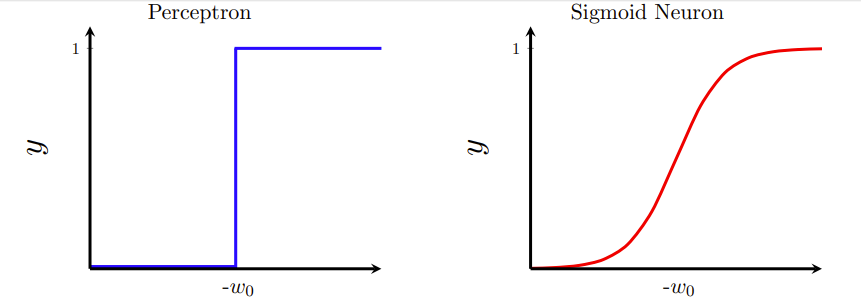

感知机不光滑、在 $w_{0}$ 处不连续且不可微，而Sigmoid神经元光滑、连续且可微. 

## 2 典型的监督式机器学习设置

正如我们有学习感知机权重的算法一样，我们也需要一种学习Sigmoid神经元权重的方法. 

在介绍这种算法之前，我们先回顾一下误差的概念. 

### 回顾数据分类问题
之前我们提到，单个感知机无法处理某些数据，因为这些数据不是线性可分的. “无法处理” 是什么意思呢？

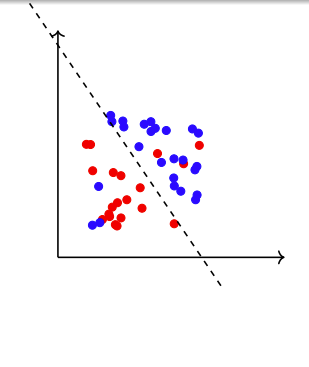

如果我们使用感知机模型对这些数据进行分类会怎样？

我们可能会得到这样一条直线……

这条直线看起来还不算太差. 

当然，它误分类了3个蓝色点和3个红色点，但在大多数实际应用中，我们可以接受这种误差. 

从现在开始，我们承认在大多数情况下很难将误差降为0，而是致力于达到最小可能的误差. 
### 典型机器学习设置的组成部分

典型的机器学习设置包含以下几个部分：
 - **数据**：$\{x_{i}, y_{i}\}_{i = 1}^{n}$
 - **模型**：我们对 $x$ 和 $y$ 之间关系的近似. 例如：

$$
\hat{y}=\frac{1}{1+e^{-\left(w^{T} x\right)}}
$$

$$
或 \hat{y}=w^{T} x
$$

$$
或 \hat{y}=x^{T} W x
$$

或者几乎任何函数. 
 - **参数**：在上述所有情况中，$w$ 是需要从数据中学习的参数. 
 - **学习算法**：用于学习模型参数（$w$）的算法（例如，感知机学习算法、梯度下降等）. 
 - **目标/损失/误差函数**：用于指导学习算法，学习算法应旨在最小化损失函数. 
### 电影示例
以电影为例进行说明：
 - **数据**：$\{x_{i} = 电影, y_{i} = 喜欢/不喜欢\}_{i = 1}^{n}$
 - **模型**：我们对 $x$ 和 $y$ 之间关系（喜欢一部电影的概率）的近似. 

$$
\hat{y}=\frac{1}{1+e^{-\left(w^{T} x\right)}}
$$

 - **参数**：$w$. 
 - **学习算法**：梯度下降（我们很快会讲到）. 
 - **目标/损失/误差函数**：一种可能的选择是：

 $$
 \mathscr{L}(w)=\sum_{i=1}^{n}\left(\hat{y}_{i}-y_{i}\right)^{2}
 $$

 学习算法应寻找使上述函数（$y$ 和 $\hat{y}$ 之间的均方误差）最小的 $w$. 

## 3 学习参数：梯度下降

### 梯度下降的原理
设参数向量 $\theta = [w, b]$，参数变化量向量 $\Delta \theta = [\Delta w, \Delta b]$. 

我们按照 $\Delta \theta$ 的方向移动，但为了保守起见，只移动一小段距离 $\eta$，即 $\theta_{new} = \theta + \eta \cdot \Delta \theta$. 

问题是：应该使用什么样的 $\Delta \theta$ 呢？

答案来自泰勒级数. 

为了简化符号，设 $\Delta \theta = u$，根据泰勒级数：

$$
\begin{align*}
\mathscr{L}(\theta+\eta u) & =\mathscr{L}(\theta)+\eta \cdot u^{T} \nabla_{\theta} \mathscr{L}(\theta)+\frac{\eta^{2}}{2!} \cdot u^{T} \nabla^{2} \mathscr{L}(\theta) u+\frac{\eta^{3}}{3!} \cdot \cdots+\frac{\eta^{4}}{4!} \cdot \cdots \\
& =\mathscr{L}(\theta)+\eta \cdot u^{T} \nabla_{\theta} \mathscr{L}(\theta) \quad [\eta通常很小，所以 \eta^{2}, \eta^{3}, \cdots \to 0]
\end{align*}
$$

只有当 $\mathscr{L}(\theta+\eta u)-\mathscr{L}(\theta)<0$（即新的损失小于之前的损失）时，移动（$\eta u$）才是有利的. 

这意味着：

$$
u^{T} \nabla_{\theta} \mathscr{L}(\theta)<0
$$

### 确定移动方向

设 $u$ 和 $\nabla_{\theta} \mathscr{L}(\theta)$ 之间的夹角为 $\beta$，则：

$$
-1 \leq \cos (\beta)=\frac{u^{T} \nabla_{\theta} \mathscr{L}(\theta)}{\| u\| \cdot\left\| \nabla_{\theta} \mathscr{L}(\theta)\right\| } \leq 1
$$

两边同时乘以 $k=\|u\| \cdot\left\|\nabla_{\theta} \mathscr{L}(\theta)\right\|$ 得到：

$$
-k \leq k \cdot \cos (\beta)=u^{T} \nabla_{\theta} \mathscr{L}(\theta) \leq k
$$

因此，当 $\cos (\beta)= -1$，即 $\beta = 180^{\circ}$ 时，$\mathscr{L}(\theta+\eta u)-\mathscr{L}(\theta)=u^{T} \nabla_{\theta} \mathscr{L}(\theta)=k \cdot \cos (\beta)$ 最负. 

梯度下降规则：我们要移动的方向 $u$ 应该与梯度方向相差 $180^{\circ}$，即朝着与梯度相反的方向移动. 

参数更新方程：

$$
\begin{align*}
w_{t+1}&=w_{t}-\eta \nabla w_{t}\\
b_{t+1}&=b_{t}-\eta \nabla b_{t}
\end{align*}
$$

其中，$\nabla w_{t}=\frac{\partial \mathscr{L}(w, b)}{\partial w}\big|_{w = w_{t}, b = b_{t}}$，$\nabla b=\frac{\partial \mathscr{L}(w, b)}{\partial b}\big|_{w = w_{t}, b = b_{t}}$. 

 

**算法：梯度下降**

- $t \leftarrow 0$;
- $\text{maxIterations} \leftarrow 1000$;
- $\text{while } t < \text{maxIterations } \text{do}$
    - $w_{t+1}\leftarrow w_{t}-\eta \nabla w_{t}$; 
    - $b_{t+1}\leftarrow b_{t}-\eta \nabla b_{t}$ 
    - $t \leftarrow t + 1$;
- $\text{end}$

为了实际应用这个算法，我们先为简单的神经网络推导 $\nabla w$ 和 $\nabla b$. 

### 推导梯度
假设只有1个数据点 $(x, y)$ 来拟合，损失函数为：

$$
\mathscr{L}(w, b)=\frac{1}{2} \cdot(f(x)-y)^{2}
$$

则：

$$
\begin{align*}
\nabla w & =\frac{\partial \mathscr{L}(w, b)}{\partial w}\\
& =\frac{\partial}{\partial w}\left[\frac{1}{2} \cdot(f(x)-y)^{2}\right] \\
& =\frac{1}{2} \cdot\left[2 \cdot(f(x)-y) \cdot \frac{\partial}{\partial w}(f(x)-y)\right] \\
& =(f(x)-y) \cdot \frac{\partial}{\partial w}(f(x)) \\
& =(f(x)-y) \cdot \frac{\partial}{\partial w}\left(\frac{1}{1+e^{-(w x+b)}}\right) \\
& =(f(x)-y) \cdot f(x) \cdot(1-f(x)) \cdot x
\end{align*}
$$

对于两个数据点的情况：

$$
\begin{align*}
\nabla w&=\sum_{i=1}^{2}\left(f\left(x_{i}\right)-y_{i}\right) \cdot f\left(x_{i}\right) \cdot\left(1-f\left(x_{i}\right)\right) \cdot x_{i}\\
\nabla b&=\sum_{i=1}^{2}\left(f\left(x_{i}\right)-y_{i}\right) \cdot f\left(x_{i}\right) \cdot\left(1-f\left(x_{i}\right)\right)
\end{align*}
$$

## 5 多层Sigmoid神经元网络的表示能力

具有单个隐藏层的神经元多层网络可用于以任意所需精度逼近任何连续函数. 

换句话说，对于任何函数 $f(x): \mathbb{R}^{n} \to \mathbb{R}^{m}$，我们总能找到一个神经网络（具有1个隐藏层且包含足够数量的神经元），其输出 $g(x)$ 满足 $|g(x) - f(x)| < \epsilon$！！

请查看[此链接](http://neuralnetworksanddeeplearning.com/chap4.html)以获取此证明的精彩示例说明. 

接下来几张幻灯片中的讨论基于上述链接中提出的观点. 

### 用 “塔” 函数逼近任意函数

我们想知道神经元网络是否可用于表示任意函数（如图中所示的函数）. 

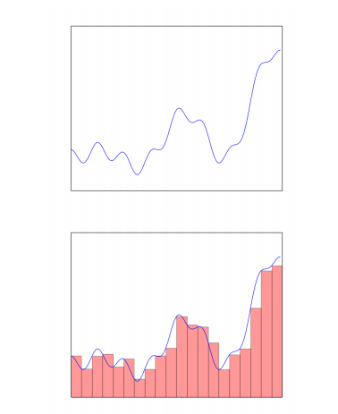

我们观察到，这样的任意函数可以由几个 “塔” 函数逼近. 

这类 “塔” 函数的数量越多，逼近效果就越好. 

更确切地说，我们可以用这类 “塔” 函数的和来逼近任何任意函数. 

### 关于 “塔” 函数的观察

所有这些 “塔” 函数都很相似，仅在高度和在x轴上的位置有所不同. 

假设有一个黑箱，它接受原始输入$x$并构建这些 “塔” 函数. 

然后我们可以有一个简单的网络，只需将它们相加就能逼近目标函数. 

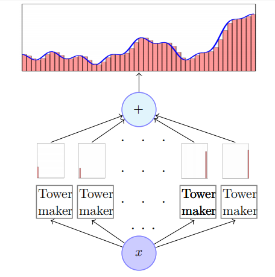

我们现在的任务是弄清楚这个黑箱里面是什么. 

### 逻辑函数与 “塔” 函数的关系
如果我们取逻辑函数并将$w$设置为一个非常大的值，我们将得到阶跃函数. 

让我们看看当我们改变$w$的值时会发生什么. 

此外，我们可以调整$b$的值来控制函数从0转变到1的x轴位置. 

现在让我们看看，如果取两个这样的Sigmoid函数（具有不同的$b$值）并将它们相减会得到什么. 

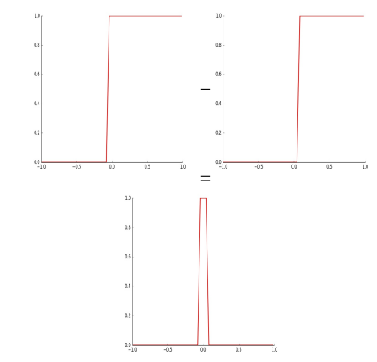

瞧！我们得到了 “塔” 函数！！

### 用神经网络表示 “塔” 函数操作
我们可以构建一个神经网络来表示从一个Sigmoid函数减去另一个Sigmoid函数的操作

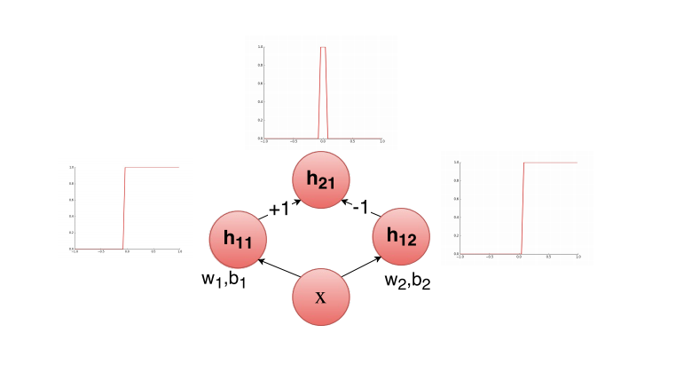

如果我们有多个输入会怎样呢？假设我们试图判断在海洋底部的某个特定位置是否能找到石油（是/否）. 

进一步假设，我们的判断基于两个因素：盐度$(x_{1})$和压力$(x_{2})$. 

我们得到了一些数据，并且似乎$y$（有油/无油）是$x_{1}$和$x_{2}$的复杂函数. 

我们希望用一个神经网络来逼近这个函数. 

这是二维Sigmoid函数的样子：
\[y=\frac{1}{1+e^{-\left(w_{1} x_{1}+w_{2} x_{2}+b\right)}}\]

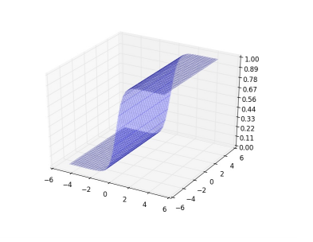

我们需要弄清楚在这种情况下如何得到 “塔” 函数. 

首先，让我们将$w_{2}$设置为0，看看是否能得到二维阶跃函数. 如果我们改变$b$会发生什么呢？

当我们取两个这样的（具有不同$b$值的）阶跃函数并将它们相减时，我们仍然得不到 “塔” 函数（或者得到一个两边开口的 “塔” 函数）. 

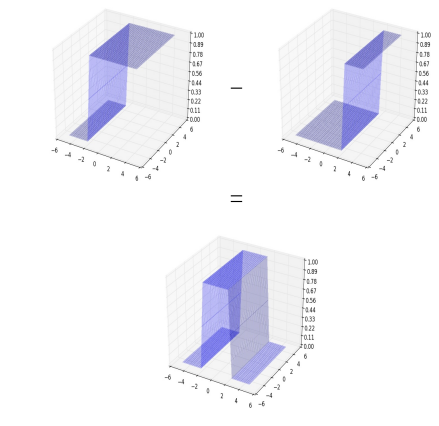

现在让我们将$w_{1}$设置为0并调整$w_{2}$，以得到具有不同方向的二维阶跃函数，然后改变$b$. 同样，当我们取两个这样的（具有不同$b$值的）阶跃函数并相减时，仍然得不到 “塔” 函数（或者得到一个两边开口的 “塔” 函数），但这个开口 “塔” 的方向与之前的不同. 

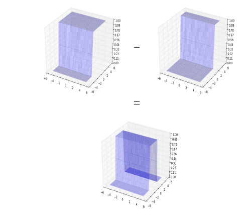

现在，如果我们将两个这样的开口 “塔” 相加会得到什么呢？我们得到一个立在抬高底座上的 “塔”. 

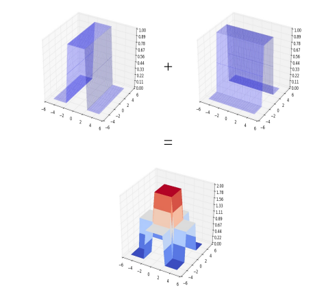

我们现在可以将这个输出通过另一个Sigmoid神经元来得到所需的 “塔” 函数！现在我们可以通过将许多这样的 “塔” 函数相加来逼近任何函数. 

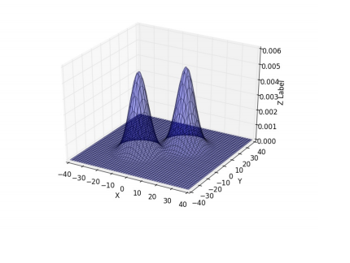

我们可以使用几个 “塔” 函数的和来逼近以下函数. 

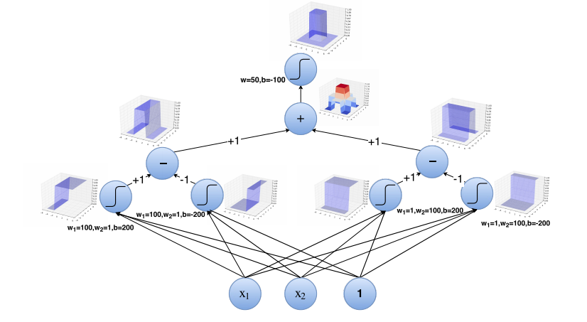

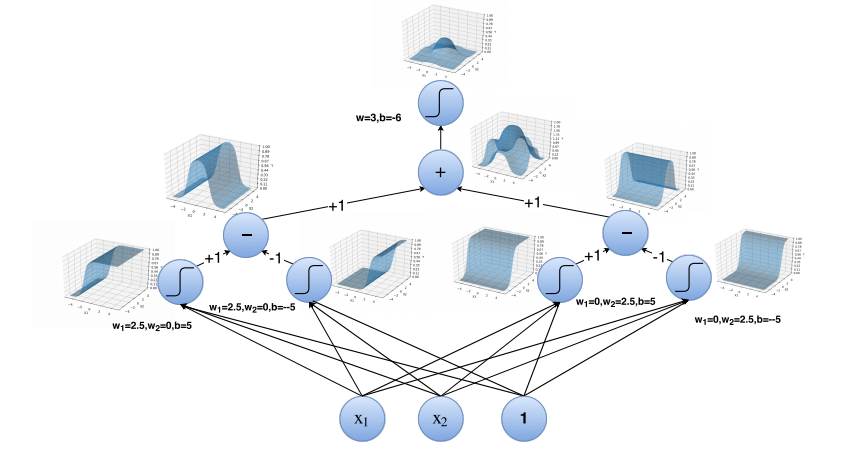

思考一下：对于一维输入，我们需要2个神经元来构建一个 “塔” 函数；对于二维输入，我们需要4个神经元来构建一个 “塔” 函数. 那么在n维中构建一个 “塔” 函数需要多少个神经元呢？

是时候回顾一下了. 我们为什么要关注逼近任意函数呢？我们能将这一切与我们一直在处理的分类问题联系起来吗？

### 神经网络在分类问题中的应用

我们刚刚看到的示例证明告诉我们，我们可以有一个具有两个隐藏层的神经网络，它可以通过 “塔” 函数的和来逼近黄色部分对应的函数. 

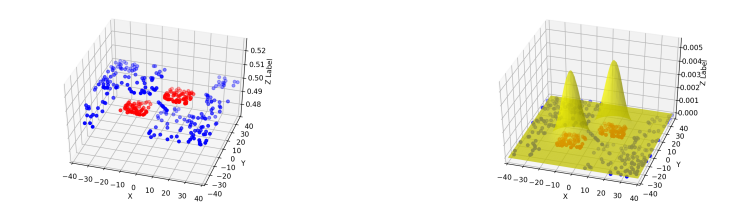

这意味着我们可以有一个神经网络，它可以精确地将蓝色点与红色点分开！！ 