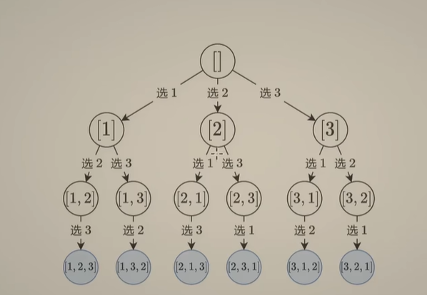
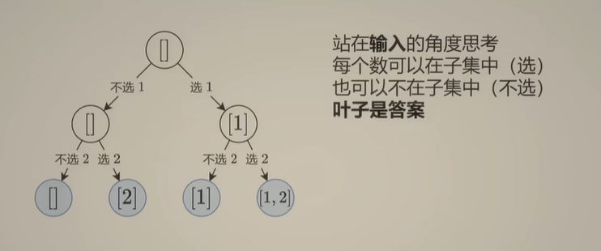

# LEETCODE HOT150

## Reference

- https://leetcode.cn/studyplan/top-interview-150/
- https://leetcode.cn/studyplan/top-100-liked/

## 双指针

> 如果是原地修改，用快慢指针，慢指针用于写，快指针用于读

1. 给你两个按 非递减顺序 排列的整数数组 nums1 和 nums2，另有两个整数 m 和 n ，分别表示 nums1 和 nums2 中的元素数目。请你 合并 nums2 到 nums1 中，使合并后的数组同样按 非递减顺序 排列。注意：最终，合并后数组不应由函数返回，而是存储在数组 nums1 中。为了应对这种情况，nums1 的初始长度为 m + n，其中前 m 个元素表示应合并的元素，后 n 个元素为 0 ，应忽略。nums2 的长度为 n 。[LC88](合并两个有序数组)(https://leetcode.cn/problems/merge-sorted-array/description/?envType=study-plan-v2&envId=top-interview-150)


同向指针，从右边往左边

```python
for i in range(m,m+n):
        nums1[i] = nums2[i-m]
    # 不能用sort(nums1)，这个方法是返回一个新的数组
    nums1.sort()
```
    - 如果不用sort方法呢？
    - 两个数组都是非递减的，那么可以从尾巴开始比较，i=m-1,j=n-1,p=m+n-1
    - 如果nums1[i]>nums2[j]，那么把nums[i]放到p的位置，i--,j不动，p--，循环比较，直到p<0,i<0,j<0
    - 注意如果i<0，就是nums1的数已经比较完了，直接把nums2的数把空位补好，如果j<0，同理
    - while循环判断p>=0，依次判断i<0 and j>=0，j<0 and i<=0 ,i<=0 and j<=0, i>=0,j>=0的情况.

2. 给你一个数组 nums 和一个值 val，你需要 原地 移除所有数值等于 val 的元素。元素的顺序可能发生改变。然后返回 nums 中与 val 不同的元素的数量。假设 nums 中不等于 val 的元素数量为 k，要通过此题，您需要执行以下操作：更改 nums 数组，使 nums 的前 k 个元素包含不等于 val 的元素。nums 的其余元素和 nums 的大小并不重要。返回 k。[LC27移除元素](https://leetcode.cn/problems/remove-element/description/?envType=study-plan-v2&envId=top-interview-150)

同向指针，快慢指针，慢指针用于写，快指针用于读

    - 慢指针i=0，快指针j=0，i用于写，j用于读，k=0记录
    - 如果nums[j]==val，不需要写，故i不动，j++，如果nums[j]!=val，需要写，故nums[i]=nums[j]，i++,j++,k++
    - 可见j一直要加所以，可以用for循环

3. 给你一个 非严格递增排列 的数组 nums ，请你 原地 删除重复出现的元素，使每个元素 只出现一次 ，返回删除后数组的新长度。元素的 相对顺序 应该保持 一致 。然后返回 nums 中唯一元素的个数。考虑 nums 的唯一元素的数量为 k ，你需要做以下事情确保你的题解可以被通过：更改数组 nums ，使 nums 的前 k 个元素包含唯一元素，并按照它们最初在 nums 中出现的顺序排列。nums 的其余元素与 nums 的大小不重要。
返回 k 。[LC26删除有序数组中的重复项](https://leetcode.cn/problems/remove-duplicates-from-sorted-array/description/?envType=study-plan-v2&envId=top-interview-150)

    - 慢指针i=1，快指针j=1，i用于写，j用于读，k=1记录，val用于记录前一个访问的数
    - 如果nums[j]==val，不需要写，故i不动，j++，如果nums[j]!=val，需要写，故nums[i]=nums[j]，i++,j++,k++,val=nums[j]
    - 可见j一直要加所以，可以用for循环
    - 注意这里val要存一个值，先存nums[0]，所以第一个数就不动了，故i，j，k从1开始
    - 这里可以不特判，如果数组长度为1，那么直接返回k=1

4. 给你一个有序数组 nums ，请你 原地 删除重复出现的元素，使得出现次数超过两次的元素只出现两次 ，返回删除后数组的新长度。不要使用额外的数组空间，你必须在 原地 修改输入数组 并在使用 O(1) 额外空间的条件下完成。[LC80删除有序数组中的重复项II](https://leetcode.cn/problems/remove-duplicates-from-sorted-array-ii/description/?envType=study-plan-v2&envId=top-interview-150)

    - 慢指针i=2，快指针j=2，i用于写，j用于读，val用于记录前一个访问的数，valn记录是否和val相对次数为2
    - 如果nums[j]==val且valn>=2，不需要写，故i不动，j++,valn++，如果nums[j]==val且valn<2，需要写，故i++，j++,valn++，如果nums[j]!=val，需要写，故nums[i]=nums[j]，i++,j++,val=nums[j],valn=1
    - 可见j一直要加所以，可以用for循环
    - 注意这里前两个数可以直接不动了，故i，j从2开始
    - i最后写完的位置是新数组的最后一个下标+1，故返回i
    - 注意这里要特判，因为我们的指针从2开始，如果数组长度小于等于2的数组，直接返回数组长度·


5. 如果在将所有大写字符转换为小写字符、并移除所有非字母数字字符之后，短语正着读和反着读都一样。则可以认为该短语是一个 回文串 。

字母和数字都属于字母数字字符。

给你一个字符串 s，如果它是 回文串 ，返回 true ；否则，返回 false 。


6. 给定一个数组 nums，编写一个函数将所有 0 移动到数组的末尾，同时保持非零元素的相对顺序。请注意 ，必须在不复制数组的情况下原地对数组进行操作。[283移动零](https://leetcode.cn/problems/move-zeroes/description/?envType=study-plan-v2&envId=top-100-liked)


    - 读写指针，一个用来读，一个用来写，都从0开始
    - 遍历数组，读到不是0的，写指针的位置写上该数字，写指针+1，读指针+1，读到是0的，写指针不动，读指针+1。全部读完之后，写指针的位置后面把0补全

7. 给定一个长度为 n 的整数数组 height 。有 n 条垂线，第 i 条线的两个端点是 (i, 0) 和 (i, height[i]) 。找出其中的两条线，使得它们与 x 轴共同构成的容器可以容纳最多的水。返回容器可以储存的最大水量。说明：你不能倾斜容器。[11盛最多水的容器](https://leetcode.cn/problems/container-with-most-water/description/?envType=study-plan-v2&envId=top-100-liked)

    - 首尾指针，
    - 如果左指针的高度小于右指针的高度，如果此时只改变右指针，那么答案只会变小，不会变大，因为高度不变，宽度变小。因此此时要改变左指针，右指针不变
    - 如果右指针的高度小于左指针的高度，如果此时只改变左指针，那么答案只会变小，不会变大，因为高度不变，宽度变小。因此此时要改变右指针，左指针不变
    - 先比答案，再走指针，如果先走指针，再比答案，那么最开始的那一次答案，不能被记录下来


8. 给你一个整数数组 nums ，判断是否存在三元组 [nums[i], nums[j], nums[k]] 满足 i != j、i != k 且 j != k ，同时还满足 nums[i] + nums[j] + nums[k] == 0 。请你返回所有和为 0 且不重复的三元组。
注意：答案中不可以包含重复的三元组。[15三数之和](https://leetcode.cn/problems/3sum/description/?envType=study-plan-v2&envId=top-100-liked)

    - 由小到大排序数组
    - i:遍历数组获得，作为三元组最小的数，如果nums[i]为正数，那么后面的j,k构成的和大于0，可以不用继续遍历了
    - j:从i+1开始，k：从len(nums)-1开始，
        - 如果nums[i]+(nums[j]+nums[k])<0,则j往右边移动，增大和
        - 如果nums[i]+(nums[j]+nums[k])>0,则k往左边移动, 减小和
        - 如果nums[i]+(nums[j]+nums[k])=0,则j往右边移动，k往左边移动，继续寻找
    - 答案中不可以包含重复的三元组，使用字符串存数组信息，后续再解码

9. 给定 n 个非负整数表示每个宽度为 1 的柱子的高度图，计算按此排列的柱子，下雨之后能接多少雨水。[42接雨水](https://leetcode.cn/problems/trapping-rain-water/description/?envType=study-plan-v2&envId=top-100-liked)   

    - 一格一格地思考
    - 首尾指针left，right
    - left_max记录left走过最高的，right_max记录right走过最高的
    - while循环，每次循环开头更新right_max=max(right_max,height[right])和left_max=max(left_height,height[left])
        - 如果height[left]<height[right]，此时也有left_max<right_max，对于left目前的格子，它能装的水为 left_max-left_height，记录后left继续往右走，并更新left_max
        - 如果height[left]>=height[right]，此时也有left_max>=right_max，则对于right目前的格子，它能装的水为 right_max-right_height，记录后right继续往左走，并更新right_max
    - 当left=right时，结束

## 滑动窗口

1. 给定一个字符串 s ，请你找出其中不含有重复字符的 最长 子串 的长度。[3.无重复字符的最长子串](https://leetcode.cn/problems/longest-substring-without-repeating-characters/description/?envType=study-plan-v2&envId=top-100-liked)

    - 不定长滑动窗口，最长型
    - 从起点出发,i=j=0，哈希表记录i和j之间的包括i，j的元素最近一次出现的索引
    - j往右走，如果nums[j]在哈希表中出现过，则i走到max(i,对应的索引+1)的位置，并记录子串长度

2. 给定两个字符串 s 和 p，找到 s 中所有 p 的 异位词 的子串，返回这些子串的起始索引。不考虑答案输出的顺序。[438.找到字符串中所有字母异位词](https://leetcode.cn/problems/find-all-anagrams-in-a-string/description/?envType=study-plan-v2&envId=top-100-liked)

    - 定长滑动窗口
    - 从起点出发，i=j=0，
    - j往右走，i=j-p的长度+1，如果j-i+1的长度小于p的长度，j继续往右边走，当j-i+1等于p的长度时，对s[i:j]排序，如果s[i:j]=p的排序，那么可以记录i.


3. 给定一个含有 n 个正整数的数组和一个正整数 target 。找出该数组中满足其总和大于等于 target 的长度最小的 子数组 [numsl, numsl+1, ..., numsr-1, numsr] ，并返回其长度。如果不存在符合条件的子数组，返回 0 。[209.长度最小的子数组](https://leetcode.cn/problems/minimum-size-subarray-sum/description/)

    - 不定长滑动窗口，最短型
    - 从起点出发，i=j=0，
    - 当nums[i:j+1]小于target时，j往右走，当nums[i:j+1]的和大于等于target（注意这里用current_sum来计算，否则容易超时）时，记录长度，并让i往右边走，直到nums[i:j+1]小于target
    - min_len初始化为float('inf')

4. 给你一个整数数组 nums 和一个整数 k ，找出 nums 中和至少为 k 的 最短非空子数组 ，并返回该子数组的长度。如果不存在这样的 子数组 ，返回 -1 。子数组 是数组中 连续 的一部分。[862.和至少为k的最短子数组](https://leetcode.cn/problems/shortest-subarray-with-sum-at-least-k/description/)

4. 给你一个字符串 s 、一个字符串 t 。返回 s 中涵盖 t 所有字符的最小子串。如果 s 中不存在涵盖 t 所有字符的子串，则返回空字符串 "" 。[76.最小覆盖子串](https://leetcode.cn/problems/minimum-window-substring/description/?envType=study-plan-v2&envId=top-100-liked)

    - 不定长滑动窗口，最短型

## 前缀和

1. 给定一个整数数组  nums，处理以下类型的多个查询:计算索引 left 和 right （包含 left 和 right）之间的 nums 元素的 和 ，其中 left <= right 实现 NumArray 类：NumArray(int[] nums) 使用数组 nums 初始化对象 int sumRange(int i, int j) 返回数组 nums 中索引 left 和 right 之间的元素的 总和 ，包含 left 和 right 两点（也就是 nums[left] + nums[left + 1] + ... + nums[right] ）[303.区域和检索-数组不可变](https://leetcode.cn/problems/range-sum-query-immutable/description/)

    - 

2. 给你一个整数数组 nums 和一个整数 k ，请你统计并返回 该数组中和为 k 的子数组的个数 。子数组是数组中元素的连续非空序列。[560.和为 K 的子数组](https://leetcode.cn/problems/subarray-sum-equals-k/description/?envType=study-plan-v2&envId=top-100-liked)

    - 由于数组不是单调的，用不了滑动窗口
    - 

## 二分查找


## 哈希

1. 给定一个整数数组 nums 和一个整数目标值 target，请你在该数组中找出 和为目标值 target  的那 两个 整数，并返回它们的数组下标。你可以假设每种输入只会对应一个答案，并且你不能使用两次相同的元素。你可以按任意顺序返回答案。[1两数之和](https://leetcode.cn/problems/two-sum/description/?envType=study-plan-v2&envId=top-100-liked)

    - 一个指针，一个哈希表，指针往右边走一个，看看哈希表里面有没有和指针数相加和等于target的数，有就返回答案，没有指针数就在哈希里存一下，

## 链表

1. 给你两个单链表的头节点 headA 和 headB ，请你找出并返回两个单链表相交的起始节点。如果两个链表不存在相交节点，返回 null 。[LC160相交链表](https://leetcode.cn/problems/intersection-of-two-linked-lists/description/?envType=study-plan-v2&envId=top-100-liked)

    - 如果两个链表有交点，那么链表A首尾相连，链表B首尾相连之后，就会出现两个环，那么先遍历

2. 给你单链表的头节点 head ，请你反转链表，并返回反转后的链表。[LC206反转链表](https://leetcode.cn/problems/reverse-linked-list/description/?envType=study-plan-v2&envId=top-100-liked)

    - 类似于树的自底向上遍历
    - 1->2->3->4->5往下一直递归，一直递归到最后一个节点5返回，并记录新的头节点，然后改变5的next和4的next，变为1->2->3->4<-5，递归返回4，接着改变4的next和3的next，变为1->2->3<-4<-5，以此类推


3. 给你一个单链表的头节点 head ，请你判断该链表是否为回文链表。如果是，返回 true ；否则，返回 false 。[LC234回文链表](https://leetcode.cn/problems/palindrome-linked-list/description/?envType=study-plan-v2&envId=top-100-liked)

    - 找来一个节点先记录头节点
    - 然后一直递归到最后一个节点，比较最后一个和头节点，然后递归返回，头节点变为头节点.next，然后接着比较递归到的节点和目前头节点，以此类推

4. 给你一个链表的头节点 head ，判断链表中是否有环。如果链表中有某个节点，可以通过连续跟踪 next 指针再次到达，则链表中存在环。 为了表示给定链表中的环，评测系统内部使用整数 pos 来表示链表尾连接到链表中的位置（索引从 0 开始）。注意：pos 不作为参数进行传递 。仅仅是为了标识链表的实际情况。如果链表中存在环 ，则返回 true 。 否则，返false 。[LC141环形链表](https://leetcode.cn/problems/linked-list-cycle/description/?envType=study-plan-v2&envId=top-100-liked)

    - 一直往下递归，记录访问的节点，如果往下递归遇到访问过的节点，则有环，如果往下递归最终遇到None，说明没有环

    
5. 给定一个链表的头节点  head ，返回链表开始入环的第一个节点。 如果链表无环，则返回 null。如果链表中有某个节点，可以通过连续跟踪 next 指针再次到达，则链表中存在环。 为了表示给定链表中的环，评测系统内部使用整数 pos 来表示链表尾连接到链表中的位置（索引从 0 开始）。如果 pos 是 -1，则在该链表中没有环。注意：pos 不作为参数进行传递，仅仅是为了标识链表的实际情况。不允许修改 链表。[LC142环形链表II](https://leetcode.cn/problems/linked-list-cycle-ii/description/?envType=study-plan-v2&envId=top-100-liked)

    - 一直往下递归，用字典记录访问的节点和其索引，如果往下递归遇到访问过的节点，则有环并返回其索引，如果往下递归最终遇到None，说明没有环，返回None

6. 将两个升序链表合并为一个新的 升序 链表并返回。新链表是通过拼接给定的两个链表的所有节点组成的。[LC21合并两个有序链表](https://leetcode.cn/problems/merge-two-sorted-lists/description/?envType=study-plan-v2&envId=top-100-liked)

    - 两个链表，一起往下递归，如果node1.val>node2.val，则下面递归node1和node2.next，递归返回后node2.next = 递归结果，返回node2；如果node1.val<=node2.val，则下面递归node2和node1，递归返回后node1.next = 递归结果，返回node1；next，递归时，当node1为空时，返回node2，当node2为空时，返回node1

7. 给你两个 非空 的链表，表示两个非负的整数。它们每位数字都是按照 逆序 的方式存储的，并且每个节点只能存储 一位 数字。请你将两个数相加，并以相同形式返回一个表示和的链表。你可以假设除了数字 0 之外，这两个数都不会以 0 开头。

## 数学

5. 给定一个整数数组 nums，将数组中的元素向右轮转 k 个位置，其中 k 是非负数。[LC189轮转数组](https://leetcode.cn/problems/rotate-array/description/?envType=study-plan-v2&envId=top-interview-150)

    - 每个下标i轮转k之后得到得新下标为 (i+k)%len(nums)
    - 0+3->3,6+3%7->2
    - 注意要先用一个temp数组储存nums原来的数
    - 特判: k=0时，i%len(nums)=i，没错，len(nums)=1是，假设k=3，(0+3)%1 = 0，没错
    


## 动态规划

1. 给你一个整数数组 nums ，请你找出一个具有最大和的连续子数组（子数组最少包含一个元素），返回其最大和。子数组是数组中的一个连续部分。[53.最大子数组和](https://leetcode.cn/problems/maximum-subarray/description/?envType=study-plan-v2&envId=top-100-liked)


## DFS

1. 给你一个由 '1'（陆地）和 '0'（水）组成的的二维网格，请你计算网格中岛屿的数量。岛屿总是被水包围，并且每座岛屿只能由水平方向和/或竖直方向上相邻的陆地连接形成。此外，你可以假设该网格的四条边均被水包围。

    - 网格图 grid ,m = len(grid), n = len(grid[0]), (x,y) ，x:0-n, y:0-m
    - 遍历grid[i][j]，如果grid[i][j]=='1'，那么做DFS，上下左右方向为'1'的才能做邻居
    - DFS断了，就算一个陆地

2. 你这个学期必须选修 numCourses 门课程，记为 0 到 numCourses - 1 。在选修某些课程之前需要一些先修课程。 先修课程按数组prerequisites 给出，其中 prerequisites[i] = [ai, bi] ，表示如果要学习课程 ai 则 必须 先学习课程  bi 。例如，先修课程对 [0, 1] 表示：想要学习课程 0 ，你需要先完成课程 1 。请你判断是否可能完成所有课程的学习？如果可以，返回 true ；否则，返回 false 。

    - DFS找环

## BFS

1. 

## 二叉树

### 遍历

1. 给定一个二叉树的根节点 root ，返回 它的 中序 遍历 。[LC94 二叉树的中序遍历](https://leetcode.cn/problems/binary-tree-inorder-traversal/description/?envType=study-plan-v2&envId=top-100-liked)

    - 找来一个result=[]存结果
    - 中序，根在中间，result.append(node.val)在中间


2. 给你二叉树的根节点 root ，返回其节点值的 层序遍历 。 （即逐层地，从左到右访问所有节点）。[LC102二叉树的层序遍历](https://leetcode.cn/problems/binary-tree-level-order-traversal/description/?envType=study-plan-v2&envId=top-100-liked)

    - BFS遍历
    - 但是这里不同的是，每一层要单独放在一个列表
    - 根节点入队列，队列非空循环：（我们希望每次while循环时此时队列的节点就是同一层的），对于目前队列的节点进行for遍历，使用一个新列表vals存储值，然后节点的左右节点入队列（新进的节点不会影响for循环），for循环完毕后，同一层的节点遍历完成，将vals存入result数组中.
    - 注意要对空root进行特判

3. 给定一个 完美二叉树 ，其所有叶子节点都在同一层，每个父节点都有两个子节点。填充它的每个 next 指针，让这个指针指向其下一个右侧节点。如果找不到下一个右侧节点，则将 next 指针设置为 NULL。初始状态下，所有 next 指针都被设置为 NULL。[LC116填充每个节点的下一个右侧节点指针](https://leetcode.cn/problems/populating-next-right-pointers-in-each-node/)

    - 层序遍历
    - 找来一个队列queue，根节点先入队列，记录根节点，队列不为空时，对队列当前元素进行备份queue_copy，queue_copy和queue同时出左元素，当queue_copy不为空时，node的下一个元素就是queue的头元素，否则就是None

4. 给定一个二叉树：
填充它的每个 next 指针，让这个指针指向其下一个右侧节点。如果找不到下一个右侧节点，则将 next 指针设置为 NULL 。初始状态下，所有 next 指针都被设置为 NULL 。[LC117填充每个节点的下一个右侧节点指针II](https://leetcode.cn/problems/populating-next-right-pointers-in-each-node-ii/description/?envType=study-plan-v2&envId=top-interview-150)

    - 层序遍历

5. 给定一个二叉树的 根节点 root，想象自己站在它的右侧，按照从顶部到底部的顺序，返回从右侧所能看到的节点值。[LC199二叉树的右视图](https://leetcode.cn/problems/binary-tree-right-side-view/description/?envType=study-plan-v2&envId=top-100-liked)

    - 层序遍历
    - BFS，找来一个队列，根节点先入列，非空循环，遍历队列，队列出节点，并记录，节点的左右节点入队列，一层遍历结束，最后那个值就是最右边的

6. 给你二叉树的根结点 root ，请你将它展开为一个单链表：展开后的单链表应该同样使用 TreeNode ，其中 right 子指针指向链表中下一个结点，而左子指针始终为 null 。展开后的单链表应该与二叉树 先序遍历 顺序相同。[LC114二叉树展开为链表](https://leetcode.cn/problems/flatten-binary-tree-to-linked-list/description/?envType=study-plan-v2&envId=top-100-liked)

    - 遍历顺序用：右->左->根
    - 用tmp记录上一个根，对左边的节点来说，上一个根就是右边的值
    - 递归回到根时，根的左边置空，根的右边为tmp，tmp记为根

     1
    / \
   2   5
  / \   \
 3   4   6

右->左->根，就是从6开始，tmp=None, 那么就是6->tmp(6->None)，tmp=6，接着回到5，5->tmp,tmp=5


### 前序遍历维护值

1. 给定一个二叉树 root ，返回其最大深度。二叉树的 最大深度 是指从根节点到最远叶子节点的最长路径上的节点数。[LC104二叉树的最大深度](https://leetcode.cn/problems/maximum-depth-of-binary-tree/description/?envType=study-plan-v2&envId=top-interview-150)


    - 到一个新的根节点，子树的深度就可以+1
    - 所以用前序遍历，到新的根节点，就可以将目前的深度和最大深度ans做比较
    - 注意ans在递归函数里面，要做`nonlocal ans`说明

2. 给你两棵二叉树的根节点 p 和 q ，编写一个函数来检验这两棵树是否相同。如果两个树在结构上相同，并且节点具有相同的值，则认为它们是相同的。[LC100相同的树](https://leetcode.cn/problems/same-tree/description/?envType=study-plan-v2&envId=top-interview-150)
 
    - 找来一个flag做标记
    - 同时做前序遍历，判断节点值是否相等，如果都不为空且不相等的话，flag=False，然后return，都为空的话，flag = True and flag，然后return，都不为空写在最下面，判断是否相等，然后接着遍历都不为空节点的左子树和右子树.

3. 给你一棵二叉树的根节点 root ，翻转这棵二叉树，并返回其根节点。[LC226翻转二叉树](https://leetcode.cn/problems/invert-binary-tree/description/?envType=study-plan-v2&envId=top-100-liked)

    - 前序遍历，到根节点后，把左子节点和右子节点互换

4. 给你一个二叉树的根节点 root ， 检查它是否轴对称。[LC101对称二叉树](https://leetcode.cn/problems/symmetric-tree/?envType=study-plan-v2&envId=top-100-liked)

    - 前序遍历，判断子树1的右子树和子树2的左子树是否相等

5. 给你一棵二叉树的根节点，返回该树的 直径 。二叉树的 直径 是指树中任意两个节点之间最长路径的 长度 。这条路径可能经过也可能不经过根节点 root 。两节点之间路径的 长度 由它们之间边数表示。[LC543二叉树的直径](https://leetcode.cn/problems/diameter-of-binary-tree/description/?envType=study-plan-v2&envId=top-100-liked)

    - 前序遍历，节点的直径是左子树的最大深度+右子树的最大深度，递归函数返回该节点的最大深度
    - 注意这里直径的计算不一定经过根节点

6. 给你一个二叉树的根节点 root ，判断其是否是一个有效的二叉搜索树。有效 二叉搜索树定义如下：节点的左子树只包含 小于 当前节点的数。节点的右子树只包含 大于 当前节点的数。所有左子树和右子树自身必须也是二叉搜索树。[LC98验证二叉树](https://leetcode.cn/problems/validate-binary-search-tree/description/?envType=study-plan-v2&envId=top-100-liked)

    - 前序遍历
    - 注意有效二叉搜索树，左边“所有”节点小于根节点，右边所有节点大于根几点

7. 给你二叉树的根节点 root 和一个表示目标和的整数 targetSum 。判断该树中是否存在 根节点到叶子节点 的路径，这条路径上所有节点值相加等于目标和 targetSum 。如果存在，返回 true ；否则，返回 false 。叶子节点 是指没有子节点的节点。[LC112路径和](https://leetcode.cn/problems/path-sum/description/?envType=study-plan-v2&envId=top-interview-150)

    - 前序遍历，到达根节点后，判断当前和+节点值是否等于target值，等的话flag设为True，不等的话，继续递归左右子树

8. 给你一个二叉树的根节点 root ，树中每个节点都存放有一个 0 到 9 之间的数字。每条从根节点到叶节点的路径都代表一个数字：例如，从根节点到叶节点的路径 1 -> 2 -> 3 表示数字 123 。计算从根节点到叶节点生成的 所有数字之和 。叶节点 是指没有子节点的节点。[LC129求根节点到叶节点数字之和](https://leetcode.cn/problems/sum-root-to-leaf-numbers/description/?envType=study-plan-v2&envId=top-interview-150)
    
    - 前序遍历，到达根节点，判断是否是叶子节点，是把字符串变成数字
    - 如果字符串是0打头，把0去掉

9. 给定一个二叉树的根节点 root ，和一个整数 targetSum ，求该二叉树里节点值之和等于 targetSum 的 路径 的数目。路径 不需要从根节点开始，也不需要在叶子节点结束，但是路径方向必须是向下的（只能从父节点到子节点）。[LC437路径总和III](https://leetcode.cn/problems/path-sum-iii/description/?envType=study-plan-v2&envId=top-100-liked)

    - 遍历每个节点，然后往下找路径和

### 数组 -> 二叉树

1. 给定两个整数数组 preorder 和 inorder ，其中 preorder 是二叉树的先序遍历， inorder 是同一棵树的中序遍历，请构造二叉树并返回其根节点。[LC105从前序与中序遍历序列构造二叉树](https://leetcode.cn/problems/construct-binary-tree-from-preorder-and-inorder-traversal/description/?envType=study-plan-v2&envId=top-interview-150)

    - preorder = [3,9,20,15,7]
    - inorder = [9,3,15,20,7]
    - 前序是 根->左->右，中序是 左->根->右，那么可以知道preorder[0]=3就是根结点，然后在inorder中找到3的位置，那么在inorder中3的左边的数的长度左子树的大小，3的右边的数的长度就是右子树的大小，然后根据大小可以在preorder中得到左右子树对应的数组值，接着再继续在preorder中子树的根，在inorder中找子树的子树的大小，再回到preorder找子树的子树对应的数组值
    - 递归处理

2. 给定两个整数数组 inorder 和 postorder ，其中 inorder 是二叉树的中序遍历， postorder 是同一棵树的后序遍历，请你构造并返回这颗 二叉树 。[LC106从中序到后序遍历序列构造二叉树]

    -   inorder = [9,3,15,20,7], 
    - postorder = [9,15,7,20,3]
    - 后序是 左->右->根，中序是 左->根->右，因此postorder[-1]=3就是根节点，找到3在inorder中的位置，左边的数组就是左子树对应数组，记录数组大小left_len，右边的数组就是右子树对应数组，记录数组大小right_len，那么对应到postorder，postorder[-1:-1-right_len-1:-1]就是右子树的postorder，postorder[-1-right_len-1::-1]就是左子树的postorder，然后在找到两个子树的根节点，回到子树的inorder中再次寻找左右子树，递归


3. 给你一个整数数组 nums ，其中元素已经按 升序 排列，请你将其转换为一棵 平衡 二叉搜索树。（平衡二叉树 是指该树所有节点的左右子树的高度相差不超过 1。）[LC108将有序数组转换为二叉搜索树](https://leetcode.cn/problems/convert-sorted-array-to-binary-search-tree/description/?envType=study-plan-v2&envId=top-100-liked)

    - 将数组看成是树的中序遍历，只要树的根节点一直在数组中间的位置，那么左右子树的高度相差不会超过1

### 中序遍历维护值

1. 给你一个二叉树的根节点 root ，判断其是否是一个有效的二叉搜索树。有效 二叉搜索树定义如下：节点的左子树只包含 小于 当前节点的数。节点的右子树只包含 大于 当前节点的数。所有左子树和右子树自身必须也是二叉搜索树。[LC98验证二叉搜索树](https://leetcode.cn/problems/validate-binary-search-tree/description/?envType=study-plan-v2&envId=top-100-liked)

    - 二叉搜索树的中序遍历是一个有序数组
    - 把中序遍历数组弄出来和排序之后的中序遍历数组比较是否相等


2. 给定一个二叉搜索树的根节点 root ，和一个整数 k ，请你设计一个算法查找其中第 k 小的元素（从 1 开始计数）。

    - 二叉搜索树的中序遍历是一个有序数组
    - 中序遍历数组的第k个元素就是第k小的元素


## 回溯

1. 给定一个不含重复数字的数组 nums ，返回其 所有可能的全排列 。你可以 按任意顺序 返回答案。[LC46全排列](https://leetcode.cn/problems/permutations/description/?envType=study-plan-v2&envId=top-100-liked)

    

    - 传参是路径，方便添加新的数，路径长度为len(nums)，则返回递归

2. 给你一个整数数组 nums ，数组中的元素 互不相同 。返回该数组所有可能的子集（幂集）。解集 不能 包含重复的子集。你可以按 任意顺序 返回解集。[LC78子集](https://leetcode.cn/problems/subsets/description/?envType=study-plan-v2&envId=top-100-liked)

    

    - 选与不选，传参用索引，方便判断选还是不选，索引到最后一个数组索引，递归返回，不选的递归写在选的递归的前面


3. 给定一个仅包含数字 2-9 的字符串，返回所有它能表示的字母组合。答案可以按 任意顺序 返回。给出数字到字母的映射如下（与电话按键相同）。注意 1 不对应任何字母。[LC17电话号码的字母组合](https://leetcode.cn/problems/letter-combinations-of-a-phone-number/description/?envType=study-plan-v2&envId=top-100-liked)

    - 递归传参用的是字符的索引，当字符的索引等于字符的长度时，递归返回
    - 对于同一个字符，用for循环来避免重复选取数字

4. 给定两个整数 n 和 k，返回范围 [1, n] 中所有可能的 k 个数的组合。你可以按 任何顺序 返回答案。[LC77组合](https://leetcode.cn/problems/combinations/description/?envType=study-plan-v2&envId=top-interview-150)

    - 选与不选，

5. 给你一个 无重复元素 的整数数组 candidates 和一个目标整数 target ，找出 candidates 中可以使数字和为目标数 target 的 所有 不同组合 ，并以列表形式返回。你可以按 任意顺序 返回这些组合。candidates 中的 同一个 数字可以 无限制重复被选取 。如果至少一个数字的被选数量不同，则两种组合是不同的。 对于给定的输入，保证和为 target 的不同组合数少于 150 个。[LC39组合总和](https://leetcode.cn/problems/combination-sum/description/?envType=study-plan-v2&envId=top-100-liked)

    - 选与不选，但是自己可以重复选，传参是candidates的索引
    - candidates先升序排序，

## 栈


1. 给定一个只包括 '('，')'，'{'，'}'，'['，']' 的字符串 s ，判断字符串是否有效。有效字符串需满足：左括号必须用相同类型的右括号闭合。左括号必须以正确的顺序闭合。每个右括号都有一个对应的相同类型的左括号。[LC20
有效的括号](https://leetcode.cn/problems/valid-parentheses/description/?envType=study-plan-v2&envId=top-interview-150)

    - 匹配对(a,b)相消，入栈的只能是第一个匹配点a，匹配点b用于判断匹配
    - 找来一个栈,flag记录是否合法
    - 注意只有左括号可以入栈，所以用一个字典维护左括号和右括号的对应关系
    - 首先判断s[i]是不是左括号，如果是就入栈，如果不是左括号那么就是右括号，如果字符串合法，那么这个右括号一定与栈顶的左括号匹配，如果不匹配，那么这个字符串非法，如果最后栈非空，那么字符串也是非法的
    - 特判：len(s)==1，且s[0]为左括号入栈后就跳出，非空为False，没错，如果s[0]为右括号，直接返回false

2. 给你一个字符串 path ，表示指向某一文件或目录的 Unix 风格 绝对路径 （以 '/' 开头），请你将其转化为 更加简洁的规范路径。在 Unix 风格的文件系统中规则如下：一个点 '.' 表示当前目录本身。此外，两个点 '..' 表示将目录切换到上一级（指向父目录）。任意多个连续的斜杠（即，'//' 或 '///'）都被视为单个斜杠 '/'。任何其他格式的点（例如，'...' 或 '....'）均被视为有效的文件/目录名称。返回的 简化路径 必须遵循下述格式：始终以斜杠 '/' 开头。两个目录名之间必须只有一个斜杠 '/' 。最后一个目录名（如果存在）不能 以 '/' 结尾。此外，路径仅包含从根目录到目标文件或目录的路径上的目录（即，不含 '.' 或 '..'）。返回简化后得到的 规范路径 。[LC71简化路径](https://leetcode.cn/problems/simplify-path/description/?envType=study-plan-v2&envId=top-interview-150)

    - 找来一个栈，
    - path = "/.../a/../b/c/../d/./"
    - ...入栈，a入栈，看到..，a出栈，b入栈，c入栈，看到..，c出栈，d入栈，.不用动
    - 依次出栈，然后字符串往左边加文件名和'/'
        - /.../b/d'
    - 一些处理，字符串以'/'进行分割，对于'//'的情况，会出现空字符串，看到空字符串，直接跳过
    - 如果第一个文件名就是'..'，空stack出栈会报错，所以要加一个判断
    - 特判：如果字符串长度为1，那么就只有'/'，直接返回

3. 设计一个支持 push ，pop ，top 操作，并能在常数时间内检索到最小元素的栈。实现 MinStack 类:MinStack() 初始化堆栈对象。void push(int val) 将元素val推入堆栈。void pop() 删除堆栈顶部的元素。int top() 获取堆栈顶部的元素。int getMin() 获取堆栈中的最小元素。[LC155最小栈](https://leetcode.cn/problems/min-stack/description/?envType=study-plan-v2&envId=top-interview-150)

    - 

4. 给你一个字符串数组 tokens ，表示一个根据 逆波兰表示法 表示的算术表达式。请你计算该表达式。返回一个表示表达式值的整数。注意：有效的算符为 '+'、'-'、'*' 和 '/' 。每个操作数（运算对象）都可以是一个整数或者另一个表达式。两个整数之间的除法总是 向零截断 。表达式中不含除零运算。输入是一个根据逆波兰表示法表示的算术表达式。答案及所有中间计算结果可以用 32 位 整数表示。[LC150逆波兰表达式求值](https://leetcode.cn/problems/evaluate-reverse-polish-notation/description/?envType=study-plan-v2&envId=top-interview-150)


## 单调队列

1. 给你一个整数数组 nums，有一个大小为 k 的滑动窗口从数组的最左侧移动到数组的最右侧。你只可以看到在滑动窗口内的 k 个数字。滑动窗口每次只向右移动一位。返回滑动窗口中的最大值. [239.滑动窗口最大值](https://leetcode.cn/problems/sliding-window-maximum/description/?envType=study-plan-v2&envId=top-100-liked) 
    
## 堆


2. 给定两个以 非递减顺序排列 的整数数组 nums1 和 nums2 , 以及一个整数 k 。定义一对值 (u,v)，其中第一个元素来自 nums1，第二个元素来自 nums2 。请找到和最小的 k 个数对 (u1,v1),  (u2,v2)  ...  (uk,vk) 。

    - 找来一个最小堆 heap=[]
    - 由于nums1和nums2非递减，所以对于(nums1[i],nums2[j])，大小顺序一定为 nums1[i]+num2[j] < nums1[i+1]+nums2[j] or nums1[i]+nums2[j+1] < nums1[i+1][j+1]
    - (i,j)出堆，那么下一个入堆的数对，从(i+1,j)或(i,j+1)选即可
    - 注意，(0,0)出堆，然后(1,0),(0,1)入堆，然后(1,1)可以由(1,0)后入堆，也可以由(0,1)后入堆，那么(1,1)就入重复了，因此只要要判断是否重复入
    - 出堆的元素数量到达k即可结束出堆.
    - 如果数量关系满足 (i,j)对应< (i,j+1)对应or (i,j+1)对应< (i,j)对应，方法：result数组长度小于k时，(i,j)出堆并存入result，如果(i+1,j)有效且没有访问过，入堆；如果(i,j+1)有效且没有访问过，入堆，当result数组长度大于k，则退出循环，result的末尾就是第k小

1. 给定整数数组 nums 和整数 k，请返回数组中第 k 个最大的元素。请注意，你需要找的是数组排序后的第 k 个最大的元素，而不是第 k 个不同的元素。你必须设计并实现时间复杂度为 O(n) 的算法解决此问题。[LC215数组中的第k个最大元素](https://leetcode.cn/problems/kth-largest-element-in-an-array/description/?envType=study-plan-v2&envId=top-interview-150)

    - 固定长度的堆，遍历元素入堆，当堆的长度大于k，则最小值出堆