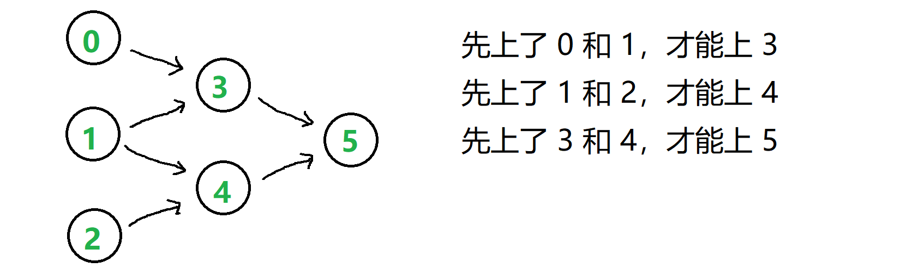

# LEETCODE HOT150

## Reference

- https://leetcode.cn/studyplan/top-interview-150/
- https://leetcode.cn/studyplan/top-100-liked/


## 动态规划

动规遍历的都是子目标

### 爬楼梯

爬楼梯问题的本质：到达子目标的方式有多种，计算到达总目标的方式个数.

- 假设你正在爬楼梯。需要 n 阶你才能到达楼顶。每次你可以爬 1 或 2 个台阶。你有多少种不同的方法可以爬到楼顶呢？[70.爬楼梯](https://leetcode.cn/problems/climbing-stairs/description/)

    - 要爬n阶，则最后到达第n+1个平台
    - dp，长度为n+1，dp[0]=1，dp[1]=1，在第一和第二个平台都就只有一种方式
    - dp[i] = dp[i-1]+dp[i-2]，i>=2
    - 返回dp[-1]


- 给你一个整数数组 cost ，其中 cost[i] 是从楼梯第 i 个台阶向上爬需要支付的费用。一旦你支付此费用，即可选择向上爬一个或者两个台阶。你可以选择从下标为 0 或下标为 1 的台阶开始爬楼梯。请你计算并返回达到楼梯顶部的最低花费。[746.使用最小花费爬楼梯](https://leetcode.cn/problems/min-cost-climbing-stairs/description/)

    - 假设cost的长度为n，则有n+1个平台
    - dp，长度为n+1，dp[0]=0，到达第0个平台的费用，dp[1]=min(cost[0],0)，到达第1个平台的最下费用，dp[2] = min(dp[0]+cost[0],dp[1]+cost[1])
    - dp[i] = min(dp[i-1]+cost[i-1],cost[i-2]+dp[i-2]),i>=3
    - 返回dp[-1]


- 给你一个由 不同 整数组成的数组 nums ，和一个目标整数 target 。请你从 nums 中找出并返回总和为 target 的元素组合的个数。题目数据保证答案符合 32 位整数范围。1 <= nums[i] <= 1000.[377.组合总和IV](https://leetcode.cn/problems/combination-sum-iv/description/)

    - dp,长度为target+1,dp[0]=1，总和为0的元素组合个数（由于nums的数都是正数，所以元素组合=[]时，和为0
    - dp[i] += dp[i-nums[j]] for j in range(len(nums)) if i>=nums[j] 
    - 返回dp[-1]

### 打家劫舍

1. 你是一个专业的小偷，计划偷窃沿街的房屋。每间房内都藏有一定的现金，影响你偷窃的唯一制约因素就是相邻的房屋装有相互连通的防盗系统，如果两间相邻的房屋在同一晚上被小偷闯入，系统会自动报警。给定一个代表每个房屋存放金额的非负整数数组，计算你 不触动警报装置的情况下 ，一夜之内能够偷窃到的最高金额。[198.打家劫舍](https://leetcode.cn/problems/house-robber/description/)

    - dp，长度为房屋数量n，dp[0]=nums[0]，偷第一个房子拿到最多的钱, dp[1] = max(dp[0],nums[1])，偷到第二个房子拿到最多的钱,dp[2] = max(dp[0]+nums[2],dp[1])，偷到第三个房子拿到最多的钱, dp[3] = max(dp[1]+nums[3],dp[2])，偷到第四个房子拿到最多的钱.
    - dp[i] = max(dp[i-2]+nums[i],dp[i-1])，i>=2
    - 返回dp[-1]

2. 你是一个专业的小偷，计划偷窃沿街的房屋，每间房内都藏有一定的现金。这个地方所有的房屋都 围成一圈 ，这意味着第一个房屋和最后一个房屋是紧挨着的。同时，相邻的房屋装有相互连通的防盗系统，如果两间相邻的房屋在同一晚上被小偷闯入，系统会自动报警 。给定一个代表每个房屋存放金额的非负整数数组，计算你 在不触动警报装置的情况下 ，今晚能够偷窃到的最高金额。[213.打家劫舍II](https://leetcode.cn/problems/house-robber-ii/description/)

    - 分类讨论：偷nums[0]和不偷nums[0]
    - 如果偷nums[0]，那么nums[1],nums[n-1]不能偷，那么nums[2]到nums[n-2]按I的方法做就行，后面再加上nums[0]
    - 如果不偷nums[0]，那么nums[1]，nums[n-1]可以偷，那么nums[1]到nums[n-1]按I的方法做就行
    - 最后比较哪个大

3. 小偷又发现了一个新的可行窃的地区。这个地区只有一个入口，我们称之为 root 。除了 root 之外，每栋房子有且只有一个“父“房子与之相连。一番侦察之后，聪明的小偷意识到“这个地方的所有房屋的排列类似于一棵二叉树”。 如果 两个直接相连的房子在同一天晚上被打劫 ，房屋将自动报警。给定二叉树的 root 。返回 在不触动警报的情况下 ，小偷能够盗取的最高金额 。[337.打家劫舍III](https://leetcode.cn/problems/house-robber-iii/description/)

    - 由于知道子目标的结果，才能知道总目标的结果，所以遍历树的形式是自底向上遍历树（后序遍历），遍历返回选和不选的结果
    - 如果选择父节点，那么左右节点就不选，rob = left_not_rob+right_not_rob+node.val, 如果不选父节点，那么左右节点可以选，那么看not_rob = max(left_rob,left_not_rob)+max(right_rob,right_not_rob)
    - 最后回到根节点比较not_rob和rob


### 最大子数组和

1. 给你一个整数数组 nums ，请你找出一个具有最大和的连续子数组（子数组最少包含一个元素），返回其最大和。子数组是数组中的一个连续部分。[53.最大子数组和](https://leetcode.cn/problems/maximum-subarray/description/?envType=study-plan-v2&envId=top-100-liked)

    - 子数组不能使用回溯的选与不选，因为要保持顺序，一般使用拼接的形式
    - 假设nums的长度为n
    - dp的长度为n，dp[0]=nums[0]，以nums[0]结尾的最大子数组和为nums[0]，dp[1]=max(dp[0],0)+nums[1]，以nums[1]结尾的最大子数组和，只有当前面的最大子数组和大于0时，拼接nums[1]才能使子数组的和可能增加.
    - dp[i] = max(dp[i-1],0)+nums[i],i>=2
    - 最后返回max(dp)


5. 给你一个整数数组，返回它的某个 非空 子数组（连续元素）在执行一次可选的删除操作后，所能得到的最大元素总和。换句话说，你可以从原数组中选出一个子数组，并可以决定要不要从中删除一个元素（只能删一次哦），（删除后）子数组中至少应当有一个元素，然后该子数组（剩下）的元素总和是所有子数组之中最大的。注意，删除一个元素后，子数组 不能为空。[1186.删除一次得到子数组最大和](https://leetcode.cn/problems/maximum-subarray-sum-with-one-deletion/description/)


6. 给你一个整数数组 nums ，请你找出数组中乘积最大的非空连续 子数组（该子数组中至少包含一个数字），并返回该子数组所对应的乘积。测试用例的答案是一个 32-位 整数。[152.乘积最大子数组](https://leetcode.cn/problems/maximum-product-subarray/description/)


3. 给定一个整数数组 arr 和一个整数 k ，通过重复 k 次来修改数组。例如，如果 arr = [1, 2] ， k = 3 ，那么修改后的数组将是 [1, 2, 1, 2, 1, 2] 。返回修改后的数组中的最大的子数组之和。注意，子数组长度可以是 0，在这种情况下它的总和也是 0。由于 结果可能会很大，需要返回的 109 + 7 的 模 。[1191.K次串联后最大子数组之和](https://leetcode.cn/problems/k-concatenation-maximum-sum/description/)

4. 给定一个长度为 n 的环形整数数组 nums ，返回 nums 的非空 子数组 的最大可能和 。环形数组 意味着数组的末端将会与开头相连呈环状。形式上， nums[i] 的下一个元素是 nums[(i + 1) % n] ， nums[i] 的前一个元素是 nums[(i - 1 + n) % n] 。子数组 最多只能包含固定缓冲区 nums 中的每个元素一次。形式上，对于子数组 nums[i], nums[i + 1], ..., nums[j] ，不存在 i <= k1, k2 <= j 其中 k1 % n == k2 % n 。[918.环形子数组的最大和](https://leetcode.cn/problems/maximum-sum-circular-subarray/description/)


### 网格DP

1. 给定一个包含非负整数的 m x n 网格 grid ，请找出一条从左上角到右下角的路径，使得路径上的数字总和为最小。说明：每次只能向下或者向右移动一步。[64.最小路径和](https://leetcode.cn/problems/minimum-path-sum/description/)

    - 二维dp，维度为m*n
    - dp[0][0]=grid[0][0]，到达(0,0)的最小路径和为grid[0][0]; dp[0][j] = dp[0][j-1] + grid[0][j],j>=1; dp[i][0] = dp[i-1][0]+grid[i][0],i>=1;
    - dp[i][j] = min(dp[i-1][j],dp[i][j-1])+grid[i][j],i>=1,j>=1;
    - 返回dp[-1][-1]

2. 一个机器人位于一个 m x n 网格的左上角 （起始点在下图中标记为 “Start” ）。机器人每次只能向下或者向右移动一步。机器人试图达到网格的右下角（在下图中标记为 “Finish” ）。问总共有多少条不同的路径？[62.不同路径](https://leetcode.cn/problems/unique-paths/description/)

    - 二维dp

3. 给定一个 m x n 的整数数组 grid。一个机器人初始位于 左上角（即 grid[0][0]）。机器人尝试移动到 右下角（即 grid[m - 1][n - 1]）。机器人每次只能向下或者向右移动一步。网格中的障碍物和空位置分别用 1 和 0 来表示。机器人的移动路径中不能包含 任何 有障碍物的方格。返回机器人能够到达右下角的不同路径数量。测试用例保证答案小于等于 2 * 109。[63.不同路径II](https://leetcode.cn/problems/unique-paths-ii/description/)

4. 在二维网格 grid 上，有 4 种类型的方格：1 表示起始方格。且只有一个起始方格。2 表示结束方格，且只有一个结束方格。0 表示我们可以走过的空方格。-1 表示我们无法跨越的障碍。返回在四个方向（上、下、左、右）上行走时，从起始方格到结束方格的不同路径的数目。每一个无障碍方格都要通过一次，但是一条路径中不能重复通过同一个方格。[980.不同路径III](https://leetcode.cn/problems/unique-paths-iii/description/)

5. 给定一个 m x n 整数矩阵 matrix ，找出其中 最长递增路径 的长度。对于每个单元格，你可以往上，下，左，右四个方向移动。 你 不能 在 对角线 方向上移动或移动到 边界外（即不允许环绕）。[329.矩阵中的最长递增路径](https://leetcode.cn/problems/longest-increasing-path-in-a-matrix/description/)


6. 给你一个 n x n 的网格 grid ，代表一块樱桃地，每个格子由以下三种数字的一种来表示：0 表示这个格子是空的，所以你可以穿过它。1 表示这个格子里装着一个樱桃，你可以摘到樱桃然后穿过它。-1 表示这个格子里有荆棘，挡着你的路。请你统计并返回：在遵守下列规则的情况下，能摘到的最多樱桃数：从位置 (0, 0) 出发，最后到达 (n - 1, n - 1) ，只能向下或向右走，并且只能穿越有效的格子（即只可以穿过值为 0 或者 1 的格子）；当到达 (n - 1, n - 1) 后，你要继续走，直到返回到 (0, 0) ，只能向上或向左走，并且只能穿越有效的格子；当你经过一个格子且这个格子包含一个樱桃时，你将摘到樱桃并且这个格子会变成空的（值变为 0 ）；如果在 (0, 0) 和 (n - 1, n - 1) 之间不存在一条可经过的路径，则无法摘到任何一个樱桃。[741.摘樱桃](https://leetcode.cn/problems/cherry-pickup/description/)


7. 给你一个 rows x cols 的矩阵 grid 来表示一块樱桃地。 grid 中每个格子的数字表示你能获得的樱桃数目。你有两个机器人帮你收集樱桃，机器人 1 从左上角格子 (0,0) 出发，机器人 2 从右上角格子 (0, cols-1) 出发。请你按照如下规则，返回两个机器人能收集的最多樱桃数目：从格子 (i,j) 出发，机器人可以移动到格子 (i+1, j-1)，(i+1, j) 或者 (i+1, j+1) 。当一个机器人经过某个格子时，它会把该格子内所有的樱桃都摘走，然后这个位置会变成空格子，即没有樱桃的格子。当两个机器人同时到达同一个格子时，它们中只有一个可以摘到樱桃。两个机器人在任意时刻都不能移动到 grid 外面。两个机器人最后都要到达 grid 最底下一行。[1463.摘樱桃II](https://leetcode.cn/problems/cherry-pickup-ii/description/)

### 背包问题

- 01背包
    - 核心场景：有 n 个物品和一个容量为 C 的背包。第 i 个物品的重量为 w[i]，价值为 v[i]。每个物品只能选择一次（要么放入背包，要么不放入），求在背包容量不超过 C 的前提下，能装入背包的最大总价值
    - 二维dp，维度为(n+1)*(C+1)，因为要考虑C=0，和全部元素不选的情况；dp[0][0]=0,dp[i][0]=0,dp[0][j]=0; dp[i][j]表示前i个对象性质A的和<=j时性质B的最大和；分类讨论，不选i，dp[i][j]=dp[i-1][j]，选i，要找到能装i对应的位置，dp[i][j] = dp[i-1][j-A[i]]+B[i]；因此，dp[i][j] = max(dp[i-1][j],dp[i-1][j-A[i]]+B[i]); 最后返回dp[-1][-1]
    - 代码：
        ```bash
        def knapsack_01(w, v, C):
            n = len(w)
            # 初始化dp数组（n+1行，C+1列）
            dp = [[0]*(C+1) for _ in range(n+1)]
            
            for i in range(1, n+1):  # 遍历物品
                for j in range(1, C+1):  # 遍历容量
                    # 不选第i个物品
                    dp[i][j] = dp[i-1][j]
                    # 若能选，则取最大值
                    if w[i-1] <= j:  # 注意物品索引从0开始
                        dp[i][j] = max(dp[i][j], dp[i-1][j - w[i-1]] + v[i-1])
            return dp[-1][-1]
        ```
    - 注意这里是`w[i-1]`和`v[i-1]`
    - 判断能不能的问题，返回值是布尔类型；计算最大、最小、方案数等问题，返回值是整型

1. 给你一个 只包含正整数 的 非空 数组 nums 。请你判断是否可以将这个数组分割成两个子集，使得两个子集的元素和相等。[416.分割等和子集](https://leetcode.cn/problems/partition-equal-subset-sum/description/)

    - 如果sum(nums)是奇数，那么不可能分成两个子集的元素和相等
    - 如果sum(nums)是偶数，那么就相当于证明是否存在一些元素可以使元素和=sum(nums)/2
    - 二维dp，假设n=len(nums)，s=sum(nums), dp的维度为(n+1)*(s/2+1)，要考虑s=0，和全部元素不选; dp[i][j]=True 表示前i个元素里面存在元素使得元素和=j；dp[0][0] = True，所有元素都不选的话，和就是0，dp[i][0] = False, dp[0][j] = False; 
    - 如果能选nums[i-1]，dp[i][j] = dp[i-1][j-nums[i-1]]，不选nums[i]，dp[i][j] = dp[i-1][j]；因此dp[i][j] = dp[i-1][j-nums[i-1]] or dp[i-1][j].
    - 返回 dp[-1][-1]

2. 给你一个非负整数数组 nums 和一个整数 target 。向数组中的每个整数前添加 '+' 或 '-' ，然后串联起所有整数，可以构造一个 表达式 ：例如，nums = [2, 1] ，可以在 2 之前添加 '+' ，在 1 之前添加 '-' ，然后串联起来得到表达式 "+2-1" 。返回可以通过上述方法构造的、运算结果等于 target 的不同 表达式 的数目。[494.目标和](https://leetcode.cn/problems/target-sum/description/)

    - 假设s=sum(nums)，添加正号的元素之和为p, 添加负号的元素之和为q，则有 p+q=s，又因为p-q=target，所以有p=(s+target)/2, q=(s-target)/2；只要证明存在元素使得p=(s+target)/2或q=(s-target)/2即可
    - 如果target>=0，那么q<p，则选q=(s-target)/2，dp矩阵维度更小
    - 如果target<0，那么p<q，则选p=(s+target)/2，dp矩阵维度更小
    - 因此只要证明存在元素的元素和=(s-abs(target))/2即可.
    - 二维dp，假设n=len(nums),a=(s-abs(target))/2，dp的维度为(n+1)*(a+1)，要考虑s=0和全部元素不选；dp[i][j] 表示前i个元素元素和=(s-abs(target))/2的方案数; dp[0][0]=1, dp[i][0]=, dp[0][j]=Fales
    - 不选nums[i-1]，dp[i][j] = dp[i-1][j]，如果能选nums[i-1]，则dp[i][j] = dp[i-1][j] + dp[i-1][j-nums[i-1]]
    - 特判：如果s-abs(target)<0，由于nums的数都是非负，则方案数为0
    - 特判：如果s-abs(target)是奇数，则方案数为0

3. 给你一个下标从 0 开始的整数数组 nums 和一个整数 target 。返回和为 target 的 nums 子序列中，子序列 长度的最大值 。如果不存在和为 target 的子序列，返回 -1 。子序列 指的是从原数组中删除一些或者不删除任何元素后，剩余元素保持原来的顺序构成的数组。[2915.和为目标值的最长子序列的长度](https://leetcode.cn/problems/length-of-the-longest-subsequence-that-sums-to-target/description/)

    - 假设n=len(nums)
    - 二维dp，dp的维度为(n+1)*(target+1)；dp[i][j]表示前i个数中和为j的最长子序列长度；注意这里dp初始化是用负无穷，这样可以满足max的逻辑，且不与有效长度混淆；dp[0][0]=0，空序列的和就是0；dp[i][0] = 0，由于nums的数都是正数，因此空序列的和为0；dp[0][j] = -float('inf')；
    - 不选nums[i-1]，dp[i][j] = dp[i-1][j]；如果能选nums[i-1]（nums[i-1]<=j且dp[i-1][j-nums[i]]!=-float('inf')，则dp[i][j] = max(dp[i-1][j],dp[i-1][j-nums[i-1]]+1)


4. 给你两个 正 整数 n 和 x 。请你返回将 n 表示成一些 互不相同 正整数的 x 次幂之和的方案数。换句话说，你需要返回互不相同整数 [n1, n2, ..., nk] 的集合数目，满足 n = n1^x + n2^x + ... + nk^x 。由于答案可能非常大，请你将它对 10^9 + 7 取余后返回。比方说，n = 160 且 x = 3 ，一个表示 n 的方法是 n = 2^3 + 3^3 + 5^3 。[2787.将一个数字表示成幂的和的方案数](https://leetcode.cn/problems/ways-to-express-an-integer-as-sum-of-powers/description/)

    - 二维dp，dp的维度为(n+1)*(n+1)；dp[i][j] 表示前i个数，满足j是某些互不相同的正整数的x次幂之和的方案数; dp[0][0]=1，dp[i][0] = 1, dp[0][j] = 0;
    - 不选nums[i-1]，则dp[i][j] = dp[i-1][j]；如果能够选nums[i-1](nums[i-1]^x<=j)，dp[i][j] = dp[i-1][j] + dp[i-1][j-math.pow(nums[i-1],x)]
    - 由于 (a+b) mod M = ((a mod M) + (b mod M))mod M，所以不选nums[i-1]，则dp[i][j] = dp[i-1][j] % M；如果能够选nums[i-1](nums[i-1]^x<=j)，dp[i][j] = dp[i-1][j] + dp[i-1][j-math.pow(nums[i-1],x)]%M, dp[i][j] = dp[i][j] % M.

- 完全背包
- 零钱兑换
- 完全平方数

### 最长公共子序列（LCS）

1. 给定两个字符串 text1 和 text2，返回这两个字符串的最长 公共子序列 的长度。如果不存在 公共子序列 ，返回 0 。一个字符串的 子序列 是指这样一个新的字符串：它是由原字符串在不改变字符的相对顺序的情况下删除某些字符（也可以不删除任何字符）后组成的新字符串。例如，"ace" 是 "abcde" 的子序列，但 "aec" 不是 "abcde" 的子序列。两个字符串的 公共子序列 是这两个字符串所共同拥有的子序列。[1143.最长公共子序列](https://leetcode.cn/problems/longest-common-subsequence/description/)

    - 假设m=len(text1)，n=len(text2)
    - 二维dp，维度为(m+1)*(n+1)，因为要考虑空串；dp[i][j]表示text1的前i个字符和text2的前j个字符的最长公共子序列; dp[0][0] = 0,dp[i][0] = 0,dp[0][j] = 0;
    - 如果text1[i-1]！=text2[j-1]，那么dp[i][j] = max(dp[i][j-1],dp[i-1][j])；如果text1[i-1]==text2[j-1]，那么dp[i][j] = dp[i-1][j-1]+1

2. 给定两个单词 word1 和 word2 ，返回使得 word1 和  word2 相同所需的最小步数。每步 可以删除任意一个字符串中的一个字符。[583.两个字符串的删除操作](https://leetcode.cn/problems/delete-operation-for-two-strings/description/)

    - 先求出最长公共子序列长度，然后最长公共子序列以外的字符计数就是对应最小步数。

3. 给定两个字符串s1 和 s2，返回 使两个字符串相等所需删除字符的 ASCII 值的最小和 。[712.两个字符串的最小ASCII删除和](https://leetcode.cn/problems/minimum-ascii-delete-sum-for-two-strings/description/)

    - 假设m=len(s1),n=len(s2)
    - 二维dp，维度为(m+1)*(n+1)，因为要考虑空串；dp[i][j]表示s1的前i个字符和s2的前j个字符相等的最小ASIIC删除和;dp[0][0]=0,dp[i][0]=sum(ASIIC_{i}),dp[0][j] = sum(ASIIC_{j})
    - 如果s1[i-1]==s2[j-1]，则dp[i][j] = dp[i-1][j-1]；如果s1[i-1]!=s2[j-1]，则dp[i][j] = min(dp[i-1][j]+ASIIC_{i-1},dp[i][j-1]+ASIIC_{j-1})


4. 给你两个单词 word1 和 word2， 请返回将 word1 转换成 word2 所使用的最少操作数。你可以对一个单词进行如下三种操作：插入一个字符，删除一个字符，替换一个字符。[72.编辑距离](https://leetcode.cn/problems/edit-distance/description/)

    - 从 A 到 B 的一次插入，相当于从 B 到 A 的一次删除（因为两者都是消除了一个字符的差异，操作方向相反但效果相同，所以在计算最小操作次数时，它们的贡献是一样的，因此等价。）
    - 从 B 到 A 的一次插入，相等于从 A 到 B 的一次删除；从 A 到 B 的一次替换，等价于从 B 到 A 的一次替换。
    - 因此等价地就只有三种操作：在A中删除一个元素，在B中删除一个元素，在A中替换一个元素；
    - 假设m=len(word1),n=len(word2)；
    - 二维dp，dp的维度为(m+1)*(n+1)，因为考虑空串；dp[i][j] 表示word1的前i个字符转换成word2所使用的最小操作数; dp[0][0] = 0; dp[i][0] = i; dp[0][j] = j;
    - 如果word1[i-1]==word2[j-1]，那么这个字符可以不动，dp[i][j] = dp[i-1][j-1]；如果word1[i-1]!=word2[j-1]，那么dp[i][j]=min(dp[i-1][j],dp[i][j-1],dp[i-1][j-1])+1（分别对应删除word1[i-1]，删除word2[j-1]，替换word1[i-1]变成word2[j-1]）
    - 返回dp[-1][-1]

5. 给两个整数数组 nums1 和 nums2 ，返回 两个数组中 公共的 、长度最长的子数组的长度 。[718.最长重复子数组](https://leetcode.cn/problems/maximum-length-of-repeated-subarray/description/)

    - 假设m=len(nums1)，n=len(nums2)
    - 二维dp，维度为(m+1)*(n+1)，因为要考虑空串；

与最长公共子序列的区别

- nums1:[0,1,1,1,1]，nums2:[1,0,1,0,1]，最长公共子序列长度为3，最长重复子数组长度为2

- 表的区别

最长公共子序列：
|       |    | 0  | 1  | 1  | 1  | 1  |
|-------|----|----|----|----|----|----|
|       | 0  | 0  | 0  | 0  | 0  | 0  |
| **1** | 0  | 0  | 1  | 1  | 1  | 1  |
| **0** | 0  | 1  | 1  | 1  | 1  | 1  |
| **0** | 0  | 1  | 2  | 2  | 2  | 2  |
| **1** | 0  | 1  | 2  | 2  | 2  | 2  |
| **1** | 0  | 1  | 2  | 3  | 3  | 3  |

最长重复子数组
|       |    | 0  | 1  | 1  | 0  | 1  |
|-------|----|----|----|----|----|----|
|       | 0  | 0  | 0  | 0  | 0  | 0  |
| **1** | 0  | 0  | 1  | 1  | 1  | 1  |
| **0** | 0  | 1  | 1  | 1  | 1  | 1  |
| **1** | 0  | 1  | 2  | 2  | 2  | 2  |
| **0** | 0  | 1  | 2  | 2  | 2  | 2  |
| **1** | 0  | 1  | 2  | 2  | 2  | 3  |

在最后出现最长重复子数组应该时'101'，但是在前面的时候最长重复子数组为'01'占据较多，所以这里不能单纯地用最长公共子序列的方程，因为这里不是简单拼接子序列，而是会出现比较，所以这里最后返回的应该时max(什么)的情况，所以这里dp表应该改为若nums[i-1]==nums[j-1]，则dp[i][j] = dp[i-1][j-1]+1，若nums[i-1]!=nums[j-1]，则dp[i][j] = 0 ，最后返回max(dp)

|       |    | 0  | 1  | 1  | 0  | 1  |
|-------|----|----|----|----|----|----|
|       | 0  | 0  | 0  | 0  | 0  | 0  |
| **1** | 0  | 0  | 1  | 1  | 1  | 1  |
| **0** | 0  | 1  | 0  | 0  | 2  | 0  |
| **1** | 0  | 0  | 2  | 1  | 0  | 3  |
| **0** | 0  | 0  | 0  | 0  | 2  | 0  |
| **1** | 0  | 0  | 1  | 1  | 0  | 3  |


### 最长递增子序列（LIS）

1. 给你一个整数数组 nums ，找到其中最长严格递增子序列的长度。子序列 是由数组派生而来的序列，删除（或不删除）数组中的元素而不改变其余元素的顺序。例如，[3,6,2,7] 是数组 [0,3,1,6,2,2,7] 的子序列。[300.最长递增子序列](https://leetcode.cn/problems/longest-increasing-subsequence/description/)

    - [4,10,4,3,8,9]，这里在前面最长的递增子序列为[4,10]，后面为[3,8,9]，需要换头比较，所有最后返回的是max(什么)
    - 假设n=len(nums)
    - 二维dp，dp的维度为(n)*(n)；dp[i][j]表示存在以nums[i]结尾长度为j的严格递增子序列
    - dp[i][0] = False, dp[i][1] = True；
    - dp[i][j] = True (如果存在 k<i and nums[k]<nums[i],dp[k][j-1]=True)
    - 只要j那一列有一个True，那么长度j就存在，返回最大的j
    - 但是二维会超时，压缩成一维
    - 一维dp，dp的维度为n；dp[i]表示以nums[i]结尾的严格递增子序列长度；初始化，dp[i]=1
    - dp[i] = max(dp[i],dp[k]) for k<i and nums[k]<nums[i]
    - 最后返回max(dp[i])

    - 时间优化，可以用二分来做

2. 给你一个整数数组 nums 。nums 的每个元素是 1，2 或 3。在每次操作中，你可以删除 nums 中的一个元素。返回使 nums 成为 非递减 顺序所需操作数的 最小值。[2826.将三个组排序](https://leetcode.cn/problems/sorting-three-groups/description/)

    - 找出最长公共子序列的长度l，然后len(nums)-l就是答案

3. 假设你是球队的经理。对于即将到来的锦标赛，你想组合一支总体得分最高的球队。球队的得分是球队中所有球员的分数 总和 。然而，球队中的矛盾会限制球员的发挥，所以必须选出一支 没有矛盾 的球队。如果一名年龄较小球员的分数 严格大于 一名年龄较大的球员，则存在矛盾。同龄球员之间不会发生矛盾。给你两个列表 scores 和 ages，其中每组 scores[i] 和 ages[i] 表示第 i 名球员的分数和年龄。请你返回 所有可能的无矛盾球队中得分最高那支的分数 。[1626.无矛盾的最佳球队](https://leetcode.cn/problems/best-team-with-no-conflicts/description/)

    - 先将(age，score)按age进行升序排序，age相同的按升序排列（这样age相同的才能都被选中），接着在socre的序列中计算递增子序列对应的分数，并且找到最大分数


4. 给你一个二维整数数组 envelopes ，其中 envelopes[i] = [wi, hi] ，表示第 i 个信封的宽度和高度。当另一个信封的宽度和高度都比这个信封大的时候，这个信封就可以放进另一个信封里，如同俄罗斯套娃一样。请计算 最多能有多少个 信封能组成一组“俄罗斯套娃”信封（即可以把一个信封放到另一个信封里面）。注意：不允许旋转信封。[354.俄罗斯套娃信封问题](https://leetcode.cn/problems/russian-doll-envelopes/description/)

    - 先将(w,h)按w进行升序排序，w相同的按降序排列（避免w相同的被同时选中），接着在h的序列中找到最长递增子序列长度.

    - 超时了，找最长递增子序列长度的部分用二分来做

5. 给你 n 个长方体 cuboids ，其中第 i 个长方体的长宽高表示为 cuboids[i] = [widthi, lengthi, heighti]（下标从 0 开始）。请你从 cuboids 选出一个 子集 ，并将它们堆叠起来。如果 widthi <= widthj 且 lengthi <= lengthj 且 heighti <= heightj ，你就可以将长方体 i 堆叠在长方体 j 上。你可以通过旋转把长方体的长宽高重新排列，以将它放在另一个长方体上。返回 堆叠长方体 cuboids 可以得到的 最大高度 。[1691.堆叠长方体的最大高度](https://leetcode.cn/problems/maximum-height-by-stacking-cuboids/description/)

 

### 最长回文子序列

1. 给你一个字符串 s ，找出其中最长的回文子序列，并返回该序列的长度。子序列定义为：不改变剩余字符顺序的情况下，删除某些字符或者不删除任何字符形成的一个序列。[516.最长回文子序列](https://leetcode.cn/problems/longest-palindromic-subsequence/description/)


### 最优划分

### 状态机


### 前后缀转移DP

- 最低票价
- 最低加油次数

### 不相交区间

- 规划兼职工作
- 最多可以参加的会议数目


### 状压 DP

- 优美的排列
- 最小不兼容性
- 最短超级串
- 访问所有节点的最短路径

### 跳跃游戏

### 数位DP

### 树形DP

- 监控二叉树
- 最小高度树

### 前后缀分解
2. 给你一个整数数组 nums，返回 数组 answer ，其中 answer[i] 等于 nums 中除 nums[i] 之外其余各元素的乘积 。题目数据 保证 数组 nums之中任意元素的全部前缀元素和后缀的乘积都在  32 位 整数范围内。请 不要使用除法，且在 O(n) 时间复杂度内完成此题。[238.除自身以外数组的乘积](https://leetcode.cn/problems/product-of-array-except-self/description/?envType=study-plan-v2&envId=top-100-liked)


## DFS


adj_matrix：邻接矩阵，两个节点有边，则邻居矩阵为1，否则为0
```bash
n = len(adj_matrix)
stack = [start]
visited = set()
while stack:
    node = stack.pop()
    if node not in visited:
        visited.append(node)
        # 这里for循环要在if内，避免节点重复进入stack
        # 比如1和2是邻居，1先入栈，接着就是2入栈，如果for在if外，那么下一次1又会入栈，从而导致死循环
        for i in range(len(adj_matrix[node])):
            if adj_matrix[node][i] and i!=node:
                stack.append(i)
```

```bash
def dfs(node):
    if node not in visited:
        visited.add(node)
        for i in range(len(adj_matrix[node])):
            if adj_matrix[node][i] and i!=node:
                dfs(i)
```


1. 有一个具有 n 个顶点的 双向 图，其中每个顶点标记从 0 到 n - 1（包含 0 和 n - 1）。图中的边用一个二维整数数组 edges 表示，其中 edges[i] = [ui, vi] 表示顶点 ui 和顶点 vi 之间的双向边。 每个顶点对由 最多一条 边连接，并且没有顶点存在与自身相连的边。请你确定是否存在从顶点 source 开始，到顶点 destination 结束的 有效路径 。给你数组 edges 和整数 n、source 和 destination，如果从 source 到 destination 存在 有效路径 ，则返回 true，否则返回 false 。[1971.寻找图中是否存在路径](https://leetcode.cn/problems/find-if-path-exists-in-graph/description/)

    - 无向图的建图，两边都要建，从source开始DFS，如果最后遍历结束，destination在visited中，则True

2. 给你一个有 n 个节点的 有向无环图（DAG），请你找出从节点 0 到节点 n-1 的所有路径并输出（不要求按特定顺序）。graph[i] 是一个从节点 i 可以访问的所有节点的列表（即从节点 i 到节点 graph[i][j]存在一条有向边）。[797.所有可能的路径](https://leetcode.cn/problems/all-paths-from-source-to-target/description/)

    - 以0为起点的DFS
    - 因为这里要得到路径，所以这里要用递归写法的DFS，这里不使用visited，因为要记录路径，加入path数组，在dfs中，如果path[-1]==n-1，那么result加入path的副本，然后return，如果不等于，遍历node的nei在dfs前path.append(nei)，在dfs后path.pop()


DFS寻找连通分量个数

```bash
num = 0
while node_set:
    start = node_set.pop()
    node_set.add(start)
    stack = [start]
    visited = set()
    while stack:
        node = stack.pop()
        if node not in visited:
            visited.add(node)
            for nei in graph[node]:
                stack.append(nei)
    num += 1
    node_set = node_set - visited
```


3. 有 n 个城市，其中一些彼此相连，另一些没有相连。如果城市 a 与城市 b 直接相连，且城市 b 与城市 c 直接相连，那么城市 a 与城市 c 间接相连。省份 是一组直接或间接相连的城市，组内不含其他没有相连的城市。给你一个 n x n 的矩阵 isConnected ，其中 isConnected[i][j] = 1 表示第 i 个城市和第 j 个城市直接相连，而 isConnected[i][j] = 0 表示二者不直接相连。返回矩阵中 省份 的数量。[547.省份数量](https://leetcode.cn/problems/number-of-provinces/description/)

    - 用一个node_set存放所有节点
    - 从node_set里面随机抽取一个node，以这个node为起点做dfs，访问到一个节点，就将这个节点从node_set中移除，dfs结束之后省份数量+1，接着又从node_set里面抽取一个node，重复前述步骤


4. 有 n 个房间，房间按从 0 到 n - 1 编号。最初，除 0 号房间外的其余所有房间都被锁住。你的目标是进入所有的房间。然而，你不能在没有获得钥匙的时候进入锁住的房间。当你进入一个房间，你可能会在里面找到一套 不同的钥匙，每把钥匙上都有对应的房间号，即表示钥匙可以打开的房间。你可以拿上所有钥匙去解锁其他房间。给你一个数组 rooms 其中 rooms[i] 是你进入 i 号房间可以获得的钥匙集合。如果能进入 所有 房间返回 true，否则返回 false。[841.钥匙和房间](https://leetcode.cn/problems/keys-and-rooms/description/)

    - 检测连通分量个数，如果连通分量个数大于1，那么则无法访问所有房间


并查集寻找连通分量

```bash


```

5. 给你一个整数 n ，表示一张 无向图 中有 n 个节点，编号为 0 到 n - 1 。同时给你一个二维整数数组 edges ，其中 edges[i] = [ai, bi] 表示节点 ai 和 bi 之间有一条 无向 边。请你返回 无法互相到达 的不同 点对数目 。[2316.统计无向图中无法互相到达点对数](https://leetcode.cn/problems/count-unreachable-pairs-of-nodes-in-an-undirected-graph/description/)


6. 用以太网线缆将 n 台计算机连接成一个网络，计算机的编号从 0 到 n-1。线缆用 connections 表示，其中 connections[i] = [a, b] 连接了计算机 a 和 b。网络中的任何一台计算机都可以通过网络直接或者间接访问同一个网络中其他任意一台计算机。给你这个计算机网络的初始布线 connections，你可以拔开任意两台直连计算机之间的线缆，并用它连接一对未直连的计算机。请你计算并返回使所有计算机都连通所需的最少操作次数。如果不可能，则返回 -1 。[1319.连通网络的操作数](https://leetcode.cn/problems/number-of-operations-to-make-network-connected/description/)

    - 

4. 给定一个列表 accounts，每个元素 accounts[i] 是一个字符串列表，其中第一个元素 accounts[i][0] 是 名称 (name)，其余元素是 emails 表示该账户的邮箱地址。现在，我们想合并这些账户。如果两个账户都有一些共同的邮箱地址，则两个账户必定属于同一个人。请注意，即使两个账户具有相同的名称，它们也可能属于不同的人，因为人们可能具有相同的名称。一个人最初可以拥有任意数量的账户，但其所有账户都具有相同的名称。合并账户后，按以下格式返回账户：每个账户的第一个元素是名称，其余元素是 按字符 ASCII 顺序排列 的邮箱地址。账户本身可以以 任意顺序 返回。[721.账户合并](https://leetcode.cn/problems/accounts-merge/description/)

5. 有一个有 n 个节点的有向图，节点按 0 到 n - 1 编号。图由一个 索引从 0 开始 的 2D 整数数组 graph表示， graph[i]是与节点 i 相邻的节点的整数数组，这意味着从节点 i 到 graph[i]中的每个节点都有一条边。如果一个节点没有连出的有向边，则该节点是 终端节点 。如果从该节点开始的所有可能路径都通向 终端节点（或另一个安全节点），则该节点为 安全节点。返回一个由图中所有 安全节点 组成的数组作为答案。答案数组中的元素应当按 升序 排列。[802.找到最终的安全状态](https://leetcode.cn/problems/find-eventual-safe-states/description/)


## BFS


```bash
visited = set()
queue = [start]
visited.add(start)
while queue:
    node = queue[0]
    queue = queue[1:]
    for nei in graph[node]:
        if nei not in visited:
            visited.add(nei)
            queue.append(nei)

```

1. 你这个学期必须选修 numCourses 门课程，记为 0 到 numCourses - 1 。在选修某些课程之前需要一些先修课程。 先修课程按数组prerequisites 给出，其中 prerequisites[i] = [ai, bi] ，表示如果要学习课程 ai 则 必须 先学习课程  bi 。例如，先修课程对 [0, 1] 表示：想要学习课程 0 ，你需要先完成课程 1 。请你判断是否可能完成所有课程的学习？如果可以，返回 true ；否则，返回 false 。[207.课程表](https://leetcode.cn/problems/course-schedule/description/)

    - 
    - 每次只能选入度为 0 的课，因为它不依赖别的课，是当下你能上的课。假设选了 0，课 3 的先修课少了一门，入度由 2 变 1。接着选 1，导致课 3 的入度变 0，课 4 的入度由 2 变 1。接着选 2，导致课 4 的入度变 0。现在，课 3 和课 4 的入度为 0。继续选入度为 0 的课……直到选不到入度为 0 的课
    - 用字典建邻接矩阵，并且用一个数组记录每一个节点的入度，首先先让入度为0的节点进入队列，然后依次出队列，已完成的课程数+1，接着其邻居的入度-1，并且入度为0的邻居入队列，最后已完成的课程数==所有课程数（节点），则True，否则False


    - 

## 网格DFS

1. 给你一个由 '1'（陆地）和 '0'（水）组成的的二维网格，请你计算网格中岛屿的数量。岛屿总是被水包围，并且每座岛屿只能由水平方向和/或竖直方向上相邻的陆地连接形成。此外，你可以假设该网格的四条边均被水包围。

    - 网格图 grid ,m = len(grid), n = len(grid[0]), (x,y) ，x:0-n, y:0-m
    - 遍历grid[i][j]，如果grid[i][j]=='1'，那么做DFS，上下左右方向为'1'的才能做邻居
    - DFS断了，就算一个陆地

## 数论

## 双指针

> 如果是原地修改，用快慢指针，慢指针用于写，快指针用于读

1. 给你两个按 非递减顺序 排列的整数数组 nums1 和 nums2，另有两个整数 m 和 n ，分别表示 nums1 和 nums2 中的元素数目。请你 合并 nums2 到 nums1 中，使合并后的数组同样按 非递减顺序 排列。注意：最终，合并后数组不应由函数返回，而是存储在数组 nums1 中。为了应对这种情况，nums1 的初始长度为 m + n，其中前 m 个元素表示应合并的元素，后 n 个元素为 0 ，应忽略。nums2 的长度为 n 。[LC88](合并两个有序数组)(https://leetcode.cn/problems/merge-sorted-array/description/?envType=study-plan-v2&envId=top-interview-150)


同向指针，从右边往左边

```python
for i in range(m,m+n):
        nums1[i] = nums2[i-m]
    # 不能用sort(nums1)，这个方法是返回一个新的数组
    nums1.sort()
```
    - 如果不用sort方法呢？
    - 两个数组都是非递减的，那么可以从尾巴开始比较，i=m-1,j=n-1,p=m+n-1
    - 如果nums1[i]>nums2[j]，那么把nums[i]放到p的位置，i--,j不动，p--，循环比较，直到p<0,i<0,j<0
    - 注意如果i<0，就是nums1的数已经比较完了，直接把nums2的数把空位补好，如果j<0，同理
    - while循环判断p>=0，依次判断i<0 and j>=0，j<0 and i<=0 ,i<=0 and j<=0, i>=0,j>=0的情况.

2. 给你一个数组 nums 和一个值 val，你需要 原地 移除所有数值等于 val 的元素。元素的顺序可能发生改变。然后返回 nums 中与 val 不同的元素的数量。假设 nums 中不等于 val 的元素数量为 k，要通过此题，您需要执行以下操作：更改 nums 数组，使 nums 的前 k 个元素包含不等于 val 的元素。nums 的其余元素和 nums 的大小并不重要。返回 k。[LC27移除元素](https://leetcode.cn/problems/remove-element/description/?envType=study-plan-v2&envId=top-interview-150)

同向指针，快慢指针，慢指针用于写，快指针用于读

    - 慢指针i=0，快指针j=0，i用于写，j用于读，k=0记录
    - 如果nums[j]==val，不需要写，故i不动，j++，如果nums[j]!=val，需要写，故nums[i]=nums[j]，i++,j++,k++
    - 可见j一直要加所以，可以用for循环

3. 给你一个 非严格递增排列 的数组 nums ，请你 原地 删除重复出现的元素，使每个元素 只出现一次 ，返回删除后数组的新长度。元素的 相对顺序 应该保持 一致 。然后返回 nums 中唯一元素的个数。考虑 nums 的唯一元素的数量为 k ，你需要做以下事情确保你的题解可以被通过：更改数组 nums ，使 nums 的前 k 个元素包含唯一元素，并按照它们最初在 nums 中出现的顺序排列。nums 的其余元素与 nums 的大小不重要。
返回 k 。[LC26删除有序数组中的重复项](https://leetcode.cn/problems/remove-duplicates-from-sorted-array/description/?envType=study-plan-v2&envId=top-interview-150)

    - 慢指针i=1，快指针j=1，i用于写，j用于读，k=1记录，val用于记录前一个访问的数
    - 如果nums[j]==val，不需要写，故i不动，j++，如果nums[j]!=val，需要写，故nums[i]=nums[j]，i++,j++,k++,val=nums[j]
    - 可见j一直要加所以，可以用for循环
    - 注意这里val要存一个值，先存nums[0]，所以第一个数就不动了，故i，j，k从1开始
    - 这里可以不特判，如果数组长度为1，那么直接返回k=1

4. 给你一个有序数组 nums ，请你 原地 删除重复出现的元素，使得出现次数超过两次的元素只出现两次 ，返回删除后数组的新长度。不要使用额外的数组空间，你必须在 原地 修改输入数组 并在使用 O(1) 额外空间的条件下完成。[LC80删除有序数组中的重复项II](https://leetcode.cn/problems/remove-duplicates-from-sorted-array-ii/description/?envType=study-plan-v2&envId=top-interview-150)

    - 慢指针i=2，快指针j=2，i用于写，j用于读，val用于记录前一个访问的数，valn记录是否和val相对次数为2
    - 如果nums[j]==val且valn>=2，不需要写，故i不动，j++,valn++，如果nums[j]==val且valn<2，需要写，故i++，j++,valn++，如果nums[j]!=val，需要写，故nums[i]=nums[j]，i++,j++,val=nums[j],valn=1
    - 可见j一直要加所以，可以用for循环
    - 注意这里前两个数可以直接不动了，故i，j从2开始
    - i最后写完的位置是新数组的最后一个下标+1，故返回i
    - 注意这里要特判，因为我们的指针从2开始，如果数组长度小于等于2的数组，直接返回数组长度·


5. 如果在将所有大写字符转换为小写字符、并移除所有非字母数字字符之后，短语正着读和反着读都一样。则可以认为该短语是一个 回文串 。

字母和数字都属于字母数字字符。

给你一个字符串 s，如果它是 回文串 ，返回 true ；否则，返回 false 。


6. 给定一个数组 nums，编写一个函数将所有 0 移动到数组的末尾，同时保持非零元素的相对顺序。请注意 ，必须在不复制数组的情况下原地对数组进行操作。[283移动零](https://leetcode.cn/problems/move-zeroes/description/?envType=study-plan-v2&envId=top-100-liked)


    - 读写指针，一个用来读，一个用来写，都从0开始
    - 遍历数组，读到不是0的，写指针的位置写上该数字，写指针+1，读指针+1，读到是0的，写指针不动，读指针+1。全部读完之后，写指针的位置后面把0补全

7. 给定一个长度为 n 的整数数组 height 。有 n 条垂线，第 i 条线的两个端点是 (i, 0) 和 (i, height[i]) 。找出其中的两条线，使得它们与 x 轴共同构成的容器可以容纳最多的水。返回容器可以储存的最大水量。说明：你不能倾斜容器。[11盛最多水的容器](https://leetcode.cn/problems/container-with-most-water/description/?envType=study-plan-v2&envId=top-100-liked)

    - 首尾指针，
    - 如果左指针的高度小于右指针的高度，如果此时只改变右指针，那么答案只会变小，不会变大，因为高度不变，宽度变小。因此此时要改变左指针，右指针不变
    - 如果右指针的高度小于左指针的高度，如果此时只改变左指针，那么答案只会变小，不会变大，因为高度不变，宽度变小。因此此时要改变右指针，左指针不变
    - 先比答案，再走指针，如果先走指针，再比答案，那么最开始的那一次答案，不能被记录下来


8. 给你一个整数数组 nums ，判断是否存在三元组 [nums[i], nums[j], nums[k]] 满足 i != j、i != k 且 j != k ，同时还满足 nums[i] + nums[j] + nums[k] == 0 。请你返回所有和为 0 且不重复的三元组。
注意：答案中不可以包含重复的三元组。[15三数之和](https://leetcode.cn/problems/3sum/description/?envType=study-plan-v2&envId=top-100-liked)

    - 由小到大排序数组
    - i:遍历数组获得，作为三元组最小的数，如果nums[i]为正数，那么后面的j,k构成的和大于0，可以不用继续遍历了
    - j:从i+1开始，k：从len(nums)-1开始，
        - 如果nums[i]+(nums[j]+nums[k])<0,则j往右边移动，增大和
        - 如果nums[i]+(nums[j]+nums[k])>0,则k往左边移动, 减小和
        - 如果nums[i]+(nums[j]+nums[k])=0,则j往右边移动，k往左边移动，继续寻找
    - 答案中不可以包含重复的三元组，使用字符串存数组信息，后续再解码

9. 给定 n 个非负整数表示每个宽度为 1 的柱子的高度图，计算按此排列的柱子，下雨之后能接多少雨水。[42接雨水](https://leetcode.cn/problems/trapping-rain-water/description/?envType=study-plan-v2&envId=top-100-liked)   

    - 一格一格地思考
    - 首尾指针left，right
    - left_max记录left走过最高的，right_max记录right走过最高的
    - while循环，每次循环开头更新right_max=max(right_max,height[right])和left_max=max(left_height,height[left])
        - 如果height[left]<height[right]，此时也有left_max<right_max，对于left目前的格子，它能装的水为 left_max-left_height，记录后left继续往右走，并更新left_max
        - 如果height[left]>=height[right]，此时也有left_max>=right_max，则对于right目前的格子，它能装的水为 right_max-right_height，记录后right继续往左走，并更新right_max
    - 当left=right时，结束

## 滑动窗口

- 最长/最短子数组问题，用滑窗

1. 给定一个字符串 s ，请你找出其中不含有重复字符的 最长 子串 的长度。[3.无重复字符的最长子串](https://leetcode.cn/problems/longest-substring-without-repeating-characters/description/?envType=study-plan-v2&envId=top-100-liked)

    - 不定长滑动窗口，最长型
    - 从起点出发,i=j=0，哈希表记录i和j之间的包括i，j的元素最近一次出现的索引
    - j往右走，如果nums[j]在哈希表中出现过，则i走到max(i,对应的索引+1)的位置，并记录子串长度

2. 给定两个字符串 s 和 p，找到 s 中所有 p 的 异位词 的子串，返回这些子串的起始索引。不考虑答案输出的顺序。[438.找到字符串中所有字母异位词](https://leetcode.cn/problems/find-all-anagrams-in-a-string/description/?envType=study-plan-v2&envId=top-100-liked)

    - 定长滑动窗口
    - 从起点出发，i=j=0，
    - j往右走，i=j-p的长度+1，如果j-i+1的长度小于p的长度，j继续往右边走，当j-i+1等于p的长度时，对s[i:j]排序，如果s[i:j]=p的排序，那么可以记录i.


3. 给定一个含有 n 个正整数的数组和一个正整数 target 。找出该数组中满足其总和大于等于 target 的长度最小的 子数组 [numsl, numsl+1, ..., numsr-1, numsr] ，并返回其长度。如果不存在符合条件的子数组，返回 0 。[209.长度最小的子数组](https://leetcode.cn/problems/minimum-size-subarray-sum/description/)

    - 不定长滑动窗口，最短型
    - 从起点出发，i=j=0，
    - 当nums[i:j+1]小于target时，j往右走，当nums[i:j+1]的和大于等于target（注意这里用current_sum来计算，否则容易超时）时，记录长度，并让i往右边走，直到nums[i:j+1]小于target
    - min_len初始化为float('inf')

4. 给你一个整数数组 nums 和一个整数 k ，找出 nums 中和至少为 k 的 最短非空子数组 ，并返回该子数组的长度。如果不存在这样的 子数组 ，返回 -1 。子数组 是数组中 连续 的一部分。[862.和至少为k的最短子数组](https://leetcode.cn/problems/shortest-subarray-with-sum-at-least-k/description/)


5. 给你一个字符串 s 、一个字符串 t 。返回 s 中涵盖 t 所有字符的最小子串。如果 s 中不存在涵盖 t 所有字符的子串，则返回空字符串 "" 。[76.最小覆盖子串](https://leetcode.cn/problems/minimum-window-substring/description/?envType=study-plan-v2&envId=top-100-liked)

    - 不定长滑动窗口，最短型

## 前缀和

1. 给定一个整数数组  nums，处理以下类型的多个查询:计算索引 left 和 right （包含 left 和 right）之间的 nums 元素的 和 ，其中 left <= right 实现 NumArray 类：NumArray(int[] nums) 使用数组 nums 初始化对象 int sumRange(int i, int j) 返回数组 nums 中索引 left 和 right 之间的元素的 总和 ，包含 left 和 right 两点（也就是 nums[left] + nums[left + 1] + ... + nums[right] ）[303.区域和检索-数组不可变](https://leetcode.cn/problems/range-sum-query-immutable/description/)

    - init方法用于构造前缀和数组 s ,s的大小为len(nums)+1, s[i+1]=s[i]+nums[i],0<=i<=len(nums)-1
    - sumRange方法用于计算区间之间的和，sum[i:j+1]=s[j+1]-s[i]

2. 给你一个整数数组 nums 和一个整数 k ，请你统计并返回 该数组中和为 k 的子数组的个数 。子数组是数组中元素的连续非空序列。[560.和为 K 的子数组](https://leetcode.cn/problems/subarray-sum-equals-k/description/?envType=study-plan-v2&envId=top-100-liked)

    - 由于数组不是单调的，用不了滑动窗口
    - 计算数组的前缀和数组，那么我们想找到sum[区间]=s[j]-s[i]=k，类似两数之和，遍历右边j，将左边的数s[i]用哈希存起来，如果s[j]-k在哈希表中，那么就是和为k的子数组

1. 给你一个整数数组 nums ，请你找出一个具有最大和的连续子数组（子数组最少包含一个元素），返回其最大和。子数组是数组中的一个连续部分。[53.最大子数组和](https://leetcode.cn/problems/maximum-subarray/description/?envType=study-plan-v2&envId=top-100-liked)

    - 一维前缀和+股票买卖最佳时机


2. 给定一个二维矩阵 matrix，以下类型的多个请求：计算其子矩形范围内元素的总和，该子矩阵的 左上角 为 (row1, col1) ，右下角 为 (row2, col2) 。
实现 NumMatrix 类：NumMatrix(int[][] matrix) 给定整数矩阵 matrix 进行初始化。int sumRegion(int row1, int col1, int row2, int col2) 返回 左上角 (row1, col1) 、右下角 (row2, col2) 所描述的子矩阵的元素 总和 。[304.二维区域和检索-矩阵不可变](https://leetcode.cn/problems/range-sum-query-2d-immutable/description/)

2. 给你一个 m x n 的矩阵 matrix 和一个整数 k ，找出并返回矩阵内部矩形区域的不超过 k 的最大数值和。题目数据保证总会存在一个数值和不超过 k 的矩形区域。[363.矩形区域不超过K的最大值和](https://leetcode.cn/problems/max-sum-of-rectangle-no-larger-than-k/description/)

    - 二维前缀和


## 排序

1. 以数组 intervals 表示若干个区间的集合，其中单个区间为 intervals[i] = [starti, endi] 。请你合并所有重叠的区间，并返回 一个不重叠的区间数组，该数组需恰好覆盖输入中的所有区间 。[56. 合并区间](https://leetcode.cn/problems/merge-intervals/description/?envType=study-plan-v2&envId=top-100-liked)

## 二分查找

二分查找推荐用开区间的写法，即开始left=-1,right=len(nums)，在left=right的时候终止查找，二分查找的数组一般是有序的

1. 给定一个排序数组和一个目标值，在数组中找到目标值，并返回其索引。如果目标值不存在于数组中，返回它将会被按顺序插入的位置。请必须使用时间复杂度为 O(log n) 的算法。[35.搜索插入位置](https://leetcode.cn/problems/search-insert-position/description/?envType=study-plan-v2&envId=top-100-liked)

    - 即找到>=target的第一个数
    - left = -1, right = len(nums)
    - mid = (left + right)//2,如果nums[mid]>=target,那么mid右边的数都>=target，这时right = mid，如果nums[mid]<target，那么mid的左边的数都是<target，这是left=mid;当left+1=right时，查找暂停，最后right就是对应>=target的第一个数

2. 给你一个满足下述两条属性的 m*n 整数矩阵：每行中的整数从左到右按非严格递增顺序排列。每行的第一个整数大于前一行的最后一个整数。给你一个整数 target ，如果 target 在矩阵中，返回 true ；否则，返回 false 。[74.搜索二维矩阵](https://leetcode.cn/problems/search-a-2d-matrix/description/?envType=study-plan-v2&envId=top-100-liked)

    - 将矩阵拉成一维数组，left = -1,right = m*n
    - mid=(left+right)//2, 则对应的row=mid//n,col=mid%n,若target<matrix[row][col]，则right=mid，若target>matrix[row][col]，则left=mid，若等于则返回True；当left+1=right时，查找暂停

3. 给你一个按照非递减顺序排列的整数数组 nums，和一个目标值 target。请你找出给定目标值在数组中的开始位置和结束位置。如果数组中不存在目标值 target，返回 [-1, -1]。你必须设计并实现时间复杂度为 O(log n) 的算法解决此问题。[34.在排序数组中查找第一个和最后一个位置](https://leetcode.cn/problems/find-first-and-last-position-of-element-in-sorted-array/description/?envType=study-plan-v2&envId=top-100-liked)

    - 即找到>=target的第一个数对应的下标index1，和>=target+1的第一个数对应的下标index2，index1就是第一个位置，index2-1就是最后一个位置

4. 已知一个长度为 n 的数组，预先按照升序排列，经由 1 到 n 次 旋转 后，得到输入数组。例如，原数组 nums = [0,1,2,4,5,6,7] 在变化后可能得到：若旋转 4 次，则可以得到 [4,5,6,7,0,1,2]；若旋转 7 次，则可以得到 [0,1,2,4,5,6,7]。注意，数组 [a[0], a[1], a[2], ..., a[n-1]] 旋转一次 的结果为数组 [a[n-1], a[0], a[1], a[2], ..., a[n-2]]。给你一个元素值 互不相同 的数组 nums ，它原来是一个升序排列的数组，并按上述情形进行了多次旋转。请你找出并返回数组中的 最小元素。你必须设计一个时间复杂度为 O(log n) 的算法解决此问题。[153.寻找旋转排序数组中的最小值](https://leetcode.cn/problems/find-minimum-in-rotated-sorted-array/description/?envType=study-plan-v2&envId=top-100-liked)

    - left = -1,right = len(nums),mid = (left+right)//2
    - mid和最后一个数比，如果nums[mid]<nums[n-1]，那么最小值一定在mid的左边，此时right = mid, 如果nums[mid]>nums[n-1]，那么最小值一定在mid的右边，此时left = mid，当left+1=right时，查找结果；最后比较left和right，哪个更新返回哪个

5. 整数数组 nums 按升序排列，数组中的值 互不相同 。在传递给函数之前，nums 在预先未知的某个下标 k（0 <= k < nums.length）上进行了 旋转，使数组变为 [nums[k], nums[k+1], ..., nums[n-1], nums[0], nums[1], ..., nums[k-1]]（下标 从 0 开始 计数）。例如， [0,1,2,4,5,6,7] 在下标 3 处经旋转后可能变为 [4,5,6,7,0,1,2] 。给你 旋转后 的数组 nums 和一个整数 target ，如果 nums 中存在这个目标值 target ，则返回它的下标，否则返回 -1 。你必须设计一个时间复杂度为 O(log n) 的算法解决此问题。[33.搜索旋转排序数组](https://leetcode.cn/problems/search-in-rotated-sorted-array/description/?envType=study-plan-v2&envId=top-100-liked)

    - left = -1,right=len(nums),mid=(left+right)//2
    - target先和最后一个数比，如果target<=nums[n-1]，那么target在nums[n-1]的左边，如果nums[mid]<target或者nums[mid]>=target但是nums[mid]>nums[n-1]，那么target在mid的右边，此时left = mid，如果nums[mid]>target但是nums[mid]<=nums[n-1]，那么target在mid的左边，此时right=mid
    - 如果target>nums[n-1]，那么target在nums[0]的右边，如果nums[mid]<target但是nums[mid]>nums[n-1]，那么target在mid的右边，此时left = mid，如果nums[mid]>target或者nums[mid]<target但是nums[mid]<nums[n-1]，那么target在mid的左边，此时right=mid.
    - 最后看left和right哪个等于target返回哪个
    

## 哈希

1. 给定一个整数数组 nums 和一个整数目标值 target，请你在该数组中找出 和为目标值 target  的那 两个 整数，并返回它们的数组下标。你可以假设每种输入只会对应一个答案，并且你不能使用两次相同的元素。你可以按任意顺序返回答案。[1两数之和](https://leetcode.cn/problems/two-sum/description/?envType=study-plan-v2&envId=top-100-liked)

    - 一个指针，一个哈希表，指针往右边走一个，看看哈希表里面有没有和指针数相加和等于target的数，有就返回答案，没有指针数就在哈希里存一下，


## 数学

5. 给定一个整数数组 nums，将数组中的元素向右轮转 k 个位置，其中 k 是非负数。[LC189轮转数组](https://leetcode.cn/problems/rotate-array/description/?envType=study-plan-v2&envId=top-interview-150)

    - 每个下标i轮转k之后得到得新下标为 (i+k)%len(nums)
    - 0+3->3,6+3%7->2
    - 注意要先用一个temp数组储存nums原来的数
    - 特判: k=0时，i%len(nums)=i，没错，len(nums)=1是，假设k=3，(0+3)%1 = 0，没错


## 链表

1. 给你两个单链表的头节点 headA 和 headB ，请你找出并返回两个单链表相交的起始节点。如果两个链表不存在相交节点，返回 null 。[LC160相交链表](https://leetcode.cn/problems/intersection-of-two-linked-lists/description/?envType=study-plan-v2&envId=top-100-liked)

    - 如果两个链表有交点，那么链表A首尾相连，链表B首尾相连之后，就会出现两个环，那么先遍历

2. 给你单链表的头节点 head ，请你反转链表，并返回反转后的链表。[LC206反转链表](https://leetcode.cn/problems/reverse-linked-list/description/?envType=study-plan-v2&envId=top-100-liked)

    - 类似于树的自底向上遍历
    - 1->2->3->4->5往下一直递归，一直递归到最后一个节点5返回，并记录新的头节点，然后改变5的next和4的next，变为1->2->3->4<-5，递归返回4，接着改变4的next和3的next，变为1->2->3<-4<-5，以此类推


3. 给你一个单链表的头节点 head ，请你判断该链表是否为回文链表。如果是，返回 true ；否则，返回 false 。[LC234回文链表](https://leetcode.cn/problems/palindrome-linked-list/description/?envType=study-plan-v2&envId=top-100-liked)

    - 找来一个节点先记录头节点
    - 然后一直递归到最后一个节点，比较最后一个和头节点，然后递归返回，头节点变为头节点.next，然后接着比较递归到的节点和目前头节点，以此类推

4. 给你一个链表的头节点 head ，判断链表中是否有环。如果链表中有某个节点，可以通过连续跟踪 next 指针再次到达，则链表中存在环。 为了表示给定链表中的环，评测系统内部使用整数 pos 来表示链表尾连接到链表中的位置（索引从 0 开始）。注意：pos 不作为参数进行传递 。仅仅是为了标识链表的实际情况。如果链表中存在环 ，则返回 true 。 否则，返false 。[LC141环形链表](https://leetcode.cn/problems/linked-list-cycle/description/?envType=study-plan-v2&envId=top-100-liked)

    - 一直往下递归，记录访问的节点，如果往下递归遇到访问过的节点，则有环，如果往下递归最终遇到None，说明没有环

    
5. 给定一个链表的头节点  head ，返回链表开始入环的第一个节点。 如果链表无环，则返回 null。如果链表中有某个节点，可以通过连续跟踪 next 指针再次到达，则链表中存在环。 为了表示给定链表中的环，评测系统内部使用整数 pos 来表示链表尾连接到链表中的位置（索引从 0 开始）。如果 pos 是 -1，则在该链表中没有环。注意：pos 不作为参数进行传递，仅仅是为了标识链表的实际情况。不允许修改 链表。[LC142环形链表II](https://leetcode.cn/problems/linked-list-cycle-ii/description/?envType=study-plan-v2&envId=top-100-liked)

    - 一直往下递归，用字典记录访问的节点和其索引，如果往下递归遇到访问过的节点，则有环并返回其索引，如果往下递归最终遇到None，说明没有环，返回None

6. 将两个升序链表合并为一个新的 升序 链表并返回。新链表是通过拼接给定的两个链表的所有节点组成的。[LC21合并两个有序链表](https://leetcode.cn/problems/merge-two-sorted-lists/description/?envType=study-plan-v2&envId=top-100-liked)

    - 两个链表，一起往下递归，如果node1.val>node2.val，则下面递归node1和node2.next，递归返回后node2.next = 递归结果，返回node2；如果node1.val<=node2.val，则下面递归node2和node1，递归返回后node1.next = 递归结果，返回node1；next，递归时，当node1为空时，返回node2，当node2为空时，返回node1

7. 给你两个 非空 的链表，表示两个非负的整数。它们每位数字都是按照 逆序 的方式存储的，并且每个节点只能存储 一位 数字。请你将两个数相加，并以相同形式返回一个表示和的链表。你可以假设除了数字 0 之外，这两个数都不会以 0 开头。


## 二叉树

### 遍历

1. 给定一个二叉树的根节点 root ，返回 它的 中序 遍历 。[LC94 二叉树的中序遍历](https://leetcode.cn/problems/binary-tree-inorder-traversal/description/?envType=study-plan-v2&envId=top-100-liked)

    - 找来一个result=[]存结果
    - 中序，根在中间，result.append(node.val)在中间


2. 给你二叉树的根节点 root ，返回其节点值的 层序遍历 。 （即逐层地，从左到右访问所有节点）。[LC102二叉树的层序遍历](https://leetcode.cn/problems/binary-tree-level-order-traversal/description/?envType=study-plan-v2&envId=top-100-liked)

    - BFS遍历
    - 但是这里不同的是，每一层要单独放在一个列表
    - 根节点入队列，队列非空循环：（我们希望每次while循环时此时队列的节点就是同一层的），对于目前队列的节点进行for遍历，使用一个新列表vals存储值，然后节点的左右节点入队列（新进的节点不会影响for循环），for循环完毕后，同一层的节点遍历完成，将vals存入result数组中.
    - 注意要对空root进行特判

3. 给定一个 完美二叉树 ，其所有叶子节点都在同一层，每个父节点都有两个子节点。填充它的每个 next 指针，让这个指针指向其下一个右侧节点。如果找不到下一个右侧节点，则将 next 指针设置为 NULL。初始状态下，所有 next 指针都被设置为 NULL。[LC116填充每个节点的下一个右侧节点指针](https://leetcode.cn/problems/populating-next-right-pointers-in-each-node/)

    - 层序遍历
    - 找来一个队列queue，根节点先入队列，记录根节点，队列不为空时，对队列当前元素进行备份queue_copy，queue_copy和queue同时出左元素，当queue_copy不为空时，node的下一个元素就是queue的头元素，否则就是None

4. 给定一个二叉树：
填充它的每个 next 指针，让这个指针指向其下一个右侧节点。如果找不到下一个右侧节点，则将 next 指针设置为 NULL 。初始状态下，所有 next 指针都被设置为 NULL 。[LC117填充每个节点的下一个右侧节点指针II](https://leetcode.cn/problems/populating-next-right-pointers-in-each-node-ii/description/?envType=study-plan-v2&envId=top-interview-150)

    - 层序遍历

5. 给定一个二叉树的 根节点 root，想象自己站在它的右侧，按照从顶部到底部的顺序，返回从右侧所能看到的节点值。[LC199二叉树的右视图](https://leetcode.cn/problems/binary-tree-right-side-view/description/?envType=study-plan-v2&envId=top-100-liked)

    - 层序遍历
    - BFS，找来一个队列，根节点先入列，非空循环，遍历队列，队列出节点，并记录，节点的左右节点入队列，一层遍历结束，最后那个值就是最右边的

6. 给你二叉树的根结点 root ，请你将它展开为一个单链表：展开后的单链表应该同样使用 TreeNode ，其中 right 子指针指向链表中下一个结点，而左子指针始终为 null 。展开后的单链表应该与二叉树 先序遍历 顺序相同。[LC114二叉树展开为链表](https://leetcode.cn/problems/flatten-binary-tree-to-linked-list/description/?envType=study-plan-v2&envId=top-100-liked)

    - 遍历顺序用：右->左->根
    - 用tmp记录上一个根，对左边的节点来说，上一个根就是右边的值
    - 递归回到根时，根的左边置空，根的右边为tmp，tmp记为根

     1
    / \
   2   5
  / \   \
 3   4   6

右->左->根，就是从6开始，tmp=None, 那么就是6->tmp(6->None)，tmp=6，接着回到5，5->tmp,tmp=5


### 前序遍历维护值

1. 给定一个二叉树 root ，返回其最大深度。二叉树的 最大深度 是指从根节点到最远叶子节点的最长路径上的节点数。[LC104二叉树的最大深度](https://leetcode.cn/problems/maximum-depth-of-binary-tree/description/?envType=study-plan-v2&envId=top-interview-150)


    - 到一个新的根节点，子树的深度就可以+1
    - 所以用前序遍历，到新的根节点，就可以将目前的深度和最大深度ans做比较
    - 注意ans在递归函数里面，要做`nonlocal ans`说明

2. 给你两棵二叉树的根节点 p 和 q ，编写一个函数来检验这两棵树是否相同。如果两个树在结构上相同，并且节点具有相同的值，则认为它们是相同的。[LC100相同的树](https://leetcode.cn/problems/same-tree/description/?envType=study-plan-v2&envId=top-interview-150)
 
    - 找来一个flag做标记
    - 同时做前序遍历，判断节点值是否相等，如果都不为空且不相等的话，flag=False，然后return，都为空的话，flag = True and flag，然后return，都不为空写在最下面，判断是否相等，然后接着遍历都不为空节点的左子树和右子树.

3. 给你一棵二叉树的根节点 root ，翻转这棵二叉树，并返回其根节点。[LC226翻转二叉树](https://leetcode.cn/problems/invert-binary-tree/description/?envType=study-plan-v2&envId=top-100-liked)

    - 前序遍历，到根节点后，把左子节点和右子节点互换

4. 给你一个二叉树的根节点 root ， 检查它是否轴对称。[LC101对称二叉树](https://leetcode.cn/problems/symmetric-tree/?envType=study-plan-v2&envId=top-100-liked)

    - 前序遍历，判断子树1的右子树和子树2的左子树是否相等

5. 给你一棵二叉树的根节点，返回该树的 直径 。二叉树的 直径 是指树中任意两个节点之间最长路径的 长度 。这条路径可能经过也可能不经过根节点 root 。两节点之间路径的 长度 由它们之间边数表示。[LC543二叉树的直径](https://leetcode.cn/problems/diameter-of-binary-tree/description/?envType=study-plan-v2&envId=top-100-liked)

    - 前序遍历，节点的直径是左子树的最大深度+右子树的最大深度，递归函数返回该节点的最大深度
    - 注意这里直径的计算不一定经过根节点

6. 给你一个二叉树的根节点 root ，判断其是否是一个有效的二叉搜索树。有效 二叉搜索树定义如下：节点的左子树只包含 小于 当前节点的数。节点的右子树只包含 大于 当前节点的数。所有左子树和右子树自身必须也是二叉搜索树。[LC98验证二叉树](https://leetcode.cn/problems/validate-binary-search-tree/description/?envType=study-plan-v2&envId=top-100-liked)

    - 前序遍历
    - 注意有效二叉搜索树，左边“所有”节点小于根节点，右边所有节点大于根几点

7. 给你二叉树的根节点 root 和一个表示目标和的整数 targetSum 。判断该树中是否存在 根节点到叶子节点 的路径，这条路径上所有节点值相加等于目标和 targetSum 。如果存在，返回 true ；否则，返回 false 。叶子节点 是指没有子节点的节点。[LC112路径和](https://leetcode.cn/problems/path-sum/description/?envType=study-plan-v2&envId=top-interview-150)

    - 前序遍历，到达根节点后，判断当前和+节点值是否等于target值，等的话flag设为True，不等的话，继续递归左右子树

8. 给你一个二叉树的根节点 root ，树中每个节点都存放有一个 0 到 9 之间的数字。每条从根节点到叶节点的路径都代表一个数字：例如，从根节点到叶节点的路径 1 -> 2 -> 3 表示数字 123 。计算从根节点到叶节点生成的 所有数字之和 。叶节点 是指没有子节点的节点。[LC129求根节点到叶节点数字之和](https://leetcode.cn/problems/sum-root-to-leaf-numbers/description/?envType=study-plan-v2&envId=top-interview-150)
    
    - 前序遍历，到达根节点，判断是否是叶子节点，是把字符串变成数字
    - 如果字符串是0打头，把0去掉

9. 给定一个二叉树的根节点 root ，和一个整数 targetSum ，求该二叉树里节点值之和等于 targetSum 的 路径 的数目。路径 不需要从根节点开始，也不需要在叶子节点结束，但是路径方向必须是向下的（只能从父节点到子节点）。[LC437路径总和III](https://leetcode.cn/problems/path-sum-iii/description/?envType=study-plan-v2&envId=top-100-liked)

    - 遍历每个节点，然后往下找路径和

### 数组 -> 二叉树

1. 给定两个整数数组 preorder 和 inorder ，其中 preorder 是二叉树的先序遍历， inorder 是同一棵树的中序遍历，请构造二叉树并返回其根节点。[LC105从前序与中序遍历序列构造二叉树](https://leetcode.cn/problems/construct-binary-tree-from-preorder-and-inorder-traversal/description/?envType=study-plan-v2&envId=top-interview-150)

    - preorder = [3,9,20,15,7]
    - inorder = [9,3,15,20,7]
    - 前序是 根->左->右，中序是 左->根->右，那么可以知道preorder[0]=3就是根结点，然后在inorder中找到3的位置，那么在inorder中3的左边的数的长度左子树的大小，3的右边的数的长度就是右子树的大小，然后根据大小可以在preorder中得到左右子树对应的数组值，接着再继续在preorder中子树的根，在inorder中找子树的子树的大小，再回到preorder找子树的子树对应的数组值
    - 递归处理

2. 给定两个整数数组 inorder 和 postorder ，其中 inorder 是二叉树的中序遍历， postorder 是同一棵树的后序遍历，请你构造并返回这颗 二叉树 。[LC106从中序到后序遍历序列构造二叉树]

    -   inorder = [9,3,15,20,7], 
    - postorder = [9,15,7,20,3]
    - 后序是 左->右->根，中序是 左->根->右，因此postorder[-1]=3就是根节点，找到3在inorder中的位置，左边的数组就是左子树对应数组，记录数组大小left_len，右边的数组就是右子树对应数组，记录数组大小right_len，那么对应到postorder，postorder[-1:-1-right_len-1:-1]就是右子树的postorder，postorder[-1-right_len-1::-1]就是左子树的postorder，然后在找到两个子树的根节点，回到子树的inorder中再次寻找左右子树，递归


3. 给你一个整数数组 nums ，其中元素已经按 升序 排列，请你将其转换为一棵 平衡 二叉搜索树。（平衡二叉树 是指该树所有节点的左右子树的高度相差不超过 1。）[LC108将有序数组转换为二叉搜索树](https://leetcode.cn/problems/convert-sorted-array-to-binary-search-tree/description/?envType=study-plan-v2&envId=top-100-liked)

    - 将数组看成是树的中序遍历，只要树的根节点一直在数组中间的位置，那么左右子树的高度相差不会超过1

### 中序遍历维护值

1. 给你一个二叉树的根节点 root ，判断其是否是一个有效的二叉搜索树。有效 二叉搜索树定义如下：节点的左子树只包含 小于 当前节点的数。节点的右子树只包含 大于 当前节点的数。所有左子树和右子树自身必须也是二叉搜索树。[LC98验证二叉搜索树](https://leetcode.cn/problems/validate-binary-search-tree/description/?envType=study-plan-v2&envId=top-100-liked)

    - 二叉搜索树的中序遍历是一个有序数组
    - 把中序遍历数组弄出来和排序之后的中序遍历数组比较是否相等


2. 给定一个二叉搜索树的根节点 root ，和一个整数 k ，请你设计一个算法查找其中第 k 小的元素（从 1 开始计数）。

    - 二叉搜索树的中序遍历是一个有序数组
    - 中序遍历数组的第k个元素就是第k小的元素


## 回溯

1. 给定一个不含重复数字的数组 nums ，返回其 所有可能的全排列 。你可以 按任意顺序 返回答案。[LC46全排列](https://leetcode.cn/problems/permutations/description/?envType=study-plan-v2&envId=top-100-liked)

    

    - 传参是路径，方便添加新的数，路径长度为len(nums)，则返回递归

2. 给你一个整数数组 nums ，数组中的元素 互不相同 。返回该数组所有可能的子集（幂集）。解集 不能 包含重复的子集。你可以按 任意顺序 返回解集。[LC78子集](https://leetcode.cn/problems/subsets/description/?envType=study-plan-v2&envId=top-100-liked)

    

    - 选与不选，传参用索引，方便判断选还是不选，索引到最后一个数组索引，递归返回，不选的递归写在选的递归的前面


3. 给定一个仅包含数字 2-9 的字符串，返回所有它能表示的字母组合。答案可以按 任意顺序 返回。给出数字到字母的映射如下（与电话按键相同）。注意 1 不对应任何字母。[LC17电话号码的字母组合](https://leetcode.cn/problems/letter-combinations-of-a-phone-number/description/?envType=study-plan-v2&envId=top-100-liked)

    - 递归传参用的是字符的索引，当字符的索引等于字符的长度时，递归返回
    - 对于同一个字符，用for循环来避免重复选取数字

4. 给定两个整数 n 和 k，返回范围 [1, n] 中所有可能的 k 个数的组合。你可以按 任何顺序 返回答案。[LC77组合](https://leetcode.cn/problems/combinations/description/?envType=study-plan-v2&envId=top-interview-150)

    - 选与不选，

5. 给你一个 无重复元素 的整数数组 candidates 和一个目标整数 target ，找出 candidates 中可以使数字和为目标数 target 的 所有 不同组合 ，并以列表形式返回。你可以按 任意顺序 返回这些组合。candidates 中的 同一个 数字可以 无限制重复被选取 。如果至少一个数字的被选数量不同，则两种组合是不同的。 对于给定的输入，保证和为 target 的不同组合数少于 150 个。[LC39组合总和](https://leetcode.cn/problems/combination-sum/description/?envType=study-plan-v2&envId=top-100-liked)

    - 选与不选，但是自己可以重复选，传参是candidates的索引
    - candidates先升序排序，

6. 给定一个候选人编号的集合 candidates 和一个目标数 target ，找出 candidates 中所有可以使数字和为 target 的组合。candidates 中的每个数字在每个组合中只能使用 一次 。注意：解集不能包含重复的组合。[40.组合总和II](https://leetcode.cn/problems/combination-sum-ii/description/)


6. 找出所有相加之和为 n 的 k 个数的组合，且满足下列条件：只使用数字1到9，每个数字 最多使用一次，返回 所有可能的有效组合的列表 。该列表不能包含相同的组合两次，组合可以以任何顺序返回。[216.组合总和III](https://leetcode.cn/problems/combination-sum-iii/description/)

## 栈


1. 给定一个只包括 '('，')'，'{'，'}'，'['，']' 的字符串 s ，判断字符串是否有效。有效字符串需满足：左括号必须用相同类型的右括号闭合。左括号必须以正确的顺序闭合。每个右括号都有一个对应的相同类型的左括号。[LC20有效的括号](https://leetcode.cn/problems/valid-parentheses/description/?envType=study-plan-v2&envId=top-interview-150)

    - 只有左括号可以入栈
    - 遍历s，如果遇到右括号，如果栈非空，看栈顶是不是对应的左括号，如果栈时空的，那么直接False了，如果遍历完s，栈非空，那么也是False.
    - 直接遍历全程都是True，且最后栈空，才是True

2. 给你一个字符串 path ，表示指向某一文件或目录的 Unix 风格 绝对路径 （以 '/' 开头），请你将其转化为 更加简洁的规范路径。在 Unix 风格的文件系统中规则如下：一个点 '.' 表示当前目录本身。此外，两个点 '..' 表示将目录切换到上一级（指向父目录）。任意多个连续的斜杠（即，'//' 或 '///'）都被视为单个斜杠 '/'。任何其他格式的点（例如，'...' 或 '....'）均被视为有效的文件/目录名称。返回的 简化路径 必须遵循下述格式：始终以斜杠 '/' 开头。两个目录名之间必须只有一个斜杠 '/' 。最后一个目录名（如果存在）不能 以 '/' 结尾。此外，路径仅包含从根目录到目标文件或目录的路径上的目录（即，不含 '.' 或 '..'）。返回简化后得到的 规范路径 。[LC71简化路径](https://leetcode.cn/problems/simplify-path/description/?envType=study-plan-v2&envId=top-interview-150)

    - 找来一个栈，
    - path = "/.../a/../b/c/../d/./"
    - ...入栈，a入栈，看到..，a出栈，b入栈，c入栈，看到..，c出栈，d入栈，.不用动
    - 依次出栈，然后字符串往左边加文件名和'/'
        - /.../b/d'
    - 一些处理，字符串以'/'进行分割，对于'//'的情况，会出现空字符串，看到空字符串，直接跳过
    - 如果第一个文件名就是'..'，空stack出栈会报错，所以要加一个判断
    - 特判：如果字符串长度为1，那么就只有'/'，直接返回

3. 设计一个支持 push ，pop ，top 操作，并能在常数时间内检索到最小元素的栈。实现 MinStack 类: MinStack() 初始化堆栈对象。void push(int val) 将元素val推入堆栈。void pop() 删除堆栈顶部的元素。int top() 获取堆栈顶部的元素。int getMin() 获取堆栈中的最小元素。[155.最小栈](https://leetcode.cn/problems/min-stack/description/?envType=study-plan-v2&envId=top-100-liked)

    - 栈的元素是一个元组(入栈元素，当前最小值)
    - 栈初始化为 [(0,float('inf'))]
    - 第二元素，在入栈的时候，和历史最小值相比来更新

4. 给定一个整数数组 temperatures ，表示每天的温度，返回一个数组 answer ，其中 answer[i] 是指对于第 i 天，下一个更高温度出现在几天后。如果气温在这之后都不会升高，请在该位置用 0 来代替。[739.每日温度](https://leetcode.cn/problems/daily-temperatures/description/?envType=study-plan-v2&envId=top-100-liked)

5. 下一个更大的元素I

6. 下一个更大的元素 II


7. 柱状图中最大的矩形

5. 给你一个字符串数组 tokens ，表示一个根据 逆波兰表示法 表示的算术表达式。请你计算该表达式。返回一个表示表达式值的整数。
注意：有效的算符为 '+'、'-'、'*' 和 '/' 。每个操作数（运算对象）都可以是一个整数或者另一个表达式。两个整数之间的除法总是 向零截断 。表达式中不含除零运算。输入是一个根据逆波兰表示法表示的算术表达式。答案及所有中间计算结果可以用 32 位 整数表示。[150.逆波兰表达式求值](https://leetcode.cn/problems/evaluate-reverse-polish-notation/description/?envType=study-plan-v2&envId=top-interview-150)


6. 给你一个字符串表达式 s ，请你实现一个基本计算器来计算并返回它的值。注意:不允许使用任何将字符串作为数学表达式计算的内置函数，比如 eval() 。[224.基本计算器](https://leetcode.cn/problems/basic-calculator/description/?envType=study-plan-v2&envId=top-interview-150)


7. 给定一个经过编码的字符串，返回它解码后的字符串。编码规则为: k[encoded_string]，表示其中方括号内部的 encoded_string 正好重复 k 次。注意 k 保证为正整数。你可以认为输入字符串总是有效的；输入字符串中没有额外的空格，且输入的方括号总是符合格式要求的。此外，你可以认为原始数据不包含数字，所有的数字只表示重复的次数 k ，例如不会出现像 3a 或 2[4] 的输入。[394.字符串解码](https://leetcode.cn/problems/decode-string/description/?envType=study-plan-v2&envId=top-100-liked)

    - 这里的 `3[a]`类似乘法计算3*"a"，`3[a]2[c]`这里类似加法运算3*"a"+2*"c"，`3[a2[c]]`这里类似带括号的运算 3*(a+2*c)

 

## 堆


1. 给定两个以 非递减顺序排列 的整数数组 nums1 和 nums2 , 以及一个整数 k 。定义一对值 (u,v)，其中第一个元素来自 nums1，第二个元素来自 nums2 。请找到和最小的 k 个数对 (u1,v1),  (u2,v2)  ...  (uk,vk) 。

    - 找来一个最小堆 heap=[]
    - 由于nums1和nums2非递减，所以对于(nums1[i],nums2[j])，大小顺序一定为 nums1[i]+num2[j] < nums1[i+1]+nums2[j] or nums1[i]+nums2[j+1] < nums1[i+1][j+1]
    - (i,j)出堆，那么下一个入堆的数对，从(i+1,j)或(i,j+1)选即可
    - 注意，(0,0)出堆，然后(1,0),(0,1)入堆，然后(1,1)可以由(1,0)后入堆，也可以由(0,1)后入堆，那么(1,1)就入重复了，因此只要要判断是否重复入
    - 出堆的元素数量到达k即可结束出堆.
    - 如果数量关系满足 (i,j)对应< (i,j+1)对应or (i,j+1)对应< (i,j)对应，方法：result数组长度小于k时，(i,j)出堆并存入result，如果(i+1,j)有效且没有访问过，入堆；如果(i,j+1)有效且没有访问过，入堆，当result数组长度大于k，则退出循环，result的末尾就是第k小

2. 给定整数数组 nums 和整数 k，请返回数组中第 k 个最大的元素。请注意，你需要找的是数组排序后的第 k 个最大的元素，而不是第 k 个不同的元素。你必须设计并实现时间复杂度为 O(n) 的算法解决此问题。[LC215数组中的第k个最大元素](https://leetcode.cn/problems/kth-largest-element-in-an-array/description/?envType=study-plan-v2&envId=top-interview-150)

    - 固定长度的堆，遍历元素入堆，当堆的长度大于k，则最小值出堆


## 单调队列

1. 给你一个整数数组 nums，有一个大小为 k 的滑动窗口从数组的最左侧移动到数组的最右侧。你只可以看到在滑动窗口内的 k 个数字。滑动窗口每次只向右移动一位。返回滑动窗口中的最大值. [239.滑动窗口最大值](https://leetcode.cn/problems/sliding-window-maximum/description/?envType=study-plan-v2&envId=top-100-liked) 
    

## 优先队列