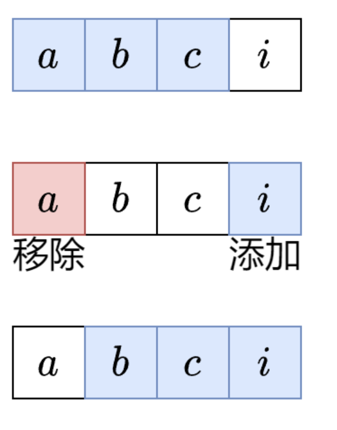

# 滑动窗口

## Reference

- https://leetcode.cn/discuss/post/3578981/ti-dan-hua-dong-chuang-kou-ding-chang-bu-rzz7/

滑动窗口关键词：子串（子串在原字符串里的位置是连续不间断的，并且保持原有的字符顺序）、子数组（子数组在原数组里的位置是连续的，并且保持原有的元素顺序）

## 定长滑动窗口

### 核心思想

我们要计算所有长度恰好为 `k` 的子串中，最多可以包含多少个元音字母. 

暴力枚举所有子串？时间复杂度是 $O(nk)$，太慢了. 能否 $O(1)$ 计算子串的元音个数？

这是可以做到的，对于下图的字符串 `abci`，假如我们已经计算出了子串 `abc` 的元音个数，那么从子串 `abc` 到子串 `bci`，只需要考虑移除（离开窗口）的字母 `a` 是不是元音，以及添加（进入窗口）的字母 `i` 是不是元音即可，因为中间的字母 `b` 和 `c` 都在这两个子串中. 



### 举例

示例 1，$s =$ `abciiiidef`, $k = 3$. 

1. 从左到右遍历 $s$. 
2. 首先统计前 $k - 1 = 2$ 个字母的元音个数，这有 $1$ 个. 
3. $s[2] =$ `c` 进入窗口，此时找到了第一个长为 $k$ 的子串 `abc`，现在元音个数有 $1$ 个，更新答案最大值. 然后 $s[0] =$ `a` 离开窗口，现在元音个数有 $0$ 个. 
4. $s[3] =$ `i` 进入窗口，此时找到了第二个长为 $k$ 的子串 `bci`，现在元音个数有 $1$ 个，更新答案最大值. 然后 $s[1] =$ `b` 离开窗口，现在元音个数有 $1$ 个. 
5. $s[4] =$ `i` 进入窗口，此时找到了第三个长为 $k$ 的子串 `cii`，现在元音个数有 $2$ 个，更新答案最大值. 然后 $s[2] =$ `c` 离开窗口，现在元音个数有 $2$ 个. 
6. $s[5] =$ `i` 进入窗口，此时找到了第四个长为 $k$ 的子串 `iii`，现在元音个数有 $3$ 个，更新答案最大值. 然后 $s[3] =$ `i` 离开窗口，现在元音个数有 $2$ 个. 
7. $s[6] =$ `d` 进入窗口，此时找到了第五个长为 $k$ 的子串 `iid`，现在元音个数有 $2$ 个，更新答案最大值. 然后 $s[4] =$ `i` 离开窗口，现在元音个数有 $1$ 个. 
8. $s[7] =$ `e` 进入窗口，此时找到了第六个长为 $k$ 的子串 `ide`，现在元音个数有 $2$ 个，更新答案最大值. 然后 $s[5] =$ `i` 离开窗口，现在元音个数有 $1$ 个. 
9. $s[8] =$ `f` 进入窗口，此时找到了第七个长为 $k$ 的子串 `def`，现在元音个数有 $1$ 个，更新答案最大值. 遍历结束. 

### 定长滑窗套路

我总结成三步：入-更新-出. 

1. **入**：下标为 $i$ 的元素进入窗口，更新相关统计量. 如果 $i < k - 1$ 则重复第一步. 
2. **更新**：更新答案. 一般是更新最大值/最小值.  
3. **出**：下标为 $i - k + 1$ 的元素离开窗口，更新相关统计量. 

以上三步适用于所有定长滑窗题目. 

```python
class Solution:
    def maxVowels(self, s: str, k: int) -> int:
        ans = vowel = 0
        for i, c in enumerate(s):
            # 1. 进入窗口
            if c in "aeiou":
                vowel += 1
            if i < k - 1:  # 窗口大小不足 k
                continue
            # 2. 更新答案
            ans = max(ans, vowel)
            # 3. 离开窗口
            if s[i - k + 1] in "aeiou":
                vowel -= 1
        return ans
```

### 复杂度分析

- **时间复杂度**：$O(n)$，其中 $n$ 是 $s$ 的长度. 
- **空间复杂度**：$O(1)$. 仅用到若干额外变量.  


> 定长滑窗中，初始化的长度为k-1，只有在更新的时候长度为k，只有这样才能保证先入再更新
> 虽然代码没有写一个滑窗数组，但是从入-更新-出这个步骤就隐含着滑窗操作
> 如果要求滑窗内的元素不重复，那么还需要维护一个哈希表，在入元素和出元素时对哈希表进行更新

1. 给你字符串 s 和整数 k . 请返回字符串 s 中长度为 k 的单个子字符串中可能包含的最大元音字母数. 英文中的 元音字母 为（a, e, i, o, u）. [LC1456定长子串中元音的最大数目](https://leetcode.cn/problems/maximum-number-of-vowels-in-a-substring-of-given-length/description/) [x]

    - 初始化滑窗 [0,k-2]（长度为k-1） 计算元音字母数c
    - 从左往右 i入，如果i对应为元音字母，c+=1，与最大值比并更新最大值，再看i-k+1，如果i-k+1对应为元音字母，c-=1，不断重复

2. 给你一个整数数组 arr 和两个整数 k 和 threshold . 请你返回长度为 k 且平均值大于等于 threshold 的子数组数目. [LC1343](https://leetcode.cn/problems/number-of-sub-arrays-of-size-k-and-average-greater-than-or-equal-to-threshold/description/) [x]

    - 初始化滑窗 [0,k-2]（长度为k-1）计算和 c = sum(lis[0:k-1])
    - 从左往右 i入，如果arr[i]+c>=k*threshold, 满足条件的子数组数目+1，将i-k+1对应的数退出滑窗 c-= arr[i-k+1]，不断重复

3. 给你一个整数数组 nums 和一个整数 k . 请你从 nums 中满足下述条件的全部子数组中找出最大子数组和：子数组的长度是 k，且子数组中的所有元素 各不相同 . 返回满足题面要求的最大子数组和. 如果不存在子数组满足这些条件，返回 0 . 子数组 是数组中一段连续非空的元素序列. [LC2461](https://leetcode.cn/problems/maximum-sum-of-distinct-subarrays-with-length-k/description/)


    - 初始化滑窗[0,k-2]（长度为k-1），计算滑窗的和c，用哈希表记录滑窗元素出现的个数
    - 从左到右 入arr[i]， 


4. 交换 定义为选中一个数组中的两个 互不相同 的位置并交换二者的值. 环形 数组是一个数组，可以认为 第一个 元素和 最后一个 元素 相邻 . 给你一个 二进制环形 数组 nums ，返回在 任意位置 将数组中的所有 1 聚集在一起需要的最少交换次数. [LC2134](https://leetcode.cn/problems/minimum-swaps-to-group-all-1s-together-ii/description/)


5. 给你一个字符串 s ，请你返回满足以下条件且出现次数最大的 任意 子串的出现次数：子串中不同字母的数目必须小于等于 maxLetters . 子串的长度必须大于等于 minSize 且小于等于 maxSize . [LC1297](https://leetcode.cn/problems/maximum-number-of-occurrences-of-a-substring/description/)


6. 给定两个字符串 s 和 p，找到 s 中所有 p 的 异位词 的子串，返回这些子串的起始索引. 不考虑答案输出的顺序. （字母异位词是通过重新排列不同单词或短语的字母而形成的单词或短语，并使用所有原字母一次. ）[LC438](https://leetcode.cn/problems/find-all-anagrams-in-a-string/description/)

    

7. 给你两个字符串 s1 和 s2 ，写一个函数来判断 s2 是否包含 s1 的 排列. 如果是，返回 true ；否则，返回 false . 换句话说，s1 的排列之一是 s2 的 子串 . [LC567](https://leetcode.cn/problems/permutation-in-string/description/)


8. 给你一个整数数组 nums，有一个大小为 k 的滑动窗口从数组的最左侧移动到数组的最右侧. 你只可以看到在滑动窗口内的 k 个数字. 滑动窗口每次只向右移动一位. 返回 滑动窗口中的最大值 . [LC239](https://leetcode.cn/problems/sliding-window-maximum/description/?envType=study-plan-v2&envId=top-100-liked)

## 不定长滑动窗口

不定长滑动窗口主要分为三类：求最长子数组，求最短子数组，以及求子数组个数. 

### 求最长

一般题目都有“至多”的要求. 

1. 给定一个字符串 s ，请你找出其中不含有重复字符的 最长 子串 的长度. [LC3](https://leetcode.cn/problems/longest-substring-without-repeating-characters/description/)

2. 给你一个字符串 s ，请找出满足每个字符最多出现两次的最长子字符串，并返回该子字符串的 最大 长度. [LC3090](https://leetcode.cn/problems/maximum-length-substring-with-two-occurrences/description/)

3. 给你一个二进制数组 nums ，你需要从中删掉一个元素. 请你在删掉元素的结果数组中，返回最长的且只包含 1 的非空子数组的长度. 如果不存在这样的子数组，请返回 0 . [LC1493](https://leetcode.cn/problems/longest-subarray-of-1s-after-deleting-one-element/description/)

4. 给你一个整数数组 nums 和一个整数 k . 一个元素 x 在数组中的 频率 指的是它在数组中的出现次数. 如果一个数组中所有元素的频率都 小于等于 k ，那么我们称这个数组是 好 数组. 请你返回 nums 中 最长好 子数组的长度. 子数组 指的是一个数组中一段连续非空的元素序列. [LC2958](https://leetcode.cn/problems/length-of-longest-subarray-with-at-most-k-frequency/description/)

5. 给你一个整数数组 nums 和一个整数 x . 每一次操作时，你应当移除数组 nums 最左边或最右边的元素，然后从 x 中减去该元素的值. 请注意，需要 修改 数组以供接下来的操作使用. 如果可以将 x 恰好 减到 0 ，返回 最小操作数 ；否则，返回 -1 . [LC1658](https://leetcode.cn/problems/minimum-operations-to-reduce-x-to-zero/description/)

6. 给你一个下标从 0 开始的整数数组 nums 和一个整数 k . 如果子数组中所有元素都相等，则认为子数组是一个 等值子数组 . 注意，空数组是 等值子数组 . 从 nums 中删除最多 k 个元素后，返回可能的最长等值子数组的长度. 子数组 是数组中一个连续且可能为空的元素序列. [LC2831](https://leetcode.cn/problems/find-the-longest-equal-subarray/description/)

7. 给你一个整数数组 nums . 每一次操作中，你可以将 nums 中 任意 一个元素替换成 任意 整数. 如果 nums 满足以下条件，那么它是 连续的 ：nums 中所有元素都是 互不相同 的. nums 中 最大 元素与 最小 元素的差等于nums.length - 1 . 比方说，nums = [4, 2, 5, 3] 是 连续的 ，但是 nums = [1, 2, 3, 5, 6] 不是连续的 . 请你返回使 nums 连续 的 最少 操作次数. [LC2009](https://leetcode.cn/problems/minimum-number-of-operations-to-make-array-continuous/description/)


### 求最短

1. 给定一个含有 n 个正整数的数组和一个正整数 target . 找出该数组中满足其总和大于等于 target 的长度最小的 子数组 [nums_l, nums_{l+1}, ..., nums_{r-1}, nums_r] ，并返回其长度. 如果不存在符合条件的子数组，返回 0 . [LC209](https://leetcode.cn/problems/minimum-size-subarray-sum/description/)

2. 给你一个二进制字符串 s 和一个正整数 k . 如果 s 的某个子字符串中 1 的个数恰好等于 k ，则称这个子字符串是一个 美丽子字符串 . 令 len 等于 最短 美丽子字符串的长度. 返回长度等于 len 且字典序 最小 的美丽子字符串. 如果 s 中不含美丽子字符串，则返回一个 空 字符串. 对于相同长度的两个字符串 a 和 b ，如果在 a 和 b 出现不同的第一个位置上，a 中该位置上的字符严格大于 b 中的对应字符，则认为字符串 a 字典序 大于 字符串 b . 例如，"abcd" 的字典序大于 "abcc" ，因为两个字符串出现不同的第一个位置对应第四个字符，而 d 大于 c . [LC2904](https://leetcode.cn/problems/shortest-and-lexicographically-smallest-beautiful-string/description/)

3. 给你一个字符串 s 、一个字符串 t . 返回 s 中涵盖 t 所有字符的最小子串. 如果 s 中不存在涵盖 t 所有字符的子串，则返回空字符串 "" . [LC76](https://leetcode.cn/problems/minimum-window-substring/description/)


### 求子数组个数

**越长越合法**

1. 给你一个字符串 s ，它只包含三种字符 a, b 和 c . 请你返回 a，b 和 c 都 至少 出现过一次的子字符串数目. [LC1358](https://leetcode.cn/problems/number-of-substrings-containing-all-three-characters/description/)

2. 给你一个整数数组 nums 和一个 正整数 k . 请你统计有多少满足 「 nums 中的 最大 元素」至少出现 k 次的子数组，并返回满足这一条件的子数组的数目. 子数组是数组中的一个连续元素序列. [LC2962](https://leetcode.cn/problems/count-subarrays-where-max-element-appears-at-least-k-times/description/)

3. 给你一个字符串 s 和一个整数 k，在 s 的所有子字符串中，请你统计并返回 至少有一个 字符 至少出现 k 次的子字符串总数. 子字符串 是字符串中的一个连续、 非空 的字符序列. [LC3325](https://leetcode.cn/problems/count-substrings-with-k-frequency-characters-i/description/)

**越短越合法**

1. 给你一个整数数组 nums 和一个整数 k ，请你返回子数组内所有元素的乘积严格小于 k 的连续子数组的数目. [LC713](https://leetcode.cn/problems/subarray-product-less-than-k/description/)

2. 给你一个 二进制 字符串 s 和一个整数 k. 如果一个 二进制字符串 满足以下任一条件，则认为该字符串满足 k 约束：字符串中 0 的数量最多为 k. 字符串中 1 的数量最多为 k. 
返回一个整数，表示 s 的所有满足 k 约束 的子字符串的数量. [LC3258](https://leetcode.cn/problems/count-substrings-that-satisfy-k-constraint-i/description/) 

3. 一个数组的 分数 定义为数组之和 乘以 数组的长度. 比方说，[1, 2, 3, 4, 5] 的分数为 (1 + 2 + 3 + 4 + 5) * 5 = 75 . 给你一个正整数数组 nums 和一个整数 k ，请你返回 nums 中分数 严格小于 k 的 非空整数子数组数目. 子数组 是数组中的一个连续元素序列. [LC2302](https://leetcode.cn/problems/count-subarrays-with-score-less-than-k/description/)

**恰好型滑动窗口**

例如，要计算有多少个元素和恰好等于 `k` 的子数组，可以把问题变成：

- 计算有多少个元素和 $\geq$ `k` 的子数组. 
- 计算有多少个元素和 $>$ `k`，也就是 $\geq$ `k + 1` 的子数组. 

答案就是元素和 $\geq$ `k` 的子数组个数，减去元素和 $\geq$ `k + 1` 的子数组个数. 这里把 $>$ 转换成 $\geq$ ，从而可以把滑窗逻辑封装成一个函数 `f`，然后用 `f(k) - f(k + 1)` 计算，无需编写两份滑窗代码. 

总结：“恰好” 可以拆分成两个 “至少”，也就是两个 “越长越合法” 的滑窗问题.  

1. 给你一个二元数组 nums ，和一个整数 goal ，请你统计并返回有多少个和为 goal 的 非空 子数组. 子数组 是数组的一段连续部分. [LC930](https://leetcode.cn/problems/binary-subarrays-with-sum/description/)

2. 给你一个整数数组 nums 和一个整数 k. 如果某个连续子数组中恰好有 k 个奇数数字，我们就认为这个子数组是 “优美子数组”. 请返回这个数组中 “优美子数组” 的数目. [LC1248](https://leetcode.cn/problems/count-number-of-nice-subarrays/description/)

3. 给定一个正整数数组 nums和一个整数 k，返回 nums 中 “好子数组” 的数目. 如果 nums 的某个子数组中不同整数的个数恰好为 k，则称 nums 的这个连续、不一定不同的子数组为 “好子数组”. 例如，[1,2,3,1,2] 中有 3 个不同的整数：1，2，以及 3. 子数组 是数组的 连续 部分. [LC992](https://leetcode.cn/problems/subarrays-with-k-different-integers/description/)