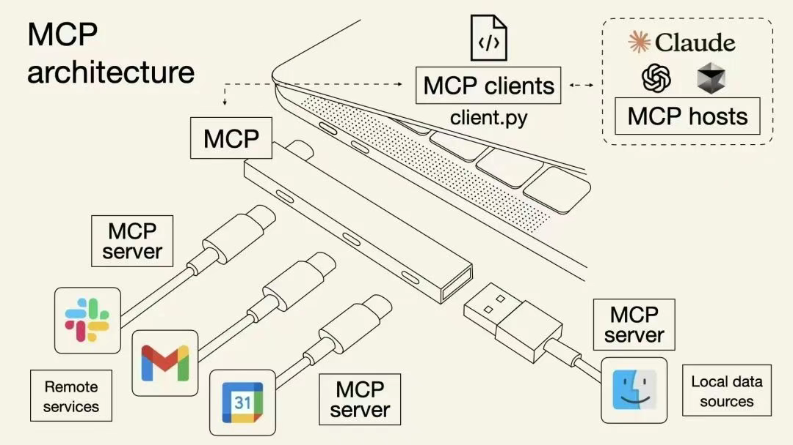

# MCP（Model Context Protocol，模型上下文协议）

## MCP协议概述  

**MCP（Model Context Protocol，模型上下文协议）** 是专为大语言模型设计的开源通信协议，旨在标准化模型与外部数据源、工具或服务的交互，使模型具备调用外部工具（如获取数据、执行操作）的能力。  

## MCP协议与API调用的核心区别  

1. **上下文感知与会话状态管理**  
   - **MCP协议**：支持模型在多轮交互中保持上下文记忆，自动关联历史信息（如对话历史、用户偏好），提供个性化响应。  
     *例：用户问“我的快递到哪了？”，MCP可自动关联历史订单信息返回物流状态，无需重复提供订单号。*  
   - **API调用**：通常为无状态请求，每次调用需手动输入完整参数，无法复用历史上下文。  

2. **双向实时通信**  
   - **MCP协议**：支持模型与外部服务的实时双向交互，模型可主动反馈中间状态或请求信息。  
     *例：处理复杂任务时，MCP服务可主动提示“正在查询数据库，请稍候”。*  
   - **API调用**：多为单向请求-响应模式，模型仅被动响应外部请求。  

3. **动态工具发现与集成**  
   - **MCP协议**：允许模型自动识别并集成新工具，无需手动修改代码或重新部署，灵活性高。  
     *例：用户请求“帮我订机票”，MCP可自动调用航班查询工具和支付接口，无需提前配置。*  
   - **API调用**：需预先定义接口，无法动态发现新工具，集成成本较高。  

## MCP协议的意义  

类比USB-C接口统一设备连接标准，MCP为不同API创建了通用交互规范，解决了传统API调用中上下文割裂、集成僵化等问题，推动大语言模型与外部工具的高效协同。

## MCP 协议的两种连接方式详解  

### **一、SSE（Server-Sent Events）连接方式**  

1. **基本原理**  
SSE 是一种基于 HTTP 的单向通信协议，由服务端主动向客户端推送数据，客户端通过长连接持续接收数据流。其核心特点是：  
    - **单向传输**：仅服务端向客户端发送数据，客户端无法主动推送。  
    - **长连接维持**：通过 HTTP 连接保持活跃状态，避免频繁建立连接的开销。  

2. **适用场景**  
    - **实时数据更新**：如聊天消息、日志监控、股票行情等需要服务端主动推送信息的场景。  
    - **轻量化交互**：相比 WebSocket，SSE 实现更简单，适合不需要双向通信的场景。  

3. **连接示例**  
通过 URL 建立连接，例如： `http://localhost:8001/sse` , 
客户端（如浏览器、Python 程序）通过该 URL 发起请求，服务端响应后保持连接，并以文本流形式持续发送数据（如 JSON 格式的消息）。  

### **二、stdio（标准输入输出）连接方式** 
 
1. **基本原理**  
stdio 利用操作系统的标准输入（stdin）和标准输出（stdout）流进行通信，本质是进程间通信的一种方式：  
    - **本地进程交互**：服务端通常作为本地进程运行，通过 stdin 接收客户端指令，通过 stdout 返回结果。  
    - **无网络依赖**：无需网络接口，直接在本地进程间传输数据，安全性和性能更高。  

2. **适用场景**  
    - **本地开发与调试**：方便开发者在本地环境中测试 MCP 服务端与客户端的交互逻辑。  
    - **轻量化工具集成**：当工具或服务仅需在本地运行时（如本地文件处理、模型推理），可通过 stdio 快速对接。  

