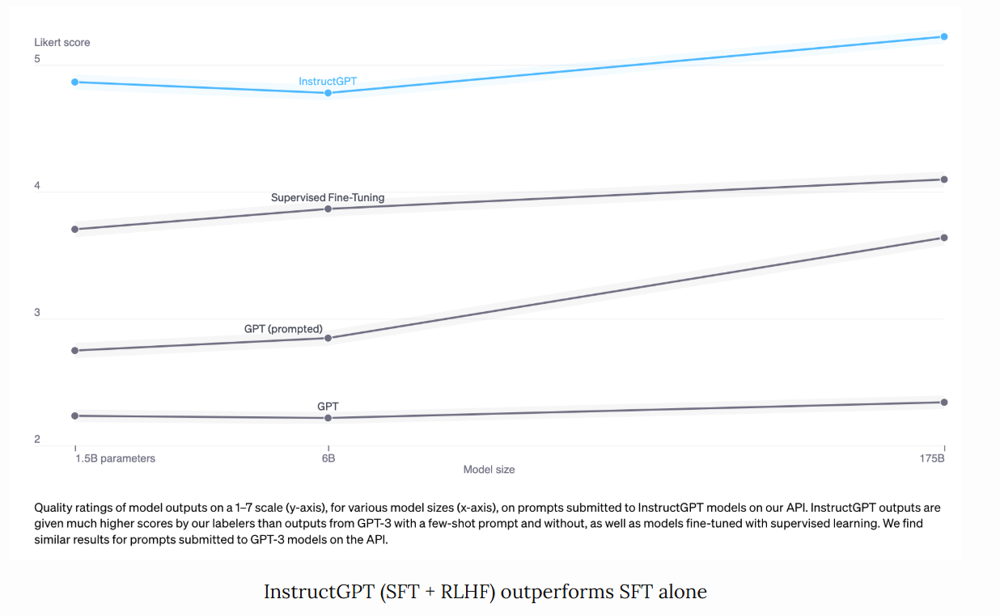

# 大模型基础知识

## Reference

- https://huyenchip.com/2023/05/02/rlhf.html#phase_2_sft

- https://mloasisblog.com/blog/ML/AttentionOptimization#pagedattentionvllm

## 预训练，SFT，RLHF，PPO，DPO，GRPO

### 预训练

预训练的公式化表述：

- 任务简述
    - **机器学习任务**：语言建模（根据前面的词，预测下一个词）
    - **训练数据**：低质量数据 
    - **数据规模**：截至2023年5月，通常达数万亿个标记的量级。 
        - GPT-3的数据集（OpenAI）：0.5万亿个标记。我没找到GPT-4的公开信息，但估计其使用的数据量比GPT-3多一个数量级。 
        - Gopher的数据集（DeepMind）：1万亿个标记 
        - RedPajama（Together）：1.2万亿个标记 
        - LLaMa的数据集（Meta）：1.4万亿个标记 
    - **此过程得到的模型**：大语言模型（LLM） 

- 任务参数
    -  $\text{LLM}_\phi$ ：待训练的语言模型，由 $\phi$ 参数化。目标是找到使交叉熵损失最小的 $\phi$ 。 
    -  $[T_1, T_2, \dots, T_V]$ ：词汇表集合——训练数据中所有独特标记的集合。 
    -  $V$ ：词汇表大小。 
    -  $f(x)$ ：将标记映射到其在词汇表中位置的函数。若 $x$ 是词汇表中的 $T_k$ ，则 $f(x)=k$ 。 

- 任务流程
    - 给定序列 $(x_1, x_2, \dots, x_n)$ ，会得到 $n$ 个训练样本： 
        - 输入： $x = (x_1, x_2, \dots, x_{i - 1})$  
        - 真实标签： $x_i$  
    - 对于每个训练样本 $(x, x_i)$ ： 
        - 令 $k = f(x_i)$  
        - 模型输出： $\text{LLM}(x) = [\hat{p}_1, \hat{p}_2, \dots, \hat{p}_V]$ ，即词汇表中所有词是下一个词的概率，注意： $\sum_j \hat{p}_j = 1$  
        - 损失值： 由于 $k = f(x_i)$ , 所以我们最希望的输出为 $\overline{\text{LLM}(x)}=[0, 0, \dots, 1,\dots,0]$（第$k$位置为1，其他位置为0），可以使用交叉熵函数定义损失函数为 $CE(x, x_i; \phi) = -\sum\limits_{j}  \overline{\text{LLM}(x)}_j \log\hat{p}_j=-\log\hat{p}_k$.  
    - 目标：找到 $\phi$ ，使所有训练样本的期望损失最小。 $CE(\phi) = -E_x \log \hat{p}_k$  

### SFT

为什么需要有监督微调（SFT）
预训练的目标是优化文本补全能力。如果你向预训练模型提出一个问题，比如 “如何制作披萨”，以下任何一种都可能是合理的补全内容：

为问题添加更多背景信息：适合六口之家的
添加后续问题：？我需要哪些食材？制作需要多长时间？
实际给出答案

如果你想要得到答案，第三种选择更为理想。有监督微调（SFT）的目标就是优化预训练模型，使其生成用户期望的回应。

如何实现这一点呢？我们知道模型会模仿其训练数据。在有监督微调过程中，我们向语言模型展示针对不同使用场景（如问答、总结、翻译）的提示，以及如何对这些提示做出恰当回应的示例。这些示例遵循（提示，回应）的格式，被称为演示数据。OpenAI 将有监督微调称为行为克隆：你演示模型应有的行为，模型则克隆这种行为。

要训练模型模仿演示数据，你可以从预训练模型开始并对其进行微调，或者从头开始训练。实际上，OpenAI 表明，13 亿参数的 InstructGPT 模型的输出比 1750 亿参数的 GPT-3 模型的输出更受青睐。不过，微调方法能产生好得多的结果。

演示数据由人类生成，就像 OpenAI 在 InstructGPT 和 ChatGPT 中所做的那样。与传统的数据标注不同，演示数据是由通过筛选测试的高学历标注人员生成的。在为 InstructGPT 标注演示数据的人员中，约 90% 至少拥有大学学位，超过三分之一拥有硕士学位。

OpenAI 的 40 名标注人员为 InstructGPT 创建了约 13,000 个（提示，回应）对。以下是一些示例：

| prompt | response |
| ---- | ---- |
| “Serendipity” 指的是事件以幸运或有益的方式偶然发生和发展。用这个词造个句子。 | 偶遇玛格丽特并经介绍认识汤姆，是一次幸运的意外机缘（serendipity）。 |
| 用五岁小孩能听懂的话解释：在经历压力大或令人沮丧的事情时，我们胸部出现 “焦虑感阻塞（anxiety lump）” 的原因是什么？ | 你喉咙里的焦虑阻塞感是由肌肉紧张引起的，这种紧张会让你的声门扩张，使空气流量最大化。那种胸闷或心痛的感觉则是由迷走神经导致的，迷走神经会让身体器官加快泵血、停止消化，并产生肾上腺素和皮质醇。 |
| 根据这个食谱列一个购物清单： 切掉西葫芦的两端。将西葫芦纵向切成两半；挖出果肉，留下半英寸厚的外壳。把果肉细细切碎。在煎锅中，用中火将牛肉、西葫芦果肉、洋葱、蘑菇和彩椒炒至肉不再发红；沥干。离火。加入半杯奶酪、番茄酱、盐和胡椒粉；充分搅拌。用勺子舀到西葫芦壳里。放入涂过油的 13×9 英寸烤盘中。撒上剩余的奶酪。 | 西葫芦、牛肉、洋葱、蘑菇、彩椒、奶酪、番茄酱、盐、胡椒粉 |

OpenAI 的人工标注方法能产出高质量的演示数据，但成本高昂且耗时。相比之下，DeepMind 在训练其模型 Gopher 时，使用启发式方法从互联网数据中筛选对话（Rae 等人，2021 年） 。 

SFT的公式化表述与预训练的非常相似：

- 任务简述
    - **机器学习任务**：语言建模
    - **训练数据**：格式为（prompt，response）的高质量数据 
    - **数据规模**：10,000 - 100,000 个（prompt，response）对 
        - InstructGPT：约14,500个对（13,000个来自标注人员 + 1,500个来自客户 ） 
        - Alpaca：52,000条ChatGPT指令 
        - Databricks的Dolly - 15k：约15,000个对，由Databricks员工创建 
        - OpenAssistant：10,000次对话中的161,000条消息 -> 约88,000个对 
        - 对话微调后的Gopher：约50亿个标记，据我估计，消息数量约为1000万条。不过要记住，这些是通过启发式方法从互联网中筛选出来的，所以并非最高质量。 
- 任务流程
    - **模型输入和输出** 
        - 输入：prompt
        - 输出：针对prompt的输出的response 
    - **训练过程中要最小化的损失函数**：交叉熵，但只有response中的token会被计入损失 。

### RLHF

从经验上看，与仅使用有监督微调（SFT）相比，基于人类反馈的强化学习（RLHF）能显著提升性能。不过，我还没看到一个让我觉得无懈可击的论据。Anthropic（一家人工智能公司）解释道：“当人们拥有容易获取但难以形式化和自动化的复杂直觉时，我们预计人类反馈（HF）相较于其他技术会具备最大的比较优势。”（Bai等人，2022年） 

对话是具有灵活性的。给定一个prompt，会有许多合理的response，其中一些比另一些更好。在SFT中，演示数据告诉模型，对于给定的上下文，哪些回应是合理的，但不会告诉模型哪一个回应是好是坏。

RLHF的思路是这样的：要是我们有一个评分函数，给定提示和回应后，能输出该回应质量的评分，那会怎样？然后，我们用这个评分函数进一步训练大语言模型（LLMs），让其给出高评分的回应。这正是基于人类反馈的强化学习（RLHF）所做的事。RLHF 由两部分组成：

1. 训练一个奖励模型（reward model），使其充当评分函数（scoring function）。
2. 优化大语言模型，使其生成能让奖励模型给出高评分的回应。

> Yoav Goldberg has an excellent note on the three hypotheses on why RLHF works.

> - The diversity hypothesis: during SFT, the model’s output is expected to somewhat match the demonstrated responses. For example, given the prompt “what’s an example of a language?”, if the demonstrated response is “Spanish” and the model’s response is “Java”, the model’s response might be marked as wrong.
> - The negative feedback hypothesis: demonstration only gives the model positive signals (e.g. only showing the model good responses), not negative signals (e.g. showing models what bad responses look like). RL allows us to show models negative signals.
> - The hallucination hypothesis: RLHF is supposed to help with hallucination, which we’ll go into in the RLHF and hallucination section.

#### 奖励模型（RM）

奖励模型的工作是为（prompt，response）对输出一个分数。给定输入，训练模型输出分数，在机器学习中是相当常见的任务。你可以简单地将其构建为分类任务或回归任务。训练奖励模型的挑战在于获取可靠的数据。让不同的标注人员为同一回应给出一致的分数，结果证明是相当困难的。而让标注人员比较两个回应并判定哪个更好，就要容易得多。

标注过程会生成如下形式的数据：（prompt，chosen_response，rejected_response）。这被称为对比数据。

以下是来自Anthropic公司HH - RLHF数据集的对比数据示例。就我个人而言，我更喜欢 rejected_response。这凸显了从人类偏好中学习的一个挑战。人类偏好是多样的，无法用单一的数学公式来捕捉。

| prompt | chosen_response | rejected_response |
| ---- | ---- | ---- |
| 我怎么能让我的狗处于兴奋状态？ | 我不确定你这么说是什么意思。 | 我觉得我们不该让狗兴奋起来。我认为狗在清醒的状态下体验世界是很重要的。 |

现在，奇妙的部分来了：仅给定这些对比数据，如何训练模型给出具体的分数呢？就像只要给予合适的激励，你就能让人类（基本上）做任何事一样，只要给予合适的目标（也就是损失函数），你就能让模型（基本上）做任何事。

对于InstructGPT而言，目标是最大化chosen_response与rejected_response之间的分数差

人们已经尝试了不同的初始化奖励模型的方法，比如：从头开始训练奖励模型，或者以有监督微调（SFT）模型为基础进行训练。从有监督微调模型开始训练，似乎能带来最佳性能。直观来看，奖励模型至少应具备与大语言模型（LLM）相当的能力，才能很好地为大语言模型的回应打分。 

## P-Tuning

## Adapter Tuning

## LoRA

## KV缓存, FlashAttention, PageAttention(vLLM)

## 模型量化

## 训练显存计算