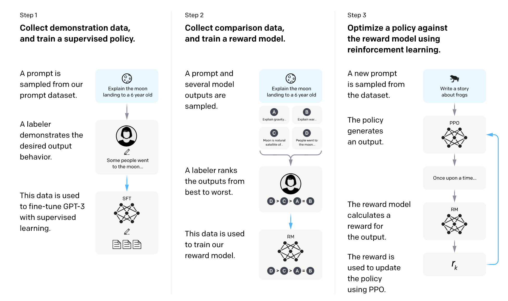
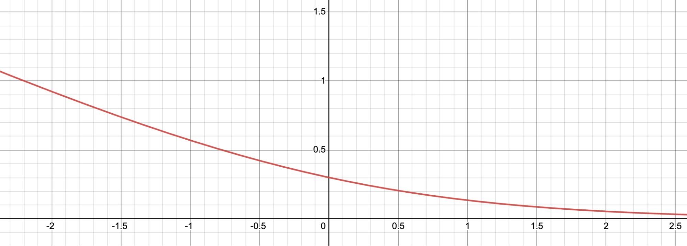

# 预训练，SFT，RLHF，PPO，DPO，GRPO

## Reference


- https://huyenchip.com/2023/05/02/rlhf.html

- https://mloasisblog.com/blog/ML/AttentionOptimization#pagedattentionvllm


## 预训练

预训练的公式化表述：

- 任务简述
    - **机器学习任务**：语言建模（根据前面的词，预测下一个词）
    - **训练数据**：低质量数据 
    - **数据规模**：截至2023年5月，通常达数万亿个标记的量级.  
        - GPT-3的数据集（OpenAI）：0.5万亿个标记. 我没找到GPT-4的公开信息，但估计其使用的数据量比GPT-3多一个数量级.  
        - Gopher的数据集（DeepMind）：1万亿个标记 
        - RedPajama（Together）：1.2万亿个标记 
        - LLaMa的数据集（Meta）：1.4万亿个标记 
    - **此过程得到的模型**：大语言模型（LLM） 

- 任务参数
    -  $\text{LLM}_\phi$ ：待训练的语言模型，由 $\phi$ 参数化. 目标是找到使交叉熵损失最小的 $\phi$ .  
    -  $[T_1, T_2, \dots, T_V]$ ：词汇表集合——训练数据中所有独特标记的集合.  
    -  $V$ ：词汇表大小.  
    -  $f(x)$ ：将标记映射到其在词汇表中位置的函数. 若 $x$ 是词汇表中的 $T_k$ ，则 $f(x)=k$ .  

- 任务流程
    - 给定序列 $(x_1, x_2, \dots, x_n)$ ，会得到 $n$ 个训练样本： 
        - 输入： $x = (x_1, x_2, \dots, x_{i - 1})$  
        - 真实标签： $x_i$  
    - 对于每个训练样本 $(x, x_i)$ ： 
        - 令 $k = f(x_i)$  
        - 模型输出： $\text{LLM}(x) = [\hat{p}_1, \hat{p}_2, \dots, \hat{p}_V]$ ，即词汇表中所有词是下一个词的概率，注意： $\sum_j \hat{p}_j = 1$  
        - 损失值： 由于 $k = f(x_i)$ , 所以我们最希望的输出为 $\overline{\text{LLM}(x)}=[0, 0, \dots, 1,\dots,0]$（第$k$位置为1，其他位置为0），可以使用交叉熵函数定义损失函数为 $CE(x, x_i; \phi) = -\sum\limits_{j}  \overline{\text{LLM}(x)}_j \log\hat{p}_j=-\log\hat{p}_k$.  
    - 目标：找到 $\phi$ ，使所有训练样本的期望损失最小.  $CE(\phi) = -E_x \log \hat{p}_k$  

## SFT

为什么需要有监督微调（SFT）
预训练的目标是优化文本补全能力. 如果你向预训练模型提出一个问题，比如 “如何制作披萨”，以下任何一种都可能是合理的补全内容：

为问题添加更多背景信息：适合六口之家的
添加后续问题：？我需要哪些食材？制作需要多长时间？
实际给出答案

如果你想要得到答案，第三种选择更为理想. 有监督微调（SFT）的目标就是优化预训练模型，使其生成用户期望的回应. 

如何实现这一点呢？我们知道模型会模仿其训练数据. 在有监督微调过程中，我们向语言模型展示针对不同使用场景（如问答、总结、翻译）的提示，以及如何对这些提示做出恰当回应的示例. 这些示例遵循（提示，回应）的格式，被称为演示数据. OpenAI 将有监督微调称为行为克隆：你演示模型应有的行为，模型则克隆这种行为. 

要训练模型模仿演示数据，你可以从预训练模型开始并对其进行微调，或者从头开始训练. 实际上，OpenAI 表明，13 亿参数的 InstructGPT 模型的输出比 1750 亿参数的 GPT-3 模型的输出更受青睐. 不过，微调方法能产生好得多的结果. 

演示数据由人类生成，就像 OpenAI 在 InstructGPT 和 ChatGPT 中所做的那样. 与传统的数据标注不同，演示数据是由通过筛选测试的高学历标注人员生成的. 在为 InstructGPT 标注演示数据的人员中，约 90% 至少拥有大学学位，超过三分之一拥有硕士学位. 

OpenAI 的 40 名标注人员为 InstructGPT 创建了约 13,000 个（提示，回应）对. 以下是一些示例：

| prompt | response |
| ---- | ---- |
| “Serendipity” 指的是事件以幸运或有益的方式偶然发生和发展. 用这个词造个句子.  | 偶遇玛格丽特并经介绍认识汤姆，是一次幸运的意外机缘（serendipity）.  |
| 用五岁小孩能听懂的话解释：在经历压力大或令人沮丧的事情时，我们胸部出现 “焦虑感阻塞（anxiety lump）” 的原因是什么？ | 你喉咙里的焦虑阻塞感是由肌肉紧张引起的，这种紧张会让你的声门扩张，使空气流量最大化. 那种胸闷或心痛的感觉则是由迷走神经导致的，迷走神经会让身体器官加快泵血、停止消化，并产生肾上腺素和皮质醇.  |
| 根据这个食谱列一个购物清单：<br>切掉西葫芦的两端. 将西葫芦纵向切成两半；挖出果肉，留下半英寸厚的外壳. 把果肉细细切碎. 在煎锅中，用中火将牛肉、西葫芦果肉、洋葱、蘑菇和彩椒炒至肉不再发红；沥干. 离火. 加入半杯奶酪、番茄酱、盐和胡椒粉；充分搅拌. 用勺子舀到西葫芦壳里. 放入涂过油的 13×9 英寸烤盘中. 撒上剩余的奶酪.  | 西葫芦、牛肉、洋葱、蘑菇、彩椒、奶酪、番茄酱、盐、胡椒粉 |

OpenAI 的人工标注方法能产出高质量的演示数据，但成本高昂且耗时. 相比之下，DeepMind 在训练其模型 Gopher 时，使用启发式方法从互联网数据中筛选对话（Rae 等人，2021 年） .  

SFT的公式化表述与预训练的非常相似：

- 任务简述
    - **机器学习任务**：语言建模
    - **训练数据**：格式为（prompt，response）的高质量数据 
    - **数据规模**：10,000 - 100,000 个（prompt，response）对 
        - InstructGPT：约14,500个对（13,000个来自标注人员 + 1,500个来自客户 ） 
        - Alpaca：52,000条ChatGPT指令 
        - Databricks的Dolly - 15k：约15,000个对，由Databricks员工创建 
        - OpenAssistant：10,000次对话中的161,000条消息 -> 约88,000个对 
        - 对话微调后的Gopher：约50亿个标记，据我估计，消息数量约为1000万条. 不过要记住，这些是通过启发式方法从互联网中筛选出来的，所以并非最高质量.  
- 任务流程
    - **模型输入和输出** 
        - 输入：prompt
        - 输出：针对prompt的输出的response 
    - **训练过程中要最小化的损失函数**：交叉熵，但只有response中的token会被计入损失 . 

## RLHF

从经验上看，与仅使用有监督微调（SFT）相比，基于人类反馈的强化学习（RLHF）能显著提升性能. 不过，我还没看到一个让我觉得无懈可击的论据. Anthropic（一家人工智能公司）解释道：“当人们拥有容易获取但难以形式化和自动化的复杂直觉时，我们预计人类反馈（HF）相较于其他技术会具备最大的比较优势. ”（Bai等人，2022年） 


对话是具有灵活性的. 给定一个prompt，会有许多合理的response，其中一些比另一些更好. 在SFT中，演示数据告诉模型，对于给定的上下文，哪些回应是合理的，但不会告诉模型哪一个回应是好是坏. 

RLHF的思路是这样的：要是我们有一个评分函数，给定提示和回应后，能输出该回应质量的评分，那会怎样？然后，我们用这个评分函数进一步训练大语言模型（LLMs），让其给出高评分的回应. 这正是基于人类反馈的强化学习（RLHF）所做的事. RLHF 由两部分组成：

1. 训练一个奖励模型（reward model），使其充当评分函数（scoring function）. 
2. 优化大语言模型，使其生成能让奖励模型给出高评分的回应. 




> Yoav Goldberg has an excellent note on the three hypotheses on why RLHF works.

> - The diversity hypothesis: during SFT, the model’s output is expected to somewhat match the demonstrated responses. For example, given the prompt “what’s an example of a language?”, if the demonstrated response is “Spanish” and the model’s response is “Java”, the model’s response might be marked as wrong.
> - The negative feedback hypothesis: demonstration only gives the model positive signals (e.g. only showing the model good responses), not negative signals (e.g. showing models what bad responses look like). RL allows us to show models negative signals.
> - The hallucination hypothesis: RLHF is supposed to help with hallucination, which we’ll go into in the RLHF and hallucination section.

### 奖励模型（RM）

奖励模型的工作是为（prompt，response）对输出一个分数. 给定输入，训练模型输出分数，在机器学习中是相当常见的任务. 你可以简单地将其构建为分类任务或回归任务. 训练奖励模型的挑战在于获取可靠的数据. 让不同的标注人员为同一回应给出一致的分数，结果证明是相当困难的. 而让标注人员比较两个回应并判定哪个更好，就要容易得多. 

标注过程会生成如下形式的数据：（prompt，chosen_response，rejected_response）. 这被称为对比数据. 

以下是来自Anthropic公司HH - RLHF数据集的对比数据示例. 就我个人而言，我更喜欢 rejected_response. 这凸显了从人类偏好中学习的一个挑战. 人类偏好是多样的，无法用单一的数学公式来捕捉. 

| prompt | chosen_response | rejected_response |
| ---- | ---- | ---- |
| 我怎么能让我的狗处于兴奋状态？ | 我不确定你这么说是什么意思.  | 我觉得我们不该让狗兴奋起来. 我认为狗在清醒的状态下体验世界是很重要的.  |

现在，奇妙的部分来了：仅给定这些对比数据，如何训练模型给出具体的分数呢？就像只要给予合适的激励，你就能让人类（基本上）做任何事一样，只要给予合适的目标（也就是损失函数），你就能让模型（基本上）做任何事. 

对于InstructGPT而言，目标是最大化chosen_response与rejected_response之间的分数差

人们已经尝试了不同的初始化奖励模型的方法，比如：从头开始训练奖励模型，或者以有监督微调（SFT）模型为基础进行训练. 从有监督微调模型开始训练，似乎能带来最佳性能. 直观来看，奖励模型至少应具备与大语言模型（LLM）相当的能力，才能很好地为大语言模型的回应打分.  


**训练一个奖励模型的公式化表述**

- **训练数据**：格式为（prompt、chosen_response、rejected_response）的高质量数据
- **数据规模**：10万 - 100万条示例
    - **InstructGPT**：5万个 prompt .  每个 prompt 有4到9个 response ，形成6到36对（chosen_response、rejected_response）.  这意味着有30万到180万条格式为（prompt、chosen_response、rejected_response）的训练示例.   
    - **Constitutional AI**（疑似为Claude（Anthropic）的基础技术 ）：31.8万次对比——13.5万次由人类生成，18.3万次由人工智能生成.  Anthropic已开源其旧版本数据（hh - rlhf ），其中包含约17万次对比.   
-  $r_\theta$ ：待训练的奖励模型，由 $\theta$ 参数化.  训练过程的目标是找到使损失最小化的 $\theta$ .   
- **训练数据格式**：
    -  $x$ ：prompt
    -  $y_w$ ：chosen_response
    -  $y_l$ ：rejected_response
- 对于每个训练样本 $(x, y_w, y_l)$ 
    -  $s_w = r_\theta(x, y_w)$ ：奖励模型对 chosen_response 的评分
    -  $s_l = r_\theta(x, y_l)$ ：奖励模型对 rejected_response 的评分 
    - 损失值： $-\log(\sigma(s_w - s_l))$  
- **目标**：找到 $\theta$ ，使所有训练样本的期望损失最小化，即 $-E_x\log(\sigma(s_w - s_l))$  

为了更直观地理解这个损失函数的作用，我们将其可视化.   

令 $d = s_w - s_l$ .  函数 $f(d)=-\log(\sigma(d))$ 的图像如下.  当 $d$ 为负时，损失值很大，这会促使奖励模型不会给 chosen_response 比 rejected_response 更低的分数.   



## PPO

进一步训练 SFT 模型，以生成能使 RM 分数最大化的输出 response . 如今，大多数人使用近端策略优化（PPO），这是 OpenAI 在 2017 年发布的一种强化学习算法. 

在这个过程中，prompt 是从一个分布中随机选择的 —— 例如，我们可能会从客户 prompt 中随机选择. 每个 prompt 被输入到 LLM 模型中以获得 response，该 response 由 RM 给出一个分数. 

OpenAI 还发现有必要添加一个约束：此阶段产生的模型不应偏离 SFT 阶段产生的模型太远（在数学上表示为下面目标函数中的 KL 散度项）. 其直觉是，对于任何给定的 prompt ，有许多可能的 response ，其中绝大多数 RM 从未见过. 对于许多这些未知的（ prompt ， response ）对，RM 可能会错误地给出极高或极低的分数. 如果没有这个约束，我们可能会偏向于那些得分极高的 response ，即使它们可能不是好的 response . 

**强化学习公式化表达**

- **机器学习任务**：强化学习
  - **动作空间**：大语言模型（LLM）使用的词元词汇表. 执行动作意味着选择一个词元进行生成. 
  - **观测空间**：所有可能 prompt 的分布. 
  - **策略**：给定观测（比如一个 prompt ）时，采取所有动作（即所有要生成的词元 ）的概率分布. 大语言模型构成一种策略，因为它决定了下一个词元被生成的可能性. 
  - **奖励函数**：奖励模型. 
- **训练数据**：随机选取的 prompt 
- **数据规模**：1万 - 10万条 prompt 
  - InstructGPT：4万条 prompt 

-  $RM$ ：训练得到的奖励模型. 
-  $LLM^{SFT}$ ：监督微调后得到的模型. 
    - 给定一个 prompt  $x$ ，它会输出 response 的分布. 
    - 在InstructGPT论文中， $LLM^{SFT}$ 表示为 $\pi^{SFT}$ . 
-  $LLM_\phi^{RL}$ ：用强化学习训练的模型，由 $\phi$ 参数化. 
    - 目标是找到 $\phi$ ，以根据 $RM$ 最大化分数. 
    - 给定一个 prompt  $x$ ，它会输出 response 的分布. 
    - 在InstructGPT论文中， $LLM_\phi^{RL}$ 表示为 $\pi_\phi^{RL}$ . 
-  $x$ ： prompt . 
-  $D_{RL}$ ：用于强化学习（RL）模型的 prompt 分布. 
-  $D_{pretrain}$ ：预训练模型的训练数据分布. 

对于每个训练步骤，从 $D_{RL}$ 中采样一批 $x_{RL}$ ，从 $D_{pretrain}$ 中采样一批 $x_{pretrain}$ . 每个样本的目标函数取决于样本来自哪个分布. 
1. 对于每个 $x_{RL}$ ，我们使用 $LLM_\phi^{RL}$ 采样一个 response ： $y \sim LLM_\phi^{RL}(x_{RL})$ . 目标函数计算如下. 注意，此目标函数中的第二项是KL散度，用于确保强化学习模型不会偏离监督微调（SFT）模型太远. 

$$
objective_1(x_{RL}, y; \phi) = RM(x_{RL}, y) - \beta \log \frac{LLM_\phi^{RL}(y | x)}{LLM^{SFT}(y | x)}
$$

2. 对于每个 $x_{pretrain}$ ，目标函数计算如下. 直观地说，此目标是为了确保强化学习模型在文本补全任务（预训练模型已优化的任务 ）上的表现不会更差. 

$$
objective_2(x_{pretrain}; \phi) = \gamma \log LLM_\phi^{RL}(x_{pretrain})
$$

最终目标是上述两个目标的期望之和. 在强化学习设置中，我们最大化目标，而非像之前步骤中那样最小化目标. 

$$
objective(\phi) = E_{x \sim D_{RL}} E_{y \sim LLM_\phi^{RL}(x)} \left[RM(x, y) - \beta \log \frac{LLM_\phi^{RL}(y | x)}{LLM^{SFT}(y | x)}\right] + \gamma E_{x \sim D_{pretrain}} \log LLM_\phi^{RL}(x)
$$


## 强化学习相关知识


- https://blog.csdn.net/quoniammm/article/details/136118607?spm=1001.2014.3001.5502
- https://blog.csdn.net/quoniammm/article/details/136124438?spm=1001.2014.3001.5502
- https://blog.csdn.net/quoniammm/article/details/136138381

在强化学习里：
- **Episode（回合）**：是智能体从与环境交互开始，到终止条件（如完成任务、失败、达到步数限制）结束的完整交互过程，强调“一段完整经历” ，像一局游戏、一次机器人寻路尝试.  
- **Trajectory（轨迹）**：是交互中按时间顺序的状态 - 动作序列（如 $s_0,a_0,s_1,a_1,\cdots$ ），聚焦“具体行为路径” ，记录每一步状态与动作，用于分析智能体决策过程 .  
简单说，episode是完整的一段交互，trajectory是这段交互里的行为序列 .  

经历 $T$ 时刻积累的经验形成的序列叫做 trajectory，我们用 $\tau$ 表示. $s$ 代表机器所处的环境产生的提示或者状态，$a$ 代表机器的反应或者行动，$r$ 代表机器产生反应或者行动后获得的回报. 


1. 轨迹 $\tau = (s_0, a_0, s_1, a_1, \dots, s_T, a_T)$ 的发生概率，由策略与转移概率共同决定：  
$$
p(\tau) = \prod_{t=0}^T \pi_\theta(a_t \mid s_t) \cdot p(s_{t+1} \mid s_t, a_t)
$$

- $\pi_\theta(a_t \mid s_t)$：策略项，体现智能体在状态 $s_t$ 下选动作 $a_t$ 的概率，由智能体策略控制.   
- $p(s_{t+1} \mid s_t, a_t)$：转移概率项，体现环境在状态 $s_t$、动作 $a_t$ 下转移到 $s_{t+1}$ 的概率，是环境固有属性，智能体无法干预.   


2. **回报计算**：
    - 基础回报 $R(\tau)$ 是轨迹各时刻回报 $r_t$ 直接求和（ $R(\tau)=\sum_{t = 1}^T r_t$  ） . 
    - 引入折扣因子 $\gamma$ （ $\gamma\in[0,1]$  ），得到考虑未来回报权重的折扣回报 $R(\tau)=\sum_{t = 1}^T \gamma^{t - 1}r_t$ ， $\gamma$ 越大越重视未来回报 .  
3. **优化目标**：让策略 $\pi_\theta$ 对应的期望回报 $\bar{R}_\theta$ 最大，即 $\bar{R}_\theta = E_{\tau\sim \pi_\theta(\tau)}[R(\tau)]=\sum_\tau \pi_\theta(\tau)R(\tau)$  ，以此衡量并优化智能体（机器）行为，追求期望回报最优.  


可以用深度神经网络表示策略 $\pi_{\theta}$，把 s 输入神经网络（可以是 MLP\CNN\LSTM\Transformer…）获得的输出就是每个反应的概率. $s$ 输入到神经网络，得到 $a$，这里随机采样一个 $a$（为了探索，选最大的不一定是正确的） 然后得到下一时刻的 $s$，重复收集，就有了上面公式里的 $\tau$，从而就积累了训练数据. 

在强化学习中，我们希望最大化**期望回报** $\bar{R}(\theta)$，推导梯度 $\nabla_{\theta} \bar{R}(\theta)$ ：

1. 期望回报的梯度展开  
期望回报定义为轨迹 $\tau$ 的回报 $R(\tau)$ 关于轨迹发生概率 $p(\tau)$ 的期望：  

$$
\bar{R}(\theta) = \mathbb{E}_{\tau \sim p_\theta(\tau)} \left[ R(\tau) \right] = \sum_\tau p(\tau) \, R(\tau)
$$  

对参数 $\theta$ 求梯度（交换求和与梯度运算）：  

$$
\nabla_\theta \bar{R}(\theta) = \nabla_\theta \sum_\tau p(\tau) \, R(\tau) = \sum_\tau \nabla_\theta p(\tau) \, R(\tau)
$$  


2. 对数导数技巧（关键转换） 

利用**对数导数性质** $\nabla_\theta \log p(\tau) = \frac{\nabla_\theta p(\tau)}{p(\tau)}$（即 $\nabla_\theta p(\tau) = p(\tau) \, \nabla_\theta \log p(\tau)$ ），将上式转换为：  

$$
\nabla_\theta \bar{R}(\theta) = \sum_\tau p(\tau) \cdot \frac{\nabla_\theta p(\tau)}{p(\tau)} \, R(\tau) = \sum_\tau p(\tau) \, \nabla_\theta \log p(\tau) \, R(\tau)
$$  


3. 蒙特卡洛近似（采样简化）  
由于轨迹空间 $\tau$ 是连续或高维离散的，无法直接求和，因此用**蒙特卡洛采样**近似期望：  
采集 $m$ 条独立轨迹 $\{\tau^{(1)}, \tau^{(2)}, \dots, \tau^{(m)}\}$，则梯度近似为：  

$$
\nabla_\theta \bar{R}(\theta) \approx \frac{1}{m} \sum_{i=1}^m \nabla_\theta \log p(\tau^{(i)}) \, R(\tau^{(i)})
$$  


4. 轨迹概率的分解（策略与环境的分离）  
轨迹 $\tau^{(i)} = (s_0^{(i)}, a_0^{(i)}, s_1^{(i)}, a_1^{(i)}, \dots, s_T^{(i)}, a_T^{(i)})$ 的概率由策略 $\pi_\theta$ 和环境转移 $p(s_{t+1} \mid s_t, a_t)$ 共同决定：  

$$
p(\tau^{(i)}) = \prod_{t=0}^T \pi_\theta(a_t^{(i)} \mid s_t^{(i)}) \cdot p(s_{t+1}^{(i)} \mid s_t^{(i)}, a_t^{(i)})
$$  

由于环境转移 $p(s_{t+1} \mid s_t, a_t)$ 与策略参数 $\theta$ 无关（$\nabla_\theta p(s_{t+1} \mid s_t, a_t) = 0$ ），对数概率的梯度仅与策略有关：  

$$
\nabla_\theta \log p(\tau^{(i)}) = \sum_{t=0}^T \nabla_\theta \log \pi_\theta(a_t^{(i)} \mid s_t^{(i)})
$$  


5. 最终梯度近似式  
将轨迹概率的梯度分解代入蒙特卡洛近似，得到**策略梯度的实用形式**：  

$$
\nabla_\theta \bar{R}(\theta) \approx \frac{1}{m} \sum_{i=1}^m R(\tau^{(i)}) \cdot \sum_{t=0}^T \nabla_\theta \log \pi_\theta(a_t^{(i)} \mid s_t^{(i)})
$$  

实现上，思路清晰可结合参考快速理解；但存在关键缺陷：策略更新后，旧策略生成的轨迹 $\tau$ 无法复用，因策略已变，需丢弃旧数据重新采样，导致训练效率极低 .

以上通过直接优化策略参数来最大化期望累积奖励的算法称为 REINFORCE 算法. 
REINFORCE 是 **on-policy（同策略）** 算法：生成轨迹 $\tau$ 的策略 $\pi$，与学习优化的策略 $\pi$ 是同一个. 缺陷：轨迹 $\tau$ 无法复用（策略更新后，旧策略生成的 $\tau$ 与新策略不匹配），训练效率极低.   


改进思路：off-policy 分离策略  
直觉上，**将“生成轨迹的策略”与“学习优化的策略”分离**（off-policy，异策略）：  
- 用**新策略 $q$** 生成轨迹 $\tau$（探索环境）.   
- 用**原策略 $\pi$** 学习优化（利用历史轨迹，避免重复采样）.   


需通过**重要性采样（Importance Sampling）**，将 $q_\theta$ 生成的轨迹，“校正”为 $\pi_\theta$ 对应的期望。  


重要性采样：修正期望回报
轨迹 $\tau$ 的概率由策略和环境共同决定：  

$$
p(\tau) = \underbrace{\prod_{t=0}^T \pi_\theta(a_t \mid s_t)}_{\text{策略项}} \cdot \underbrace{\prod_{t=0}^{T-1} p(s_{t+1} \mid s_t, a_t)}_{\text{环境项}}
$$  

由于**环境转移 $p(s_{t+1} \mid s_t, a_t)$ 与策略无关**（智能体无法控制环境），修正时只需关注**策略项**的差异。  

定义**重要性权重**：  

$$
\rho(\tau) = \frac{\text{原策略概率}}{\text{新策略概率}} = \frac{\prod_{t=0}^T \pi_\theta(a_t \mid s_t)}{\prod_{t=0}^T q_\theta(a_t \mid s_t)} = \prod_{t=0}^T \frac{\pi_\theta(a_t \mid s_t)}{q_\theta(a_t \mid s_t)}
$$  

修正后的期望回报为：  

$$
\bar{R}_\theta^{\text{new}} = \sum_\tau q_\theta(\tau) \cdot \frac{\pi_\theta(\tau)}{q_\theta(\tau)} \cdot R(\tau) = \mathbb{E}_{\tau \sim q_\theta} \left[ \frac{\pi_\theta(\tau)}{q_\theta(\tau)} \cdot R(\tau) \right]=\mathbb{E}_{\tau \sim q_\theta} \left[ \rho(\tau) \cdot R(\tau) \right]
$$  


 
对修正后的期望回报求梯度（目标：最大化 $\bar{R}_\theta^{\text{new}}$ ）：  

$$
\nabla_\theta \bar{R}_\theta^{\text{new}} = \nabla_\theta \mathbb{E}_{\tau \sim q_\theta} \left[ \rho(\tau) \cdot R(\tau) \right]
$$  

（1）展开期望  
用采样轨迹近似期望（采集 $m$ 条轨迹 $\{\tau^{(1)}, \dots, \tau^{(m)}\}$ ）：  

$$
\nabla_\theta \bar{R}_\theta^{\text{new}} \approx \frac{1}{m} \sum_{i=1}^m \nabla_\theta \left( \rho(\tau^{(i)}) \cdot R(\tau^{(i)}) \right)
$$  

（2）对数导数技巧  
利用 $\nabla_\theta \rho(\tau) = \rho(\tau) \cdot \nabla_\theta \log \rho(\tau)$（对数导数性质 ），展开梯度：

$$
\nabla_\theta \left( \rho(\tau) \cdot R(\tau) \right) = R(\tau) \cdot \rho(\tau) \cdot \nabla_\theta \log \rho(\tau)
$$  

（3）简化策略项  
由于 $\rho(\tau) = \prod_{t=0}^T \frac{\pi_\theta(a_t \mid s_t)}{q_\theta(a_t \mid s_t)}$，其对数为：  

$$
\log \rho(\tau) = \sum_{t=0}^T \left( \log \pi_\theta(a_t \mid s_t) - \log q_\theta(a_t \mid s_t) \right)
$$  

但 $\pi_\theta$ 是“旧策略”（梯度更新前的策略），与当前优化的 $\theta$ 无关（$\nabla_\theta \log \pi_\theta = 0$ ）。因此：  

$$
\nabla_\theta \log \rho(\tau) = \sum_{t=0}^T \left( 0 - \nabla_\theta \log q_\theta(a_t \mid s_t) \right) = - \sum_{t=0}^T \nabla_\theta \log q_\theta(a_t \mid s_t)
$$  

（4）最终梯度形式  
代入后，梯度为：  

$$
\nabla_\theta \bar{R}_\theta^{\text{new}} \approx \frac{1}{m} \sum_{i=1}^m R(\tau^{(i)}) \cdot \rho(\tau^{(i)}) \cdot \left( - \sum_{t=0}^T \nabla_\theta \log q_\theta(a_t^{(i)} \mid s_t^{(i)}) \right)
$$  

这显然复杂且难优化，因此 PPO 进一步简化为**替代目标（Surrogate Objective）**。  


替代目标（Surrogate Objective） 
为简化优化，PPO 直接最大化“修正后的回报期望”，即**替代目标**：  

$$
L^{\text{ surrogate}}(\theta) = \mathbb{E}_{\tau \sim q_\theta} \left[ \rho(\tau) \cdot R(\tau) \right]
$$  

其中 $\rho(\tau)$ 可进一步简化为**单步重要性权重**（因环境转移项抵消，仅保留策略项）：  

$$
\rho(\tau) \approx \prod_{t=0}^T \frac{\pi_\theta(a_t \mid s_t)}{q_\theta(a_t \mid s_t)} \approx \frac{\pi_\theta(a_t \mid s_t)}{q_\theta(a_t \mid s_t)} \quad (\text{近似为单步权重，简化计算})
$$  

因此，替代目标近似为：  

$$
L^{\text{ surrogate}}(\theta) \approx \mathbb{E}_{\tau \sim q_\theta} \left[ \frac{\pi_\theta(a_t \mid s_t)}{q_\theta(a_t \mid s_t)} \cdot R(\tau) \right]
$$  


Clipped 修正：防止策略剧变
直接优化替代目标有风险：若 $p_\theta$ 和 $q_\theta$ 差异过大，重要性权重 $\rho(\tau)$ 会爆炸，导致训练不稳定。  

（1）问题根源  
若新策略 $\pi_\theta$ 与旧策略 $q_\theta$ 差异大，$\rho(\tau) = \frac{\pi_\theta}{q_\theta}$ 可能非常大或非常小，导致梯度更新幅度过大，策略突变。  

（2）Clip 操作  
PPO 引入 **Clipped Surrogate Objective**，限制重要性权重的范围：

$$
L^{\text{ clipped}}(\theta) = \mathbb{E}_{\tau \sim q_\theta} \left[ \min \left( \rho(\tau) \cdot R(\tau), \, \text{clip}(\rho(\tau), \, 1-\epsilon, \, 1+\epsilon) \cdot R(\tau) \right) \right]
$$  

- $\text{clip}(\rho, 1-\epsilon, 1+\epsilon)$：将 $\rho$ 限制在 $[1-\epsilon, 1+\epsilon]$，避免 $p_\theta$ 和 $q_\theta$ 差异过大。  
- $\epsilon$ 是超参数（通常取 $0.1 \sim 0.2$ ），控制策略更新的“步长”。  


最终优化目标
PPO 的核心优化目标是**带 Clip 的替代目标**：  

$$
\max_\theta \mathbb{E}_{\tau \sim q_\theta} \left[ \min \left( \frac{p_\theta(a_t \mid s_t)}{q_\theta(a_t \mid s_t)} \cdot R(\tau), \, \text{clip}\left( \frac{p_\theta(a_t \mid s_t)}{q_\theta(a_t \mid s_t)}, \, 1-\epsilon, \, 1+\epsilon \right) \cdot R(\tau) \right) \right]
$$  

 


分类讨论：$R(\tau)>0$ 与 $R(\tau)<0$  
为简化分析，假设 **优势函数 $A_t \approx R(\tau)$**（忽略状态价值 $V(s_t)$ ，不影响核心逻辑 ），分两种情况讨论：  


情况 1：$R(\tau) > 0$（轨迹是“好轨迹”）  
若轨迹 $\tau$ 的回报 $R(\tau) > 0$，说明该轨迹对应的动作“较好”，我们希望**增加新策略对这些动作的概率**。  

- 当 $\frac{\pi_\theta(a_t \mid s_t)}{\pi_{\theta_{\text{old}}}(a_t \mid s_t)} > 1+\epsilon$：  
  重要性权重过大，说明新策略对该动作的偏好远超旧策略。此时，Clip 操作会将权重限制为 $1+\epsilon$，避免策略突变。  
  → 贡献为 $ (1+\epsilon) \cdot R(\tau) $（防止过度提升好动作的概率 ）。  

- 当 $1-\epsilon \leq \frac{\pi_\theta(a_t \mid s_t)}{\pi_{\theta_{\text{old}}}(a_t \mid s_t)} \leq 1+\epsilon$：  
  新旧策略差异小，直接用原始重要性权重，贡献为 $ \frac{\pi_\theta(a_t \mid s_t)}{\pi_{\theta_{\text{old}}}(a_t \mid s_t)} \cdot R(\tau) $（正常提升好动作的概率 ）。  

- 当 $\frac{\pi_\theta(a_t \mid s_t)}{\pi_{\theta_{\text{old}}}(a_t \mid s_t)} < 1-\epsilon$：  
  新策略对该动作的偏好低于旧策略，而该动作实际是“好动作”（$R>0$ ），因此 Clip 操作会阻止权重继续降低，贡献仍为 $ \frac{\pi_\theta(a_t \mid s_t)}{\pi_{\theta_{\text{old}}}(a_t \mid s_t)} \cdot R(\tau) $（但实际中这种情况少，因 $R>0$ 时策略通常会提升概率 ）。  


情况 2：$R(\tau) < 0$（轨迹是“坏轨迹”）  
若轨迹 $\tau$ 的回报 $R(\tau) < 0$，说明该轨迹对应的动作“较差”，我们希望**降低新策略对这些动作的概率**。  

- 当 $\frac{\pi_\theta(a_t \mid s_t)}{\pi_{\theta_{\text{old}}}(a_t \mid s_t)} < 1-\epsilon$：  
  重要性权重过小，说明新策略对该动作的偏好远低于旧策略。此时，Clip 操作会将权重限制为 $1-\epsilon$，避免策略突变（过度惩罚 ）。  
  → 贡献为 $ (1-\epsilon) \cdot R(\tau) $（因 $R<0$ ，实际是“减少惩罚幅度”，防止策略崩溃 ）。  

- 当 $1-\epsilon \leq \frac{\pi_\theta(a_t \mid s_t)}{\pi_{\theta_{\text{old}}}(a_t \mid s_t)} \leq 1+\epsilon$：  
  新旧策略差异小，直接用原始重要性权重，贡献为 $ \frac{\pi_\theta(a_t \mid s_t)}{\pi_{\theta_{\text{old}}}(a_t \mid s_t)} \cdot R(\tau) $（正常降低坏动作的概率 ）。  

- 当 $\frac{\pi_\theta(a_t \mid s_t)}{\pi_{\theta_{\text{old}}}(a_t \mid s_t)} > 1+\epsilon$：  
  新策略对该动作的偏好高于旧策略，而该动作实际是“坏动作”（$R<0$ ），因此 Clip 操作会阻止权重继续升高，贡献仍为 $ \frac{\pi_\theta(a_t \mid s_t)}{\pi_{\theta_{\text{old}}}(a_t \mid s_t)} \cdot R(\tau) $（但实际中这种情况少，因 $R<0$ 时策略通常会降低概率 ）。  


3. 直观理解：Clip 的“稳定器”作用  
- **当 $R>0$**：鼓励策略提升好动作的概率，但限制“提升幅度过大”，避免策略过度聚焦少数动作（导致多样性丢失 ）。  
- **当 $R<0$**：鼓励策略降低坏动作的概率，但限制“降低幅度过大”，避免策略因惩罚过度而崩溃（如突然丢弃所有探索 ）。  


  
$L^{\text{CLIP}}$ 的核心逻辑是：  
- 对**好轨迹（$R>0$ ）**：适度提升新策略对其动作的概率，但限制过度提升。  
- 对**坏轨迹（$R<0$ ）**：适度降低新策略对其动作的概率，但限制过度降低。  
通过这种“有节制”的更新，PPO 实现了高效（复用旧轨迹 ）与稳定（避免策略突变 ）的平衡，成为强化学习中最常用的算法之一。


为什么需要优势估计？  
强化学习的核心是优化**策略 $\pi(a \mid s)$**，让智能体获得更高回报。策略梯度的基础形式是：  

$$
\nabla_\theta J(\theta) \approx \sum_t \nabla_\theta \log \pi_\theta(a_t \mid s_t) \cdot R(\tau)
$$

但直接用**总回报 $R(\tau)$** 存在问题：  
- **方差大**：总回报包含大量噪声（如环境随机因素、长轨迹的累积误差 ），导致梯度更新不稳定。  
- **无基准参考**：无法区分“动作本身的好坏”和“状态本身的价值”（比如在好状态里，随机动作也可能获得高回报 ）。  

→ **优势估计的核心目标**：**分离“动作的价值”和“状态的价值”**，降低梯度方差，让策略更新更高效。  


优势的定义  
优势函数 $A(s_t, a_t)$ 衡量**“选择动作 $a_t$ 比平均情况好多少”**，公式为：  

$$
A(s_t, a_t) = Q(s_t, a_t) - V(s_t)
$$

- $Q(s_t, a_t)$：状态 $s_t$ 下选动作 $a_t$ 的**期望回报**（含当前动作及后续所有回报 ）。  
- $V(s_t)$：状态 $s_t$ 的**基准价值**（当前状态本身的期望回报，与具体动作无关 ）。  

直观理解：  
- 若 $A > 0$：动作 $a_t$ 比“状态 $s_t$ 的平均表现”好，应**提升该动作的概率**。  
- 若 $A < 0$：动作 $a_t$ 比“状态 $s_t$ 的平均表现”差，应**降低该动作的概率**。  


如何计算优势？（主流方法）  
因 $Q(s_t, a_t)$ 无法直接观测，需用**采样 + 估计**的方式近似。以下是常用方法：  

（1）蒙特卡洛优势（MC Advantage）  
直接用**轨迹的实际总回报**近似 $Q(s_t, a_t)$：  

$$
A_{\text{MC}}(s_t, a_t) = R(\tau) - V(s_t)
$$

- $R(\tau)$：轨迹 $\tau$ 中从 $s_t$ 到结束的实际总回报。  
- 优点：无偏（完全基于真实轨迹 ）。  
- 缺点：方差极大（轨迹含大量随机噪声 ）。  


（2）时序差分优势（TD Advantage）  
用**时序差分残差（TD - error）** 近似优势，仅需一步采样：  

$$
A_{\text{TD}}(s_t, a_t) = r_t + \gamma V(s_{t+1}) - V(s_t)
$$

- $r_t$：当前步的立即回报，$\gamma$：折扣因子。  
- 优点：方差小（仅用一步回报 + 价值估计 ）。  
- 缺点：有偏（依赖 $V(s_t)$ 的估计误差 ）。  


（3）广义优势估计（GAE，Generalized Advantage Estimation）  
结合 MC 和 TD 的优点，用**加权和**平衡方差与偏差，公式为：  

$$
A_{\text{GAE}}(\gamma, \lambda) = \sum_{l=0}^\infty (\gamma \lambda)^l \cdot \delta_{t+l}
$$

其中 TD - error $\delta_t = r_t + \gamma V(s_{t+1}) - V(s_t)$。  

- $\lambda = 0$：退化为纯 TD 优势（方差小，偏差大 ）。  
- $\lambda = 1$：退化为纯 MC 优势（方差大，无偏 ）。  
- 实践中 $\lambda \in (0, 1)$（如 0.95 ），是 PPO 等算法的默认选择。  


PPO 用两个神经网络：
- **Actor**：负责决策动作，输出 $\pi_\theta(a_t|s_t)$ 。 
- **Critic**：扮演“评判者”角色，估计状态价值 $v$ ，辅助判定 Actor 决策的好坏。  


除代理目标（Surrogate Objective）损失，还需：
- **Critic 损失**：用最小二乘估计，优化 $v$ 值预测准确性。 
- **熵损失（可选）**：借助 Actor 输出的交叉熵，提升模型探索性。  
整体损失可假设为 $\text{loss} = \text{pg loss} - c_1 \cdot \text{v loss} + c_2 \cdot \text{entropy loss}$ ，通过调整各部分，让优势 $A$ 更有效指导策略优化，若将 AE 替换为广义优势估计（GAE），就是 PPO 论文标准损失形式。  


```python
# PLease Note: This is not the actual formula. 
# This is a heavily simplified version of the intended objective
def ppo_loss_with_gae_entropy(old_policy_logprobs, new_policy_logprobs, advantages, kl_penalty_coef, clip_epsilon, entropy_bonus_coef):
    """Conceptual PPO Loss with GAE and Entropy Bonus (simplified)."""

    ratio = np.exp(new_policy_logprobs - old_policy_logprobs) # Probability Ratio

    # Clipped Surrogate Objective (limit policy change)
    surrogate_objective = np.minimum(ratio * advantages, np.clip(ratio, 1-clip_epsilon, 1+clip_epsilon) * advantages)
    policy_loss = -np.mean(surrogate_objective)

    # KL Divergence Penalty (stay close to old policy)
    kl_divergence = np.mean(new_policy_logprobs - old_policy_logprobs)
    kl_penalty = kl_penalty_coef * kl_divergence

    # Entropy Bonus (encourage exploration)
    entropy = -np.mean(new_policy_logprobs) # Simplified entropy (higher prob = lower entropy, negate to maximize entropy)
    entropy_bonus = entropy_bonus_coef * entropy

    total_loss = policy_loss + kl_penalty - entropy_bonus # Subtract entropy bonus as we want to *maximize* entropy
    return total_loss

```