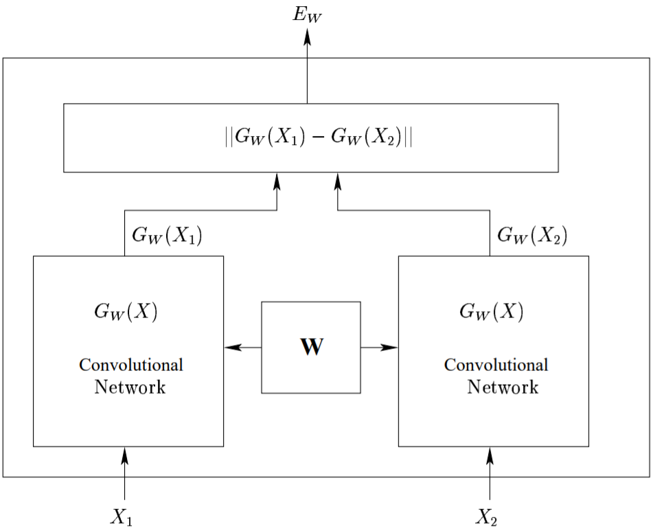
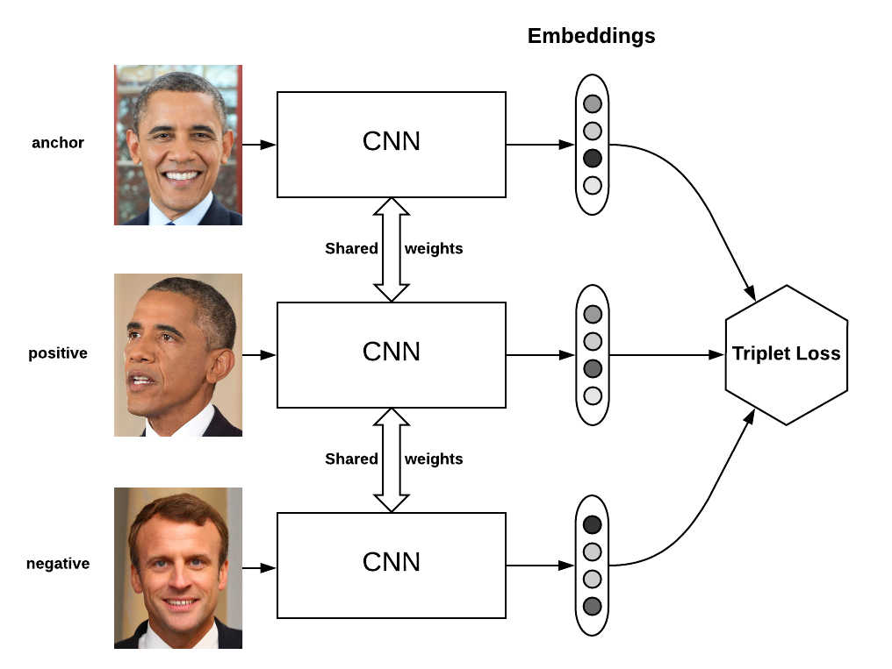
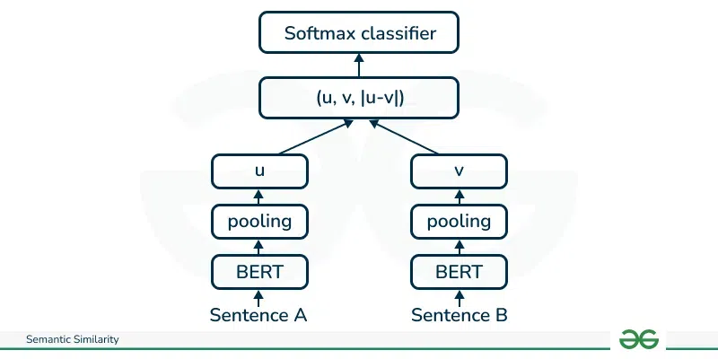
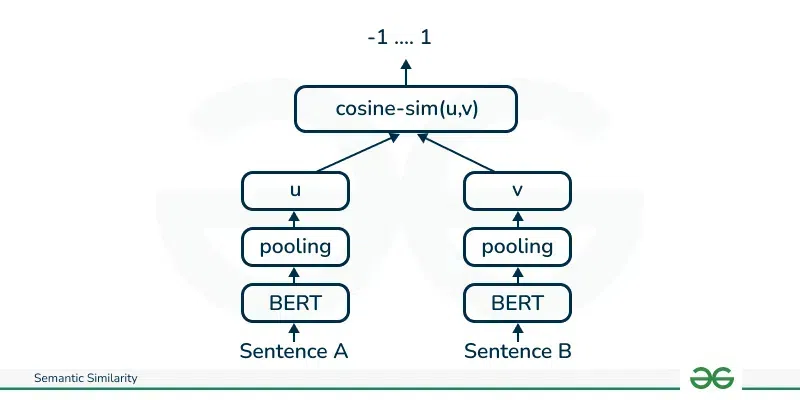
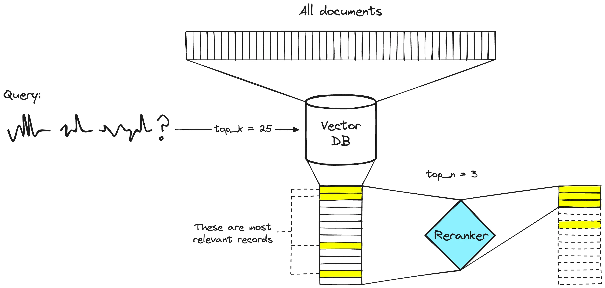

# rag

## Reference

- https://medium.com/itnext/deep-learning-in-information-retrieval-part-i-introduction-and-sparse-retrieval-12de0423a0b9

- https://medium.com/@aikho/deep-learning-in-information-retrieval-part-ii-dense-retrieval-1f9fecb47de9

- https://www.ai-bites.net/rag-embedding-for-rag/

- https://www.ai-bites.net/rag-7-indexing-methods-for-vector-dbs-similarity-search/

- sentence-bert：https://www.geeksforgeeks.org/nlp/different-techniques-for-sentence-semantic-similarity-in-nlp/

- https://zhuanlan.zhihu.com/p/659682364

- https://towardsdatascience.com/comprehensive-guide-to-approximate-nearest-neighbors-algorithms-8b94f057d6b6/

## 信息检索常用指标

一、词频（Term Frequency, TF）

**定义**：衡量一个词在某篇文档中出现的频率，反映该词对文档的重要性. 

公式：

$$ 
\text{TF}(t, d) = \frac{\text{该词 } t \text{ 在文档 } d \text{ 中出现的次数}}{\text{文档 } d \text{ 中所有词的总次数}} 
$$

实际应用中常直接使用“出现次数”作为TF（不做归一化）：  
$$ \text{TF}(t, d) = \text{词 } t \text{ 在文档 } d \text{ 中出现的次数} $$

示例：
文档 $d$ 内容为“苹果 苹果 手机 发布”，总词数为4.   
- 词“苹果”的TF = 2/4 = 0.5（或直接记为2）.   
- 词“手机”的TF = 1/4 = 0.25（或直接记为1）. 

二、逆文档频率（Inverse Document Frequency, IDF）

**定义**：衡量一个词在整个语料库中的“普遍重要性”——若一个词在多数文档中出现（如“的”“是”），则IDF值低（重要性低）；若仅在少数文档中出现，则IDF值高（重要性高）. 

公式：

$$ 
\text{IDF}(t) = \log\left( \frac{\text{语料库中文档总数 } N}{\text{包含词 } t \text{ 的文档数 } N_t + 1} \right) 
$$

说明：
- 分母加1是为了避免“包含词 $t$ 的文档数为0”时的除数为0问题（平滑处理）.   
- 对数通常以2或自然对数为底，目的是降低IDF值的增长幅度. 

示例：
语料库有1000篇文档（$N=1000$），其中包含词“苹果”的文档有10篇（$N_t=10$）.   

$$ 
\text{IDF}(苹果) = \log\left( \frac{1000}{10 + 1} \right) \approx \log(90.9) \approx 6.4 \, (\text{以2为底时}) 
$$

三、TF-IDF 权重（补充）

TF-IDF 是 TF 和 IDF 的乘积，用于衡量一个词在特定文档中的“重要性”（既考虑词在文档中的频率，也考虑其在语料库中的普遍程度）：  

$$ 
\text{TF-IDF}(t, d) = \text{TF}(t, d) \times \text{IDF}(t) 
$$

四、BM25 分数

BM25 是对 TF-IDF 的优化，常用于稀疏检索中的文档排序，考虑了文档长度对词频的影响（避免长文档因包含更多词而被高估）. 

公式：

$$ 
\text{BM25}(q, d) = \sum_{t \in q} \text{IDF}(t) \times \frac{\text{TF}(t, d) \times (k_1 + 1)}{\text{TF}(t, d) + k_1 \times \left( (1 - b) + b \times \frac{|d|}{\text{avg\_dl}} \right)} 
$$

参数说明：
- $q$ 为查询，$t \in q$ 表示查询中的每个词；  
- $k_1$：控制词频饱和的参数（通常取1.2，值越大，词频对分数的影响越大）；  
- $b$：控制文档长度影响的参数（通常取0.75，$b=0$ 则忽略文档长度）；  
- $|d|$：当前文档 $d$ 的长度（词数）；  
- $\text{avg\_dl}$：语料库中所有文档的平均长度. 

核心逻辑：
长文档中的词频会被“惩罚”——若文档长度远大于平均长度，即使词频高，分数增长也会放缓. 

五、余弦相似度（Cosine Similarity）

用于衡量两个向量（如文本的TF-IDF向量或密集检索的嵌入向量）的方向相似性，值范围为 \([-1, 1]\)，值越大表示越相似. 

公式：

对于两个向量 $\vec{A} = (a_1, a_2, ..., a_n)$ 和 $\vec{B} = (b_1, b_2, ..., b_n)$：  

$$ 
\cos(\theta) = \frac{\vec{A} \cdot \vec{B}}{||\vec{A}|| \times ||\vec{B}||} = \frac{\sum_{i=1}^n a_i \times b_i}{\sqrt{\sum_{i=1}^n a_i^2} \times \sqrt{\sum_{i=1}^n b_i^2}} 
$$

说明：
- 分子是向量的**点积**（衡量向量同向性）；  
- 分母是向量模长的乘积（归一化处理，消除向量长度影响）. 

示例：
向量 $\vec{A} = (1, 2, 3)$，$\vec{B} = (4, 5, 6)$：  
- 点积 = $1×4 + 2×5 + 3×6 = 4 + 10 + 18 = 32$；  
- $||\vec{A}|| = \sqrt{1^2 + 2^2 + 3^2} = \sqrt{14} \approx 3.74$；  
- $||\vec{B}|| = \sqrt{4^2 + 5^2 + 6^2} = \sqrt{77} \approx 8.77$；  
- 余弦相似度 = $32 / (3.74 × 8.77) \approx 32 / 32.8 \approx 0.976$（高度相似）. 

六、欧几里得距离（Euclidean Distance）
用于衡量两个向量在空间中的直线距离，值越小表示越相似（与余弦相似度不同，它受向量长度影响）. 

公式：

对于两个向量 $\vec{A} = (a_1, a_2, ..., a_n)$ 和 $\vec{B} = (b_1, b_2, ..., b_n)$：

$$ 
\text{距离} = \sqrt{\sum_{i=1}^n (a_i - b_i)^2} 
$$

示例：
向量 $\vec{A} = (1, 2, 3)$，$\vec{B} = (4, 5, 6)$：  
$$ 
\text{距离} = \sqrt{(1-4)^2 + (2-5)^2 + (3-6)^2} = \sqrt{9 + 9 + 9} = \sqrt{27} \approx 5.2 
$$

这些指标是信息检索的基础，稀疏检索主要依赖TF、IDF、BM25，密集检索则常用余弦相似度或欧几里得距离衡量向量相似性. 

## rag流程

1. 检索数据收集
2. 数据分块：将数据分解成更小、更易于管理的部分. 
3. 文档嵌入：将分块后的源数据转换为向量表示. 
4. 处理用户查询：当用户查询进入系统时，也需要将其转换为嵌入或向量表示. 必须使用相同的模型对文档和查询进行嵌入，以确保两者之间的一致性. 一旦查询转换为嵌入，系统会比较查询嵌入与文档嵌入，使用余弦相似度和欧几里得距离等度量方法，识别并检索与查询嵌入最相似的块. 
5. 相似块重排：
6. 使用大型语言模型生成响应：检索到的文本块与初始用户查询一起输入到语言模型中. 

### 嵌入模型（embedding model）

- 孪生网络（双塔模型）

孪生网络使用的损失函数是对比学习损失函数，比如 Contrastive Loss 和 infoNCE loss：

Contrastive Loss：

$$
\mathcal{L} = (1 - Y)\frac{1}{2}(D_W)^2 + (Y)\frac{1}{2}\{max(0, m - D_W)\}^2
$$

其中 $D_W$ 被定义为孪生网络两个输入之间的欧氏距离，即：

$$
D_W = \sqrt{\{G_W(X_1) - G_W(X_2)\}^2}
$$

**$Y$**：取值为 0 或 1. 若样本对 $X_1, X_2$ 属于同一类，则 $Y = 0$；反之 $Y = 1$. 
**$m$**：边际价值（margin value）. 当 $Y = 1$ 时，若 $X_1$ 与 $X_2$ 之间距离大于 $m$，则不进行优化（省时省力）；若距离小于 $m$，则调整参数使其距离增大到 $m$. 

- 三胞胎网络

假设有3个句子，其中s1和s2语义相近，s1和s3语义相反. 将三个句子分别输入三个神经网络（完全一样且共享参数），得到3个输出. 我们希望output1和output2的距离尽可能接近，output1和output3距离尽可能远，至于output2和output3的距离，我们可以不用理会

三胞胎网络的损失函数为三元组损失（Triplet Loss）：

$$
max(||s_1 - s_2|| - ||s_1 - s_3|| + \epsilon, 0)，
$$

其中 $s_1$、$s_2$、$s_3$分别是锚定句子、正样本句子和负样本句子的句子嵌入，$||\cdot||$ 是距离度量，$\epsilon$ 是间隔. 间隔 $\epsilon$ 确保 $s_2$ 至少比 $s_3$ 更接近 $s_1$. 

- sentence-bert
    - 输入：两个sentence
    - 结构：双塔模型，共享参数，bert->pooling->u, bert->pooling-v, 
    - output：
        - 分类型：softmax(u,v,|u-v|)，训练数据：{(s_a1,s_b1,-1),(s_a2,s_b2,1),...}，1是相关，-1是不相关，优化损失函数是交叉熵
        - 回归型：余弦相似度(u,v)，训练数据：{(s_a1,s_b1,余弦相似度),(s_a2,s_b2,余弦相似度),...}，优化损失函数是均方根误差
        

- jina-embedding-v1
    - 二元训练；子网络初始化为T5；损失函数
    - 三元组训练；子网络初始化为二元训练后的模型；损失函数

- jina-embedding-v2
    - 预训练修改后的 BERT；注意力机制修改为 ALiBi 注意力机制，使模型能处理长序列；损失函数：
    - 二元训练；子网络初始化为修改后的bert；损失函数：
    - 三元组训练；子网络初始化为二元训练后的模型；损失函数：

### 向量库

- 近似最近邻搜索(ANN search)

- FAISS：Facebook 开源库，支持高效近似最近邻搜索，适合单机场景. 
- Milvus：分布式向量数据库，支持动态数据和混合检索，适合大规模企业级应用. 

### 构造向量索引的方法

向量数据库的索引的构建和对应的近似最近邻搜索算法有关

向量数据库的索引是提升查询效率的核心环节，其核心目标是在保证一定准确性的前提下，加速高维向量的相似性搜索（尤其是近似最近邻搜索，ANN）. 根据文档内容，常见的向量索引构建方法可归纳为以下7种：

1. 扁平索引（Flat Indexing / 精确匹配）
- **原理**： brute-force（暴力搜索）算法，不对向量进行修改或聚类. 对于每个查询向量，计算其与数据库中所有向量的距离，返回最接近的前k个结果. 

2. 局部敏感哈希（Local Sensitivity Hashing, LSH）
- **原理**：通过哈希函数将高维向量分组到不同“桶”中，相似向量更可能被分到同一桶. 查询时仅在目标桶内搜索，减少比对范围. 

3. 分层可导航小世界（Hierarchical Navigable Small World, HNSW）
- **原理**：基于图结构的分层算法，在“小世界网络”（NSW）基础上增加层级结构. 
  - 向量被组织为多层图，上层为稀疏连接，下层为密集连接. 
  - 查询时从最高层随机节点开始，逐层向下遍历，优先选择相似度更高的邻居，直至底层找到最优结果. 

4. 倒排文件索引（Inverted File Index, IVF）
- **原理**：基于聚类的算法，通过“Voronoi图”将向量空间划分为多个“单元格”（Voronoi cells），每个单元格由一个“质心”（centroid）定义. 
  - 向量被分配到距离最近的质心对应的单元格中. 
  - 查询时先找到与查询向量最接近的质心，再在其单元格及周边若干单元格（通过“probes”参数控制，如nprobe=8表示检查8个单元格）中搜索. 

5. 乘积量化（Product Quantization, PQ）
- **原理**：将高维向量拆分为多个等长的子向量，对每个子向量单独聚类（用k-means生成质心）. 查询时，子向量与对应聚类的质心比对，通过组合子向量的匹配结果找到整体相似的向量. 

6. ANNOY（Approximate Nearest Neighbour Oh Yeah）
- **原理**：由Spotify开发的C++库（支持Python接口），通过超平面递归分割向量空间，构建树形层次结构. 
  - 索引阶段：不断用超平面将向量集一分为二，直至每个叶子节点包含最多k个向量（k通常为100）. 
  - 查询阶段：从根节点开始，根据超平面判断查询向量属于哪个子节点，逐层深入，最终在叶子节点中返回前k个相似向量. 

7. 随机投影（Random Projection）
- **原理**：通过随机生成的投影矩阵，将高维向量映射到低维空间，同时保留向量间的相似性. 查询时用同一矩阵投影查询向量，在低维空间中搜索. 

### rag 检索方法

#### Sparse retrieval

稀疏检索是传统信息检索的基础技术，核心是通过高维稀疏向量表示文本，依赖 “关键词精确匹配” 实现检索. 

核心原理：
- 文本表示：将文本转化为 “稀疏向量”—— 向量维度等于词汇表大小，每个维度对应一个词，值为该词在文本中的 “重要性”（如词频 TF、逆文档频率 IDF 等）. 
例如，“苹果发布了新手机” 的向量中，“苹果”“发布”“手机” 等词的维度有值，其他词（如 “香蕉”“汽车”）的维度值为 0，因此向量是 “稀疏” 的. 
- 匹配逻辑：通过计算查询向量与文档向量的 “相似度”（如内积、BM25 分数），筛选出关键词重叠度高的文档. 

#### Dense Retrieval

密集检索是深度学习时代的主流技术，核心是通过低维稠密向量表示文本，依赖 “语义相似度匹配” 实现检索. 

核心原理：
- 文本表示：将文本转化为 “密集向量”—— 通过预训练语言模型（如 BERT、Sentence-BERT）将文本编码为低维向量（通常 256-1024 维），每个维度均有值（非零），因此向量是 “稠密” 的. 
例如，“苹果发布新手机” 和 “iPhone 的新品发布会” 会被编码为相似的密集向量，因为模型理解两者语义相关. 
- 匹配逻辑：通过计算查询向量与文档向量的 “语义相似度”（如余弦相似度、欧氏距离），筛选出语义相关的文档，不依赖关键词是否完全重叠. 

#### 混合检索

混合检索是结合稀疏检索和密集检索的优势，通过 “互补机制” 提升检索效果的技术，是当前工业界的主流方案. 

核心原理：
- 稀疏检索擅长 “精确关键词匹配”，但语义理解弱；密集检索擅长 “语义关联匹配”，但可能漏检关键关键词. 混合检索通过组合两者的结果，兼顾 “精确性” 和 “语义相关性”. 
- 融合方式为分数加权：分别计算稀疏检索分数（如 BM25）和密集检索分数（如余弦相似度），通过加权公式（如线性加权、学习权重）融合为最终分数，排序后返回结果. 

### reranker

- 两阶段检索系统：第一阶段模型（embedding model）从更大的数据集中检索一组相关文档. 然后，第二阶段模型（reranker）用于对第一阶段模型检索到的文档进行重新排序. 重新排序器速度慢，而检索器速度快. 

### Embedding微调

### Reranker微调