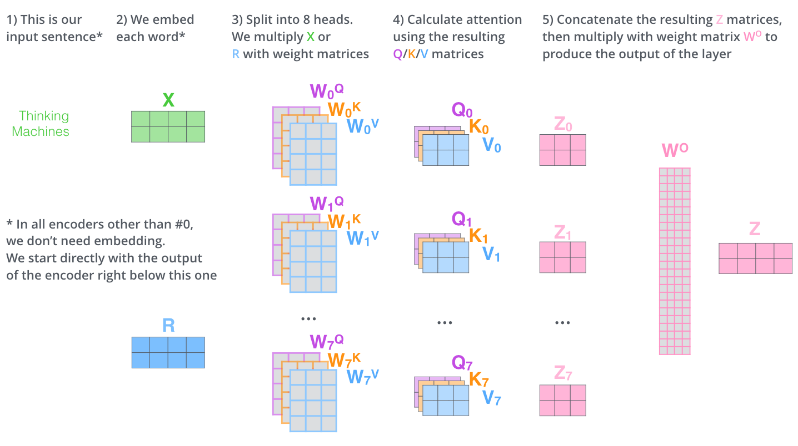
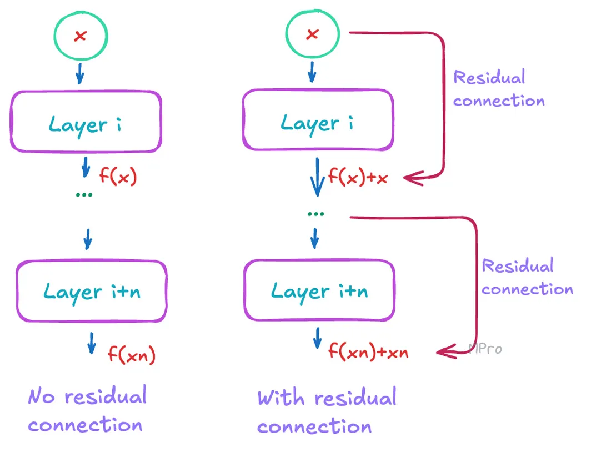
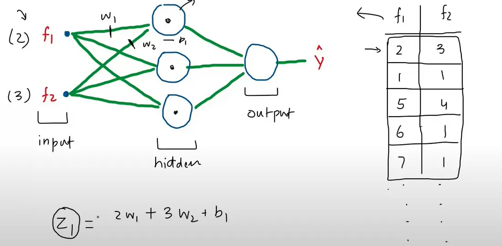
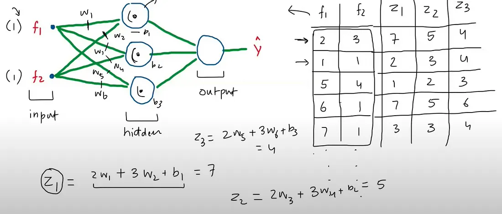
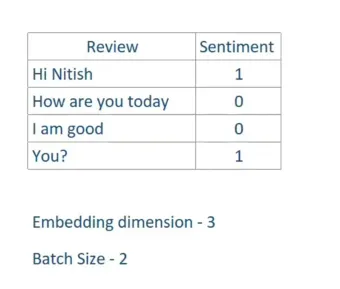
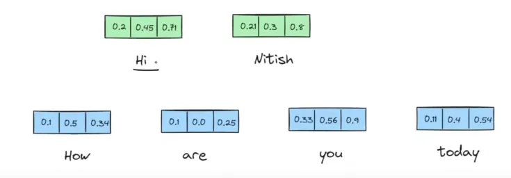
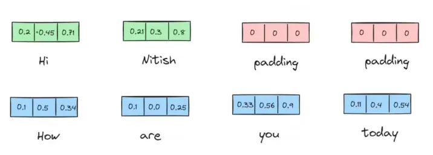
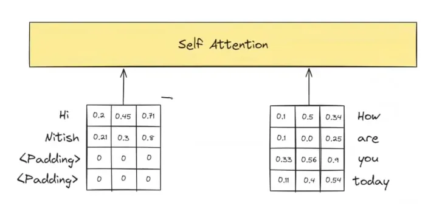
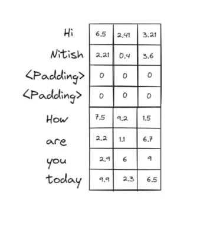
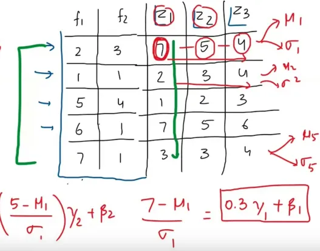

# Transformer


## Reference

- https://web.stanford.edu/~jurafsky/slp3/9.pdf
- https://spaces.ac.cn/archives/8231
- https://spaces.ac.cn/archives/8265
- https://gmongaras.medium.com/how-do-self-attention-masks-work-72ed9382510f
- https://medium.com/@mariaprokofieva/attention-in-transformers-residual-connection-layer-a-shortcut-that-makes-it-work-165b52566167
- https://medium.com/@sachinsoni600517/layer-normalization-in-transformer-1a2efbff8b85
- https://medium.com/@joaolages/kv-caching-explained-276520203249


## Tokenization（分词）

- Tokenization是将一个整体（例如词、短语、句子、段落甚至语音、图像）分割成较小单位（被称为token）的过程.

- 中文分词难点：分词标准，切分歧义，未登录词（OOV，Out of Vocabulary 新词）

- Tokenization算法类型： word-based、character-based、subword-based.
    - Word-based：将文本按自然语言中的 “词” 进行分割，通常以空格、标点符号或特定分隔符作为分词边界. 例如英语中按空格分割，汉语则需要专门的分词工具（如 jieba）. 
        - “I love natural language processing” $\leftarrow$ ["I", "love", "natural", "language", "processing"]
        - 词级单位保留完整语义，但词汇表庞大，未登录词（OOV）问题突出
    - Character-based：将文本拆解为最小字符单元，每个字符（包括标点、空格）作为独立 token. 例如：
        - “Hello!” $\leftarrow$ ["H", "e", "l", "l", "o", "!"]
        - 词汇表极小，无 OOV 问题，但丢失词级语义
    - Subword-base：介于词与字符之间的折中方案，将词拆分为有意义的子词单元（如前缀、后缀、词根），平衡词汇表大小与语义保留. 
        - BPE（Byte Pair Encoding）
        - BBPE
        - WordPiece
        - Unigram
- GPT2使用BBPE，Bert使用WordPiece

### BPE

BPE核心逻辑是：  
**从字符级别开始，通过迭代合并高频相邻字符对，逐步构建更有语义的子词单元**，最终平衡词汇表大小与语义表达能力. 


**初始化：字符级分割与频率统计**
 
- **示例**：  
  假设语料中包含词：*“low”, “lower”, “new”, “newest”*  
  初始分割后：  
  ```
  low → l o w </w>  
  lower → l o w e r </w>  
  new → n e w </w>  
  newest → n e w e s t </w>
  ```  
  统计相邻字符对频率：  
  - (“l”, “o”): 2次（来自“low”和“lower”）  
  - (“o”, “w”): 2次  
  - (“w”, “</w>”): 1次  
  - (“w”, “e”): 1次（来自“lower”）  
  - (“e”, “r”): 1次  
  - (“n”, “e”): 2次（来自“new”和“newest”）  
  - (“e”, “w”): 2次  
  - (“w”, “e”): 1次（来自“newest”）  
  - …（其他低频对）

**迭代合并：高频字符对升级为子词**
- **核心规则**：每次选择**出现频率最高的字符对**，将其合并为一个新的子词单元，并更新词表和频率统计.   
- **示例（第一次迭代）**：  
  最高频对为(“l”, “o”)和(“n”, “e”)（均2次），假设先合并(“l”, “o”) → 新子词“lo”.   
  合并后词表更新：  
  ```
  low → lo w </w>  
  lower → lo w e r </w>  
  new → n e w </w>  
  newest → n e w e s t </w>
  ```  
  重新统计字符对频率：  
  - (“lo”, “w”): 2次（来自“low”和“lower”）  
  - (“w”, “</w>”): 1次  
  - (“w”, “e”): 1次  
  - (“e”, “r”): 1次  
  - (“n”, “e”): 2次  
  - (“e”, “w”): 2次  
  - (“w”, “e”): 1次  
  - …  
- **第二次迭代**：最高频对为(“n”, “e”)和(“e”, “w”)（均2次），合并(“n”, “e”) → “ne”.   
  词表更新为：  
  ```
  new → ne w </w>  
  newest → ne w e s t </w>
  ```  
  继续此过程，直到达到预设的迭代次数或词汇表大小. 


**形式化定义**
- 设初始词表为字符集合 $V_0 = \{c_1, c_2, ..., c_n, </w>\}$，  
- 第 $k$ 次合并后的词表为 $V_k$，  
- 合并操作 $\text{merge}(V_{k-1})$ 选择频率最高的字符对 $(a, b) \in V_{k-1} \times V_{k-1}$，生成新子词 $ab$，并更新 $V_k = V_{k-1} \cup \{ab\}$. 


**BPE算法流程**
1. **计算初始词表**：先把训练语料分成最小单元（英文中26个字母加上各种符号以及常见中文字符），这些作为初始词表.   
2. **构建频率统计**：统计所有子词单元对（bigram，即两个连续的子词）在文本中的出现频率.   
3. **合并频率最高的子词对**：合并出现频率最高的子词对，并更新词汇表和`merge rule`.   
4. **重复合并步骤**：不断重复步骤 2 和步骤 3，直到达到预定的词汇表大小、合并次数，或者直到不再有有意义的合并（即，进一步合并不显著提高词汇表的效益）.   
5. **分词**：使用最终得到的`merge rule`对文本进行分词. 

BPE分词流程：


### Word-Piece

计算过程绝大部分与BPE一致，将挑选bigram的指标从频率换成了PMI（点互信息，[Pointwise Mutual Information](https://en.wikipedia.org/wiki/Pointwise_mutual_information)）：  

$$ \text{PMI}(a, b) = \frac{P(a, b)}{P(a)P(b)} $$  
其中 $a$、$b$ 为相邻的subword.   

当 PMI 值较高时，表示 $a$ 和 $b$ 在一起出现的频率远高于它们各自独立出现的概率，说明它们之间的关联较强，可能是一个有意义的组合.   


**Word-Piece算法过程**  
1. **计算初始词表**：通过训练语料获得，或初始为英文26个字母 + 符号 + 常见中文字符，作为初始词表.   
2. **计算合并分数（PMI）**：对训练语料拆分的子词单元，按合并规则计算两两子词的PMI分数.   
3. **合并分数最高的子词对**：选择PMI最高的子词对，合并为新子词单元，更新词表.   
4. **重复合并步骤**：循环执行步骤2 - 3，直到达到预定词表大小、合并次数，或无意义合并（合并无法显著提升词表效益）.   
5. **分词**：用最终词汇表对文本分词（对比BPE，直接依赖词汇表匹配分词 ）. 


**Word-Piece分词流程**：

正向最大匹配法（Forward Maximum Matching, FMM）

原理：从左到右扫描句子，尽可能匹配最长的词语.   

步骤：
1. 设置一个最大词长（如6）.   
2. 从句子的起始位置开始，取最大词长的子串，与词汇表匹配.   
3. 如果匹配成功，则切分该词，继续处理剩余部分；否则，缩短词长，继续匹配.   
4. 重复上述步骤，直到句子全部切分完毕. 

### Unigram

## Embedding

- onehot

- word2vec
    - CBOW
    - skip-gram


## 多头注意力（MHA）





### 注意力机制的简化版本
从本质上讲，注意力机制实际上就是上下文向量的加权和，只是在权重的计算方式以及求和对象方面存在诸多复杂情况. 我们首先来描述一种对注意力机制的简化直观理解. 在这种理解中，位置 $i$ 处的注意力输出 $\mathbf{a}_i$ ，就是所有满足 $j \leq i$ 的 $\mathbf{x}_j$ 的加权和；我们用 $\alpha_{ij}$ 来表示 $\mathbf{x}_j$ 对 $\mathbf{a}_i$ 的贡献程度：

**简化版本**： $\mathbf{a}_i = \sum_{j \leq i} \alpha_{ij} \mathbf{x}_j$   

每个 $\alpha_{ij}$ 是一个标量，用于在对输入进行求和以计算 $\mathbf{a}_i$ 时，对输入 $\mathbf{x}_j$ 的价值进行加权. 那我们该如何计算这种 $\alpha$ 加权呢？在注意力机制中，我们会根据每个之前的嵌入与当前标记 $i$ 的相似度，按比例对其进行加权. 所以，注意力机制的输出是之前标记嵌入的加权和，权重由这些嵌入与当前标记嵌入的相似度决定. 我们通过**点积**来计算相似度分数，点积会将两个向量映射为一个取值范围从 $-\infty$ 到 $+\infty$ 的标量值. 分数越大，表明正在比较的向量越相似. 我们会使用softmax函数对这些分数进行归一化，从而得到权重向量 $\alpha_{ij}$ （其中 $j \leq i$  ）. 

**简化版本**：

相似度分数计算： $\text{score}(\mathbf{x}_i, \mathbf{x}_j) = \mathbf{x}_i \cdot \mathbf{x}_j$

权重计算： $\alpha_{ij} = \text{softmax}(\text{score}(\mathbf{x}_i, \mathbf{x}_j))$  ，对所有 $j \leq i$   

这样一来，我们计算 $\mathbf{a}_3$ 时，要先计算三个分数： $\mathbf{x}_3 \cdot \mathbf{x}_1$ 、 $\mathbf{x}_3 \cdot \mathbf{x}_2$ 和 $\mathbf{x}_3 \cdot \mathbf{x}_3$  ，接着用softmax函数对这些分数进行归一化，然后将得到的概率作为权重，以此表明它们各自与当前位置 $i$ 的比例相关性. 当然 softmax 权重对于 $\mathbf{x}_i$ 而言可能会最高，因为 $\mathbf{x}_i$ 与自身非常相似，从而产生较高的点积. 但其他上下文单词也可能与 $i$ 相似，softmax 也会为这些单词分配一定权重. 

既然我们已经了解了注意力机制的简单直观概念，接下来介绍 Transformer 中实际使用的注意力头（attention head），也就是 Transformer 里用于特定结构化层的注意力版本（“头” 这个词在 Transformer 中常用来指代特定的结构化层 ）. 注意力头让我们能够清晰地表示每个输入嵌入在注意力过程中所扮演的三种不同角色： 
- 作为当前元素，与之前的输入进行比较. 我们将把这种角色称为**查询（query）** . 
- 作为与当前元素进行比较以确定相似度权重的**先前输入** . 我们将把这种角色称为**键（key）** .  
- 最后，作为先前元素的**值（value）** ，其经过加权并求和，以计算当前元素的输出.   

为了体现这三种不同角色，Transformer 引入了权重矩阵 $\mathbf{W}^Q$、 $\mathbf{W}^K$ 和 $\mathbf{W}^V$ . 这些权重会将每个输入向量 $\mathbf{x}_i$ 投影到其作为键、查询或值的表示形式： 

$$
\mathbf{q}_i = \mathbf{x}_i \mathbf{W}^Q; \quad \mathbf{k}_i = \mathbf{x}_i \mathbf{W}^K; \quad \mathbf{v}_i = \mathbf{x}_i \mathbf{W}^V 
$$ 

有了这些投影，当我们计算当前元素 $\mathbf{x}_i$ 与某些之前的元素 $\mathbf{x}_j$ 的相似度时，会使用当前元素的查询向量 $\mathbf{q}_i$ 和之前元素的键向量 $\mathbf{k}_j$ 之间的点积. 此外，点积的结果可能是任意大的（正或负）值，在训练过程中，极大的值会导致数值问题（梯度消失和梯度爆炸 ）. 为避免这种情况，我们会将点积除以一个与查询和键向量维度（ $d_k$ ）相关的因子.

以下是为单个自注意力头计算自注意力的一整套公式，输入为单个向量 $\mathbf{x}_i$ ，输出为向量 $\mathbf{a}_i$ . 这种注意力版本通过对之前元素的值进行求和来计算 $\mathbf{a}_i$ ，每个值的权重由其键与当前元素查询的相似度决定： 

$$
\mathbf{q}_i = \mathbf{x}_i \mathbf{W}^Q; \quad \mathbf{k}_j = \mathbf{x}_j \mathbf{W}^K; \quad \mathbf{v}_j = \mathbf{x}_j \mathbf{W}^V 
$$ 

$$
\text{score}(\mathbf{x}_i, \mathbf{x}_j) = \frac{\mathbf{q}_i \cdot \mathbf{k}_j}{\sqrt{d_k}} 
$$

$$
\alpha_{ij} = \text{softmax}(\text{score}(\mathbf{x}_i, \mathbf{x}_j)) \quad \forall j \leq i 
$$ 

$$
\text{head}_i = \sum_{j \leq i} \alpha_{ij} \mathbf{v}_j 
$$

$$
\mathbf{a}_i = \text{head}_i \mathbf{W}^O 
$$ 

## 位置编码（Positional Encoding）

- 绝对位置编码
    - 固定的正余弦位置编码

- 相对位置编码
    - 旋转位置编码 

## 掩码（Mask）


掩码核心逻辑（结合矩阵）

掩码是自注意力机制中**控制信息可见范围**的工具，通过修改 $QK^T$ 矩阵（注意力分数矩阵）实现，让模型“看不到”特定位置信息，避免干扰. 核心围绕三类场景，用矩阵运算直观解释：


1. 填充掩码（Padding Mask）

作用：屏蔽无效填充（如 `<PAD>`），避免干扰有效序列  
矩阵操作：  
假设序列为 `[a, b, c, <PAD>]`，对应 $Q、K、V$ 矩阵维度为 $4 \times d$（$d$ 为维度）.   
- **Step 1**：计算原始 $QK^T$ 矩阵（$4 \times 4$），包含所有 token 两两关联分数（如 $a$ 与 `<PAD>` 的关联）.   
- **Step 2**：构造**掩码矩阵 $M$**，在 `<PAD>` 对应列填 $-\infty$（其他位置为 $0$ ）：  
  $$
  M = \begin{bmatrix}
  0 & 0 & 0 & -\infty \\
  0 & 0 & 0 & -\infty \\
  0 & 0 & 0 & -\infty \\
  0 & 0 & 0 & -\infty \\
  \end{bmatrix}
  $$  
- **Step 3**：修改注意力分数：$QK^T + M$ 后，`<PAD>` 列变为 $-\infty$，softmax 后这些位置权重**归零**，最终 $V$ 加权时，`<PAD>` 不再影响有效 token（如 $a、b、c$ ）的输出.   

2. 前瞻掩码（Look - ahead Mask）

作用：让模型“只看过去”（适配自回归，如语言生成）  

前瞻掩码最初用于《Attention is All You Need》论文中的原始 Transformer 模型，其作用是使模型能够一次训练整个文本序列，而不是一次训练一个词. 原始的 Transformer 模型是自回归模型，这意味着它只使用过去的数据进行预测. 原始 Transformer 用于翻译，因此这种模型是有意义的. 

当预测翻译后的句子时，模型会一次预测一个词. 例如，有一个句子："How are you"，模型会一次将其翻译成西班牙语一个词：

预测 1：给定 "", 模型预测下一个词是"como"
预测 2：给定 "como", 模型预测下一个词是 "estas"
预测 3：给定 "como estas", 模型预测下一个词是 "<END>"，表示序列结束

如果我们想让模型学习这个翻译，可以一次喂入一个词，模型进行三次预测. 这个过程非常慢，因为需要 S（序列长度）次推理才能从模型获得一个句子的翻译预测. 相反，我们喂入整个句子 "como estas <END>..."，并使用一个巧妙的掩码技巧，使模型无法看到未来的 token，只能看到过去的 token. 这样，只需要一次推理步骤就能从模型获得整个句子的翻译. 

#### 矩阵操作：  
假设序列为 `[a, b, c, d]`，需让 $a$ 看不到 $b/c/d$，$b$ 看不到 $c/d$ 等.   
- **Step 1**：构造**下三角掩码 $M$**（上三角填 $-\infty$ ，下三角及对角线为 $0$ ）：  
  $$
  M = \begin{bmatrix}
  0 & -\infty & -\infty & -\infty \\
  0 & 0 & -\infty & -\infty \\
  0 & 0 & 0 & -\infty \\
  0 & 0 & 0 & 0 \\
  \end{bmatrix}
  $$  
- **Step 2**：$QK^T + M$ 后，上三角（未来位置）变为 $-\infty$，softmax 后这些位置权重归零. 最终 $V$ 加权时，每个 token 仅关联**自身及之前的 token**（如 $b$ 仅关联 $a、b$ ），模拟“逐步生成”逻辑.   


## 残差连接（Residual Connection）


一、核心概念与Transformer架构
1. **残差连接的本质**  
    - 定义为输入与模型输出的叠加，公式为`Output = f(X) + X`，相当于为信息传递提供“快捷方式”，让下一层同时接收处理后的输出与原始输入. 

    

    - Transformer 每层含多头自注意力和逐位置前馈网络两个子层，都配备残差连接. 

二、残差连接的工作原理与优势
1. **解决梯度消失问题**  
    - **无残差连接**：反向传播中梯度随层数增加而减小，深层网络易出现梯度消失，导致训练困难.   
    - **有残差连接**：通过叠加原始输入，维持梯度强度，使模型在训练中能进行更大幅度的权重更新，加速学习. 


## 层归一化（Layer Normalization）

让我们快速讨论一下归一化是什么，以及它在深度学习中的作用. 如果您研究机器学习有一段时间了，可能对归一化和标准化等概念并不陌生. 但回顾一下，深度学习中的归一化指的是将数据转换为符合特定统计特性的过程. 

归一化有多种形式. 一种常见类型是标准化，即通过减去每列的均值并除以标准差来调整每个数据点. 这种转换会生成一个新列，其均值为 0 且标准差为 1. 另一种类型是最小 - 最大归一化，它将数据缩放到给定范围内. 这些技术的应用是为了确保数据具有一致的规模，这在机器学习中至关重要. 

在深度学习中，归一化可应用于两个关键领域：

输入数据：在将数据输入神经网络之前（例如特征 f1、f2、f3 等），可以对其进行归一化. 这一步与传统机器学习中的做法类似. 

隐藏层激活值：也可以对神经网络中隐藏层的激活值（输出）进行归一化. 这通常用于稳定和加速训练，尤其是在深度网络中. 

为什么归一化在深度学习中如此重要？试想一下，当您训练神经网络时，随着权重的更新，其中一些权重会变得很大. 此时，与这些权重相关的激活值也会变大，这会使模型难以有效学习，从而减缓训练速度，甚至导致训练问题. 

归一化通过将激活值保持在稳定范围内来解决这个问题. 这不仅使训练过程更稳定，还能加快训练速度，让模型更高效地学习. 

归一化的另一个重要优势是它可以防止一种称为 “内部协变量偏移” 的问题. 当输入数据的分布在通过网络的各层时发生变化，就会导致模型困惑，这就是内部协变量偏移. 通过对激活值进行归一化，可以保持分布的一致性，使模型能够持续学习而不受干扰. 

此外，某些类型的归一化（如批归一化）甚至有助于正则化，这意味着模型可以更好地泛化到新数据. 很好，现在您已经对归一化的重要性有了清晰的理解，接下来让我们快速回顾一下批归一化. 

批归一化旨在解决一个特定问题，即内部协变量偏移. 要理解这一点，可以想象一个具有多个隐藏层的神经网络. 在训练过程中，由于权重的更新，这些层中激活值的分布会发生变化. 这种分布的变化会使网络难以有效学习，导致训练不稳定. 

内部协变量偏移指的是由于网络权重的不断更新，训练过程中激活值的分布发生变化的问题. 这种偏移会导致每个后续层接收的输入分布不同，从而阻碍稳定学习. 

在神经网络的训练过程中，权重更新会导致激活值分布随时间变化，这一现象的核心原因与神经网络的前向传播机制和参数迭代更新的特性密切相关，以下是具体解析：  

假设一个两层神经网络，输入为二维数据 $x = [x_1, x_2]$，第一层权重为 $W^1 = \begin{bmatrix} w_{11} & w_{12} \\ w_{21} & w_{22} \end{bmatrix}$，偏置为 $b^1$，线性变换为 $z^1 = W^1 x + b^1$，激活函数为ReLU（$\sigma(z) = \max(0, z)$）.   
- **初始状态**：若 $W^1$ 初始值较小，$z^1$ 的数值分布较集中，ReLU 激活后的输出多为非零值（分布在正数区间）.   
- **权重更新后**：若训练中 $w_{11}$ 和 $w_{12}$ 增大，当输入 $x_1$ 和 $x_2$ 较大时，$z^1$ 的第一个元素可能显著增大，导致ReLU输出饱和（保持较大正值），而其他元素可能因数值较小仍为0. 此时，激活值 $a^1$ 的分布从“多非零值”变为“部分饱和、部分为0”，分布的均值和方差均发生改变.   

批归一化通过对每层的激活值进行归一化来缓解这一问题，确保它们遵循均值为 0 且标准差为 1 的一致分布. 这有助于保持训练的稳定性，并使网络更有效地学习. 通过归一化激活值，批归一化减少了内部协变量偏移的影响，提高了收敛速度，使训练过程更加平滑和可预测. 


让我们通过一个例子来拆解批归一化的工作原理. 我们有一个包含两个特征和若干行数据的简单数据集，将使用这个数据集来训练神经网络.   



我们有一个包含特征 f1 和 f2 的数据集，以及一个具有一个隐藏层的神经网络. 目标是对隐藏层节点的输出应用批归一化，因为我们以批次处理数据. 为简单起见，假设批大小为 5，这意味着我们将一次向神经网络输入 5 行数据.   

批归一化的步骤如下：  
1. **计算激活值**：  
   - 对于批次中的每一行，计算隐藏层节点的激活值.   
   - 为简单起见，我们关注三个节点及其激活值 z1、z2 和 z3，假设对批次中的每一行都计算这些值.   

   

2. **归一化激活值**：  
   - 步骤 1：计算批次中每个激活值的均值（$\mu$）和标准差（$\sigma$）.   
     - 对于 z1：计算均值 $\mu_1$ 和标准差 $\sigma_1$.   
     - 对于 z2：计算均值 $\mu_2$ 和标准差 $\sigma_2$.   
     - 对于 z3：计算均值 $\mu_3$ 和标准差 $\sigma_3$.   
   - 步骤 2：使用公式对每个激活值进行归一化：  
     $$归一化值 = \frac{原始值 - \mu}{\sigma}$$  
     对 z1、z2 和 z3 的所有值应用此公式.   
   - 步骤 3：归一化后，应用缩放和偏移. 每个节点有两个可学习参数：$\gamma$ 和 $\beta$.   
     $$最终值 = (归一化值 \times \gamma) + \beta$$  
     这里，$\gamma$ 和 $\beta$ 最初分别设置为 1 和 0，但在训练过程中会进行调整.   

3. **替换值**：  
   - 用每个节点的归一化值替换原始激活值.   
   - 对批次中的所有行重复此过程.   
4. **应用激活函数**：  
   - 归一化后，将值通过激活函数，得到每个节点的最终输出.   


为什么 Transformer 不使用批归一化？

在 Transformer 架构中，归一化技术的选择对模型性能起着关键作用. 在 Transformer 中优先使用层归一化而非批归一化的主要原因是，批归一化无法有效处理自注意力机制. 简而言之，批归一化在处理序列数据时存在困难，而序列数据是 Transformer 模型的基本组成部分.   

让我们通过一个著名的 Transformer 架构图来深入理解这一点. 您会注意到，归一化步骤紧接在注意力机制之后应用.   


但为什么在这里不使用批归一化呢？为了说明这一点，我将演示当直接对自注意力机制应用批归一化时会发生什么.   


在自注意力机制中，通常从一个句子（如“river bank”）开始，将其拆分为单个单词或标记. 为简单起见，考虑两个标记：“river”和“bank”. 每个单词随后由一个嵌入向量表示. 尽管嵌入向量通常是高维的，但在此示例中假设我们使用四维向量. 重要的是，每个单词的嵌入向量具有相同的维度.   


接下来，这些嵌入向量被输入到自注意力机制中. 自注意力的作用是从这些向量生成上下文嵌入. 如图所示，这是单词“river”的上下文嵌入向量，它考虑了旁边单词“bank”的存在，反之亦然. 请注意，输出向量的维度与输入一致——在此示例中均为四维.   


现在，让我们增加一点复杂度. 到目前为止，我们考虑的是一次向自注意力模块输入一个句子. 但如果我们想同时处理多个句子呢？这就是批处理的用武之地. 我将展示如何以批次的形式向自注意力模块发送多个句子.   

假设我们正在处理一个情感分析任务，数据集包含如下句子：  



为了在这些数据上训练自注意力模块，我们决定一次处理两个句子——即批大小设置为 2. 因此，前两个句子将作为一个批次一起处理，接下来的两个句子同理.   

与之前一样，这些句子中的每个单词都由一个嵌入向量表示，为简单起见，每个嵌入向量的维度保持为 3. 下图展示了每个单词的嵌入：  



在自注意力的背景下，尤其是处理不同长度的序列时，填充（padding）起着至关重要的作用. 让我们通过一个实际示例来深入了解填充的工作原理和必要性.   

这些句子长度不同——一个有两个单词，另一个有四个. 然而，在自注意力中，处理多个句子时需要确保每个句子的单词（标记）数量相等，这就是填充的作用.   



现在两个句子长度相等，可以将它们输入到自注意力模块中. 该模块将基于整个序列为每个单词计算上下文嵌入.   

 


现在，我们将两个上下文嵌入堆叠在一起，如下所示：  



现在，让我们对这个设置应用批归一化，即计算每列的均值和标准差. 然而，需要问自己：计算出的均值和标准差是否真正代表了数据？答案显然是否定的，主要原因是数据中存在许多零. 如果数据中有多个零，会显著影响批归一化的效果. 这就是主要问题——当数据中存在许多零时，批归一化效果不佳.   


结论：为什么批归一化在自注意力中不起作用
根本问题在于，填充标记虽然是对齐所必需的，但它们并非原始数据的一部分. 它们会在数据集中引入大量零，从而误导归一化过程. 这就是为什么在 Transformer 的自注意力环境中不应用批归一化的原因.   


批归一化的解决方案：层归一化的思想

为了解释层归一化，我将使用与批归一化相同的设置. 我们有完全相同的神经网络和数据，因此基础是一致的. 我们仍然在计算 z1、z2 和 z3，它们分别表示所有数据点的第一个、第二个和第三个节点的预激活值.   


一个关键的相似之处是，每个节点都有自己的 $\gamma$ 和 $\beta$ 参数，这个设置与批归一化相同. 然而，主要区别在于归一化的应用方式.   

在批归一化中，归一化是跨批次进行的. 例如，如果将行视为批次，归一化就沿这个方向应用. 但在层归一化中，归一化是跨特征进行的，这意味着归一化是按每行进行的，而不是跨批次.   

要计算层归一化的均值和标准差，需要对每行的所有特征计算均值（$\mu$）和标准差（$\sigma$）. 例如，计算第一行的均值 $\mu_1$ 和标准差 $\sigma_1$，然后是第二行的 $\mu_2$ 和 $\sigma_2$，依此类推，直到最后一行的 $\mu_f$ 和 $\sigma_f$.  



一旦获得这些值，就可以通过减去所在行的均值并除以标准差来归一化每个元素. 例如，要归一化第一行的第一个元素，可以写成：  

$$
归一化值 = \frac{7 - \mu1}{\sigma1}
$$

假设该值为 $p$，下一步是使用 $z_1$ 特有的 $\gamma$ 和 $\beta$ 参数对该值进行缩放和偏移：

$$
输出 = \gamma_1 × p + \beta_1
$$

对该行中的每个元素重复此过程. 通过这种方法，您是跨特征对整个数据集进行归一化，而不是跨批次.   


批归一化与层归一化的关键区别

批归一化和层归一化的主要区别在于归一化的方向. 批归一化跨批次进行归一化，而层归一化跨特征进行归一化. 这一区别至关重要，尤其是在 Transformer 的上下文中，层归一化在处理数据的序列性质方面发挥着关键作用.   

总之，层归一化在 Transformer 架构中提供了一种更合理、更有效的方法，确保即使存在填充，数据也能被准确归一化，从而提升模型的性能和稳定性.   


## Encoder-Decoder

## 解码（Decoding）

## KV Cache