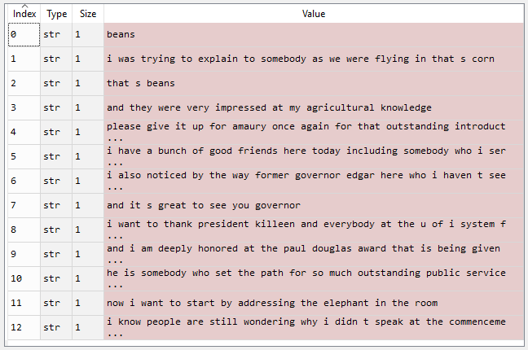
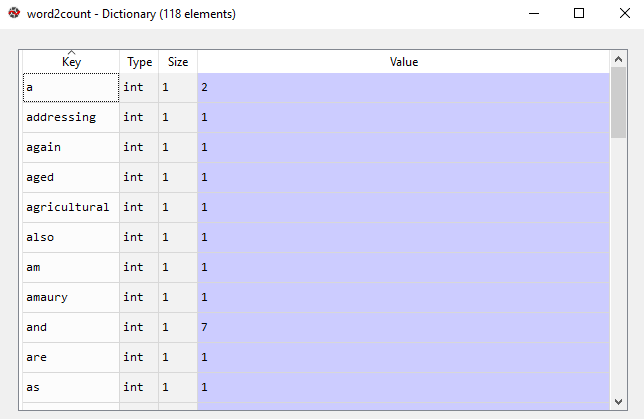
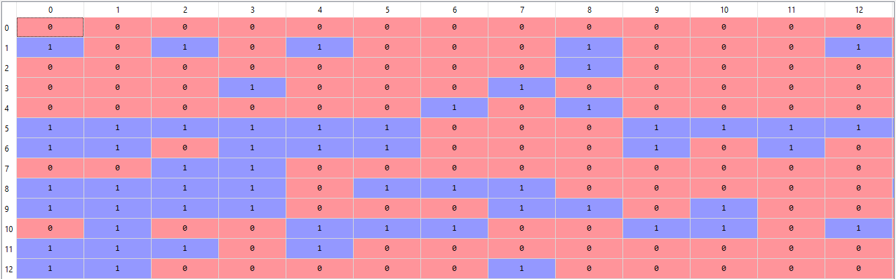

# 文本表示（Text representation）

## Reference
- https://www.geeksforgeeks.org/natural-language-processing-nlp-tutorial/
- https://www.geeksforgeeks.org/ml-one-hot-encoding/
- https://www.geeksforgeeks.org/bag-of-words-bow-model-in-nlp/

- One-Hot Encoding
- Bag of Words (BOW)
- N-Grams
- Term Frequency-Inverse Document Frequency (TF-IDF)
- N-Gram Language Modeling with NLTK

## 独热编码（one-hot Encoding）

独热编码（One Hot Encoding）是一种将分类变量转换为二进制格式的方法。它会为每个类别创建新的列，其中“1”表示该类别存在，“0”表示不存在。独热编码的主要目的是确保分类数据能够在机器学习模型中得到有效应用。

### 独热编码的重要性

我们使用独热编码的原因如下：

1. **消除顺序性影响**：许多分类变量没有内在的顺序（例如“男性”和“女性” ）。如果我们给它们分配数值（例如，男性=0，女性=1），模型可能会错误地将其解释为一种排序，从而导致有偏差的预测结果。独热编码通过独立处理每个类别，消除了这种风险。
2. **提升模型性能**：通过更详细地表示分类变量，独热编码有助于提升机器学习模型的性能。它能让模型捕捉到数据中复杂的关系，而如果将分类变量当作单个实体处理，这些关系可能会被忽略。
3. **适配算法需求**：许多机器学习算法，尤其是基于线性回归和梯度下降的算法，需要数值型输入。独热编码可确保分类变量被转换为合适的格式。

### 独热编码的工作原理：示例

为了更好地理解这个概念，我们来看一个简单的例子。假设有一个数据集，包含水果的分类值及其对应的价格。使用独热编码，我们可以将这些分类值转换为数值形式。例如：
- 只要水果是“苹果”，“苹果”这一列的值就为1，而其他水果列（如“芒果”或“橙子”）的值则为0。

这种模式确保每个分类值都有自己对应的列，并用二进制值（1或0）表示，从而使其能够被机器学习模型使用。

| 水果 | 水果的分类值 | 价格 |
| --- | --- | --- |
| 苹果 | 1 | 5 |
| 芒果 | 2 | 10 |
| 苹果 | 1 | 15 |
| 橙子 | 3 | 20 |

对上述数据应用独热编码后的输出如下：
| Fruit_apple | Fruit_mango | Fruit_orange | 价格 |
| --- | --- | --- | --- |
| 1 | 0 | 0 | 5 |
| 0 | 1 | 0 | 10 |
| 1 | 0 | 0 | 15 |
| 0 | 0 | 1 | 20 |


**使用Scikit-learn库**：Scikit-learn（sklearn）是Python中一个受欢迎的机器学习库，提供了许多数据预处理工具。它提供了`OneHotEncoder`函数，用于将分类变量和数值变量编码为二进制向量。在Scikit-learn库中使用`df.select_dtypes(include=['object'])`：
    - 这会选择仅包含分类数据（数据类型为“object”）的列。
    - 在这个例子中，“Gender”和“Remarks”被识别为分类列。

```python
import pandas as pd
from sklearn.preprocessing import OneHotEncoder

data = {
    'Employee id': [10, 20, 15, 25, 30],
    'Gender': ['M', 'F', 'F', 'M', 'F'],
    "Remarks": ["Good", "Nice", "Good", "Great", "Nice"]
}

df = pd.DataFrame(data)
print(f"Employee data:\n{df}")

categorical_columns = df.select_dtypes(include=['object']).columns.tolist()

encoder = OneHotEncoder(sparse_output=False)
one_hot_encoded = encoder.fit_transform(df[categorical_columns])
one_hot_df = pd.DataFrame(one_hot_encoded, columns=encoder.get_feature_names_out(categorical_columns))
df_encoded = pd.concat([df, one_hot_df], axis=1)
df_encoded = df_encoded.drop(categorical_columns, axis=1)
print(f"Encoded Employee data:\n{df_encoded}")
```

**输出**：

```
Employee data:
   Employee id Gender Remarks
0          10      M   Good
1          20      F   Nice
2          15      F   Good
3          25      M  Great
4          30      F   Nice
Encoded Employee data:
   Employee id  Gender_F  Gender_M  Remarks_Good  Remarks_Great  Remarks_Nice
0          10       0.0       1.0           1.0           0.0           0.0
1          20       1.0       0.0           0.0           0.0           1.0
2          15       1.0       0.0           1.0           0.0           0.0
3          25       0.0       1.0           0.0           1.0           0.0
4          30       1.0       0.0           0.0           0.0           1.0
```


### 独热编码的优缺点

1. **优点**
    - 它允许在需要数值输入的模型中使用分类变量。
    - 通过向模型提供更多关于分类变量的信息，可以提升模型性能。
    - 有助于避免当分类变量具有自然顺序（例如“小”“中”“大” ）时可能出现的顺序性问题。
2. **缺点**
    - 它会增加数据维度，因为变量的每个类别都要创建一个单独的列。这会使模型更加复杂，训练速度也会变慢。
    - 会导致数据稀疏，因为大多数观测值在大多数独热编码列中的值都为0。
    - 尤其当变量中的类别很多，而样本量相对较小时，可能会导致过拟合。


### 独热编码的替代方法

虽然独热编码是处理分类数据的常用方法，但根据具体情况，还有其他几种可能更合适的替代方法：

1. **标签编码**：当分类变量具有自然顺序时（例如“低”“中”“高” ），标签编码可能是更好的选择。这种方法为每个类别分配一个唯一的整数，并且不会像处理名义数据那样，存在层次结构被误判的风险。
2. **二进制编码**：这种技术结合了独热编码和标签编码的优点。它将类别转换为二进制数，然后创建二进制列。这种方法可以在保留信息的同时降低维度。
3. **目标编码**：在目标编码中，我们用每个类别的目标变量均值替换该类别。对于具有大量唯一值的分类变量，这种方法特别有用，但如果处理不当，也存在数据泄漏的风险。 

## 词袋模型（Bag of Words，BoW）

我们将探讨自然语言处理（NLP）中一种文本建模技术——词袋模型。在NLP中，任何算法都只能处理数字数据，因此我们无法直接将文本数据输入算法。词袋模型便是用于将文本预处理为 “词袋” 形式，统计文本中高频词汇的出现次数。

这个模型可以用表格形式直观呈现，表格中记录了每个单词及其对应的出现次数。

### 应用词袋模型

我们以以下段落为例：
> Beans. I was trying to explain to somebody as we were flying in, that's corn. That's beans. And they were very impressed at my agricultural knowledge. Please give it up for Amaury once again for that outstanding introduction. I have a bunch of good friends here today, including somebody who I served with, who is one of the finest senators in the country, and we're lucky to have him, your Senator, Dick Durbin is here. I also noticed, by the way, former Governor Edgar here, who I haven't seen in a long time, and somehow he has not aged and I have. And it's great to see you, Governor. I want to thank President Killeen and everybody at the U of I System for making it possible for me to be here today. And I am deeply honored at the Paul Douglas Award that is being given to me. He is somebody who set the path for so much outstanding public service here in Illinois. Now, I want to start by addressing the elephant in the room. I know people are still wondering why I didn't speak at the commencement.

#### 步骤1：数据预处理

数据预处理步骤如下：

1. 将文本转换为小写形式。
2. 移除所有非单词字符。
3. 移除所有标点符号。

```python
# Python3代码实现文本预处理
import nltk
import re
import numpy as np

# 将文本内容替换此处注释内容后运行代码
# text="***#place text here""** 
dataset = nltk.sent_tokenize(text)
for i in range(len(dataset)):
    dataset[i] = dataset[i].lower()
    dataset[i] = re.sub("\s+", " ", dataset[i])
    dataset[i] = re.sub("\W", "", dataset[i])
```

输出：


预处理后的文本可根据实际需求进一步处理。

#### 步骤2：提取文本中的高频词

生成词袋模型的具体步骤如下：

1. 声明一个字典用于存储词袋。
2. 将每个句子分词成单个单词。
3. 遍历句子中的每个单词，检查该单词是否已在字典中。
4. 如果单词已在字典中，则将其计数加1；如果不在，则将其添加到字典中，并将计数设为1。

```python
# 创建词袋模型
word2count = {}
for data in dataset:
    words = nltk.word_tokenize(data)
    for word in words:
        if word not in word2count.keys():
            word2count[word] = 1
        else:
            word2count[word] += 1
```

输出：



在我们的模型中，共包含118个单词。然而，在处理大量文本时，单词数量可能达到数百万。我们无需使用全部单词，因此可以选择特定数量的高频词。使用以下代码实现：

```python
import heapq
freq_words = heapq.nlargest(100, word2count, key=word2count.get)
```

其中，100代表我们希望提取的单词数量。如果处理的文本量较大，可以设置更大的数值。


#### 步骤3：构建词袋模型

在此步骤中，我们构建一个向量，用于表示每个句子中的单词是否为高频词。如果句子中的单词属于高频词，则将向量对应位置设为1，否则设为0。

通过以下代码实现：

```python
X = []
for data in dataset:
    vector = []
    for word in freq_words:
        if word in nltk.word_tokenize(data):
            vector.append(1)
        else:
            vector.append(0)
    X.append(vector)
X = np.asarray(X)
```

输出：




## N元语法语言建模

语言建模是确定任何单词序列概率的方法。语言建模在语音识别、垃圾邮件过滤等各种应用中都有使用。它也是实现许多先进自然语言处理模型的关键目标。

### 语言建模的方法

语言建模有两种方法：

1. **统计语言建模**：统计语言建模，或简称语言建模，是开发概率模型，该模型可以根据前面出现的单词预测序列中的下一个单词。N元语法语言建模就是其中一个例子。
2. **神经语言建模**：无论是在独立的语言模型中，还是在将模型整合到语音识别和机器翻译等具有挑战性任务的更大模型中，神经网络方法都比传统方法取得了更好的效果。一种实现神经语言模型的方式是通过词嵌入。

### N元语法（N-gram）

N元语法可以定义为从给定文本或语音样本中连续的 `n` 个元素序列。根据应用场景的不同，这些元素可以是字母、单词或碱基对。N元语法通常从文本或语音语料库（一个长文本数据集）中收集。

例如，N元语法可以是一元语法，如 “This”“article”“is”“on”“NLP”；也可以是二元语法，如 “This article”“article is”“is on”“on NLP”。

### N元语法语言模型

N元语法语言模型用于预测一种语言中任何单词序列内给定N元语法的概率。一个精心构建的N元语法模型可以有效地预测句子中的下一个单词，本质上就是确定 $p(w | h)$ 的值，其中h是历史或上下文，w是要预测的单词。

我们来探讨如何预测句子中的下一个单词。我们需要计算 $p(w | h)$，这里w是下一个单词的候选词。以句子 “This article is on...” 为例，如果我们想计算下一个单词是 “NLP” 的概率，这个概率可以表示为：
$P("NLP" | "This", "article", "is", "on")$

一般来说，给定前四个单词，第五个单词的条件概率可以写成：
$p(w_5 | w_1, w_2, w_3, w_4)$  或  $p(W)=p(w_n | w_1, w_2, ..., w_{n - 1})$

这是通过概率的链式法则来计算的：
$P(A | B)=\frac{P(A \cap B)}{P(B)}$ 且 $P(A \cap B)=P(A | B)P(B)$

现在将其推广到序列概率：
$P(X_1, X_2, ..., X_n)=P(X_1)P(X_2 | X_1)P(X_3 | X_1, X_2) ... P(X_n | X_1, X_2, ..., X_{n - 1})$

由此可得：
$P(w_1, w_2, w_3, ..., w_n)=\prod_{i} P(w_i | w_1, w_2, ..., w_{i - 1})$

通过应用马尔可夫假设（即未来状态仅取决于当前状态，而不取决于之前的事件序列），我们可以简化这个公式：
$P(w_i | w_1, w_2, ..., w_{i - 1}) \approx P(w_i | w_{i - k}, ..., w_{i - 1})$

对于一元语法模型（$k = 0$），进一步简化为：
$P(w_1, w_2, ..., w_n) \approx \prod_{i} P(w_i)$

对于二元语法模型（$k = 1$）：
$P(w_i | w_1, w_2, ..., w_{i - 1}) \approx P(w_i | w_{i - 1})$

### 在NLTK中实现N元语法语言建模

```python
# 导入必要的库
import nltk
from nltk import bigrams, trigrams
from nltk.corpus import reuters
from collections import defaultdict

# 下载必要的NLTK资源
nltk.download('reuters')
nltk.download('punkt')

# 对文本进行分词
words = nltk.word_tokenize(' '.join(reuters.words()))

# 创建三元语法
tri_grams = list(trigrams(words))

model = defaultdict(lambda: defaultdict(lambda: 0))  # 构建一个三元语法模型

# 统计共现频率
for w1, w2, w3 in tri_grams:
    model[(w1, w2)][w3] += 1

# 将计数转换为概率
for w1_w2 in model:
    total_count = float(sum(model[w1_w2].values()))
    for w3 in model[w1_w2]:
        model[w1_w2][w3] /= total_count


# 预测下一个单词的函数
def predict_next_word(w1, w2):
    """
    使用训练好的三元语法模型，根据前两个单词预测下一个单词。
    参数:
    w1 (str): 第一个单词。
    w2 (str): 第二个单词。
    返回:
    str: 预测的下一个单词。
    """
    next_word = model[w1, w2]
    if next_word:
        predicted_word = max(next_word, key=next_word.get)  # 选择可能性最大的单词
        return predicted_word
    else:
        return "No prediction available"


# 示例用法
print("Next word:", predict_next_word("the", "stock"))
```

输出:

```bash
Next Word: of
```


### 语言建模的评估指标

1. **熵**：熵是克劳德·香农提出的用于衡量信息传递量的指标。以下是表示熵的公式：
$H(p)=\sum_{x} p(x) \cdot(-log (p(x)))$
$H(p)$ 始终大于或等于0。
2. **交叉熵**：它衡量训练好的模型对测试数据 $(W_{1}^{i - 1})$ 的表示能力。
$H(p)=\sum_{i = 1}^{x} \frac{1}{n}\left(-log _{2}\left(p\left(w_{i} | w_{1}^{i - 1}\right)\right)\right)$
交叉熵始终大于或等于熵，也就是说模型的不确定性不会低于真实的不确定性。
3. **困惑度**：困惑度用于衡量概率分布对样本的预测能力，可以理解为一种不确定性的度量。困惑度可以通过将交叉熵作为2的指数来计算。
$Perplexity = 2^{Cross - Entropy}$
以下是语言模型为测试集分配的概率计算公式，通过单词数量进行归一化：
$PP(W)=\sqrt[n]{\prod_{i = 1}^{N} \frac{1}{P\left(w_{i} | w_{i - 1}\right)}}$

例如，以 “Natural Language Processing” 这句话为例。对于预测第一个单词，假设各个单词具有以下概率：
| 单词 | $P (word |< start >)$ |
| --- | --- |
| The | 0.4 |
| Processing | 0.3 |
| Natural | 0.12 |
| Language | 0.18 |

现在，我们知道第一个单词是 “Natural” 的概率。但是，在 “Natural” 之后出现 “Language”，那么在 “Language” 之后出现下一个单词的概率是多少呢？

| 单词 | $P (word | 'Natural', 'Language')$ |
| --- | --- |
| The | 0.05 |
| Processing | 0.3 |
| Natural | 0.15 |
| Language | 0.5 |

在得到生成 “Natural Language” 这些单词的概率后，出现 “Processing” 的概率又是多少呢？
| 单词 | $P (word | 'Language')$ |
| --- | --- |
| The | 0.1 |
| Processing | 0.7 |
| Natural | 0.1 |
| Language | 0.1 |

现在，可以计算困惑度：
$PP(W)=\sqrt[n]{\prod_{i = 1}^{N} \frac{1}{P\left(w_{i} | w_{i - 1}\right)}}=\sqrt[3]{\frac{1}{0.12 * 0.5 * 0.7}} \approx 2.876$

由此我们也可以计算熵：
$Entropy =log _{2}(2.876)=1.524$

### 缺点

1. 为了更好地理解文本上下文，我们需要更大的n值，但这也会增加计算开销。
2. n元语法中n值的增加也可能导致数据稀疏性问题。

