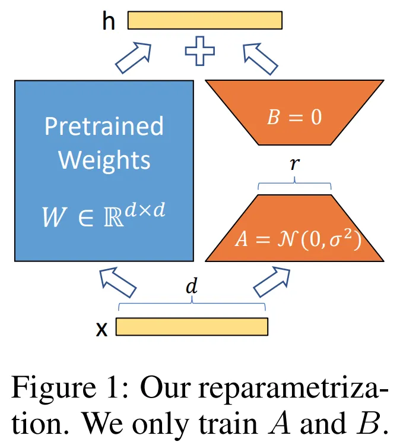

# LoRA

## Reference

- https://axk51013.medium.com/llm%E5%B0%88%E6%AC%84-all-about-lora-5bc7e447c234

## 什么是 Lora，Lora 低秩自适应  
要搞懂 Lora 的基础概念，其实关键在于吃透原论文[1]中的一张图和一个公式. 我们深入浅出，先来讲“难”的部分——Lora 的公式：  

$$
h = W_0 x + \Delta W x = W_0 x + B A x
$$  

#### Lora 的公式  
这个公式表达了一个简单的概念：假设我们原本有一个隐藏层（hidden layer），其公式为 $h = Wx$，其中 $W$ 是该隐藏层的权重矩阵，$h$ 是输出.   

当我们训练这个隐藏层时，通常直接“改变 $W$ 本身”，即用梯度下降法更新 $W$ 的值. 但 $W$ 可能是一个 100×500 这样的大型矩阵，更新时对 GPU 内存的要求极高（后续会详细讨论这一点）.   

因此，Lora 将 $h = Wx$ 转化为上面等式的第一个等号：$h = W_0 x + \Delta W x$（直接看图会更清楚），将原本的 $W$ 拆分为 $W_0$ 和 $\Delta W$ 两个矩阵. 其中，$W_0$ 代表训练初期的初始权重，$\Delta W$ 代表我们要“更新”的矩阵，而我们希望 $\Delta W$ 的参数量远小于原始的 $W$，这样才能解决 GPU 内存的问题.   

很多学过线性代数的同学可能会马上产生困惑：$h$ 的维度是固定的，$x$ 的维度也是固定的，理论上 $W_0$ 和 $\Delta W$ 的参数量应该受到限制才对？如果参数量减少，维度如何匹配？  

这确实是一个容易陷入的思考陷阱，关键在于：从未有人说过 $\Delta W$ 必须是“一个矩阵”. 如果我们把 $\Delta W$ 拆成两个矩阵相乘——$A$ 矩阵和 $B$ 矩阵，并让 $A$ 和 $B$ 矩阵进行“降维再重建”的过程，就能大幅减少 $\Delta W$ 的参数量.   

举例来说，假设原本的 $W$ 是 1000×1000 的参数矩阵，我们让 $\Delta W$ 由一个 2×1000 的 $A$ 矩阵和一个 1000×2 的 $B$ 矩阵相乘组成. $B$ 和 $A$ 相乘后可以重建出 1000×1000 的矩阵，而参数量仅为原来的 0.4%.   

这种“降维再重建”的操作，被称为**低秩投影（Low rank projection）**.   

此时我们就能看懂原论文中的这张图了：论文形象地将降维后重建的过程画成了深度学习从业者熟悉的自编码器（Auto-encoder）形式.   

#### 需牢记的三个核心结论  
即便前面的叙述内容全部忘记，也需要记住以下三个阶段性结论：  
1. Lora 的目的是降低训练的参数量.   
2. 通过将原本的 $W$ 拆解为 $W_0$ 和 $\Delta W$ 两个矩阵（$W_0$ 是原始权重，$\Delta W$ 是对权重的更新），我们希望 $\Delta W$ 的总参数量远小于原始 $W$.   
3. 为了节省参数量，对 $\Delta W$ 进行低秩投影，拆分为“降维矩阵 $A$”和“重建矩阵 $B$”. 通过让中间的秩（rank）极低（$<< 1/2 ~h~dim$），可以节省参数量.   

### 二、Lora 有什么好处？  
大部分人对 Lora 的理解止步于上述内容，却忽略了两个根本性问题：  
1. 降低参数量具体有什么好处？  
2. 降低参数量的方法很多，为什么 Lora 如此突出？  

#### 1. 降低参数量的具体优势  
笔者曾经也直觉地认为，降低参数量意味着空间需求减少，这有什么好讨论的？但认真思考后会发现，事情并非如此简单.   

首先，Lora **无法减少**的 GPU 内存需求包括：  
- 模型仍需完整放入 GPU 内存，无法节省.   
- 前向传播（Forward Pass）的各种状态，因为需要计算 $\Delta W$ 的梯度，所以无法节省（不存储就无法反向传播）.   
- 批量数据（Batch Data）无法节省，仍需放入 GPU 内存（至少不会因 Lora 而节省）.   
- 各种运算的暂存空间，无法节省.   

听起来很多东西都无法节省，尤其是整个模型都需要放入内存——这往往是 LLM 领域最令人头疼的问题，动辄几十 GB 占用 GPU 内存.   

正如 Llama Factory[2] 的 GPU 内存需求分析表所示，Lora 所需的 GPU 内存一定超过模型本身的大小. 例如，7B 的 LLM 需要 14GB 空间存放模型，Lora 永远无法用少于 14GB 的空间完成训练.   

| 方法         | Gamma-2B                |  |  | Llama2-7B              |  |  | Llama2-13B             |  |  |
|--------------|-------------------------|-------------------------|-------------------------|-------------------------|-------------------------|-------------------------|-------------------------|-------------------------|-------------------------|
|              | Memory (GB)             | Throughput (Tokens/s)   | PPL                     | Memory (GB)             | Throughput (Tokens/s)   | PPL                     | Memory (GB)             | Throughput (Tokens/s)   | PPL                     |
| Baseline     | 1                       | 1                       | 11.83                   | 1                       | 1                       | 7.53                    | 1                       | 1                       | 6.66                    |
| Full-tuning  | 17.06                   | 3090.42                 | 10.34                   | 38.72                   | 1334.72                 | 5.56                    | -                       | -                       | -                       |
| Freeze-tuning| 8.10                    | 5608.49                 | 11.33                   | 15.69                   | 2904.98                 | 6.59                    | 29.02                   | 1841.46                 | 6.56                    |
| GaLore       | 10.16                   | 2483.05                 | 10.38                   | 15.43                   | 1583.77                 | 5.88                    | 28.91                   | 956.39                  | 5.72                    |
| LoRA         | 7.91                    | 3521.05                 | 10.19                   | 16.32                   | 1954.07                 | 5.81                    | 30.09                   | 1468.19                 | 5.75                    |
| QLoRA        | 5.21                    | 3158.59                 | 10.46                   | 7.52                    | 1579.16                 | 5.91                    | 12.61                   | 973.53                  | 5.81                    |

但对比 Llama2-7B 的全参数微调（Full-tuning）和 Lora 的 GPU 内存需求：全参数微调需要 38.72GB，而 Lora 仅需 16.32GB. 减去模型本身的 14GB，全参数微调在模型之外需要 24GB 以上空间，而 Lora 仅需约 2GB（相同 token batch 下）.   

**Lora 节省的关键：优化器状态（Optimizer state）**  
Optimizer 指的是 Adam、AdamW、SGD、Momentum 等优化器. 由于过去学习深度学习时常用 SGD 推导公式，大多数人容易忽略不同优化器对 GPU 内存的需求.   

以 Adam 为例，需要存储梯度的一阶梯度和二阶梯度作为优化器状态（Optimizer state），这些状态用于确定更好的更新方向. 但如果每个优化器状态参数都存储，内存占用将达到模型参数的 2 倍.   

而优化器状态仅需记录“需要更新的参数”. 对 Lora 而言，只需更新 $\Delta W$ 的优化器状态，因此大幅节省了 GPU 内存.   

#### 2. Lora 与其他参数高效微调方法的优势  
笔者在此给出一个相对“不负责”的答案：Lora 的优势体现在四个方向——效果好、所需空间小、使用容易（开源方案多）、宣传好.   

之所以说“不负责”，是因为在笔者的经验和文献阅读中，没有文献证明 Lora 100% 优于其他方法. 例如，IA3 就展现出用更小空间获得更好结果的能力.   

从 IA3 提供的对比图中可以看到，Lora 在同参数规模下胜过除 IA3 外的所有 PEFT（参数高效微调）方法，且最终效果很强. 此外，可训练参数量从 0.1% 降至 0.01% 有时帮助不大，因为消融实验表明，token batch 并非越大越好，无需无限制节省可训练参数.   

因此可以这样理解：Lora 效果好、节省大量参数，但真正使其普及的可能是使用便利性和宣传力度（几乎所有 PEFT 框架都包含优化后的 Lora，且几乎所有微调项目默认使用 Lora，包括各类 SFT 模型和领域模型的开源代码）.   

最经典的案例是 Azure CTO Mark Russinovich 在介绍 Azure 基础设施时提到，若需自定义 LLM，Azure 会使用 Lora 微调提供的大模型（如 GPT-3 系列的微调）.   

### 三、Lora 能多接近全参数微调，我们真的能用 Lora 解决所有问题吗？  
前两部分讨论了 Lora 的核心思想（减少更新参数量）和具体优势（节省优化器状态内存），并比较了 Lora 与其他 PEFT 方法的优劣，推测其普及原因可能超出技术本身. 现在讨论最受关注的问题：Lora 到底能多接近全参数微调（Full finetuning），即“节省参数后，我们付出了多大代价”.   

理想情况下，若 Lora 在所有任务上的表现与全参数微调完全一致，它将成为“免费的午餐”，每次微调直接使用 Lora 即可. 但实际经验表明，Lora 与全参数微调仍有明显差距，理解这种差距至关重要.   

理解差距可从理论和经验层面展开. 尽管已有许多理论分析论文（如《The expressive power of low-rank adaptation》[5]）从理论上探讨了不同架构使用 Lora 时所需的最小秩以保证表示能力），但理论分析在实践中仍落后于经验知识（此处“落后”指实践指导不足，而非理论不重要）.   

#### 三篇关键论文推荐  
1. **《When Scaling Meets LLM Finetuning: The Effect of Data, Model and Finetuning Method》[6]**  
   - DeepMind 出品，通过大量实验对比了 Lora、Prompt tuning 和全参数微调在不同数据规模、模型规模和预训练规模下的优劣.   
   - 核心结论：LLM 微调中，几乎任何方法下，放大模型带来的效果提升都优于增加训练数据.   

2. **《LoRA Land: 310 Fine-tuned LLMs that Rival GPT-4, A Technical Report》[7]**  
   - 分析主流模型和训练数据，给出不同模型经 Lora 微调后的最佳超参数组合.   
   - 关键发现：在 Llama 3 发布前，7B 模型中最适合微调的是 Mistral 7B 和 Zephyr 7B（Llama 3 8B 发布后地位易主）.   

3. **《Lora learns less and forgets less》[8]**  
   - 哥伦比亚大学和 Databricks Mosaic AI 团队提出，专注解释 Lora 的学习效率问题.   
   - 核心结论：  
     - **学习效率较低**：相同训练 token 下，全参数微调学到的新知识更多，在新领域测试精度更高. 实验中，<2B tokens 时 Lora 在新领域几乎无学习.   
     - **遗忘更少**：相同训练 token 下，全参数微调对原有知识的遗忘更多，Lora 能更好保持旧领域测试精度. 实验中，Lora 的遗忘量几乎固定，2B~20B tokens 内未显著恶化.   
     - **学习天花板低但遗忘效率低**：Lora 学习新知识的上限较低，但在相同学习情况下遗忘更少.   

#### 实践决策建议  
使用 Lora 的核心在于分析当前是受限于 GPU 内存还是数据：  
- 若 10k 数据训练的 Lora 效果距目标差 5%，可考虑：  
  1. 切换更大模型进行 Lora（牺牲推理效率）；  
  2. 使用更多数据训练（投入资源收集数据）；  
  3. 切换至全参数微调（或调大 rank 逼近全参数，牺牲 GPU 内存）.   

### 四、2023~2024 年 Lora 的改进方案  
过去一年，研究者提出了多种 Lora 改进方案，以下分为两类介绍：修正 Lora 固有缺陷，以及通过更多 Lora 解决问题.   

#### 1. 修正 Lora 固有缺陷  
##### （1）秩（rank）过小导致表示能力不足  
- **ReLora[9]**：通过“定期将 Lora 的 $W$ 合并到原始 $W$ 中，并重新创建新的 $\Delta W$ 学习新阶段任务”来提升 Lora 的秩. 

$$
\Delta W = \sum_{t=0}^{T_1} \delta W_t + \sum_{t=T_1}^{T_2} \delta W_t + \cdots + \sum_{t=T_{N-1}}^{T_N} \delta W_t = sW_A^1 W_B^1 + sW_A^2 W_B^2 + \cdots + sW_A^N W_B^N
$$

效果：微调能力未必优于 Lora，但语言模型的学习效率大幅提升，接近全参数微调.   

- **MoRA[10]**：重新设计 Lora，最大化参数矩阵的秩.   
  原 Lora 的降维和重建在 $A$、$B$ 矩阵中完成，MoRA 重新设计流程，使降维和重建无需权重，将所有权重用于中间的 $M$ 矩阵，学习所需的线性函数.   
  效果：调高铁后，微调效果未必提升，但语言模型效率显著提高.   

##### （2）Lora 中 $A$、$B$ 矩阵的非对称性（Asymmetry）  
- **AsyLora[11]**：发现 $A$ 矩阵几乎学不到任务相关知识，更多保留初始化信息；$B$ 矩阵则相反，主要学习任务信息，遗忘初始化信息.   
  改进：$A$ 设为随机对角矩阵，仅训练 $B$，可保留更好的泛化性.   

- **Lora+**：调整 $A$ 和 $B$ 的学习率，让 $B$ 学得比 $A$ 快得多，提升效果.   

### 结语  
Lora 是 LLM 时代最基础、最常用的技术之一，但业界对其理解常流于表面. 本文从公式原理、内存优化、与全参数微调的权衡到最新改进，全面解析了 Lora.   

建议读者至少掌握 Lora 的基础概念（公式与图示），深入理解其节省 GPU 内存的本质——这将帮助你自然联想到更多优化方案. 同时，建议建立对 Lora 与全参数微调的全面认知，以便清晰决策：何时用 Lora，何时必须切换全参数，以及 Lora 效果不佳时的备选方案.   

