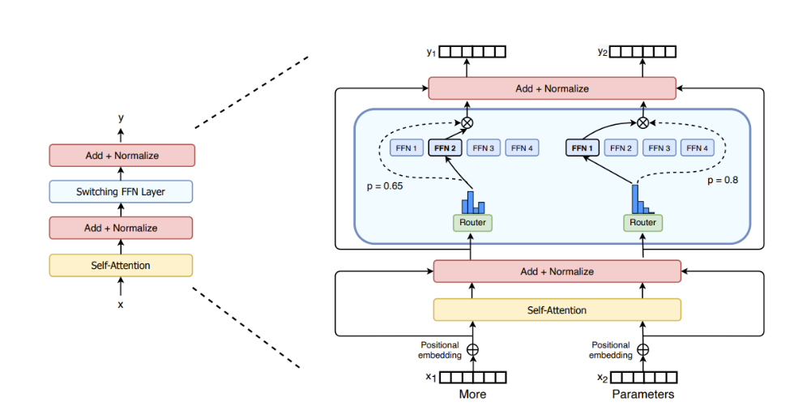

# Mixture of Experts (MOEs)

## Reference

- https://huggingface.co/blog/moe
- https://spaces.ac.cn/archives/10699
- https://spaces.ac.cn/archives/10735
- https://apxml.com/zh/courses/how-to-build-a-large-language-model/chapter-14-advanced-architectural-modifications/load-balancing-moe-layers

## MoE相关概念

- MoEs 的核心工作原理是什么？
    - MoEs 通过稀疏 MoE 层替代 Transformer 的稠密 FFN 层，该层包含多个 “专家”（如 FFN）和一个路由网络. 路由网络（如 Noisy Top-k Gating）学习决定每个 token 流向哪些专家（如 top-1 或 top-2），仅激活部分专家进行计算，从而在减少计算量的同时保持模型规模优势，实现更快的预训练和推理. 

- 稀疏 MoE 层: 这些层代替了传统 Transformer 模型中的前馈网络 (FFN) 层. MoE 层包含若干“专家”(例如 4 个)，每个专家本身是一个独立的神经网络. 在实际应用中，这些专家通常是前馈网络 (FFN)，但它们也可以是更复杂的网络结构，甚至可以是 MoE 层本身，从而形成层级式的 MoE 结构. 

- 门控网络或路由: 这个部分用于决定哪些 token 被发送到哪个专家. 例如，在下图中，“More”这个 token 可能被发送到第二个专家，而“Parameters”这个 token 被发送到第一个专家. 有时，一个 token 甚至可以被发送到多个专家.  token 的路由方式是 MoE 使用中的一个关键点，因为路由器由学习的参数组成，并且与网络的其他部分一同进行预训练. 

- 与稠密模型相比，MoEs 的主要优势和劣势是什么？
    - 优势包括：
        - 预训练更快（相同计算预算下比稠密模型更快达到同等质量）；
            - 稠密模型的预训练中，所有参数会被所有输入数据激活. 例如，一个 100B 参数的稠密模型，每处理一个令牌都需要经过全部 100B 参数的计算，计算成本随参数规模线性增长. 
            - 而 MoEs 通过 “条件计算” 实现稀疏性：仅激活部分专家
        - 推理更快（相同参数下计算量更低，如 Mixtral 8x7B 推理计算量相当于 12B 稠密模型）. 
            - 稠密模型的推理速度受限于其总参数对应的计算量：例如，一个 50B 参数的稠密模型，每个令牌必须经过全部 50B 参数的矩阵运算，计算量（FLOPs）与参数规模直接挂钩. 
            - 而 MoEs 的推理速度优势来自：仅激活少数专家，实际计算量低；
    - 劣势包括：
        - 需高 VRAM（所有专家需加载到内存，如 Mixtral 8x7B 需 47B 参数内存）；

## MOE 负载均衡

虽然路由机制（例如 top-k 门控）会将输入令牌导向专家混合 (MoE) 层中的特定专家，但它们本身不保证计算负载在所有专家之间均匀分配. 如果 Expert 的分配不均衡，就可能出现如下局面：某些 Expert（Dead Expert）几乎一直闲置，浪费算力；某些 Expert 要处理的 Token 太多，根本忙不过来，只能 Token Drop（即放弃处理部分Token）. 从理论上来说，出现 Dead Expert 意味着 MoE 没有达到预期的参数量，即花了大参数量的显存，结果只训出来小参数量的效果. 

### 辅助负载均衡损失

#### 一、目标
辅助损失的目标是激励路由器为每个专家分配大致相同数量的令牌。Switch Transformer论文和后续工作中介绍的一种被广泛采用的公式，旨在最小化每个专家处理的令牌数量的变异。

#### 二、定义
令 $N$ 为专家数量， $B$ 为当前批次（或微批次）中的令牌数量。对于每个专家 $i \in \{1, \dots, N\}$ ，定义两个量：
- ** $f_i$ **：路由到专家 $i$ 的批次内令牌分数。通过对批次中所有令牌的专家 $i$ 路由决策（硬路由如top-k为0或1）求和，再除以 $B$ 计算。公式为：
$$
f_i = \frac{1}{B} \sum_{x \in \text{Batch}} \mathbb{I}(\text{为令牌 } x \text{ 选择的专家 } i)
$$
- ** $P_i$ **：门控网络分配给专家 $i$ 的总路由概率质量的分数，对批次中的令牌进行平均。若 $g(x)_i$ 是给定令牌 $x$ 时门控网络输出的专家 $i$ 概率，则：
$$
P_i = \frac{1}{B} \sum_{x \in \text{Batch}} g(x)_i
$$

#### 三、计算
辅助负载均衡损失 $L_{\text{balance}}$ 通常计算为这两个向量的点积，并乘以专家数量 $N$ 和一个可调超参数 $\alpha$ ：
$$
L_{\text{balance}} = \alpha \cdot N \cdot \sum_{i=1}^N f_i \cdot P_i
$$

#### 四、总损失
用于反向传播的总损失是主要任务损失 $L_{\text{task}}$ 和均衡损失之和：
$$
L_{\text{total}} = L_{\text{task}} + L_{\text{balance}}
$$

#### 五、直观理解
最小化 $L_{\text{balance}}$ 促使所有专家的 $f_i$ 和 $P_i$ 都接近 $1/N$ 。如果某个专家接收了大量令牌份额（ $f_i$ 较高），损失就会增加。类似地，如果门控网络分配给某个专家高概率（ $P_i$ 较高），损失也会增加。当实际分配（ $f_i$ ）和路由器的置信度（ $P_i$ ）均匀分布时，损失最小化。超参数 $\alpha$ 控制这种均衡激励相对于主要任务目标的强度；典型值通常很小（例如0.01）。

## FlashAttention

