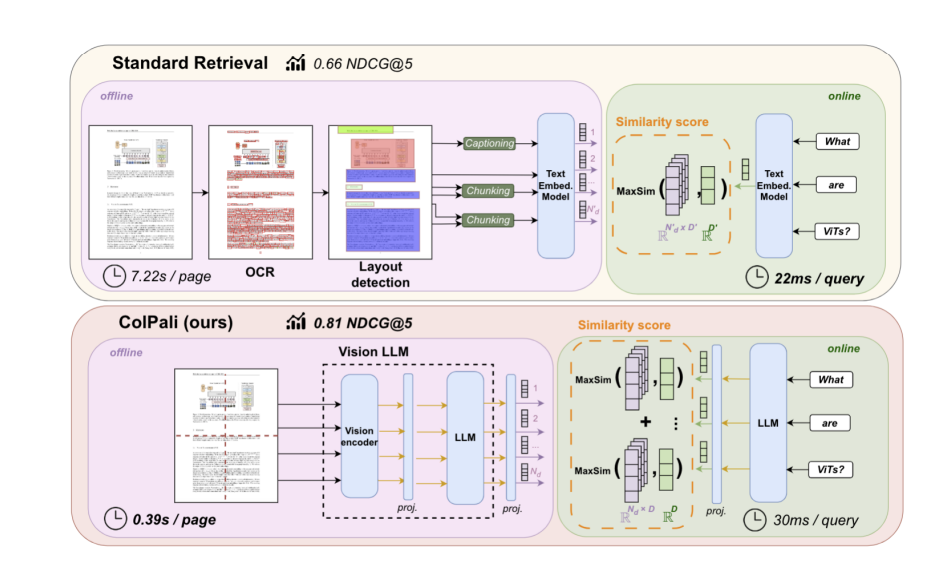
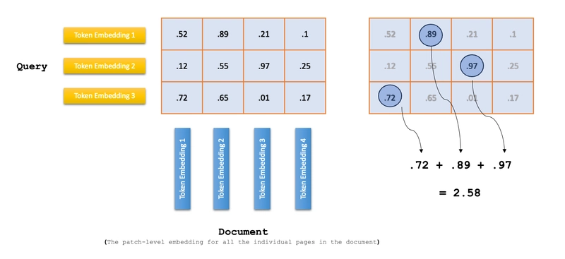
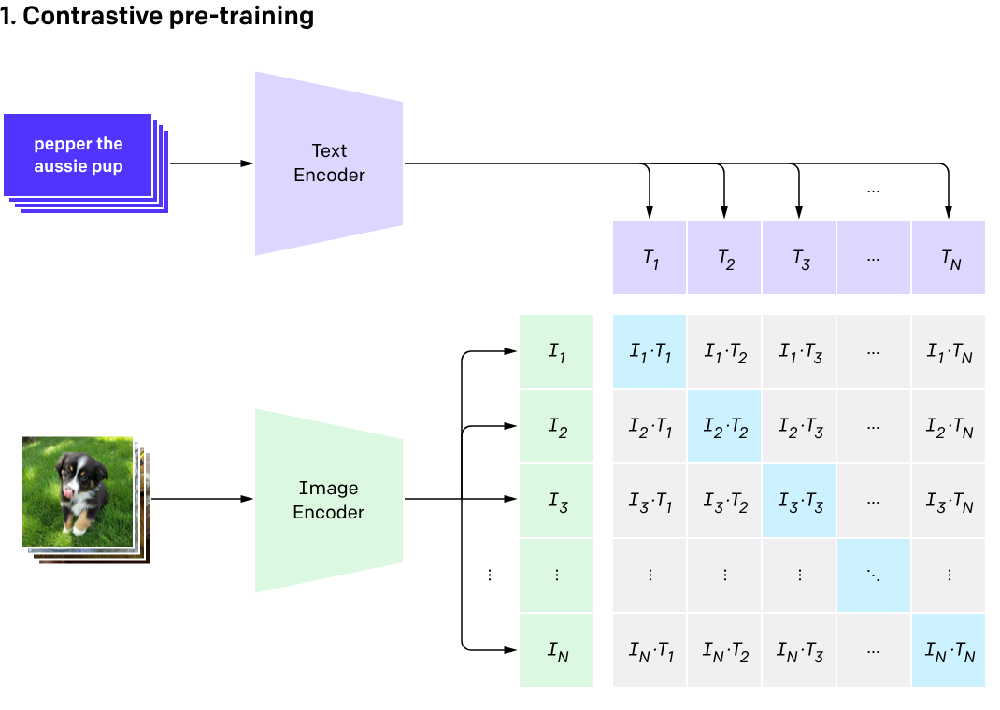
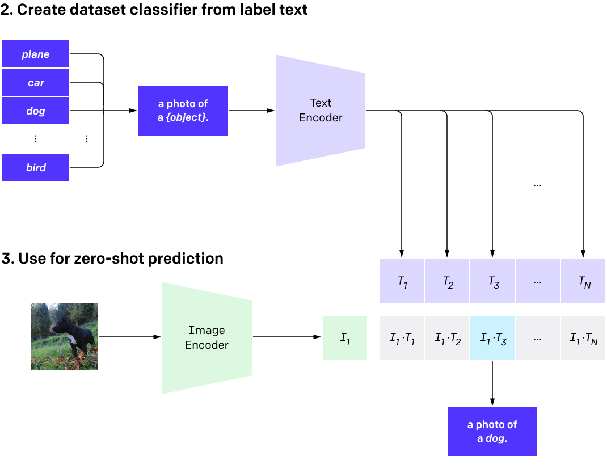
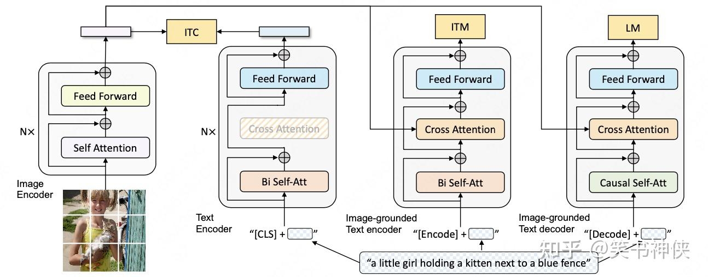
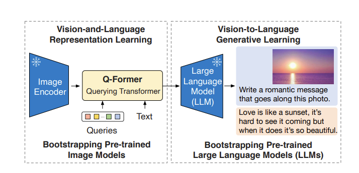
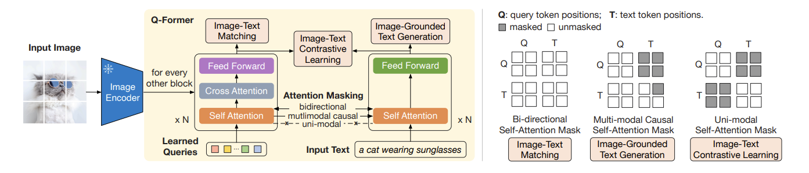
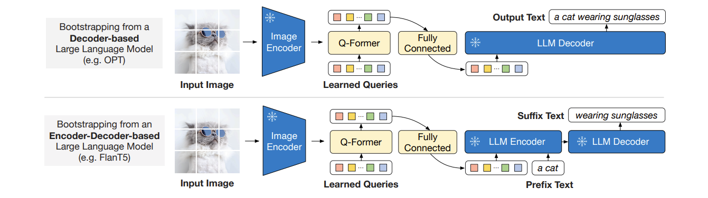
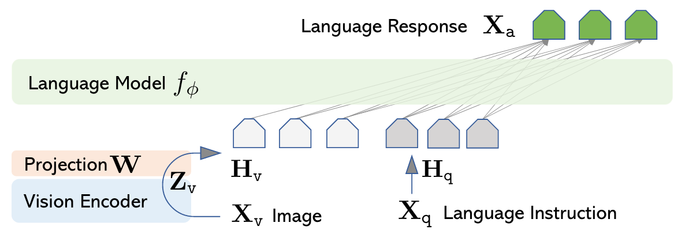
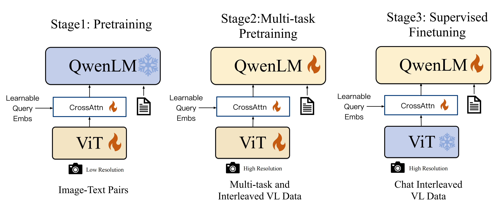

# 多模态

## Reference

- https://arxiv.org/pdf/2402.12451
- https://adaning.github.io/posts/64567.html
- https://dev.to/aws/beyond-text-building-intelligent-document-agents-with-vision-language-models-and-colpali-and-oc
- https://zhuanlan.zhihu.com/p/493489688
- https://zhuanlan.zhihu.com/p/640887802
- https://zhuanlan.zhihu.com/p/445122996
- https://zhuanlan.zhihu.com/p/25296368487
- https://zhuanlan.zhihu.com/p/25267823390

## ViT

## 多模态RAG

### Colpali

对于单独一页的文档，ColPali 用 SigLIP 视觉编码器将页面分割成多个图像 patch（比如 1024 个），每个 patch 转化为视觉嵌入后，再输入 Gemma 语言模型进行上下文编码，最后通过一个投影层映射到 128 维的低维空间 —— 这样一张图片就变成了一组向量（每个向量对应一个 patch 的语义）. 

对于文本查询，同样会被编码成一组向量，最后通过一个投影层映射到 128 维的低维空间（每个向量对应一个查询词的语义）.

对于单独一页的文档，使用“晚交互”机制计算与查询的相关的分数，计算这一页对应的patch向量

### ColPali的模型结构、训练过程及损失函数总结

#### 一、模型结构  
ColPali基于**Vision Language Model（VLM）** 架构，以PaliGemma-3B为基础扩展，核心设计是通过多向量嵌入和晚交互（late interaction）机制实现高效文档检索，具体结构如下：  

1. **基础架构**  
   - 沿用PaliGemma-3B的核心组件：由SigLIP视觉编码器（处理图像patch）和Gemma-2B语言解码器（处理文本）组成，通过多模态线性投影层连接，实现图像与文本的嵌入空间对齐。  
   - 图像输入被分割为1024个视觉patch，转换为嵌入后与文本token嵌入拼接，输入语言模型进行上下文编码。  

2. **多向量嵌入**  
   - 在语言模型输出层添加**投影层**，将每个输出token（包括图像patch token和文本token）的嵌入映射到低维空间（维度D=128），形成文档/查询的多向量表示（文档向量 $E_d \in \mathbb{R}^{N_d \times D}$ ，查询向量 $E_q \in \mathbb{R}^{N_q \times D}$ ，其中 $N_d$ 和 $N_q$ 为向量数量）。  

3. **晚交互匹配机制**  
   - 通过晚交互算子（LI）计算查询与文档的相似度：对每个查询向量，取其与所有文档向量的最大点积，再求和得到最终分数。公式为：  
     $$
     LI(q, d) = \sum_{i \in [1, N_q]} \max_{j \in [1, N_d]} \left< E_q^{(i)} \mid E_d^{(j)} \right>
     $$  
   - 该机制兼顾了细粒度语义交互（类似交叉编码器）和离线预计算效率（类似双编码器）。  

#### 二、训练过程  
ColPali的训练以端到端优化检索性能为目标，具体流程和参数如下：  

1. **训练数据**  
   - 包含118,695个查询-文档页对，由两部分组成：  
     - 63%来自公开学术数据集（如DocVQA、InfoVQA等，聚焦文档理解任务）；  
     - 37%为合成数据（从网页爬取的PDF文档页，由Claude-3 Sonnet生成相关查询）。  
   - 数据全为英文，用于研究零样本泛化至其他语言（如法语）的能力。  

2. **训练设置**  
   - **优化目标**：通过对比学习使相关文档与查询的相似度高于无关文档。  
   - **参数配置**：  
     - 使用LoRA（低秩适应）微调，仅更新语言模型的transformer层和投影层，LoRA参数 $\alpha=32$ 、 $r=32$ ；  
     - 优化器为paged adamw 8bit，学习率 $5e-5$ ，线性衰减，2.5%预热步骤；  
     - 批大小32（8 GPU数据并行），训练1个epoch；  
     - 采用bfloat16精度训练，减少内存占用。  

3. **查询增强**  
   - 在查询token后附加5个`<unused0>`特殊token，作为可学习的“软扩展”机制，增强查询与文档的匹配灵活性。  

#### 三、损失函数  
ColPali采用**批内对比损失**，基于晚交互相似度分数优化，公式如下：  

1. **核心定义**  
   - 对批内每个查询-文档对 $(q_k, d_k)$ ，计算正样本分数 $s_k^+ = LI(q_k, d_k)$ （查询与对应文档的相似度）和最大负样本分数 $s_k^- = \max_{l \neq k} LI(q_k, d_l)$ （查询与同批其他文档的最大相似度）。  

2. **损失公式**  
   - 总损失为交叉熵的softmax形式，确保正样本分数显著高于负样本：  
     $$
     \mathcal{L} = \frac{1}{b} \sum_{k=1}^b \log\left(1 + \exp(s_k^- - s_k^+)\right)
     $$  
   - 其中 $b$ 为批大小，该损失通过反向传播优化投影层和语言模型的LoRA参数，提升检索相关性。  

## CLIP

这里对提取的文本特征和图像特征进行对比学习。对于一个包含 $N$ 个文本-图像对的训练batch，将 $N$ 个文本特征和 $N$ 个图像特征两两组合，CLIP模型会预测出 $N^2$ 个可能的文本-图像对的相似度，这里的相似度直接计算文本特征和图像特征的余弦相似性（cosine similarity），即上图所示的矩阵。这里共有 $N$ 个正样本，即真正属于一对的文本和图像（矩阵中的对角线元素），而剩余的 $N^2-N$ 个文本-图像对为负样本，那么CLIP的训练目标就是最大 $N$ 个正样本的相似度，同时最小化 $N^2-N$ 个负样本的相似度.

CLIP 模型通过对比学习损失函数进行训练，核心思想是最大化正样本对（匹配的图像-文本对）的相似度，同时最小化负样本对（不匹配的图像-文本对）的相似度。

对于一个包含 $N$ 个图像-文本对的 batch，CLIP 的损失函数定义为：

$$
\mathcal{L} = -\frac{1}{N} \sum_{i=1}^{N} \log \frac{\exp\left(\frac{\mathbf{t}_i^\top \mathbf{v}_i}{\tau}\right)}{\sum_{j=1}^{N} \exp\left(\frac{\mathbf{t}_i^\top \mathbf{v}_j}{\tau}\right)}
$$

其中：
- $\mathbf{t}_i$ 是第 $i$ 个文本的特征向量
- $\mathbf{v}_i$ 是第 $i$ 个图像的特征向量
- $\tau$ 是温度参数（temperature parameter），控制分布的平滑程度

分子越大，L越小

## BLIP

该模型通过三个损失函数联合进行预训练：

(i) **图像-文本对比损失** $\text{ITC}^+$（Image-Text Contrastive Loss）：针对图像编码器和文本编码器，通过正负图文对的对比学习，来对齐图像和文本的潜在特征空间。

(ii) **图像-文本匹配损失** $\text{ITM}^+$（Image-Text Matching Loss）：针对以图像为基础的文本编码器，通过对图文匹配性进行二分类，建模图文多模态信息的相关性。

(iii) **语言建模损失** $\text{LM}$（Language Modeling Loss）：针对以图像为基础的文本解码器，通过交叉熵损失进行优化，训练模型以自回归的方式生成目标caption。

## BLIP-2

BLIP-2的算法框架，训练了一个轻量级的Q-Former来对齐文本和语言两个模态的差距。第一阶段从冻结的图像编码中学习到图像的语言表征，第二阶段通过冻结的大语言模型从图像特征到语言生成。Q-Former+Q-Former后的MLP是唯一的可训练模块，图像编码器和语言模型始终保持冻结状态.

## LLAVA

模型架构
LLaVA 的架构由三个核心部分构成：

- 视觉编码器：采用 CLIP-ViT-L/14 作为视觉编码器，其作用是将输入的图像转换为视觉特征。该编码器在 14×14 的网格上提取特征，每个网格对应一个 768 维的向量。
- 投影层：这一层负责将视觉特征映射到语言模型的嵌入空间，使图像特征能够和文本信息在同一语义空间中进行处理。
- 语言模型：以 LLaMA-2-7B 为基础，通过投影层接收视觉输入，从而实现多模态的理解和生成。

## QwenVL

- Pre-training: 在低分辨率(224*224)的图像上用ViT和Adapter, QwenLM是frozen的. 做Image-Guided Text Generation, 做Vision-Language初步对齐, 用了50亿图文对, 清洗后14亿, 其中有77.3%的英语数据, 22.7的中文数据.
- Multi-task Pre-training: 经历过第一阶段的预训练后, 解冻所有组件. 输入图像也换成高分辨率(448*448)的. 把Caption, VQA, Grounding, OCR, Pure-text Autoregression等任务串起来放到一起训. Caption和OCR的数据占比比较大, 其次是Grounding. 不难看出这块主要是为了对齐, 而且OCR一定程度加强了MLLM对图中文字的利用能力.
- Supervised Fine-tuning: 冻住ViT, 解冻QwenLM和Adapter. 提高Qwen-VL的Instruction Following和Dialog Performance.

## Qwen2.5VL
