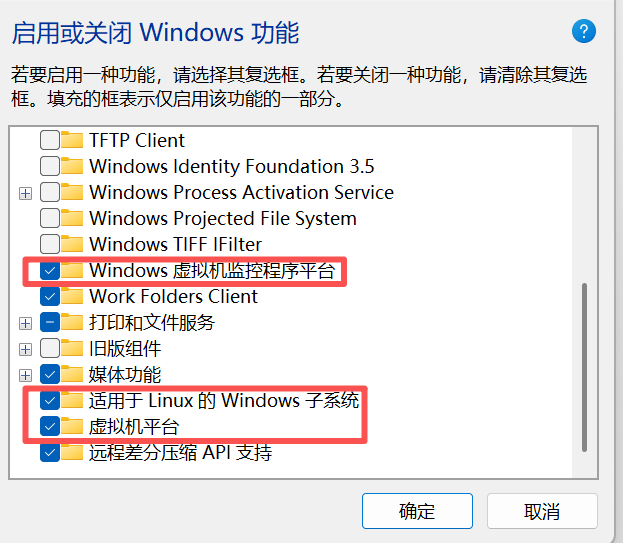
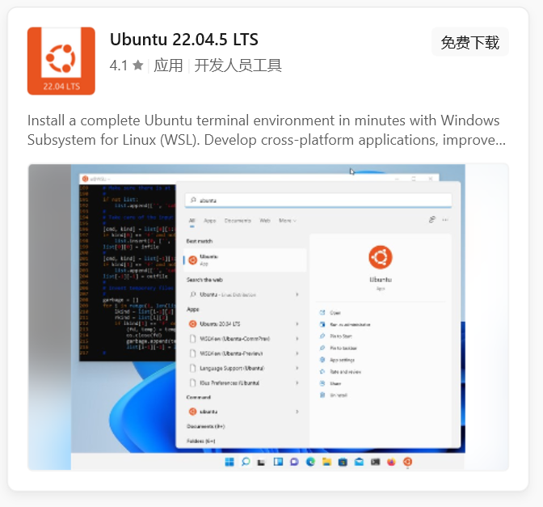

# Claude Code使用记录

## windows使用

1. 使用wsl安装`unbuntu`
    1. 打开`启用或关闭Windows功能`（`Turn Windows features on or off`）

    2. 下面的item打勾
    


2. 打开`micosoft store`，安装`Ubuntu 22.04`，安装好后选择`打开`



3. 配置用户名和密码

```bash
zp1008611
123456
```

4. 安装vscode

```bash
explorer.exe .
# 1. 导入微软 GPG 密钥
wget -qO- https://packages.microsoft.com/keys/microsoft.asc | gpg --dearmor > packages.microsoft.gpg
sudo install -D -o root -g root -m 644 packages.microsoft.gpg /etc/apt/trusted.gpg.d/packages.microsoft.gpg

# 2. 添加 VSCode 软件源
echo "deb [arch=amd64,arm64,armhf signed-by=/etc/apt/trusted.gpg.d/packages.microsoft.gpg] https://packages.microsoft.com/repos/code stable main" | sudo tee /etc/apt/sources.list.d/vscode.list > /dev/null

# 3. 更新软件包索引并安装 VSCode
sudo apt update
sudo apt install -y code

# 4. 清理临时文件
rm -f packages.microsoft.gpg
```

5. 配置代理

在 `C:\User\1\6587\.wslconfig` 中添加以下内容(如果不存在可以手动创建)：

```
[wsl2]
networkingMode = mirrored
autoProxy = true
```

重启wsl

```powershell
wsl --shutdown
wsl
```


6. 安装claude

```bash
curl -fsSL https://claude.ai/install.sh | bash
echo 'export PATH="$HOME/.local/bin:$PATH"' >> ~/.bashrc && source ~/.bashrc
```


## linux使用

1. 在[vast.ai](https://cloud.vast.ai/create/)选择一张RTX2080 Ti

2. 模板选择Ubuntu 22.04 VM，磁盘大小选择 100G

3. 进入容器，安装claudecode

```bash
curl -fsSL https://claude.ai/install.sh | bash
echo 'export PATH="$HOME/.local/bin:$PATH"' >> ~/.bashrc && source ~/.bashrc
```

4. 登录

```bash
cd your_project
claude
# You'll be prompted to log in on first use
/login
# Follow the prompts to log in with your account
```

## linux使用技巧

### 使用其他模型

1. 注册openrouter账户


2. 配置环境变量

```bash
# Open your shell profile in nano
nano ~/.bashrc  # or ~/.bashrc for Bash users

# Add these lines to the file:
export OPENROUTER_API_KEY="<your-openrouter-api-key>"
export ANTHROPIC_BASE_URL="https://openrouter.ai/api"
export ANTHROPIC_AUTH_TOKEN="$OPENROUTER_API_KEY"
export ANTHROPIC_API_KEY="" # Important: Must be explicitly empty

# After saving, restart your terminal for changes to take effect
source ~/.bashrc
```

3. 下载`https://github.com/OpenRouterTeam/openrouter-examples/tree/main/claude-code`中的文件到文件夹`~/.claude/openrouter`

```bash
chmod +x ~/.claude/openrouter/statusline.sh
```

Add to `~/.claude/settings.json`:

```json
{
    "statusLine": {
    "type": "command",
    "command": "~/.claude/openrouter/statusline.sh"
    }
}
```

4. 启动

```bash
claude --model openai/gpt-5.3-codex
```

openrouter支持的模型可以在`https://openrouter.ai/models`中看到


### 实现每次提交后自从 commit 提交变更


1. 新建文件`your_project_path/.claude/hooks/auto-commit.sh`，内容为

```bash
#!/bin/bash
# Stop hook: 任务完成后自动检测未提交变更并触发 commit skill

INPUT=$(cat)
STOP_HOOK_ACTIVE=$(echo "$INPUT" | jq -r '.stop_hook_active // false')

# 防止无限循环：commit 后再次触发时直接放行
if [ "$STOP_HOOK_ACTIVE" = "true" ]; then
  exit 0
fi

# 检查是否有未提交的变更
cd "$CLAUDE_PROJECT_DIR" 2>/dev/null || exit 0

# 检查工作区是否有变更（已修改、新文件等）
if git diff --quiet 2>/dev/null && git diff --cached --quiet 2>/dev/null && [ -z "$(git ls-files --others --exclude-standard 2>/dev/null)" ]; then
  # 没有变更，正常结束
  exit 0
fi

# 有未提交变更，阻止 Claude 停止，让它继续执行 commit
cat <<'EOF'
{"decision": "block", "reason": "检测到未提交的变更，请调用 /commit 技能提交更新。"}
EOF
```

2. 新建`your_project_path/.claude/skills/commit/SKILL.md`

```markdown
---
name: commit
description: 提交当前未 commit 的修改。自动分析变更内容，生成规范的 commit message，支持按目录分组提交或一次性提交所有修改。
---

# Git Commit 技能

提交当前未 commit 的修改到 git 仓库。

## 工作流程

### 步骤一：查看未提交修改

git status --short

分析变更类型：
- M - 已修改
- ?? - 新文件（未跟踪）
- D - 已删除
- R - 重命名

### 步骤二：分析变更内容

根据修改文件路径判断变更类型：

| 路径模式 | 变更类型 |
|----------|----------|
| posts/YYYY-MM-DD/[slug]/ | 文章相关 |
| .claude/skills/ | 技能配置 |
| src/ | 脚本代码 |
| .r2-upload-map/ | 资源映射（通常不单独提交） |
| 其他 | 项目配置 |

### 步骤三：决定提交策略

单一主题修改：一次性提交所有文件

多主题修改：按目录/主题分组提交

分组优先级：
1. 文章目录（每篇文章一个 commit）
2. 技能目录（每个技能一个 commit）
3. 代码变更（合并为一个 commit）
4. 配置文件（合并为一个 commit）

### 步骤四：生成 Commit Message

格式规范：
- 用中文
- 简洁描述变更内容
- 不超过 50 字

常用模板：
- 文章：添加 [文章主题简述]、润色 [文章标题]、更新 [文章标题]
- 技能：添加 [技能名] 技能、更新 [技能名] 技能
- 代码：优化 [功能描述]、修复 [问题描述]
- 配置：更新项目配置

### 步骤五：执行提交

git add <file1> <file2> ...
git commit -m "commit message"

注意：
- 避免使用 git add . 或 git add -A
- 明确指定要提交的文件
- 排除临时文件（.bak-*、.html.bak-*）

### 步骤六：确认结果

git log --oneline -3

输出最近提交记录确认成功。

## 排除规则

以下文件默认不提交：
- *.bak-* - 备份文件
- .DS_Store - macOS 系统文件
- node_modules/ - 依赖目录
- .r2-upload-map/*.json - 通常随文章一起提交，除非单独要求
```

3. 新建 `your_project_path/.claude/settings.local.json`

```json
{
  "hooks": {
    "Stop": [{
      "hooks": [{
        "type": "command",
        "command": "\"$CLAUDE_PROJECT_DIR\"/.claude/hooks/auto-commit.sh"
      }]
    }]
  }
}
```

4. 启动`claude`之后，在终端使用`/commit`即可


