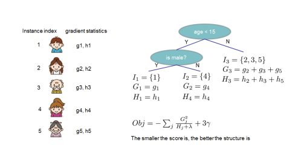
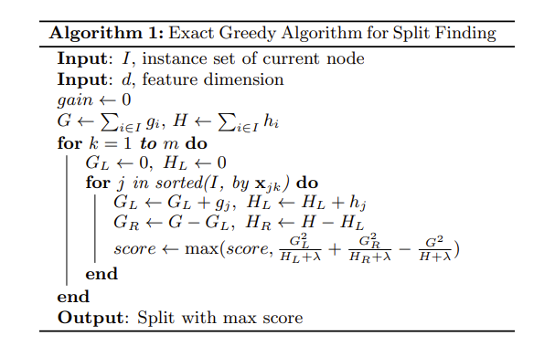
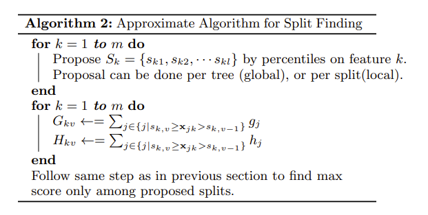
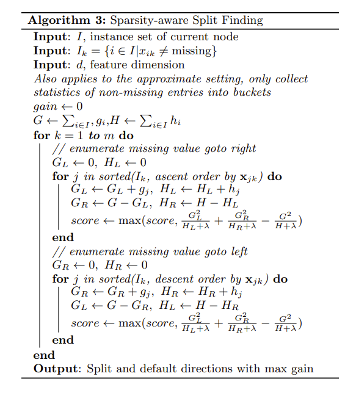

# XGBOOST

## Reference

- https://arxiv.org/pdf/1603.02754
- https://speakerd.s3.amazonaws.com/presentations/5c6dab45648344208185d2b1ab4fdc95/XGBoost-Newest.pdf#page=17
- https://cs229.stanford.edu/cs229-notes-decision_trees.pdf
- https://ufal.mff.cuni.cz/~straka/courses/npfl129/2223/slides.pdf/npfl129-2223-10.pdf
- https://web.cs.ucla.edu/~chohsieh/teaching/CS260_Winter2019/lecture9.pdf

## 正向阶段加性模型 

- 一般机器学习模型的目标函数为：$\sum_{i = 1}^{n}l(y^{(i)}, \hat{y}^{(i)})$
    - $n$ 是样本数量，$y_i$ 是第 $i$ 个样本的真实标签 ，$\hat{y}_i$ 是第 $i$ 个样本的预测值 ，$l$ 是衡量预测值与真实值差异的损失函数（如均方误差、交叉熵等 ）. 
- 如果模型是决策树，目标函数为$\sum_{i = 1}^{n}\ell(y^{(i)}, f(x^{(i)}))=\sum_{j = 1}^{k}\sum_{x^{(i)}\in R_j}\ell(y^{(i)}, w_j)$, 不能使用随机梯度下降（SGD）等方法来优化该目标函数 . 原因在于树的结构离散，不像传统的连续参数模型那样能方便地应用基于梯度的优化方法. 

### 解决方案：加法训练（提升算法，Additive Training / Boosting ）
- **基本思路**：从常数预测开始，每次添加一个新函数来逐步构建模型 . 
- **迭代过程**：
    - 初始时，$\hat{y}_0^{(i)} = 0$ ，表示初始预测值为 $0$ . 
    - 第一轮迭代：$\hat{y}_1^{(i)} = f_1(x^{(i)})=\hat{y}_0^{(i)} + f_1(x_i)$ ，即在初始预测基础上添加第一个函数 $f_1(x^{(i)})$ 得到第一轮预测值. 
    - 第二轮迭代：$\hat{y}_2^{(i)} = f_1(x^{(i)}) + f_2(x^{(i)})=\hat{y}_1^{(i)} + f_2(x^{(i)})$ ，在第一轮预测值基础上添加第二个函数 $f_2(x^{(i)})$ . 
    - 以此类推，第 $t$ 轮迭代：$\hat{y}_t^{(i)} = \sum_{k = 1}^{t}f_k(x^{(i)})=\hat{y}_{t-1}^{(i)} + f_t(x^{(i)})$ . 这里 $\hat{y}_t^{(i)}$ 是第 $t$ 轮训练时第 $i$ 个样本的预测值 ，它是由前 $t$ 个函数 $f_k(x^{(i)})$ 累加得到的，同时也等于第 $t - 1$ 轮预测值 $\hat{y}_{t-1}^{(i)}$ 加上本轮新添加的函数 $f_t(x^{(i)})$ . 

这种加法训练的方式是提升算法的核心思想，像梯度提升决策树（GBDT）等算法就是基于此思想，通过不断拟合残差（或负梯度 ）来逐步提升模型的预测能力 .  

在加法训练中，通过优化目标函数来决定添加哪个函数 $f$ . 

- **迭代预测**：第 $t$ 轮的预测值$\hat{y}_t^{(i)} = \hat{y}_{t-1}^{(i)} + f_t(x^{(i)})$ ，$f_t(x^{(i)})$ 是第 $t$ 轮需确定添加的函数. 
- **目标函数**：第 $t$ 轮目标函数$\text{Obj}_t=\sum_{i = 1}^{n}l(y^{(i)}, \hat{y}_t^{(i)})$ ，将$\hat{y}_t^{(i)} = \hat{y}_{t-1}^{(i)} + f_t(x_i)$ 代入后，可转化为$\text{Obj}_t=\sum_{i = 1}^{n}l(y^{(i)}, \hat{y}_{t-1}^{(i)} + f_t(x^{(i)}))+constant$ ，目标是找到使该式最小的 $f_t$ . 

- 以平方损失函数为例:
    - 当使用平方损失函数时，目标函数$\text{\text{Obj}}_t=\sum_{i = 1}^{n}(y^{(i)} - (\hat{y}_{t-1}^{(i)} + f_t(x^{(i)})))^2+const$ . 
    - 对其展开可得$\text{Obj}_t=\sum_{i = 1}^{n}[2(\hat{y}_{t-1}^{(i)} - y^{(i)})f_t(x^{(i)})+f_t(x^{(i)})^2]+const$ ，其中$2(\hat{y}_{t-1}^{(i)} - y^{(i)})$ 通常被称为上一轮的残差 ，这体现了在加法训练中，后续模型拟合上一轮预测残差以提升整体效果的原理. 

现在目标是优化第$t$ 轮的目标函数$\text{Obj}_t=\sum_{i = 1}^{n}l(y^{(i)}, \hat{y}_{t-1}^{(i)} + f_t(x^{(i)}))+constant$ ，通过找到合适的$f_t$ 来最小化该目标函数. 

#### 泰勒展开
- **原理回顾**：利用泰勒展开式$f(x+\Delta x)\simeq f(x)+f^\prime(x)\Delta x+\frac{1}{2}f^{\prime\prime}(x)\Delta x^2$ 对目标函数进行近似. 
- **变量定义**：定义$g^{(i)} = \partial_{\hat{y}_{t - 1}}l(y^{(i)}, \hat{y}_{t - 1})$ 为损失函数关于$\hat{y}_{t - 1}$ 的一阶偏导数，$h^{(i)} = \partial^2_{\hat{y}_{t - 1}}l(y^{(i)}, \hat{y}_{t - 1})$ 为损失函数关于$\hat{y}_{t - 1}$ 的二阶偏导数 . 
- **目标函数近似**：经过泰勒展开近似后，$\text{Obj}_t\simeq\sum_{i = 1}^{n}[l(y^{(i)}, \hat{y}_{t-1}^{(i)})+g^{(i)}f_t(x^{(i)})+\frac{1}{2}h^{(i)}f_t^2(x^{(i)})]+constant$  . 

- 以平方损失函数为例 :
当使用平方损失函数时，计算出$g^{(i)} = \partial_{\hat{y}_{t - 1}}(\hat{y}_{t - 1} - y^{(i)})^2 = 2(\hat{y}_{t - 1} - y^{(i)})$ ，$h^{(i)} = \partial^2_{\hat{y}_{t - 1}}(y^{(i)} - \hat{y}_{t - 1})^2 = 2$ . 通过泰勒展开近似，将原本复杂的目标函数转化为便于分析和优化的形式，有助于在树集成模型的加法训练中确定每一步添加的函数$f_t$. 

那么在第$t$轮迭代中，只需要优化$\tilde{\mathcal{L}}_t=\sum_{i = 1}^{n}[g^{(i)}f_t(x^{(i)})+\frac{1}{2}h^{(i)}f_t^2(x^{(i)})]$

## XGBOOST

### XBOOST的目标函数优化

XGBOOST在目标函数中添加了L1正则项$\gamma T$和L2正则项$\frac{1}{2}\lambda \sum\limits_{j=1}^T w_j^2$，其中$\gamma, \lambda$是正则系数，$T$是对应树模型的叶子节点个数，$w_j$是第$j$个叶子节点的权重值.

定义$I_j = \{i | q(\mathbf{x}_i) = j\}$ 为叶子节点$j$ 的实例集合. XGBOOST在第$t$轮迭代中的目标函数为：

$$
\begin{align*}
\tilde{\mathcal{L}}_t&=\sum_{i = 1}^{n}\left[g^{(i)}f_t(\mathbf{x}^{(i)})+\frac{1}{2}h^{(i)}f_t^2(\mathbf{x}^{(i)})\right]+\gamma T+\frac{1}{2}\lambda\sum_{j = 1}^{T}w_j^2\\
&=\sum_{j = 1}^{T}\left[\left(\sum_{i\in I_j}g^{(i)}\right)w_j + \frac{1}{2}\left(\sum_{i\in I_j}h^{(i)} + \lambda\right)w_j^2\right]+\gamma T
\end{align*}
$$

对于固定的树结构$q(\mathbf{x})$，对上式求导可得叶子节点$j$ 的最优权重$w_j^*$：

$$
w_j^* = -\frac{\sum_{i\in I_j}g^{(i)}}{\sum_{i\in I_j}h^{(i)} + \lambda}
$$

同时可得最优值：

$$
\tilde{\mathcal{L}}_t(q) = -\frac{1}{2}\sum_{j = 1}^{T}\frac{(\sum_{i\in I_j}g^{(i)})^2}{\sum_{i\in I_j}h^{(i)} + \lambda}+\gamma T
$$

这个公式可以用作评分函数，来衡量树结构$q$ 的质量. 这个分数类似于用于评估决策树的不纯度分数，不过它是从更广泛的目标函数推导出来的. 下图展示了如何计算这个分数. 

### XGBOOST如何防止过拟合

XGBOOST主要通过以下几种方式来防止过拟合：
1. **正则化项**：在学习目标中添加正则化项，公式为$\Omega(f)=\gamma T+\frac{1}{2}\lambda \|w\|^{2}$ . 其中$\gamma T$ 控制树的叶子节点数量，$\frac{1}{2}\lambda \|w\|^{2}$ 对叶子节点权重进行约束. 直观上，正则化后的目标倾向于选择简单且具有预测性的函数，使最终学习到的权重更加平滑，避免模型过于复杂而导致过拟合. 例如，当$\gamma$ 增大时，会限制树的复杂度，防止树过度生长. 
2. **收缩（Shrinkage）**：类似于随机优化中的学习率，在每次树提升步骤之后，将新添加的权重缩小一个因子（通常设置为0.1 ）. 这种方式减少了每棵单独树的影响，为后续树的添加留出改进空间，使得模型训练更加稳健，避免模型过早地拟合训练数据中的噪声. 
3. **列子采样（Column Subsampling）**：借鉴自随机森林的技术，在训练过程中随机选择部分特征进行树的构建. 这一方法在减少计算量的同时，能防止模型过度依赖某些特定特征，增强模型的泛化能力，降低过拟合风险. 实验表明，在Yahoo LTRC数据集上使用列子采样不仅减少了运行时间，还提高了模型性能. 

### XGBOOST如何决策最佳分裂

假设 $I_L$ 和 $I_R$ 分别是分裂后左节点和右节点的实例集合. 令 $I = I_L \cup I_R$，那么分裂后的损失减少量由下式给出：

$$
\mathcal{L}_{split} = \frac{1}{2}\left[\frac{(\sum_{i\in I_L}g_i)^2}{\sum_{i\in I_L}h_i + \lambda}+\frac{(\sum_{i\in I_R}g_i)^2}{\sum_{i\in I_R}h_i + \lambda}-\frac{(\sum_{i\in I}g_i)^2}{\sum_{i\in I}h_i + \lambda}\right]-\gamma
$$

在实际应用中，这个公式通常用于评估分裂候选方案.  

1. **基本精确贪心算法**：树学习的关键是找到最佳分裂点. 精确贪心算法会枚举所有特征上的所有可能分裂点，大多数单机树提升实现都支持该算法. 由于要枚举连续特征的所有可能分裂点，计算量较大，因此算法需先对数据按特征值排序，再按序访问数据以累加梯度统计信息，从而计算结构得分. 

2. **近似算法**：当数据无法全部放入内存或在分布式设置下，精确贪心算法效率较低，此时需要近似算法. 该算法先根据特征分布的百分位数提出候选分裂点，将连续特征映射到由这些候选点划分的桶中，聚合统计梯度信息，然后基于聚合统计在候选分裂点中找到最佳解决方案. 算法有全局和局部两种变体，全局变体在树构建初始阶段提出所有候选分裂点，局部变体在每次分裂后重新提出. 实验表明，局部变体所需候选点更少，在合理近似水平下，全局变体与局部变体精度相当，XGBoost对两种变体均支持. 在XGBoost中，根据特征分布的百分位数提出候选分裂点的过程如下：
    1. **明确数据表示**：假设对于第$k$个特征，用多重集$D_{k}=\{(x_{1k}, h_{1}),(x_{2k}, h_{2})\cdots(x_{nk}, h_{n})\}$ 表示该特征的取值和对应的二阶梯度统计信息，其中$x_{ik}$ 是第$i$个样本的第$k$个特征值，$h_{i}$ 是与该样本相关的二阶梯度统计量. 
    2. **定义秩函数**：为衡量特征值在数据中的相对位置，定义秩函数$r_{k}(z)=\frac{1}{\sum_{(x, h) \in \mathcal{D}_{k}} h} \sum_{(x, h) \in \mathcal{D}_{k}, x<z} h$ ，它表示特征值$k$小于$z$的实例比例，分母$\sum_{(x, h) \in \mathcal{D}_{k}} h$ 是所有样本的权重总和，分子是特征值小于$z$的样本权重之和. 
    3. **确定候选分裂点标准**：目标是找到候选分裂点$\{s_{k1}, s_{k2}, \cdots s_{kl}\}$ ，使得$\left|r_{k}(s_{k,j}) - r_{k}(s_{k,j + 1})\right| < \epsilon$ ，同时$s_{k1}=\min_{i} x_{ik}$ ，$s_{kl}=\max_{i} x_{ik}$ . 这里$\epsilon$ 是近似因子，直观上意味着大致有$1/\epsilon$ 个候选点，通过控制$\epsilon$ 可调整候选点的数量和分布. 
    4. **具体实现方式**：在实际操作中，由于精确计算所有满足条件的候选分裂点在大规模数据上可能不现实，XGBoost采用加权分位数草图算法来近似求解. 该算法通过构建一种支持合并和剪枝操作的数据结构，在保证一定精度的前提下，高效地找到满足条件的候选分裂点. 例如，对于一个包含大量样本的数据集，先对数据进行初步处理，将其划分为多个子集，在每个子集上计算局部的候选分裂点，然后通过合并操作将这些局部结果合并成全局的候选分裂点集合. 在合并过程中，利用数据结构的特性保证合并后的结果依然满足近似要求. 在剪枝操作中，根据内存预算和精度要求，对候选点进行筛选，去除不必要的点，减少计算量.  

4. **稀疏感知分裂查找**：在实际问题中，输入数据常是稀疏的. XGBoost通过在树节点中添加默认方向来处理稀疏数据，当数据缺失时，实例会被分类到默认方向，最优默认方向可从数据中学习. 算法仅访问非缺失条目，使计算复杂度与输入中非缺失条目的数量呈线性关系，相比其他处理稀疏数据的方法，XGBoost能统一处理各种稀疏模式，在Allstate - 10K数据集上，其稀疏感知算法比普通算法快50倍.  

### XGBOOST的并行化

该部分聚焦于XGBoost的系统设计，涵盖列块并行学习、缓存感知访问和核外计算块三个关键方面，旨在提升系统在处理大规模数据时的效率和可扩展性，具体内容如下：
1. **列块并行学习**：树学习中排序数据耗时较多，为降低成本，XGBoost将数据存储在内存单元“块”中，以压缩列（CSC）格式存储，且每列按相应特征值排序，这种布局只需在训练前计算一次，后续可复用。在精确贪心算法中，将整个数据集存于单个块，通过线性扫描预排序条目来搜索分裂点，能同时收集所有叶分支的分裂候选统计信息。在近似算法中，多个块可协同工作，不同块可分布在不同机器或存储于磁盘，利用排序结构，分位数查找和直方图聚合操作效率更高，同时列块结构支持列子采样，还能并行化列统计信息的收集，加快分裂点查找。经时间复杂度分析，列块结构能节省计算资源，对大规模数据处理意义重大。
2. **缓存感知访问**：列块结构虽优化了分裂点查找的计算复杂度，但新算法按特征顺序访问梯度统计信息时存在非连续内存访问问题，可能导致缓存未命中，影响分裂点查找速度。对于精确贪心算法，XGBoost采用缓存感知预取算法，在每个线程中分配内部缓冲区，提前获取梯度统计信息，以小批量方式进行累加，改变读写依赖关系，减少大数据集下的运行时开销，实验表明，在处理大规模数据集时，该算法能使运行速度提升一倍。对于近似算法，通过选择合适的块大小来解决缓存问题，块大小反映梯度统计信息的缓存存储成本，过小会导致并行化效率低，过大则易引发缓存未命中，实验显示选择\(2^{16}\)个样本/块可平衡缓存性能和并行化效果 。
3. **核外计算块**：为充分利用机器资源处理大规模数据，XGBoost将数据划分为多个块存储在磁盘上，利用独立线程预取块到内存缓冲区，实现计算与磁盘读取并发进行。为进一步优化核外计算，采用了两种技术：一是块压缩，按列压缩块数据，在加载到内存时由独立线程实时解压，用通用算法压缩特征值，用16位整数存储行索引偏移，在多数数据集上可实现约26% - 29%的压缩比；二是块分片，将数据交替分片到多个磁盘，每个磁盘分配预取线程，训练线程交替从各缓冲区读取数据，可提高磁盘读取吞吐量 。 

## 总结

XGBOOST的目标函数由加法训练（逐轮添加新树拟合残差）结合泰勒展开近似与正则化（L1/L2惩罚项）得到。  

XGBOOST通过正则化项（限制树复杂度）、收缩（学习率缩放权重）、列子采样（随机选特征）防止过拟合。  

XGBOOST通过精确贪心（枚举分裂点）、近似算法（加权分位数草图生成候选点）、稀疏感知（缺失值默认缺失方向）决定最优分裂。  

XGBOOST的并行化体现在列块存储并行统计、缓存预取优化、核外数据分片处理。

- Q：为什么使用二阶泰勒展开？
    - 使用二阶泰勒展开可以使保真项是一个二次凸函数，二次凸函数使用牛顿法可以快速求得最优值.

- Q：XGBOOST寻找分裂点的并行化处理如何体现？