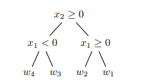

# 决策树（Decision Tree）

## Reference

- https://cs229.stanford.edu/cs229-notes-decision_trees.pdf
- https://ieeexplore.ieee.org/stamp/stamp.jsp?arnumber=10562290

## 1 定义

形式上，决策树可以被视为一种从输入域的$k$个区域$\{R_1, R_2, \ldots, R_k\}$到$k$个相应预测值$\{w_1, w_2, \ldots, w_k\}$的映射. 我们要求这些区域对输入域进行划分，即任意两个区域之间没有交集，并且这些区域的并集涵盖整个输入域. 我们还要求在某个区域$R_j$内的任意点的预测值都相同，即为$w_j$ . 例如，我们可以创建一个决策树，其中区域$R_1, \ldots, R_4$ 是二维实数空间$\mathbb{R}^2$ 中的四个象限，即：
$R_1 = \{x : x_1\geq0, x_2\geq0\}$
$R_2 = \{x : x_1 < 0, x_2\geq0\}$
$R_3 = \{x : x_1 < 0, x_2 < 0\}$
$R_4 = \{x : x_1\geq0, x_2 < 0\}$
并且对于所有$x\in R_1$ 预测值为$w_1$ ，对于所有$x\in R_2$ 预测值为$w_2$ ，以此类推. 

更一般地，我们可以用一个相当简洁的代数表达式来表示对给定输入$x$ 的预测：

$$
f(x)=\sum_{j = 1}^{k}w_j\mathbf{1}[x\in R_j]
$$

注意，在对这$k$ 个区域的求和中，除了$x$ 所在的区域$R_j$ 对应的项，其余项都为$0$ . 在回归问题中，通常选择$w_j=\frac{\sum_{i = 1}^{n}y^{(i)}\mathbf{1}[x^{(i)}\in R_j]}{\sum_{i = 1}^{n}\mathbf{1}[x^{(i)}\in R_j]}$ ，即区域$R_j$ 中训练数据标签的平均值（但并非强制要求）. 在分类问题中，通常让$w_j$ 为区域$R_j$ 中训练数据里最常见的类别（相关区域内的“多数表决” ）. 

此外，这种映射很容易用树结构来表示，这也是其名称的由来. 以将$\mathbb{R}^2$ 划分为象限的例子来说，我们可以构建如下对应的树：
（此处有一个树结构的图示，条件为$x_2\geq0$ ，其右分支条件为$x_1\geq0$ 对应$w_1$ ，左分支条件为$x_1 < 0$ 对应$w_2$  ；$x_2\geq0$ 的左分支条件为$x_1\geq0$ 对应$w_3$ ，左分支条件为$x_1 < 0$ 对应$w_4$  ）
如果条件满足，我们沿着节点的右分支走，不满足则沿着左分支走. 我们可以注意到，在这个树表示中，每个区域$R_j$ 都对应一个叶子节点（无分支节点）；实际上，我们研究的所有决策树模型都具有这个属性，这意味着决策树模型中区域数量$k$ 与树表示中叶子节点的数量完全相同. 



在这些笔记中，我们假设拥有一个包含$n$ 个数据点的训练集，每个数据点是$d$ 维的. 因此，我们的每个区域将是$\mathbb{R}^d$ 的一个子集，并且我们假设每个相应的预测值是一个实数. 此外，我们将遵循标准做法，要求每个树节点的分支条件是关于单个特征的单一不等式，例如$\mathbf{1}[x_j < s]$ 或$\mathbf{1}[x_j\geq t]$ ，其中$s, t\in\mathbb{R}$ 且$j\in\{1, \ldots, d\}$ . 遵循此做法的结果是，我们的每个区域都将是$\mathbb{R}^d$ 的一个与坐标轴平行且垂直于其他轴的子集. 

## 2 模型拟合

为了拟合模型，我们像在其他监督学习模型中一样，寻求优化一个损失函数. 这里，我们的损失函数如下：

$$
\mathcal{L}(f)=\sum_{i = 1}^{n}\ell(y^{(i)}, f(x^{(i)}))=\sum_{j = 1}^{k}\sum_{x^{(i)}\in R_j}\ell(y^{(i)}, w_j)
$$

在该式中：
- $x^{(i)}$ 代表第 $i$ 个训练样本的特征向量 ，其中 $i = 1,2,\cdots,n$ ，$n$ 是训练样本的数量. 它包含了用于模型输入的相关特征信息.  
- $y^{(i)}$ 代表第 $i$ 个训练样本对应的真实标签值 . 在回归问题中，它是一个数值；在分类问题中，它是样本所属的类别标识 . 
- 第一个等式是我们从其他监督学习模型研究中熟悉的一般形式，而第二个等式使用决策树模型的特定结构给出了等价表示. 

但与我们之前见过的情况不同，由于决策树自身的离散结构，这不是一个光滑的损失函数；到目前为止我们在监督学习中使用的微积分工具无法帮助我们在此处最小化损失. 事实证明，计算一个最优（效率最高）的树模型来最小化这个损失是NP完全问题，也就是说，就我们所知，目前难以处理. 因此，我们使用一种启发式算法来将模型拟合到数据上. 在本节对训练算法的描述中，我们将参考一个抽象的“增益”函数$G(\cdot, \cdot)$ ，这个函数为给定节点的某个分裂操作带来的改进提供了一种度量. 

该算法在树的每个节点处递归进行. 我们从一个将构成树的根节点开始，现在，要在给定节点应用该算法，我们根据某个条件$\mathbf{1}[x_j\geq\theta]$ （其中$j\in\{1, \ldots, d\}$ 且$\theta\in\mathbb{R}$ ）决定是否分裂该节点. 

首先假设我们想要分裂这个节点. 为了选择分裂方式，我们选择

$$
j, \theta=\underset{j, \theta}{\arg\max}\, G(j, \theta)
$$

也就是说，我们找到特征 $j$ 和分裂值 $\theta$ ，使得增益函数 $G(j, \theta)$ 最大化，这里的增益只是对特定分裂所带来改进的一种抽象占位符. 然后我们相应地将数据划分到这个分裂产生的左子节点和右子节点中，并在每个子节点上继续进行相同的递归操作. 

如果我们选择不进行分裂（稍后我们会讨论做出这个选择的情况），那么我们为与这个（叶子）节点对应的区域分配一个预测值 $w$ ，通常按照上一节描述的启发式方法来确定. 

现在，选择 $j, \theta=\underset{j, \theta}{\arg\max}G(j, \theta)$ 来进行分裂的优化乍一看似乎难以处理. 我们当然可以对 $j$ 的有限可能性进行迭代，但这种对 $\theta\in\mathbb{R}$ 的迭代对我们来说实际上是不可行的. 然而，我们会看到，就增益函数 $G(\cdot, \cdot)$ 的输出而言，实际上只有有限个“不同”的$\theta$ 值. 

考虑某个特征 $j$ . 然后我们可以根据这个特征值对数据点 $x^{(1)}, \ldots, x^{(n)}$ 进行排序，使得 $x_{j}^{(i_1)}\leq x_{j}^{(i_2)}\leq\cdots\leq x_{j}^{(i_n)}$ ，其中 $i_1, \ldots, i_n$ 给出了数据点按其第 $j$ 个特征值升序排列的顺序. 在这里，我们看到在这些值中的任意两个之间选择 $\theta$ ，在对节点中的数据进行分裂方面在功能上是等价的——在这个不等式链中小于 $\theta$ 的所有数据点都被发送到左子节点，大于$\theta$ 的所有数据点都被发送到右子节点. 所以，在寻求在排序列表中的第$\ell$ 个和第$(\ell + 1)$ 个值之间进行分裂时，在功能上有$n - 1$ 个$\theta$ 的选择，并且通常选择$\theta = \frac{x_{j}^{(i_{\ell})}+x_{j}^{(i_{\ell + 1})}}{2}$ . 因此，我们可以通过对$d\times(n - 1)$ 种可能的不同分裂进行迭代来找到上述的$j$ 和$\theta$ . 

## 3 通过最小化成本来最大化增益
我们现在给出增益函数$G(\cdot, \cdot)$ 的具体形式. 但首先，让我们引入另一个抽象函数$C(\cdot)$ 来表示与节点相关的数据点的成本. 设$S$ 是我们希望评估其分裂情况的节点所关联的数据点集. 设$L$ 和$R$ 分别是原始节点分裂后与左子节点和右子节点相关联的数据点集. 那么用我们的成本函数来直观表示增益函数就是：
$$
G(j, \theta)=C(S)-\left[\frac{|L|}{|S|}C(L)+\frac{|R|}{|S|}C(R)\right]
$$
因为这是分裂前的成本$C(S)$ 与分裂后（按比例加权的）成本$\frac{|L|}{|S|}C(L)+\frac{|R|}{|S|}C(R)$ 之间的差值. 由此可知，选择使增益函数最大化的分裂方式等同于选择使分裂后的成本最小化的分裂方式. 

为了完全明确增益函数，现在要做的就是使我们的成本函数具体化，这就是我们后面要介绍的基尼指数与信息增益

## 4 伪代码

以下是构建决策树（Decision Tree）的通用伪代码，涵盖分类和回归场景，主要基于文本中介绍的原理，即通过最大化增益（最小化成本）来递归地分裂节点：

### 定义增益函数（示例，可根据实际成本函数调整）
```python
# 假设已有计算成本函数 cost_function(node_data)
def gain_function(node_data, left_data, right_data):
    S = node_data  # 父节点数据
    L = left_data  # 左子节点数据
    R = right_data  # 右子节点数据
    return cost_function(S) - (len(L) / len(S) * cost_function(L) + len(R) / len(S) * cost_function(R))
```

### 决策树构建主函数
```python
def build_decision_tree(data, features, max_depth=float('inf'), current_depth=0):
    if len(set(data[:, -1])) == 1:  # 若数据集中标签都相同，返回叶子节点
        return data[0, -1]
    if current_depth >= max_depth:  # 达到最大深度，返回叶子节点（按启发式确定预测值）
        # 回归场景：返回均值；分类场景：返回多数类
        if is_regression_task: 
            return np.mean(data[:, -1])
        else:
            unique, counts = np.unique(data[:, -1], return_counts=True)
            return unique[np.argmax(counts)]

    best_gain = -float('inf')
    best_feature = None
    best_threshold = None
    best_left_data = None
    best_right_data = None
    for feature in features:
        sorted_indices = np.argsort(data[:, feature])
        sorted_data = data[sorted_indices]
        for i in range(len(sorted_data) - 1):
            threshold = (sorted_data[i, feature] + sorted_data[i + 1, feature]) / 2
            left_mask = sorted_data[:, feature] < threshold
            left_data = sorted_data[left_mask]
            right_data = sorted_data[~left_mask]
            gain = gain_function(sorted_data, left_data, right_data)
            if gain > best_gain:
                best_gain = gain
                best_feature = feature
                best_threshold = threshold
                best_left_data = left_data
                best_right_data = right_data

    if best_feature is None:  # 无法找到有效分裂，返回叶子节点
        if is_regression_task: 
            return np.mean(data[:, -1])
        else:
            unique, counts = np.unique(data[:, -1], return_counts=True)
            return unique[np.argmax(counts)]

    tree = {
        'feature': best_feature,
        'threshold': best_threshold,
        'left': build_decision_tree(best_left_data, features, max_depth, current_depth + 1),
        'right': build_decision_tree(best_right_data, features, max_depth, current_depth + 1)
    }
    return tree
```

### 预测函数
```python
def predict(tree, x):
    if not isinstance(tree, dict):
        return tree
    if x[tree['feature']] < tree['threshold']:
        return predict(tree['left'], x)
    else:
        return predict(tree['right'], x)
```

### 使用示例
```python
# 假设已有数据集data（numpy数组，最后一列为标签），特征列表features
# 以及判断是否为回归任务的标志is_regression_task
tree = build_decision_tree(data, features)
new_data = np.array([[...]])  # 新的样本数据
prediction = predict(tree, new_data[0])
```

**代码说明**：
- `build_decision_tree` 函数是核心，它递归地构建决策树. 首先检查停止条件，如标签一致或达到最大深度. 然后遍历所有特征和可能的分裂点，通过增益函数找到最优分裂. 根据最优分裂结果，分别对左右子节点递归调用自身继续构建树. 
- `predict` 函数用于对新数据进行预测，从根节点开始，根据节点的分裂条件在树中向下遍历，直到到达叶子节点获取预测值. 
- 实际应用中，需根据具体问题调整成本函数（如回归用均方误差、分类用熵等）以及数据的读取和预处理等操作.  


## 5 分裂准则对比 基尼指数与信息增益

### 基尼指数

**1. 基本概念：数据不纯度**

在决策树的分类任务中，节点的 **不纯度** 表示该节点内样本类别分布的混乱程度。基尼指数用于量化这种不纯度，其核心思想是：**计算随机选取两个样本时，它们属于不同类别的概率**。


**2. 数学推导**

设数据集 $S$ 包含 $k$ 个类别，第 $i$ 类样本的比例为 $p_i$（即 $p_i = \frac{|C_i|}{|S|}$，$|C_i|$ 为第 $i$ 类样本数，$|S|$ 为总样本数），则：  
- 随机选取一个样本属于第 $i$ 类的概率为 $p_i$。  
- 再随机选取一个样本 **不属于** 第 $i$ 类的概率为 $1 - p_i$。  

对所有类别求期望（即平均概率），得到 **基尼指数**：  

$$
Gini(S) = \sum_{i=1}^{k} p_i (1 - p_i) = 1 - \sum_{i=1}^{k} p_i^2
$$  

- **展开解释**：  
  - $\sum_{i=1}^{k} p_i (1 - p_i)$ 表示“随机选两个样本类别不同的概率”（不纯度越高，该概率越大）。  
  - 化简后为 $1 - \sum p_i^2$，例如：  
    - 若所有样本同属一类（$p_1=1, p_2=\dots=p_k=0$），则 $Gini(S)=0$（完全纯净）。  
    - 若两类样本各占50%（$p_1=p_2=0.5$），则 $Gini(S)=1 - (0.5^2 + 0.5^2) = 0.5$（最大不纯度）。  


**3. 决策树中的应用：分裂准则**

在CART决策树中，基尼指数用于选择最优分裂特征和阈值：  
1. **计算节点分裂前的基尼指数**：$Gini(S)$。  
2. **计算分裂后的加权基尼指数**：  
   设节点 $S$ 分裂为左子节点 $L$（样本数 $|L|$，基尼指数 $Gini(L)$）和右子节点 $R$（样本数 $|R|$，基尼指数 $Gini(R)$），则：  

$$
Gini_{\text{split}}(S) = \frac{|L|}{|S|}Gini(L) + \frac{|R|}{|S|}Gini(R)
$$ 

3. **基尼增益（Gini Gain）**：  
   分裂带来的不纯度减少量为： 

$$
\text{Gini Gain} = Gini(S) - Gini_{\text{split}}(S)
$$  

   选择使 **基尼增益最大**（即分裂后不纯度下降最多）的特征和阈值进行分裂。  
  


### 信息增益


**1. 熵（Entropy）的定义**

熵衡量数据集的不确定性，公式为：  


$$
H(D) = -\sum_{k=1}^{K} p_k \log_2 p_k
$$

其中， $K$  是类别数， $p_k = \frac{|C_k|}{|D|}$ （ $|C_k|$  为第  $k$  类样本数， $|D|$  为总样本数）。熵越大，数据越混乱（如二分类中各占50%时，熵为1，不确定性最高）。


**2. 条件熵（Conditional Entropy）**

给定特征  $A$ ，条件熵表示已知  $A$  后的数据剩余不确定性：  

$$
H(D|A) = \sum_{i=1}^{n} \frac{|D_i|}{|D|} H(D_i)
$$

其中， $D_i$  是  $A$  取值为  $i$  的子集， $n$  是  $A$  的取值个数。例如，特征“年龄”有“$\leq 30$”和“$>30$”两个取值时， $n=2$ ，条件熵是左右子节点熵的加权平均。


**3. 信息增益（Information Gain）**

信息增益是分裂前后熵的差值，即：  
$$
\text{Gain}(D, A) = H(D) - H(D|A)
$$

它表示使用特征  $A$  分裂后，数据不确定性的减少量。**信息增益越大，特征  $A$  对分类的帮助越显著**。


- **不确定性减少**：分裂前的熵  $H(D)$  是全局不确定性，分裂后的条件熵  $H(D|A)$  是局部不确定性的加权和。两者的差（信息增益）越大，说明特征  $A$  使数据更“纯净”（类别分布更集中）。
- **数学上**：通过对数运算量化概率分布的差异，本质是 **Kullback-Leibler散度**（相对熵）在分类任务中的应用，衡量特征  $A$  与类别  $C$  之间的相关性。


## 6 典型决策树算法 ID3,C4.5,CART
 