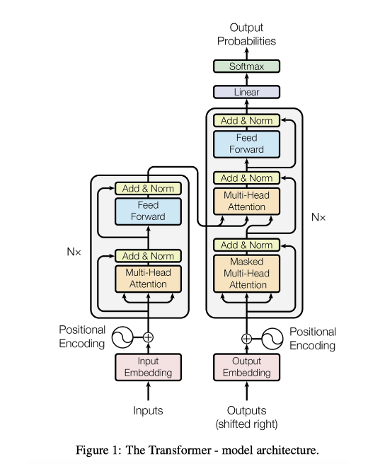
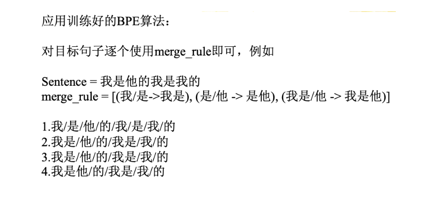

# 大模型面试

## Transformer



### Tokenization（分词）

- Tokenization是将一个整体（例如词、短语、句子、段落甚至语音、图像）分割成较小单位（被称为token）的过程.

- 中文分词难点：分词标准，切分歧义，未登录词（OOV，Out of Vocabulary 新词）

- Tokenization算法类型： word-based、character-based、subword-based.
    - Word-based：将文本按自然语言中的 “词” 进行分割，通常以空格、标点符号或特定分隔符作为分词边界. 例如英语中按空格分割，汉语则需要专门的分词工具（如 jieba）. 
        - “I love natural language processing” $\leftarrow$ ["I", "love", "natural", "language", "processing"]
        - 词级单位保留完整语义，但词汇表庞大，未登录词（OOV）问题突出
    - Character-based：将文本拆解为最小字符单元，每个字符（包括标点、空格）作为独立 token. 例如：
        - “Hello!” $\leftarrow$ ["H", "e", "l", "l", "o", "!"]
        - 词汇表极小，无 OOV 问题，但丢失词级语义
    - Subword-base：介于词与字符之间的折中方案，将词拆分为有意义的子词单元（如前缀、后缀、词根），平衡词汇表大小与语义保留. 
        - BPE（Byte Pair Encoding）
        - BBPE
        - WordPiece
        - Unigram
- GPT2使用BBPE，Bert使用WordPiece

#### BPE

BPE核心逻辑是：  
**从字符级别开始，通过迭代合并高频相邻字符对，逐步构建更有语义的子词单元**，最终平衡词汇表大小与语义表达能力. 


**初始化：字符级分割与频率统计**
 
- **示例**：  
  假设语料中包含词：*“low”, “lower”, “new”, “newest”*  
  初始分割后：  
  ```
  low → l o w </w>  
  lower → l o w e r </w>  
  new → n e w </w>  
  newest → n e w e s t </w>
  ```  
  统计相邻字符对频率：  
  - (“l”, “o”): 2次（来自“low”和“lower”）  
  - (“o”, “w”): 2次  
  - (“w”, “</w>”): 1次  
  - (“w”, “e”): 1次（来自“lower”）  
  - (“e”, “r”): 1次  
  - (“n”, “e”): 2次（来自“new”和“newest”）  
  - (“e”, “w”): 2次  
  - (“w”, “e”): 1次（来自“newest”）  
  - …（其他低频对）

**迭代合并：高频字符对升级为子词**
- **核心规则**：每次选择**出现频率最高的字符对**，将其合并为一个新的子词单元，并更新词表和频率统计.   
- **示例（第一次迭代）**：  
  最高频对为(“l”, “o”)和(“n”, “e”)（均2次），假设先合并(“l”, “o”) → 新子词“lo”.   
  合并后词表更新：  
  ```
  low → lo w </w>  
  lower → lo w e r </w>  
  new → n e w </w>  
  newest → n e w e s t </w>
  ```  
  重新统计字符对频率：  
  - (“lo”, “w”): 2次（来自“low”和“lower”）  
  - (“w”, “</w>”): 1次  
  - (“w”, “e”): 1次  
  - (“e”, “r”): 1次  
  - (“n”, “e”): 2次  
  - (“e”, “w”): 2次  
  - (“w”, “e”): 1次  
  - …  
- **第二次迭代**：最高频对为(“n”, “e”)和(“e”, “w”)（均2次），合并(“n”, “e”) → “ne”.   
  词表更新为：  
  ```
  new → ne w </w>  
  newest → ne w e s t </w>
  ```  
  继续此过程，直到达到预设的迭代次数或词汇表大小. 


**形式化定义**
- 设初始词表为字符集合 $V_0 = \{c_1, c_2, ..., c_n, </w>\}$，  
- 第 $k$ 次合并后的词表为 $V_k$，  
- 合并操作 $\text{merge}(V_{k-1})$ 选择频率最高的字符对 $(a, b) \in V_{k-1} \times V_{k-1}$，生成新子词 $ab$，并更新 $V_k = V_{k-1} \cup \{ab\}$. 


**BPE算法流程**
1. **计算初始词表**：先把训练语料分成最小单元（英文中26个字母加上各种符号以及常见中文字符），这些作为初始词表.   
2. **构建频率统计**：统计所有子词单元对（bigram，即两个连续的子词）在文本中的出现频率.   
3. **合并频率最高的子词对**：合并出现频率最高的子词对，并更新词汇表和`merge rule`.   
4. **重复合并步骤**：不断重复步骤 2 和步骤 3，直到达到预定的词汇表大小、合并次数，或者直到不再有有意义的合并（即，进一步合并不显著提高词汇表的效益）.   
5. **分词**：使用最终得到的`merge rule`对文本进行分词. 

BPE分词流程：


#### Word-Piece

计算过程绝大部分与BPE一致，将挑选bigram的指标从频率换成了PMI（点互信息，[Pointwise Mutual Information](https://en.wikipedia.org/wiki/Pointwise_mutual_information)）：  

$$ \text{PMI}(a, b) = \frac{P(a, b)}{P(a)P(b)} $$  
其中 $a$、$b$ 为相邻的subword.   

当 PMI 值较高时，表示 $a$ 和 $b$ 在一起出现的频率远高于它们各自独立出现的概率，说明它们之间的关联较强，可能是一个有意义的组合.   


**Word-Piece算法过程**  
1. **计算初始词表**：通过训练语料获得，或初始为英文26个字母 + 符号 + 常见中文字符，作为初始词表.   
2. **计算合并分数（PMI）**：对训练语料拆分的子词单元，按合并规则计算两两子词的PMI分数.   
3. **合并分数最高的子词对**：选择PMI最高的子词对，合并为新子词单元，更新词表.   
4. **重复合并步骤**：循环执行步骤2 - 3，直到达到预定词表大小、合并次数，或无意义合并（合并无法显著提升词表效益）.   
5. **分词**：用最终词汇表对文本分词（对比BPE，直接依赖词汇表匹配分词 ）. 


**Word-Piece分词流程**：

正向最大匹配法（Forward Maximum Matching, FMM）

原理：从左到右扫描句子，尽可能匹配最长的词语.   

步骤：
1. 设置一个最大词长（如6）.   
2. 从句子的起始位置开始，取最大词长的子串，与词汇表匹配.   
3. 如果匹配成功，则切分该词，继续处理剩余部分；否则，缩短词长，继续匹配.   
4. 重复上述步骤，直到句子全部切分完毕. 

#### Unigram

### Embedding

### 位置编码（Positional Encoding）

### 多头注意力（MHA）

## 模型参数量计算

## LLAMA

## DEEPSEEK系列模型、Qwen系列模型

DeepSeek系列模型包含多个版本，从最初的DeepSeek LLM到DeepSeek V3、DeepSeek R1等，在模型架构、参数规模、性能表现和适用场景等方面都有不同特点.  以下是具体对比：
- **模型架构**：
    - **DeepSeek LLM**：基于经典Transformer架构，引入分组查询注意力（GQA）机制，通过将查询向量分组处理，降低推理计算成本.  
    - **DeepSeek V2**：采用混合专家（MoE）架构，引入多头潜在注意力（MLA）机制，将注意力机制中的键值（KV）对进行低秩联合压缩，减少KV缓存存储需求，支持128K tokens的上下文长度.  
    - **DeepSeek R1**：延续混合专家（MoE）架构，通过蒸馏技术，将大型模型的推理能力迁移到更小型的模型中，如R1-1.5B，使其能适应低资源环境.  还引入强化学习（RL），进一步降低推理资源消耗，提升复杂任务表现.  
- **参数规模**：
    - **DeepSeek LLM**：包含670亿参数，在2万亿token的数据集上训练而成.  
    - **DeepSeek V2**：拥有2360亿参数，预训练数据集规模达到8.1T token .  
    - **DeepSeek R1**：有不同参数规模的模型，如R1-1.5B为15亿参数，R1-35B为350亿参数，R1-67B+超过670亿参数.  
- **性能表现**：
    - **DeepSeek LLM**：通过优化算法及多步学习率调度器等，在语言理解和生成任务上表现出色，生成文本较准确且有逻辑性.  
    - **DeepSeek V2**：相比DeepSeek LLM，训练成本节省了42.5%，KV缓存减少了93.3%，最大生成吞吐量提升至5.76倍，在中文综合能力上表现突出.  
    - **DeepSeek V2.5**：相比DeepSeek V2，在通用能力（创作、问答等）上有显著提升，在与ChatGPT4o系列模型对比测试中，胜率更高.  数学和写作能力增强，加入联网搜索功能，可实时分析网页信息，但API接口不支持联网功能.  
    - **DeepSeek R1**：训练成本仅为GPT-4的5%-10%，但推理效率提升了40倍.  在数学、代码生成和自然语言推理任务中表现出色，如在AIME 2024竞赛中，R1系列的思维链（CoT）能力超越了GPT-4，还能对生成内容进行自我验证，降低输出错误概率.  

Qwen系列模型是阿里巴巴推出的大语言模型，随着版本迭代，在模型架构、性能、功能等方面都有不同程度的提升和优化.  以下是Qwen系列模型的对比：
- **Qwen 1.0与Qwen 1.5**：
    - **模型规模**：Qwen 1.0包含1.8B、7B、14B和72B参数的基础大型语言模型.  Qwen 1.5在此基础上引入了0.5B、4B、32B乃至110B参数模型，模型规模进一步拓展.  
    - **上下文长度**：Qwen 1.0部分早期变体上下文窗口达8K，重点聚焦中文和英文，部分模型上下文窗口高达32K个 token .  Qwen 1.5统一支持32K上下文长度.  
    - **代理能力**：Qwen 1.0能够初步使用工具或充当代理.  Qwen 1.5的代理能力在工具使用基准测试中达到与GPT-4相当的水平，工具选择与使用准确率超过95%.  
- **Qwen 1.5与Qwen 2**：
    - **模型尺寸**：Qwen 1.5有0.5B、1.8B、4B、7B、14B、32B、72B、110B等8个Dense模型以及1个14B（A2.7B）MoE模型.  Qwen 2包含了0.5B、1.5B、7B、57B-A14B和72B共计5个尺寸模型，推出了更大尺寸的57B-A14B MoE模型.  
    - **GQA应用**：Qwen 1.5中只有32B和110B的模型使用了GQA（分组查询注意力）.  Qwen 2所有尺寸的模型都使用了GQA，可加速推理并降低显存占用.  
    - **上下文长度**：Qwen 1.5上下文长度统一为32K.  Qwen 2的7B和72B模型上下文长度提升到128K，在处理长文本时更具优势.  
- **Qwen 2与Qwen 2.5**：
    - **模型系列丰富度**：Qwen 2主要包含5个尺寸的预训练和指令微调模型.  Qwen 2.5包含从5亿到720亿参数的多款模型，还推出了Qwen2.5-1M等模型，模型体系更加丰富.  
    - **预训练数据**：Qwen 2在训练数据中增加了27种语言相关的高质量数据，主要支持约30种语言.  Qwen 2.5在多达18万亿个token的大型数据集上预训练，支持29种以上语言，数据量和语言支持范围进一步扩大.  
    - **上下文处理能力**：Qwen 2-7B-Instruct和Qwen 2-72B-Instruct通过特定方法实现128K tokens上下文长度支持.  Qwen 2.5输入上下文长度达128K token，2025年1月发布的Qwen2.5-1M模型更是将上下文处理能力拓展至最多100万个token，处理速度还提升3-7倍.  
- **Qwen 2.5与Qwen 3**：
    - **思考模式**：Qwen 2.5未提及相关思考模式功能.  Qwen 3支持思考和非思考两种模式，用户可根据任务需求控制模型“思考”程度，处理复杂问题时可选择思考模式，简单问题可选择非思考模式以获得快速 response .  
    - **语言支持**：Qwen 2.5支持29种以上语言.  Qwen 3支持包括中文、葡萄牙语、德语等在内的119种语言和方言，多语言能力大幅提升.  
    - **预训练数据**：Qwen 2.5在18万亿个token上进行预训练.  Qwen 3预训练数据量几乎达到Qwen 2.5的两倍，基于约36万亿个token进行预训练，涵盖数据类型更丰富，增加了数学和代码数据等.  
    - **推理效率**：Qwen 3采用分层稀疏调度与动态专家激活机制等技术，推理效率显著提升，显存占用降低.  例如15B参数模型中，推理效率提升42%，显存占用从28GB降至18GB，还支持RTX3090等消费级显卡运行类GPT-4性能模型，使用门槛更低.  
    - **模型性能**：Qwen 3的部分小型模型可实现与Qwen 2.5较大参数规模模型相当的性能，如Qwen3-4B模型性能与Qwen2.5-72B-Instruct相当，且在STEM、编程和推理等领域，Qwen 3稠密模型的性能优于参数规模更大的Qwen 2.5系列模型.  

### MOE

### MLA

### GQA

## 大模型训练/推理显存占用分析

## 优化器

- AdamW

## 预训练，SFT，RM，RLHF，PPO，DPO，GRPO


## LoRA

## prompt 工程

### COT

思维链的主要思想是通过向大语言模型展示一些少量的样例，在样例中解释推理过程，大语言模型在回答时也会显示推理过程

## RAG

### RAG流程


