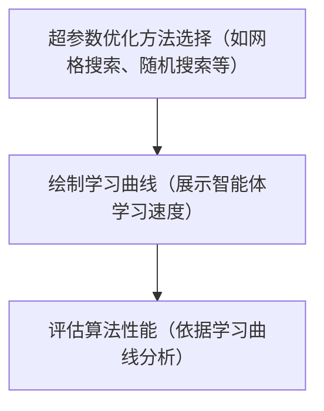

# 强化学习的黑箱优化

## Reference

- https://people.cs.umass.edu/~bsilva/courses/CMPSCI_687/Fall2022/Lecture_Notes_v1.0_687_F22.pdf

## 1 智能体与环境交互
在本次课程中，我们将介绍如何创建第一个强化学习智能体. 智能体可被视作面向对象编程语言中的对象，它具备一些函数，这些函数用于从智能体获取动作、告知智能体其所获得的状态和奖励，以及通知智能体新的情节何时开始. 智能体与环境交互的高级伪代码如下：

**算法1：智能体与环境交互的伪代码**

- $\text{for } \text{episode } = 0, 1, 2, ... \text{ do}$
    - $s \sim d_0$;
 	- $\text{for } t = 0 \text{ to } \infty \text{ do}$
        - $a = \text{agent.getAction}(s)$;
        - $s' \sim p(s, a, \cdot)$;
        - $r \sim d_R(s, a, s')$;
        - $\text{agent.train}(s, a, r, s')$;
        - $\text{if } s' == s_{\infty} \text{ then}$
        - $\text{break}$; // 跳出时间t的循环
- $s = s'$;
- $\text{agent.newEpisode()}$;

这里的智能体有三个函数. 第一个函数getAction，它根据当前状态s，并利用智能体当前的策略对动作a进行采样. 第二个函数train，用于通知智能体刚刚发生的状态转移，即由于动作a，状态从s转移到了s'，并获得了奖励r. 这个函数可能会更新智能体当前的策略. 第三个函数newEpisode，通知智能体当前情节已结束，它应该为下一个情节做准备. 注意，智能体对象可能具有记忆功能. 这使得它可以在调用train函数时，存储整个情节的状态、动作和奖励，然后在调用newEpisode函数时，利用该情节（或多个情节）的所有数据来更新其策略. 

## 2 策略搜索的黑箱优化（BBO）

黑箱优化（BBO）算法是一类通用的优化算法（即并非特定于强化学习），用于解决如下形式的问题：

$$
\underset{x \in \mathbb{R}^{n}}{\arg \max } f(x)
$$

其中 $f: \mathbb{R}^{n} \to \mathbb{R}$  . 不同的BBO算法对函数 $f$ 有不同的假设，比如假设它是光滑的或有界的. 此外，不同的BBO算法对关于f的已知信息也有不同的假设. 有些算法可能假设优化算法可以为任意 $x \in \mathbb{R}^{n}$  计算 $f(x)$  ，而其他算法则假设智能体可以在任意点 $x$  计算梯度 $\nabla f(x)$  . BBO算法之所以被称为黑箱算法，是因为它们将 $f$ 视为一个黑箱——它们不会深入研究 $f$ 的内部结构（或解析形式的知识）来加速优化过程. 对于强化学习而言，这意味着BBO算法不会利用环境可被建模为马尔可夫决策过程（MDP）这一知识. 

在这里，我们将考虑这样的BBO算法：它们假设可以为任意 $x \in \mathbb{R}^{n}$  生成 $f(x)$  的估计值，但 $f(x)$  的精确值未知，梯度 $\nabla f(x)$  也未知. 适用于这类问题的BBO算法示例包括爬山搜索、模拟退火和遗传算法（Russell等人，2003年）. 为了将这些算法应用于强化学习，我们将用它们来优化目标函数. 也就是说，我们将用它们来解决如下问题：

$$
\underset{\pi \in \Pi}{\arg \max } J(\pi) .
$$

为了将这些算法应用于上述问题，我们必须确定如何估计 $J()$  ，以及如何将每个策略 $\pi$  表示为 $\mathbb{R}^{n}$  中的向量. 

### 2.1 如何估计目标函数？

我们可以通过运行策略 $\pi$  进行 $N$ 个  $\text{episode}$，然后对观察到的回报求平均，以此来估计 $J(\pi)$  . 即，我们可以使用以下 $J$  的估计量 $\hat{J}$  ：

$$
\begin{aligned} \hat{J}(\pi) & :=\frac{1}{N} \sum_{i=1}^{N} G^{i} \\ & =\frac{1}{N} \sum_{i=1}^{N} \sum_{t=0}^{\infty} \gamma^{t} R_{t}^{i}, \end{aligned}
$$

其中 $G^{i}$  表示第 $i$  个 $\text{episode}$ 的回报， $R_{t}^{i}$  表示第 $i$  个 $\text{episode}$ 中时间 $t$  的奖励. 此后，我们将在随机变量上使用上标来表示它们发生在哪一个 $\text{episode}$ . 

### 2.2 参数化策略
回顾 [MDPs](../MDPs/README.md) 可知，我们可以将策略表示为具有非负项且行和为1的 $|S| \times|A|$  矩阵. 当用数字来定义策略，且不同数字会产生不同策略时，我们将这些数字称为策略参数. 与机器学习的其他领域不同，我们经常会讨论可以用这种方式参数化的不同函数和(或分布)，因此将这些参数称为策略参数很重要，而不能仅仅称其为参数（除非我们所指的参数非常明显）. 我们将在 [MDPs](../MDPs/README.md) 描述的表示方式称为表格策略，因为该策略存储在一个表格中，每个状态 - 动作对都有一个条目. 注意，我们可以通过将表格的行或列连接成 $\mathbb{R}^{|S||A|}$  中的向量，从而将这个表格视为一个向量. 

尽管这种策略的参数化方式很简单，但它对解向量有一定约束，而标准的BBO算法并非为此设计——它们要求表格策略中的行和为1，且条目始终为正. 虽然BBO算法可以进行调整以适用于这种策略表示，但通常更改我们表示策略的方式会更为简便. 也就是说，我们希望将策略存储为一个 $|S| \times|A|$  矩阵 $\theta$  ，其条目没有任何约束. 此外，增大 $\theta(s, a)$  （第 $s$  行和第 $a$  列的条目）应使 $\pi(s, a)$  增大. 注意，按照这种表示法，对于每一个 $(s, a)$  对， $\theta(s, a)$  都是一个策略参数. 

实现这一点的一种常见方法是使用softmax动作选择. softmax动作选择根据 $\theta(s, a)$  对策略的定义如下：
$$\pi(s, a):=\frac{e^{\sigma \theta(s, a)}}{\sum_{a'} e^{\sigma \theta\left(s, a'\right)}},$$
其中 $\sigma>0$  是一个超参数，用于调整 $\theta(s, a)$  和 $\theta(s, a')$  的值的差异对动作 $a$  和 $a'$  的概率的影响程度. 目前，假设 $\sigma = 1$  . 为了证明这是对 $\pi$  的有效定义，我们必须表明对于所有 $s \in S$  ， $\pi(s, \cdot)$  是 $A$  上的概率分布. 即，对于所有 $s$  ， $\sum_{a \in A} \pi(s, a)=1$  ，且对于所有 $s$  和 $a$  ， $\pi(s, a) \geq 0$  . 我们现在来证明这两个性质. 首先，对于所有 $s \in S$  ：
$$\begin{aligned} \sum_{a \in \mathcal{A}} \pi(s, a) & =\sum_{a \in \mathcal{A}} \frac{e^{\sigma \theta(s, a)}}{\sum_{a' \in \mathcal{A}} e^{\sigma \theta\left(s, a'\right)}} \\ & =\frac{\sum_{a \in \mathcal{A}} e^{\sigma \pi(s, a)}}{\sum_{a' \in \mathcal{A}} e^{\sigma \theta\left(s, a'\right)}} \\ & =1 . \end{aligned}$$

其次，对于所有 $s$  和 $a$  ， $e^{\sigma \theta(s, a)}>0$  ，因此分子和分母的所有项均为非负，从而 $\pi(s, a)$  是非负的. 

这种分布也被称为玻尔兹曼分布或吉布斯分布. 使用这种分布的一个缺点是，如果不令 $\theta(s, a)= \pm \infty$  ，它就无法精确表示确定性策略. 

我们通常用 $\theta$  表示策略的参数，并将参数化策略定义为一个函数 $\pi: S ×A ×\mathbb{R}^{n} \to [0,1]$  ，使得 $\pi(s, a, \theta)=Pr(A_{t}=a | S_{t}=s, \theta)$  . 因此，更改策略参数向量 $\theta$  会使参数化策略成为不同的策略. 所以，你可能会看到表格softmax策略的等效定义：

$$
\pi(s, a, \theta):=\frac{e^{\sigma \theta_{s, a}}}{\sum_{a'} e^{\sigma \theta_{s, a'}}} . 
$$

表格softmax策略只是策略参数化的一种方式. 一般来说，你应该选择一种你认为对要解决的问题有效的策略参数化方式（即策略参数向量映射到随机策略的方式）. 这更多的是一门艺术而非科学——你将从实践经验中学习. 

现在我们已经将策略表示为 $\mathbb{R}^{n}$  中的向量（当使用表格softmax策略时， $n = |S||A|$  ），我们必须重新定义目标函数，使其成为策略参数向量的函数，而非策略的函数. 即，令

$$
J(\theta):=E[G | \theta]
$$

其中基于 $\theta$  进行条件设定表示 $A_{t} \sim \pi(S_{t}, \cdot, \theta)$  . 通常使用的策略参数化方式无法表示所有策略. 在这些情况下，目标是找到可表示的最佳策略，即最优策略参数向量：
$$
\theta^{*} \in \underset{\theta \in \mathbb{R}^{n}}{\arg \max }\ J(\theta) .
$$

其他参数化策略的示例包括深度神经网络，其中网络的输入是状态 $s$  ，网络对每个动作都有一个输出. 然后可以对网络的输出使用softmax动作选择. 如果动作是连续的，人们可能会假设在给定 $S_{t}$  的情况下，动作 $A_{t}$  应服从正态分布，其均值由具有参数 $\theta$  的神经网络参数化，方差是一个固定常数（或策略参数向量的另一个参数）. 

人们也可能选择表示确定性策略，即输入是一个状态，输出是在该状态下始终选择的动作. 例如，考虑在一个人进餐前，决定胰岛素泵应注射多少胰岛素的问题. 一种常见（且特别简单）的策略参数化方式是：

$$
\text{injection size} =\frac{ \text{current blood glucose} - \text{target blood glucose} }{\theta_{1}}+\frac{ \text{meal size} }{\theta_{2}},
$$

其中 $\theta=[\theta_{1}, \theta_{2}]^{\top} \in \mathbb{R}^{2}$  是策略参数向量，当前血糖值和进餐量构成状态，目标血糖值是由糖尿病专家指定的常数，注射量是动作（Bastani，2014年）. 注意，这种表示方式得到的策略参数数量较少——远少于使用神经网络的情况. 同样，许多控制问题可以使用参数较少的参数化策略（Schaal等人，2005年）（另见PID和PD控制器）. 

这里简要介绍一下线性函数逼近. 另一种常见的策略表示（通常在状态不是离散的情况下使用）是结合线性函数逼近的softmax动作选择. 稍后我们将更全面、详细地讨论线性函数逼近. 这里我们考虑一种具体的应用. 令 $\phi: S \to \mathbb{R}^{m}$  是一个函数，它以状态为输入，返回一个特征向量作为输出. 注意，即使 $s$  是连续的， $\phi(s)$  也可以是一个短向量. 例如，如果 $S=\mathbb{R}$  ，我们可以定义 $\phi(s)=[s, s^{2}, s^{3}, ..., s^{10}]^{\top}$  . 目前我们将 $\phi(s)$  向量的长度定义为 $m$  ，因为我们用 $n$  表示策略参数的总数. 稍后，当我们使用线性函数逼近表示除策略之外的结构时（例如，当我们讨论线性时间差分学习时，我们将用 $n$  表示特征的数量），可能会用 $n$  表示特征的数量. 

为了在softmax动作选择中使用线性函数逼近，我们为每个动作 $a \in A$  存储一个不同的向量 $\theta_{a}$  . 然后我们根据公式（31）将 $\theta(s, a)$  计算为 $\theta_{a}^{\top} \phi(s)$  ，其中 $v^{T}$  表示向量 $v$  的转置. 即，

$$
\begin{array}{rlrl} \theta(s, a) & =\theta_{a}^{\top} \phi(s) \\ 
& =\theta_{a} \cdot \phi(s)  \\ 
& =\sum_{i=1}^{m} \theta_{a, i} \phi_{i}(s), 
\end{array}
$$
其中 $\theta_{a, i}$  是向量 $\theta_{a}$  的第 $i$  个条目， $\phi_{i}(s)$  是向量 $\phi(s)$  的第 $i$  个条目. 因此，在结合线性函数逼近的softmax动作选择中：
$$\pi(s, a, \theta)=\frac{e^{\sigma \theta_{a}^{\top} \phi(s)}}{\sum_{a' \in \mathcal{A}} e^{\sigma \theta_{a'}^{\top} \phi(s)}},$$
其中 $\theta$  是一个包含 $m|A|$  个参数的大向量：对于 $|A|$  个动作中的每一个，都有一个向量 $\theta_{a} \in \mathbb{R}^{m}$  . 虽然你可能会把 $\theta$  看作一个矩阵，但我建议你把 $\theta$  看作一个向量（将所有列堆叠成一个大列的矩阵）——这将简化后续的数学运算. 此外，我们称其为 “线性”，是因为 $\theta_{a}^{\top} \phi(s)$  在特征空间中是线性的，即使由于 $\phi$  中的非线性，它可能不是 $s$  的线性函数. 

问题仍然存在：我们应该如何定义 $\phi$  ？哪些特征能让智能体表示出良好的策略？你可以将神经网络视为学习这些特征（倒数第二层的输出就是 $\phi(s)$  ）. 然而，也有一些已知的 $\phi(s)$  选择往往能带来出色的性能（Konidaris等人，2011年b）. 我们稍后将更详细地讨论其中一些内容. 

选择参数数量较少的策略表示通常可以加快学习速度. 这是因为算法必须搜索的策略参数向量空间的维度更低. 因此，在选择策略表示时，深度神经网络通常应该是最后的选择，因为它们通常有数千甚至数百万个策略参数. 

### 2.3 评估强化学习算法

研究人员有多种方式来报告他们算法的性能. 最常见的方法是研究人员对所有算法的所有超参数进行优化，然后绘制每个算法的学习曲线，这些曲线展示了智能体在使用每种强化学习算法时的学习速度. 然而，这一过程的具体细节在整个研究领域并没有统一标准. 

关于如何进行超参数优化，目前并没有公认的标准. 一些研究人员使用网格搜索，而另一些则采用随机搜索. 有关超参数优化的研究表明，至少应该使用随机搜索（Bergstra和Bengio，2012），而非网格搜索. 你也可以考虑使用黑箱优化算法来优化算法的超参数. 此外，对于超参数优化的目标也没有统一的标准：有些作者选择使学习曲线下面积最大化（在固定数量的情节内回报的总和，在多次试验中取平均值）的超参数，而另一些人则针对固定情节数后的最终策略性能进行优化. 

需要注意的是，这种报告强化学习算法性能的方法并没有体现出为每种算法找到合适超参数的难度. 这个问题并不新鲜，多年来一直有人呼吁报告算法对超参数的敏感性，现在越来越多的论文也提供了展示超参数敏感性的图表. 同样需要注意的是，有些论文展示了看似相似的图表，但报告的统计数据并非预期回报（Johns，2010，第80页） .

