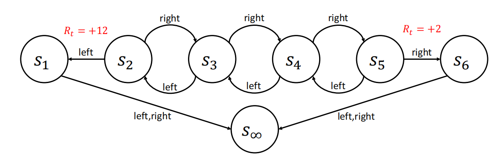
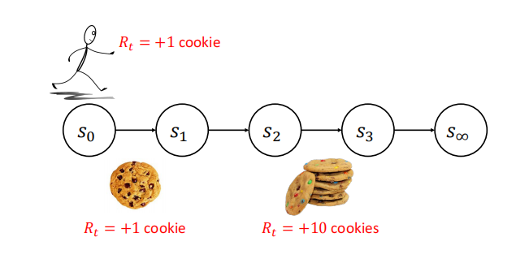

# 值函数与贝尔曼方程

## Reference

- https://people.cs.umass.edu/~bsilva/courses/CMPSCI_687/Fall2022/Lecture_Notes_v1.0_687_F22.pdf

到目前为止，我们已经用数学方法描述了想要解决的问题，并介绍了如何应用BBO方法. 但这些BBO算法并没有利用环境中假设的马尔可夫决策过程（MDP）结构. 现在，我们将介绍价值函数，这是一种能够利用环境的MDP结构的工具. 需要注意的是，价值函数本身并不是一个完整的智能体. 

## 1 状态价值函数
状态价值函数$v^{\pi}: S \to \mathbb{R}$，对于所有状态$s$，定义如下：

$$
\begin{equation}
v^{\pi}(s):=E\left[\sum_{k=0}^{\infty} \gamma^{k} R_{t+k} | S_{t}=s, \pi\right]
\label{eq:state_value_func}
\end{equation}
$$

使用$G_{t}$符号，我们有等价的定义（被问到定义时，你可以用这个作答）：

$$
v^{\pi}(s):=E\left[G_{t} | S_{t}=s, \pi\right] 
$$

通俗来讲，$v^{\pi}(s)$ 表示如果智能体从状态 $s$ 开始遵循策略$\pi$，其预期的折扣回报. 需要注意的是，这个量取决于策略$\pi$. 我们将$v^{\pi}(s)$称为状态$s$的价值. 

例如，考虑下图所示的MDP: 一个简单的MDP，我们称之为 “链状” MDP. 在强化学习文献中有很多 “链状” MDP，这并不是一个标准的. 在每个状态，智能体可以选择向左（L）或向右（R）移动，并且转移函数在执行这些转移时是确定性的. 在状态$s_{1}$和$s_{6}$，两个动作都会导致转移到$s_{\infty}$. 除了智能体从$s_{2}$转移到$s_{1}$时奖励为 +12，或者从$s_{5}$转移到$s_{6}$时奖励为 +2之外，奖励始终为零. 初始状态分布未指定. 为简单起见，设$\gamma = 0.5$. 我们将考虑这个MDP的两种策略. 第一种，$\pi_{1}$，总是选择向左的动作；第二种，$\pi_{2}$，总是选择向右的动作.

对于这个MDP：
$$
v^{\pi_{1}}\left(s_{1}\right)=0 
$$

$$
v^{\pi_{1}}\left(s_{2}\right)=12 \gamma^{0}=12 
$$

$$
v^{\pi_{1}}\left(s_{3}\right)=0 \gamma^{0}+12 \gamma^{1}=6
$$

$$
v^{\pi_{1}}\left(s_{4}\right)=0 \gamma^{0}+0 \gamma^{1}+12 \gamma^{2}=3
$$

$$
v^{\pi_{1}}\left(s_{5}\right)=0 \gamma^{0}+0 \gamma^{1}+0 \gamma^{2}+12 \gamma^{3}=1.5
$$

$$
v^{\pi_{1}}\left(s_{6}\right)=0 
$$

$$
v^{\pi_{2}}\left(s_{1}\right)=0
$$

$$
v^{\pi_{2}}\left(s_{2}\right)=0 \gamma^{0}+0 \gamma^{1}+0 \gamma^{2}+2 \gamma^{3}=\frac{1}{4}
$$

$$
v^{\pi_{2}}\left(s_{3}\right)=0 \gamma^{0}+0 \gamma^{1}+2 \gamma^{2}=\frac{1}{2} 
$$

$$
v^{\pi_{2}}\left(s_{4}\right)=0 \gamma^{0}+2 \gamma^{1}=1
$$

$$
v^{\pi_{2}}\left(s_{5}\right)=2 \gamma^{0}=2 
$$

$$
v^{\pi_{2}}\left(s_{6}\right)=0 
$$

注意，在 $\eqref{eq:state_value_func}$ 的右侧我们使用了 $t$，尽管它在左侧并未出现. 这是因为右侧对于所有的$t$取值都相同. 我们可以这样证明：

$$
\begin{align*}
v^{\pi}(s) &:= \mathbb{E}\left[\sum_{k = 0}^{\infty} \gamma^{k} R_{t + k} \Bigg| S_{t} = s, \pi\right] \\
&= \sum_{k = 0}^{\infty} \gamma^{k} \mathbb{E}[R_{t + k}|S_{t} = s, \pi] \\
&= \mathbb{E}[R_{t}|S_{t} = s, \pi] + \gamma\mathbb{E}[R_{t + 1}|S_{t} = s, \pi] + \gamma^{2}\mathbb{E}[R_{t + 2}|S_{t} = s, \pi] + \cdots \\
&= \sum_{a \in \mathcal{A}} \Pr(A_{t} = a|S_{t} = s, \pi)\mathbb{E}[R_{t}|S_{t} = s, A_{t} = a, \pi] \\
&\quad + \gamma\sum_{a \in \mathcal{A}} \Pr(A_{t} = a|S_{t} = s, \pi) \sum_{s' \in \mathcal{S}} \Pr(S_{t + 1} = s'|S_{t} = s, A_{t} = a, \pi) \\
&\quad \times \sum_{a' \in \mathcal{A}} \Pr(A_{t + 1} = a'|S_{t + 1} = s', S_{t} = s, A_{t} = a, \pi) \\
&\quad \times \mathbb{E}[R_{t + 1}|S_{t + 1} = s', A_{t + 1} = a', S_{t} = s, A_{t} = a, \pi] \\
&\quad \cdots \\
&= \sum_{a \in \mathcal{A}} \pi(s, a)R(s, a) \\
&\quad + \gamma\sum_{a \in \mathcal{A}} \pi(s, a) \sum_{s' \in \mathcal{S}} p(s, a, s') \sum_{a' \in \mathcal{A}} \pi(s', a')R(s', a') \\
&\quad + \gamma^{2}\sum_{a \in \mathcal{A}} \pi(s, a) \sum_{s' \in \mathcal{S}} p(s, a, s') \sum_{a' \in \mathcal{A}} \pi(s', a') \sum_{s'' \in \mathcal{S}} p(s', a', s'') \sum_{a'' \in \mathcal{A}} \pi(s'', a'')R(s'', a'') \\
&\quad \cdots, 
\end{align*}
$$

其中 $\times$ 表示跨两行的标量乘法，注意在最后一个表达式中，$t$没有出现在任何项中，所以无论$t$取何值，$v^{\pi}(s)$的值都是相同的. 因此，以下定义是等价的（被问到状态价值函数的定义时，不要给出这些）：

$$
v^{\pi}(s):=E\left[\sum_{k=0}^{\infty} \gamma^{k} R_{t+k} | S_{t}=s, \pi\right]
$$

$$
v^{\pi}(s):=E\left[G | S_{0}=s, \pi\right]
$$

$$
v^{\pi}(s):=E\left[\sum_{t=0}^{\infty} \gamma^{t} R_{t} | S_{0}=s, \pi\right] .
$$

## 2 动作价值函数

动作价值函数，也称为状态 - 动作价值函数或Q函数，定义如下：

$$
q^{\pi}: \mathcal{S} × \mathcal{A} \to \mathbb{R} 
$$

$$
q^{\pi}(s, a):=E\left[G_{t} | S_{t}=s, A_{t}=a, \pi\right] 
$$

所以基于$\pi$的条件仅适用于$t$时刻以外的时间步. 也就是说，$q^{\pi}(s, a)$是指在状态$s$下执行动作$a$，并在此后遵循策略$\pi$时，智能体的预期折扣回报. $q^{\pi}$的等价定义有：

$$
q^{\pi}(s, a):=E\left[\sum_{k=0}^{\infty} \gamma^{k} R_{t+k} | S_{t}=s, A_{t}=a, \pi\right]
$$

$$
q^{\pi}(s, a):=E\left[G|S_{0}=s, A_{0}=a, \pi\right] 
$$

$$
q^{\pi}(s, a):=E\left[\sum_{t=0}^{\infty} \gamma^{t} R_{t} | S_{0}=s, A_{0}=a, \pi\right] .
$$

对于上图所示的链状MDP：

$$
q^{\pi_{1}}\left(s_{1}, L\right)=0 
$$

$$
q^{\pi_{1}}\left(s_{1}, R\right)=0 
$$

$$
q^{\pi_{1}}\left(s_{2}, L\right)=12 \gamma^{0}=12
$$

$$
q^{\pi_{1}}\left(s_{2}, R\right)=0 \gamma^{0}+0 \gamma^{1}+12 \gamma^{2}=3
$$

$$
q^{\pi_{1}}\left(s_{3}, L\right)=0 \gamma^{0}+12 \gamma^{1}=6
$$

$$
q^{\pi_{1}}\left(s_{3}, R\right)=0 \gamma^{0}+0 \gamma^{1}+0 \gamma^{2}+12 \gamma^{3}=1.5 
$$

注意，如果 $s$ 是终止吸收状态，那么 $q^{\pi}(s, a)$ 和$v^{\pi}(s)$始终为零. 特别要注意 $q^{\pi_{1}}\left(s_{2}, R\right)$，它展示了$Q$值中一个常被忽略的细微之处. 也就是说，智能体从 $s_{2}$开始，选择向右的动作，然后选择向左的动作回到$s_{2}$，现在当它再次处于$s_{2}$时，又选择向左的动作. 从这个意义上讲，Q函数考虑了智能体不遵循固定策略的行为. 

## 3 $v^{\pi}$的贝尔曼方程
贝尔曼方程是价值函数的递归表达式，是价值函数满足的一种一致性条件. 具体来说，状态价值函数的贝尔曼方程可以从状态价值函数的定义推导得出：

$$
\begin{align*}
v^{\pi}(s) &:= \mathbb{E}\left[\sum_{k = 0}^{\infty} \gamma^{k} R_{t + k} \Bigg| S_{t} = s, \pi\right]  \\
&= \mathbb{E}\left[R_{t} + \sum_{k = 1}^{\infty} \gamma^{k} R_{t + k} \Bigg| S_{t} = s, \pi\right]  \\
&= \mathbb{E}\left[R_{t} + \gamma\sum_{k = 1}^{\infty} \gamma^{k - 1} R_{t + k} \Bigg| S_{t} = s, \pi\right]  \\
&= \mathbb{E}\left[R_{t}| S_{t} = s, \pi\right]  + \mathbb{E}\left[\gamma\sum_{k = 1}^{\infty} \gamma^{k - 1} R_{t + k} \Bigg| S_{t} = s, \pi\right]  \\
&=\sum\limits_{a}\text{Pr}(A_t = a | S_t = s)\mathbb{E}[R_t | S_t = s, A_t = a]+ \mathbb{E}\left[\gamma\sum_{k = 1}^{\infty} \gamma^{k - 1} R_{t + k} \Bigg| S_{t} = s, \pi\right]\\
&= \sum_{a \in \mathcal{A}} \pi(s, a)R(s, a) + \mathbb{E}\left[\gamma\sum_{k = 0}^{\infty} \gamma^{k} R_{t + k + 1} \Bigg| S_{t} = s, \pi\right]  \\
&= \sum_{a \in \mathcal{A}} \pi(s, a)R(s, a) + \sum\limits_{a}\text{Pr}(A_t = a | S_t = s)\mathbb{E}\left[\gamma\sum_{k = 0}^{\infty} \gamma^{k} R_{t + k + 1} \Bigg| S_t = s, A_t = a\right]\\
&=\sum_{a \in \mathcal{A}} \pi(s, a)R(s, a) + \\ &\quad\quad\sum\limits_{a}\pi(s,a)\left(\sum\limits_{s'\in S}\text{Pr}(S_{t + 1} = s' | S_t = s, A_t = a)\mathbb{E}\left[\gamma\sum_{k = 0}^{\infty} \gamma^{k} R_{t + k + 1} \Bigg| S_t = s, A_t = a, S_{t+1}=s'\right]\right)\\
&= \sum_{a \in \mathcal{A}} \pi(s, a)R(s, a) + \sum_{a \in \mathcal{A}} \pi(s, a) \left(\sum_{s' \in \mathcal{S}} p(s, a, s') \mathbb{E}\left[\gamma\sum_{k = 0}^{\infty} \gamma^{k} R_{t + k + 1} \Bigg| S_{t} = s, A_{t} = a, S_{t + 1} = s', \pi\right]\right)  \\
&\stackrel{\text{Markov property}}{=} \sum_{a \in \mathcal{A}} \pi(s, a)R(s, a) + \sum_{a \in \mathcal{A}} \pi(s, a) \left(\sum_{s' \in \mathcal{S}} p(s, a, s')\gamma\mathbb{E}\left[\sum_{k = 0}^{\infty} \gamma^{k} R_{t + k + 1} \Bigg| S_{t + 1} = s', \pi\right]\right)  \\
&= \sum_{a \in \mathcal{A}} \pi(s, a)R(s, a) + \sum_{a \in \mathcal{A}} \pi(s, a) \sum_{s' \in \mathcal{S}} p(s, a, s')\gamma v^{\pi}(s')  \\
&= \sum_{a \in \mathcal{A}} \pi(s, a)R(s, a)\sum_{s' \in \mathcal{S}} p(s, a, s') + \sum_{a \in \mathcal{A}} \pi(s, a) \sum_{s' \in \mathcal{S}} p(s, a, s')\gamma v^{\pi}(s') \\ &\quad\quad (\pi(s, a)R(s, a)和s'无关且\sum_{s' \in \mathcal{S}} p(s, a, s')=1，可以乘以这一项) \\
&= \sum_{a \in \mathcal{A}} \pi(s, a) \sum_{s' \in \mathcal{S}} p(s, a, s') \left(R(s, a) + \gamma v^{\pi}(s')\right) 
\end{align*}
$$

这个最终表达式就是 $v^{\pi}$ 的贝尔曼方程：

$$
v^{\pi}(s)=\sum_{a \in \mathcal{A}} \pi(s, a) \sum_{s' \in \mathcal{S}} p(s, a, s')\left(R(s, a)+\gamma v^{\pi}(s')\right) 
$$

理解$v^{\pi}$的贝尔曼方程的另一种方式是考虑如下展开式：

$$
\begin{align*}
v^{\pi}(s) &= E\left[R_{t}+\gamma R_{t+1}+\gamma^{2} R_{t+2}+... | S_{t}=s, \pi\right] \\
&= E\left[R_{t}+\gamma\left(R_{t+1}+\gamma R_{t+2}+...\right) | S_{t}=s, \pi\right] \\
&= E\left[R_{t}+\gamma v^{\pi}\left(S_{t+1}\right) | S_{t}=s, \pi\right] \\
&=\sum_{a \in \mathcal{A}} \pi(s, a) \sum_{s' \in \mathcal{S}} p(s, a, s')\left(R(s, a)+\gamma v^{\pi}(s')\right) 
\end{align*}
$$

考虑下图所示的 "饼干MDP": 在某个策略下，智能体总是从$s_{0}$开始，沿着状态序列移动. 当智能体从状态$s_{0}$转移到$s_{1}$时，会获得 +1的奖励；从$s_{2}$转移到$s_{3}$时，会获得 +10的奖励. 所有其他转移的奖励均为零.（这是为这门课程创建的，并非标准领域）.

显然 $v^{\pi}(s_{3}) = 0$. 然后我们可以用两种不同的方法计算 $v^{\pi}(s_{2})$. 第一种方法是使用价值函数的定义（并且在这种情况下状态转移是确定性的）：

$$
v^{\pi}\left(s_{2}\right)=R_{2}+\gamma R_{3}=10+\gamma \times 0 = 10
$$

第二种方法是使用贝尔曼方程（同样利用状态转移是确定性的这一性质）：

$$
v^{\pi}\left(s_{2}\right)=R_{2}+\gamma v^{\pi}\left(s_{3}\right)=10+\gamma \times 0 = 10
$$

类似地，我们可以使用价值函数的定义或贝尔曼方程来计算 $v^{\pi}(s_{1})$：

$$
v^{\pi}\left(s_{1}\right)=R_{1}+\gamma R_{2}+\gamma^{2} R_{3}=0+\gamma \times 10+\gamma^{2} \times 0=\gamma \times 10 
$$

$$
v^{\pi}\left(s_{1}\right)=R_{1}+\gamma v^{\pi}\left(s_{2}\right)=0+\gamma \times 10 
$$

我们也可以用两种方法计算$v^{\pi}(s_{0})$：

$$
v^{\pi}\left(s_{0}\right)=R_{0}+\gamma R_{1}+\gamma^{2} R_{2}+\gamma^{3} R_{3}=1+\gamma \times 0+\gamma^{2} \times 10+\gamma^{3} \times 0=1+\gamma^{2} \times 10 
$$

$$
v^{\pi}\left(s_{0}\right)=R_{0}+\gamma v^{\pi}\left(s_{1}\right)=1+\gamma \times \gamma \times 10=1+\gamma^{2} \times 10 
$$

注意，使用贝尔曼方程计算状态价值已经比从价值函数的定义计算更加容易. 这是因为贝尔曼方程只需要向前看一个时间步，而价值函数的定义则必须考虑直到情节结束时出现的整个状态序列. 在考虑更大的问题时，特别是具有随机策略、转移函数和奖励的问题，贝尔曼方程将变得越来越有用，因为从价值函数的定义计算状态价值，需要考虑从该状态出现到情节结束时可能发生的每一个可能的事件序列. 
为了更好地理解贝尔曼方程，可以想象当前状态为$s$. 我们可以将贝尔曼方程看作是将预期回报分解为两部分：下一个时间步获得的奖励，以及最终到达的下一个状态的价值. 即：

$$
v^{\pi}(s)=E[\underbrace{R\left(s, A_{t}\right)}_{即时奖励}+\gamma \underbrace{v^{\pi}\left(S_{t+1}\right)}_{下一状态的价值}|S_{t}=s, \pi] 
$$

这在直观上是有意义的，因为下一状态的价值是我们从该状态获得的预期折扣奖励总和，所以将预期的即时奖励和此后的预期折扣奖励总和相加，就得到了从当前状态开始的预期折扣奖励总和. 

## 4 $q^{\pi}$的贝尔曼方程

$v^{\pi}$的贝尔曼方程是$v^{\pi}$的递归表达式，而$q^{\pi}$的贝尔曼方程则是$q^{\pi}$的递归表达式. 具体如下：

$$
q^{\pi}(s,a)=R(s,a)+\gamma\sum_{s'\in\mathcal{S}}p(s,a,s')\sum_{a'\in\mathcal{A}}\pi(s',a')q^{\pi}(s',a') 
$$

$$
\begin{align*}
q^{\pi}(s,a) &:= \mathbb{E}\left[\sum_{k = 0}^{\infty} \gamma^{k} R_{t + k} \big| S_t = s, A_t = a, \pi \right] \\
&= \mathbb{E}[R_t \big| S_t = s, A_t = a, \pi] + \mathbb{E}\left[\sum_{k = 1}^{\infty} \gamma^{k} R_{t + k} \big| S_t = s, A_t = a, \pi \right] \\
&= \mathbb{E}[R_t \big| S_t = s, A_t = a, \pi] + \gamma\mathbb{E}\left[\sum_{k = 1}^{\infty} \gamma^{k - 1} R_{t + k} \big| S_t = s, A_t = a, \pi \right] \\
&= \mathbb{E}[R_t \big| S_t = s, A_t = a, \pi] + \gamma\mathbb{E}\left[\sum_{k = 0}^{\infty} \gamma^{k} R_{t + k + 1} \big| S_t = s, A_t = a, \pi \right] \\
&= \mathbb{E}[R_t \big| S_t = s, A_t = a, \pi] + \gamma\sum_{s' \in \mathcal{S}} \Pr(S_{t + 1} = s' \big| S_t = s, A_t = a, \pi) \\
&\quad\times \sum_{a' \in \mathcal{A}} \Pr(A_{t + 1} = a' \big| S_{t + 1} = s', S_t = s, A_t = a, \pi) \\
&\quad\times \mathbb{E}\left[\sum_{k = 0}^{\infty} \gamma^{k} R_{t + k + 1} \big| S_t = s, A_t = a, S_{t + 1} = s', A_{t + 1} = a', \pi \right] \\
&= R(s,a) + \gamma\sum_{s' \in \mathcal{S}} p(s,a,s') \sum_{a' \in \mathcal{A}} \pi(s',a') q^{\pi}(s',a') \\
&= \sum_{s' \in \mathcal{S}} p(s,a,s')\left(R(s,a)+\gamma v^{\pi}(s')\right)
\end{align*}
$$

可以把  $v^{\pi}(s)$  理解为在状态  $s$  下，按照策略  $\pi$  对所有可能动作  $a$  的  $q^{\pi}(s, a)$  进行加权求和得到的. 即  $v^{\pi}(s)=\sum_{a\in A}\pi(s,a)q^{\pi}(s,a)$  . 这是因为  $q^{\pi}(s, a)$  描述了在状态  $s$  采取特定动作  $a$  后的期望累计折扣奖励，而  $v^{\pi}(s)$  是在状态  $s$  下，依据策略  $\pi$  采取所有可能动作后的综合期望累计折扣奖励. 

## 5 最优价值函数

最优价值函数 $v^{*}$ 是一个函数，$v^{*}:S\rightarrow\mathbb{R}$，定义如下：

$$
v^{*}(s):=\max_{\pi\in\Pi}v^{\pi}(s) 
$$

注意，对于每个状态，$v^{*}$ "采用" 使 $v^{\pi}(s)$ 最大化的策略 $\pi$. 因此，$v^{*}$ 不一定与某个特定策略相关联 —— 根据评估的状态 $s$ 不同，$v^{*}(s)$ 可以是与不同策略相关的价值函数. 
考虑为策略定义的关系$\geq$：

$$
\pi\geq\pi'\ \text{当且仅当}\ \forall s\in\mathcal{S},v^{\pi}(s)\geq v^{\pi'}(s) 
$$

注意，这个关系在策略集合上产生了一个偏序. 这不是策略集合上的全序，因为可能存在两个策略 $\pi$ 和 $\pi'$，使得 $\pi\geq\pi'$ 且 $\pi'\geq\pi$. 

现在我们给出一个与之前定义不同的最优策略定义. 具体来说，最优策略 $\pi^{*}$ 是任何至少与所有其他策略一样好的策略. 即，$\pi^{*}$ 是最优策略当且仅当

$$
\forall\pi\in\Pi,\pi^{*}\geq\pi 
$$

特别是鉴于 $\geq$ 只产生偏序，此时可能不清楚这样的最优策略是否存在. 

稍后我们将证明，对于所有满足 $|S|\lt\infty$、$|A|\lt\infty$、$R_{max}\lt\infty$ 且 $\gamma\lt1$ 的MDP，在这个最优策略定义下，至少存在一个最优策略 $\pi^{*}$. 也就是说，性质1对于这个最优策略定义以及（17）中的最优策略定义都成立. 从（114）中 $v^{*}$ 的定义可以得出，对于所有最优策略 $\pi^{*}$，都有 $v^{*}=v^{\pi^{*}}$ . 
现在我们有了两种不同的最优策略定义. 这两种定义在强化学习研究中都是标准的. （17）中给出的定义在侧重于策略优化的论文中很常见，比如BBO算法以及计算 $J(\theta)$梯度的算法（我们稍后会更多地讨论这些策略梯度算法）. （116）中给出的定义在理论强化学习论文以及强调价值函数使用的论文中很常见. 

另外，注意即使 $\pi^{*}$ 不唯一，最优价值函数 $v^{*}$ 也是唯一的 —— 所有最优策略都共享相同的状态价值函数. 
正如我们定义了最优状态价值函数一样，我们可以定义最优动作价值函数 $q^{*}:S\times A\rightarrow\mathbb{R}$，其中

$$
q^{*}(s,a):=\max_{\pi\in\Pi}q^{\pi}(s,a)
$$

与最优状态价值函数类似，对于所有最优策略 $\pi^{*}$，都有 $q^{*}=q^{\pi^{*}}$. 

## 6 $v^{*}$的贝尔曼最优性方程
$v^{*}$的贝尔曼最优性方程是$v^{*}$的递归表达式. 稍后我们将证明，它只对最优策略成立. 
为了得到 $v^{\pi}$ 的递归表达式，我们可以假设存在一个最优策略 $\pi^{*}$，其价值函数为 $v^{*}$. 我们从这个策略 $\pi^{*}$ 的贝尔曼方程开始：

$$
v^{*}(s)=\sum_{a\in\mathcal{A}}\pi^{*}(s,a)\underbrace{\sum_{s'\in\mathcal{S}}p(s,a,s')[R(s,a)+\gamma v^{*}(s')]}_{q^{*}(s,a)} 
$$

注意，在状态$s$下，$\pi^{*}$会选择使$q^{*}(s,a)$最大化的动作. 所以，我们不需要考虑所有可能的动作$a$ —— 只需要考虑那些使上式中$q^{*}(s,a)$项最大化的动作. 因此，
$$v^{*}(s)=\max_{a\in\mathcal{A}}\underbrace{\sum_{s'\in\mathcal{S}}p(s,a,s')[R(s,a)+\gamma v^{*}(s')]}_{q^{*}(s,a)}$$
上述方程就是$v^{*}$的贝尔曼最优性方程. 如果一个策略$\pi$对于所有状态$s\in S$都满足

$$
v^{\pi}(s)=\max_{a\in\mathcal{A}}\sum_{s'\in\mathcal{S}}p(s,a,s')[R(s,a)+\gamma v^{\pi}(s')]
$$

我们就说策略$\pi$满足贝尔曼最优性方程. 
可能存在一种误解，认为我们已经正式 “推导” 出了贝尔曼最优性方程. 但其实并非如此 —— 我们尚未确定实际上存在一个策略 $\pi^{*}$，使得 $v^{\pi^{*}} = v^{*}$，而这是我们在引入贝尔曼最优性方程时用到的一个性质. 此时，应该将贝尔曼最优性方程看作是一个策略可能满足，也可能不满足的方程. 贝尔曼最优性方程对我们很有用，因为我们将证明：**1）如果一个策略$\pi$满足贝尔曼最优性方程，那么它就是一个最优策略；2）如果状态集和动作集是有限的，奖励是有界的，并且 $\gamma\lt1$，那么存在一个策略 $\pi$ 满足贝尔曼最优性方程**. 有了这两个结果，我们就能确定最优策略 $\pi^{*}$ 的存在性. 
一旦我们证明了这些结果，就会知道所有最优策略都满足贝尔曼最优性方程，至少存在一个最优策略，并且所有最优策略的价值函数 $v^{\pi}$ 都等于 $v^{*}$. 
与 $v^{*}$ 的贝尔曼最优性方程类似，我们可以将 $q^{*}$ 的贝尔曼最优性方程定义为：

$$
q^{*}(s,a)=\sum_{s'\in\mathcal{S}}p(s,a,s')[R(s,a)+\gamma\max_{a'\in\mathcal{A}}q^{*}(s',a')] 
$$

现在我们建立推理链条中的第一个环节，这将使我们能够确定最优策略的存在性：

**定理1**. 如果一个策略 $\pi$ 满足贝尔曼最优性方程，那么 $\pi$ 是一个最优策略. 

证明. 由于假设 $\pi$ 满足贝尔曼最优性方程，对于所有状态 $s$，我们有：

$$
v^{\pi}(s)=\max_{a\in\mathcal{A}}\sum_{s'\in\mathcal{S}}p(s,a,s')[R(s,a)+\gamma v^{\pi}(s')]
$$

再次应用贝尔曼最优性方程，这次针对 $v^{\pi}(s')$，我们可以展开上述方程：

$$
v^{\pi}(s)=\max_{a\in\mathcal{A}}\sum_{s'\in\mathcal{S}}p(s,a,s')[R(s,a)+\gamma(\max_{a'\in\mathcal{A}}\sum_{s''}p(s',a',s'')[R(s',a')+\gamma v^{\pi}(s'')])]
$$

我们可以不断重复这个过程，使用贝尔曼最优性方程不断替换最后的$v^{\pi}$项. 如果我们能无限次地进行这个操作，就可以完全从表达式中消除$\pi$. 假设$s$对应于时刻$t$的状态，$R(s,a)$是第一个奖励，$R(s',a')$是第二个奖励（折扣因子为$\gamma$）. 最终我们会得到一个$R(s'',a'')$项，其折扣因子为$\gamma^{2}$ . $p$项描述了状态转移动态. 所以，暂时忽略动作是如何选择的，这个表达式就是预期折扣奖励总和. 现在，在计算这个预期折扣奖励总和时，选择了哪些动作呢？在每个时刻$t$，选择的动作都是使未来预期折扣奖励总和最大化的动作（假设在未来选择的动作也都是为了使折扣奖励总和最大化）. 
现在考虑任何策略$\pi'$. 如果我们将每个$\max_{a\in A}$替换为$\sum_{a\in A}\pi'(s,a)$会怎样呢？表达式会变大还是变小？我们认为表达式不会变大. 即，对于任何策略$\pi'$：

$$
\begin{aligned}
v^{\pi}(s)&=\max_{a\in\mathcal{A}}\sum_{s'\in\mathcal{S}}p(s,a,s')[R(s,a)+\gamma(\max_{a'\in\mathcal{A}}\sum_{s''}p(s',a',s'')[R(s',a')+\gamma...])]\\
&\geq\sum_{a\in\mathcal{A}}\pi'(s,a)\sum_{s'\in\mathcal{S}}p(s,a,s')[R(s,a)+\gamma(\sum_{a'\in\mathcal{A}}\pi'(s',a')\sum_{s''}p(s',a',s'')[R(s',a')+\gamma...])]
\end{aligned}
$$

如果你不明白为什么这是正确的，可以考虑任何有限集$X$、集合$X$上的任何分布$\mu$以及任何函数$f:X\rightarrow\mathbb{R}$. 你可以自己验证以下性质成立：

$$
\max_{x\in\mathcal{X}}f(x)\geq\sum_{x\in\mathcal{X}}\mu(x)f(x)
$$
我们只是反复应用了这个性质，其中 $X$ 是 $A$，$\mu$ 是 $\pi(s,\cdot)$，$x$ 是 $a$，$f$ 是表达式中关于 $a$ 的其余部分. 
继续证明，鉴于上述情况对所有策略 $\pi'$都成立，对于所有状态$s\in S$和所有策略 $\pi'\in\Pi$，我们有：

$$
\begin{aligned}
v^{\pi}(s)&=\max_{a\in\mathcal{A}}\sum_{s'\in\mathcal{S}}p(s,a,s')[R(s,a)+\gamma(\max_{a'\in\mathcal{A}}\sum_{s''}p(s',a',s'')[R(s',a')+\gamma...])]\\
&\geq E[G_{t}|S_{t}=s,\pi'] \\
&=v^{\pi'}(s) 
\end{aligned}
$$

因此，对于所有状态 $s\in S$ 和所有策略 $\pi'\in\Pi$，都有 $v^{\pi}(s)\geq v^{\pi'}(s)$，即对于所有策略 $\pi'\in\Pi$，都有 $\pi\geq\pi'$，所以 $\pi$ 是一个最优策略. 
注意，这个定理并没有确定最优策略的存在性，因为我们没有证明存在一个满足贝尔曼最优性方程的策略. 

## 7 通俗解释

### 状态值函数 $v^{\pi}(s)$
可以把状态值函数想象成一个游戏里某个场景的“潜力分”. 假设你在玩一个大型冒险游戏，每个关卡的不同场景就是一个个状态  $s$ ，比如你站在一个神秘森林的入口，这就是一个状态. 而策略  $\pi$  就像是你的游戏攻略，例如“遇到岔路就往左走”. 

状态值函数  $v^{\pi}(s)$  就是从当前这个神秘森林入口状态开始，一直按照“遇到岔路就往左走”这个攻略玩下去，你未来能获得的所有奖励（像金币、经验值等）折算到现在的总分. 因为未来的奖励没有现在的奖励那么“值钱”，所以要打个折扣，这个折扣就是折扣因子  $\gamma$ . 这个“潜力分”能让你大概知道站在这个场景下，按照既定攻略玩下去能有多“赚”. 

### 动作值函数  $q^{\pi}(s, a)$ 
还是以游戏为例，在神秘森林入口这个状态  $s$  下，你有很多种选择，比如可以选择“向前走”“向左走”“向右走”，这些就是不同的动作  $a$ . 动作值函数  $q^{\pi}(s, a)$  就是在当前这个神秘森林入口状态下，你选择了“向前走”这个动作后，再继续按照“遇到岔路就往左走”这个攻略玩下去，未来能获得的所有奖励折算到现在的总分. 它能让你评估在某个状态下采取某个动作的“好坏”. 

### 贝尔曼方程
贝尔曼方程就像是一个“价值传递器”. 它告诉你当前状态的价值和未来状态价值之间的关系. 

还是用游戏来理解，你在神秘森林入口这个状态  $s$ ，按照攻略选择了一个动作  $a$ ，比如“向前走”，这时候你会马上得到一个奖励  $R(s, a)$ ，比如捡到了一个小金币. 然后你会走到下一个场景，也就是下一个状态  $s'$ . 下一个状态  $s'$  也有它自己的“潜力分”  $v^{\pi}(s')$ ，但是这个“潜力分”是未来的，要打个折扣  $\gamma$ . 

贝尔曼方程就说，当前状态  $s$  的“潜力分”  $v^{\pi}(s)$  就等于你选择动作后马上得到的奖励  $R(s, a)$ ，加上下一个状态打了折的“潜力分”  $\gamma v^{\pi}(s')$ ，然后把所有可能的动作和对应的下一个状态都考虑进来，加起来就是当前状态的价值. 简单说，就是现在这个场景的“潜力分”是由马上能拿到的奖励和未来场景打折后的“潜力分”一起决定的. 

### 贝尔曼最优性方程
贝尔曼最优性方程就像是一个“最佳攻略制定器”. 之前的贝尔曼方程是针对某一个既定攻略来计算状态价值的，而贝尔曼最优性方程是要找到那个能让你在每个状态都拿到最多奖励的最佳攻略. 

在游戏里，每个状态下都有很多动作可以选，贝尔曼最优性方程就是在每个状态下，从所有可能的动作中挑出那个能让未来奖励总和最大的动作. 比如在神秘森林入口，你有“向前走”“向左走”“向右走”三个动作可选，贝尔曼最优性方程会帮你算出选哪个动作能让你之后获得的奖励最多. 

用数学公式表示就是在计算状态价值  $v^{*}(s)$  或者动作价值  $q^{*}(s, a)$  的时候，会有一个“ $\max$ ”的操作，也就是取最大值. 它会不断地去比较不同动作带来的价值，然后找到那个最优的选择，最终帮你制定出一套最佳的游戏攻略，让你在整个游戏过程中获得最多的奖励.  
