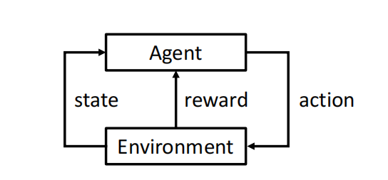
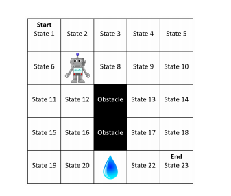
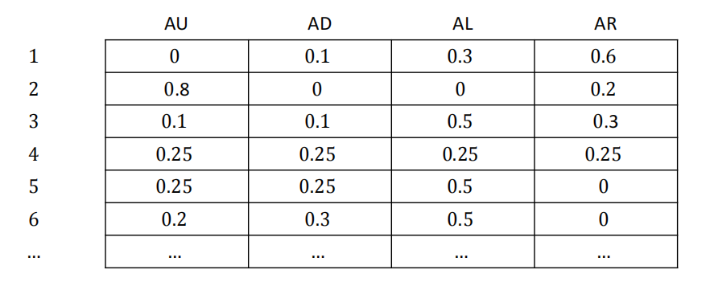
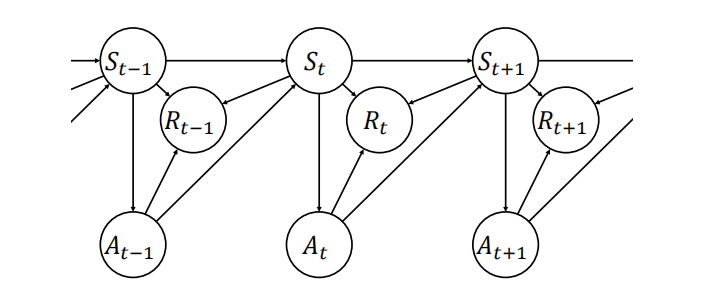
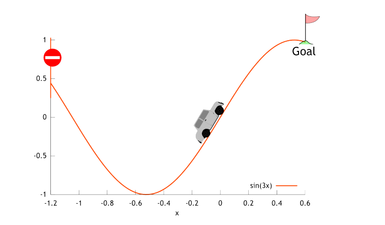
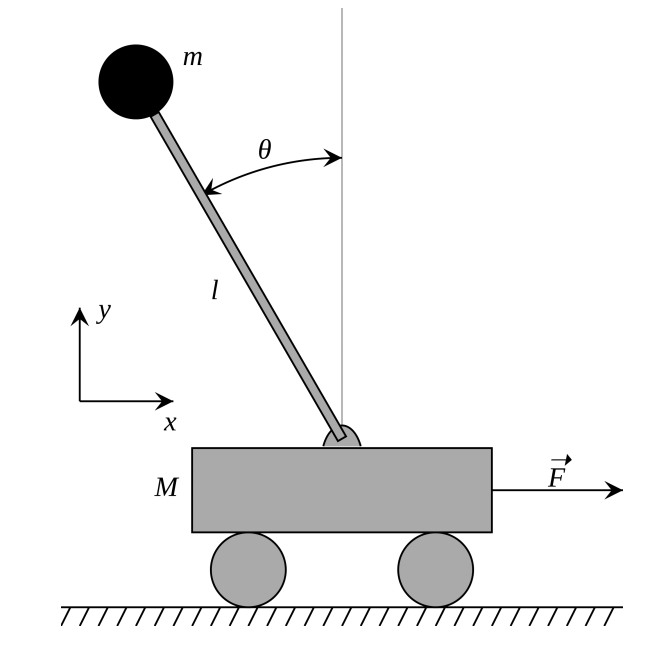

# 马尔科夫决策过程（Markov Decision Process, MDP）

## Reference

- https://people.cs.umass.edu/~bsilva/courses/CMPSCI_687/Fall2022/Lecture_Notes_v1.0_687_F22.pdf

## 1 符号表示

集合用大写花体字母表示（例如，$\mathcal{X}$），集合中的元素用小写字母表示（例如，$x \in \mathcal{X}$），随机变量用大写字母表示（例如，$X$），函数用小写字母表示（例如，$f$）. 但这并非总能做到，因此要留意例外情况. 

$f: \mathcal{X} \to \mathcal{Y}$ 表示 $f$ 是一个定义域为$\mathcal{X}$、值域为 $\mathcal{Y}$ 的函数. 也就是说，它将集合 $\mathcal{X}$ 中的元素作为输入，并产生集合$\mathcal{Y}$中的元素作为输出. 我们用 $|\mathcal{X}|$ 表示集合 $\mathcal{X}$ 的基数，即$\mathcal{X}$中元素的数量，而$|x|$表示$x$的绝对值（因此$|\cdot|$的含义取决于上下文）. 

我们通常用大写字母表示矩阵（例如，$A$），用小写字母表示向量（例如，$b$）. 我们用$A^{\top}$表示$A$的转置. 向量默认为列向量. 除非另有说明，$\|b\|$表示向量$b$的$l^{2}$范数（欧几里得范数）. 

我们用 $\mathbb{N}_{>0}$ 表示不包含零的自然数集，用  $\mathbb{N}_{\geq0}$ 表示包含零的自然数集. 

我们用$:=$表示“被定义为”. 在课堂上，由于手写时三角形符号$\triangleq$更易看清，我们可能会用它来代替$:=$. 

如果对于任意集合 $\mathcal{X}$、$\mathcal{Y}$ 和 $\mathcal{Z}$，有$f: \mathcal{X} \times \mathcal{Y} \to \mathcal{Z}$，那么我们用$f(\cdot, y)$表示一个函数$g: \mathcal{X} \to \mathcal{Z}$，使得对于所有$x \in \mathcal{X}$，都有$g(x) = f(x, y)$. 

我们用花括号表示集合，例如$\{1, 2, 3\}$，用圆括号表示序列和元组，例如$(x_1, x_2, \ldots)$. 

 

## 2 什么是强化学习（RL）？
强化学习是机器学习的一个领域，受行为主义心理学启发，关注智能体如何通过与环境的交互进行学习.

|智能体|状态|奖励|动作|环境|
|----|----|----|----|----|
|示例包括儿童、狗、机器人、程序等|智能体所处状况|衡量动作好坏|智能体选择行为|示例有现实世界、实验室、软件环境等|

评价性反馈：奖励传达的是智能体的动作有多 “好”，而不是最佳动作应该是什么. 如果给智能体提供的是指导性反馈（告知它应该采取什么动作），那这就是一个监督学习问题，而非强化学习问题. 

序列性：必须对整个动作序列进行优化，以使智能体获得的 “总” 奖励最大化. 这可能需要放弃即时奖励，以在稍后获得更大的奖励. 此外，智能体的决策方式（选择动作的方式）会改变其观察到的状态分布. 这意味着强化学习问题不像监督学习那样提供固定的数据集，而是以整个环境的代码或描述的形式呈现. 

神经科学和心理学研究动物如何学习，它们是对某些学习和智能实例的研究. 强化学习则研究如何创建能够学习的智能体，是对学习和智能（包括动物、计算机、理论模型等）的一般性研究. 

有许多其他领域与强化学习相似且相关. 不同的研究领域通常交流较少，导致使用不同的术语和方法. 其他与强化学习相关的重要领域包括运筹学和控制论（经典控制、自适应控制等）. 尽管这些领域与强化学习相似，但它们研究的问题与强化学习的问题往往存在细微但影响重大的差异. 例如，智能体是否先验地知道环境的动态（在强化学习中是不知道的），以及智能体是否会估计环境的动态（许多，但并非所有强化学习智能体不会直接估计环境动态）. 此外，还有许多影响较小的差异，如符号表示的不同（在控制论中，环境被称为 “对象”，智能体被称为 “控制器”，奖励被称为 “负成本”，状态被称为 “反馈” 等）. 

一个常见的误解是，强化学习是监督学习的替代方法，即人们可能会将监督学习问题转化为强化学习问题，以便应用复杂的强化学习方法. 例如，有人可能将状态视为分类器的输入，将动作视为标签，如果标签正确，奖励设为 -1，否则设为1 . 虽然从技术上讲这是可行的，也是强化学习的有效应用，但并不应该这样做. 在某种意义上，强化学习应该是最后的手段，即当监督学习算法无法解决你感兴趣的问题时才使用的工具. 如果你有数据的标签，不要丢弃它们，也不要将指导性反馈（告诉智能体应该给出什么标签）转换为评价性反馈（告诉智能体其判断是否正确）. 强化学习方法可能远不如标准的监督学习算法有效. 然而，如果你遇到的是序列问题，或者只有评价性反馈可用（或两者皆是），那么你无法应用监督学习方法，此时应该使用强化学习. 

## 3 687网格世界：一个简单的环境

状态：机器人的位置. 机器人没有固定的朝向. 

动作：尝试向上、尝试向下、尝试向左、尝试向右. 我们将其缩写为：AU（Attempt Up）、AD（Attempt Down）、AL（Attempt Left）、AR（Attempt Right）. 

环境动态：机器人以0.8的概率向指定方向移动. 以0.05的概率，它会迷失方向，从预期方向向右偏离90度移动（即AU会使机器人向右移动，AL会使机器人向上移动等）. 以0.05的概率，它会向左偏离90度移动（即AU会使机器人向左移动，AL会使机器人向下移动等）. 以0.1的概率，机器人会暂时故障，完全不移动. 如果根据这些动态规则的移动会导致智能体离开网格（例如从状态2向上移动）或撞到障碍物（例如从状态12向右移动），那么智能体就不会移动. 机器人从状态1开始，当到达状态23时，这个过程结束. 机器人没有朝向，其位置仅由状态编号表示. 

奖励：智能体进入有水的状态会得到 -10的奖励，进入目标状态会得到 +10的奖励. 进入其他任何状态奖励为零. 如果智能体处于有水的状态（状态21），且由于任何原因（撞到墙、暂时故障）仍停留在状态21，这将被视为再次 “进入” 水状态，会额外得到 -10的奖励. 我们使用奖励折扣参数（其作用将在后面描述）$\gamma = 0.9$. 

状态数量：稍后我们将描述一个特殊状态$s_{\infty}$，它包含在687网格世界中. 因此，687网格世界实际上有24个状态，而不是23个. 即 $|S| = 24$. 我们后面会讨论这个问题. 

## 4 用数学方法描述环境和智能体

为了对学习进行推理，我们将使用数学方法描述环境（很快也会描述智能体）. 在众多可用于描述环境的数学模型（部分可观测马尔可夫决策过程（POMDPs）、分散式部分可观测马尔可夫决策过程（DEC - POMDPs）、半马尔可夫决策过程（SMDPs）等）中，我们最初将重点关注马尔可夫决策过程（MDPs）. 尽管它们看起来很简单，但我们会发现，它们能够涵盖广泛的实际且有趣的问题，包括一些乍一看似乎超出其范围的问题（例如，智能体使用传感器对状态进行观测，但传感器对状态的描述可能不完整且有噪声的问题）. 此外，一个常见的误解是强化学习仅与马尔可夫决策过程有关. 事实并非如此：马尔可夫决策过程只是形式化强化学习问题环境的一种方式. 
- 马尔可夫决策过程是对环境以及我们希望智能体学习内容的数学规范. 
    - 设$t \in \mathbb{N}_{\geq0}$为时间步（智能体 - 环境循环的迭代次数）. 
    - 设$S_t$为时间$t$时环境的状态. 
    - 设$A_t$为智能体在时间$t$采取的动作. 
    - 设$R_t \in \mathbb{R}$为智能体在时间$t$获得的奖励. 也就是说，当环境状态为$S_t$，智能体采取动作$A_t$，环境转移到状态$S_{t + 1}$时，智能体获得奖励$R_t$. 这与其他一些资料不同，在那些资料中，这个奖励被称为$R_{t + 1}$. 

文献中对马尔可夫决策过程有多种定义，它们有一些共同的术语. 在每种情况下，马尔可夫决策过程都是一个元组. 以下是四个例子：
$$
1. (\mathcal{S}, \mathcal{A}, p, R)
$$

$$
2. (\mathcal{S}, \mathcal{A}, p, R, \gamma)
$$

$$
3. (\mathcal{S}, \mathcal{A}, p, R, d_0, \gamma)
$$

$$
4. (\mathcal{S}, \mathcal{A}, p, d_R, d_0, \gamma)
$$

我们稍后将讨论这些定义之间的差异，但首先让我们定义每个术语. 注意，这些定义中的独特术语有：$\mathcal{S}$、$\mathcal{A}$、$p$、$d_R$、$R$、$d_0$和$\gamma$. 我们在下面分别定义这些术语：
- $\mathcal{S}$是环境所有可能状态的集合. 时间$t$的状态$S_t$始终在$\mathcal{S}$中取值. 目前我们假设$|\mathcal{S}| < \infty$，即状态集是有限的. 我们称$\mathcal{S}$为 “状态集”. 
- $\mathcal{A}$是智能体可以采取的所有可能动作的集合. 时间$t$的动作$A_t$始终在$\mathcal{A}$中取值. 目前我们假设$|\mathcal{A}| < \infty$. 
- $p$称为转移函数，它描述了环境状态如何变化.

$$
p: \mathcal{S} \times \mathcal{A} \times \mathcal{S} \to [0, 1]. 
$$

对于所有$s \in \mathcal{S}$，$a \in \mathcal{A}$，$s' \in \mathcal{S}$和$t \in \mathbb{N}_{\geq0}$，有

$$
p(s, a, s') := \text{Pr}(S_{t + 1} = s' | S_t = s, A_t = a). 
$$

此后，在写量词（如$\exists$和$\forall$）时，我们会省略集合，因为从上下文应该可以清楚地知道这些集合. 如果对于所有的$s$、$a$和$s'$，都有$p(s, a, s') \in \{0, 1\}$，我们就说转移函数是确定性的. 
- $d_R$描述了奖励是如何生成的. 直观地说，它是在给定$S_t$、$A_t$和$S_{t + 1}$的情况下，$R_t$的条件分布. 即$R_t \sim d_R(S_t, A_t, S_{t + 1})$. 目前我们假设奖励是有界的，即对于所有$t \in \mathbb{N}_{\geq0}$和某个常数$R_{max} \in \mathbb{R}$，都有$|R_t| \leq R_{max}$. 
- $R$是一个称为奖励函数的函数，它由$d_R$隐式定义. 其他资料通常将马尔可夫决策过程定义为包含$R$而不是$d_R$. 形式上，

$$
R: \mathcal{S} \times \mathcal{A} \to \mathbb{R}, 
$$

并且

$$
R(s, a) := \mathbb{E}[R_t | S_t = s, A_t = a], 
$$

对于所有的$s$、$a$和$t$都成立. 虽然奖励函数$R$并没有精确地定义奖励$R_t$是如何生成的（因此，用$R$代替$d_R$来定义马尔可夫决策过程在某种程度上是不完整的），但通常它对于推断智能体应该如何行动已经足够了. 注意，尽管$R$是一个函数，但它用大写字母表示. 这是由于长期以来的符号使用习惯，并且我们稍后在写$(s, a, r, s', a')$时，会用$r$表示特定的奖励. 
- $d_0$是初始状态分布：

$$
d_0: \mathcal{S} \to [0, 1], 
$$

并且对于所有的$s$，有

$$
d_0(s) = \text{Pr}(S_0 = s). 
$$

- $\gamma \in [0, 1]$是一个称为奖励折扣参数的参数，我们稍后会讨论它. 

现在回想一下我们之前列出的四种常见的马尔可夫决策过程定义方式. 这些不同的定义在对环境的定义精确程度上有所不同. 定义$(\mathcal{S}, \mathcal{A}, p, R, \gamma)$包含了我们推断智能体最优行为所需的所有术语. 定义$(\mathcal{S}, \mathcal{A}, p, R)$实际上也包含了$\gamma$，只是它将其隐含了起来. 也就是说，这个定义假设$\gamma$仍然存在，但没有将其作为马尔可夫决策过程定义中的一个术语明确写出. 在另一个极端，定义$(\mathcal{S}, \mathcal{A}, p, d_R, d_0, \gamma)$则完整地指定了环境的行为方式. 

当考虑包含$d_R$而不是$R$时，这种区别最为明显. 正如我们稍后将看到的，$R$所描述的预期奖励对于推断什么行为是最优的已经足够了. 然而，为了完整地描述环境中奖励是如何生成的，我们必须指定$d_R$. 

正如我们用数学方法定义了环境一样，现在我们也用数学方法定义智能体. 策略是一种决策规则，即智能体选择动作的方式. 形式上，策略$\pi$是一个函数：

$$
\pi: \mathcal{S} \times \mathcal{A} \to [0, 1], 
$$

并且对于所有的$s \in \mathcal{S}$，$a \in \mathcal{A}$和$t \in \mathbb{N}_{\geq0}$，有

$$
\pi(s, a) := \text{Pr}(A_t = a | S_t = s). 
$$

因此，策略是在给定状态下动作的条件分布. 也就是说，$\pi$不是一个单一的分布，而是一组关于动作集的分布，每个状态对应一个分布. 可能的策略有无穷多个，但确定性策略（对于所有的$s$和$a$，$\pi(s, a) \in \{0, 1\}$的策略）的数量是有限的. 我们用$\Pi$表示所有策略的集合. 下图展示了687网格世界的一个策略示例，每个单元格表示在每个状态（由行指定）下执行动作（由列指定）的概率. 在这种格式下，Π是所有具有非负项且行和为1的 $|S|×|A|$ 矩阵的集合

到目前为止，总结如下，智能体与环境之间的交互过程如下（其中 $R_{t} \sim d_{R}(S_{t}, A_{t}, S_{t + 1})$ 表示 $R_{t}$ 是根据 $d_{R}$ 进行采样的）：

$$
S_{0} \sim d_{0} \\
A_{0} \sim \pi(S_{0}, \cdot) \\
S_{1} \sim p(S_{0}, A_{0}, \cdot) \\
R_{0} \sim d_{R}(S_{0}, A_{0}, S_{1})\\
A_{1} \sim \pi(S_{1}, \cdot) \\
S_{2} \sim p(S_{1}, A_{1}, \cdot) \\
... \\
$$

用伪代码表示为：
**算法1：智能体 - 环境交互的一般流程**
- $S_0 \sim d_0$ ;
- $\text{for }  t = 0  \text{ to }  \infty  \text{ do}$
    - $A_t \sim \pi(S_t, \cdot)$ ;
    - $S_{t + 1} \sim p(S_t, A_t, \cdot)$ ;
    - $R_t \sim d_R(S_t, A_t, S_t + 1)$ ;

马尔可夫决策过程的运行过程也可以用下图中的贝叶斯网络来表示. 

注意，我们将 $R_{0}$ 定义为第一个奖励，而Sutton和Barto（1998）将 $R_{1}$ 定义为第一个奖励. 我们这样做是因为 $S_{0}$ 、 $A_{0}$ 和 $t = 0$ 分别是第一个状态、动作和时间，所以将 $R_{1}$ 作为第一个奖励会不一致. 此外，这样能使后续的索引更匹配. 然而，在将课程笔记与书中内容进行比较时，一定要注意这个符号差异. 

智能体的目标：找到一个策略 $\pi^{*}$ ，称为最优策略. 直观地说，最优策略能使智能体获得的预期总奖励最大化. 

目标函数： $J: \Pi \to \mathbb{R}$ ，对于所有 $\pi \in \Pi$ ，有

$$
\begin{equation}
J(\pi) := \mathbb{E}\left[\sum_{t = 0}^{\infty} R_{t} | \pi\right].
\label{eq:objective_d1}
\end{equation}
$$

注意：稍后我们会修改这个定义——如果你只是浏览寻找 $J$ 的正确定义，它在公式(18)中. 

注意：期望和概率可以基于事件进行条件设定. 策略 $\pi$ 不是一个事件. 在目标函数 $J$ 的定义中，像 $|\pi$ 这样基于 $\pi$ 进行条件设定，表示所有动作（其分布或取值在其他地方未明确指定）都是根据 $\pi$ 进行采样的. 也就是说，对于所有 $t \in \mathbb{N}_{\geq0}$ ， $A_{t} \sim \pi(S_{t}, \cdot)$ . 

最优策略：最优策略 $\pi^{*}$ 是满足以下条件的任何策略：

$$
\begin{equation}
\pi^{*} \in \underset{\pi \in \Pi}{\text{arg max}} J(\pi).
\label{eq:optpolicy}
\end{equation}
$$

注意：在后面我们会用不同且更严格的方式定义最优策略. 

奖励折扣：如果你可以选择今天得到一块饼干，或者在课程最后一天得到两块饼干，你会选哪个？当人们实际面临这些选择时，很多人会选择今天的一块饼干. 这表明，对我们来说，在遥远未来获得的奖励比近期获得的奖励价值更低. 奖励折扣参数 $\gamma$ 使我们能够在目标函数中，根据奖励在未来的远近对其进行折扣. 

回想一下 $\gamma \in [0, 1]$ . 我们重新定义目标函数 $J$ 为：

$$
\begin{equation}
J(\pi) := \mathbb{E}\left[\sum_{t = 0}^{\infty} \gamma^{t} R_{t} | \pi\right],
\label{eq:objective_d2}
\end{equation}
$$

对于所有 $\pi \in \Pi$ . 所以， $\gamma < 1$ 意味着较晚出现的奖励对智能体的价值更低——未来 $t$ 个时间步的奖励 $r$ 的效用为 $\gamma^{t}r$ . 引入 $\gamma$ 还能确保 $J(\pi)$ 是有界的，并且稍后我们会看到，较小的 $\gamma$ 值会使马尔可夫决策过程更容易求解（求解马尔可夫决策过程指的是找到或近似找到一个最优策略）. 

总之，智能体的目标是使用包含奖励折扣的 $J$ 的定义 $\eqref{eq:objective_d2}$，找到（或近似找到）如 $\eqref{eq:optpolicy}$ 所定义的最优策略 $\pi^{*}$  . 

**性质1（最优策略的存在性）**：如果 $|\mathcal{S}| < \infty$ ， $|\mathcal{A}| < \infty$ ， $R_{max} < \infty$ 且 $\gamma < 1$ ，那么最优策略存在. 

我们稍后会证明性质1. 

当我们介绍687网格世界时，我们说当智能体到达状态23（我们称之为目标状态）时，智能体 - 环境交互就会终止. 这种终止状态的概念可以用我们上面定义的马尔可夫决策过程来编码. 具体来说，我们将终止状态定义为任何可以转移到一个特殊状态 $s_{\infty}$ （称为终止吸收状态）的状态. 一旦进入 $s_{\infty}$ ，智能体就永远无法离开（ $s_{\infty}$ 是吸收态）——智能体会永远从 $s_{\infty}$ 转移回 $s_{\infty}$  . 从 $s_{\infty}$ 转移到 $s_{\infty}$ 总是会得到零奖励. 实际上，当智能体进入终止状态时，这个过程就结束了. 没有更多的决策需要做出（因为所有动作都有相同的结果），也没有更多的奖励可以收集. 因此，当智能体进入 $s_{\infty}$ 时，一个情节（episode）就终止了. 注意，终止状态是可选的——马尔可夫决策过程不一定有任何终止状态. 此外，可能存在一些状态只是有时会转移到 $s_{\infty}$ ，我们不把这些状态称为终止状态. 还要注意， $s_{\infty}$ 是 $\mathcal{S}$ 的一个元素. 根据我们对马尔可夫决策过程的定义，这意味着智能体在 $s_{\infty}$ 中也会选择动作. 最后，虽然定义了终止状态，但没有定义目标状态——687网格世界中的目标概念只是为了我们的直观理解. 

当智能体到达 $s_{\infty}$ 时，当前的试验（称为一个情节）结束，一个新的情节开始. 这意味着时间 $t$ 重置为零，从初始状态分布 $d_{0}$ 中采样初始状态 $S_{0}$ ，然后下一个情节开始（智能体选择 $A_{0}$ ，获得奖励 $R_{0}$ 并转移到状态 $S_{1}$  ）. 智能体会收到这个事件的通知，因为这种重置可能会改变它的行为（例如，它可能会清除某种短期记忆）. 

对于687网格世界，我们假设 $s_{\infty} \in \mathcal{S}$ ，并且状态23总是以零奖励转移到 $s_{\infty}$  . 因此，687网格世界有24个状态. 

## 5 创建马尔可夫决策过程
你可能会想：谁来定义 $R_{t}$ 呢？答案取决于你如何使用强化学习. 如果你使用强化学习来解决一个特定的现实世界问题，那么由你来定义 $R_{t}$ ，以使智能体产生你想要的行为. 众所周知，人类在定义能使最优行为符合预期的奖励方面表现不佳. 通常，你可能会发现，你定义奖励以产生期望的行为，训练智能体后却认为智能体失败了，然后才意识到智能体通过一种意想不到的方式最大化了预期折扣回报，但其行为并非你想要的. 

考虑这样一个例子，你想给一个强化学习智能体（用狗来代表）奖励，让它沿着人行道走到一扇门前（到达门处情节结束），同时避开花坛：你要如何给各个状态分配奖励，才能让狗走到门前呢？在这个例子中，人们常常以一种会导致不良行为的方式分配奖励. 一个错误做法是，给在人行道上行走赋予正奖励——在这种情况下，智能体就会学会在人行道上来回走动以获取越来越多的奖励，而不是走到门前结束情节. 在这个例子中，正确的做法是在花坛上设置负奖励，在门前设置正奖励，这样才能产生最优行为. 

这为设计奖励提供了一个通用的经验法则：为你希望智能体实现的目标给予奖励，而不是为你认为智能体应该如何实现目标给予奖励. 那些帮助智能体快速识别最优行为的奖励与所谓的“奖励塑造”有关，我们稍后会讨论这个概念. 如果设计得当，奖励塑造不会改变最优策略. 然而，当我们随意设置奖励塑造（比如在上述例子中给人行道状态设置一个正的常数奖励）时，它们往往会以一种不良的方式改变最优行为. 

回到前面的问题：谁来定义 $R_{t}$ 呢？到目前为止，我们讨论了在将强化学习应用于问题时，你可以如何选择 $R_{t}$  . 有时，人们研究强化学习是为了深入了解动物行为. 在这种情况下，奖励是由进化产生的. 本学期晚些时候，我们可能会邀请Andy Barto来做关于这个主题的客座讲座. 目前，简单概述如下：在动物/心理学/神经科学的背景下，奖励指的是给予智能体的能带来愉悦感的东西，比如食物. 这在动物大脑中会转化为一个奖励信号. 例如，这个奖励信号可能对应于特定神经元的放电或特定神经递质的释放. 按照这个术语，我们的 $R_{t}$ 对应于动物大脑中的奖励信号，而不是奖励本身（比如一块饼干）. 有某个函数定义了当智能体获得奖励时，大脑中奖励信号是如何产生的，这个函数是由进化选择（如果你愿意，也可以说是学习）而来的. 如果你熟悉神经递质多巴胺，从这个讨论来看，多巴胺似乎对应于 $R_{t}$ ——但稍后我们会论证，多巴胺并不对应于 $R_{t}$ ，而是对应于预测奖励总和的统计误差. 

## 6 规划与强化学习
再次考虑强化学习的定义. 注意其中“通过与环境的交互进行学习”这一部分. 如果转移函数 $p$ 和奖励函数 $R$ （或 $d_{R}$ ）是已知的，那么智能体就不需要与环境进行交互. 例如，一个解决687网格世界问题的智能体可以在头脑中进行规划，制定出最优策略，然后从一开始就执行这个最优策略. 这不是强化学习，而是规划. 更具体地说，在规划问题中， $p$ 和 $R$ 是已知的，而在强化学习问题中，至少转移函数 $p$ （通常奖励函数 $R$ 也是）对智能体来说是未知的. 相反，智能体必须通过与环境交互来学习——采取不同的动作并观察结果. 大多数强化学习算法不会估计转移函数 $p$  . 因为环境通常过于复杂，难以很好地建模，而且对 $p$ 的估计中出现的小误差会在多个时间步中累积，使得基于 $p$ 的估计所制定的计划不可靠. 我们稍后会进一步讨论这个问题. 

## 7 其他术语和一些例子
 - **历史（History）**： $H_{t}$ 记录了在一个情节中直到时间 $t$ 发生的所有事情：
$$H_{t} := (S_{0}, A_{0}, R_{0}, S_{1}, A_{1}, R_{1}, S_{2}, \ldots, S_{t}, A_{t}, R_{t}). (20)$$
 - **轨迹（Trajectory）**：是一个完整情节的历史，即 $H_{\infty}$ . 
 - 轨迹的回报（Return）或折扣回报（Discounted Return）是奖励的折扣总和： $G := \sum_{t = 0}^{\infty} \gamma^{t} R_{t}$  . 所以，目标函数 $J$ 是期望回报或期望折扣回报，可以写成 $J(\pi) := \mathbb{E}[G | \pi]$  . 
 - **从时间 $t$ 开始的回报**或**从时间 $t$ 开始的折扣回报**， $G_{t}$ ，是从时间 $t$ 开始的奖励的折扣总和：
$$G_{t} := \sum_{k = 0}^{\infty} \gamma^{k} R_{t + k}$$

### 7.1 示例领域：山地车
强化学习中所研究的环境常被称作领域（Domain）. 其中，山地车领域是极为常见的一个. 在该领域里，智能体操控着一辆近似汽车的载具. 汽车被困于山谷之中，而智能体的目标是驶向汽车前方的山顶. 不过，汽车的动力不足以直接开上前方的山坡，所以它必须先学会倒车爬上后方的山坡，再加速向前冲，才能爬上前方的山坡. 下图展示了山地车环境的示意图. 

- **状态**：$s = (x, v)$，其中$x \in \mathbb{R}$代表汽车的位置，$v \in \mathbb{R}$表示汽车的速度. 
- **动作**：$a \in \{\text{倒车}, \text{空挡}, \text{前进}\}$，这些动作分别对应数值$a \in \{-1, 0, 1\}$. 
- **动态**：该领域的动态是确定性的，即在状态$s$下执行动作$a$，总会产生相同的状态$s'$，因此$p(s, a, s') \in \{0, 1\}$ . 其动态变化由以下公式确定：

$$
v_{t + 1} = v_{t} + 0.001a_{t} - 0.0025\cos(3x_{t}) $$

$$
x_{t + 1} = x_{t} + v_{t + 1} 
$$

计算得到下一个状态$s' = [x_{t + 1}, v_{t + 1}]$后，$x_{t + 1}$的值会被限制在闭区间$[-1.2, 0.5]$内，$v_{t + 1}$的值会被限制在闭区间$[-0.7, 0.7]$内. 若$x_{t + 1}$到达左边界（即汽车位于$x_{t + 1} = -1.2$处），或者到达右边界（即汽车位于$x_{t + 1} = 0.5$处），汽车的速度将重置为零，即$v_{t + 1} = 0$ ，以此模拟汽车与 -1.2和0.5位置处墙壁的非弹性碰撞. 
- **终止状态**：当$x_{t} = 0.5$时，该状态即为终止状态（它总是会转移到$s_{\infty}$ ）. 
- **奖励**：除了转移到$s_{\infty}$（从$s_{\infty}$或其他终止状态转移时）奖励$R_{t} = 0$外，其余情况下$R_{t}$恒为 -1. 
- **折扣**：$\gamma = 1.0$ . 
- **初始状态**：$S_{0} = (X_{0}, 0)$，其中$x_{0}$是从区间$[-0.6, -0.4]$中均匀随机抽取的初始位置. 

### 7.2 马尔可夫性质
对于转移函数而言，一种看似更具一般性的非马尔可夫表述如下：

$$
p(h, s, a, s') := \text{Pr}(S_{t + 1} = s' | H_{t - 1} = h, S_{t} = s, A_{t} = a) 
$$

马尔可夫假设指的是，在给定$S_{t}$的条件下，$S_{t + 1}$与$H_{t - 1}$相互独立，即在给定当前状态及所有过去状态时，未来状态的条件概率分布仅依赖于当前状态，与该过程的历史路径条件独立. 也就是说，对于所有的$h$、$s$、$a$、$s'$、$t$ ：
$$ 
\text{Pr}(S_{t + 1} = s' | H_{t - 1} = h, S_{t} = s, A_{t} = a) = \text{Pr}(S_{t + 1} = s' | S_{t} = s, A_{t} = a) 
$$

由于我们采用了这个马尔可夫假设，前面定义的 $p$ 就完整刻画了环境的转移动态，也就不再需要公式(23)中的替代定义了. 马尔可夫假设有时也被称为马尔可夫性质（比如，人们通常会说某个领域具有马尔可夫性质，而非满足马尔可夫假设）. 通俗来讲，它可以表述为：给定当前状态，未来状态与过去状态无关. 

我们还假定奖励也具有马尔可夫性，即在给定$S_{t}$的条件下，$R_{t}$与$H_{t - 1}$相互独立（因为$A_{t}$仅取决于$S_{t}$，所以这等价于假定在给定$S_{t}$和$A_{t}$的条件下，$R_{t}$与$H_{t - 1}$相互独立）. 

前面的马尔可夫假设针对的是环境（并且是环境的马尔可夫决策过程（MDP）表述中的固有假设），我们对智能体也做出了一个额外的马尔可夫假设：智能体的策略具有马尔可夫性. 即，在给定$S_{t}$的条件下，$A_{t}$与$H_{t - 1}$相互独立. 
 

需要注意的是，我们总能定义出一种具有马尔可夫性的状态表示. 假设$S_{t}$是一种非马尔可夫状态表示，那么$(S_{t}, H_{t - 1})$就是一种马尔可夫状态表示. 也就是说，我们可以将历史信息融入状态中，以此来满足马尔可夫性质. 不过，这种做法通常并不可取，因为状态集的规模会随着最大情节长度呈指数级增长（最大情节长度这个概念会在后面详细讨论）. 这种向状态中添加信息的技巧被称为状态扩充. 

在状态、状态表示和马尔可夫性质相关的术语方面，人们常常会产生混淆. 马尔可夫决策过程（以及其他类似的形式，如部分可观测马尔可夫决策过程（POMDPs）、分散式部分可观测马尔可夫决策过程（DEC - POMDPs）、半马尔可夫决策过程（SMDPs）等）中的状态定义，都应当满足马尔可夫性质. 后续，我们会探讨非马尔可夫状态表示，以便对智能体只能对环境状态进行部分观测或观测存在噪声的情况进行建模. 

### 7.3 平稳性与非平稳性
我们假定环境的动态是平稳的. 这意味着环境的动态在不同情节之间不会发生变化，并且在同一情节内，转移函数也保持不变. 具体来说，对于所有情节，$\text{Pr}(S_{0} = s)$的值都是相同的，而且对于所有的$s$、$a$、$t$和$i$ ：
$$\text{Pr}(S_{t + 1} = s' | S_{t} = s, A_{t} = a) = \text{Pr}(S_{i + 1} = s' | S_{i} = s, A_{i} = a)$$
需要重点指出的是，这里的$t$和$i$可以来自不同的情节. 

在实际问题中，这个假设往往并不成立. 例如，在运用强化学习来控制汽车时，我们可能没有考虑到汽车部件（如轮胎）的磨损会使汽车的动态在不同驾驶过程中发生改变. 在利用强化学习优化广告投放选择时，一周中的不同日期、一天中的不同时段，甚至不同季节，都会对人们对广告的接受程度产生显著影响. 根据问题被建模为强化学习问题的具体方式，这些因素可能会表现为非平稳性. 

尽管这个假设在实际应用中几乎总是被采用，但又几乎总是不符合实际情况，我们通常会为采用这个假设进行辩解，认为有必要做出类似的假设. 正是因为有了这个假设，我们才能够依据过去的数据来指导未来的决策. 如果没有任何假设表明未来与过去存在相似性，我们就无法借助数据来优化未来的决策. 当然，也存在比平稳性更弱的假设（例如，有少量研究关注如何处理系统动态中的少量有限跳跃或缓慢连续变化的情况）. 

我们还假设奖励是平稳的（即从状态$s$执行动作$a$并转移到状态$s'$所获得的奖励分布，与时间步和情节编号无关）. 不过，通常情况下我们认为策略$\pi$是非平稳的. 这是因为学习意味着在情节内以及不同情节间对策略进行调整（理想情况下是优化）. 平稳策略有时也被称作固定策略. 

人们常常认为，可以通过在状态中添加额外信息来“解决”非平稳性问题. 虽然这种方法确实能解决转移函数$p$的非平稳问题，但实际上只是将问题转移到了初始状态分布$d_{0}$上. 例如，还是以山地车领域为例，假设汽车由于磨损，动力会随时间逐渐衰减（比如轮胎花纹磨损）. 我们可以将轮胎当前的磨损情况纳入状态中. 这样做虽然能使转移函数变得平稳，但初始状态分布必然会变得非平稳，因为轮胎的初始磨损程度在不同情节中肯定会不断增加. 

### 7.4 平衡杆（Cart - Pole Balancing）
这个领域还有杆平衡（Pole Balancing）、推车杆（Cart - Pole）和倒立摆（Inverted Pendulum）等别称. 该领域模拟的是一根杆在推车上保持平衡的场景，如下图所示. 智能体需要学会前后移动推车，以防止杆倒下. 

- **状态**：$s = (x, v, \theta, \dot{\theta})$，其中$x$表示推车的水平位置，$\theta$是杆的角度，$\dot{\theta}$是杆的角速度. 
- **动作**：$A = \{\text{向左}, \text{向右}\}$ ，$R_{t}$始终为$1$ . 
- $\gamma = 1$. 
- $S_{0} = (0, 0, 0, 0)$始终保持不变. 
- **动态**：由系统的物理原理决定. 具体推导过程可查阅Florian（2007）的研究. 该领域最早是由Barto等人（1983）提出的. 不过，在他们最初的研究中，重力方向设定错误，是将杆向上拉而不是向下拉. 安迪表示，他们在代码中使用的是正确的重力方向. 
- **情节终止条件**：当持续时间达到20秒，或者杆倒下（杆的角度绝对值大于或等于$\frac{\pi}{15}$弧度）时，情节终止. 时间以$\Delta t = 0.02$秒为步长进行模拟. 

### 7.5 有限时域马尔可夫决策过程
马尔可夫决策过程的时域$L$是满足以下条件的最小整数：

$$
\forall t \geq L, \text{Pr}(S_{t} = s_{\infty}) = 1 
$$

如果对于所有策略，$L < \infty$ ，我们就称这个马尔可夫决策过程是有限时域的. 若$L = \infty$，那么该领域可能是无限时域或不确定时域的. 不确定时域的马尔可夫决策过程指的是$L = \infty$，但智能体最终一定会进入$s_{\infty}$的情况. 比如，智能体从每个状态以0.5的概率转移到$s_{\infty}$的马尔可夫决策过程就属于不确定时域. 而无限时域的马尔可夫决策过程则是指智能体有可能永远不会进入$s_{\infty}$的情况. 

对于平衡杆领域，我们如何在转移函数$p$中实现必须在20秒后转移到$s_{\infty}$这一要求呢？我们通过扩充状态来包含当前时间实现这一点. 即，状态变为$(s, t)$，其中$s$是之前定义的平衡杆状态，$t$是当前时间步. 转移函数$p$会在每个时间步使$t$增加，当$t$增加到$\frac{20}{\Delta t} = 1000$时，就会转移到$S_{\infty}$ . 所以，平衡杆的实际状态是$s = (x, v, \theta, \dot{\theta}, t)$. 通常，对$t$的依赖是隐含的，我们会写成$s = (x, v, \theta, \dot{\theta})$，并表示该领域是有限时域的. 

### 7.6 部分可观测性
在许多实际问题中，智能体并不知道环境的真实状态，它只能对状态进行观测. 而且这些观测可能存在噪声，也可能是不完整的. 我们将在课程后续内容中讨论这个问题.  
