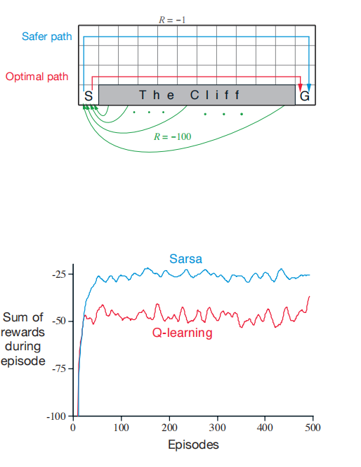
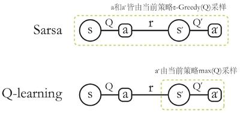

# 时序差分（TD）学习: Sarsa, Q learning

## Reference

- http://incompleteideas.net/book/RLbook2018.pdf
- https://people.cs.umass.edu/~bsilva/courses/CMPSCI_687/Fall2022/Lecture_Notes_v1.0_687_F22.pdf

如果非要找出一个在强化学习中处于核心且新颖的概念，那无疑是时序差分（TD）学习. TD学习融合了蒙特卡罗方法和动态规划（DP）的思想. 与蒙特卡罗方法一样，TD方法无需了解环境动态模型，就能直接从原始经验中学习. 和DP类似，TD方法部分地基于其他已学习的估计值来更新估值，而无需等待最终结果（它们采用自举法）. TD、DP和蒙特卡罗方法之间的关系，是强化学习理论中反复出现的主题；后续会引入TD($\lambda$)算法，它将TD和蒙特卡罗方法无缝统一. 

和往常一样，我们首先聚焦于策略评估或预测问题，即对于给定策略$\pi$，估计值函数$v_{\pi}$的问题. 对于控制问题（寻找最优策略），DP、TD和蒙特卡罗方法都采用了广义策略迭代（GPI）的某种变体. 这些方法的差异，主要体现在解决预测问题的方式上. 

## 1 TD预测

TD和蒙特卡罗方法都利用经验来解决预测问题. 在遵循策略 $\pi$ 获得一些经验后，两种方法都会针对该经验中出现的非终止状态 $S_{t}$，更新其对 $v^{\pi}$ 的估计值 $V$. 大致来说，蒙特卡罗方法会一直等到访问后的回报确定后，才将该回报作为 $V(S_{t})$ 的目标值. 一种适用于非平稳环境的简单的每次访问蒙特卡罗方法为：

$$
V\left(S_{t}\right) \leftarrow V\left(S_{t}\right)+\alpha\left[G_{t}-V\left(S_{t}\right)\right]
$$

其中，$G_{t}$ 是时间t之后的实际回报，$\alpha$ 是一个固定的步长参数. 我们将这种方法称为固定 $\alpha$ 的MC方法. 蒙特卡罗方法必须等到一个episode结束，才能确定 $V(S_{t})$ 的增量（只有那时 $G_{t}$ 才已知），而TD方法只需等到下一个时间步. 在时间 $t + 1$ 时，它们立即根据观察到的奖励 $R_{t+1}$ 和估计值 $V(S_{t+1})$，形成一个目标值并进行有效的更新. 最简单的TD方法在转移到 $S_{t+1}$ 并收到 $R_{t+1}$ 后，立即进行如下更新：

$$
V\left(S_{t}\right) \leftarrow V\left(S_{t}\right)+\alpha\left[R_{t+1}+\gamma V\left(S_{t+1}\right)-V\left(S_{t}\right)\right]
$$

实际上，蒙特卡罗更新的目标值是 $G_{t}$，而TD更新的目标值是 $R_{t+1}+\gamma V(S_{t+1})$. 这种TD方法被称为 $\text{TD}(0)$，即一步TD.

### 用于估计 $v^{\pi}$ 的表格型 $\text{TD}(0)$ 算法

- **输入**：待评估的策略$\pi$
- **算法参数**：步长$\alpha\in(0, 1]$
- **初始化**：对所有$s \in S^+$，任意初始化$V(s)$，但$V(终止状态)=0$
- **循环（针对每个episode）**：
    - 初始化状态$S$
    - **循环（针对episode的每一步）**：
        - 根据策略$\pi$，在状态$S$下选择动作$A$
        - 执行动作$A$，观察奖励$R$和下一个状态$S'$
        - $V(S) \leftarrow V(S)+\alpha[R+\gamma V(S') - V(S)]$
        - $S \leftarrow S'$
    - **直到**：$S$为终止状态

外层循环负责像 MCM 一样收集完整经验样本，内层循环负责像 DP 一样用已有估计值更新策略. 

因为 $\text{TD}(0)$ 的更新部分基于现有估计值，所以我们说它和DP一样，是一种自举法. 我们知道：

$$
\begin{align}
v^{\pi}(s) & := \mathbb{E}_{\pi}\left[G_{t} | S_{t}=s\right] \label{eq:MC} \\ & =\mathbb{E}_{\pi}\left[R_{t+1}+\gamma G_{t+1} | S_{t}=s\right] \notag \\ & =\mathbb{E}_{\pi}\left[R_{t+1}+\gamma v^{\pi}\left(S_{t+1}\right) | S_{t}=s\right] \label{eq:TD0}.  
\end{align}
$$

大致来说，蒙特卡罗方法用公式 $\eqref{eq:MC}$ 的估计值作为目标值，而DP方法用公式 $\eqref{eq:TD0}$ 的估计值作为目标值. 蒙特卡罗方法的目标值是一个估计值，因为公式 $\eqref{eq:MC}$ 中的期望值是未知的，它用一个样本回报来代替真实的期望回报. DP方法的目标值是估计值，不是因为期望值（假设环境模型能完全提供这些期望值），而是因为$v^{\pi}(S_{t+1})$是未知的，它使用当前估计值$V(S_{t+1})$来代替. TD方法的目标值是估计值，原因有两个：它对公式 $\eqref{eq:TD0}$ 中的期望值进行采样，并且使用当前估计值$V$而不是真实的$v^{\pi}$. 因此，TD方法结合了蒙特卡罗方法的采样和DP方法的自举法. 正如我们将看到的，通过谨慎思考和发挥想象力，这能让我们在获得蒙特卡罗和DP方法的优势方面取得很大进展. 

最后，注意 $\text{TD(0)}$ 更新公式中括号内的量是一种误差，它衡量了$S_{t}$的估计值与更好的估计值$R_{t+1}+\gamma V(S_{t+1})$之间的差异. 这个量被称为TD误差，在整个强化学习中以各种形式出现：

$$
\delta_{t} := R_{t+1}+\gamma V\left(S_{t+1}\right)-V\left(S_{t}\right)
$$

注意，每个时刻的TD误差是该时刻估计值的误差. 由于TD误差取决于下一个状态和下一个奖励，实际上直到下一个时间步它才可用. 也就是说，$\delta_{t}$是$V(S_{t})$的误差，在时间$t + 1$时可用. 还要注意，如果数组$V$在episode中不发生变化（蒙特卡罗方法中就是如此），那么蒙特卡罗误差可以写成TD误差的和：

$$
\begin{aligned} G_{t}-V\left(S_{t}\right) & =R_{t+1}+\gamma G_{t+1}-V\left(S_{t}\right)+\gamma V\left(S_{t+1}\right)-\gamma V\left(S_{t+1}\right)  \\ & =\delta_{t}+\gamma\left(G_{t+1}-V\left(S_{t+1}\right)\right) \\ & =\delta_{t}+\gamma \delta_{t+1}+\gamma^{2}\left(G_{t+2}-V\left(S_{t+2}\right)\right) \\ & =\delta_{t}+\gamma \delta_{t+1}+\gamma^{2} \delta_{t+2}+\cdots+\gamma^{T-t-1} \delta_{T-1}+\gamma^{T-t}\left(G_{T}-V\left(S_{T}\right)\right) \\ & =\delta_{t}+\gamma \delta_{t+1}+\gamma^{2} \delta_{t+2}+\cdots+\gamma^{T-t-1} \delta_{T-1}+\gamma^{T-t}(0 - 0) \\ & =\sum_{k=t}^{T-1} \gamma^{k-t} \delta_{k} \end{aligned}
$$

如果 $V$ 在episode中发生更新（如在 $\text{TD(0)}$ 中），这个等式就不精确了，但如果步长很小，它仍然可以近似成立. 这个等式的推广在时序差分学习的理论和算法中起着重要作用. 

## 2 TD预测方法的优势

TD方法部分地基于其他估计值来更新自己的估计值. 它们从一个猜测学习另一个猜测——它们进行自举. 这是一件好事吗？TD方法相对于蒙特卡罗和DP方法有哪些优势呢？提出并回答这些问题将贯穿本书以及更多的研究. 在本节中，我们简要地预先给出一些答案. 

显然，TD方法相对于DP方法的一个优势在于，它不需要环境模型，即不需要知道奖励和下一个状态的概率分布. 

TD方法相对于蒙特卡罗方法的另一个明显优势是，它自然地以在线、完全增量的方式实现. 使用蒙特卡罗方法时，必须等到一个episode结束，因为只有那时回报才已知，而使用TD方法时，只需要等待一个时间步. 令人惊讶的是，这往往是一个关键的考虑因素. 一些应用场景中的episode非常长，以至于将所有学习都推迟到episode结束时进行会太慢. 其他应用场景是持续进行的任务，根本没有episode之分. 最后，正如我们在上一章提到的，一些蒙特卡罗方法必须忽略或折扣采取实验性行动的episode，这会大大减慢学习速度. TD方法受这些问题的影响要小得多，因为无论后续采取什么行动，它都能从每个转移中学习. 

但是TD方法可靠吗？当然，不等待实际结果，直接从下一个猜测学习当前猜测是很方便的，但我们还能保证收敛到正确答案吗？令人高兴的是，答案是肯定的. 对于任何固定的策略 $\pi$，已经证明 $\text{TD(0)}$ 会收敛到$v^{\pi}$：如果步长参数足够小，它在均值意义下收敛；如果步长参数按照通常的随机逼近条件递减，它以概率1收敛. 大多数收敛性证明只适用于上述基于表格的算法，但也有一些证明适用于一般的线性函数逼近情况.

如果TD和蒙特卡罗方法都渐近收敛到正确的预测，那么下一个自然的问题是 “哪个收敛得更快？” 换句话说，哪种方法学习得更快？哪种方法能更有效地利用有限的数据？目前，这还是一个开放性问题，因为还没有人能够从数学上证明一种方法比另一种方法收敛得更快. 事实上，甚至都不清楚用什么最恰当的形式来表述这个问题！然而，在实践中，人们通常发现，在随机任务上，TD方法比固定 $\alpha$ 的MC方法收敛得更快.

## 3 Sarsa：在线策略TD控制

现在我们转向将TD预测方法用于控制问题. 和往常一样，我们遵循广义策略迭代（GPI）的模式，只是这次在评估或预测部分使用TD方法. 与蒙特卡罗方法一样，我们面临着探索和利用之间的权衡，方法也主要分为两类：在线策略和离策略. 在本节中，我们介绍一种在线策略TD控制方法. 

第一步是学习动作价值函数，而不是状态价值函数. 特别地，对于在线策略方法，我们必须为当前行为策略$\pi$以及所有状态$s$和动作$a$估计$q^{\pi}(s, a)$ . 这基本上可以使用上面描述的用于学习$v^{\pi}$的相同TD方法来完成. 回想一下，一个episode由状态和状态 - 动作对的交替序列组成：

$$
\cdots \to S_{t}-A_{t} \cdot \frac{R_{t+1}}{A_{t+1}} \cdot \frac{R_{t+2}}{A_{t+1}} \cdot \frac{R_{t+2}}{A_{t+2}} \cdot \frac{R_{t+3}}{A_{t+2}} \cdot \frac{R_{t+3}}{A_{t+3}} \cdots
$$

在上一节中，我们考虑了状态到状态的转移，并学习了状态的值. 现在我们考虑状态 - 动作对到状态 - 动作对的转移，并学习状态 - 动作对的值. 从形式上讲，这些情况是相同的：它们都是带有奖励过程的马尔可夫链. 保证$TD(0)$下状态值收敛的定理，也适用于相应的动作值算法：

$$
Q\left(S_{t}, A_{t}\right) \leftarrow Q\left(S_{t}, A_{t}\right)+\alpha\left[R_{t+1}+\gamma Q\left(S_{t+1}, A_{t+1}\right)-Q\left(S_{t}, A_{t}\right)\right]
$$

在每次从非终止状态$S_{t}$转移后进行此更新. 如果$S_{t+1}$是终止状态，则$Q(S_{t+1}, A_{t+1})$定义为零. 这个规则使用了构成从一个状态 - 动作对到下一个状态 - 动作对转移的五元组事件（$(S_{t}, A_{t}, R_{t+1}, S_{t+1}, A_{t+1})$ ）中的每个元素. 这个五元组为该算法带来了Sarsa这个名字. 

基于Sarsa预测方法设计一个在线策略控制算法很简单. 与所有在线策略方法一样，我们不断为行为策略$\pi$估计$q_{\pi}$ ，同时使$\pi$朝着相对于$q_{\pi}$的贪婪策略变化. Sarsa控制算法的一般形式如下页方框中所示. 

Sarsa算法的收敛性取决于策略对$Q$的依赖性质. 例如，可以使用$\varepsilon$-贪婪或$\varepsilon$-软策略. 只要所有状态 - 动作对都被无限次访问，并且策略在极限情况下收敛到贪婪策略（例如，通过设置$\varepsilon = 1/t$的$\varepsilon$-贪婪策略可以实现），Sarsa就会以概率1收敛到最优策略和动作价值函数. 

### Sarsa（在线策略TD控制）用于估计$Q \approx q^*$

 - **算法参数**：步长$\alpha \in (0, 1]$，小的$\varepsilon > 0$
 - **初始化**：对于所有$s \in S^+$，$a \in A(s)$ ，任意初始化$Q(s, a)$ ，但$Q(终止状态, \cdot)=0$
 - **循环（针对每个episode）**：
    - 初始化状态$S$
    - 根据$Q$导出的策略（例如$\varepsilon$-贪婪）从$S$中选择动作$A$
    - **循环（针对episode的每一步）**：
        - 执行动作$A$，观察奖励$R$和下一个状态$S'$
        - $Q(S, A) \leftarrow Q(S, A)+\alpha[R+\gamma Q(S', A') - Q(S, A)]$
        - 根据$Q$导出的策略（例如$\varepsilon$-贪婪）从$S'$中选择动作$A'$
        - $S \leftarrow S'$ ；$A \leftarrow A'$
    - **直到**：$S$为终止状态

## 4 Q学习：离策略TD控制

强化学习早期的一项重大突破是开发了一种离策略TD控制算法，称为Q学习（Watkins, 1989），其定义为：

$$
Q(S_{t}, A_{t}) \leftarrow Q(S_{t}, A_{t})+\alpha\left[R_{t+1}+\gamma \max_{a} Q(S_{t+1}, a)-Q(S_{t}, A_{t})\right]
$$

在这种情况下，学习到的动作价值函数Q直接逼近最优动作价值函数 $q^{*}$ ，而与所遵循的策略无关. 这极大地简化了算法的分析，并使得早期的收敛性证明成为可能. 策略仍然有影响，因为它决定了哪些状态 - 动作对被访问和更新. 然而，对于正确的收敛，所需要的只是所有的状态 - 动作对都持续被更新.  在这个假设以及对步长参数序列的通常随机逼近条件的一个变体下，已经证明Q以概率1收敛到 $q^{*}$ . Q学习算法的程序形式如下所示. 

### Q学习（离策略TD控制）用于估计$\pi \approx \pi^{*}$
 - **算法参数**：步长$\alpha \in (0, 1]$，小的$\varepsilon > 0$
 - **初始化**：对于所有$s \in S^+$，$a \in A(s)$ ，任意初始化$Q(s, a)$ ，但$Q(终止状态, \cdot)=0$
 - **循环（针对每个episode）**：
    - 初始化状态$S$
    - **循环（针对episode的每一步）**：
        - 根据$Q$导出的策略（例如$\varepsilon$-贪婪）从$S$中选择动作$A$
        - 执行动作$A$，观察奖励$R$和下一个状态$S'$
        - $Q(S, A) \leftarrow Q(S, A)+\alpha[R+\gamma \max_{a} Q(S', a)-Q(S, A)]$
        - $S \leftarrow S'$
    - **直到**：$S$为终止状态

### 示例：悬崖行走

这个网格世界示例比较了Sarsa和Q学习，突出了在线策略（Sarsa）和离策略（Q学习）方法之间的差异. 考虑下图所示的网格世界. 这是一个标准的无折扣、episode性任务，有起始状态和目标状态，并且通常的动作会导致向上、向下、向右和向左移动. 除了进入标记为 “悬崖” 的区域的转移之外，所有转移的奖励都是 -1 . 踏入这个区域会产生 -100的奖励，并使智能体立即回到起始状态. 
图中展示了使用$\varepsilon$-贪婪动作选择（$\varepsilon = 0.1$ ）的Sarsa和Q学习方法的性能. 在初始的过渡阶段之后，Q学习学习到了最优策略的值，即沿着悬崖边缘向右走的策略. 不幸的是，由于$\varepsilon$-贪婪动作选择，这导致它偶尔会从悬崖上掉下去. 另一方面，Sarsa考虑了动作选择，学习到了通过网格上部更长但更安全的路径. 虽然Q学习实际上学习到了最优策略的值，但它的在线性能比学习迂回策略的Sarsa更差. 当然，如果逐渐减小$\varepsilon$ ，那么两种方法都会渐近地收敛到最优策略. 

## 5 期望Sarsa

考虑一种学习算法，它与Q学习类似，不同之处在于它不是对下一个状态 - 动作对取最大值，而是使用期望值，同时考虑在当前策略下每个动作的可能性. 也就是说，考虑具有以下更新规则的算法：
$$\begin{align*}
Q(S_{t}, A_{t}) & \leftarrow Q(S_{t}, A_{t})+\alpha\left[R_{t+1}+\gamma \mathbb{E}_{\pi}[Q(S_{t+1}, A_{t+1}) | S_{t+1}]-Q(S_{t}, A_{t})\right] \\
& \leftarrow Q(S_{t}, A_{t})+\alpha\left[R_{t+1}+\gamma \sum_{a} \pi(a | S_{t+1}) Q(S_{t+1}, a)-Q(S_{t}, A_{t})\right]\tag{6.9}
\end{align*}$$
因此，它被称为期望Sarsa. 

期望Sarsa在计算上比Sarsa更复杂，但作为回报，它消除了由于随机选择$A_{t+1}$而产生的方差. 在相同的经验量下，我们可能期望它的表现略好于Sarsa，实际上它通常也是如此. 图6.3展示了在悬崖行走任务上期望Sarsa与Sarsa和Q学习的比较结果. 期望Sarsa保留了Sarsa相对于Q学习在这个问题上的显著优势. 此外，在广泛的步长参数$\alpha$值范围内，期望Sarsa相对于Sarsa有显著的性能提升. 在悬崖行走中，状态转移都是确定性的，所有的随机性都来自策略. 在这种情况下，期望Sarsa可以安全地将$\alpha$设置为1，而不会导致渐近性能下降，而Sarsa只有在步长$\alpha$较小时才能在长期内表现良好，但此时短期性能较差. 在这个和其他示例中，期望Sarsa在经验上始终优于Sarsa. 

在这些悬崖行走的结果中，期望Sarsa是在线策略使用的，但一般来说，它可能使用与目标策略$\pi$不同的策略来生成行为，在这种情况下，它就变成了一种离策略算法. 例如，假设$\pi$是贪婪策略，而行为更具探索性：那么期望Sarsa就完全等同于Q学习. 从这个意义上说，期望Sarsa包含并推广了Q学习，同时可靠地改进了Sarsa. 除了稍微增加的计算成本外，期望Sarsa可能完全优于其他两种更知名的TD控制算法. 

## 6 最大化偏差和双学习

到目前为止我们讨论的所有控制算法在构建目标策略时都涉及最大化操作. 例如，在Q学习中，目标策略是基于当前动作值的贪婪策略，由max定义；在Sarsa中，策略通常是$\varepsilon$-贪婪的，这也涉及最大化操作. 在这些算法中，对估计值取最大值被隐含地用作对最大值的估计，这可能会导致显著的正偏差. 为了理解原因，考虑一个单一状态s，在这个状态下有许多动作a，它们的真实值$q(s, a)$都为零，但估计值$Q(s, a)$是不确定的，因此有些高于零，有些低于零. 真实值的最大值是零，但估计值的最大值是正的，这就是正偏差. 我们称这种偏差为最大化偏差. 

有没有避免最大化偏差的算法呢？首先，考虑一个多臂老虎机的情况，我们对许多动作中每个动作的值都有噪声估计，这些估计是通过对每个动作所有试验中获得的奖励进行样本平均得到的. 如前所述，如果我们用估计值的最大值作为真实值最大值的估计，就会存在正的最大化偏差. 一种看待这个问题的方式是，这是因为我们使用相同的样本（试验）来确定最大化动作并估计其值. 假设我们将试验分为两组，用它们来学习两个独立的估计值，分别称为$Q_{1}(a)$和$Q_{2}(a)$ ，每个都是对真实值$q(a)$的估计，对于所有$a \in A$ . 然后我们可以使用一个估计值，比如$Q_{1}$ ，来确定最大化动作$A^{*}=\arg\max_{a} Q_{1}(a)$ ，另一个估计值$Q_{2}$来提供其值的估计，即$Q_{2}(A^{*}) = Q_{2}(\arg\max_{a} Q_{1}(a))$ . 这样的估计在$\mathbb{E}[Q_{2}(A^{*})]=q(A^{*})$的意义上是无偏的. 我们也可以颠倒两个估计值的角色来产生第二个无偏估计$Q_{1}(\arg\max_{a} Q_{2}(a))$ . 这就是双学习的思想. 注意，虽然我们学习了两个估计值，但每次试验只更新一个估计值；双学习使内存需求翻倍，但不会增加每步的计算量. 

双学习的思想自然地扩展到完整MDP的算法中. 例如，与Q学习类似的双学习算法，称为双Q学习，将时间步分为两组，也许可以通过在每一步抛硬币来实现. 如果硬币正面朝上，更新为：
$$Q_{1}(S_{t}, A_{t}) \leftarrow Q_{1}(S_{t}, A_{t})+\alpha\left[R_{t+1}+\gamma Q_{2}(S_{t+1}, \arg\max_{a} Q_{1}(S_{t+1}, a))-Q_{1}(S_{t}, A_{t})\right]\tag{6.10}$$
如果硬币反面朝上，那么在更新时交换$Q_{1}$和$Q_{2}$ ，以便更新$Q_{2}$ . 两个近似价值函数被完全对称地处理. 行为策略可以使用两个动作价值估计. 例如，双Q学习的$\varepsilon$-贪婪策略可以基于两个动作价值估计的平均值（或总和）. 下面的方框给出了双Q学习的完整算法. 这就是用于生成图6.5中结果的算法. 在那个例子中，双学习似乎消除了最大化偏差造成的危害. 当然，也有双Sarsa和双期望Sarsa版本. 

### 双Q学习，用于估计$Q_{1} \approx Q_{2} \approx q_{*}$
 - **初始化**：对于所有$s \in S^+$，$a \in A(s)$ ，初始化$Q_{1}(s, a)$和$Q_{2}(s, a)$ ，使得$Q(终止状态, \cdot)=0$
 - **算法参数**：步长$\alpha \in (0, 1]$，小的$\varepsilon > 0$
 - **循环（针对每个episode）**：
    - 初始化状态$S$
    - **循环（针对episode的每一步）**：
        - 根据$Q_{1} + Q_{2}$上的$\varepsilon$-贪婪策略从$S$中选择动作$A$
        - 执行动作$A$，观察奖励$R$和下一个状态$S'$
        - 以0.5的概率：
            - $Q_{1}(S, A) \leftarrow Q_{1}(S, A)+\alpha[R+\gamma Q_{2}(S', \arg\max_{a} Q_{1}(S', a))-Q_{1}(S, A)]$
        - 否则：
            - $Q_{2}(S, A) \leftarrow Q_{2}(S, A)+\alpha[R+\gamma Q_{1}(S', \arg\max_{a} Q_{2}(S', a))-Q_{2}(S, A)]$
        - $S \leftarrow S'$
    - **直到**：$S$为终止状态

> 在强化学习中，从动作价值函数$Q$导出策略，核心是依据$Q$值确定在不同状态下采取的动作，从而平衡探索与利用. 常见的是基于$\epsilon$-贪婪策略和贪婪策略来实现，不同策略适用于不同阶段和场景. 
> 1. **$\epsilon$-贪婪策略**：在很多强化学习算法，如Sarsa、Q学习中广泛应用. 以概率$1 - \epsilon$选择当前状态下$Q$值最大的动作，这是利用已有经验选择最优动作；以概率$\epsilon$随机选择其他动作，用于探索新的动作和状态. 比如在一个有$n$个可选动作的状态下，计算$Q(s, a_1), Q(s, a_2), \cdots, Q(s, a_n)$，找到最大$Q$值对应的动作$a_{max}$，$1 - \epsilon$的概率选$a_{max}$，$\epsilon$概率从除$a_{max}$外的$n - 1$个动作中随机选. 训练初期，$\epsilon$可设大些，充分探索环境；随着训练推进，$\epsilon$逐渐减小，更多利用已有经验. 
> 2. **贪婪策略**：直接选择当前状态下$Q$值最大的动作，即对于给定状态$s$，选择动作$a = \arg\max_{a \in A(s)} Q(s, a)$. 在已知$Q$函数能准确反映最优动作价值时适用，如算法收敛到最优策略后. 像解决一些简单确定性问题，或复杂问题训练后期，可采用贪婪策略，利用已学习到的$Q$值高效选择最优动作，获取最大奖励.  

> 在强化学习算法中使用$\epsilon$-贪婪策略，主要是为了有效平衡探索（exploration）和利用（exploitation）之间的关系，使智能体既能不断尝试新的动作以发现更好的策略，又能利用已有的经验选择当前认为最优的动作来获取更大的奖励. 
> 1. **促进探索新策略**：在强化学习中，环境和任务往往具有不确定性. 如果智能体仅选择当前认为最优的动作（即完全利用已有经验），可能会陷入局部最优解，错过其他潜在的更优策略. $\epsilon$-贪婪策略通过以$\epsilon$的概率随机选择动作，让智能体有机会探索那些当前估计价值不高但实际上可能通向更好结果的动作. 在“悬崖行走”的网格世界任务中，智能体如果一直选择当前认为最优的动作，可能永远不会尝试其他路径，从而无法发现全局最优策略. 而$\epsilon$-贪婪策略使得智能体有一定概率选择非最优动作，增加了探索新路径的可能性，有可能找到更好的解决方案. 
> 2. **基于经验进行利用**：以$1-\epsilon$的概率选择当前最优动作，能让智能体利用在之前学习过程中积累的经验. 随着学习的进行，智能体对环境的了解逐渐加深，对动作价值的估计也更加准确. 此时，利用这些经验选择最优动作可以使智能体获得更大的奖励. 在“有风网格世界”任务中，智能体通过不断学习，会逐渐了解哪些动作在特定状态下更有利于到达目标，$\epsilon$-贪婪策略中的利用部分可以让它在大部分情况下选择这些经验证有效的动作，提高到达目标的效率. 
> 3. **确保收敛到最优策略**：从理论上来说，只要所有状态 - 动作对都能被无限次访问，采用$\epsilon$-贪婪策略的强化学习算法（如Sarsa算法）就能以概率1收敛到最优策略. 这是因为$\epsilon$-贪婪策略保证了智能体不会永远局限于当前的局部最优解，而是持续探索其他可能性，最终能够找到全局最优策略. 如果不使用类似$\epsilon$-贪婪这样的策略来平衡探索和利用，智能体可能会在未充分探索环境的情况下就过早地确定策略，导致无法收敛到真正的最优策略.  

> Sarsa是在线策略，Q - learning是离线策略，核心原因在于两者更新价值函数时对策略的依赖方式不同：  
> - **Sarsa（在线策略）**：  
  Sarsa更新公式为 $Q(S,A) \leftarrow Q(S,A) + \alpha[R + \gamma Q(S',A') - Q(S,A)]$，其中 $A'$ 是当前策略（如 $\epsilon$-贪婪策略）在状态 $S'$ 下选择的动作. 这意味着Sarsa**学习和执行的是同一策略**，更新 $Q$ 函数时必须使用当前策略采样得到的数据，对当前策略有直接依赖性，因此是在线策略（on - policy）.   

> - **Q - learning（离线策略）**：  
  Q - learning更新公式为 $Q(S,A) \leftarrow Q(S,A) + \alpha[R + \gamma \max_{a} Q(S',a) - Q(S,A)]$，其中 $\max_{a} Q(S',a)$ 关注的是未来状态 $S'$ 下的最优动作价值，而非当前策略实际选择的动作. Q - learning**学习的是最优策略（目标策略）**，但与环境交互时可采用其他策略（如 $\epsilon$-贪婪策略作为行为策略），更新不依赖当前执行的策略，可利用其他策略产生的数据，因此是离线策略（off - policy）.   

> 简言之，Sarsa的学习与执行策略一致，直接基于自身策略采样数据更新；Q - learning学习的是独立于交互策略的最优策略，允许使用不同策略产生的数据，这就是二者分属在线、离线策略的关键原因.  

