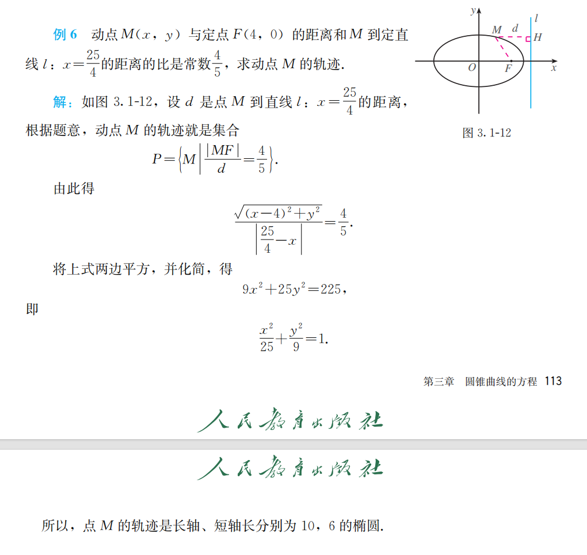

# 圆锥曲线的方程

## 3.1.1 1 椭圆的定义

同学们，之前我们学习过圆的定义和方程，知道圆是平面内到定点距离等于定长的点的轨迹。今天我们要来探索另一种常见的曲线。首先大家看，老师手里拿的这个纸板上，有一根细绳和两个图钉。如果把细绳两端固定在同一点，笔尖拉紧绳子移动，画出的是圆；但如果把细绳两端分开固定在两点，笔尖拉紧绳子移动，会画出什么曲线呢？同学们看，在这个过程中，笔尖始终满足到两个固定点的距离之和不变。这种曲线我们称为椭圆。这就是我们今天要学习的内容。

刚才的实验中，绳子的长度是固定的，假设为 $2a$。笔尖移动时，到两个固定点 $F_1$ 和 $F_2$ 的距离之和始终等于绳长 $2a$。那么椭圆的定义可以这样描述：

平面内与两个定点 $F_1$、$F_2$ 的距离之和等于常数（大于 $|F_1F_2|$）的点的轨迹叫做椭圆。我们把这两个固定点称为椭圆的焦点，两焦点之间的距离称为椭圆的焦距，焦距的一半称为半焦距。

这里有三个关键条件需要注意：

- “平面内”：限定了研究范围是二维平面；
- “两个定点”：即椭圆的焦点，用 $F_1$、$F_2$ 表示；
- “距离之和为常数且大于焦距”：设常数为 $2a$，则必须满足 $2a > 2c$。如果 $2a = 2c$，轨迹是线段 $F_1F_2$；如果 $2a < 2c$，轨迹不存在。

同学们，今天我们通过一个简单的实验认识了椭圆，重点学习了：

椭圆的定义：平面内到两定点距离之和等于常数（$2a > 2c$）的点的轨迹；
关键条件：常数必须大于焦距，否则轨迹可能是线段或不存在；

下节课我们将根据定义推导椭圆的标准方程。课后请大家完成课本练习。好，今天的课就到这里，同学们再见！

## 3.1.1 2 椭圆的标准方程

同学们，在之前的学习中，我们已经了解了椭圆的定义，知道平面内与两个定点 $F_1$ 、 $F_2$ 的距离之和等于常数（大于 $|F_1F_2|$ ）的点的轨迹就是椭圆。那在生活中，椭圆可是无处不在呢！像美丽的行星轨道，很多都是近似椭圆形状；还有我们常见的椭圆形镜子、建筑中的椭圆造型等等。

大家想一想，我们已经知道了圆的方程可以简洁地表示圆上点的特征，那椭圆能不能也用一个方程来准确描述呢？答案是肯定的！今天，我们就一起来探索椭圆的标准方程，看看如何用数学语言精准刻画椭圆的“模样”。

为了推导出椭圆的标准方程，我们要利用椭圆的对称性来建立合适的平面直角坐标系。我们以过两焦点 $F_1$ 、 $F_2$ 的直线为 $x$ 轴，线段 $F_1F_2$ 的垂直平分线为 $y$ 轴来建系。这样一来，两焦点 $F_1$ 、 $F_2$ 就关于 $y$ 轴对称啦，假设两焦点坐标分别为 $F_1(-c,0)$ ， $F_2(c,0)$  ，这里的 $c$ 表示半焦距。

设椭圆上任意一点 $M(x,y)$ ，根据椭圆的定义， $|MF_1| + |MF_2| = 2a$ （ $2a$ 是大于 $2c$ 的常数）。
由两点间距离公式， $|MF_1| = \sqrt{(x + c)^2 + y^2}$ ， $|MF_2| = \sqrt{(x - c)^2 + y^2}$ ，所以 $\sqrt{(x + c)^2 + y^2} + \sqrt{(x - c)^2 + y^2} = 2a$ 。
这式子看起来有点复杂，别担心，我们来化简它。先把一个根式移到等式右边： $\sqrt{(x + c)^2 + y^2} = 2a - \sqrt{(x - c)^2 + y^2}$  。
两边同时平方： $(x + c)^2 + y^2 = 4a^2 - 4a\sqrt{(x - c)^2 + y^2} + (x - c)^2 + y^2$  。
展开式子： $x^2 + 2cx + c^2 + y^2 = 4a^2 - 4a\sqrt{(x - c)^2 + y^2} + x^2 - 2cx + c^2 + y^2$  。
化简可得： $4cx - 4a^2 = - 4a\sqrt{(x - c)^2 + y^2}$  ，两边再同时除以 $4$ ，得到 $cx - a^2 = - a\sqrt{(x - c)^2 + y^2}$  。
再次两边平方： $c^2x^2 - 2a^2cx + a^4 = a^2(x^2 - 2cx + c^2 + y^2)$  。
继续展开： $c^2x^2 - 2a^2cx + a^4 = a^2x^2 - 2a^2cx + a^2c^2 + a^2y^2$  。
移项合并同类项： $(a^2 - c^2)x^2 + a^2y^2 = a^2(a^2 - c^2)$  。
因为 $a > c$ ，设 $b^2 = a^2 - c^2$ （ $b > 0$ ），那么方程就变成了 $\frac{x^2}{a^2} + \frac{y^2}{b^2} = 1$ （ $a > b > 0$ ），这就是焦点在 $x$ 轴上的椭圆标准方程。

如果我们把焦点放在 $y$ 轴上，两焦点坐标为 $F_1(0, - c)$ ， $F_2(0, c)$  ，同样按照前面的方法去推导。设椭圆上一点 $M(x,y)$  ，由 $|MF_1| + |MF_2| = 2a$ ，经过类似的计算过程，就可以得到方程 $\frac{y^2}{a^2} + \frac{x^2}{b^2} = 1$ （ $a > b > 0$ ），这就是焦点在 $y$ 轴上的椭圆标准方程。

**例1**：已知椭圆的两个焦点坐标分别是 $(-2,0)$ ， $(2,0)$  ，并且经过点 $(\frac{5}{2}, - \frac{3}{2})$ ，求它的标准方程。
**分析**：因为焦点坐标是 $(-2,0)$ ， $(2,0)$  ，所以焦点在 $x$ 轴上，设椭圆标准方程为 $\frac{x^2}{a^2} + \frac{y^2}{b^2} = 1$ （ $a > b > 0$ ），且 $c = 2$  。
根据椭圆定义， $2a = \sqrt{(\frac{5}{2} + 2)^2 + ( - \frac{3}{2})^2} + \sqrt{(\frac{5}{2} - 2)^2 + ( - \frac{3}{2})^2}$ 

$$
\begin{align*}
&=\sqrt{(\frac{9}{2})^2 + ( - \frac{3}{2})^2} + \sqrt{(\frac{1}{2})^2 + ( - \frac{3}{2})^2}\\
&=\sqrt{\frac{81 + 9}{4}} + \sqrt{\frac{1 + 9}{4}}\\
&=\sqrt{\frac{90}{4}} + \sqrt{\frac{10}{4}}\\
&=\frac{3\sqrt{10}}{2} + \frac{\sqrt{10}}{2}\\
&=2\sqrt{10}
\end{align*}
$$

所以 $a = \sqrt{10}$  。
又因为 $b^2 = a^2 - c^2$ ， $c = 2$ ，所以 $b^2 = 10 - 4 = 6$  。
则椭圆的标准方程为 $\frac{x^2}{10} + \frac{y^2}{6} = 1$  。

同学们，今天我们学习了椭圆的标准方程。首先，我们通过合理建立平面直角坐标系，利用椭圆的定义推导出了两种情况下的标准方程：焦点在 $x$ 轴上时是 $\frac{x^2}{a^2} + \frac{y^2}{b^2} = 1$ （ $a > b > 0$ ），焦点在 $y$ 轴上时是 $\frac{y^2}{a^2} + \frac{x^2}{b^2} = 1$ （ $a > b > 0$ ） ，这里要记住 $b^2 = a^2 - c^2$  。
在求椭圆标准方程时，关键是要先确定焦点的位置，然后根据已知条件求出 $a$ 、 $b$ 的值。通过例题和练习，相信大家对椭圆标准方程的求解有了更深入的理解。课后大家要多做练习，巩固所学知识，有问题随时来问老师。好啦，今天的课就到这里，同学们再见！ 

## 椭圆例题

同学们，之前我们学习了椭圆的定义和标准方程，知道了满足特定条件的动点轨迹是椭圆。那在实际问题中，我们如何通过已知条件去确定动点的轨迹呢？这就需要我们掌握求动点轨迹方程的方法啦。比如，当给出动点到定点的距离和到定直线距离的关系时，我们该怎么去求解它的轨迹呢？今天我们就通过一道典型例题来深入学习这个内容，掌握相关的解题思路和方法，这对于我们理解和运用圆锥曲线的知识非常重要哦。

我们来看这道例题：动点 $M(x,y)$ 与定点 $F(4,0)$ 的距离和 $M$ 到定直线 $l$ ： $x = \frac{25}{4}$ 的距离的比是常数 $\frac{4}{5}$  ，求动点 $M$ 的轨迹。
设 $d$ 是点 $M$ 到直线 $l$ ： $x = \frac{25}{4}$ 的距离，根据题意，动点 $M$ 的轨迹就是集合 $P = \{M|\frac{\vert MF\vert}{d}=\frac{4}{5}\}$  。
根据距离公式， $\vert MF\vert=\sqrt{(x - 4)^2 + y^2}$  ， $d=\vert x - \frac{25}{4}\vert$  ，由此得到 $\frac{\sqrt{(x - 4)^2 + y^2}}{\vert x - \frac{25}{4}\vert}=\frac{4}{5}$  。
接下来进行化简，两边平方可得：

$$
\begin{align*}
\frac{(x - 4)^2 + y^2}{(x - \frac{25}{4})^2}&=\frac{16}{25}\\
25((x - 4)^2 + y^2)&=16(x - \frac{25}{4})^2\\
25(x^2 - 8x + 16 + y^2)&=16(x^2 - \frac{25}{2}x + \frac{625}{16})\\
25x^2 - 200x + 400 + 25y^2&=16x^2 - 200x + 625\\
25x^2 + 25y^2 - 16x^2&=625 - 400\\
9x^2 + 25y^2&=225\\
\frac{x^2}{25}+\frac{y^2}{9}&=1
\end{align*}
$$

这个方程符合椭圆的标准方程形式 $\frac{x^2}{a^2}+\frac{y^2}{b^2}=1$ （ $a\gt b\gt0$  ），其中 $a = 5$ ， $b = 3$  ，所以点 $M$ 的轨迹是长轴长为 $2a = 10$ ，短轴长为 $2b = 6$ 的椭圆。

同学们，我们来回顾一下今天学习的内容。
首先我们复习了求动点轨迹方程相关的重要知识点，包括两点间距离公式、点到直线的距离公式以及求轨迹方程的一般步骤。然后通过这道例题，我们详细学习了如何根据动点到定点的距离与到定直线距离的比例关系来求解轨迹方程。在解题过程中，我们先根据条件列出等式，再通过合理的化简得到了椭圆的标准方程，从而确定了动点的轨迹。

大家在做这类题目时，要牢记公式，按照步骤细心计算。在化简方程时，要注意运算的准确性。通过今天的学习，希望大家对求动点轨迹方程有更清晰的认识，课后多做练习巩固，遇到问题可以随时来问老师。好啦，今天的课就到这里，同学们再见！ 